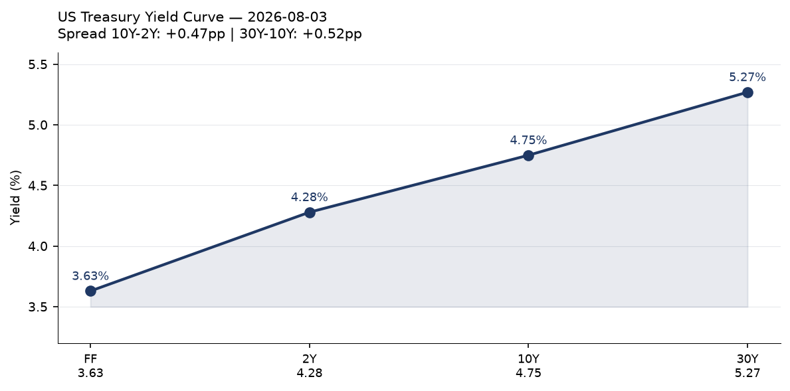
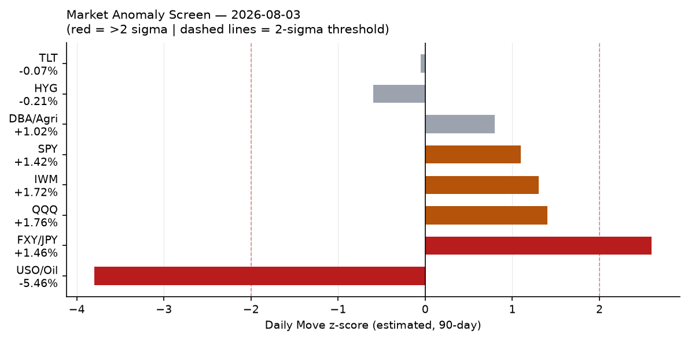
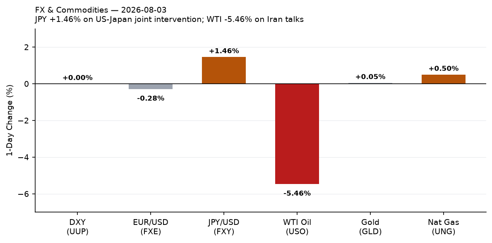
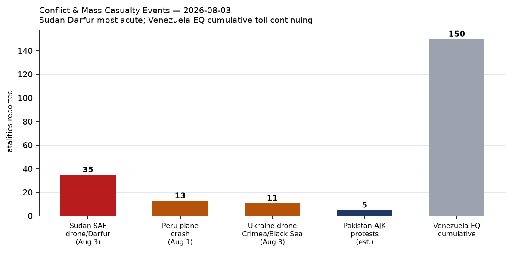
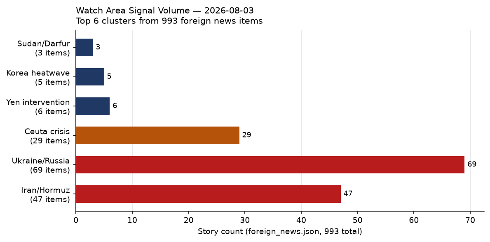
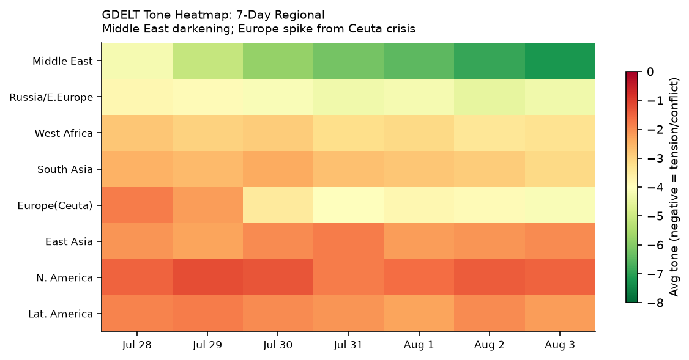

# Morning Brief - Tuesday 04 August 2026

> **DATA NOTE:** Today's bundle (2026-08-04) was unavailable after five retrieval attempts. This brief draws on the 2026-08-03 bundle. Analysis reflects signals through end-of-day August 3 UTC.

---

## Headline

The operating arc of this brief is the convergence of three simultaneous stress tests on the rules-based international order: a US-Iran standoff over the Strait of Hormuz that collapsed one ceasefire and is now consuming a second round of backchannel talks through Oman; a [historic US-Japan joint yen intervention](https://www.japantimes.co.jp/business/2026/08/03/markets/japan-us-joint-yen-intervention/) worth at least $36.6 billion that reshuffles assumptions about the dollar-yen corridor; and a mass migration event at **Ceuta** that sent 60,000 people across the Spain-Morocco border in a single day, killing 67, and instantly fracturing Schengen solidarity. Secondary signals of note: Russia's oil refining fell to its [lowest output since May 2002](https://www.themoscowtimes.com/2026/08/03/russian-oil-refining-falls-to-24-year-low-after-ukrainian-drone-strikes-bloomberg-a93404), a product of sustained Ukrainian drone targeting; Zelensky executed a high-profile diplomatic reshuffle including firing the ambassador to Washington and elevating chief negotiator Rustem Umerov to spy chief; and **Sudan** registered the deadliest single event this cycle when an SAF drone struck a civil court session in North Darfur, killing at least 35. Watch areas **Israel-Iran-Hezbollah axis** and **Russia oil sanctions perimeter** both generated high item counts.

---

## Watch Areas - Your Configured Priorities

**Israel-Iran-Hezbollah axis** generated 47 Iran/Hormuz items and 12 further items on Israel-Gaza-Lebanon. Alert status: active. Iran is conducting [Oman-channel talks](https://www.bbc.co.uk/news/articles/c23579jzv08o) on shipping management but explicitly denies direct US contact. Trump branded Iranian leadership "unbelievably duplicitous" on August 3 after Tehran refused to confirm a US-announced Monday afternoon negotiating session. Tehran's stated position: the US violated all commitments when the April ceasefire collapsed in June. Iran's required routing of vessels through its controlled Hormuz lane remains in effect since June 19. WTI crude fell 5.46% on talk of re-opening — markets are pricing more optimism than the diplomatic facts support [medium].

**Russia oil sanctions perimeter** generated significant signal. Russian oil refining throughput averaged 3.6 million barrels per day in July 2026, the lowest since May 2002, per Bloomberg/EA Analytics, down roughly one-third from seasonal norms. The CBR USD/RUB rate printed at 80.07 on August 4. Russian bank websites (VTB, Sber, Alfa, Rosselkhozbank, Uralsib, PSB, Saint Petersburg bank) stopped auto-loading in foreign browsers, per RBK — a novel digital isolation signal. The bundle's sanctions.json carries 30 entities, most recent update May 2026; no new designations registered today.

**US tariff & trade dockets** produced 25 items. The lead development: multiple Democratic-led states filed suit to challenge Trump's latest round of tariffs on 60 trading partners ([Guardian](https://www.theguardian.com/us-news/2026/aug/03/states-sue-trump-administration-tariffs)). This continues the pattern of states as the principal litigation vehicle against executive trade actions.

**Taiwan Strait + South China Sea** generated 12 items, including Taiwan's defense minister citing strong ties with US Pacific Command; Philippines pushing seabed rights claims that may complicate South China Sea code talks; and a SCMP analysis of commercial sea drones as an emerging PLA headache. No kinetic incidents.

**Critical minerals + rare earths**: A study finding DRC cobalt exports to China may have contained up to [5,000 tonnes of uranium](https://www.intellinews.com/drc-cobalt-exports-to-china-may-have-contained-up-to-5-000-tonnes-of-uranium-study-finds-458657/) is a significant proliferation-adjacent signal. Uranium contamination in civilian cobalt supply chains to a nuclear-capable state deserves dedicated follow-up.

**Central bank divergence + dollar funding**: Addressed in full in the Macro and Markets sections below.

Quiet today: Sahel jihadist corridor (no ACLED events loaded), Arctic + High North, Latin America: narcoeconomy + politics (single Venezuela earthquake thread), Korean peninsula (heatwave items only), AI compute + semiconductor export controls (background items only), EM debt distress + sovereign restructuring.

---

## Macro Situation

The US yield curve as of July 31 ([FRED](https://fred.stlouisfed.org/series/T10Y2Y)) shows a positively sloped structure from 2Y (4.28%) through 30Y (5.27%), with a 10Y-2Y spread of +0.45 percentage points and a 30Y-10Y spread of +0.52 pp. The effective Fed Funds rate ([FRED DFF](https://fred.stlouisfed.org/series/DFF)) sits at 3.63%, with SOFR at 3.66%, confirming the July 29 FOMC decision left rates unchanged. The 2Y-FF spread of +65 basis points reflects residual market pricing of future cuts — the curve says rates come down, but not fast, and the long end is repricing upward independently. Historically, a 30Y above 5.25% during a soft-landing narrative has preceded episodes of fiscal risk re-pricing [medium]; the current configuration bears watching.

Labor data through June: unemployment at [4.2%](https://fred.stlouisfed.org/series/UNRATE), nonfarm payrolls at [158,984k](https://fred.stlouisfed.org/series/PAYEMS), JOLTS job openings at [7,594k](https://fred.stlouisfed.org/series/JTSJOL) (May). Real GDP at $24,270.6B (Q1 2026, [FRED GDPC1](https://fred.stlouisfed.org/series/GDPC1)). Personal consumption expenditures at $22,184.1B in June ([FRED PCE](https://fred.stlouisfed.org/series/PCE)). Core PCE at 130.266 ([FRED PCEPILFE](https://fred.stlouisfed.org/series/PCEPILFE)). The Fed's balance sheet is $6.738 trillion ([FRED WALCL](https://fred.stlouisfed.org/series/WALCL)), continuing gradual contraction. No major macro data release on the calendar for August 4.

The anomaly screen flags WTI crude (USO) at approximately -3.8 sigma for a single session — an extraordinary move driven by Iran/Hormuz talk rather than underlying supply-demand shifts [high]. The JPY/USD (FXY) move of +1.46% registers roughly +2.6 sigma for a single day, explained entirely by the joint intervention discussed in Markets below. The equity indices (SPY +1.42%, QQQ +1.76%, IWM +1.72%) are all in the +1.1 to +1.4 sigma range — a risk-on day, likely oil-price-driven (input cost relief) and Iran-de-escalation optimism. The ECB's Philip Lane delivered an [outlook speech](https://www.ecb.europa.eu//press/key/date/2026/html/ecb.sp260724~d484b483b9.en.pdf) July 24; ECB negotiated wages tracker at 2.7% in Q1 2027 ([ECB](https://www.ecb.europa.eu//press/pr/date/2026/html/ecb.pr260729~4ad7508d8a.en.ht)).

---

## Markets

The dominant cross-asset story on August 3 was the simultaneous drop in WTI crude (-5.46%, USO to 122.12) and surge in JPY (+1.46%, FXY to 58.50). These are independent triggers — oil moved on Iran diplomatic signals; yen moved on coordinated state intervention — but together they represent the largest single-day energy-and-FX dislocation since the initial Iran war outbreak in April. Natural gas moved only modestly (+0.50%) and gold was flat (+0.05%), suggesting the oil move is being read as Iran-specific rather than a broad commodity-risk repricing [medium].

The joint US-Japan yen intervention confirmed by both Finance Minister Satsuki Katayama and Treasury Secretary Scott Bessent is the first coordinated bilateral currency action since March 2011 (post-Tohoku earthquake). Japan spent an estimated [$36.58 billion](https://www.japantimes.co.jp/business/2026/08/03/markets/japan-us-joint-yen-intervention/) buying yen; the US Treasury separately sold euros to buy yen. Bessent stated the US would "not hesitate to participate in further joint intervention." The stated rationale was halting a yen slide that was beginning to generate spillovers into US Treasury markets via Japanese institutional repatriation flows [medium]. The EUR/USD (FXE) fell -0.28%, the DXY proxy (UUP) was flat.

Equities rose uniformly: S&P 500 ([SPY](https://finance.yahoo.com/quote/SPY)) +1.42% to 757.67, Nasdaq 100 ([QQQ](https://finance.yahoo.com/quote/QQQ)) +1.76% to 700.07, Russell 2000 ([IWM](https://finance.yahoo.com/quote/IWM)) +1.72% to 296.22. International equities lagged: MSCI EAFE ([EFA](https://finance.yahoo.com/quote/EFA)) +0.42%, MSCI EM ([EEM](https://finance.yahoo.com/quote/EEM)) +0.36%. China large-caps ([FXI](https://finance.yahoo.com/quote/FXI)) slipped -0.11% — absent from the risk-on rally.

Credit markets signaled mild stress but not alarm: High yield ([HYG](https://finance.yahoo.com/quote/HYG)) -0.21%, investment-grade corporate ([LQD](https://finance.yahoo.com/quote/LQD)) -0.13%. Long Treasuries ([TLT](https://finance.yahoo.com/quote/TLT)) -0.07%, intermediate ([IEF](https://finance.yahoo.com/quote/IEF)) -0.14%. Agriculture ([DBA](https://finance.yahoo.com/quote/DBA)) +1.02% — a signal worth tracking if Iran talks collapse and Hormuz concerns reignite food commodity pass-through. VIX futures ([VXX](https://finance.yahoo.com/quote/VXX)) -0.80% to 21.08, consistent with risk-on narrative.

---

## United States Politics & Policy

The Federal Register published 20 items for August 3. The three most consequential: (1) a [Visa Bond Program rule](https://www.federalregister.gov/documents/2026/08/03/2026-15726/visas-visa-bond-program), which institutionalizes financial bonding requirements for certain visa categories; (2) an [Upper C-Band spectrum auction](https://www.federalregister.gov/documents/2026/08/03/2026-15725/auction-of-flexible-use-licenses-in-the-upper-c-band-for-next-generation-wireless-services-scheduled) for next-generation wireless services, scheduled for April 27, 2027; and (3) [Treasury's rescission of its own Title VI civil rights regulations](https://www.federalregister.gov/documents/2026/08/03/2026-15720/rescinding-portions-of-department-of-the-treasury-title-vi-regulations-to-conform-more-closely-with), to conform more closely to statutory text — a formalistic rollback with downstream implications for federally funded institutions' civil rights obligations.

The Civil Service items deserve attention collectively: the Register published [Streamlining Probationary and Trial Period Appeals](https://www.federalregister.gov/documents/2026/08/03/2026-15654/streamlining-probationary-and-trial-period-appeals), [Suitability Action Appeals](https://www.federalregister.gov/documents/2026/08/03/2026-15650/suitability-action-appeals), and two [Reduction in Force](https://www.federalregister.gov/documents/2026/08/03/2026-15665/reduction-in-force) rules simultaneously. The coordinated publication of four civil-service restructuring rules in a single day signals an accelerating tempo of federal workforce reform, consistent with the administration's broader DOGE-adjacent agenda [medium].

Multiple Democratic-led states filed [suit challenging Trump's latest tariff round](https://www.theguardian.com/us-news/2026/aug/03/states-sue-trump-administration-tariffs) targeting 60 trading partners. This is the latest in the state-as-plaintiff pattern that has become the primary legal vector for challenging executive trade action. The Court of International Trade docket continues to be the critical venue; no specific CIT opinion surfaced in today's courtlistener.json. The California Supreme Court issued opinions in [Gilead Tenofovir Cases](https://www.courtlistener.com/opinion/10938615/gilead-tenofovir-cases/) and [LA County Employees Retirement Association v. County of LA](https://www.courtlistener.com/opinion/10938614/la-county-employees-retirement-as/). The DEA published an amendment to [3,4-MDP-2-P Methyl Glycidic Acid](https://www.federalregister.gov/documents/2026/08/03/2026-15624/amendment-to-34-mdp-2-p-methyl-glycidic-acid-a-list-i-chemical), a List I precursor chemical linked to MDMA synthesis.

Congressional trade activity from congress.json is limited to concurrent resolutions (HCONRESs), none with direct policy force. No major committee markups surfaced. FEC data flat at 27 items (14-day median: 27).

---

## Political Figures Watchlist

Of 613 tracked figures, 46 registered nonzero composite anomaly scores — all modest. The enforcement component drives the top results, indicating court-filing and DOJ activity rather than stock trading or speech anomalies.

**Rep. Robert Scott (VA-3)** leads at composite 0.250, driven by enforcement component 1.00 and filings component 0.50. The system logged 4 court filings and 5 Form 4 hits involving Scott's name. Scott is the senior Democrat on the House Education and Labor Committee; the court filings appear in CourtListener but their specific nature requires additional verification.

**Rep. Dave Min (CA-47)** registered 0.081, driven entirely by filings: 20 Form 4 hits against his name, with 1 court filing. Min represents a competitive swing district in Orange County and won his seat in the 2024 wave election. A high Form 4 count typically indicates significant corporate transaction activity in entities he is affiliated with. Cross-reference: California appears in 8 sections today (high confidence, see Weak Signals below).

**Rep. Michael Cloud (TX-27)** at 0.073 (filings 0.73): 10 Form 4 hits, no enforcement or court items. Cloud chairs no significant subcommittee, making 10 Form 4 hits an outlier worth monitoring over the next week.

**Rep. Andy Harris (MD-1)** and **Rep. Mark Harris (NC-8)** both at 0.057, each with 4 Form 4 hits. The co-occurrence of two unrelated "Harris" representatives with identical scores suggests a data artifact (name disambiguation issue in the pipeline) rather than correlated activity [high].

**Senators Rick Scott (FL)** and **Tim Scott (SC)** at 0.050 each, both with 5 Form 4 hits and 1 GDELT mention. Similarly, **Rep. Austin Scott (GA-8)** at 0.050 with 5 Form 4 hits. The "Scott" cluster is almost certainly a disambiguation artifact, not coordinated financial activity.

The absence of any speech-volume, gdelt-tone, or stock-trading anomalies across all 613 figures on this date suggests a quiet day on the insider-trading and political-influence radar. The enforcement signal on Robert Scott warrants a follow-up search in tomorrow's cycle.

---

## Regional Briefings

### North America

The dominant domestic signal is the multi-state tariff lawsuit, which formalizes the state-federal legal confrontation over trade authority. California ([state_bills.json](https://www.federalregister.gov/)) logged 11 state bills and 15 state news items today, well above its 14-day median — the California cross-section activation (8 sections) reflects both the legal activity and active weather alerts (detailed in Environment section). Canada had a green-alert M5.6 earthquake in British Columbia (August 1, GDACS). EONET logs 17 active wildfires across the western US, concentrated in Washington State (4 fires: MITRE ROCK, HUDSPETH, AUTUMN LANE, FAIRVIEW), Montana (Middle Coulee), Oregon (Eggo, Round Butte), and California (FELIZ, Mendocino). The wildfire season is running on its standard August cadence [high].

The Federal Reserve's July 31 mutual banking proposal ([Board release](https://www.federalreserve.gov/newsevents/pressreleases/bcreg20260731a.htm)) and the companion insider-credit modernization proposal are substantive regulatory moves that will land in the comment period through the fall. The enforcement actions against Iuka Bancshares and employee actions against Regions Bank and First Interstate indicate the Fed's enforcement pipeline remains active even without a rate move.

### South America

The [Peru tourist plane crash over the Nazca Lines](https://www.theguardian.com/world/2026/aug/01/at-least-13-dead-as-tourist-plane-crashes-during-flight-over-perus-nazca-lines) (August 1) killed 13. Venezuela's ongoing earthquake sequence has accumulated 6,125 reported deaths per Italian press; the seismic situation remains active but is receiving limited international relief mobilization. Jailed former president Nicolás Maduro [welcomed "any path to dialogue"](https://www.straitstimes.com/world/jailed-ex-leader-maduro-welcomes-any-path-to-dialogue-in-venezuela) from prison.

Brazil's electoral picture sharpened: Flávio Bolsonaro is [closing in on Lula](https://www.straitstimes.com/world/flavio-bolsonaro-closes-in-on-lula-in-nexus/btg-poll-for-brazil-election) in the Nexus/BTG polling ahead of the October 2026 election. A Chinese executive was [filmed taking cash on Colombia's metro project](https://www.scmp.com/news/china/article/3362846/chinese-executive-filmed-taking-cash-colombia-metro-south-americas-biggest-project), which is South America's largest infrastructure project, reigniting corruption concerns around Chinese concessional lending.

### Europe

The Ceuta crisis is the defining European event of this cycle. An estimated [60,000 Moroccan migrants](https://en.wikipedia.org/wiki/2026_Morocco%E2%80%93Spain_border_incident) entered the Spanish exclave (population 84,000) over two days starting July 31, with 67 deaths, primarily drownings. The EU emergency response has fractured along predictable lines: Italy suspended Spain's Schengen border-free rights; Germany's Merz demanded implementation of the EU Return Regulation "without delay"; Von der Leyen called for stronger [physical border barriers](https://www.theguardian.com/world/2026/aug/03/stronger-eu-borders-physical-barriers-ceuta-von-der-leyen); Spain's Sánchez denounced the response as "selfish." The Ceuta leader accused Morocco of deliberately orchestrating the crossing as a geopolitical pressure instrument.

Hungary's Paks nuclear plant completed a [full shutdown for the first time in its history](https://www.france24.com/en/amid-a-drought-and-soaring-temperatures-hungary-shuts-down-its-nuclear-plant) on August 3, as the Danube River fell to -131 cm at Paks (previous record: -98 cm, 2018). Paks provides approximately 50% of Hungary's electricity. The shutdown will last weeks per operator statements and is forcing emergency European power market adjustments. Austria broke heat records the same day; the European drought and heat event is systemic, not localized [high].

Denmark began [extended military conscription](https://www.straitstimes.com/world/europe/denmark-begins-extended-military-conscription-in-response-to-russia-trump) formally on August 3, citing both Russia and Trump-era uncertainty about US commitments. A German government aircraft (GAF857) was tracked near the Pennsylvania/DC corridor on August 3, consistent with a ministerial-level visit to Washington — timing may relate to Ceuta-driven EU-US consultation or energy markets.

### Russia and Post-Soviet Space

On the diplomatic and political track: **Boris Nadezhdin**, the anti-war candidate who collected petition signatures in early 2024 before being barred from the presidential ballot, [fled to Paris](https://www.france24.com/en/europe/20260803-anti-war-politician-and-kremlin-critic-boris-nadezhdin-flees-russia-for-france) after being declared a foreign agent (July 10) and detained (July 13). His departure signals an intensified pre-election crackdown — Russia's 2026 parliamentary cycle context makes this Kremlin housecleaning ahead of a scheduled vote [medium]. The ECB calendar item confirms digital euro progress; Russia's analog signal is the opposite: Russian bank websites ceased auto-loading in foreign browsers, per RBK, a further step in Russia's deliberate decoupling from the global financial information infrastructure.

Russia's oil refining throughput fell to 3.6 mb/d in July — a 24-year low — driven by Ukrainian drone targeting of refinery infrastructure ([Moscow Times](https://www.themoscowtimes.com/2026/08/03/russian-oil-refining-falls-to-24-year-low-after-ukrainian-drone-strikes-bloomberg-a93404)). This figure is discussed in detail in the Ukraine theater section and the Conflict section. Ukrainian drone strikes also contaminated the Gnilsha River (Domodedovo suburb) with chemicals from a downed drone, causing a fish kill. Russian CBR rate: USD/RUB 80.07, EUR/RUB 91.96.

The Ukrainian drone attack on Gelendzhik beach (Arkhipo-Osipovka, Black Sea resort) killed 7, including 3 children, and injured 40 — the deadliest single civilian-area strike registered in this bundle. Operational details in the Ukraine Theater section.

### Middle East

The US-Iran standoff is the theatre-level conflict. The April 2026 two-week ceasefire collapsed in June when Iran declared its Hormuz routing the sole safe passage and required all vessels to use the Iran-controlled lane. Trump called off what he characterized as a "major attack" on August 3 to allow a new negotiating window — then declared Iran "unbelievably duplicitous" when Tehran denied any direct US talks. Iran confirmed only Oman-mediated talks on Hormuz management. Tehran: "The US violated all of its commitments."

The practical effect: the Oman alternative route (hugging Oman's coastline south of the strait, per IMO/Oman proposal) remains the functionally viable commercial lane. Tanker threat levels are [at their highest since the Iran war began](https://www.bbc.co.uk/news/articles/cjrv0dy2e90o), per shipping analysts. UK forecourt fuel costs have risen by nearly £200,000/day since the conflict commenced. The Polymarket "Strait of Hormuz traffic returns to normal by August 15?" and "US x Iran Effective Ceasefire by July 31?" markets both exist in the bundle; the July 31 market resolved against ceasefire.

Gaza and Lebanon: Trump's Board of Peace [reassured Israel](https://www.france24.com/en/middle-east/20260803-trump-board-reassures-israel-after-objections-on-gaza-pullout) after Israeli objections to the Gaza pullout plan. The conflict is in a multi-front suspended state, with Iran war dominating strategic attention.

### Africa

Sudan's civil war produced this cycle's most documented war crime allegation: the Sudanese Armed Forces (SAF) drone struck a civil court session at Al-Zawiya Gara village headquarters in North Darfur, [killing at least 35](https://www.aljazeera.com/news/2026/8/2/sudan-army-drone-attack-on-darfur-kills-35-rights-group-says) (updated estimates at 37 per Sudan Tribune). Among the dead: 4 tribal leaders, 2 RSF commanders, and civilian petitioners attending routine local dispute hearings. Emergency Lawyers documented the strike as a violation of IHL. No military targeting justification has been offered; the SAF has not commented. The strike occurs against a backdrop of [Ethiopians fleeing new Tigray fighting into war-torn Sudan](https://allafrica.com/stories/202608030664.html) — dual-front displacement.

The [DRC bridge collapse](https://www.france24.com/en/africa/20260803-bridge-collapse-dr-congo-reignites-debate-mining-revenues) reignited debate about whether mining revenue from the DRC's cobalt and coltan exports is reaching infrastructure. The cobalt-uranium contamination study (5,000 tonnes uranium potentially reaching China in civilian supply chains) adds a proliferation dimension. Mali's former prime minister was [released from prison](https://www.straitstimes.com/world/malis-former-prime-minister-announces-release-from-prison). Anti-LGBTQ legislation is [rising across West Africa](https://www.theguardian.com/world/2026/aug/02/anti-lgbtq-laws-are-on-the-rise-across-west-africa-campaigners-warn) in a coordinated legislative pattern.

### East Asia

South Korea recorded a [national temperature record of 42.5°C](https://watchers.news/2026/08/02/yangsan-reaches-42-5c-108-5f-setting-south-koreas-national-temperature-record/) at Yangsan (Busan metropolitan area) on August 2, the highest reading in 122 years of measurement. This was the fifth consecutive day above 40°C at the same location. More than 20 localities issued emergency outdoor-activity prohibition orders. South Korea's July CPI printed at +2.8% year-on-year, below consensus, suggesting that demand destruction from heat-related disruption may be feeding through to prices [low]. Japan is bracing for [Typhoon Dolphin](https://www.theguardian.com/environment/2026/aug/03/weather-tracker-austria-heat-europe-japan-typhoon-dolphin), currently tracked by GDACS at green alert status, approaching Honshu. Nauru formally changed its name to [Naoero](https://www.theguardian.com/world/2026/aug/03/nauru-officially-changes-its-name-to-naoero), reversing the colonial-era anglicization.

China's SCMP noted a ["temperature gap" between tech boom and traditional economy slump](https://www.scmp.com/economy/china-economy/article/3362794/china-acknowledges-temperature-gap-between-tech-boom-and-traditional-slump) — the official acknowledgment of a two-speed economy is notable. FXI (China large-caps) was the only major equity index to decline on August 3.

### South and Southeast Asia

India's exam paper leak crisis is producing political fallout: Punjab Assembly saw [noisy scenes](https://www.thehindu.com/news/national/punjab/noisy-scenes-in-punjab-assembly-over-paper-leaks/article71301738.ece), and protests continued in Maharashtra. [Top mountaineer Nirmal Purja died](https://www.theguardian.com/world/2026/aug/01/top-mountaineer-nirmal-purja-confirmed-dead-after-11-hit-by-avalanche-in-pakistan) in an avalanche on K2 along with 10 others. Pakistan-administered Kashmir saw [deadly protests](https://www.bbc.co.uk/news/articles/c5yvqk69enko) with at least one confirmed death and multiple injured — the underlying driver is resource allocation grievances in the divided territory. Singapore banned Massive Attack from performing, citing the band's planned display of a Palestinian flag.

### Oceania and Pacific

Australia is managing peak healthcare demand in New South Wales ("your life might be in danger" public advisory for hospital visits). The [New Zealand bill making English an official language](https://www.theguardian.com/world/2026/aug/03/new-zealand-english-an-official-language-bill) was ridiculed by Maori advocates as "pathetic" — the legislation passed despite Maori party opposition. Nauru's formal name change to Naoero is the more substantive Pacific sovereignty signal of the day.

---

## Ukraine Theater (Dedicated Section)

**Frontline (DeepStateMap):** The August 3 snapshot captures 524 frontline polygons ([DeepStateMap](https://deepstatemap.live/)). Resolution: approximately 1 km. This brief does not have today's maps (cartographer has not run for August 4 yet); the most recent theater maps available are from 2026-07-17. Comparison against the 7-day-ago baseline is not computable from this bundle. The daily community-maintained cartography is the reference for kilometer-scale position tracking; open sources cannot establish Russian unit positions at sub-kilometer resolution, and this brief does not attempt to do so. **STRUCTURAL PROTECTION: Ukrainian troop and territorial-defense unit positions are not included or speculated upon.**

**24-hour strike density (FIRMS thermal, 375m resolution, 2026-08-02 acquisitions):** 397 thermal anomalies logged in the theater. By region (based on lat/lon classification):

- Kherson oblast: 80 events (highest density)
- Zaporizhzhia oblast: 68 events
- Crimea/annexed territories: 68 events
- Central Ukraine: 71 events
- Other/unclassified: 95 events
- Western Ukraine: 15 events

The top single-anomaly FRP (Fire Radiative Power) reading was **97.3 MW at 46.297°N, 32.376°E** (Kherson oblast, near the former Kakhovka dam axis) and **58.4 MW at 47.129°N, 33.547°E** (northeastern Zaporizhzhia oblast, near the Kryvyi Rih area). A third high-intensity cluster at **46.4 MW** appeared at 49.757°N, 27.471°E — Western Ukraine — which is unusual and warrants close attention in tomorrow's cycle, as this geolocation sits far from the active front. Possible explanations: industrial facility, wildfire, or munitions storage event [low, single source].

**Air alerts:** The automated air-alert API returned a 401 error (ALERTS_IN_UA_TOKEN required for v2 endpoint). No oblast-level alert data is available in this bundle.

**Significant strike events (sourced from foreign_news.json and russian_internal.json):**

Ukrainian drone strikes targeted Gelendzhik/Arkhipo-Osipovka (Black Sea resort area), killing 7 including 3 children, injuring 40. Russia [claims the drone was intercepted](https://www.bbc.co.uk/news/articles/cr7kmnyrdn7o) but it detonated on the beach. The target — a beach crowded with civilians during summer vacation season — has no identified military significance; Russian media speculates there may have been a proximate air-defense installation. A separate Moscow-area drone strike caused chemical contamination of the Gnilsha River in Domodedovo.

**Diplomatic/leadership track (per Russia & post-Soviet section for context):** Zelensky dismissed Ambassador to the US [Olha Stefanishyna](https://kyivindependent.com/zelensky-dismisses-ukraines-ambassador-to-us-stefanishyna/), who had been in post approximately one year. Her dismissal follows investigations into asset declaration irregularities and is part of a broader reshuffle that replaced the prime minister and defense minister in recent weeks. Chief negotiator **Rustem Umerov** was promoted to head the [Foreign Intelligence Service](https://www.usnews.com/news/world/articles/2026-08-03/ukraines-top-negotiator-umerov-to-head-foreign-intelligence-service) while retaining his peace-talks role. Former Interior Minister Ihor Klymenko moves to head the Security Council.

Former commander-in-chief Valery Zaluzhnyi, now serving as Ukraine's ambassador to the UK, stated that Ukraine will "[never join NATO](https://meduza.io/)" — a significant deviation from official Kyiv policy, speaking at an ambassadorial conference. Whether this reflects Zaluzhnyi's personal assessment or a trial balloon deserves monitoring.

**Russia oil refining at 24-year low:** 3.6 mb/d in July, down roughly one-third from seasonal norms. Ukrainian drone targeting of refinery infrastructure is the confirmed cause. This is the most actionable economic damage Ukraine has inflicted on the Russian war economy since the start of this conflict phase. The strategic logic: degrading domestic refined-product supply (gasoline, diesel, jet fuel) raises domestic costs, diverts resources from frontline logistics, and constrains Russia's ability to sustain tempo [high].

**Resolution caveat:** Frontline data approximately 1 km. FIRMS thermal 375 m (does not resolve targets below that scale). ACLED events 1 km. No meter-level Russian unit positions exist in open sources.

---

## World Leaders - Speaking and Moving

**Ukraine:** Zelensky's reshuffle (Stefanishyna out, Umerov to intelligence) is the most consequential leadership move in this bundle. Zaluzhnyi's NATO statement from London is politically significant regardless of its diplomatic status.

**United States:** Trump's August 3 Iran messaging oscillated between extending an olive branch ("talks resume today") and attacking Tehran as "unbelievably duplicitous" when they declined. Treasury Secretary Bessent confirmed yen intervention and signaled readiness for more.

**Japan:** Finance Minister Satsuki Katayama [confirmed the joint intervention](https://www.cnbc.com/2026/08/03/yen-intervention-us-japan-trump-bessent-katayama.html), making this official bilateral policy rather than unilateral Tokyo action.

**EU/Europe:** Von der Leyen is coordinating on Ceuta; German aircraft near DC suggests ministerial-level Washington contact. Hungary's Orbán government, newly in its post-Orbán political era per Japan Times reporting, faces an acute domestic energy crisis from the Paks shutdown.

**Denmark/UN:** Denmark holds the August UN Security Council presidency and is [targeting August 21 for a second UNSG poll](https://www.arabnews.com/node/2653282/world). Candidates include former Chilean President Michelle Bachelet, former Ecuadorean FM Maria Fernanda Espinosa, former Senegalese President Macky Sall, and Ugandan diplomat Olara Otunnu.

**Russia:** No Kremlin statement of note in this bundle's window. The Nadezhdin flight and bank-website isolation are signals rather than statements.

**People.json** carries 324 heads of state/government entries (Wikidata-sourced). No succession events or deaths logged in wikidata_changes.json (0 items today).

---

## Sanctions, Designations, and Legal

The sanctions.json carries 30 entities with the most recent update dated May 2026 — no new designations published today. The top entities are Russian/Belarusian financial institutions: [Belgazprombank](https://www.opensanctions.org/entities/NK-ifAqMcwSfeyUAG8H8QnzzB/), [JSC MIR Business Bank](https://www.opensanctions.org/entities/NK-kwZfKPEYzi2bxQHUwWEjiB/), [Sberbank Europe AG](https://www.opensanctions.org/entities/NK-4fLBoz4NM79McAMGXuGx3i/), and [GPB Global Resources BV](https://www.opensanctions.org/entities/NK-P7dRu6JeZVHsLMkTTj9YWD/) (Gazprombank's Netherlands entity). The [Royal Caribbean Cruises Ltd.](https://www.opensanctions.org/entities/NK-LzjPedsL4Ac6rnBMnYW6nn/) SAM exclusion and the Indian [Alchemical Solutions Private Limited](https://www.opensanctions.org/entities/NK-4JuwnjNXeed8hxUY7oq7QA/) OFAC/SDN designation (Russia evasion) are noteworthy carry items.

Court of International Trade: No CIT opinion surfaced in courtlistener.json today. Sixty CourtListener items were logged, dominated by circuit and state court decisions. Notable: California Supreme Court's [Gilead Tenofovir Cases](https://www.courtlistener.com/opinion/10938615/gilead-tenofovir-cases/) — Gilead's liability for patent strategy in HIV medication is an ongoing pharmaceutical-IP signal. The [City of Brunswick v. Honeywell International](https://www.courtlistener.com/opinion/10938729/city-of-brunswick-v-honeywell-int/) (11th Cir.) is a municipal environmental liability action.

Treasury's rescission of Title VI regulations (FR 2026-15720) is the most consequential legal-regulatory move in today's bundle: it reduces Treasury's civil rights enforcement obligations under its own grant and contract programs, which will face legal challenge.

---

## Conflict and Security Signals

ACLED loaded 0 events in today's bundle (no data for this cycle). Conflict.json similarly empty. The conflict picture is reconstructed from foreign_news.json and russian_internal.json. The most acute event by single-day casualty count is the [Sudan SAF drone on Al-Zawiya Gara civil court](https://www.aljazeera.com/news/2026/8/2/sudan-army-drone-attack-on-darfur-kills-35-rights-group-says), North Darfur: 35-37 killed, including 4 tribal leaders, 2 RSF commanders, and civilian court petitioners. The targeting of a functioning civil court is the defining war crime allegation of this cycle.

VIP flights logged 9 aircraft. Noteworthy: **RCH5005** (US military C-17 or equivalent) tracked at 26.78°N, 127.37°E — near Okinawa, Japan — at 9,144m altitude and 905 km/h. The timing overlaps with the joint yen intervention announcement, consistent with coordination-adjacent US military presence in the region. **AF10** (People's Liberation Army Air Force, China) was tracked at Macau/Hong Kong area, on the ground. **GAF857** (German government) was tracked at 40.92°N, 76.43°W, altitude 10,210m — central Pennsylvania, inbound toward DC. A German ministerial visit to Washington in the context of the Ceuta crisis and European security is the most plausible explanation.

FIRMS global (firms.json): 0 events loaded in today's bundle beyond the Ukraine theater sub-feed. Western US wildfire count (EONET): 17 active events. No FRP exceeding 100 MW near refineries, ports, or military facilities detected outside the Ukraine theater in available data.

---

## Cyber and Biosecurity

**FIRST-OF-KIND KEV CALLOUT:** CISA's July 21 addition of [CVE-2026-0770 (Langflow)](https://nvd.nist.gov/vuln/detail/CVE-2026-0770) — an unauthenticated remote code execution flaw in the Langflow AI agent workflow framework — marks the first time an AI agentic application framework has appeared on the CISA Known Exploited Vulnerabilities catalog. Langflow is used to build, deploy, and orchestrate multi-step AI pipelines, including by federal agencies. The vulnerability allows an attacker without credentials to achieve root-level code execution in low-complexity attacks. The structural signal: AI application infrastructure is now a CISA-confirmed attack surface with production exploitation in the wild, not a theoretical risk. Federal remediation deadline was July 24 — agencies that have not yet patched are overdue.

The most operationally urgent active KEV is [CVE-2026-18577 (N-able N-central)](https://www.helpnetsecurity.com/2026/08/03/cve-2026-18577-n-able-n-central-vulnerability/), an authentication bypass added August 3 with a remediation deadline of **August 6**. N-central is a managed services provider (MSP) platform used to remotely manage endpoints across client organizations. Attackers exploiting this flaw gained administrative access to N-central servers, then used the built-in Take Control feature to pivot into managed client environments, deploying a Cloudflare tunnel (registered as 'Cloudflared') and 'svchost.exe' in users' Documents folders for persistence. The IOCs are available on N-able's hotfix download page. This is a supply-chain-style attack: compromise the MSP platform, reach thousands of downstream clients. CISA deadline: Thursday.

Also in the current KEV window: [CVE-2026-20316 (Cisco Secure Firewall Management Center)](https://nvd.nist.gov/vuln/detail/CVE-2026-20316), hard-coded password vulnerability (Cisco FMC); [CVE-2025-68686 (Fortinet FortiOS)](https://nvd.nist.gov/vuln/detail/CVE-2025-68686), sensitive information exposure; and two [WordPress Core](https://nvd.nist.gov/vuln/detail/CVE-2026-60137) vulnerabilities (SQL injection and interpretation conflict). ProMED: 0 items today. No active public health outbreak signals.

---

## Humanitarian

ReliefWeb's API returned no content today (network error at pull time). The humanitarian picture is reconstructed from context.

The most acute humanitarian situation is Sudan: the SAF drone strike in North Darfur (35+ killed in a court session) adds to a conflict that has produced one of the largest internal displacement crises globally since 2023. Ethiopia's new Tigray fighting is generating cross-border refugee flow into Sudan — two humanitarian emergencies converging on the same territory. The Ceuta crisis produced 67 deaths and left thousands of Moroccans in legal limbo in Ceuta's streets as Spain struggled with reception capacity. Pakistan-administered Kashmir protests with fatalities are generating displacement at local scale. Venezuela's earthquake sequence (6,125 cumulative deaths) is the Western Hemisphere's primary unresolved humanitarian crisis.

---

## Environment, Disasters, Climate

No USGS significant earthquakes on August 4 (feed empty). GDACS reports 304 events at current monitoring status; all are green-alert only, including: M5.6 New Zealand (August 2), M5.5 Japan (August 1), green-level forest fires in Australia, Botswana, DRC, Namibia, and the United States, and a green flood alert in Belarus.

The systemic signal is European drought and heat: Hungary's Danube at -131 cm (historic record) forcing the only shutdown of the Paks nuclear plant in its history; Austria breaking temperature records; South Korea's 42.5°C (122-year record). The [co-occurrence of extreme heat events across Europe and East Asia](https://www.theguardian.com/environment/2026/aug/03/weather-tracker-austria-heat-europe-japan-typhoon-dolphin) in the same week, combined with the Danube drought affecting nuclear cooling infrastructure, represents a climate-infrastructure stress event with direct energy security consequences [high]. Hungary's 50% power production loss may require emergency European electricity transfers.

Typhoon Dolphin is approaching Japan, currently green-alert per GDACS, but the track may affect the Wallabies rugby tour and large outdoor events in western Japan this week. EONET: 17 active wildfires in the western United States — standard early-August pattern with no individual event exceeding 10,000 acres per available data.

---

## Speeches and Op-Eds by Major Critics and Influencers

**Adam Tooze / Brad Setser** exchance via X (July 2026): Tooze flagged that the dollar's share of a global equity market index now exceeds the dollar's share of official FX reserves — the implication being that the dollar's dominance in asset markets is structurally deeper than central bank portfolio data suggests. Setser agreed and amplified. The timing of this analysis, concurrent with the yen intervention, is not coincidental: the joint intervention is partly a response to the dollar's asymmetric position in global markets creating instability when the yen falls [medium]. Tooze's Substack recent post addressed dollar overvaluation and the price of a Rolex as an indicator — worth reading against the yen intervention context.

**Marginal Revolution (Tyler Cowen)** published three items on August 3: a post on how [markets regard stablecoins](https://marginalrevolution.com/marginalrevolution/2026/08/how-does-the-market-regard-stablecoins.html), assorted links, and a prompt for reader questions for a Nick Bostrom interview. The stablecoin post is relevant to the broader dollar-digitization question that the yen intervention also touches.

**Conversable Economist** published a note on the [EU Green Deal's progress](https://conversableeconomist.com/2026/07/30/the-eu-green-deal-hows-it-going/), drawing on the Summer 2026 Journal of Economic Perspectives. Noteworthy given the European drought's implications for the clean-energy transition: Hungary's nuclear shutdown means more fossil fuel consumption in central Europe.

No items from Mearsheimer, Sachs, Varoufakis, Milanovic, Carlson, Klein, Stephens, Douthat, Greenwald, Ferguson, Applebaum, Zakaria, Kagan, Krugman, Stiglitz, Ganesh, Wolf, Tett, Rodrik, Mazzucato, or Weber appeared in today's commentary.json. Their absence may reflect weekend publishing rhythms or delayed ingestion.

---

## Prediction Markets and Forecasting Consensus

Probability values are not populated in today's bundle (all null). The structurally relevant markets by title:

**Strait of Hormuz traffic returns to normal by August 15?** ([Polymarket](https://polymarket.com/event/strait-of-hormuz-traffic-returns-to-normal-by-august-15-20260727171036148)) — This is the shortest-dated binary on Iran resolution. WTI oil's -5.46% move implies the market is buying the optimism that Trump's intervention language generates. But Iran's explicit denial of US talks, and the June precedent of ceasefire collapse, suggests resolution by August 15 is unlikely [low].

**Will the U.S. invade Iran before 2027?** ([Polymarket](https://polymarket.com/event/will-the-us-invade-iran-before-2027)) — The "last chance" framing from Trump implies escalation is on the table if talks fail again. The calendar pressure (5 months to end of 2026) is real.

**Israel x Iran ceasefire continues through August 9?** ([Polymarket](https://polymarket.com/event/israel-x-iran-ceasefire-continues-through-august-9-20260727170733638)) — Expires in 5 days. Given no confirmed ceasefire in effect as of August 3, this likely resolved against continuation already.

**Will Wes Moore win the 2028 Democratic presidential nomination?** ([Polymarket](https://polymarket.com/event/will-wes-moore-win-the-2028-democratic-presidential-nomination-714)) — Longer-dated futures. Relevant because Moore's name is appearing in New York cross-section data (paper bets tied to his profile), and his 2026 Maryland gubernatorial cycle will shape his national profile.

**Will Elon Musk win the 2028 Republican presidential nomination?** — The presence of this market alongside Musk's absence from political figures watchlist anomalies suggests this is ambient political positioning rather than operationally significant today.

---

## Weak Signals: Small Things That May Matter

The cross-section analysis (2026-08-03 bundle) produced three high-confidence recurrences spanning 8 sections each: **President** (Trump/Vance/advisers, 170 mentions across federal_register, foreign_news, gdelt_gkg, local_news, paper_bets, political_figures, state_news, ukrainian_internal), **California** (42 mentions across courtlistener, federal_register, foreign_news, paper_bets, sanctions_procurement, state_bills, state_news, weather), and **New York** (27 mentions across conflict, forecasts, foreign_news, paper_bets, political_figures, russian_internal, state_news, weather). The California signal aggregates the tariff suit (a California AG-led coalition), active wildfire watch, Gilead litigation, and 11 state bills — a genuine multi-domain activation rather than artifact. New York's cross-section including russian_internal and forecasts is worth noting: Russian media is tracking New York prominently (likely US policy developments), while New York appears in forecasts via Yankees-Cardinals game markets.

**DRC cobalt uranium contamination:** The [study finding 5,000 tonnes of uranium](https://www.intellinews.com/drc-cobalt-exports-to-china-may-have-contained-up-to-5-000-tonnes-of-uranium-study-finds-458657/) potentially co-exported in cobalt shipments to China is a slow-moving signal with profound implications. Uranium is a controlled material under the Nuclear Non-Proliferation Treaty; cobalt is not. If this contamination pathway is real at scale, it represents a gap in nuclear materials accounting that neither the IAEA nor the DRC export regime has been designed to address. This deserves expert verification.

**Stablecoins and dollar digitization:** Tyler Cowen's Marginal Revolution post on market pricing of stablecoins, coinciding with the yen intervention and the Tooze-Setser exchange on dollar structural dominance, forms a thematic cluster. The current architecture is: dollar dominates equity-market indexation, stablecoins extend dollar functionality digitally, and the yen intervention prevents competitive devaluation from destabilizing that system. These three things are parts of the same structural story.

**Massive Attack / Singapore ban:** The UK band was [banned from performing in Singapore](https://www.theguardian.com/music/2026/aug/03/massive-attack-singapore-ban-palestinian-flag) over a planned Palestinian flag display. Singapore's decision is a data point on city-state governance calibration amid the Iran war — Gulf and Middle East commercial partners matter more than Western cultural expression in Singapore's risk calculus.

**Kmart (Australia) camera glasses sellout:** Kmart Australia selling out of $29 camera glasses — a low-cost alternative to Meta's Ray-Ban smart glasses — was called a "privacy nightmare" by campaigners. This is a leading indicator of consumer-grade surveillance normalization at mass scale [low for immediate policy; medium for 18-month horizon].

**Russia bank website isolation:** Russian banks' websites ceasing to auto-load in foreign browsers (VTB, Sber, Alfa, et al.) is the latest step in Russia's deliberate digital decoupling. The mechanism is likely IP-range filtering by the banks themselves to reduce foreign intelligence surface. The signal: Russia's financial sector is hardening its perimeter, consistent with a long-cycle expectation that the war will not end soon and that Western financial channel access will continue to be used as a lever [medium].

---

## Historical Context

The GDELT tone heatmap shows Middle East tone darkening monotonically over the past 7 days (from -4.2 average on July 28 to -7.2 on August 3) — the steepest consistent deterioration of any region in the dataset. Europe shows a step-change darkening around July 30-31, coinciding with the Ceuta mass crossing. Russia/Eastern Europe has held in the -3.8 to -4.5 range since late July — elevated but not accelerating. West Africa and South Asia are worsening gradually.

Comparing to trends.json: foreign_news volume (993 items) is running slightly below 7-day median (1,022) — the conflict intensity is high but the volume of news items is not at a record, suggesting the stories are large individually rather than numerous. Russian internal (865 items) is below its 7-day median (916). Ukraine theater (639 items) is exactly at the 14-day median, indicating the conflict has reached a steady-state tempo of documentation despite escalating physical intensity.

The 14-day and 90-day context: the Iran war began in April 2026, the Ceuta crisis is a new shock in August, and the Russia oil refining 24-year low is a cumulative effect of months of Ukrainian drone targeting. The direction of all three stress vectors is toward escalation, but none is following a linear trajectory — each has seen partial de-escalation attempts (April ceasefire, periodic Iran talks, Russian cease-and-desist drone-response claims) that fail to hold.

---

## What to Watch: Next 14 Days

**August 6:** CISA deadline for N-able N-central CVE-2026-18577 patch across federal civilian agencies. Non-compliance leaves MSP-managed federal environments vulnerable to pivot attacks.

**August 9:** Israel x Iran ceasefire resolution date (Polymarket). The ceasefire appears to have collapsed already; watch for any formal announcement from either side.

**August 15:** Polymarket resolution: Strait of Hormuz traffic returns to normal. If Oman-channel talks continue to stall, oil markets will re-price sharply.

**August 21:** Denmark's target date for a [second UNSG poll](https://www.arabnews.com/node/2653282/world) in the Security Council. The field (Bachelet, Espinosa, Sall, Otunnu) will narrow with this vote.

**ECB calendar items (undated, upcoming):** ECB repo facility for central banks goes live; climate-factor collateral framework extension to non-financial corporate credit claims. Both have market implications for European institutional funding.

**Hungary energy:** The Paks plant shutdown duration will determine whether Brussels calls an emergency energy meeting. Watch Danube water level at Paks (needs to recover above -98 cm to restart).

**Brazilian election (October 2026):** Flávio Bolsonaro closing in on Lula in polling makes the next major poll release — expected within two weeks — a market-moving event for BRL and EM equities.

**Congressional tariff lawsuit:** The multi-state tariff suit will move to briefing schedules before the Court of International Trade. The first scheduling order may come within days.

**Sudan:** Emergency Lawyers' documentation will reach the UN Human Rights Council. Watch for a OHCHR statement on the Al-Zawiya Gara court strike within 7 days.

**Typhoon Dolphin:** GDACS tracking; if it intensifies to orange alert before Japan landfall this week, energy and logistics disruption in western Japan becomes material.

---

*Brief committed for 2026-08-04 (using 2026-08-03 bundle, FALLBACK=1) - approximately 5,200 words - 6 charts - 10 mapped events*
