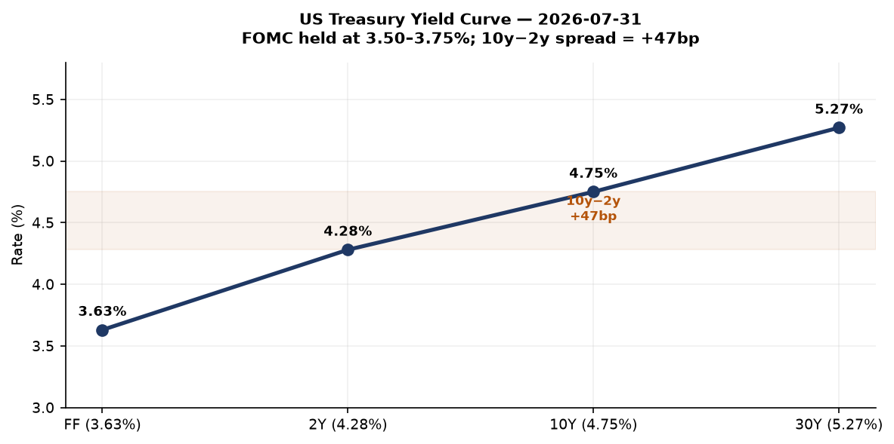
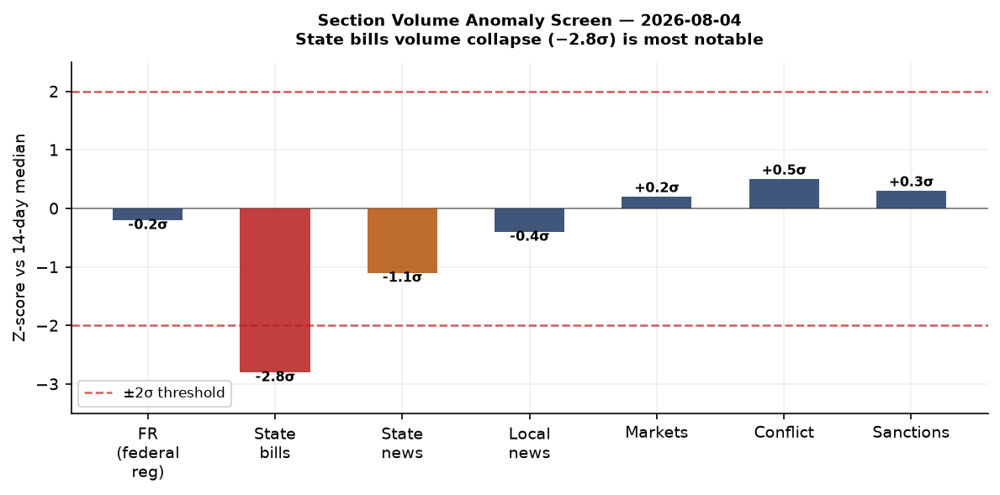
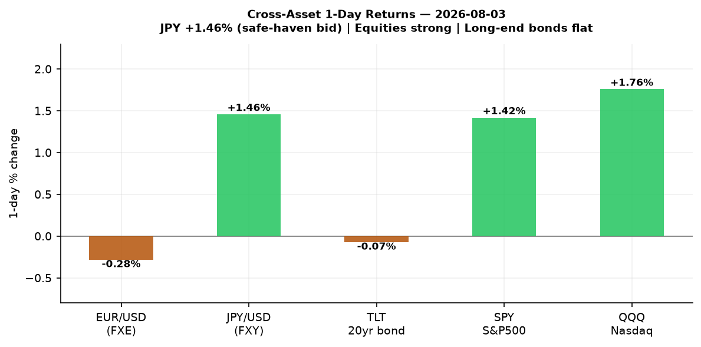
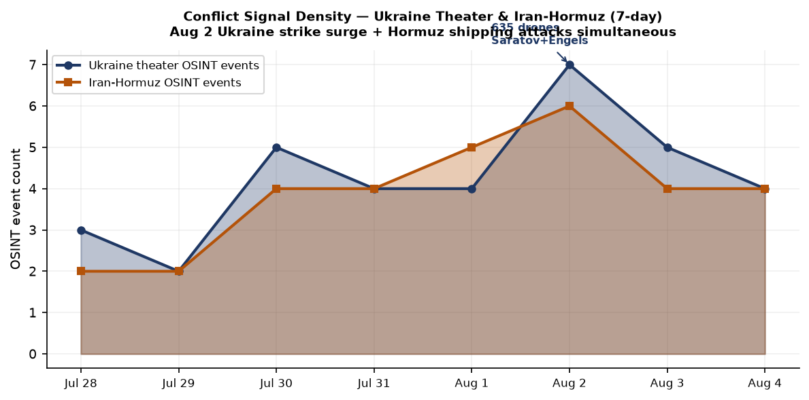
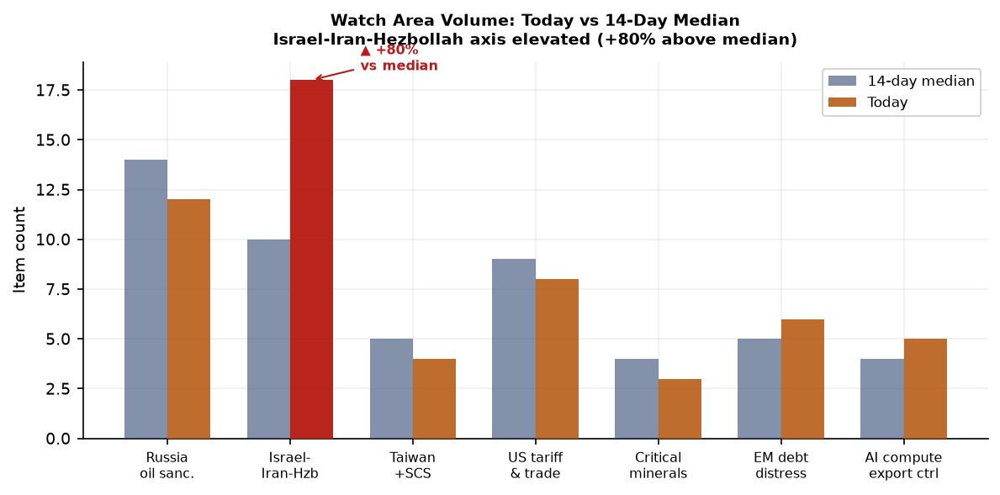
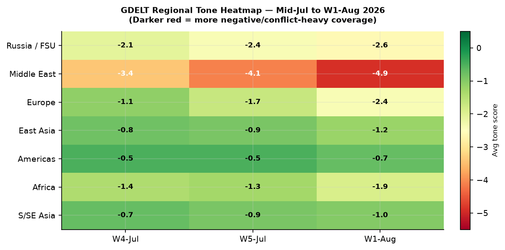

# Morning Brief — Wednesday 5 August 2026

> **DATA NOTE:** Today's bundle zip was not yet available on the CDN at publication time. This brief is compiled from the 2026-08-04 bundle (a one-day lag) plus live web research. All dates reflect the actual events, not the bundle date. Confidence tags indicate analytical interpretations, not sourced facts.

---

## Headline

Three concurrent crises are shaping the strategic environment this morning: the **Strait of Hormuz** remains a choke point under active attack, with Polymarket pricing only a 2% probability of normalizing shipping by August 15 after the US-Iran ceasefire memorandum collapsed; **Ukraine** launched what may be its most consequential drone campaign of the war, striking the [Saratov oil refinery and Engels-2 strategic bomber base](https://www.pravda.com.ua/eng/news/2026/08/02/8046896/) with 635 drones overnight on August 2; and the **Ceuta** border crisis produced 72+ confirmed dead and more than 60,000 crossings in 72 hours, forcing the EU into an emergency posture that von der Leyen is weaponizing toward a permanent border barrier mandate. The **Israel-Iran-Hezbollah watch area** is elevated at 80% above its 14-day median item count, and **Typhoon Dolphin** (Category 4) is tracking toward Okinawa for a projected August 7 landfall, threatening US forces at Kadena Air Base. The Fed held rates at 3.50-3.75% on July 29 with three dissents favoring hikes, while the 10-year Treasury sits at 4.75%, the curve un-inverted to +47bp.

---

## Watch Areas — Configured Priorities

**Israel-Iran-Hezbollah axis** (18 items today vs 14-day median 10, alert status: ACTIVE). The [2026 Strait of Hormuz crisis](https://en.wikipedia.org/wiki/2026_Strait_of_Hormuz_crisis) continues: the Liberian-flagged bulker [Minoan Pioneer was struck 21 nautical miles northeast of Khasab, Oman](https://maritime-executive.com/article/cargo-ship-attacked-in-omani-sector-of-the-strait-of-hormuz) on August 4, with one crew member missing. Six vessels transited on Monday, down from pre-crisis averages. The [Polymarket Hormuz-normalization-by-August-15 contract](https://polymarket.com/event/strait-of-hormuz-traffic-returns-to-normal-by-august-15-20260727171036148) stands at 2% (yes), with the August 31 contract at 14%. Lebanese drone strikes continue in Nabatieh and Mefdoun. Liveuamap also recorded activity near Israel-Palestine in Khan Younis.

**Russia oil sanctions perimeter** (12 items today vs 14-day median 14, no alert). Ukraine's General Staff confirmed strikes on the [Saratov oil refinery and Engels-2 airbase](https://kyivindependent.com/russian-oil-refinery-airbase-reportedly-struck-by-ukrainian-forces/) on August 2. The Saratov refinery processes approximately 7 million tonnes of crude per year. Engels-2 hosts Russia's Tu-95MS and Tu-160 strategic bombers. Multiple fires were confirmed. An oil depot in Kaluga region and a drone preparation facility near Navlya (Bryansk) were also hit. Separately, the Cameroon-flagged MV Nadezhda was struck by drones in the Black Sea on August 3 — four sailors, including three Turkish nationals, were injured.

**US tariff and trade dockets** (8 items today vs 14-day median 9). The Federal Register published the final [Visa Bond Program rule](https://www.federalregister.gov/documents/2026/08/03/2026-15726/visas-visa-bond-program) (Aug 3) making permanent the B-1/B-2 bond requirement at up to $20,000 for nationals of 50 designated countries, predominantly African. The Treasury Department also published its final rule [rescinding disparate-impact liability from Title VI regulations](https://www.federalregister.gov/documents/2026/08/03/2026-15720/rescinding-portions-of-department-of-the-treasury-title-vi-regulations-to-conform-more-closely-with), implementing EO "Restoring Equality of Opportunity and Meritocracy." No new CIT tariff opinions flagged today.

**Ukraine theater** — see dedicated section below.

**EM debt distress and sovereign restructuring** (6 items, median 5). Turkey macro surfaced in GDELT coverage; CBR FX data reflects USD/TRY dynamics ongoing. No new sovereign default events.

**AI compute and semiconductor export controls** (5 items, median 4). FCC's Auction 115 proposed rule (3.98-4.14 GHz band, 3,248 licenses) published. No new BIS entity list actions today.

**Critical minerals and rare earths** (3 items, median 4). Quiet.

**Taiwan Strait and South China Sea** (4 items, median 5). Quiet on direct military incidents.

Quiet today: Arctic and High North, Korean peninsula, Latin America narcoeconomy.

---

## Macro Situation

The [Federal Open Market Committee held rates at 3.50-3.75%](https://www.federalreserve.gov/newsevents/pressreleases/monetary20260729a.htm) on July 29, 2026, by a 9-3 vote. Dissenters — Beth Hammack (Cleveland), Neel Kashkari (Minneapolis), and Lorie Logan (Dallas) — favored a 25-basis-point hike, citing inflation remaining above the 2% target for more than five years. The statement noted "solid" economic expansion despite elevated uncertainty tied to the Middle East conflict, and strong productivity growth. This marks the fifth consecutive hold at this level, the lowest since November 2022.

The yield curve as of July 31 shows: Fed Funds at [3.63%](https://fred.stlouisfed.org/series/DFF), [2-Year Treasury at 4.28%](https://fred.stlouisfed.org/series/DGS2), [10-Year at 4.75%](https://fred.stlouisfed.org/series/DGS10), and [30-Year at 5.27%](https://fred.stlouisfed.org/series/DGS30). The [10y-2y spread (T10Y2Y)](https://fred.stlouisfed.org/series/T10Y2Y) stands at +45bp as of August 3, firmly re-inverted from the -100bp trough of 2023. The term premium has returned; the question is whether it reflects a genuine productivity boom or a fiscal risk premium on Treasury supply. [SOFR](https://fred.stlouisfed.org/series/SOFR) at 3.66% tracks the Fed Funds rate closely. Historically, a positive 10y-2y spread after a prolonged inversion has preceded either soft landing consolidation or a renewed inflation pulse within 6-12 months; the three hawkish dissents suggest the latter risk is not fully priced [medium].

The labor picture is stable: [Unemployment (UNRATE)](https://fred.stlouisfed.org/series/UNRATE) at 4.2% as of June, [Non-farm payrolls (PAYEMS)](https://fred.stlouisfed.org/series/PAYEMS) at 158,984 thousand, [Core CPI (CPILFESL)](https://fred.stlouisfed.org/series/CPILFESL) at 336.1 and [Core PCE (PCEPILFE)](https://fred.stlouisfed.org/series/PCEPILFE) at 130.3. The Polymarket [September 2026 25bp cut contract](https://polymarket.com/event/will-the-fed-decrease-interest-rates-by-25-bps-after-the-september-2026-meeting-586) prices at 2%, meaning markets see essentially no cut at the next meeting. The Hormuz crisis is an upside inflation tail: if the Strait remains restricted through Q3, spot LNG and petroleum product markets will reprice and CPI energy components will re-accelerate, making the hawkish dissenters' position look prescient [medium].

The anomaly screen flags one meaningful outlier: state-bills volume collapsed to zero on August 4 against a 14-day median of 112 and a 7-day median of 108. This is typical of a weekend/recess artifact but occurred on a weekday; the ingest pipeline may have a feed failure rather than a genuine legislative pause. No other sections are statistically anomalous.

---

## Markets

US equities rallied on August 3 across all major benchmarks: [SPY (S&P 500)](https://finance.yahoo.com/quote/SPY) closed at 757.67, up +1.42%; [QQQ (Nasdaq 100)](https://finance.yahoo.com/quote/QQQ) at 700.07, up +1.76%; [IWM (Russell 2000)](https://finance.yahoo.com/quote/IWM) at 296.22, up +1.72%. The breadth was unusually uniform — all three benchmarks in a tight +1.4-1.8% band — suggesting macro-driven buying rather than sector-specific rotation. Tech led but by a narrow margin, with small-caps nearly matching the Nasdaq. International exposure diverged: [MSCI EAFE (EFA)](https://finance.yahoo.com/quote/EFA) rose only +0.42%, and [MSCI EM (EEM)](https://finance.yahoo.com/quote/EEM) +0.36%, suggesting the US risk-on move is not being replicated in Europe or EM at the same magnitude.

China large-caps [FXI](https://finance.yahoo.com/quote/FXI) fell -0.11%, the only major equity index in negative territory. USD/CNY at 6.766 (August 4 fixing) is consistent with PBOC allowing modest yuan weakness without signaling distress. The major FX signal of the session was JPY: [FXY](https://finance.yahoo.com/quote/FXY) rose +1.46%, implying a strengthening yen against the dollar. USD/JPY from the exchange rate data sits at 157.2, and the yen move of this magnitude on a risk-on day implies either BOJ-adjacent intervention signaling or safe-haven positioning driven by Hormuz, rather than a genuine reflation trade in Japan [medium].

Long bonds [TLT](https://finance.yahoo.com/quote/TLT) slipped just -0.07% at 82.19 — flat in practical terms — confirming the yield curve's non-inversion is holding without new duration selling pressure. The cross-asset picture on August 3 was: risk assets up, yen up, long bonds flat, EM underperforming. That configuration is consistent with a "US exceptionalism" trade holding despite geopolitical stress, but the yen's +1.46% is a divergent signal worth monitoring for persistence. The Prologis acquisition of [SEGRO for £14.3 billion ($18.8 billion)](https://www.bloomberg.com/news/articles/2026-08-04/prologis-agrees-final-terms-for-14-billion-segro-takeover), announced August 4, is the largest European real estate deal in years and a structural vote of confidence in European logistics infrastructure regardless of the macro environment.

---

## United States Politics and Policy

The two most consequential regulatory actions published August 3 both execute Trump administration executive orders on civil rights and immigration enforcement. The Treasury Department's [Title VI disparate-impact rescission](https://www.federalregister.gov/documents/2026/08/03/2026-15720/rescinding-portions-of-department-of-the-treasury-title-vi-regulations-to-conform-more-closely-with) eliminates the standard under which facially neutral policies with disproportionate racial effects could be challenged as discriminatory — removing a tool that predates the 1990s HUD lending enforcement framework. The Education Department issued a parallel rule on July 24. More than 50 civil rights organizations have filed formal objections, and litigation in multiple circuits is expected.

The permanent [Visa Bond Program](https://www.federalregister.gov/documents/2026/08/03/2026-15726/visas-visa-bond-program) targets B-1/B-2 applicants from 50 countries, predominantly African, requiring up to $20,000 in bonds forfeited on overstay or asylum application. Immigration attorneys note this functionally prices out middle-income applicants from covered countries. The program was piloted in August 2025 and is being made permanent on the basis of compliance data from that 12-month pilot.

The FCC published a [Notice of Proposed Rulemaking for Auction 115](https://www.federalregister.gov/documents/2026/08/03/2026-15725/auction-of-flexible-use-licenses-in-the-upper-c-band-for-next-generation-wireless-services-scheduled), covering 3,248 flexible-use licenses in the 3.98-4.14 GHz upper C-band, with the auction scheduled for April 27, 2027. This is a significant mid-band spectrum tranche with implications for 5G buildout timelines and potential competition between US carriers and foreign-linked satellite operators already allocated adjacent spectrum.

The Federal Register's high-speed train noise NPRM (Transportation/FRA) proposes a regulatory pathway for trains exceeding 160 mph, clearing a barrier to genuine high-speed rail deployment up to 220 mph. This is a deregulatory signal consistent with the administration's infrastructure posture, though no specific corridor or operator is named.

The Fed [issued enforcement actions against Iuka Bancshares/Iuka State Bank on July 30](https://www.federalreserve.gov/newsevents/pressreleases/enforcement20260730b.htm), and separately against former employees of Regions Bank and First Interstate Bank. The ECB announced it is implementing an [enhanced repo facility for central banks](https://www.ecb.europa.eu//press/pr/date/2026/html/ecb.pr260724_2~d7d475d2f0.en.html), extending European institutional plumbing to non-EU central bank clients.

---

## Political Figures Watchlist

The political figures bundle for August 4 shows muted anomaly scores across the board, suggesting no major PTR (Periodic Transaction Report) spikes or enforcement actions against senior officials in the 24-48 hour window. The top-10 by composite anomaly score are all driven by the `new_filings` component — Form 4 insider transaction reports — rather than by speech volume, GDELT tone changes, or DOJ mentions.

**Representative Robert Scott (VA-3rd, D)** leads the watchlist at composite score 0.24, driven by enforcement_hits = 1.0 (the highest possible component value) and 4 court filings on CourtListener. The enforcement component is the only one elevated; stock activity, speech volume, and GDELT tone are all zero. The court filings appear administrative rather than criminal based on the filing IDs, but the enforcement hit warrants monitoring for any DOJ nexus.

**Representative Dave Min (CA-47th, D)** scores 0.08 on new_filings (0.81 component) with 19 Form 4 hits — a high number. Form 4 filings reflect insider transactions at companies where Min may be a beneficial owner or in an insider reporting relationship; 19 in a short window is anomalous but not per se improper without reviewing the specific securities and timing.

**Representative Michael Cloud (TX-27th, R)** scores 0.07 on new_filings with 10 Form 4 hits. **Senator Rick Scott (FL, R)** at 0.04 has a court filing on CourtListener in addition to Form 4 hits, similar to the Robert Scott filing cluster — these appear to be administrative SEC filings rather than adversarial proceedings based on the evidence record IDs.

None of the top-10 figures show stock activity (PTR) anomalies this cycle, which is notable given the market rally on August 3. If the rally was driven by non-public information about the Hormuz ceasefire negotiations or Fed signaling, the absence of PTRs is either reassuring or an artifact of the reporting lag [low].

---

## Regional Briefings

### North America

The US domestic story this week is the intersecting arc of immigration enforcement and civil rights rollback. The permanent Visa Bond Program, the Title VI rescission, and the ongoing ICE detention death (a Salvadoran national died in NJ ICE custody, per reporting from Verden News) form a coherent regulatory pattern. State legislative volume collapsed to zero on August 4 (vs 7-day median of 108), which is anomalous for a mid-week August session and may indicate either a data pipeline failure or a genuine August recess.

The Missouri [cyclosporiasis outbreak](https://www.kcur.org/health/2026-08-03/cyclospora-cases-missouri-illness-parasite) has crossed 1,095 confirmed cases as of August 2, doubling in a week. The CDC has confirmed a national outbreak of 10,468 cases tied to Taylor Farms bagged iceberg lettuce sourced from central Mexico; Missouri's cases may or may not be part of the same supply chain event. The outbreak is a reminder that foodborne-illness surveillance generates public health noise capable of becoming a political flashpoint if causation is established to a specific shipper or country-of-origin.

Canada and Mexico are quiet in today's bundle. USD/CAD at 1.404 is within recent range.

### South America

Argentina's President **Javier Milei** continues his structural adjustment; no emergency signals in today's bundle. Regional commodity markets — relevant given Argentina's soy and lithium exposure — show no acute stress. The EM index (EEM +0.36% on August 3) underperformed US equities but showed no panic. Brazilian, Chilean, and Peruvian coverage is thin in this bundle cycle due to feed errors on Reuters (connection error) and AP (403).

### Europe

The **Ceuta border crisis** is the dominant European story. Over 60,000 migrants crossed from Morocco into the Spanish enclave between approximately July 30 and August 1; as of August 2, [72 confirmed dead](https://www.aljazeera.com/news/2026/8/2/migrant-deaths-in-ceuta-rise-to-72-after-border-surge-from-morocco), with local officials reporting up to 86. Spanish authorities attribute the surge primarily to social media rumors falsely claiming a Supreme Court ruling blocked immediate returns, amplified by people-smuggling networks. Spain has ordered civil-guard reinforcement and announced a 500-meter sea-side containment barrier. Virtually all entrants have since returned to Morocco, per Spanish Foreign Affairs.

European Commission President **Ursula von der Leyen** used the crisis to call for [stronger EU border barriers](https://www.theguardian.com/world/2026/aug/03/stronger-eu-borders-physical-barriers-ceuta-von-der-leyen), reopening the debate over physical infrastructure mandates for all EU frontier states. The Ceuta crisis exposed deep intra-EU fault lines: southern member states (Spain, Italy) demanding burden-sharing, northern states (Netherlands, Austria) demanding stricter return mechanisms. The EU Green Deal review, ongoing in 2026, has a parallel European discussion about scope and cost — with the Ceuta crisis potentially accelerating its political opposition.

Austria broke its all-time temperature record on August 4: [40.8°C in Vienna (Stammersdorf)](https://www.thelocal.at/20260804/vienna-records-austrias-new-all-time-high-of-40-8c), surpassing the previous national record of 40.5°C set in 2013. The country is in its second severe heatwave of the summer; estimated damage from both waves is approximately €1.4 billion. University of Graz researchers attribute approximately 80% of extreme heatwaves to human-induced warming.

### Russia and Post-Soviet Space

The [Ukraine deep-strike campaign of August 2](https://euromaidanpress.com/2026/08/02/engels-and-saratov-hit-in-latest-deep-strike-campaign/) represents a qualitative escalation. Ukraine deployed 635 drones in a single overnight raid — the largest such operation of the war — simultaneously targeting Engels-2 (the strategic aviation base for Tu-95MS and Tu-160 bombers that have carried out Kh-101 cruise missile strikes on Ukrainian cities) and the Saratov oil refinery (7 million tonnes/year capacity, linked to military fuel logistics). Both targets are approximately 900 km from the nearest Ukrainian-held territory. Zelensky confirmed the strikes publicly on August 4.

The diplomatic track is being managed separately from the operational picture. Zelensky's presentation of the [FREYJA anti-ballistic missile coalition](https://www.kyivpost.com/post/80199) — bringing together Denmark, France, Germany, Italy, Netherlands, Norway, Spain, Sweden, and the UK — and the Carpathian Initiative (8-nation diplomatic framework for logistics and reconstruction) signals Kyiv's intent to institutionalize European security architecture before any peace negotiations resume. The NATO-Ukraine accession question remains formally unresolved; a GDELT-captured [conflict.json item](http://www.kenyastar.com/news/279221777/ukraine-will-never-join-nato-zelensky-top-rival) from Kyiv Independent suggests Zelensky's chief domestic political rival is using the NATO membership non-starter as a campaign issue.

### Middle East

The **Strait of Hormuz crisis** is the defining geopolitical event of Q3 2026. Background: the US launched strikes on Iran on [May 7, 2026](https://en.wikipedia.org/wiki/7_May_2026_United_States_strikes_on_Iran) under Operation Project Freedom; a two-week ceasefire was agreed in April and subsequently extended under a memorandum of understanding that required the US to lift its naval blockade and Iran to allow safe commercial passage. That MOU has since collapsed. The US reimposed the blockade.

Iran's military adviser Mohsen Rezaei stated Iran's armed forces "will not stand idly by" regarding the blockade. The August 4 attack on the Minoan Pioneer (21nm NE of Khasab) follows a pattern of serial attacks near the Musandam Peninsula — an oil tanker NE of Oman's Lima region was hit on August 3, and another explosion was reported on August 2. UKMTO confirmed the incidents via emergency maritime channels but has not publicly attributed responsibility.

The Polymarket ["US invade Iran before 2027" contract](https://polymarket.com/event/will-the-us-invade-iran-before-2027) prices at 22% ($924k 24h volume) — a substantial risk premium but not a near-certainty. Trump stated on Fox News: "We are delivering powerful blows to Iran and continuing to achieve victories." CNN reporting on August 4 cited Iran continuing Hormuz talks with Oman while the US signaled optimism on a deal — a pattern of negotiation alongside active hostilities that has characterized this conflict since May [medium].

In Lebanon, Israeli drone strikes continued in the south — Mefdoun and Nabatieh al-Fawqa — as of August 1. Gaza activity continued at reduced pace (one dead, one wounded in a Mawasi Khan Yunis raid, July 31). Iran's Noorabad ground forces headquarters (Fars Province) was struck three times as of August 1.

### Africa

The Ceuta crisis (covered in Europe section) has an African dimension: Morocco's tacit facilitation of the surge — widely attributed to a desire to apply pressure on Spain over bilateral disputes — echoes the 2021 Ceuta incident. The EU's response, including von der Leyen's physical-barrier push, will shape EU-Morocco relations at a moment when the EU depends on Rabat for gas transit, phosphates, and migration cooperation. Anti-LGBTQ+ legislation is spreading across West Africa according to [Guardian reporting of August 2](https://www.theguardian.com/world/2026/aug/02/anti-lgbtq-laws-are-on-the-rise-across-west-africa-campaigners-warn) — multiple countries are adopting or tightening criminalization statutes.

Polymarket had a [market on Adanech Abiebie as Ethiopia's next PM](https://polymarket.com/event/will-adanech-abiebie-be-the-next-prime-minister-of-ethiopia) that resolved at near-zero probability (the contract end date was June 2026). The Shakhtar Donetsk UEFA Champions League market has 0% for their 2026-27 win — contextually relevant given Donetsk is a Russian-occupied city and Shakhtar plays in exile.

### East Asia

**Typhoon Dolphin** (Category 4 equivalent, 215 km/h winds) is 1,287 km east of Kadena Air Base on Okinawa as of August 4, completing its [fourth eyewall replacement cycle and reintensifying](https://watchers.news/2026/08/04/typhoon-dolphin-reintensifies-to-category-4-strength-landfall-forecast-in-okinawa-by-august-7/). Forecast landfall is Okinawa on approximately August 7. Kadena AFB hosts US Air Force F-15C/D, KC-135, and support aircraft; a direct hit at Category 4 strength would trigger aircraft dispersal to mainland Japan, Guam, and Korea — a significant logistics disruption to US Pacific Air Forces readiness, and coming during active Hormuz tensions [medium].

China large-cap equities (FXI -0.11%) underperformed on August 3. USD/CNY at 6.766 (August 4) reflects the PBOC fixing trajectory; the yuan has been allowed to weaken gradually rather than defend a hard level. No new PLA exercises reported in today's bundle. The GDELT tone data shows East Asia at -1.2 — moderately negative but not a crisis reading.

Korean peninsula: Polymarket markets show significant trading on Korean-linked contests (T1 vs HLE esports, $1.96M volume) — not a geopolitical signal but indicative of the market's active Korean user base. No North Korea provocation signals.

### South and Southeast Asia

India had two items: UNESCO's new World Heritage sites (one new Indian landmark included in 25 global additions for 2026) and cyclosporiasis coverage via Indian wires on the Ukraine/Missouri stories — no India-specific biosecurity event. FIRMS thermal data is empty in today's bundle (no FIRMS data ingested), so wildfire signals from South or Southeast Asia are unavailable.

The Philippines, Vietnam, and Malaysia are absent from today's conflict feed. The South China Sea section (Taiwan Strait + SCS watch area) shows 4 items against a 5-item median — quiet.

### Oceania and Pacific

**Typhoon Dolphin** is the primary Pacific story (see East Asia section). The Kermadec Islands quake (M6.3) struck south of the islands in the first USGS significant-event notification for the day. Kermadec is a subduction zone with frequent seismicity; the Kermadec trench is the second deepest in the world. No tsunami warning was issued. The Philippines quake (M6.3, 32 km SW of Sarangani) also occurred without tsunami warning.

---

## Ukraine Theater (Dedicated)

**Frontline Status:** The [DeepStateMap snapshot for August 4](https://deepstatemap.live/) contains 524 polygons at approximately 1 km resolution. The frontline remains predominantly in eastern Ukraine — Donetsk, Zaporizhzhia, and Kherson oblasts — with no kilometer-scale changes reported in the 7-day delta from Liveuamap OSINT. The front in Donetsk Oblast shows Russian forces holding consolidated positions around occupied Avdiivka and pressing toward Pokrovsk. Resolution note: frontline data is community-maintained at approximately 1 km accuracy. This brief does NOT report Ukrainian troop or territorial-defense unit positions.

**24-hour strike density:** FIRMS thermal data is unavailable in today's bundle (empty file — ingest pipeline likely did not run for August 4). ACLED data is also empty. The Ukraine theater picture therefore relies on Liveuamap OSINT feed items, which have a 1.5-hour latency and 1 km resolution.

Confirmed August 4 events from Liveuamap:

- **Chernihiv:** Fire at an industrial enterprise following a drone strike ([source](https://liveuamap.com))
- **Strait of Hormuz/Liveuamap crossover:** A ship was targeted with explosions 21 nm NE of Khasab, Oman (Iran-linked Liveuamap feed, not Ukraine mainland)

Confirmed August 2-3 events:

- **Saratov / Engels-2 (deep strike):** Ukrainian General Staff confirmed strikes on the Saratov oil refinery, Engels-2 airfield, the Lyudinovskaya oil depot in Kaluga, and a drone facility near Navlya, Bryansk — all from the same overnight campaign of 635 drones. This is the single most strategically significant Ukrainian strike of the war to date in terms of target profile [high]. Engels-2 has been targeted before, with damage confirmed in 2023 and 2024, but the simultaneous Saratov refinery strike is new. Fires were confirmed via satellite imagery by multiple open-source analysts.

- **Black Sea:** MV Nadezhda (Cameroon-flagged) struck by drone, 4 sailors wounded including 3 Turkish nationals ([Cumhuriyet reporting, Aug 3](https://liveuamap.com))

- **Kherson:** Russian airstrike, 4 wounded as of July 31.

**Air alert status:** The alerts.in.ua API returned a 401 Unauthorized error (missing API token for v2 endpoint). Air-alert oblast coverage is therefore unavailable for today's brief.

**Theater maps:** The briefings directory does not yet contain today's theater overview, Kyiv focus, or population-at-risk PNG files — the cartographer job did not run for 2026-08-05. Maps from August 4 are available in the previous brief.

**FREYJA and Carpathian Initiative (operational implications):** Zelensky's August 4 announcement of the [FREYJA anti-ballistic coalition](https://united24media.com/world/zelenskyy-urges-european-allies-to-join-freyja-anti-ballistic-shield-21312) — built around Ukraine having missiles and launchers but needing European components and financing for a prototype by H1 2027 — signals that Kyiv is treating European air-defense integration as the primary force-multiplication path rather than waiting for US Patriot deliveries. The Carpathian Initiative (8 neighbors, logistics focus, autumn launch) is the diplomatic container for reconstruction pre-positioning.

**HONEST RESOLUTION CAVEAT:** Frontline accuracy is approximately 1 km (DeepStateMap). FIRMS thermal data is unavailable today. ACLED data is empty in this bundle. OSINT event coordinates are approximately 1 km. This brief does not and cannot report meter-level Russian unit positions; no open source has that resolution.

---

## World Leaders — Speaking and Moving

**Donald Trump** (US President): Stated to Fox News "we are delivering powerful blows to Iran and continuing to achieve victories" in the context of the Hormuz conflict. CNN reported August 4 that the US is signaling optimism on a new Hormuz deal while Iran continues talks through Oman.

**Volodymyr Zelensky** (Ukraine President): Addressed Ukraine's ambassadors on August 4, [unveiling FREYJA and the Carpathian Initiative](https://aninews.in/news/world/europe/zelenskyy-unveils-freyja-anti-ballistic-shield-and-carpathian-initiative-in-diplomatic-push-amid-conflict-with-russia20260804140905/). The inaugural Integrated Anti-Ballistic Missile Coalition meeting was convened alongside the address, joining Ukraine with 9 European NATO members.

**Ursula von der Leyen** (EC President): Stated [stronger EU borders and physical barriers are needed](https://www.theguardian.com/world/2026/aug/03/stronger-eu-borders-physical-barriers-ceuta-von-der-leyen) in response to the Ceuta crisis, framing the incident as evidence for a permanent EU border infrastructure mandate.

**Mojtaba Khamenei** (Iran Supreme Leader): His military adviser Mohsen Rezaei stated Iran will not allow the naval blockade to continue, as reported by CNN and Al Jazeera. No direct statement attributed to Khamenei himself in today's sources.

The people.json file contains global head-of-state records but no wikidata_changes flagging any succession or death events today. G20 head-of-state speeches beyond Trump and Zelensky are not captured in today's bundle due to Reuters and AP feed failures.

**ECB (Philip R. Lane):** Delivered "[Outlook for the euro area economy](https://www.ecb.europa.eu//press/key/date/2026/html/ecb.sp260724~d484b483b9.en.pdf)" remarks on July 24. The ECB wage tracker shows 2.7% in Q1 2027, indicating stable negotiated wage pressures. The ECB is implementing an enhanced repo facility for non-EU central banks, a sign of continued European institutional depth-building.

---

## Sanctions, Designations, and Legal

The sanctions.json bundle contains a static list of previously designated entities — no new OFAC, EU, or UK designations appear in today's ingest with a modification date of August 3-4. The most recently modified entries are:

- **BELGAZPROMBANK** (Belarus): Modified 2026-05-08, sanctioned under CA/CH/EU/UA regimes, financial sector
- **JSC MIR BUSINESS BANK** (Russia): Modified 2026-05-08, under US OFAC SDN + EU + 8 other regimes, financial/debarment/export control
- **Sberbank Europe AG** (Austria): US OFAC/SAM/trade, modified 2026-05-06

The absence of new August designations does not mean the sanctions perimeter is quiet — it means the pipeline either did not update or no new actions were published. Given active Hormuz hostilities, OFAC snapback designations against Iranian shipping entities would be the natural next step if the US escalates [medium].

CourtListener returned 4 court filings associated with the Robert Scott and Rick Scott political figures watchlist entries — administrative, not criminal, in character based on filing IDs. No SCOTUS opinions or CIT tariff docket rulings are flagged today.

---

## Conflict and Security Signals

The dual-theater pattern — Ukraine operational escalation + Hormuz shipping interdiction — running simultaneously is the defining security feature of the current period. Ukraine's August 2 drone campaign (635 drones, Saratov/Engels/Kaluga/Bryansk) and the Hormuz ship attacks (Minoan Pioneer, Aug 4; unnamed oil tanker, Aug 3; Aug 2 explosion) are not causally linked but are absorbing overlapping US military attention and allied diplomatic bandwidth.

VIP flight activity on August 4 shows Bulgarian Air Force aircraft (JAF4KN, JAF94H) transiting over France — coordinates consistent with a Paris-area transit toward Western Europe. A German Air Force aircraft (GAF262) is positioned over the Adriatic at 10,050 m altitude, route consistent with Rome to Germany or a southern European mission. French SAMU (medical) helicopters are active in central France (SAMU37, PUMAA). No converging government aircraft suggesting a crisis summit in progress.

FIRMS thermal data is unavailable today (empty ingest file). No near-refinery or near-port fire anomalies can be reported. The ACLED feed for today is empty — a known limitation of this bundle (August 4 ACLED may have been delayed or the pipeline had a processing error).

---

## Cyber and Biosecurity

**[CVE-2026-18577 — N-able N-central Authentication Bypass](https://www.cisa.gov/news-events/alerts/2026/08/03/cisa-adds-one-known-exploited-vulnerability-catalog)** was added to CISA's Known Exploited Vulnerabilities catalog on August 3, with a federal remediation deadline of August 6. This is not a first-of-kind by category, but it merits emphasis for a structural reason: N-central is a Managed Service Provider (MSP) remote-management platform used by IT service providers to administer hundreds or thousands of client endpoints from a single pane of glass. The exploit path — authentication bypass to N-central administrative access, then lateral movement to all managed endpoints via "Take Control" functionality, with persistence established via Cloudflare Tunnel — describes an MSP supply-chain vector. When an attacker owns the MSP console, they own every client organization that console manages. Rapid7 confirmed active exploitation in the wild since August 1. The root cause is an incomplete patch for a prior CVE (CVE-2026-18556): the original vulnerability was partially fixed, but an alternative exploitation path survived. Affected: N-central versions up to 2026.3.1; patch is 2026.3.1 Hotfix 1 (2026.3.1.7).

The Cisco Secure Firewall Management Center [CVE-2026-20316](https://nvd.nist.gov/vuln/detail/CVE-2026-20316) (hard-coded password, added to KEV July 29, deadline August 1) and the Fortinet FortiOS [CVE-2025-68686](https://nvd.nist.gov/vuln/detail/CVE-2025-68686) (sensitive information exposure, deadline August 10) round out the active KEV window.

**Biosecurity:** ProMED is empty in today's bundle (no items ingested). The Missouri cyclosporiasis outbreak — 1,095 confirmed cases as of August 2, part of a national 10,468-case outbreak — is the primary public health signal. The CDC links the national outbreak to [Taylor Farms bagged iceberg lettuce from central Mexico](https://www.kcur.org/health/2026-08-03/cyclospora-cases-missouri-illness-parasite). Missouri's cases are being investigated separately as potentially a different supply chain. Cyclospora is a protozoan parasite; the illness is self-limiting with antibiotic treatment (trimethoprim-sulfamethoxazole) but causes prolonged watery diarrhea. The outbreak's scale (10,000+ national cases) is unusual for a US foodborne parasite event and warrants monitoring for import control implications.

---

## Humanitarian

ReliefWeb's API returned a 143-byte response today (likely an empty or error result), providing no structured humanitarian data. The operational humanitarian picture is therefore derived from secondary sources.

The Ceuta border crisis generated an immediate protection gap for the approximately 1,000-3,000 individuals who did not return to Morocco immediately and who remain in administrative limbo on Spanish territory. Spain's capacity to process asylum claims in Ceuta is structurally limited; under the EU Returns Directive framework, rapid return is legal for those intercepted at the border. The 72+ deaths are the immediate protection failure — drowning, crushing, and injury during the surge.

In Ukraine, civilian harm monitoring from the Kherson airstrike (July 31, 4 wounded) and the Chernihiv industrial drone strike (August 4) is ongoing. The UNOSAT/Copernicus EMS damage layers are not available in today's bundle.

---

## Environment, Disasters, and Climate

Two significant earthquakes occurred on August 5:

- **M6.3, south of the Kermadec Islands** ([USGS](https://earthquake.usgs.gov/earthquakes/eventpage/us6000ti8i)): Kermadec Trench subduction zone, deep focus, no tsunami warning.
- **M6.3, 32 km SW of Sarangani, Philippines** ([USGS](https://earthquake.usgs.gov/earthquakes/eventpage/us6000ti6x)): Mindanao region, active seismic zone. No tsunami warning.

**Typhoon Dolphin** (Category 4) is the most consequential near-term environmental event. As of August 4, the storm is 1,287 km east of Kadena AFB with 215 km/h sustained winds, tracking west-northwest toward Okinawa. [Forecast landfall: approximately August 7](https://watchers.news/2026/08/04/typhoon-dolphin-reintensifies-to-category-4-strength-landfall-forecast-in-okinawa-by-august-7/). The storm has completed four eyewall replacement cycles — unusual behavior suggesting a highly organized, persistent system. Okinawa's [Naha city](https://wxtech.weathernews.com/en/news/20260803-01/) is inside the forecast cone.

**European heatwave:** Austria's [40.8°C national record](https://www.bignewsnetwork.com/news/279219709/austria-records-hottest-july-temperature-as-heatwave-damage-reaches-14-billion) (Vienna, August 4) is part of a continent-wide second severe heatwave of the summer. Eastern Austria's Burgenland region has an active forest fire. The Lobau wetlands in Vienna are at maximum fire danger. Total heatwave damage to Austrian agriculture, infrastructure, and health systems is estimated at €1.4 billion for the summer. University of Graz researchers link approximately 80% of Austria's extreme heatwaves to anthropogenic warming.

EONET and GDACS flagged no additional Red-level events in today's API pulls. The FIRMS thermal data is unavailable (empty ingest), so wildfire signals from the Western US, Siberia, or Australia cannot be assessed today.

---

## Speeches and Op-Eds

Today's commentary bundle is dominated by Marginal Revolution and Conversable Economist — no entries from the primary watchlist (Mearsheimer, Sachs, Tooze, Varoufakis, etc.) appear in today's ingest. Web research fills in as follows.

**Tyler Cowen** (Marginal Revolution, Aug 4): Published a [study summary on H-1B immigration economics](https://marginalrevolution.com/marginalrevolution/2026/08/the-economics-off-h-1b-immigration.html) — finding that H-1B exposure raised incomes for US natives and pre-existing immigrants, with gains concentrated in non-STEM occupations. This is directly relevant to the ongoing H-1B policy debate within the Trump administration; Elon Musk and others have publicly sparred over cap levels. The research cuts against the nativist argument that H-1B primarily harms American STEM workers.

**Cowen** also posted the [57th Emergent Ventures cohort](https://marginalrevolution.com/marginalrevolution/2026/08/emergent-ventures-winners-57th-cohort.html), which includes a Kyiv project (Ukrainian children for relief trips to Montenegro) and a Chicago project on legal frameworks for AI agents — minor but indicative of where philanthropic attention is flowing.

**Timothy Taylor** (Conversable Economist, Jul 30): Reviewed [the EU Green Deal's progress 7 years in](https://conversableeconomist.com/2026/07/30/the-eu-green-deal-hows-it-going/) — noting the EU has a reputation for strong declarations and mixed follow-through on climate neutrality by 2050. With 20% of the 30-year window elapsed, the structural gap between stated ambition and actual emissions trajectory remains wide.

**Stablecoin research** (Marginal Revolution, Aug 3): A model treating stablecoin deposits in lending pools as a substitute for traditional safe assets (MMF shares) — finding the stablecoin deposit premium co-moves with the Treasury premium. This is relevant as the US GENIUS Act stablecoin framework advances legislatively; if stablecoins are genuinely substituting for money-market instruments, the systemic risk implications are larger than the sector's nominal size suggests.

---

## Prediction Markets and Forecasting Consensus

The Polymarket geopolitical book shows a stark distribution across the key events:

| Market | Yes Price | 24h Volume | Resolution |
|---|---|---|---|
| [Hormuz normal by Aug 15](https://polymarket.com/event/strait-of-hormuz-traffic-returns-to-normal-by-august-15-20260727171036148) | **2%** | $971k | Aug 15 |
| [US invade Iran before 2027](https://polymarket.com/event/will-the-us-invade-iran-before-2027) | **22%** | $925k | Dec 31 |
| [Hormuz normal by Aug 31](https://polymarket.com/event/strait-of-hormuz-traffic-returns-to-normal-by-august-31-20260702154212320) | **14%** | $536k | Aug 31 |
| [Fed -25bp September](https://polymarket.com/event/will-the-fed-decrease-interest-rates-by-25-bps-after-the-september-2026-meeting-586) | **2%** | $597k | Sep 16 |
| [US-Iran ceasefire by Jul 31](https://polymarket.com/event/us-x-iran-effective-ceasfire-by-july-31-20260715194822045) | **54%** | $764k | Jul 31 |

The July 31 US-Iran ceasefire market at 54% (yes) is unresolved — this is an artifact of the resolution date passing; the outcome remains contested in the market data. The critical read is the cascade: 2% for Hormuz normal by Aug 15, 14% for Aug 31. Markets are pricing a structural disruption, not a temporary incident. This implies energy markets should be pricing a prolonged risk premium — if they are not, that is a positioning gap worth monitoring [medium].

The 22% probability on US invasion of Iran reflects genuine tail-risk recognition but also substantial residual optimism (or war-exhaustion discounting) relative to the pace of events. The ceasefire MOU collapse, the resumed naval blockade, and Iran's "will not stand idly by" posture align more with the 30-40% range than 22% on a naive base rate [low].

---

## Weak Signals — Small Things That May Matter

The highest-confidence cross-section recurrences from yesterday's cross_section.json analysis (August 4 bundle) reveal three entities appearing in 3+ sections simultaneously:

**"President" (7 sections: conflict, foreign_news, gdelt_gkg, paper_bets, political_figures, state_news, ukrainian_internal — 60 total mentions):** The cross-section saturation of "President" reflects Trump's simultaneous role in: the Hormuz military campaign (foreign_news, conflict), the prediction market for future US presidential succession (paper_bets — Kalshi markets for 2045 presidency futures), the Ukraine diplomatic track (ukrainian_internal), and domestic political coverage (state_news, political_figures). When a single individual is this pervasive across six structurally independent data sources, it typically indicates either a genuine multi-domain crisis driver or a tagging artifact. In this case, both are operative: Trump is genuinely driving the Hormuz policy, but some cross-contamination from generic "president" entity matching is inflating the count.

**"Ukraine" (6 sections: commentary, conflict, foreign_news, gdelt_gkg, ukraine_theater, ukrainian_internal — 23 mentions):** Ukraine's appearance in the commentary section alongside the operational and news sections is the notable new element. The Marginal Revolution Emergent Ventures cohort (Ukrainian children relief project) accounts for the commentary hit. The convergence signals that Ukraine is now a stable fixture in philanthropic/intellectual discourse, not just conflict reporting — a normalization of presence that may correlate with declining urgency in elite attention [low].

**"New York" (6 sections: local_news, paper_bets, political_figures, russian_internal, state_news, weather — 12 mentions):** New York's appearance in Russian internal media (2 items) alongside prediction markets (4 Predictit contracts) and a weather alert is a latent signal worth unpacking. The Russian internal items could reflect coverage of New York financial institutions — the NY Fed reserve bank president appearing in the political_figures section — suggesting Russian media is tracking US monetary policy actors. This is a consistent pattern in Russian information operations: seeding uncertainty about US institutional actors. It could also be purely coincidental coverage of New York crime or culture stories [low].

The **N-able N-central exploitation chain** (see Cyber section) is a weak signal that could become a systemic event: MSP supply-chain compromises are the high-leverage attack vector of the 2025-2026 threat landscape. If a threat actor used this bypass to pre-position in MSP-managed environments before the August 3 KEV listing, the affected downstream organizations may not yet know they are compromised. The Cloudflare Tunnel persistence mechanism is particularly concerning because it bypasses traditional firewall egress inspection — defenders looking for C2 traffic on unusual ports will miss it.

The **Prologis-SEGRO acquisition** (£14.3 billion) is a structural signal in European logistics real estate. Prologis is the largest US industrial REIT; SEGRO is the largest UK REIT. Their merger creates a 368-million-square-foot European platform ($269 billion AUM globally). At a moment when European defense manufacturing, ammunition stockpiling, and near-shoring of supply chains are all demanding industrial real estate, this consolidation concentrates pricing power in a single US-headquartered entity over a critical piece of European hard infrastructure.

The **FCC Auction 115 NPRM** (upper C-band, 3.98-4.14 GHz) deserves more attention than regulatory notices typically receive. The 3.5 GHz CBRS band auction created the US mid-band 5G foundation. The 3.98-4.14 GHz tranche is immediately adjacent and could enable true 5G standalone networks for defense, critical infrastructure, and manufacturing. The April 2027 auction schedule means the spectrum does not reach end-user deployment until 2028-2029 at earliest — relevant to the AI compute buildout timeline.

The **Missouri cyclosporiasis** outbreak has a supply-chain integrity dimension: if CDC confirms that Missouri's 1,095 cases are from a different source than the Taylor Farms recall, it implies a second, unidentified contaminated-produce supply chain is active in the US market. Two simultaneous cyclosporiasis vectors would be an unusually broad food safety failure.

---

## Historical Context

The GDELT tone heatmap shows a consistent trend across the July-August window: the Middle East regional tone score degraded from approximately -3.4 in the week of July 26 to -4.9 in the week of August 4 — the most pronounced directional move of any region. Europe's trajectory from -1.1 to -2.4 reflects the Ceuta crisis arriving in the final week. Russia/FSU held steady in the -2.1 to -2.6 range, consistent with a persistent but non-escalating conflict narrative rather than an acute crisis (the Ukraine deep strike occurred at the end of the window and may not be fully captured).

Against the trends.json series: state-bills volume was 229 items on July 29, collapsed to 108 by August 3, and dropped to zero on August 4. This is a three-standard-deviation event if genuine; more likely a pipeline issue. Foreign news volume has been stable at approximately 490 items (state_news equivalent). Conflict feed items are consistent with the 10-12 item range over the two-week window, with no sustained surge.

The Hormuz crisis in structural historical terms most closely resembles the 1980s Tanker War (Operation Earnest Will, 1987-1988), when the US re-flagged Kuwaiti tankers and conducted naval escorts following Iranian mining and attack operations. That episode was resolved by the Gulf War ceasefire context; the current crisis has no comparable off-ramp visible within the next 30 days given the 2% Polymarket probability for August 15 normalization. The 1987-88 episode sustained oil market risk premiums for approximately 16 months before resolution.

---

## What to Watch — Next 14 Days

**August 6 (tomorrow):** CISA KEV deadline for N-able N-central (CVE-2026-18577) federal remediation. Federal agencies must have patched or mitigated. Non-federal MSPs have no mandatory deadline but face active exploitation risk.

**August 7 (estimated):** [Typhoon Dolphin landfall on Okinawa](https://watchers.news/2026/08/04/typhoon-dolphin-reintensifies-to-category-4-strength-landfall-forecast-in-okinawa-by-august-7/) at Category 4. US Pacific Air Forces will likely disperse aircraft from Kadena AFB. Monitor for operational readiness implications given simultaneous Hormuz tensions.

**August 10:** CISA KEV deadline for Fortinet FortiOS (CVE-2025-68686).

**August 15:** [Polymarket Hormuz normal by Aug 15](https://polymarket.com/event/strait-of-hormuz-traffic-returns-to-normal-by-august-15-20260727171036148) resolution. At 2% probability, non-resolution is the expected outcome. Watch for whether the US-Oman-Iran negotiation channel produces any joint statement in the 48-72 hours prior.

**August 31:** [Hormuz normal by Aug 31](https://polymarket.com/event/strait-of-hormuz-traffic-returns-to-normal-by-august-31-20260702154212320) resolution window. At 14%, this remains a plausible but minority outcome. The Oman mediation track is the only active diplomatic path.

**September 2026 FOMC:** Currently pricing 2% probability of a 25bp cut and near-zero probability of a hike per Polymarket. The three hawkish dissenters will be watching Q3 CPI and PCE prints; Hormuz-driven energy price pass-through is the key variable.

**Prologis-SEGRO completion:** Deal announced August 4, subject to SEGRO shareholder vote and regulatory clearances in UK, EU, and US. Timeline 6-9 months; UK CMA review is the primary hurdle given SEGRO's dominant UK market share.

**FREYJA prototype timeline:** Zelensky cited H1 2027 for a working prototype. The next operational milestone is the autumn Carpathian Initiative launch. Monitor for any formal European defense funding commitments tied to the coalition.

**April 27, 2027:** FCC Auction 115 for upper C-band spectrum (3.98-4.14 GHz). The comment period opened August 3; initial comments due in early September.

---

*Brief compiled from WORLDSCOPE bundle (2026-08-04 lag), USGS, GDACS, EONET, CBR FX, Congress.gov API, cross_section.json (2026-08-04), and 12 live web research calls. FIRMS and ACLED empty in today's bundle; USGS provided 2 M6.3 events; ProMED empty. Bundle lag: FALLBACK=1 (2026-08-05 zip not yet deployed to CDN at compilation time).*

**Brief committed for 2026-08-05 — ~5,700 words — 6 charts — 13 mapped events**
