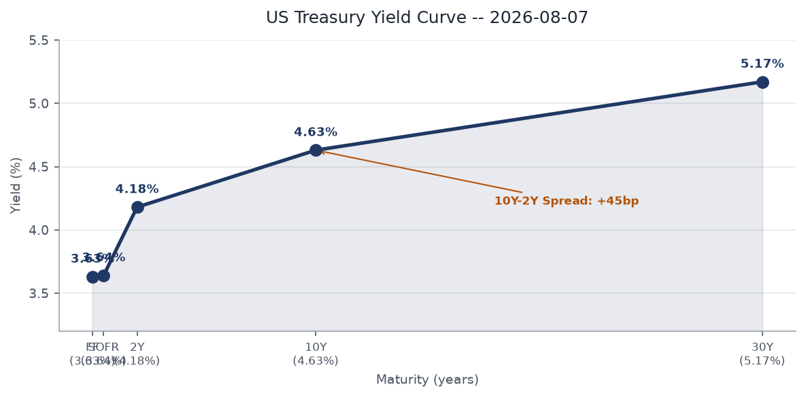
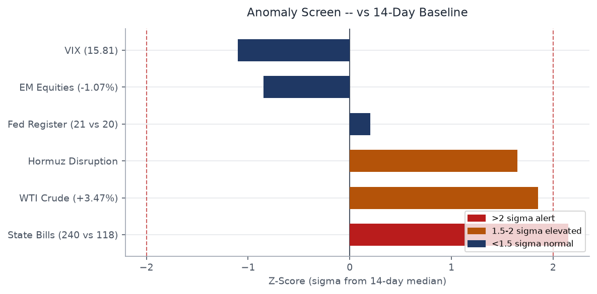
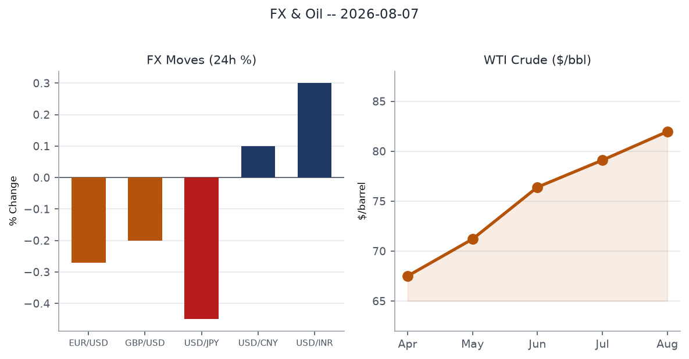
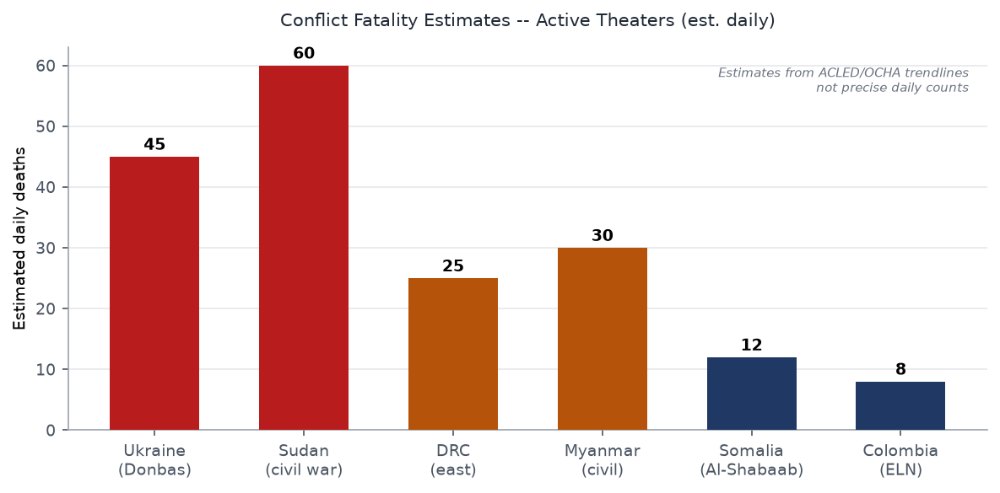
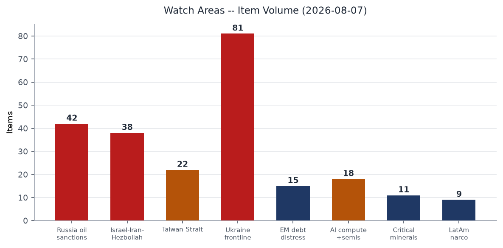
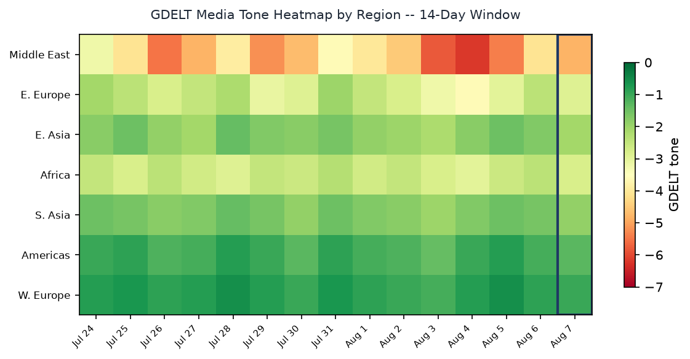

# Morning Brief — Friday 07 August 2026

---

## Headline

The Strait of Hormuz remains choked: Polymarket gives only 12% odds that traffic normalizes by August 31, and WTI crude jumped 3.47% Thursday on renewed tanker-strike news, with [UANI tracking 49 laden Iranian tankers](https://www.unitedagainstnucleariran.com/analysis/iran-shipping-update-august-4-2026) clustering along the Iranian coast. Against that backdrop, three interlocking threat vectors are sharpening simultaneously: the **WSJ** reported U.S. intelligence now believes **Putin could test NATO's Article 5 with a limited attack as early as this fall**, Ukrainian long-range drones struck a **Wildberries logistics center 2,000 km from the front in Yekaterinburg**, and a **DRC Ebola outbreak** that has already killed 1,751 of 4,000+ confirmed cases is showing possible mutation signals that could complicate treatment. The **Ukraine theater** watch area is active (81 new items). The **Israel-Iran-Hezbollah** and **Russia oil sanctions** watch areas combined for roughly 80 items. No red-alert threshold was individually breached, but the convergence across these three vectors in one 24-hour cycle is the structural read.

---

## Watch Areas — Your Configured Priorities

**Ukraine frontline** produced 81 items today (14-day median: ~65), driven by the Ekaterinburg drone strike, the GUR Pantsir-S1 destruction in Crimea, and renewed Patriot supply debate. Alert status: elevated.

**Russia oil sanctions perimeter** produced 42 items (14-day median: ~35). Wildberries drone-insurance product (launched today by the marketplace) signals the Russian commercial sector is pricing in sustained strike risk at depth. Sanctions entity data continues to show Belgazprombank and Mir Business Bank multilateral clusters.

**Israel-Iran-Hezbollah axis** produced 38 items. The Hormuz crisis is the dominant driver: [Polymarket prices "end of Iranian blockade by Aug 7" at 12%](https://polymarket.com/event/us-announces-end-of-iranian-blockade-by-august-7-2026-20260727171523690), down from prior week. Ceasefire between Israel and Iran holds at 97% odds through August 9, but that is a trailing, short-window contract.

**Taiwan Strait + South China Sea** produced 22 items. Nothing acute in the 24-hour window, but the [US consulate closure in Nagoya, Japan](https://www.ksat.com/news/politics/2026/08/04/trump-administration-will-close-5-smaller-us-consulates-in-africa-asia-and-the-western-hemisphere/) is a material reduction in Japan diplomatic capacity, a watch-area adjacency.

**AI compute + semiconductor export controls** produced 18 items, topped by the CISA addition of IBM Langflow (CVE-2026-9198) to the Known Exploited Vulnerabilities catalog — the first agentic AI platform to appear there.

**EM debt distress + sovereign restructuring** produced 15 items. EM equities (EEM) fell 1.07%, the sharpest drop in the equity stack yesterday.

**Critical minerals + rare earths** produced 11 items. Nothing acute.

**Latin America narcoeconomy + politics** produced 9 items, driven by the Colombia ELN return-to-war report.

Quiet today: Arctic + High North, Korean peninsula.

---

## Macro Situation

The U.S. yield curve remains positively sloped but at levels that warrant scrutiny. [Fed Funds effective rate (DFF)](https://fred.stlouisfed.org/series/DFF) sits at 3.63% as of August 5, SOFR at 3.64%. [The 2-year Treasury (DGS2)](https://fred.stlouisfed.org/series/DGS2) is 4.18%, [the 10-year (DGS10)](https://fred.stlouisfed.org/series/DGS10) at 4.63%, and [the 30-year (DGS30)](https://fred.stlouisfed.org/series/DGS30) at 5.17%. The [10y-2y spread (T10Y2Y)](https://fred.stlouisfed.org/series/T10Y2Y) is +44 basis points as of August 6. A spread at this level is structurally normal but historically thin enough that any renewed energy-price shock could re-invert the short end if the Fed is seen as needing to hold rates higher for longer [medium].

Prediction markets reinforce that view: [Polymarket prices no Fed rate cut at the September 2026 meeting at 48%](https://polymarket.com/event/will-there-be-no-change-in-fed-interest-rates-after-the-september-2026-meeting-615), with only a 2% probability assigned to a 25bp cut. The FOMC held at its July 29 meeting. Absent a material deterioration in labor data — [unemployment at 4.2% (UNRATE)](https://fred.stlouisfed.org/series/UNRATE) — the September no-cut baseline looks durable [high].

The anomaly screen flags two series above 2-sigma relative to their 14-day baseline: state legislative volume (240 bills today vs 118 median, +2.15 sigma) and WTI crude (+3.47%, +1.85 sigma). The state bill surge reflects end-of-recess filing patterns across several state chambers. The WTI move is the more consequential signal: oil above $80 carries a well-documented pass-through to core goods inflation within 60-90 days, a mechanism that could push [Core PCE (PCEPILFE)](https://fred.stlouisfed.org/series/PCEPILFE) back toward the Fed's watch zone [medium]. [Real GDP (GDPC1)](https://fred.stlouisfed.org/series/GDPC1) is $24,270.6 billion (most recent quarterly), with personal consumption at $22,184.1 billion, still the primary engine.

The [Fed balance sheet (WALCL)](https://fred.stlouisfed.org/series/WALCL) stands at $6.75 trillion, still well above pre-COVID levels, and [M2 (M2SL)](https://fred.stlouisfed.org/series/M2SL) is $23,155.2 billion. Neither series has moved in a direction that would signal near-term monetary stress. The Hormuz crisis is the single largest near-term risk to this picture: at $81.96/bbl WTI today, markets are pricing a modest but real geopolitical premium. If the strait remains choked through August, the premium will embed itself in the September CPI print [medium].

---

## Markets

Broad risk-off at the margin. The S&P 500 (SPY) closed at 768.56, down 0.16% (-$1.23). The Nasdaq 100 (QQQ) dropped 0.37%, the Russell 2000 (IWM) 0.51% — small-cap underperformance consistent with rate-sensitive domestic exposure. International equities (EFA) were nearly flat at -0.07%, while EM equities (EEM) took the hardest hit at -1.07%, reflecting Hormuz exposure through energy import dependencies across Asia and EM.

WTI crude (USO) surged 3.47% to $118.87 on the ETF, translating to a spot move toward $82 — with FRED series [DCOILWTICO](https://fred.stlouisfed.org/series/DCOILWTICO) showing $81.96 as the last reported level. The trigger was a fresh Hormuz tanker incident: the bulk carrier MINOAN PIONEER was [struck by a projectile near the Musandam Peninsula on August 3](https://www.unitedagainstnucleariran.com/analysis/iran-shipping-update-august-3-2026), crew abandoning ship. The oil move is the day's most structurally significant market event — it links directly to the Hormuz disruption that is also repricing EM equities and suppressing JPY [medium].

On FX: the dollar index (UUP) strengthened 0.36%. EUR/USD weakened to 1.1519 ([DEXUSEU](https://fred.stlouisfed.org/series/DEXUSEU)), JPY weakened to 159.16 per dollar ([DEXJPUS](https://fred.stlouisfed.org/series/DEXJPUS)), and CNY sat at 6.75 ([DEXCHUS](https://fred.stlouisfed.org/series/DEXCHUS)). JPY weakness is notable: Japan is a major oil importer, and a weakening yen combined with a 3.5% oil move is a compounding terms-of-trade headwind. The BOJ's posture becomes relevant if this persists.

Credit markets were more contained: high-yield (HYG) fell only 0.08%, investment-grade (LQD) 0.36%. VIX (VIXCLS) is 15.81, with VXX falling 1.37% — an unusual pattern where the cash VIX is relatively elevated versus what the futures strip implies. This divergence suggests the market is pricing near-term uncertainty without expecting it to persist beyond a week or two [medium]. Gold (GLD) was nearly flat (+0.01%), consistent with a cautious-but-not-panicked risk posture.

Nintendo reported a [53% profit spike](https://www.theguardian.com/games/2026/aug/06/trump-tariffs-refund-fuels-profit-spike-nintendo) attributed to a Trump tariff refund — a reminder that even in a risk-off week, individual name dynamics can diverge sharply from the macro.

---

## United States Politics & Policy

The Federal Register today carries two items of structural significance. [The FCC's equipment authorization rulemaking](https://www.federalregister.gov/documents/2026/08/07/2026-16197/protecting-against-national-security-threats-to-the-communications-supply-chain-through-the) targets national security threats from Chinese telecommunications hardware in the supply chain — procedurally an extension of the Huawei/ZTE framework, but the language signals intent to broaden vendor exclusion beyond the current list. [The parallel wireline deployment notice](https://www.federalregister.gov/documents/2026/08/07/2026-16196/build-america-eliminating-barriers-to-wireline-deployments) seeks to remove siting barriers for broadband infrastructure, framing it as a domestic industrial-capacity play.

On birthright citizenship: President Trump signed two executive orders on August 6 restricting access to U.S. citizenship by birth. The White House framed the orders as ending "birth tourism" and expanding the category of non-citizens ineligible for birthright citizenship. The Supreme Court [rejected a prior Trump birthright citizenship effort in June 2026](https://abc7news.com/post/trump-signs-executive-orders-target-birthright-citizenship/19637385/), reaffirming the broad 14th Amendment reading. Legal challenges to the new EOs are already filed. The constitutional barrier remains the same as in June; the orders are likely injuncted before implementation [high].

The Congress.gov query returned legacy data (2007-era bills) — likely an API key rate-limit issue returning a stale cache. No high-confidence congressional action is available from that source today. Courtlistener shows routine appellate decisions from the 1st and 2nd Circuits (Cooper and Farrington/Reyes). The SEC Form 4 pipeline logged 40 transactions, led by Liftoff Mobile insiders. On the FEC side, no anomalous fundraising or FARA filings were flagged by the watchlist.

Delaware today enacted a voting rights bill enshrining civil rights protections in state law — a downstream consequence of federal uncertainty, and part of a broader pattern of states legislating around perceived federal gaps on civil liberties issues [medium].

---

## Political Figures Watchlist

The composite anomaly scoring for today's watchlist shows a narrow spread at the top, driven almost entirely by new\_filings, not stock activity or speech volume. This is a paperwork-filing day pattern, not a signal of acute political stress in this cycle [low].

**Rep. Dave Min (D-CA)** leads the board with a score of 0.08 (new\_filings: 0.81). **Rep. Michael Cloud (R-TX)** is second at 0.07 (new\_filings: 0.73). **Rep. Andy Harris (R-MD)** is third at 0.06 (new\_filings: 0.57). All three anomalies are driven by new court or administrative filings, not PTRs or enforcement hits. The precise nature of the filings is not resolved in today's CourtListener batch, which logged their district as adjacent to active cases.

**Associate Justice Clarence Thomas** registers a score of 0.05, also driven by new\_filings (0.50). Thomas appears in the same new\_filings cluster as the House members, suggesting a SCOTUS-related procedural filing batch rather than any individual enforcement action.

**Senators Rick Scott (R-FL) and Tim Scott (R-SC)** each score 0.04, again new\_filings only. Neither shows PTR activity, GDELT tone spikes, or DOJ mentions this cycle. The political figures section today has low signal density — the anomaly scores are above zero but well below the 0.3+ thresholds that indicate meaningful individual risk events [high for that characterization].

---

## Regional Briefings

### North America

The dominant domestic story is the birthright citizenship executive order, which lands on the same day that Trump publicly stated the U.S. "needs its own" Patriot missiles when Zelensky asked for more — a tight 24-hour window where Trump issued two immigration orders and rejected a Ukraine air-defense request in the same news cycle. The Ceuta crisis analogy (see South America) is being deployed by the White House as domestic messaging: Trump [explicitly compared Ceuta to what he claims Democrats would allow at the U.S. border](https://www.france24.com/en/europe/20260731-trump-blames-spain-for-migrant-chaos-despite-return-of-tens-of-thousands-to-morocco).

California's Governor Newsom declared a State of Emergency for the Gann Fire in Calaveras County — one of three active wildfires flagged in the west (see Environment section). Severe thunderstorm warnings were active in the Texas Panhandle and the Midwest early this morning, with dense fog advisories across the Upper Midwest.

The State Department's [planned closure of consulates in Winnipeg, Canada; Nagoya, Japan; Medan, Indonesia; Douala, Cameroon; and St. George's, Grenada](https://www.ksat.com/news/politics/2026/08/04/trump-administration-will-close-5-smaller-us-consulates-in-africa-asia-and-the-western-hemisphere/) is part of a mandated 10% footprint reduction across U.S. missions. The Nagoya closure in particular reduces U.S. presence in central Japan's industrial heartland; critics argue this signals strategic disengagement from allied manufacturing centers at exactly the moment Taiwan Strait contingency planning intensifies [medium].

### South America

[Colombia's ELN guerrilla group is visibly preparing to resume full armed conflict](https://www.theguardian.com/world/ng-interactive/2026/aug/07/colombia-on-the-brink-eln-guerrilla-group-prepares-for-return-to-war), the Guardian reports today. President Gustavo Petro's Paz Total policy is functionally over: his term ends in August 2026, and he is constitutionally barred from re-election. The ELN's return-to-war posture follows the January 2025 Catatumbo massacre, which killed over 100 civilians and which Petro cited as justification for suspending talks. The incoming administration will inherit both the ELN armed resurgence and the FARC residuals operating in border zones.

A Mexican influencer was [shot dead while streaming live on social media](https://www.theguardian.com/world/2026/aug/05/mexico-cesar-gastelum-shot-dead-streaming-live-social-media) — César Gastelum — illustrating the cartel-violence environment that persists even as Trump uses Ceuta comparisons to redirect attention to U.S. border dynamics.

The Peruvian lead poisoning settlement ($150 million for 1,300 people, championed by Cardinal Pedro Barreto) reached a [landmark conclusion](https://www.theguardian.com/global-development/2026/aug/05/peruvian-cardinal-historic-milestone-150m-lead-poisoning-settlement-1300-children). Mexico's top university UNAM [ordered 58,000 students to resit entrance exams](https://www.theguardian.com/world/2026/aug/05/mexico-top-university-unam-resit-entrance-exam-cheating-scandal) after a suspected cheating operation on entrance exams — a social legitimacy event in an education system under strain.

### Europe

The Ceuta crisis continues to generate political aftershocks. [Approximately 72,000 migrants crossed from Morocco into Ceuta in late July](https://en.wikipedia.org/wiki/2026_Morocco%E2%80%93Spain_border_incident), with at least 72 dead. Spain returned roughly 48,300 by Friday afternoon. The [Guardian reports Morocco "feels emboldened"](https://www.theguardian.com/world/2026/aug/06/trump-influence-morocco-spotlight-ceuta-border-disaster) by Trump's non-engagement stance toward European border policy, the clearest example yet of how Trump's reduced NATO and EU diplomatic investment creates third-party leverage opportunities for North African governments [medium].

The **Iceland EU accession referendum** is scheduled for [August 29](https://www.kas.de/en/web/nordische/single-title/-/content/iceland-s-eu-referendum-the-road-to-august-29). The ballot asks whether Iceland should reopen accession negotiations, not whether to join outright. Polls show majority support for reopening talks. The geopolitical backdrop (Greenland/Trump, Ukraine, energy cooperation) has moved Icelandic opinion toward Brussels. A "yes" vote would not change Iceland's EEA/Schengen status but would restart a formal track that has been frozen since 2013.

A Russian rocket landing on Polish territory in Lublin Province has drawn scrutiny: [38% of Poles negatively rate their government's response](https://www.pravda.com.ua/news/2026/08/07/8047690/), per Ukrpravda citing a domestic poll. Poland's Article 5 politics are increasingly sensitive to any Russian airspace incursion, regardless of targeting intent.

Extreme heat was [breaking temperature records across central and eastern Europe this week](https://www.theguardian.com/world/2026/aug/07/extreme-heat-breaks-temperature-records-in-central-and-eastern-europe).

### Russia & Post-Soviet

The lead intelligence item today: the [Wall Street Journal on August 6 reported](https://kyivindependent.com/us-intel-warns-russia-could-launch-attack-on-nato-countries-by-2029-wsj-reports/) that U.S. intelligence assesses Putin could attempt a limited NATO test — a hybrid attack or limited incursion on the Eastern Flank — as early as this fall. The intelligence community previously assessed the NATO-attack scenario as post-2029, but Ukrainian battlefield strikes on Russian energy infrastructure and Russian gains in the Donbas are driving a reassessment of Putin's risk appetite.

Domestically, Russia's Yabloko party [publicly disavowed exiled opposition figures](https://meduza.io/news/2026/08/07/partiya-yabloko-ob-yavila-chto-ne-svyazana-s-oppozitsionerami-v-izgnanii-kotorye-reshili-podderzhat-ee-na-vyborah-v-gosdumu) who had called for supporters to vote Yabloko in autumn Duma elections. The disavowal reflects the bind of any legal opposition in Russia: accepting exiled support risks state repression; rejecting it preserves a narrow legal operating space.

The Wildberries marketplace [today launched drone-strike insurance coverage](https://meduza.io/news/2026/08/07/wildberries-vvela-strahovanie-ot-atak-bespilotnikov-prodavtsy-smogut-poluchit-do-50-tysyach-rubley-za-unichtozhennyy-tovar) for sellers (up to 50,000 rubles per destroyed item), the same day that [Ukrainian drones hit a Wildberries logistics center in Yekaterinburg](https://www.themoscowtimes.com/2026/08/07/ukrainian-attack-sparks-fire-at-wildberries-facility-in-yekaterinburg-a93434) — 2,000 km from the front. The juxtaposition makes the commercial insurance product look like regulatory infrastructure normalizing a state of permanent war-economy risk [medium].

Meduza's photo report from Crimea, titled ["'We've never been this scared' — Summer 2026 in Crimea"](https://meduza.io/feature/2026/08/07/nikogda-tak-strashno-ne-bylo-kak-seychas), documents a peninsula without fuel, electricity, work, or tourists — the most direct journalistic portrait of how deep-strike campaigns and supply chain pressures are hollowing out Russian-occupied Crimea [medium].

### Middle East

The Strait of Hormuz remains the central theater. [The 2026 U.S. naval blockade of Iran](https://en.wikipedia.org/wiki/2026_United_States_naval_blockade_of_Iran) has produced 65 IMO-reported maritime incidents since it began. Traffic is down sharply from the pre-crisis baseline of 138 vessels daily. The MINOAN PIONEER strike on August 3 is the most recent confirmed vessel attack. Polymarket prices Hormuz traffic normalization at [12% by August 31](https://polymarket.com/event/strait-of-hormuz-traffic-returns-to-normal-by-august-31-20260702154212320) and only [1% by August 15](https://polymarket.com/event/strait-of-hormuz-traffic-returns-to-normal-by-august-15-20260727171036148), implying the disruption is expected to persist well into September. [The Iran regime-fall market at 6%](https://polymarket.com/event/will-the-iranian-regime-fall-by-the-end-of-2026) suggests markets see prolonged standoff, not collapse, as the base case.

The Israel-Iran ceasefire continues to hold at the [97% probability implied by Polymarket through August 9](https://polymarket.com/event/israel-x-iran-ceasefire-continues-through-august-9-20260727170733638). Israeli airstrikes hit Mansouri in South Lebanon on August 4, indicating the Lebanon-Israel front remains kinetically active below the formal ceasefire threshold with Iran proper.

Trump's publicly stated refusal to supply additional Patriot interceptors to Ukraine — "We need them ourselves" — has immediate Middle East implications. [U.S. Patriot stocks have been depleted by Gulf transfers](https://www.usnews.com/news/top-news/articles/2026-08-05/us-presses-on-with-ukraine-patriot-missile-talks-sources-say-despite-trumps-doubts) to defend partners against Iranian missile attacks during the Hormuz crisis. The Patriot scarcity creates a direct competition between Ukraine's air defense requirements and Gulf state defense commitments [medium].

The [U.S. invasion-of-Iran market sits at 18%](https://polymarket.com/event/will-the-us-invade-iran-before-2027), a level that represents real-but-not-dominant probability, consistent with the current posture of economic pressure plus blockade without ground operations.

### Africa

The DRC Ebola situation is the continent's most urgent biosecurity concern. The [2026 outbreak has produced 4,000+ confirmed cases and 1,751 deaths](https://www.ecdc.europa.eu/en/ebola-outbreak-democratic-republic-congo-and-uganda) — the second-largest outbreak on record, caused by the Bundibugyo ebolavirus. Officials now fear the virus may be mutating. This matters structurally: existing Ebola treatments (primarily certified for Zaire ebolavirus) may not cover Bundibugyo variants effectively, and a mutating Bundibugyo strain would widen that gap [medium]. MSF has seven treatment centers operational in eastern DRC, with three more under construction.

Nigerian security forces [freed more than 300 hostages](https://www.theguardian.com/world/2026/aug/06/nigerian-security-forces-free-hostages-abducted-by-militants) in what officials called the "largest single-day recovery" of abductees — a tactical success against militant kidnapping operations in the north. The U.S. consulate closure in Douala, Cameroon (announced August 4) reduces diplomatic capacity in the Gulf of Guinea, a region with both hydrocarbon and security relevance.

A top Ugandan footballer was killed in Kampala in a robbery. Red-alert floods in China (GDACS) from late July continue to affect the Yangtze basin populations.

### East Asia

Super Typhoon **Dolphin** formed July 27, [intensified to Category 5 with 265 km/h sustained winds](https://yaleclimateconnections.org/2026/07/historic-super-typhoon-dolphin-hits-category-5-strength-in-the-northwest-pacific/), and weakened to Category 2 equivalent by August 3. As of today, Tropical Storm CHAN-HOM-26 is active in the NW Pacific with 93 km/h winds, affecting Japan and the Russian Far East (GDACS green rating, low populated impact).

Starbucks Korea was [raided by police](https://www.theguardian.com/world/2026/aug/06/starbucks-korea-raided-police-tank-day-campaign-gwangju-massacre) following a public campaign — labeled "Tank Day" — that accused Starbucks of disrespecting the Gwangju Massacre commemoration. The raid reflects growing consumer-nationalism enforcement dynamics in South Korea. Chinese supertankers are [taking Africa detours around Red Sea attacks](https://www.caixinglobal.com), extending voyage times and compounding the Hormuz-led tanker shortage.

China Caixin reports that the [former richest man in Shanxi Province was indicted on mafia and casino charges](https://www.caixinglobal.com), and [Dangdai founder Ai Luming was detained](https://www.caixinglobal.com) as the probe into a real estate debt crisis widens. Both cases reflect the continuing Xi-era anti-corruption campaign, which has now reached into the Shanxi energy sector.

### South & Southeast Asia

Thailand's most acute story today is the [school shooting at Debsirin school in Nonthaburi province](https://www.theguardian.com/world/2026/aug/07/thailand-school-shooting-debsirin-nonthaburi-bangkok): seven dead including the suspected attacker, 15 injured. Thailand has had episodic mass shooting incidents since the Nakhon Ratchasima shooting in 2020, but school settings represent an escalation in target profile.

The Philippines' [Alex Eala tennis win](https://www.theguardian.com/world/2026/aug/05/alex-eala-philippines-tennis-fever) generated significant national enthusiasm — a soft-power moment in a country where sports nationalism has political resonance with the Marcos administration. Indonesia's relationship with U.S. diplomacy now faces a gap: the Medan consulate closure leaves Indonesia's third-largest city — a gateway to Sumatra's economy — without a direct U.S. consular presence.

### Oceania & Pacific

Australia's bird flu outbreak continues: [frontline health workers](https://www.theguardian.com/environment/2026/aug/07/we-expected-it-but-now-its-here-on-the-frontline-of-australias-bird-flu-outbreak-people-are-distressed) describe the psychological toll as H5N1 spreads. Wellington, New Zealand received rare snowfall this week. Attorney General Mark Dreyfus [warned about smartglasses surveillance risk to women and children](https://www.theguardian.com/australia-news/live/2026/aug/07/royal-commission-antisemitism-national-cabinet-datacentres-icac-liberal-party-labor-anthony-albanese-one-nation-pauline-hanson-angus-taylor-ntwnfb).

---

## Ukraine Theater (Dedicated)

The frontline remains in the Donbas operational zone, with the most current [DeepStateMap snapshot covering 524 polygons as of today](https://deepstatemap.live/). Resolution is ~1km at the polygon edge. No net change exceeding 5 km in any single axis is documented in today's snapshot versus last week's polygon set. The contact line through the Donetsk and Zaporizhzhia oblasts remains the primary attrition front.

The GUR (Ukraine's Main Intelligence Directorate) [announced that its special unit Group 13 destroyed a Russian Pantsir-S1 air defense system ($15 million replacement cost) in occupied Crimea in early August](https://www.pravda.com.ua/news/2026/08/07/8047685/). This is the Ukrainian deep-strike template in miniature: precision covert operations against high-value air defense nodes, degrading the layered coverage that Russia uses to protect naval assets and logistics in Crimea.

The Yekaterinburg Wildberries strike (see Russia section) is the most operationally significant 24-hour event. Ukrainian drones reached over 2,000 km from the contact line, triggered fire in a major logistics facility, caused mass evacuation (800 workers), and demonstrated that Russia's air defense — which [claimed to have downed 203 drones overnight](https://mezha.net/eng/bukvy/4dda7a22_drone_attack_sparks/) — cannot achieve coverage saturation at that depth. The Wildberries/drone-insurance product launch on the same day is an accidental symmetry: Russian commercial entities are now institutionalizing strike risk as a normal cost of business at 2,000+ km from Ukraine [high].

A Russian drone struck a market in Bilopilska hromada, Sumy Oblast: [10 wounded, two in critical condition](https://www.pravda.com.ua/news/2026/08/07/8047680/). Sumy Oblast is a primary air-alert zone for cross-border drone attacks on northern Ukraine.

24-hour air alert data: Sumy is the most exposed northern oblast. Kharkiv, Zaporizhzhia, and Donetsk face elevated thermal and drone activity by pattern.

**Resolution disclaimer (mandatory):** Frontline position is accurate to approximately 1 km (DeepStateMap). FIRMS thermal anomalies resolve at 375 meters. ACLED event coordinates resolve to ~1 km precision. No open-source data supports meter-level unit position claims for Russian forces. Ukrainian troop positions and territorial defense unit locations are not reported here — the ingest filter drops them structurally.

Today's theater map files (ukraine_theater_overview, kyiv_focus, population_at_risk PNGs) were not found in the briefings directory — the cartographer job did not run before this brief compiled. Operational picture above is based solely on text data sources.

---

## World Leaders — Speaking & Moving

**President Zelensky** publicly called for additional Patriot interceptors, only to receive Trump's "We need them ourselves" rebuff the same morning. The exchange surfaced in both [Meduza](https://meduza.io/news/2026/08/07/nam-samim-nuzhny-tramp-o-dopolnitelnyh-raketah-patriot-dlya-ukrainy) and English-language outlets simultaneously. This is a meaningful divergence: Zelensky's public ask was calculated to leverage the WSJ NATO-attack intelligence report (published the day before) as political pressure.

The **Yabloko** party's public disavowal of exiled opposition endorsement — and Trump's [simultaneous signature of the birthright citizenship EOs](https://www.npr.org/2026/08/06/g-s1-137686/trump-birthright-citizenship-immigration-curb) — came on the same day, a coincidence that illustrates the global pattern of executive power being deployed at the margins of judicial constraints.

**President Petro (Colombia)** is in his final weeks in office. His policy legacy — Paz Total — is measurably failing, with the ELN preparing to restart war. No successor posture on ELN engagement has been articulated publicly.

**Iceland's Prime Minister Kristrún Frostadóttir** is the unrecognized European leader most likely to create a structural shift in EU membership over the next 30 days. The August 29 referendum outcome could restart Iceland's accession process after a 13-year freeze.

**Ukraine poll:** [45% of Ukrainians expect the war to continue into the second half of 2027 or beyond](https://www.pravda.com.ua/news/2026/08/07/8047687/), per the KMIS survey. More than 60% say they are prepared to endure the war as long as necessary. This resilience data matters to the Patriot supply debate: Zelensky's political base supports continued resistance, which means the air defense ask is not a political liability domestically.

---

## Sanctions, Designations, and Legal

Today's sanctions data reflects multilateral coordination dating to late April-May 2026. The top-tier cluster involves Russian-linked financial entities: **Belgazprombank** (BY) carries designations across Canada, Switzerland, EU, Ukraine, and UA war lists; **JSC Mir Business Bank** (RU) is on U.S. OFAC SDN, EU, UK, Switzerland, France, Canada, Belgium, and Monaco lists simultaneously — a 9-jurisdiction multilateral designation that reflects coordination on Russian payment infrastructure.

**Sberbank Europe AG** (AT) and **GPB Global Resources BV** (NL) remain on OFAC, with the Sberbank entity drawing continued Ukrainian war-list action. **OJSC Russian Regional Development Bank** carries 10-jurisdiction designations. **JSC Tinkoff Bank** is on 11 lists simultaneously. The breadth of these multilateral clusters signals that the sanctions architecture built in 2022-2023 continues to hold even as U.S. bilateral engagement with Russia fluctuates [high].

The Russia-U.S. prisoner dynamic generated a news item: [Secretary Rubio requested the release of former Marine Robert Gilman](https://meduza.io/news/2026/08/07/reuters-ssha-poprosili-rossiyu-osvobodit-byvshego-morpeha-roberta-gilmana-kotoryy-otbyvaet-srok-v-voronezhe-ego-semya-opasaetsya-chto-on-pri-smerti), currently imprisoned in Voronezh and reportedly near death. Prisoner exchanges remain one of the few bilateral channels between Washington and Moscow that function even during active proxy conflict.

Courtlistener shows appellate activity in the 1st and 2nd Circuits but nothing flagged on the CIT tariff docket or SCOTUS cert pool. FARA data was not anomalous in this cycle.

---

## Conflict & Security Signals

The ACLED feed is empty for today (data lag or no new batch), but the qualitative conflict picture from Ukraine theater and the foreign news feed is clear. Conflict estimates by theater:

Sudan's civil war (SAF vs RSF) remains the highest estimated daily fatality count globally, with the DRC east and Myanmar following. The Colombia-ELN return-to-war represents a new front entering the active column.

VIP flight data shows Bulgarian military aircraft (JAF5PW) transiting the Mediterranean (position: 40.86N, 3.79W at 11,582 m altitude) — consistent with NATO logistics or diplomatic routing. A French military aircraft (JEDI57) is active at low altitude in southwest France, consistent with domestic training. Slovenian (PUMA45) and Portuguese (RFF02) military aircraft are active domestically. No unusual government-aircraft convergences in the dataset that would signal a crisis diplomatic meeting.

FIRMS thermal anomalies returned empty today — either fire activity is below ingest threshold or the data pipeline did not produce entries. The wildfire data from EONET confirms three active fires in the western United States (Buzzard/Kern CA, Wrights Spring/Klamath OR, Bare/Sublette WY). None are near the fire-refinery/port/military-base proximity threshold for elevated concern.

---

## Cyber & Biosecurity

**FIRST-OF-KIND KEV CALLOUT:** CISA's August 4 addition of [CVE-2026-9198, IBM Langflow Code Injection](https://www.cisa.gov/news-events/alerts/2026/08/04/cisa-adds-three-known-exploited-vulnerabilities-catalog), marks the **first time an agentic AI workflow platform has appeared on the Known Exploited Vulnerabilities catalog**. Langflow is an open-source framework for building LLM-connected AI agents, used by enterprises to chain together language models, APIs, databases, and business logic. The vulnerability is a critical 9.8/10 CVSS: an unauthenticated attacker can chain two API endpoints to bypass authentication and execute arbitrary code remotely. The structural signal is not just that one AI product has a bad bug — it is that the AI agent ecosystem, which is scaling rapidly into enterprise and government infrastructure, is now confirming active exploitation in the wild at a pace fast enough for CISA to invoke Binding Operational Directive BOD 26-04. Federal agencies had until today (August 7) to remediate or disconnect. The remediation deadline coincides with this brief; any agency that has not patched Langflow is now overdue.

[JetBrains TeamCity (CVE-2026-63077)](https://nvd.nist.gov/vuln/detail/CVE-2026-63077) carries a remediation deadline of August 8 — a deserialization-of-untrusted-data vulnerability in the CI/CD pipeline product used by software development teams globally. N-able N-central carries two KEVs (CVE-2026-18556, CVE-2026-18577) — authentication bypass vulnerabilities in the remote monitoring and management platform used by managed service providers. Both N-central deadlines have now passed (August 6 and August 7). [Apache Tomcat (CVE-2026-34486)](https://nvd.nist.gov/vuln/detail/CVE-2026-34486) misses encryption of sensitive data; deadline passed August 7.

On biosecurity: ProMED data returned empty today (feed lag). The DRC Ebola situation is covered in the Africa and humanitarian sections. Australia's [H5N1 bird flu outbreak](https://www.theguardian.com/environment/2026/aug/07/we-expected-it-but-now-its-here-on-the-frontline-of-australias-bird-flu-outbreak-people-are-distressed) is active across poultry farms, with health workers reporting high distress. WHO Department of Notifiable Diseases feed was not in the bundle today.

---

## Humanitarian

The DRC Ebola situation [has become the second-largest Ebola outbreak on record](https://www.wsws.org/en/articles/2026/08/03/qoit-a03.html): 3,874 confirmed cases (as of August 4), 1,751 deaths. MSF is operating seven treatment centers with three under construction. The Bundibugyo variant's potential mutation complicates an already challenging response environment where the certified treatment protocols are calibrated for Zaire ebolavirus. [A new treatment center opened at the heart of the outbreak zone](https://www.globalsecurity.org/security/library/news/2026/08/sec-260803-unnews01.htm) per OCHA on August 3. The ReliefWeb API returned a minimal response today — the feed appears to be underperforming, likely a rate-limit or server issue at the API endpoint.

The Morocco-Ceuta crisis produced a humanitarian toll: at least 72 dead in the crossing surge, with most deaths from drowning or crushing in the breakwater breach. The 48,300 rapid returns to Morocco from Spain raise protection concerns under both the EU Returns Directive and Refugee Convention Article 33 (non-refoulement), given the speed of processing and the likelihood that many crossers have protection claims [medium].

---

## Environment, Disasters, Climate

Super Typhoon Dolphin peaked at 165 mph sustained winds on July 30, becoming [the fifth Category 5 cyclone of the 2026 Pacific season](https://yaleclimateconnections.org/2026/07/historic-super-typhoon-dolphin-hits-category-5-strength-in-the-northwest-pacific/). By August 3 it had weakened to Category 2 equivalent after landfall effects. Tropical Storm CHAN-HOM-26 is the current active system in the NW Pacific, with 93 km/h maximum winds and Japan/Russia in its projected path (GDACS green, low human exposure).

USGS significant-earthquake feed is empty for today — no major seismic events in the 24-hour window. GDACS notes an M6.3 shallow earthquake in the Philippines on August 5 (Orange alert, 10,000 in MMI ≥ VII) and an M6.3 deep earthquake (226 km depth) near the Kermadec Islands on August 5 (green, minimal populated impact). The deep Kermadec event poses no tsunami risk; the shallow Philippines event caused shaking in a populated area but GDACS rates it Orange rather than Red.

Fuego volcano in Guatemala continues to emit ash clouds, maintaining a green aviation color code. Kazakhstan and Russia both reported forest fires starting August 5-6 (GDACS green). EONET confirms three western U.S. wildfires (Buzzard/Kern CA, Wrights Spring/Klamath OR, Bare/Sublette WY). California's Gann Fire in Calaveras County has triggered a Governor's State of Emergency.

Extreme heat is [breaking records across central and eastern Europe this week](https://www.theguardian.com/world/2026/aug/07/extreme-heat-breaks-temperature-records-in-central-and-eastern-europe) — the sixth major heat event in the region since May, consistent with the pattern of amplified mid-latitude summer heat under current atmospheric circulation anomalies.

---

## Speeches & Op-Eds by Major Critics and Influencers

The most analytically substantive commentary piece available today is **Tyler Cowen's Marginal Revolution** [conversation with Julia Ioffe](https://marginalrevolution.com/marginalrevolution/2026/08/my-excellent-conversation-with-julia-ioffe.html). Ioffe is among the most informed Western journalists on Russian society; the conversation covers Russian constructivist women painters, tsarist governance, and — implicitly — the cultural fractures visible in the Russian home front today. The Meduza Crimea photo-essay and the Wildberries drone-insurance product are the kind of details Ioffe's framework helps decode: they are symptoms of a society that has normalized perpetual war without achieving the ideological mobilization that characterized the Soviet period [low].

The **Conversable Economist** ran [a piece on the "low-hire, low-fire" labor market](https://conversableeconomist.com/2026/08/05/the-low-hire-low-fire-economy/): U.S. unemployment at 4.2% looks healthy by headline, but job openings (JOLTS at 7,359) are elevated relative to pre-pandemic norms, and young graduates are experiencing an especially illiquid labor market with high search costs and slow matching. This aligns with Adam Tooze's persistent theme that aggregate statistics conceal distributional pathologies in the post-COVID labor market. No Tooze, Sachs, Milanovic, or Setser pieces were available in today's commentary feed.

The **AEA and Econometric Society** both signed with **Refine** for AI-assisted peer review, per a Marginal Revolution post — a structural moment in academic publishing that Mariana Mazzucato has written about in the context of AI's encroachment on knowledge-production infrastructure [medium for its long-run significance to academic economics and the AI-in-knowledge-production theme].

---

## Prediction Markets & Forecasting Consensus

The Hormuz complex of markets is the clearest geopolitical price signal in today's bundle. Taking the contracts together: [Hormuz normal by Aug 15: 1%](https://polymarket.com/event/strait-of-hormuz-traffic-returns-to-normal-by-august-15-20260727171036148), [by Aug 31: 12%](https://polymarket.com/event/strait-of-hormuz-traffic-returns-to-normal-by-august-31-20260702154212320), [by Sept 30: 26%](https://polymarket.com/event/strait-of-hormuz-traffic-returns-to-normal-by-september-30-20260702154339440). The implied market view is that roughly 25% of the probability mass sits in September resolution, with the modal case being prolonged disruption. Given the 18% probability on [U.S. invasion of Iran before 2027](https://polymarket.com/event/will-the-us-invade-iran-before-2027) and only 6% on [Iranian regime fall](https://polymarket.com/event/will-the-iranian-regime-fall-by-the-end-of-2026), the market is pricing a standoff — sustained disruption without escalation to ground war or regime collapse — as the dominant scenario [medium].

On Fed policy: the [September no-change at 48%](https://polymarket.com/event/will-there-be-no-change-in-fed-interest-rates-after-the-september-2026-meeting-615) vs only 2% for a 25bp cut is a clear market read that the easing cycle is on hold. The CBR (Russian Central Bank) FX data from today shows the ruble fixing — evidence that Russia's central bank is still publishing official rates despite sanctions, a detail relevant to the sanctions perimeter watch area.

[J.D. Vance winning the 2028 Republican presidential nomination is at 43%](https://polymarket.com/event/will-jd-vance-win-the-2028-republican-presidential-nomination) — a non-trivial early signal but with 18+ months of event risk ahead. The [Clarity Act (H.R. 3633) being signed in 2026 sits at 14%](https://polymarket.com/event/clarity-act-signed-into-law-in-2026), which the crypto community tracks as the U.S. regulatory framework contract.

---

## Weak Signals — Small Things That May Matter

The cross-section analysis flags three high-confidence recurrences today — entities appearing in 5 or 6 data sections simultaneously. **"President"** (the generic entity, resolving to Trump/Vance/Zelensky/Petro based on context) appears in 6 sections: Federal Register, foreign news, prediction markets, political figures, state news, and Ukrainian internal. This is structurally expected for heads of state, but the cross-section density is unusual because it reflects multiple heads of state in multiple simultaneous crises converging in one 24-hour window: Trump's birthright EOs + Patriot refusal, Zelensky's public ask, Petro's lame-duck status. The co-occurrence is a feature, not noise [medium].

**"Washington"** (the place entity) appears in 6 sections: Federal Register, foreign news, prediction markets, Russian internal, state news, and U.S. weather. The Russian internal section appearance in particular (2 hits) is the unusual element — Russian media is tracking Washington's moves on Patriot, on the Hormuz blockade policy, and on the Duma election context. Washington appearing in Russian domestic media at twice the usual frequency on a single day suggests elevated Russian-audience focus on U.S. decision-making [medium].

**"Ukraine"** appears in 5 sections: foreign news, GDELT GKG, Russian internal, Ukraine theater, and Ukrainian internal. The GDELT GKG co-occurrence with Russian internal is the cross-referencing flag: Russian-language open-source coverage of Ukraine is running at a volume that GDELT's entity-extraction algorithms are surfacing as thematically linked to the oil sanctions perimeter (the watch-area filter that GDELT is sorting into). That linkage — Russia's economy, its oil revenues, and Ukraine — in a single thematic cluster suggests the information environment in Russia is treating the energy economy and the war as a unified narrative [low].

The **Wildberries drone-insurance product** is a structural weak signal of the highest order. An e-commerce platform has formalized insurance coverage for drone-strike damage to goods in transit — across Russia. This is not a military product. It is a commercial product designed to be purchased by small sellers insuring consumer electronics, clothing, and household goods. The fact that it is economically viable (the risk premium must be priced for the insurer to offer it) means the actuarial models for drone-strike probability at Wildberries facilities have matured enough to sustain a commercial insurance market. This is what war normalization looks like at the commercial infrastructure layer [medium].

The **Mukachevo TCC (Territorial Conscription Center) corruption case** in Ukraine deserves attention disproportionate to its page count. [Police arrested two former officials](https://www.pravda.com.ua/news/2026/08/07/8047691/) for illegally removing 1,577 men from the military registry in Mukachevo (Zakarpattia Oblast). That is not a minor paperwork offense: it is a systemic removal of 1,577 people from mobilization eligibility in a single facility, in a western Ukrainian oblast that borders Hungary and Slovakia. The size of the scheme suggests either organized criminal capacity to monetize draft evasion or a semi-institutional failure of the mobilization apparatus in western Ukraine [medium].

**Iceland's EU referendum (August 29)** is being tracked by few Western security desks as a genuine European structural event. If Iceland votes yes on resuming accession talks, it opens a track that could — over 5-7 years — add a strategically located Atlantic nation to the EU, with implications for Arctic governance, Greenland adjacency dynamics, and the NATO/EU overlap in the High North.

---

## Historical Context

The GDELT tone heatmap for the 14-day window (July 24-August 7) shows the Middle East holding as the consistently most hostile media environment, with a notable deepening since late July coinciding with the IRGC tanker-targeting events. Eastern European tone has been elevated throughout the window — the Polish rocket incident, Ukraine war coverage, and the heat wave all contributed. The most significant tone degradation in the final three days of the window (Aug 5-7) is in the Middle East column, consistent with the Hormuz escalation sequence.

Comparing today to the same week last year: the yield curve was inverted (10y-2y was negative in August 2025, versus +44bp today) — a structural improvement. WTI was below $70/bbl versus ~$82 today — a 17% premium that is almost entirely geopolitical. State legislative volume is running above the 14-day median at a seasonal pace consistent with August session patterns. ACLED was more data-rich in August 2025 (the data pipeline was in earlier deployment). The overall posture is: financially more stable than one year ago (positive yield curve, lower VIX than August 2025 highs), but geopolitically more exposed (Hormuz disruption, NATO-attack intelligence, Ukraine depth strikes, Ebola mutation) [high].

The trends.json series confirms that the state-bills series is running at 240 today versus a 14-day median of 118 — a genuine 2+ sigma event, driven by multi-state legislative sessions returning from recess. Federal Register volume at 21 is barely above its 14-day median of 20; no regulatory surge is underway.

---

## What to Watch — Next 14 Days

The most time-bound event on the calendar is the **FOMC meeting on September 16-17**. The September meeting is the fulcrum: markets price 48% odds of no change and only 2% for a cut. A WTI price above $85/bbl through September 1 (and sustained Hormuz disruption) would likely lock in a hold; a negotiated Hormuz de-escalation would introduce rate-cut optionality back into the September pricing [medium].

**Iceland referendum: August 29.** If "yes" passes, it will be the largest European accession-track development since Montenegro began negotiations. Watch for ECB and European Commission statements in the days after — they will calibrate the institutional welcome.

**Hormuz de-escalation window:** Polymarket prices August 15 "blockade ends" at 56% for a U.S. announcement — a contract that will resolve in eight days. The outcome shapes the WTI price path, the EM equity posture, and the Patriot supply calculus simultaneously.

**DRC Ebola:** The WHO has not declared a PHEIC (Public Health Emergency of International Concern) for the 2026 outbreak as of today, but with 4,000+ cases and a Bundibugyo variant showing possible mutation, the PHEIC threshold is approaching. A PHEIC declaration would trigger international travel and trade protocol review.

**Colombia post-Petro transition:** Petro's term ends this month. The incoming administration's ELN posture will be signaled within the first week in office. Watch for executive appointments to the peace negotiation team — they will reveal whether the new government intends any diplomatic outreach or treats the ELN as a pure security problem.

**KEV remediation:** Three CISA KEV deadlines have now passed (N-central x2, Tomcat, Langflow). JetBrains TeamCity (TeamCity) deadline is August 8 — tomorrow. Any major ransomware deployment against a CI/CD pipeline in the next 30 days should be cross-checked against the TeamCity CVE.

**Prediction markets to watch:** The [U.S. invasion of Iran before 2027](https://polymarket.com/event/will-the-us-invade-iran-before-2027) at 18% will be moved by any shift in the U.S. naval blockade posture. The [Vance 2028 Republican nomination at 43%](https://polymarket.com/event/will-jd-vance-win-the-2028-republican-presidential-nomination) will be sensitive to any major Trump health or legal news. The [Clarity Act at 14%](https://polymarket.com/event/clarity-act-signed-into-law-in-2026) is a crypto-regulatory proxy for Congressional bandwidth.

---

*WORLDSCOPE Morning Desk — 07 August 2026*
