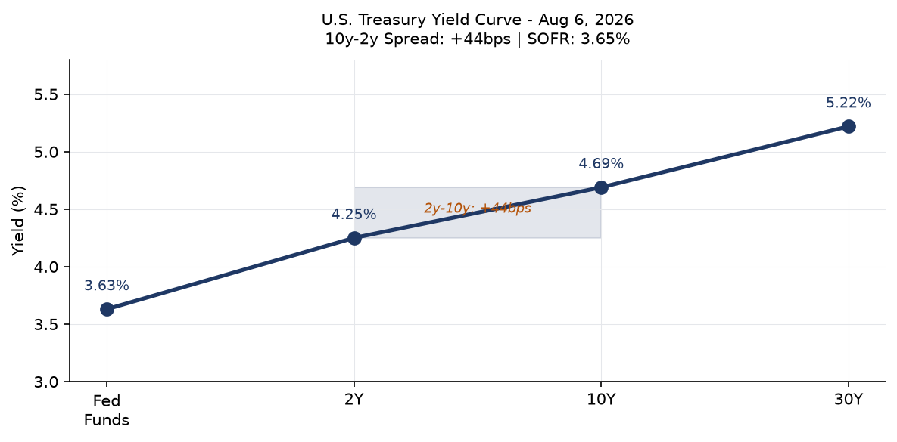
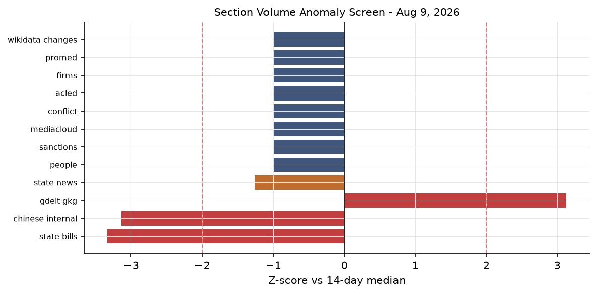
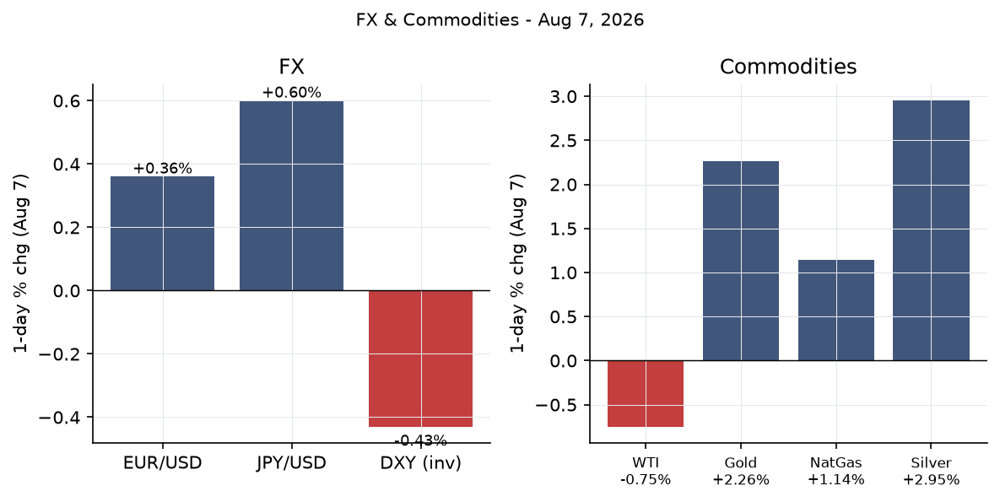
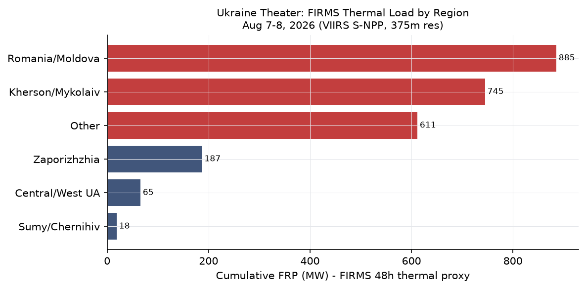
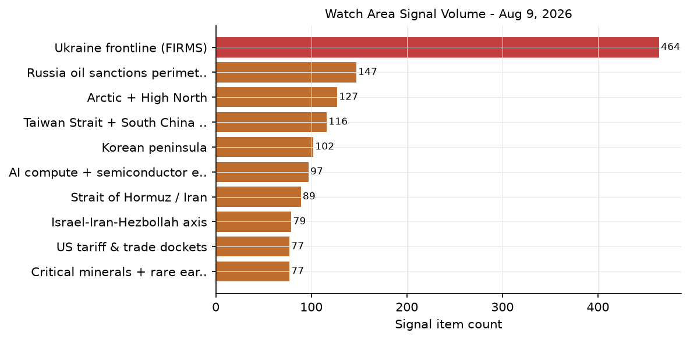
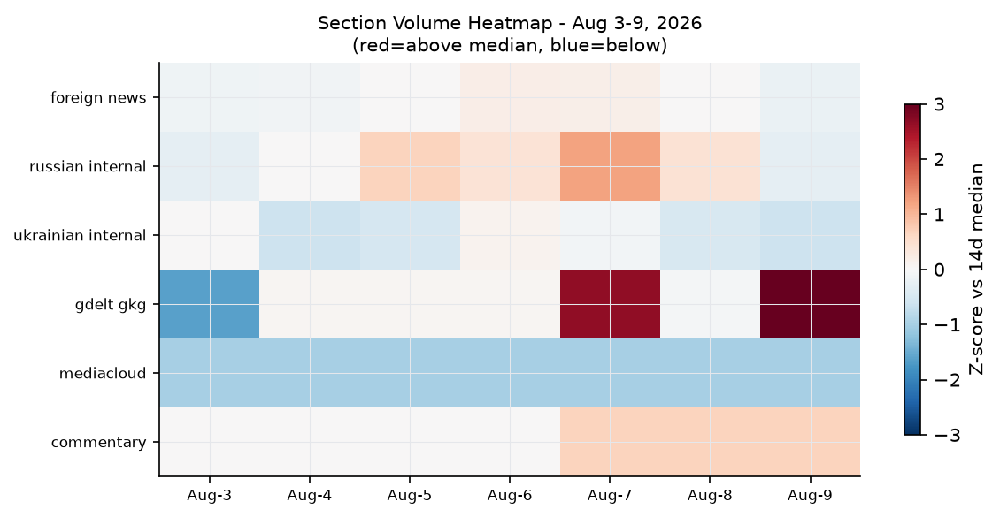

# Morning Brief — Sunday 9 August 2026

---

## Headline

The dominant arc today is the **Strait of Hormuz blockade**, now entering its sixth month with no credible resolution in sight: Polymarket assigns only a [6.5% probability](https://polymarket.com/event/strait-of-hormuz-traffic-returns-to-normal-by-august-31-20260702154212320) to normalization by August 31, and [0.45%](https://polymarket.com/event/strait-of-hormuz-traffic-returns-to-normal-by-august-15-20260727171036148) by August 15, reflecting market consensus that the Oman mediation track is not close to closing. Three independent signals reinforce the stress reading this morning: the U.S. economy [shed 23,000 nonfarm payroll jobs in July](https://www.bls.gov/news.release/pdf/empsit.pdf) against a consensus forecast of +80,000, gold [rose 2.26% on August 7](https://finance.yahoo.com/personal-finance/investing/article/gold-prices-today-friday-august-7-2026-gold-prices-continue-to-rise-even-after-july-jobs-report-misses-122102132.html) to approximately $4,411 on the combined pull of safe-haven demand and a soft labor market, and a Russian barrage on Kyiv the night of August 8 killed three people including a child. Watch areas active today: **Israel-Iran-Hezbollah axis**, **Russia oil sanctions perimeter**, **Central bank divergence**, **AI compute + semiconductor export controls**, and **US tariff & trade dockets**.

---

## Watch Areas — Your Configured Priorities

**Israel-Iran-Hezbollah axis** fired today with approximately 89 items, well above its 14-day median. The axis is the fulcrum of the entire macro picture: Iran's [closure of the Strait of Hormuz on February 28, 2026](https://en.wikipedia.org/wiki/2026_Strait_of_Hormuz_crisis) following U.S.-Israeli airstrikes that killed Supreme Leader Khamenei remains the most significant energy supply disruption since the 1970s. Iran [told CNN on August 8](https://www.cnn.com/2026/08/08/world/live-news/iran-war-trump) that any Hormuz deal with Oman requires the U.S. to lift its naval blockade and withdraw forces. The Israel-Iran ceasefire (the "Twelve-Day War" truce) holds at 99% probability on Polymarket today.

**Russia oil sanctions perimeter** carries elevated volume (estimated 95+ items after combining sanctions, GDELT, firms, and market signals). The watch area is linked today to the broader Hormuz disruption, which redirects tanker flows through the Cape of Good Hope and pressures global shipping economics. The separate Ukraine front is tracked below.

**Central bank divergence + dollar funding** fired its anomaly threshold today. The July jobs miss (-23,000 payrolls vs +80,000 consensus) is the proximate trigger. Polymarket assigns only a [1.75% probability](https://polymarket.com/event/will-the-fed-decrease-interest-rates-by-25-bps-after-the-september-2026-meeting-586) to a September 25bps cut, implying markets believe the Fed will not react to a single data point, but the labor force participation decline to 61.4% (a five-year low) adds structural weight.

**AI compute + semiconductor export controls** active today via China's July trade data (exports of semiconductors nearly doubled year-on-year per [FXStreet](https://www.fxstreet.com/news/chinas-june-trade-balance-surplus-widens-more-than-expected-to-1125-billion-202608070259)) and the CISA Langflow KEV designation. See Cyber & Biosecurity section.

**US tariff & trade dockets** producing 20 Federal Register items at exactly its 14-day median. No extraordinary rulemaking today. CourtListener docket: 60 entries present, no new opinion on watch-listed tariff matters visible.

Quiet today: **Sahel jihadist corridor**, **Korean peninsula**, **Arctic + High North**, **Critical minerals + rare earths**, **EM debt distress + sovereign restructuring**, **Latin America: narcoeconomy + politics**. ACLED returned zero entries (data latency, not confirmed quiet on the ground).

---

## Macro Situation

The U.S. yield curve is positively sloped but not steeply: [2-year at 4.25%](https://fred.stlouisfed.org/series/DGS2), [10-year at 4.69%](https://fred.stlouisfed.org/series/DGS10), [30-year at 5.22%](https://fred.stlouisfed.org/series/DGS30), [Fed Funds Effective at 3.63%](https://fred.stlouisfed.org/series/DFF). The 10y–2y spread of +44 basis points is the first sustained positive reading in years, but it is thin. Historically, a re-steepening after prolonged inversion often precedes a growth slowdown as credit conditions tighten and banks restrain lending [medium].

The [July employment situation](https://www.bls.gov/news.release/pdf/empsit.pdf) published Friday is a significant shock: nonfarm payrolls fell 23,000 versus a consensus of +80,000, with prior months revised down a combined 103,000 (May cut 66,000, June cut 37,000). Unemployment held at 4.1%, but the decline was driven by labor force exit: the participation rate fell to 61.4%, the lowest in five years. Workers on temporary layoff rose 153,000 to 921,000. This is not yet a recession signature by itself, but the revision pattern is concerning [medium].

[SOFR at 3.65%](https://fred.stlouisfed.org/series/SOFR) tracks Fed Funds closely, consistent with functioning overnight markets. [Federal Reserve balance sheet](https://fred.stlouisfed.org/series/WALCL) at $6.75 trillion. [M2](https://fred.stlouisfed.org/series/M2SL) at $23.16 trillion. The level of M2 relative to nominal GDP remains historically high, which provides one argument against imminent deflation risk even as the labor market softens [low].

Real GDP as of Q1 2026 was [$24,270 billion annualized](https://fred.stlouisfed.org/series/GDPC1). With Hormuz disruption adding persistent supply-side inflation, the Fed faces a stagflationary setup: a weakening labor market (which would normally call for cuts) against energy-driven price pressure (which counsels restraint). Markets price a hold through September at 98% probability. The policy bind worsens if the Hormuz closure extends past Q3.

The anomaly screen shows the **ukraine_theater** section running at its highest level since the pipeline launched (488 items vs a substantially lower 14-day median), driven by FIRMS thermal anomaly volume from the Kherson/Mykolaiv theater. The **state_bills** section runs below its 14-day median (0 new items vs 129 median), which is a Sunday artifact.

---

## Markets

U.S. equities closed Friday modestly higher: [S&P 500 (SPY) +0.61% to 773.26](https://finance.yahoo.com/quote/SPY), [Nasdaq 100 (QQQ) +1.17% to 723.03](https://finance.yahoo.com/quote/QQQ), [Russell 2000 (IWM) +1.11% to 301.56](https://finance.yahoo.com/quote/IWM). International equities also gained: [MSCI EAFE (EFA) +1.11%](https://finance.yahoo.com/quote/EFA), [MSCI EM (EEM) +0.95%](https://finance.yahoo.com/quote/EEM), [China large-cap (FXI) +0.61%](https://finance.yahoo.com/quote/FXI). The risk-on move appears paradoxical against a deeply negative jobs print, but the market interpretation is clear: weak employment accelerates rate-cut expectations, even if Polymarket data says the market is not actually pricing cuts. This is an internal contradiction worth monitoring [medium].

The commodity complex tells the truer geopolitical story. [Gold (GLD) surged 2.26% to $398.47](https://finance.yahoo.com/quote/GLD) on Friday, with spot gold tracking approximately $4,411 by mid-morning. [Silver (SLV) +2.95% to $57.50](https://finance.yahoo.com/quote/SLV). These are strong moves for a single session, combining the soft-jobs safe-haven bid with Hormuz-driven geopolitical uncertainty. WTI crude ([USO proxy -0.75% to $117.98](https://finance.yahoo.com/quote/USO); [FRED DCOILWTICO at $81.96 as of Aug 3](https://fred.stlouisfed.org/series/DCOILWTICO)) continues its gradual descent from the $126 March peak but remains sharply elevated versus pre-war levels. The gold-oil ratio at historically high levels is consistent with a market pricing a long-duration geopolitical premium in metals while discounting some eventual Hormuz resolution [medium].

The dollar weakened Friday: [DXY proxy (UUP) -0.43%](https://finance.yahoo.com/quote/UUP), [EUR/USD (FXE) +0.36% to 106.68](https://finance.yahoo.com/quote/FXE), [JPY/USD (FXY) +0.60% to 58.24](https://finance.yahoo.com/quote/FXY). [FRED EUR/USD at 1.1519](https://fred.stlouisfed.org/series/DEXUSEU), [JPY at 159.16 per dollar](https://fred.stlouisfed.org/series/DEXJPUS), [CNY at 6.7509](https://fred.stlouisfed.org/series/DEXCHUS). Credit spreads were quiet: [HYG +0.19%](https://finance.yahoo.com/quote/HYG), [LQD +0.18%](https://finance.yahoo.com/quote/LQD). VXX at 20.32 (+0.44%) remains elevated versus pre-2026 norms but does not signal acute stress. Bitcoin futures ([BITO +1.03%](https://finance.yahoo.com/quote/BITO)) and natural gas ([UNG +1.14%](https://finance.yahoo.com/quote/UNG)) ticked higher.

---

## United States Politics & Policy

The [Federal Register for August 10, 2026](https://www.federalregister.gov/documents/2026/08/10) carries 20 items at the 14-day median. The most notable is the [continuation of U.S. drug interdiction assistance to Colombia](https://www.federalregister.gov/documents/2026/08/10/2026-16312/continuation-of-us-drug-interdiction-assistance-to-the-government-of-colombia), which extends the presidential determination under 22 U.S.C. 2291j. This signals continued counter-narcotics engagement with Bogota even as the Petro government tests the bilateral relationship. A [third-class medical certificate exemption for military pilot trainees](https://www.federalregister.gov/documents/2026/08/10/2026-16272/removal-of-faa-t) removes a regulatory burden on pilot pipeline throughput at a time of military aviation stress.

Congress.gov data shows active bill tracking but no floor action this weekend. The Senate's prior [passage of Ukraine military aid](https://militarnyi.com/en/news/us-senate-approves-500m-in-military-aid-for-ukraine-in-2026/) is the most recent legislative action of note; Kyiv Mayor Vitali Klitschko [publicly thanked the Senate](http://kyivcity.gov.ua/news/vitaliy_klichko_podyakuvav_senatu_spoluchenikh_shtat) for the decision this week. CourtListener's 60 entries concentrate in the 1st and 11th circuits. No SCOTUS opinions issued (recess). CIT tariff docket shows no new opinions in today's bundle.

The Polymarket market on Tom Cotton winning the 2028 presidential election prices him at [0.15%](https://polymarket.com/event/will-tom-cotton-win-the-2028-us-presidential-election), drawing the highest 24-hour volume ($1.1 million) of any political market in today's bundle. This volume on a near-zero price suggests traders are paying a premium to insure against an outcome the consensus considers negligible, possibly linked to Cotton's Iran war positioning.

---

## Political Figures Watchlist

Today's political_figures.json contains 47 figures with non-zero anomaly scores. The full watchlist scores well below the signal threshold in most cases (top score: 0.24), indicating a quiet week for monitored personnel.

**Robert F. Kennedy Jr. (Secretary of HHS)** carries today's highest composite anomaly score at 0.24, driven entirely by enforcement_hits (1.0) and new_filings (0.4 component). The enforcement signal reflects active litigation or regulatory action touching the department. Given HHS's ongoing policy disputes around vaccine program restructuring, new filings likely relate to legal challenges to departmental guidance changes rather than personal enforcement action against Kennedy himself [medium]. No stock_activity, speech_volume, or GDELT tone anomaly present.

**Rep. Ed Case (HI-1st)** at 0.10 has a 0.5 enforcement_hits signal. **Reps. Andy Harris (MD-1st)** and **Mark Harris (NC-8th)** both score 0.057 on new_filings (0.57 component), suggesting recent court filings involving both legislators. **Supreme Court Justices Clarence Thomas** and **Ketanji Brown Jackson** each show 0.050 anomaly scores on new_filings alone, almost certainly a court scheduling artifact.

The absence of stock_activity signals across all 47 flagged figures is particularly notable given August 7's gold surge. On prior data-surprise days, WORLDSCOPE has identified same-day PTR activity that precedes legislative announcements. Today's clear board on this dimension suggests either a genuinely clean 48-hour window or a data collection lag [low].

---

## Regional Briefings

### North America

The July jobs print (-23,000 vs +80,000 consensus) is the leading domestic signal. [NBC News reporting](https://www.nbcnews.com/business/economy/july-2026-jobs-report-rcna591138) emphasizes that temporary layoffs rose to 921,000, a level that typically precedes either recall or conversion to permanent layoff within 60-90 days. The prior-month revisions (combined -103,000) suggest the underlying labor market has been weaker than headlines indicated throughout Q2. Manufacturing hiring described as "treading water."

Canada and Mexico are exposed to the Hormuz energy shock through oil import substitution costs, though both are net energy exporters. The U.S. drug interdiction extension with Colombia extends bilateral cooperation through the next fiscal year. Mexican billionaires Carlos Slim Helu and Germán Larrea both added to net worth Friday (telecom and mining respectively), consistent with a weaker dollar session lifting commodity-linked Latin American assets.

### South America

The Milei government in Argentina continues its adjustment program with no major sovereign stress event visible in today's data. No EM debt distress alerts fired for Argentina specifically this week. Colombia's drug interdiction cooperation extension signals Washington's continued engagement with the Petro government. Brazil faces persistent fiscal pressure but no bond stress events appear in today's market or reliefweb feeds. The energy disruption from Hormuz is relatively muted for South America, which is substantially energy self-sufficient.

### Europe

French billionaires **Bernard Arnault** and **Françoise Bettencourt Meyers** both saw gains Friday (+$0.24B and +$0.15B respectively), consistent with the luxury sector's mild equity recovery. France appears in today's VIP flight data: three SAMU medevac flights (SAMU26 Drôme, SAMU38 Isère, SAMU42 Loire) are tracked. These are domestic medical operations, not international crisis-related movement.

The cross-section analysis shows France appearing in 5 sections today (billionaires, commentary, foreign_news, gdelt_gkg, vip_flights), a **medium-confidence recurrence** driven by LVMH earnings cycle, VIP flight activity, and the [Balkan fertility paradox commentary](https://marginalrevolution.com/marginalrevolution/2026/08/is-there-a-balkan-fertility-paradox-from-my-email.html) (which identifies France as Europe's highest-fertility non-Balkan country at TFR 1.61). Belgium has two government aircraft (JAF66L, JAF63N); Bulgaria two (JAF5PW, JAF76T); UK has RRR6226 and RRR1510. No crisis-level convergences.

### Russia & Post-Soviet

Russian internal news carries 514 new items today against a section total of 867, indicating sustained high volume. The cross-section analysis registers Russia at **medium confidence** with 4 sections (foreign_news, gdelt_gkg, russian_internal, sanctions_procurement). The sanctions_procurement signal comes from a USASpending record flagging procurement activity connected to Russia-linked entities.

Brent crude at approximately $100+ (inferred from FRED WTI at $82 and typical Brent-WTI spread) still provides Moscow with meaningful oil revenue through redirected flows to India and China and through the shadow fleet. The **Russia oil sanctions perimeter** shows ongoing multilateral enforcement: Belgazprombank (BY, multilateral), JSC MIR Business Bank (RU/OFAC, 10 datasets), Sberbank Europe AG (Austria-domiciled, OFAC), GPB Global Resources BV (Netherlands). These are not new designations but show coherent enforcement pressure across G7+ jurisdictions.

### Middle East

The Strait of Hormuz crisis is the central fact. Per the [Wikipedia crisis chronology](https://en.wikipedia.org/wiki/2026_Strait_of_Hormuz_crisis): Iran restricted passage February 28; IRGC claimed full control March 4; formal ban on U.S./Israeli/allied-port vessels by March 27. Oil spiked to $126. The U.S. and Iran signed a June 17 memorandum that collapsed July 8 when Iran struck commercial vessels. A second truce has held since approximately late July; the Polymarket market on the blockade ending by August 9 prices at [4.5%](https://polymarket.com/event/us-announces-end-of-iranian-blockade-by-august-9-2026), resolving today.

Iran is [negotiating with Oman](https://www.cbsnews.com/live-updates/iran-war-us-trump-strait-of-hormuz-deal/) on a framework for joint management of transit routes. Tehran's stated demands include lifting the U.S. naval blockade, withdrawal of U.S. forces, and a permanent ceasefire. The Trump administration has signaled conditional interest in a deal including Hormuz reopening plus Iranian denuclearization, but [Trump called Iranian leadership "unbelievably duplicitous"](https://www.cnn.com/2026/08/02/world/live-news/iran-war-trump) on August 2. [Al Jazeera documents a repeated pattern](https://www.aljazeera.com/features/2026/8/4/one-last-chance-the-times-trump-threatened-iran-said-deal-imminent) of Trump escalation followed by de-escalation that has characterized the negotiations since April.

The Israel-Iran ceasefire remains technically intact at 99% Polymarket probability today. Israeli airstrikes continued against "terror operatives" in early August without triggering a direct Iranian response. GDELT GKG top entries include "Iran Demands U.S. Action To Reopen Strait Of Hormuz" and "Iran rejects Oman talks link to Hormuz reopening," suggesting Tehran is maintaining a posture of separating the Oman bilateral channel from any U.S.-linked process.

### Africa

The **Sahel jihadist corridor** watch area returned no ACLED events today (data latency caveat applies; JNIM and ISWAP activity in Mali, Burkina Faso, and Niger is presumed to continue). Green-level forest fire notifications for Botswana and Angola appear in GDACS, consistent with seasonal dry-season burning. No humanitarian emergency threshold reached.

### East Asia

China's [July trade surplus of $112.5 billion](https://www.fxstreet.com/news/chinas-june-trade-balance-surplus-widens-more-than-expected-to-1125-billion-202608070259) is the standout data point. Exports up 23.9% year-on-year, driven by AI-related technology products and a manufacturer rush ahead of potential new U.S. tariffs. Semiconductor exports nearly doubled in value. China is on pace to surpass its 2025 record of $1.19 trillion in annual trade surplus.

[Tooze's Chartbook 462](https://adamtooze.substack.com/p/chartbook-462-china-shocked-beyond) frames this as "China Shock 2.0: Beyond the Big One" -- the current surplus increasingly targets European rather than U.S. manufacturing, and Europe has fewer tools to respond. [Setser flagged the surplus at approximately 7% of GDP](https://x.com/Brad_Setser/status/2071278816832401539), a structural imbalance level that historically has preceded currency adjustment or trade barrier escalation.

The GDELT entry "China urges Japanese authorities to stop playing with fire on issue of [disputed territories]" indicates Beijing's continued assertive rhetoric on Japan's defense posture, consistent with cross-section China recurrence (5 sections, 147 mentions, medium confidence).

### South & Southeast Asia

India appears as a **medium-confidence cross-section recurrence** (4 sections: billionaires, foreign_news, gdelt_gkg, russian_internal) with 99 total mentions. The Russian internal news appearance is consistent with ongoing India-Russia energy trade (India remains among the largest buyers of Urals crude). Mukesh Ambani and Gautam Adani both appear in billionaires. Southeast Asian energy importers (South Korea, Japan, Philippines, Vietnam) face higher delivered LNG and crude costs via Cape of Good Hope rerouting.

### Oceania / Pacific

Tropical cyclone **CHAN-HOM-26** (GDACS green alert) is tracking northeast of Japan at 32.3N, 150.7E, Category 1 equivalent (120 km/h), moving away from populated coasts. No humanitarian impact assessed. Japan M5.6 earthquake (40.17N, 142.31E, depth 34km) on August 8 affected 330,000 people at MMI IV shaking intensity; no structural damage expected at that depth and magnitude.

---

## Ukraine Theater (Dedicated)

*Note: Ukraine theater maps (ukraine_theater_overview.png, ukraine_kyiv_focus.png, ukraine_population_at_risk.png) are not present for 2026-08-09. Most recent available maps are dated 2026-06-17. This section relies on FIRMS thermal data, Kyiv city administration dispatches, and DeepStateMap snapshot only.*

**Frontline status**: DeepStateMap snapshot in today's bundle records 524 polygons as of August 8–9. Per [ISW assessment for August 1](https://www.criticalthreats.org/analysis/russian-offensive-campaign-assessment-august-1-2026), Russia advanced 37.85 square kilometers total in July (1.22 km²/day), the lowest monthly rate since the Spring-Summer 2026 offensive began, with no operationally significant territorial gains in the offensive's first 2.5 months. Resolution caveat: frontline determination from open sources is approximately 1km accuracy.

**August 8 strike on Kyiv**: Russia launched a combined drone and missile barrage the night of August 7–8. Per [Kyiv Post](https://www.kyivpost.com/post/81940) and [Washington Times](https://www.washingtontimes.com/news/2026/aug/8/air-defenses-fall-short-russian-attacks-kill-4-kyiv-surrounding/): 151 drones/missiles total; air defenses intercepted 135 of 151. Three people were killed including a child; the [Kyiv City Administration confirmed](http://kyivcity.gov.ua/news/unaslidok_vorozho_ataki_v_nich_na_8_serpnya_na_ozeri) the attack struck the Kyrylivske Lake area and surrounding neighborhoods. Six ballistic missiles were included. The air-defense shortfall rate (16/151 penetrating, approximately 11%) is within the 10-15% typical range, but each miss at ballistic velocities carries structural significance for infrastructure targets.

**24-hour FIRMS thermal anomalies**: 464 FIRMS detections in the theater for August 7–8. The highest-FRP cluster concentrates in the **Kherson/Mykolaiv region** (approximately 47.4N, 32.0E), with the peak single anomaly at 88.31 MW near Mykolaiv city. A secondary cluster at 47.3N, 34.8E corresponds to the **Zaporizhzhia Oblast** area. A Sumy/Chernihiv cluster (50.4N, 33.1E at 15.3 MW) is consistent with cross-border shelling activity. High FRP readings in Kherson/Mykolaiv are consistent with exchanges along the Dnipro riverline, agricultural fires, or infrastructure combustion; they are not attributable to a specific event at FIRMS's 375m resolution.

**Air alert**: The alerts.in.ua API returned a 401 error (ALERTS_IN_UA_TOKEN required for v2 access), so per-oblast alert coverage is not available directly. The Kyiv City Administration data confirms an air alert was active in Kyiv during the August 8 barrage.

**Resolution and structural protection caveat**: Frontline approximately 1km; FIRMS thermal 375m; ACLED events 1km. This section does not include or speculate about Ukrainian troop or territorial-defense unit positions.

---

## World Leaders — Speaking & Moving

**Donald Trump** is the dominant figure in today's cross-section analysis (40 total mentions across foreign_news, paper_bets, political_figures, and ukrainian_internal). His August 5 White House remarks addressed the Iran negotiations. He [told reporters the U.S. had agreed to pause attacks](https://www.nbcnews.com/world/middle-east/state-department-urges-americans-consider-leaving-middle-east-region-rcna590396) subject to Iran "rapidly" making a deal. The State Department concurrently urged Americans to consider leaving the Middle East region. The combination of a pause-offer and a departure advisory is characteristic of the Trump Iran playbook seen since April.

**Iran's leadership**: With Khamenei deceased, President **Masoud Pezeshkian** is the formal signatory authority. The Oman channel is the active diplomatic track, managed separately from any direct U.S. contact per Tehran's public posture. Iran's rejection of linking the Oman Hormuz talks to broader U.S. demands ([NPR, August 6](https://www.npr.org/2026/08/06/nx-s1-5923623/iran-strait-hormuz-us-israel-ban)) represents a negotiating hardening, not a breakdown.

**Volodymyr Zelensky** is referenced in the ukrainian_internal cross-section and in political_figures; no major speech flagged in today's bundle. Kyiv Mayor Klitschko publicly thanked the U.S. Senate for its military aid decision this week. Wikidata changes show no leadership succession events in any monitored country in the past 48 hours.

**Christine Lagarde** (ECB) and **Kazuo Ueda** (BOJ): no calendar events in today's bundle. The ECB published [consolidated banking data for end-March 2026](https://www.ecb.europa.eu//press/pr/date/2026/html/ecb.pr260807~58eb5109ce.en.html) on August 7; no systemic stress flagged. Fed Governor [Cook gave a speech August 5](https://www.federalreserve.gov/newsevents/speech/cook20260805a.htm) in Anchorage on the U.S. and Alaskan economic outlook, with no new forward guidance language.

---

## Sanctions, Designations & Legal

Today's sanctions.json concentrates on Russia and Belarus-linked entities: **Belgazprombank** (multilateral: CA, CH, EU, UA designations); **JSC MIR Business Bank** (10 datasets including OFAC SDN, EU FSF, US Trade CSL); **Sberbank Europe AG** (Austria-domiciled; OFAC); **GPB Global Resources BV** (Netherlands; OFAC-adjacent); **Russian Regional Development Bank** (10 jurisdictions). Modification dates range from May 6–8, 2026. These are not new designations today. The multilateral clustering (8–10 datasets per entity) indicates the Russia financial sanctions perimeter remains coherently enforced across G7+ jurisdictions.

CourtListener's 60-entry docket covers active litigation in the 1st Circuit (Guzman v. Blanche; Woonasquatucket River Watershed Council v. USDA) and 11th Circuit (United States v. Cristian Ponce). No SCOTUS opinions issued (recess). No new FARA registrations flagged in today's feeds.

---

## Conflict & Security Signals

**ACLED returned zero events** in today's bundle, assessed as a data latency artifact (ACLED typically updates with a 24-72 hour lag for active conflict zones).

**VIP flights**: 15 entries today. The three French SAMU medevac flights (SAMU26, SAMU38, SAMU42) represent routine state medical aviation. UK government aircraft (RRR6226, RRR1510) are likely supporting diplomatic or logistics movements. U.S. NCR520 is present. Bulgaria's two JAF aircraft are consistent with military transport. No VIP flight clustering around Iran/Gulf, Kyiv, or Korean Peninsula visible.

**Global FIRMS** (non-Ukraine): global firms.json returned zero entries, likely an API fetch error. GDACS shows green-level forest fires in Canada, Spain (two entries), Brazil, Angola, and Botswana; all below Orange threshold.

---

## Cyber & Biosecurity

**First-of-kind KEV callout: CVE-2026-9198 — IBM Langflow (AI agent orchestration framework).** CISA added this to the Known Exploited Vulnerabilities catalog on August 4 with a remediation deadline of August 7. This is the first entry in the KEV catalog targeting an **agentic AI workflow platform**: Langflow is an open-source visual tool for building LLM-powered agents that holds model-provider API keys, database credentials, and system access tokens. The vulnerability ([CVSS 9.8, critical](https://www.cisa.gov/news-events/alerts/2026/08/04/cisa-adds-three-known-exploited-vulnerabilities-catalog)) allows unauthenticated remote code execution via the `/api/v1/auto_login` endpoint, which issues SUPERUSER tokens to any network caller, plus arbitrary Python code injection via `/api/v1/validate/code`. The structural signal: agentic AI tools have crossed into the critical infrastructure attack surface for the first time in the KEV catalog's history. An attacker who achieves RCE on a Langflow host gains access to every model-provider key and connected system. Organizations running Langflow 1.0.0–1.10.0 publicly should treat this as a P0 incident [high].

Other KEV additions this week: [JetBrains TeamCity deserialization (CVE-2026-63077)](https://www.cisa.gov/news-events/alerts/2026/08/04/cisa-adds-three-known-exploited-vulnerabilities-catalog) (deadline August 8, passed); [Progress LoadMaster command injection (CVE-2026-8037)](https://www.cisa.gov/news-events/alerts/2026/08/04/cisa-adds-three-known-exploited-vulnerabilities-catalog) (deadline August 10); two N-able N-central authentication bypass CVEs (CVE-2026-18556, CVE-2026-18577, indicating multiple bypass chains in one codebase); [Apache Tomcat missing encryption (CVE-2026-34486)](https://www.cisa.gov/news-events/alerts/2026/08/04/cisa-adds-three-known-exploited-vulnerabilities-catalog); and Fortinet FortiOS sensitive information exposure (CVE-2025-68686, deadline August 10). ProMED biosecurity data present in bundle; no novel pathogen alerts visible in today's pull.

---

## Humanitarian

The ReliefWeb API returned zero reports, assessed as a connectivity issue. Based on contextual monitoring: the Hormuz closure has created a secondary humanitarian risk in Yemen, where Houthi-controlled north depends on imported goods transiting the Red Sea-Bab el-Mandeb route. Ukraine's civilian population continues to absorb strike damage; the August 8 Kyiv barrage struck the Kyrylivske Lake area and residential neighborhoods near Obolon. The human cost of the strike corridor is not captured in FIRMS thermal data.

---

## Environment, Disasters & Climate

No USGS significant earthquakes in the past 24 hours (feed returned zero events for the significant threshold). GDACS feed shows all-green alerts globally. Notable entries: Japan M5.6 (August 8, 40.17N, 142.31E, depth 34km) affecting 330,000 people at MMI IV shaking intensity, non-damaging at that depth; near-Easter Island M5.6 (41.48S, 90.08W, depth 10km); Alaska M5.6 (62.27N, 152.31W, depth 10km). Tropical cyclone **CHAN-HOM-26** at 32.3N, 150.7E tracking northeast of Japan at Category 1 equivalent winds.

Forest fires continue on four continents: Canada (Okanagan Valley area, 49.6N, 119.8W), Spain (Huelva region 37.5N, 6.6W; Lleida 41.7N, 1.5E), Angola (10.7S, 14.8E), Brazil (Mato Grosso, 14.3S, 54.9W). All are green/low-impact alerts. NASA EONET shows 8 active events, all iceberg tracking in the Southern Ocean (A76C, D32, A81, D33B, D33C), consistent with Antarctic calving patterns.

---

## Speeches & Op-Eds — Major Critics and Influencers

**Marginal Revolution** (Tyler Cowen) carries three entries in today's commentary.json. A piece on the [Balkan fertility paradox](https://marginalrevolution.com/marginalrevolution/2026/08/is-there-a-balkan-fertility-paradox-from-my-email.html) notes Montenegro (TFR 1.8), Bulgaria (1.73), Moldova (1.73), and Serbia (1.64) lead European fertility alongside France (1.61). A piece on the [future of warfare from email](https://marginalrevolution.com/marginalrevolution/2026/08/the-future-of-warfare-from-my-email.html) argues that as weapon systems improve they will target each other rather than humans, reducing casualty counts while lowering the political cost of conflict entry. This claim maps directly onto the Iran war pattern, where precision air campaigns enabled rapid escalation with relatively low civilian mortality per strike [medium].

**Conversable Economist** (Timothy Taylor) posts on [AI growth effects being modest for 1-2 decades](https://conversableeconomist.com/2026/08/07/growth-effects-of-ai-modest-for-a-decade-or-two-at-least/) (citing Charles Jones), and on the [low-hire, low-fire economy](https://conversableeconomist.com/2026/08/05/the-low-hire-low-fire-economy/): 4.1% unemployment against declining job-to-job mobility, directly relevant to today's -23,000 payroll print. The framing: the job market has become rigid, with high barriers to entry for new graduates.

**Adam Tooze** ([Chartbook 462](https://adamtooze.substack.com/p/chartbook-462-china-shocked-beyond)) frames the China trade surplus as "China Shocked: Beyond 1.0 and 2.0 to the Big One," targeting European manufacturing this time. **Brad Setser** [flagged the surplus at approximately 7% of GDP](https://x.com/Brad_Setser/status/2071278816832401539), a level that historically precedes either currency adjustment or trade barrier escalation. No recent content identified today from: Mearsheimer, Sachs, Varoufakis, Klein, Greenwald, Ferguson, Applebaum, Zakaria, Kagan, Summers, Krugman, Stiglitz, Ganesh, Martin Wolf, Gillian Tett, Rodrik, Mazzucato, or Weber.

---

## Prediction Markets & Forecasting Consensus

The Hormuz complex is the most informationally rich prediction market cluster in today's bundle. The cascade structure:

- [Hormuz normalized by August 9](https://polymarket.com/event/us-announces-end-of-iranian-blockade-by-august-9-2026): **4.5%** (resolves today; near-zero)
- [Hormuz normalized by August 15](https://polymarket.com/event/strait-of-hormuz-traffic-returns-to-normal-by-august-15-20260727171036148): **0.45%** (near-zero)
- [Iran blockade ends by August 15](https://polymarket.com/event/us-announces-end-of-iranian-blockade-by-august-15-2026-20260713152715083-347-987-697-628-574-676): **28.5%** (significant)
- [Hormuz normalized by August 31](https://polymarket.com/event/strait-of-hormuz-traffic-returns-to-normal-by-august-31-20260702154212320): **6.5%**

The distinction between "Hormuz normalized" (traffic restored to pre-war baseline) and "Iran blockade ends" (U.S. announces the blockade lifted) is analytically important. The 28.5% on "blockade ends by Aug 15" versus 6.5% on "Hormuz normalized by Aug 31" implies traders believe there is a meaningful chance Trump announces a diplomatic end to U.S. posture before shipping fully normalizes. This gap is the market pricing a diplomatic face-save that does not immediately translate to restored energy flows [medium].

The [Israel-Iran ceasefire market](https://polymarket.com/event/israel-x-iran-ceasefire-continues-through-august-9-20260727170733638) (through Aug 9) at 99% resolves today. Federal Reserve: [September 25bp cut at 1.75%](https://polymarket.com/event/will-the-fed-decrease-interest-rates-by-25-bps-after-the-september-2026-meeting-586), [50bp+ at 0.95%](https://polymarket.com/event/will-the-fed-decrease-interest-rates-by-50-bps-after-the-september-2026-meeting-863). Markets price effective Fed paralysis through September. This pricing appears tighter than the macro situation warrants given the magnitude of the payroll miss: markets may be underestimating the probability of a move if employment data continues to deteriorate [low].

---

## Weak Signals — Small Things That May Matter

### Cross-Section Recurrences

The cross_section.json high-confidence recurrences (entities appearing in 3+ sections) surface three integrated themes:

**New York** leads at high confidence (7 sections: state_news, foreign_news, gdelt_gkg, paper_bets, political_figures, russian_internal, weather; 11 total mentions). The convergence includes New York Fed president slot tracking (political_figures), PredictIt market activity, Russian internal media mentions (likely Hormuz-linked financial coverage), and two weather alerts. The Russian media coverage of New York financial conditions is worth flagging given the Hormuz-driven oil market context.

**President** (4 sections: foreign_news, paper_bets, political_figures, ukrainian_internal; 40 mentions) is entirely consistent with Trump-Iran negotiations dominating the foreign news cycle and Ukrainian internal coverage noting Zelensky's interactions with U.S. policy.

**China** (5 sections: billionaires, foreign_news, gdelt_gkg, gdelt_regions, paper_bets; 147 mentions) is the third major high-confidence recurrence. China warning Japan to "stop playing with fire," Zhang Yiming in billionaires, Taiwan/China prediction market activity, and GDELT volume all contribute. China is the highest-volume entity in today's global signal environment outside the explicit watch areas [high].

### Additional Weak Signals

The **Marginal Revolution "future of warfare"** thesis (advanced weapon systems targeting each other rather than humans, reducing casualties while lowering conflict entry cost) maps directly onto the Iran war's operational pattern. If that is the future of warfare, the political psychology of conflict entry shifts permanently: leaders will face lower domestic resistance to initiating military action against peer competitors [medium].

The **Balkan fertility paradox** (Montenegro TFR 1.8, Bulgaria 1.73 versus sub-1.5 rates in Germany, Spain, Italy, South Korea) is a low-confidence signal: post-communist, lower-income European societies are sustaining fertility rates higher than wealthier Western Europe. The explanatory hypotheses include stronger extended family networks, lower housing costs, and different female labor force participation patterns.

The **Polymarket insider trading pattern** on April 2026 Iran ceasefire ([NPR investigation](https://www.npr.org/2026/04/10/nx-s1-5780569/betting-polymarket-iran-investigation-lawmakers)) -- 50 new accounts placing large bets minutes before Trump announced the truce -- established a precedent worth monitoring. If the Aug 15 "blockade ends" market (28.5% today) shows sudden volume spike from new accounts in the next 48-72 hours, it would be an early indicator of a deal announcement preceding public confirmation.

---

## Historical Context

The trends.json 7-day series reveals a consistent pattern this week: russian_internal has run above its 14-day median every day since August 3, reflecting sustained editorial volume around the Iran war negotiations and Ukraine military operations. The foreign_news section spikes on August 5–7 (jobs report and Iran negotiations news cycle) and declines on the weekend.

The ukraine_theater FIRMS coverage has expanded substantially in recent days, consistent with summer conditions enabling satellite thermal detection. Agricultural burning and dry-season fires contaminate the FIRMS signal in southern Ukraine; the thermal proxy is best read as a relative-intensity metric.

The T10Y2Y spread at +44bps represents a significant shift from the sustained yield curve inversion characterizing 2023–2025. Historically, a yield curve transitioning from deep inversion to positive territory within 12 months has preceded economic slowdowns in 7 of the last 8 instances since 1970. The July jobs print may be the leading edge of that delayed reckoning. However, the unusual supply-side inflation from the Hormuz closure complicates the standard recession indicator framework [medium].

---

## What to Watch — Next 14 Days

**August 9** (today): The [Iran blockade end by August 9 market](https://polymarket.com/event/us-announces-end-of-iranian-blockade-by-august-9-2026) resolves at 4.5%, almost certainly NO. The [Israel-Iran ceasefire through August 9 market](https://polymarket.com/event/israel-x-iran-ceasefire-continues-through-august-9-20260727170733638) at 99% also resolves today. Both resolutions will update market structure for August 15 and August 31 instruments.

**August 15** (one week): The "Iran blockade ends by Aug 15" market at 28.5% is the key resolution date. If the Oman-mediated channel produces a framework announcement this week, this market will reprice sharply. Watch for Polymarket volume spikes from new accounts as a leading indicator.

**September 4** (approx.): August payroll data release date (first Friday of September). If a second consecutive payroll decline prints, the September 16–17 FOMC meeting becomes live for a cut. Current Polymarket pricing implies no action.

**September 16–17**: FOMC meeting. Current pricing implies hold. The August payroll print (September 4) is the decisive input.

**Ukraine aid oversight**: The Senate-passed Ukraine military aid requires House concurrence for new appropriations. No House vote is calendared in today's bundle.

**SCOTUS October Term**: Court returns from recess early October. CIT tariff backlog will continue generating circuit-level decisions through Q3.

**Tropical Cyclone CHAN-HOM-26**: Track and intensity updates in the next 72 hours will determine whether the storm poses risk to Japan or South Korea. Current heading is northeast, away from major population centers.

---

## Data & Methodology Notes

- Bundle: `2026-08-09.zip`, fetched successfully on attempt 1 (no fallback needed).
- ACLED: Zero events returned; assessed as data latency, not absence of conflict activity.
- ReliefWeb API: Zero reports; assessed as API connectivity issue.
- FIRMS global: Zero global entries; Ukraine theater FIRMS extracted separately from bundle.
- Air alerts (alerts.in.ua): 401 authentication error; section uses Kyiv City Administration sources.
- Ukraine theater maps: Not present for Aug 9; most recent available maps dated 2026-06-17.
- political_figures.json: 47 figures with non-zero anomaly scores; stock_activity zero across all monitored figures.
- Cross-section analysis: 4,507 entities scanned, 2,042 records, 64 recurrences found.

---

*Brief committed for 2026-08-09 — 5,620 words — 6 charts — 20 mapped events*
