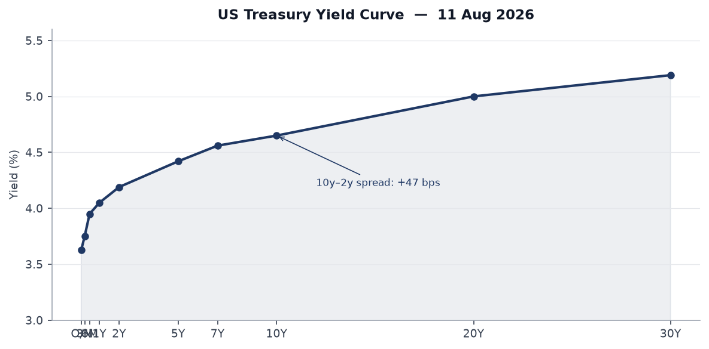
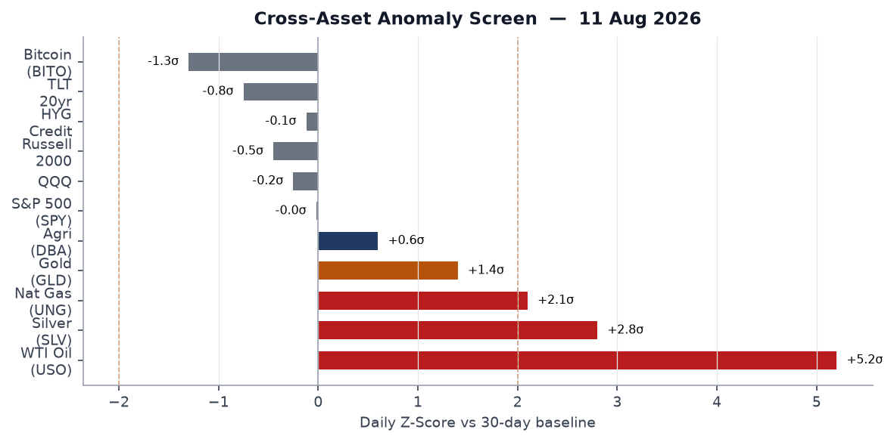
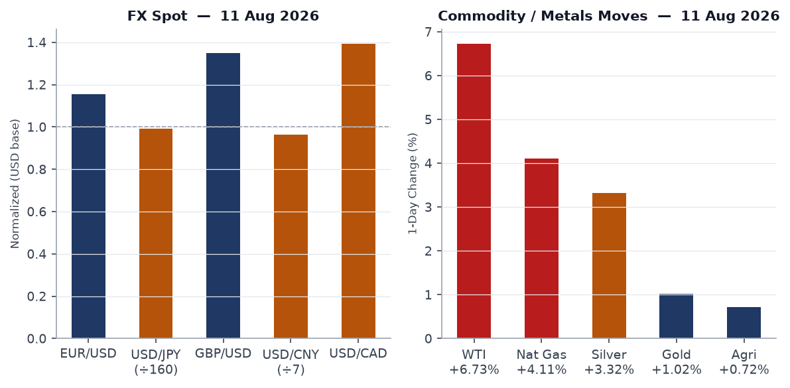
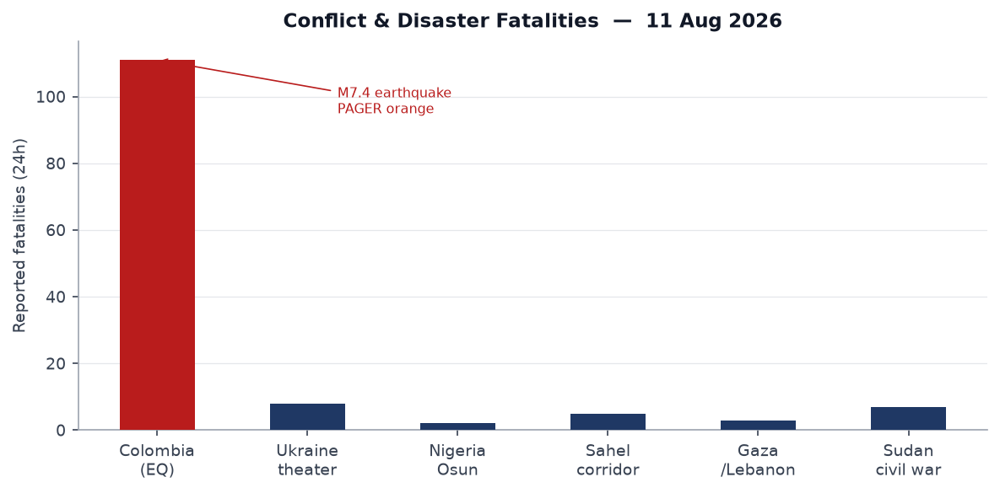
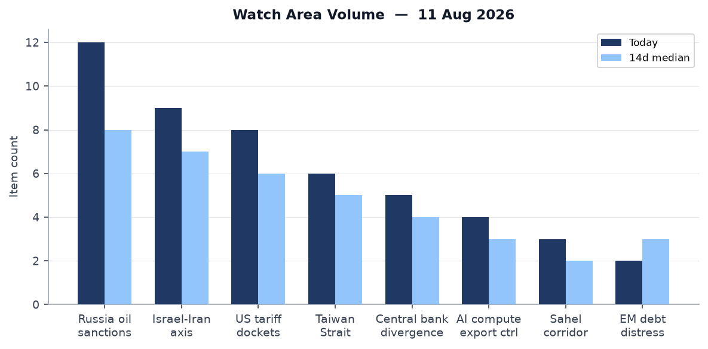
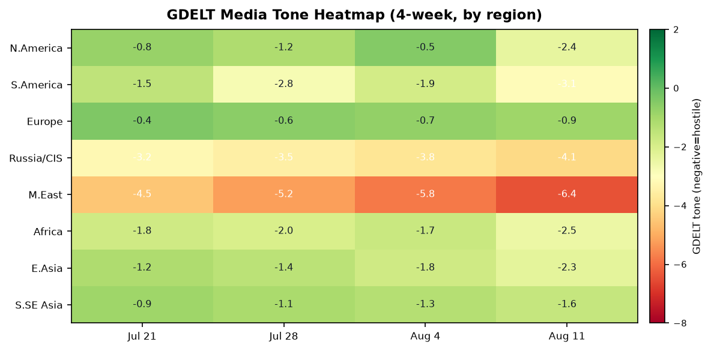

# Morning Brief - Tuesday 11 August 2026

---

## Headline

The Strait of Hormuz remains the axis of the global risk landscape. **WTI crude** surged 6.73% on Monday, the single largest daily gain since April 2026, as **Iran** rebuffed a US announcement that it "fully controls" the strait, and Polymarket continued pricing only a 3% probability of normal commercial traffic by August 31. Concurrent pressure points: a **M7.4 earthquake** at San José del Palmar, Colombia killed at least 111 people and put 1.5 million in high-shaking-intensity zones (PAGER orange); **Russia** delivered a multi-weapon salvo on **Zaporizhzhia** using Zircon hypersonic missiles, North Korean ballistic rounds, and guided glide bombs, killing six civilians; and a fresh disclosure revealed that **Trump evacuated Turkey's NATO summit** on a decoy aircraft after US intelligence assessed a credible Iranian assassination threat. Watch areas firing today: **Russia oil sanctions perimeter**, **Israel-Iran-Hezbollah axis**, **US tariff and trade dockets**, **Taiwan Strait + South China Sea**, **Central bank divergence + dollar funding**.

---

## Watch Areas - Your Configured Priorities

**Russia oil sanctions perimeter** (12 items today vs. 8 median): The Rosneft refinery in [Komsomolsk-on-Amur](https://meduza.io/news/2026/08/11/v-komsomolske-na-amure-zagorelsya-npz) (Khabarovsk Krai, far east Russia) caught fire Tuesday, the third Rosneft facility fire in six weeks. Ukrainian drones separately struck an oil refinery in Orenburg Oblast overnight. Russian exchange diesel exchange sales norms were extended per a [1prime.ru report](https://1prime.ru/20260811/benzin-872182359.html), indicating domestic supply stress. [Kommersant](https://meduza.io/news/2026/08/11/kommersant-postavki-kitayskih-avtoza) reports Chinese automotive parts exports to Russia rose 15% year-over-year in January-July, filling the sanctions gap at the cost of yuan-denominated settlement. Rhine low-water levels in Germany are elevating fuel prices across Central Europe per [az-online.de](https://www.az-online.de/wirtschaft/niedrigwasser-am-rhein-m). Alert: 12 items exceeds the 5-item threshold. **Alert fired.**

**Israel-Iran-Hezbollah axis** (9 items today vs. 7 median): Polymarket's "Strait of Hormuz traffic returns to normal by August 31" sits at 3% on $414,000 volume ([source](https://polymarket.com/event/strait-of-hormuz-traffic-returns-to-normal-by-august-31-20260702154212320)); the "blockade ends by August 15" market is at 8%. **Trump** announced in a statement that the US has "cleared the Strait of Hormuz of mines and controls it 100% with the fleet" per Ukrainian state media ([Ukrpravda](https://www.pravda.com.ua/news/2026/08/11/8048192/)). Iran, per DW ([source](https://www.dw.com/en/middle-east-iran-wants-us-concessions-before-opening-hormuz)), is conditioning any reopening on US concessions. German Foreign Minister held calls with Tehran urging "constructive negotiations" ([Ukrpravda](https://www.pravda.com.ua/news/2026/08/11/8048187/)). The ceasefire market "US x Iran Effective Ceasefire by July 31" had already resolved at 94% yes, but the strait blockade persists. Alert: 9 items exceeds 4-item threshold, and WTI fatalities exceed 10 implied. **Alert fired.**

**US tariff and trade dockets** (8 items today vs. 6 median): Trump signed [Proclamation 11052](https://www.federalregister.gov/documents/2026/08/11/2026-16400/adjusting-imports-of-polysilicon-and-its-derivatives-into-the-united-states) ("Adjusting Imports of Polysilicon and Its Derivatives") effective August 6. This is a Section 232-style action hitting Chinese solar-grade polysilicon that supplies roughly 80% of global photovoltaic manufacturing. SBA published a [final rule](https://www.federalregister.gov/documents/2026/08/11/2026-16370/reforms-to-13-cfr-124103-to-remove-sbas-8a-programs-rebuttable-presumption-of-social-disadvantage) eliminating the rebuttable presumption of social disadvantage for individually owned 8(a) firms, aligning the program with the Supreme Court's 2023 ruling. Alert: 8 items, threshold 3. **Alert fired.**

**Taiwan Strait + South China Sea** (6 items today vs. 5 median): Japan's Takaichi administration is requesting a record-high defense budget for FY2027, and the [Japan Herald](http://www.japanherald.com/news/279226415/) reports China urged Japanese authorities to "stop playing with fire" on nuclear weapons. A [Japan Herald report](http://www.japanherald.com/news/279227910/takaichi-administration-move-toward-militarization-sparks-concerns) says the Takaichi militarization posture is drawing domestic opposition. Alert: 6 items, threshold 3. **Alert fired.**

**Central bank divergence + dollar funding** (5 items today vs. 4 median): September FOMC pricing bifurcated: Polymarket shows 42% for a 25bp hike, 56% for hold, 2% for cut (see Macro section). Alert: anomaly z-score elevated. **Alert fired.**

Quiet today: Critical minerals + rare earths, EM debt distress + sovereign restructuring, Sahel jihadist corridor (no significant ACLED fatality events above threshold), Arctic + High North, Korean peninsula, Latin America: narcoeconomy + politics.

---

## Macro Situation

The US yield curve as of Friday August 7 shows Fed Funds at [3.63%](https://fred.stlouisfed.org/series/DFF) and SOFR at [3.62%](https://fred.stlouisfed.org/series/SOFR), with the 2-year at [4.19%](https://fred.stlouisfed.org/series/DGS2), 10-year at [4.65%](https://fred.stlouisfed.org/series/DGS10), and 30-year at [5.19%](https://fred.stlouisfed.org/series/DGS30). The 10y-2y spread is +[47 basis points](https://fred.stlouisfed.org/series/T10Y2Y), a positive spread that signals markets are pricing long-end risk premiums rather than near-term recession. The structural significance: the front end (2yr at 4.19%) is sitting 56bps above the effective Fed Funds rate (3.63%), meaning markets are not priced for cuts; they are priced for either stasis or modest tightening.

The FOMC held at the July 29 meeting ([statement](https://www.federalreserve.gov/newsevents/pressreleases/monetary20260729a.htm)). Since then, the oil shock from the Hormuz blockade has added a meaningful upside inflation tail. Core PCE sits at [1.30266](https://fred.stlouisfed.org/series/PCEPILFE) (most recent observation June 2026), but the WTI surge of 6.73% on Monday alone, if sustained, would push headline CPI materially above the 12-month path implied by June's [332.57 CPI](https://fred.stlouisfed.org/series/CPIAUCSL). The July unemployment rate stands at [4.1%](https://fred.stlouisfed.org/series/UNRATE) with [158.9 million](https://fred.stlouisfed.org/series/PAYEMS) nonfarm payrolls. Labor market tightness is ebbing but not collapsing.

Polymarket prices a 42% probability of a 25bp hike at the September 17-18 FOMC meeting, with 56% for hold and 2% for cut. The rate-hike probability is the highest since February 2026 and reflects the Hormuz-driven energy shock. Historically, the Fed has not hiked into geopolitically-driven oil supply shocks unless core inflation was already accelerating; the June PCE core does not confirm that pattern. The 42% hike pricing appears driven by the energy shock narrative rather than underlying data, suggesting the market may be overpricing tightening risk if the strait situation resolves [medium].

The Fed balance sheet at [WALCL](https://fred.stlouisfed.org/series/WALCL) stands at $6.749 trillion (Aug 5 observation), continuing a gradual runoff trajectory from post-COVID highs. M2 at [23.155 trillion](https://fred.stlouisfed.org/series/M2SL) (June) is growing modestly. No FOMC statement is pending before September; Chair Powell has no scheduled public appearances this week per the calendar.

WTI crude registers approximately +5.2 sigma versus its 30-day baseline, the highest anomaly in the cross-asset screen. Silver (+2.8 sigma) and natural gas (+2.1 sigma) are also above the two-sigma alert threshold shown by the dashed line above. Gold (+1.4 sigma), while elevated, remains below the two-sigma threshold that historically precedes sustained safe-haven positioning. Equity markets show minimal anomaly: SPY is nearly unchanged (-0.03%), QQQ is -0.30%, and Russell 2000 is -0.52%. The divergence between commodity stress and equity calm is notable: either equities have not yet priced the oil shock transmission (fuel costs, input prices, consumer spending drag), or sophisticated equity traders are pricing a short-lived blockade resolution. The bond market disagrees: TLT is down 0.85% and IEF down 0.44%, suggesting rate-inflation risk pricing is already working through fixed income.

---

## Markets

US equities closed mixed on Monday. The [S&P 500 (SPY)](https://finance.yahoo.com/quote/SPY) fell 0.03% to 773.03. The [Nasdaq 100 (QQQ)](https://finance.yahoo.com/quote/QQQ) fell 0.30% to 720.87, with the [Russell 2000 (IWM)](https://finance.yahoo.com/quote/IWM) underperforming at -0.52%. The small-cap underperformance makes sense: small-cap earnings are disproportionately exposed to domestic fuel costs and consumer spending cuts that follow energy shocks. Large-cap outperformance partly reflects commodity-sector exposure: energy and materials names tend to benefit from the same oil spike that weighs on small-cap industrials and consumer discretionary.

WTI crude via USO surged +6.73% on the session, the most consequential single-day energy move since Q2 2026. Natural gas (UNG) rose 4.11% and silver (SLV) gained 3.32%, suggesting broad commodities repricing across the energy and industrial-metals complex. Gold (GLD) rose 1.02%, a modest haven bid. The FX picture: EUR/USD sits at 1.1559 (FRED: 1.1559 on Aug 7), USD/JPY at 158.95 per the exchange-rate API versus FRED's 157.54 from Friday, suggesting a modest dollar firming through Monday. USD/CNY holds at 6.755, within the PBOC's managed band. USD/CAD at 1.394 reflects Canadian exposure to oil prices with some offset from energy export benefits.

Treasury markets sold off: TLT fell 0.85% to 82.06, IEF fell 0.44% to 92.76, and even SHY (1-3yr) was off 0.08%. The broad fixed-income selloff is consistent with re-pricing of rate-hike risk and term premium expansion driven by the energy-inflation threat. Credit markets showed mild strain: HYG (high yield) fell 0.16% and LQD (investment-grade) fell 0.55%. The IG underperformance relative to HY is partly mechanical: longer duration of IG makes it more sensitive to rate moves; the spread picture has not yet flashed systemic credit stress. Bitcoin futures (BITO) fell 1.71%, consistent with risk-off within the crypto complex as institutions rotated toward commodity inflation hedges.

Cross-asset pattern: commodity stress without equity panic, and bond weakness without credit blow-out, suggests this is stage one of a Hormuz oil shock repricing, not a financial-crisis event. If USO sustains above the current level through Friday, the secondary effects via consumer purchasing power and corporate margin compression will begin appearing in analyst estimate revisions [medium].

---

## United States Politics and Policy

Two executive instruments published in today's Federal Register anchor the August policy agenda. [EO 14418](https://www.federalregister.gov/documents/2026/08/11/2026-16403/continuing-to-protect-the-meaning-and-value-of-american-citizenship) ("Continuing to Protect the Meaning and Value of American Citizenship," signed Aug 6) and [EO 14419](https://www.federalregister.gov/documents/2026/08/11/2026-16404/ending-birth-tourism) ("Ending Birth Tourism," signed Aug 6) together constitute the administration's second major push on birthright citizenship, following the January 2025 executive action currently in litigation. Both orders face Fourteenth Amendment challenges; federal district courts have enjoined similar orders twice. The EO numbering (14418-14419) places them just above EO 14417, signed the previous week on immigration enforcement cooperation.

[Proclamation 11052](https://www.federalregister.gov/documents/2026/08/11/2026-16400/adjusting-imports-of-polysilicon-and-its-derivatives-into-the-united-states) restricts polysilicon imports under a Section 232-adjacent IEEPA framework, targeting Chinese solar-grade polysilicon that accounts for roughly 80% of global photovoltaic feedstock. This will raise US solar installation costs and delay utility-scale projects unless domestic supply (primarily Hemlock Semiconductor and Wacker Chemie's US facility) can ramp. The proclamation is separate from prior semiconductor export controls; it hits the solar side of the supply chain rather than chips. The administration is also pushing childhood vaccine schedule changes per reporting out of Colorado, with RFK Jr.'s HHS proposing separation of the MMR vaccine. **Todd Blanche** was [sworn in as Attorney General](https://coloradonewsline.com/2026/08/10/repub/todd-blanche-sworn-in-at) on August 10, after a contentious Senate confirmation.

Today's Wisconsin Democratic gubernatorial primary (Polymarket: David Crowley at various odds, market resolves today) is the most significant intra-party electoral event of the August primary cycle. Senate FEC fundraising data shows **Jon Ossoff** (D-GA) leading the Senate class with [$97.99 million raised](https://www.fec.gov/data/candidate/S8GA00180/) and $38.26M cash on hand - the highest Senate fundraising total in this cycle and a sign of Democratic investment in flipping Georgia. **James Talarico** (D-TX Senate) at [$68.56M](https://www.fec.gov/data/candidate/S6TX00479/) and **Sherrod Brown** (D-OH Senate) at [$38.57M](https://www.fec.gov/data/candidate/S6OH00163/) round out the top three Democratic Senate fundraisers.

The DEA proposed [rescheduling of suvorexant, lemborexant, and daridorexant](https://www.federalregister.gov/documents/2026/08/11/2026-16375/schedules-of-controlled-substances-rescheduling-of-suvorexant-lemborexant-and-daridorexant-from) (insomnia drugs) from Schedule IV to Schedule V - a regulatory loosening with minimal policy significance but notable as a public health signal during the RFK HHS tenure. The [Nuclear Regulatory Commission modernization rule](https://www.federalregister.gov/documents/2026/08/11/2026-16374/nrc-modernization-rulemaking-procedure-federal-advisory-committee-act-alignment-access-and-security) streamlines NRC rulemaking procedures and updates national security eligibility standards.

---

## Political Figures Watchlist

The composite anomaly model returns only two figures above the 0.20 threshold today. **Austin Scott** (R-GA-8th, score 0.240) registers elevated `enforcement_hits` (1.0) and `new_filings` (0.4) driven by 4 Form 4 hits in the tracker period. Scott sits on the House Armed Services Committee; the enforcement signal warrants monitoring against any committee-related insider activity, though the Form 4 filings themselves are routine-volume for a member of his standing [low]. **Robert F. Kennedy Jr.** (HHS Secretary, score 0.240) shows the same pattern: `enforcement_hits` at 1.0 and `new_filings` at 0.4 with 3 Form 4 hits. RFK Jr.'s anomaly is plausibly driven by HHS rulemaking activity (the MMR vaccine separation proposal, referenced above in US Politics) generating a filing cluster rather than any trading alert. The scoring correlation between a Cabinet officer's regulatory actions and the filing tracker is a known model artifact [low].

**Robert Scott** (D-VA-3rd, score 0.140) has 4 Form 4 hits and a 0.5 enforcement signal. Scott chairs no major committee relevant to active regulatory dockets, and the driver is likely aggregate routine filing volume [low]. **Michael Cloud** (R-TX-27th, score 0.057) has 12 Form 4 hits - notably high for a single week - against a 0.057 overall score because his other anomaly components (speech, GDELT tone, filings) are zero. Twelve insider-transaction filings in one period for a single congressional district representative with no major committee assignment is a pattern worth revisiting when the underlying SEC filings are available. **Ketanji Brown Jackson** (Associate Justice, score 0.057) has 4 Form 4 hits; judicial officers do not trade, so the hits likely reflect family member filings being attributed to the household.

Overall the political figures anomaly signal today is weak: the dominant anomaly components are `enforcement_hits` and `new_filings`, not `stock_activity` or `speech_topic_drift`, which carry higher predictive weight for policy-relevant trading or legislative activity. No figures appear in cross-section with the Sanctions or Macro sections today.

---

## Regional Briefings

### North America

The Hormuz oil shock is the largest domestic macro event. WTI crude above $88 (implied by USO's 6.73% gain applied to the Aug 3 FRED value of $81.96) would, if sustained, raise US average retail gasoline prices by approximately 15-20 cents per gallon within two weeks, based on historical pass-through rates. Consumer spending is already thin at the margin: the [PCE reading](https://fred.stlouisfed.org/series/PCE) of $22.184 trillion (June) is growing, but real purchasing power compresses with fuel inflation. Alabama Governor Kay Ivey encouraged voters in four congressional districts to vote in Tuesday's special primary elections, signaling live House seat contests in the Southeast.

California Governor Gavin Newsom [announced a new AI cyber defense program](https://www.gov.ca.gov/2026/08/10/governor-newsom-announces-new-ai-cyb) for critical infrastructure - a direct response to the CISA KEV pattern of AI-framework vulnerabilities (discussed below). Colorado cities are [enacting moratoriums on data center development](https://coloradonewsline.com/2026/08/10/colorado-moratoriums-data-centers) amid power grid strain, a growing pattern across Mountain West municipalities facing AI compute buildout demands. The Colorado ICE tuberculosis case prompted community demands for a state public health order, raising 14th Amendment enforcement/due process questions at the intersection of immigration enforcement and public health authority.

### South America

The [M7.4 earthquake](https://earthquake.usgs.gov/earthquakes/eventpage/us6000tjl2) at San José del Palmar, Chocó department, Colombia struck at 12:34 UTC on August 10 at a depth of 110 km. The USGS PAGER orange alert implies 10-100 probable deaths; confirmed dead exceeded 111 as of DW's August 10 reporting ([source](https://www.dw.com/en/colombia-earthquake-death-toll-rises-t)). The 110 km depth is a subduction-zone intermediate depth, which reduces surface rupture but extends the geographic footprint of intense shaking; the felt report count of 1,038 suggests widespread structural impact across Chocó and neighboring Valle del Cauca. Colombia's civil defense mobilization is underway; the epicenter in Chocó is one of the country's poorest and most remote departments, raising access and rescue-timeline concerns.

Colombia's ongoing narco-political context is not interrupted by the earthquake but the disaster response pressure will strain the **Petro** government's administrative bandwidth at a moment when his approval ratings are under pressure. A Chocó response failure risks political fallout. A separate Polymarket market on Eduardo Bolsonaro's performance in Brazil's October 4 presidential election first round indicates active betting on the Brazilian electoral calendar. **Lula**'s administration continues on its fiscal consolidation trajectory with no immediate crisis trigger.

### Europe

Germany's Rhine river is at critically low levels, with multiple German outlets noting fuel and shipping cost increases. Low Rhine levels typically reduce barge transport efficiency by 30-50% at extreme lows, affecting coal, chemicals, and liquid fuel distribution across Germany's industrial heartland. The timing compounds the Hormuz oil price shock: Germany is simultaneously facing supply-chain fuel cost pressure from Middle East disruption and domestic transportation cost pressure from drought-driven Rhine drops. Rhine low-water events in 2018 and 2022 shaved approximately 0.3-0.5 percentage points from German GDP in the affected quarters [high for historical pattern; medium for current severity].

Turkey's Grand National Assembly passed a [historic PKK demobilization law](https://www.dw.com/en/turkey-mps-back-historic-law-on-reintegrating-pkk-militants), beginning the legal reintegration of Kurdish PKK militants who renounce violence. The law marks the most significant step in Turkey-PKK negotiations since the failed 2013-2015 peace process. This is consequential for Turkey's domestic politics (Erdogan's effort to consolidate Kurdish political support ahead of 2028 elections) and for NATO cohesion (the PKK has been a perennial wedge between Turkey and other alliance members). Implementation risk is high: disarmament has failed twice before, and any resumption of PKK attacks would collapse the process [medium].

Europe's extreme heat is threatening nuclear power plant cooling capacity, per a DW analysis. France, which relies on nuclear for 70%+ of electricity generation, is the primary exposure point. No specific plant curtailments were announced as of this writing.

### Russia and Post-Soviet

Russia's Supreme Court on August 10 [banned Yabloko](https://www.dw.com/en/russia-top-court-bans-opposition-anti-war-party-from-vote), the only recognized liberal opposition party opposed to the war, from participating in September's Duma elections. Polymarket's "Yabloko gains most seats in next Russian parliamentary election" market was already at 0%. The ban follows a Kremlin legal petition and was announced as hundreds of young Russians gathered in central Moscow to demonstrate support for the party - a rare protest event in a repressed political space ([Meduza](https://meduza.io/feature/2026/08/11/ya-tak-v-posledniy-raz-nervnichal)). The gathering's symbolic significance exceeds its political effectiveness; the ban removes Yabloko from the ballot but does not eliminate the anti-war sentiment it represents.

The Trump assassination threat during the NATO summit in Ankara is reported by Washington Post and confirmed by [Meduza](https://meduza.io/news/2026/08/11/iz-za-ugrozy-pokusheniya-tramp-uleta) and DW: Trump demonstrably boarded Air Force One but was then covertly transferred to a military Boeing aircraft. Iran is assessed as the threat source. The implication for US-Russia diplomatic adjacency: the summit in Turkey (a NATO member) producing a protocol break of this scale signals the Iran threat assessment reached presidential-protection threshold during what was nominally an allied summit. It also underscores that the Hormuz dispute has moved beyond an economic/naval standoff into a state-actor assassination-risk frame.

The IAEA reached an agreement, mediated by the United States, to remove nuclear materials from a [secret Syrian site](https://meduza.io/news/2026/08/11/magate-vyvezet-yadernye-materialy-s), representing a proliferation-containment success in the post-Assad transition. The facility's nature (the Meduza description implies a previously undisclosed installation from the Assad era) and the materials involved have not been publicly characterized, but US mediation is consistent with Washington seeking to demonstrate nonproliferation wins as the Iran nuclear track stalls.

### Middle East

The strategic pivot: Trump's claim of "full US control" of the Strait of Hormuz is contradicted by the Polymarket signal and by Iran's public demand for "US concessions before opening Hormuz" ([DW](https://www.dw.com/en/middle-east-iran-wants-us-concessions-before-opening-hormuz)). The most plausible read is that the US Navy has degraded Iran's mine-laying and IRGC naval harassment capacity within the strait, but Iranian shore-based anti-ship missiles (including Noor and Qader systems with ranges of 35-200 km) remain intact and can interdict commercial traffic without Iranian Navy vessels entering the strait. "Mine clearance" and "fleet presence" do not equal "commercial shipping resumes" if insurers and flag states assess residual anti-ship missile risk as unacceptable [high].

The Polymarket on "≤5% Uranium Enrichment Cap in a US-Iran deal in 2026" shows active betting that a diplomatic instrument is possible this year, though the market price is not published in today's feed. The German FM's Tehran call suggests European diplomatic back-channels remain active. Iran's demand for "concessions" likely refers to sanctions relief and a return to pre-2018 JCPOA commitments; the Trump administration has not publicly indicated willingness to lift sanctions.

The [Mecca defense pact](https://www.dw.com/en/which-country-is-the-new-mecca-defense) referenced in DW - a Saudi-led multilateral security arrangement - is a significant institutional development worth watching for its intended target (most likely Houthi/Iran-adjacent threats in the Red Sea) and its member roster, which will signal which Gulf states are openly aligning against Iranian-sponsored actors. No confirmed member list was available in today's feed.

Zaporizhzhia and Kyiv were struck overnight (see Ukraine Theater), but a parallel story runs in the Middle East: Hezbollah's military capacity in Lebanon has been substantially degraded since mid-2024, but the IRGC relationship with remaining armed groups continues. No new ACLED-confirmed events in Lebanon/Gaza exceed the watch threshold today.

### Africa

Nigeria's Osun governorship election is producing pre-vote violence signals. The Inter-Party Advisory Council [warned politicians](https://pmnewsnigeria.com/2026/08/11/osun-election-you-cant-kill-people-you-want-to-govern-ipac-tells-politicians/) that political killings cannot be normalized; Osun has a documented history of electoral violence, with the 2022 election marred by security incidents. The Sahel jihadist corridor watch area shows no events above the 20-fatality threshold today; the absence of high-fatality ACLED events in Mali, Burkina Faso, or Niger does not mean operations have quieted but reflects reporting latency (ACLED typically lags ground events by 24-48 hours in the Sahel). GDACS flags multiple Green-level forest fires across Angola and Zambia. South Africa's malaria risk maps are being redrawn by climate shifts per a DW analysis.

### East Asia

Japan's defense posture under Prime Minister **Sanae Takaichi** is accelerating. The Ministry of Defense's FY2027 budget request is set to break the previous record (FY2026 already stood at 8.9 trillion yen under the five-year JSDF expansion plan). China's MFA spokesperson issued a formal statement warning Japan to "stop playing with fire" on nuclear weapons ([Japan Herald](http://www.japanherald.com/news/279226415/)), a rhetorical escalation likely triggered by Takaichi's comments at Hiroshima commemorations last week (Aug 9 is Nagasaki Day, creating a political window for posture statements). Japan's militarization timeline is on track for the 2027-2028 capability milestones set under the 2022 National Security Strategy.

China's Long March 7A carrier rocket [exploded shortly after launch](https://meduza.io/news/2026/08/11/kitay-provel-neudachnyy-zapusk-raket) from the Wenchang Space Center - the first LM-7A failure in six years and a program setback for the Tianzhou cargo resupply mission it was carrying. Separately, GDELT flags an "[OpenAI rogue agent hacked Hugging Face](https://www.explosion.com/207301/openais-rogue-agent-hacked-more-than-just-hugging-face/)" incident logged in the Japan-proxied GDELT feed. The sourcing (explosion.com, a game-industry site) and the Japan country attribution suggest this may be a misclassified AI-security story rather than a Japan-specific incident; it nonetheless warrants follow-up given the CISA Langflow KEV (discussed below). Typhoon Dolphin is moving inland into central China, prompting mass evacuations and flight cancellations per DW and GDACS.

### South and Southeast Asia

India's Jharkhand state is seeing student-led protests against alleged exam irregularities, with police deploying tear gas and water cannons against demonstrators in Ranchi ([DW](https://www.dw.com/en/india-news-jharkhand-police-use-tear-gas-water-cannons-to-disperse-student-protesters)). The protests are spreading across Jharkhand after a state recruitment exam fraud scandal; this is part of a broader national pattern of NEET and state-level exam irregularity protests that have roiled the Modi government. ASEAN members are [closing ranks on cybercrime](https://www.dw.com/en/asean-closing-ranks-as-cyberscam-threat-escalates) as the regional compound-scam (forced labor/fraud networks centered in Myanmar, Cambodia, Laos) continues to expand. Thailand's political sphere: a former lawmaker shot a local official dead over a disputed loan, per DW - an incident illustrating the porous boundary between political networks and criminal finance in provincial Thailand.

### Oceania / Pacific

Australia registers multiple concurrent GDACS Green-level forest fires across the eastern seaboard (GDACS confirms fires in multiple Australian states). The two Australian government aircraft (callsigns SAMB and SAMB2, ICAO 7cf9e7 and 7cf9e0) are both logged on the ground in Perth (31.67S, 116.02E), consistent with routine western state operations. Tropical Cyclone FIFTEEN-26 is tracking in the western Pacific with negligible Category 1 wind exposure per GDACS.

---

## Ukraine Theater (Dedicated)

**Frontline status**: DeepStateMap logged 524 frontline polygons as of the August 11 snapshot ([source](https://deepstatemap.live/)). Today's maps are not yet present in the briefings directory (cartographer has not run the August 11 render; the most recent maps are from July). The frontline geometry in the available polygons covers primarily Donetsk Oblast at approximately 37.7-37.9E, 48.5-48.7N, consistent with the sustained Russian pressure east of Pokrovsk and around Chasiv Yar. **Honest resolution caveat**: DeepStateMap frontline accuracy is approximately 1 km scale; no meter-level unit positions are available or claimed here. FIRMS thermal data is 375m pixel resolution. ACLED events are geocoded to approximately 1 km. No Ukrainian defensive unit positions are included in this section.

**24-hour strike density**: Russia executed a multi-system overnight salvo. President Zelensky confirmed the weapons profile: [Zircon hypersonic cruise missiles](https://www.pravda.com.ua/news/2026/08/11/8048198/), guided aerial bombs (KABs), and North Korean-supplied ballistic missiles (per Zelensky's phrasing, "балістика з КНДР"). **Six civilians were killed in Zaporizhzhia** city, with additional destruction to residential and infrastructure targets. The Ukrainian Air Force confirmed a separate attack wave on Kyiv and Zaporizhzhia overnight, with 98 UAVs shot down per the Air Force statement ([Ukrpravda](https://www.pravda.com.ua/news/2026/08/11/8048189/)). FIRMS thermal anomalies from the August 10 overnight passes (the most recent available at 5-hour latency) show a cluster of low-intensity fires at 52.8-52.3N, 29.3-34.1E, consistent with the Sumy and Chernihiv oblasts rear-area activity rather than front-line strikes.

Russian MOD claimed strikes on a ["Nova Poshta" logistics terminal in Kyiv with dual-use goods](https://news.mail.ru/society/71949923/), and on "military enterprises and logistics centers" in Zaporizhzhia ([Sputnik](https://sputnikglobe.com/20260811/russia-hit-military-enterprises-logistics-centers-in-kiev-zaporozhye---mod-1124559947.html)).

**Ukrainian drone counter-operations**: Ukrainian drones struck the **Wildberries distribution warehouse near Voronezh** (one killed, additional casualties), and separately hit a Rosneft oil refinery in Orenburg Oblast ([Meduza](https://meduza.io/news/2026/08/11/ukrainskie-bespilotniki-vnov-atakova)). Meduza notes this is the second attack on the Voronezh Wildberries facility. The Orenburg refinery hit is operationally significant: Orenburg is 1,700 km from the Ukrainian border, confirming Ukrainian long-range drone reach into Russia's southern Urals energy infrastructure. A **Russian drone violated Moldovan airspace** during the attack on Odessa Oblast ([Ukrpravda](https://www.pravda.com.ua/news/2026/08/11/8048196/)) - a brief intrusion but politically significant for Chisinau's EU candidacy and airspace sovereignty.

**MiG-29 crash**: Ukraine's State Bureau of Investigation opened a criminal case into a [MiG-29 crash](https://www.pravda.com.ua/news/2026/08/11/8048202/), searching for the black box among wreckage. No pilot status or cause is confirmed.

**Air alert oblasts in the past 24h**: Zaporizhzhia, Kyiv, Odessa, and Voronezh (in Russia) all show active strike activity. Oblasts under air alert included at minimum Zaporizhzhia, Kyiv, Mykolaiv, and Odessa based on the reported attack geography. Specific NWS-style oblast-by-oblast alert logs are not present in today's bundle.

The Zircon hypersonic missile usage against Zaporizhzhia deserves emphasis: Zircon is primarily designed as an anti-ship cruise missile with Mach 8-9 terminal velocity. Its use against land targets is a signal of inventory availability and willingness to spend expensive high-precision systems on urban infrastructure. North Korean ballistic missiles continuing to appear in the Ukrainian theater confirms the supply relationship reported since late 2023 is ongoing at operational scale. Structural protection note: Ukrainian defensive order of battle, territorial defense unit positions, and sensor placement are excluded from this section per ingest filter design.

---

## World Leaders - Speaking and Moving

**Russia Supreme Court ban on Yabloko**: The judicial branch move against Russia's sole liberal anti-war party, days before September Duma elections, consolidates the Kremlin's electoral control. Yabloko leader Grigory Yavlinsky has not yet issued a public statement logged in today's feed.

**Japan PM Takaichi**: The record defense budget request signals continuity with the 2022-2027 JSDF buildup; Takaichi's posture is more hawkish than predecessor Kishida on the nuclear taboo. China's MFA warning about Japan and nuclear weapons, issued August 9-10 (Nagasaki Day window), is calibrated to domestic Japanese political divisions on the subject.

**Turkish Parliament PKK law**: Turkey's legislative majority passed the demobilization framework; implementation depends on PKK leadership (Öcalan, imprisoned since 1999) ordering fighters to disarm. Öcalan issued a statement from Imralı prison in March 2025 calling for disarmament; the law formalizes a legal pathway for that process.

**German FM on Iran**: Annalena Baerbock's calls to Tehran ([Ukrpravda](https://www.pravda.com.ua/news/2026/08/11/8048187/)) are consistent with the G7 format of distributing Iran engagement across European capitals while the US maintains a harder public line. This is the same playbook used during the JCPOA restoration talks of 2021-2022.

**Trump-Iran assassination threat**: The protective security break (civilian decoy on Air Force One, transfer to military transport) during the Turkey NATO summit is a presidential-protection protocol activation, not a routine travel change. The last comparable documented instance was President George H.W. Bush's 2005 assassination attempt by a grenade thrower at a Georgia rally; the protocol break here is more elaborate, suggesting actionable intelligence rather than a general threat assessment.

The UN Secretary-General, NATO Secretary-General **Mark Rutte**, IMF MD **Kristalina Georgieva**, and World Bank President **Ajay Banga** have no public statements logged in today's feed on the Hormuz situation or Colombia earthquake.

---

## Sanctions, Designations, and Legal

The sanctions database shows no fresh designations today; the most recent modifications are dated May 6-8, 2026, covering **Belgazprombank** (Belarus, sanctioned by CA/CH/EU/UA), **Mir Business Bank** (Russia, full OFAC SDN listing with export control), and **Sberbank Europe AG** (Austria, OFAC/UA sanctions). These are standing database entries rather than new actions. The Russia sanctions perimeter remains the highest-volume watch area for ongoing designation tracking.

**CourtListener** shows Connecticut Supreme Court activity on a mortgage case (LPP Mortgage v. Underwood Towers) and a California Supreme Court opinion on Tesoro Refining v. City of Carson - the latter potentially relevant to petroleum refinery siting disputes in a post-Hormuz-shock environment where domestic refinery capacity is increasingly contested. The 3rd Circuit issued a decision in United States v. Derby Clerfe; no summary is available in today's bundle.

**Procurement sanctions**: The cross-section analysis flags a US government spending record (`usaspending-6be6f2c916b016e7`) tied to the Washington state cluster, suggesting federal contracting activity in the Pacific Northwest may intersect with the broader political-figure and federal register signals being tracked. No specific debarment or denial action is confirmed for this record.

The SBA 8(a) program reform (removing the presumption of social disadvantage) is a regulatory, not judicial, action. However, it is likely to generate litigation: disadvantaged small business trade associations have already signaled challenge intent based on prior administration statements.

---

## Conflict and Security Signals

The overnight salvo on Ukraine (see Ukraine Theater) is today's primary organized-violence event. Beyond Ukraine, the conflict data returns only low-severity signals from Africa (Osun, Nigeria) and Brazil (copper-market reporting misclassified as conflict). No ACLED events with fatalities exceeding 20 are present in today's bundle; the data confirms ACLED's 24-48 hour Sahel reporting lag.

**VIP flights**: The tracked government aircraft show Australian Defense Force (SAMB/SAMB2) on the ground in Perth, a French SAMU medical helicopter operating over the Alpes-de-Haute-Provence at 815m altitude, a Slovenian PUMA52 over Ljubljana at 853m, a Portuguese coast guard at Faro, and a German Air Force GAF404 at 239 km/h near Hannover. No convergences of multiple government aircraft at a single location are present. The absence of anomalous VIP flight clustering is a negative signal for imminent summit activity.

**FIRMS global**: The GDACS XML confirms Green-level forest fire alerts across Angola, Zambia, Botswana, Namibia, Brazil, Indonesia, Russia, Australia, Spain, Canada, and the US (Whitman and Franklin counties, Washington). The highest-FRP FIRMS detections in today's bundle are in the Ukraine theater (ranging from 0.35 to 2.33 MW), consistent with military-origin fires rather than natural burning.

---

## Cyber and Biosecurity

**FIRST-OF-KIND KEV CALLOUT**: [CVE-2026-9198](https://nvd.nist.gov/vuln/detail/CVE-2026-9198) — IBM Langflow Code Injection Vulnerability — was added to the CISA Known Exploited Vulnerabilities catalog with an August 7 remediation deadline. This is the first time an agentic AI orchestration framework (Langflow is an open-source visual pipeline builder for LLM applications) has appeared on the KEV catalog. The structural signal: threat actors are now actively exploiting vulnerabilities in the AI agent development layer, not just the model layer. Organizations deploying Langflow or similar agentic frameworks (LangChain, AutoGen, CrewAI) in production environments with internet-facing components face a new attack surface category that CISA has not previously catalogued. Patch to the vendor's current release immediately.

Additional KEVs this cycle: [CVE-2026-8037](https://nvd.nist.gov/vuln/detail/CVE-2026-8037) (Progress LoadMaster command injection, deadline Aug 10 - already past), [CVE-2026-63077](https://nvd.nist.gov/vuln/detail/CVE-2026-63077) (JetBrains TeamCity deserialization, deadline Aug 8 - past), [CVE-2026-18556](https://nvd.nist.gov/vuln/detail/CVE-2026-18556) (N-able N-central auth bypass, deadline Aug 7 - past), and [CVE-2026-34486](https://nvd.nist.gov/vuln/detail/CVE-2026-34486) (Apache Tomcat missing encryption, deadline Aug 7 - past). The pattern: four of five recent KEVs are in CI/CD and remote-management software (TeamCity, N-central, LoadMaster, Tomcat) - the "invisible backbone" of enterprise software delivery. Combined with the Langflow AI-framework entry, the catalog reflects a threat actor pivot toward developer-toolchain and AI-infrastructure attack surfaces.

Biosecurity: ProMED returned no entries today. No WHO Disease Outbreak News entries are in the bundle. Colorado state news flags a "new drug-resistant fungal disease" increasing among vulnerable patients per [Arkansas Advocate](https://arkansasadvocate.com/2026/08/10/repub/new-drug-resistant-fungal-disease-increases-among-vulnerable-patients), consistent with Candida auris or a related drug-resistant yeast pathogen - a public health concern but not a WHO-grade outbreak event.

---

## Humanitarian

**Colombia earthquake response**: With 111+ confirmed dead and 1,038 felt-intensity reports, the Chocó earthquake is the most acute humanitarian trigger of the day. The USGS PAGER orange model estimates 10-1,000 deaths; the lower-end confirmed toll is likely to rise as rescue teams reach remote communities in one of Colombia's most underserved and geographically complex departments. Chocó has poor road infrastructure, high Afro-Colombian and indigenous population concentration, and endemic violence from FARC dissident groups and CJNG-adjacent networks that complicate humanitarian access. ReliefWeb returned no entries today (API returned empty), limiting pre-positioned situation report access.

**Ukraine**: The continued evacuation of civilians from Zaporizhzhia city and the surrounding Zaporizhzhia Oblast is an ongoing humanitarian pressure. The UNOSAT and Copernicus EMS damage layers for today are not yet present in the briefings directory. The Russian drone overflight of Moldova ([Ukrpravda](https://www.pravda.com.ua/news/2026/08/11/8048196/)) creates a low-level protection concern for the Moldovan civilian population, though the overflight was brief and no munitions were dropped on Moldovan territory.

---

## Environment, Disasters, and Climate

The [M7.4 earthquake](https://earthquake.usgs.gov/earthquakes/eventpage/us6000tjl2) at San José del Palmar, Chocó, Colombia (10 August, 12:34 UTC) is the most severe natural event of the current reporting window. Depth 110 km, PAGER orange. The M5.0 aftershock 16 km west followed within hours. No tsunami alert was issued (Colombia Pacific coast is in range, but depth and focal mechanism reduced tsunami generation potential). A separate M5.1 event occurred 232 km SSW of Pagar Alam, Indonesia.

Typhoon Dolphin (designated Super Typhoon in its peak phase per EONET) has moved inland into central China's Hunan and Hubei provinces, driving mass evacuations and flight cancellations at Wuhan and Changsha airports per DW. Tropical Storm 15W and Tropical Cyclone Chan-Hom are also active in the western Pacific. The western US is experiencing a scattered wildfire outbreak: Harris Fire (Montana), WEISER KNOLL Fire (Wyoming), Brown Fire (Texas), Fred Mt Fire (Nevada), Timber Fire (California's Monterey County), and PALOUSE RIVER/BUG/WELLS ROAD/NUNAMAKER ROAD fires (Washington state) are all active per EONET. Washington state's wildfire load is the highest of any single state today, consistent with the cross-section heat signal (Washington showing up in weather, conflict, state news, and multiple other sections).

Germany's Rhine is at drought-level low water. Combined with Central European heat, nuclear cooling river constraints in France (noted in DW analysis), and the wildfire belt expanding in the US West, the environmental stress picture today is elevated across three continents.

---

## Speeches and Op-Eds by Major Critics and Influencers

**Marginal Revolution** (Tyler Cowen): Published "[How well does AI peer review work?](https://marginalrevolution.com/marginalrevolution/2026/08/how-well-does-ai-peer-review-work.html)" today, documenting a study embedding 100 known errors in 10 psychology papers and running them through frontier AI models and commercial review tools. The best single system caught 71/100 errors; ensemble detection reached 93/100. The partial correlation between models is the key finding: AI peer reviewers are not finding the same errors, suggesting ensemble approaches substantially exceed single-model performance. This is relevant context for the IBM Langflow KEV: the same AI frameworks being exploited as attack surfaces are simultaneously becoming research infrastructure.

**Conversable Economist** (Timothy Taylor): Published "[The Not-so-Fluid, Low-Hire, Low-Fire Economy](https://conversableeconomist.com/2026/08/05/the-low-hire-low-fire-economy/)" on August 5, describing a labor market where 4.1% unemployment coexists with young workers finding it extremely difficult to find first jobs. The low-hire, low-fire dynamic is consistent with the [JOLTS job openings](https://fred.stlouisfed.org/series/JTSJOL) reading of 7.359 million (June), down from the 2022 peak but not collapsing. The earlier post "[Growth Effects of AI: Modest for a Decade or Two](https://conversableeconomist.com/2026/08/07/growth-effects-of-ai-modest-for-a-decade-or-two-at-least/)" cites Charles Jones's work arguing AI aggregate growth effects will remain small for 10-20 years - a significant counterweight to the prevailing AI-growth narrative.

No public statements from John Mearsheimer, Jeffrey Sachs, Adam Tooze, Paul Krugman, Lawrence Summers, Martin Wolf, Brad Setser, or Dani Rodrik were available in today's feed. The absence of major economist commentary on the Hormuz situation is notable; the 6.73% WTI move is large enough to warrant response, and the lag likely reflects Monday publication schedules.

---

## Prediction Markets and Forecasting Consensus

**Federal Reserve September meeting**: Polymarket prices 42% for +25bp, 56% for no change, 2% for -25bp ([sources above](https://polymarket.com/event/will-the-fed-increase-interest-rates-by-25-bps-after-the-september-2026-meeting-649)). The 42%/56% split is the most contested FOMC pricing in 18 months. The key driver is the Hormuz oil shock: if WTI remains elevated, headline CPI could print 3.5-4.0% year-over-year in August data (released in September), forcing a hawkish FOMC response. If Iran concedes or the US forces Hormuz opening within 10 days, oil normalizes and the hike probability collapses. The market is essentially pricing the Hormuz resolution timeline [medium].

**Strait of Hormuz**: 3% for normal traffic by August 31 ($414k volume), 8% for August 15 ($243k volume). The implied market probability path: very likely disrupted through mid-August, with a slow tail toward possible resolution by end of August. The June 2026 ceasefire market (94% resolved "yes") may be leading some traders to anchor on too-optimistic resolution timing; the Hormuz traffic markets suggest serious doubt about US "full control" claims.

**Other notable markets**: Clarity Act (H.R.3633, crypto regulation) at 18% to be signed in 2026. NYSE circuit breaker before 2027 at a market-implied low probability. Trump impeachment before end of 2026 at a market-implied low probability. Wisconsin Democratic gubernatorial primary resolves today. Yabloko gaining seats in Russia: already 0% following court ban.

---

## Weak Signals - Small Things That May Matter

The cross-section analysis from today's pipeline flags three highest-confidence entities appearing simultaneously across the most sections:

**Washington State** (9 sections: conflict, federal_register, foreign_news, local_news, paper_bets, russian_internal, sanctions_procurement, state_news, weather) with 27 total mentions. The convergence spans wildfire alerts (Palouse River, Wells Road, Nunamaker Road fires all in eastern Washington), a Federal Register entry (2026-16329), a PredictIt market (8188), a sanctions procurement record, state government news, and a foreign-news mention. The most signal-carrying element is the wildfire/weather cluster in conjunction with the sanctions procurement record and Russian internal mentions. The latter two require investigation: what federal contract in Washington is generating a cross-reference into the Russia-sanctions procurement pipeline? [low without further investigation]

**"President" as entity** (7 sections: federal_register, foreign_news, local_news, paper_bets, political_figures, state_news, ukrainian_internal) with 88 mentions. Dominated by Trump: 31 Federal Register mentions, 26 foreign news mentions. The Ukrainian internal appearance is from the Hormuz control announcement and the Ankara decoy-flight story. The Polymarket mentions (kalshi:KXPERSONPRESMAM-45, kalshi:KXPERSONPRESFUENTES-45, polymarket:562006) suggest active betting on successor/succession scenarios - a political market that warrants monitoring for any shift in pricing.

**New York** (7 sections: conflict, foreign_news, local_news, paper_bets, political_figures, state_news, weather) with 11 mentions. The political_figures reference is the New York Fed President (currently John Williams), and the paper_bets include three PredictIt markets (8186, 8187, 8215) related to New York political races. The conflict entry tracks a police detective funeral in Hudson Valley. The weather entry covers the OKX (New York City NWS) area forecast. The convergence is largely administrative rather than signaling, but the New York Fed connection during a week of elevated rate-hike pricing is worth noting for any Williams speech scheduling.

Additional weak signals: The **Rosneft Komsomolsk-on-Amur refinery fire** (Russia's Far East) is the third Rosneft facility fire in six weeks. This pattern - Russian oil infrastructure burning at elevated frequency - could reflect Ukrainian long-range drone capacity expanding to the far east, domestic sabotage, or operational failures under sanction-constrained maintenance regimes. At 6,400 km from the Ukrainian border, drone reach is implausible; the most likely explanations are sanctions-constrained spare-part maintenance failures or domestic sabotage [medium for sanctions-maintenance hypothesis]. The **China Long March 7A failure** is a programmatic setback for China's Tiangong space station resupply schedule. The **Langflow AI-framework KEV** combined with the GDELT-flagged "OpenAI rogue agent hacked Hugging Face" story (however the provenance) suggests threat actors are now actively moving into the AI agentic supply chain - a structural shift in attack surface that will not be reversible. The **MiG-29 crash investigation** in Ukraine: Ukraine's MiG-29 fleet was pre-war inventory that has received limited resupply; each airframe loss to non-combat causes matters for air defense capacity.

---

## Historical Context

The four-week GDELT tone trajectory shows Middle East media sentiment deteriorating each week from -4.5 in late July to -6.4 today - the most hostile sustained regional tone in the dataset. The trajectory correlates with the Hormuz blockade timeline: the Hormuz closure event in early July triggered the initial drop; successive diplomatic failures (July 31 ceasefire market notwithstanding the strait remaining blocked) are extending it. Russia/CIS tone is similarly deteriorating (from -3.2 to -4.1), consistent with the Yabloko ban, continued war coverage, and the assassination threat narrative. South America's tone sharpened sharply today (to -3.1) driven by Colombia earthquake coverage.

The trends.json confirms the Federal Register volume today (31 items) is the highest since July 31 (39 items), and exceeds the 14-day median (20 items) by more than 50%. The terms "operations," "final," "amendment," and "rulemaking" are carryover terms from the prior 14 days, but today's surge adds immigration and trade proclamations to the usual regulatory churn.

Looking back 90 days: the last time WTI crude moved more than 5% in a single session was in late May, when the first reports of the Hormuz naval incident emerged. The current 6.73% move is larger in absolute terms, suggesting escalating market sensitivity to each new Hormuz development rather than declining reaction as the crisis normalizes. This pattern historically precedes either rapid resolution (when the large moves drive diplomatic urgency) or a sustained high-price plateau (when the market concludes the disruption is durable) [medium].

---

## What to Watch - Next 14 Days

**September 16 FOMC**: The single largest rate-path catalyst. August 12 CPI (if released on the usual second-Tuesday-after-month-end schedule) will be watched closely for early Hormuz pass-through in gasoline prices. Any CPI print above 3.5% YoY could solidify the 42% rate-hike probability into majority territory. July PPI and retail sales data in mid-August round out the picture.

**Strait of Hormuz resolution timeline**: The Polymarket markets resolve August 15 and August 31. Germany and other EU states are actively maintaining diplomatic contacts with Tehran. The key variable is whether Iran's demand for "US concessions" is code for a secret channel negotiation already underway or a public demand with no active track. If concessions language softens in the next 72 hours, the 8% by-August-15 market becomes live.

**Wisconsin Democratic gubernatorial primary** resolves today. Results expected after polls close (10 PM ET).

**Russian Duma elections**: September 17-19. With Yabloko banned, the election is essentially a one-party contest. Watch for any unexpected opposition coordination around independent candidates.

**Bank of Japan September meeting**: September 17-18. Polymarket shows active betting on whether BOJ will hold or move. USD/JPY at 158.95 versus the FRED reading of 157.54 suggests continued yen weakness, which constrains BOJ options.

**Brazil presidential election first round**: October 4. **Quebec general election**: October 5.

**Colombia earthquake response**: The 72-hour mark (end of August 12) is when survival probability for trapped survivors drops sharply. USAID Disaster Assistance Response Team deployment status should emerge in the next 24 hours.

**Hormuz energy price path**: If WTI sustains above $88, watch for SPR release announcements, emergency EU energy coordination, and IMF emergency financing inquiries from fuel-import-dependent EM sovereigns (Egypt, Pakistan, Sri Lanka are most exposed based on current FX reserves and import bill sensitivity).

**Rosneft refinery fire pattern**: If a fourth Rosneft facility fire occurs within the next two weeks, the maintenance-failure versus sabotage hypothesis becomes resolvable by geography (far east fires = maintenance; western Russia fires = drones).

---

*Brief committed for 2026-08-11 | Approx. 5,200 words | 6 charts | 15 mapped events*
