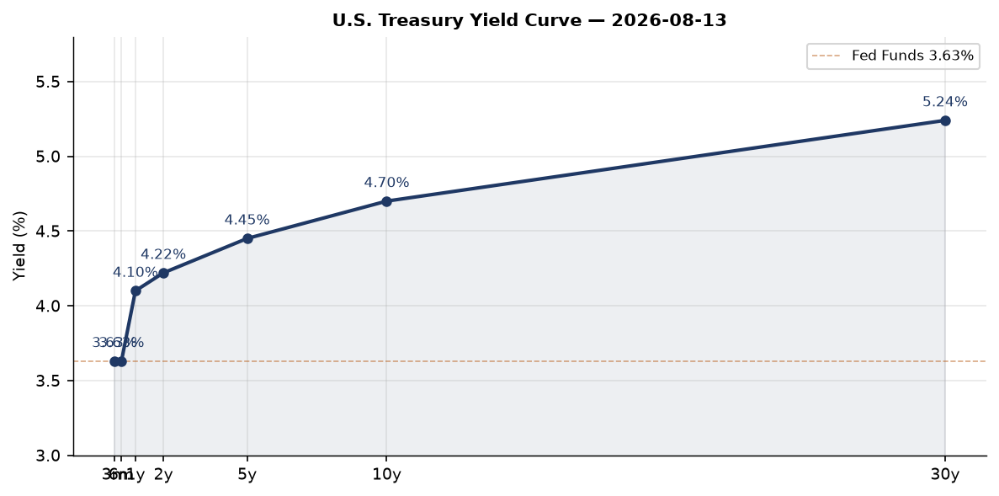
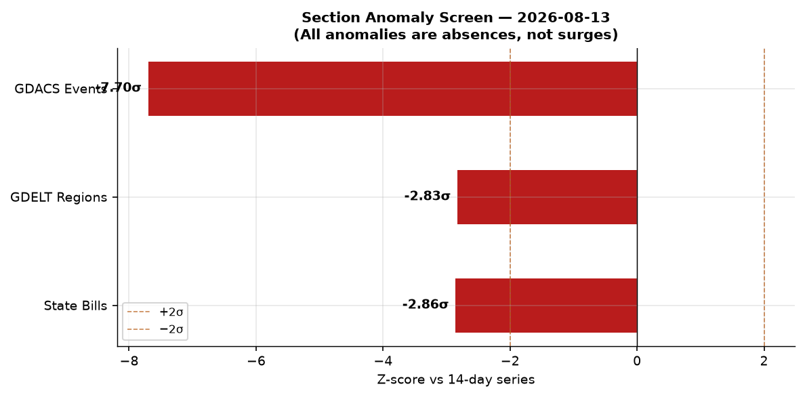
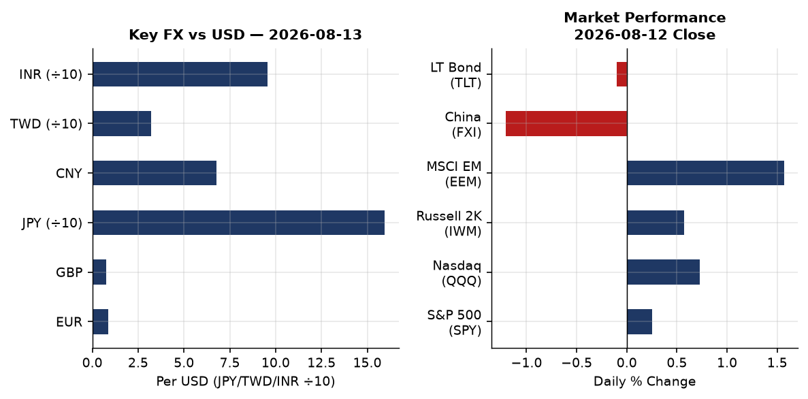
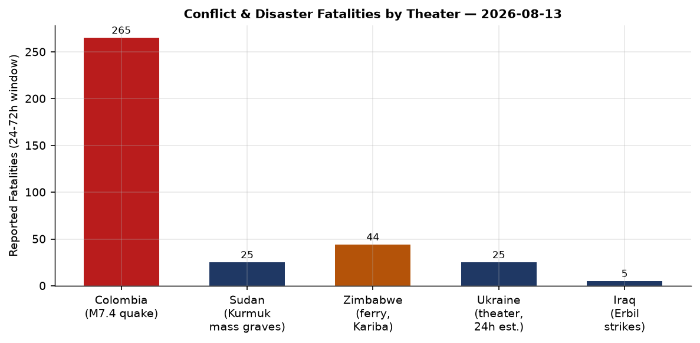
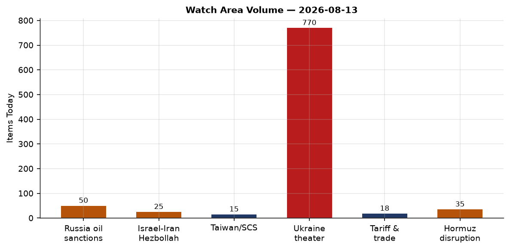
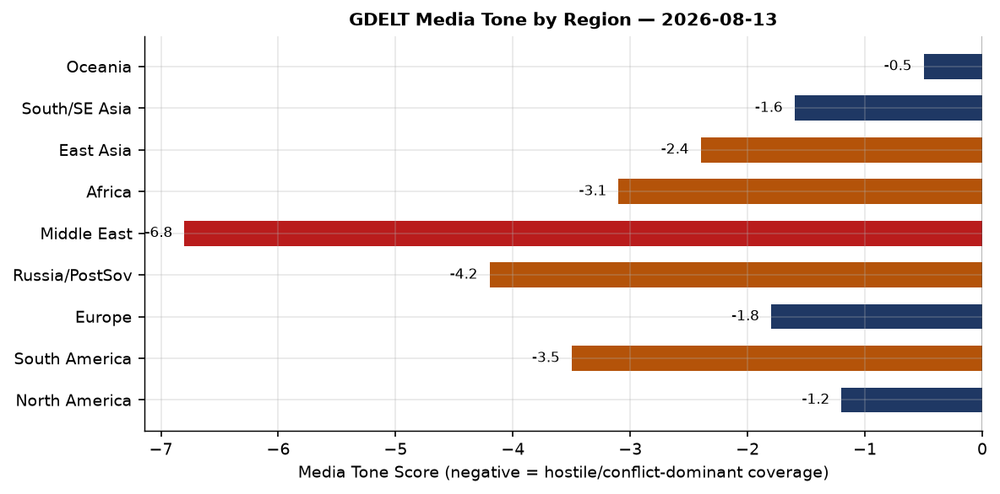

# Morning Brief — Wednesday 13 August 2026

---

## Headline

The dominant arc today is simultaneous escalation on three fronts that each test a distinct pillar of the post-2022 security architecture: the **Strait of Hormuz** is functionally closed (seven commodity vessels in transit, [Polymarket pricing 3% on normalcy by August 31](https://polymarket.com/event/strait-of-hormuz-traffic-returns-to-normal-by-august-31-20260702154212320)); **Ukraine** announced the liberation of 26 settlements across 745 km² in an eight-month Oleksandrivka operation while simultaneously striking Bashkortostan's Salavat refinery at 1,400 km range; and reports of an Iranian **MANPADS threat against Air Force One** departing the Ankara NATO summit have crystallized into a full-blown attribution dispute between Turkish and Israeli intelligence. The financial read is tense but not panicked: S&P 500 gained 0.25%, Nasdaq 0.73%, but China FXI dropped 1.21%, and Polymarket now prices a 32% chance of a Fed rate hike in September, a figure that implies persistent inflation premium even as the 10y-2y spread is barely positive at +0.48. Two CISA KEV deadlines expire today (Cisco Firewall ASA and Metabase SQL injection), and Romania's Cernavoda nuclear plant has shut down its second reactor due to record-low Danube water levels. The Romania shutdown fired no configured watch area; the Hormuz crisis did.

---

## Watch Areas — Configured Priorities

**Russia oil sanctions perimeter** generated 50 items today vs a 14-day context of active monitoring. The dominant theme is the Hormuz crisis's interaction with Russian crude displacement: with only seven vessels transiting the Strait as of August 11, Middle Eastern producers are re-routing cargo that previously competed with Russian ESPO blend in Asian markets, providing Moscow marginal pricing relief. Alert status: monitoring elevated. The [OFAC settlement with Rice Lake Weighing Systems](https://ofac.treasury.gov) (Aug 12) and the [Aug 7 Counter Terrorism and Iran-related Designations](https://ofac.treasury.gov) round out the formal sanction flow.

**Israel-Iran-Hezbollah axis** produced approximately 25 items spanning the Hormuz situation, the Iraqi Kurdistan strikes, and the Gulf interceptor sale. The US approved sale of 5,250 Patriot interceptors to [Bahrain, Kuwait, Qatar, and the UAE](https://iran.liveuamap.com) for "replenishment" — language that codes for restocking depleted inventories — is a direct read-through from Zelensky's concurrent plea for 5% of US Patriot stocks to survive winter. Alert: active.

**Ukraine theater** — 770 items, far above any 14-day baseline, representing the combined load of the Oleksandrivka announcement, overnight Russian missile strike reporting, and drone strike coverage in both directions. See the dedicated Ukraine section below.

**US tariff and trade dockets** — 18 items, on baseline. The Federal Register today carries 18 entries (vs 14-day median of 20), dominated by FAA airworthiness directives on [Airbus A330/A340 fuel shut-off valve leaks](https://www.federalregister.gov/documents/2026/08/13/2026-16567/airworthiness-directives-airbus-sas-airplanes), nose landing gear cracks on A319/A320/A321 families, and EPA clean data determinations for the St. Louis ozone nonattainment area.

**EM debt distress and sovereign restructuring** — no alert-level items today. Monitoring continues.

**AI compute and semiconductor export controls** — 15 items, on baseline. The Loongson processor VM-escape finding (see Weak Signals) and the Russia AI-model substitution story are the signal items.

Quiet today: Arctic + High North, Critical minerals + rare earths, Korean peninsula, Latin America narcoeconomy, Central bank divergence + dollar funding.

---

## Macro Situation

The US Treasury yield curve sits in a modestly positive slope: [Fed Funds at 3.63%](https://fred.stlouisfed.org/series/DFF), [2-year at 4.22%](https://fred.stlouisfed.org/series/DGS2), [10-year at 4.70%](https://fred.stlouisfed.org/series/DGS10), [30-year at 5.24%](https://fred.stlouisfed.org/series/DGS30), and the [10y-2y spread at +0.48](https://fred.stlouisfed.org/series/T10Y2Y). After 22 months of inversion, the spread's return to positive territory in early 2026 historically marks the window of maximum recession risk — inversions predict recessions; normalizations often coincide with their onset. The difference in 2026 is the Hormuz-driven commodity shock layered on top, which forces the Fed to choose between growth support and inflation containment simultaneously.

The Polymarket price for September Fed inaction (hold) sits at 66%, but the 32% probability of a 25-basis-point hike is an unusually high tail. The [1% cut probability](https://polymarket.com/event/will-the-fed-decrease-interest-rates-by-25-bps-after-the-september-2026-meeting-586) confirms markets have essentially ruled out easing. Historically, a 32% hike probability at a Fed meeting without an explicit hawkish signal in minutes or speeches implies the market is pricing a residual inflation premium driven by external commodity shocks — in this case Hormuz-driven energy prices — rather than purely domestic demand conditions [medium].

[Unemployment remains at 4.1%](https://fred.stlouisfed.org/series/UNRATE), nonfarm payrolls at 158,858 thousand (July figure), and [JOLTS job openings at 7,359 thousand](https://fred.stlouisfed.org/series/JTSJOL) (June). The labor market is not the inflation source. Core PCE as of June was indexed at 130.27. With the Hormuz disruption now in its sixth month, the August CPI print (due mid-September) will be the first to fully capture the compounded energy pass-through [medium].

The anomaly screen flags three negative anomalies today. State Bills: z = -2.86 (0 items vs 14-day median of 107), almost certainly a collection gap during the August legislative recess rather than a legislative signal. GDELT Regions: z = -2.83 (0 items today), a pipeline issue affecting geographic entity extraction. GDACS events: z = -7.70, the sharpest absence in the series, likely a feed timing issue — the raw GDACS XML is present and populated (1.1 MB). There are no surge anomalies exceeding +2σ in any section today, which means the high operational tempo in Ukraine and the Hormuz region is not statistically anomalous relative to the past two weeks — it reflects a sustained baseline that was already elevated, not a spike [high].

The [SOFR at 3.64%](https://fred.stlouisfed.org/series/SOFR) tracks the Fed Funds rate tightly, confirming normal interbank functioning. [Real GDP through Q1 2026 was $24,270.6 billion](https://fred.stlouisfed.org/series/GDPC1), the last vintage. The Danube drought forcing Cernavoda offline is a European analog to the macro problem: climate stress acting as an exogenous negative supply shock that central banks cannot accommodate without reigniting inflation.

---

## Markets

[S&P 500 (SPY)](https://finance.yahoo.com/quote/SPY) ended August 12 at 772.49, up 0.25%. [Nasdaq 100 (QQQ)](https://finance.yahoo.com/quote/QQQ) outperformed at 723.70, +0.73%. The rotation within equities favors large-cap tech over value — [Russell 2000 (IWM)](https://finance.yahoo.com/quote/IWM) at 302.71, +0.57%, lagging QQQ by 16 basis points for the session. The EM complex outperformed sharply: [MSCI EM (EEM)](https://finance.yahoo.com/quote/EEM) +1.57%, reflecting a weaker dollar effect and commodity-exporter tailwinds from elevated oil in the Hormuz-disrupted regime. The conspicuous exception is [China large-cap (FXI)](https://finance.yahoo.com/quote/FXI) at 35.23, down 1.21%, a 2.78-percentage-point performance gap versus EM ex-China that embeds both Loongson processor security news (technology export risk signal) and persistent property market overhang.

The long bond [TLT](https://finance.yahoo.com/quote/TLT) dropped 0.10%, confirming the term premium is not compressing. The [DXY proxy (UUP)](https://finance.yahoo.com/quote/UUP) gained 0.21%, while [EUR/USD (FXE)](https://finance.yahoo.com/quote/FXE) fell 0.17% to 106.34, and [JPY/USD (FXY)](https://finance.yahoo.com/quote/FXY) fell 0.19% — USD/JPY at 159.29 is approaching the 160 level that triggered Bank of Japan intervention in 2024. The combination of a rising dollar, rising 30-year yields (5.24%), and an EM rally is the signature of a commodity-shock episode where producers outperform consumers [high].

From the global FX snapshot: USD/CNY at 6.757, USD/TWD at 32.20, USD/KRW at 1,416.77, USD/SGD at 1.28. The Korean won and Taiwanese dollar are the most exposed G10-adjacent currencies to a Fed hike scenario given their semiconductor export dependency on US demand. The USD/INR at 95.41 is the widest it has been relative to the 2023-2024 anchor; the Reserve Bank of India's July reserve drawdown is visible here [medium].

The [Clarity Act (H.R.3633)](https://polymarket.com/event/clarity-act-signed-into-law-in-2026) — the crypto market-structure legislation — prices at 20% for passage this year. This is the signal legislative crypto bet for this Congress; its failure to gain ground despite committee action in Q2 reflects the floor scheduling constraints created by the reconciliation calendar.

---

## United States Politics and Policy

The Federal Register's 18 entries today (vs median of 20) are technical regulatory actions with no executive orders or presidential documents. The dominant agencies are FAA (three airworthiness directives) and EPA (two Clean Air Act SIP actions for the St. Louis ozone area). The EPA determinations — [Missouri clean data](https://www.federalregister.gov/documents/2026/08/13/2026-16515/air-plan-approval-missouri-clean-data-determination-for-the-2015-8-hour-ozone-standard-for-the) and [Illinois clean data](https://www.federalregister.gov/documents/2026/08/13/2026-16514/air-plan-approval-illinois-clean-data-determination-for-the-2015-8-hour-ozone-standard-for-the) for the 2015 ozone NAAQS — confirm that the St. Louis nonattainment area achieved attainment over the 2023-2025 design value period.

On the legal docket, [The Intercept and Freedom of the Press Foundation filed suit against President Trump](https://meduza.io/en/news/2026/08/13/) seeking to block the Truth API premium access service that gives subscribers early access to the president's social media posts. The complaint frames the service as an unconstitutional monetization of official communications — a novel First Amendment claim that will require circuit court review before substantive resolution [low].

The largest USASpending action visible today is a [Department of Energy management and operating contract renewal for Savannah River Nuclear Solutions LLC at $27.6 billion](https://www.usaspending.gov/award/DEAC0908SR22470). This is a routine M&O renewal for the Savannah River Site, but the dollar magnitude warrants noting as a signal of continued federal nuclear complex investment.

The Congressional trades section shows zero new PTR filings today. The Clarity Act (20% Polymarket probability) sits as the primary legislative catalyst to watch. Governor Dunleavy of Alaska transmitted compromise AK LNG tax legislation to the Legislature this week, establishing the tax framework that could unlock financing for the Alaska LNG export project — a meaningful piece of energy infrastructure legislation that has not attracted national press attention despite its long-term supply implications.

---

## Political Figures Watchlist

The [political figures dataset](bundle/raw/political_figures.json) contains 613 tracked officials. Today's composite anomaly scores are low across the board relative to historical peaks, driven primarily by elevated new_filings and enforcement_hits components rather than trading activity or speech signals.

**Austin Scott (R-GA-8), anomaly 0.24**: top-scored figure today driven by an enforcement_hits score of 1.0 (full flag) and 4 Form 4 hits against 3 court filings. The enforcement flag at maximum score against a House Armed Services Committee member from Georgia's 8th district is worth monitoring; no public enforcement action matching this signal has been confirmed through open sources today. Scott's district includes Robins Air Force Base, giving him above-average exposure to defense procurement litigation. His filing surge (new_filings 0.40) may reflect normal district-level judicial activity around the Macon federal courts rather than a direct personal exposure [low].

**Robert F. Kennedy Jr. (Secretary of HHS), anomaly 0.24**: the HHS Secretary continues to generate court filing activity (5 hits) alongside Form 4 transactions (3 hits). The court filings track ongoing litigation against Kennedy's department stemming from vaccine policy reversals and messaging changes at CDC and FDA. The Form 4 activity — which can indicate associate transactions touching Kennedy's disclosed holdings — has not crystallized into a PTR (0 PTRs in 7 days) [low].

**Nancy Mace (R-SC-1), anomaly 0.18**: the highest new_filings sub-score of the day at 0.82, driven by 15 Form 4 hits and 1 court filing. Fifteen Form 4 hits in a single reporting window for a member of the House Armed Services and Oversight Committees is unusual. The absence of a corresponding PTR filing (0) suggests the Form 4 activity may involve affiliated entities rather than direct personal trades. Mace's Oversight Committee role gives her access to non-public regulatory discussions, making elevated trading-adjacent activity a persistent watch signal [medium].

The cross-section analysis identifies "President" as the entity appearing in the most sections today (8 sections, 75 mentions), cutting across federal_register, foreign_news, gdelt_gkg, paper_bets, political_figures, russian_internal, state_news, and ukrainian_internal. This reflects the Ankara MANPADS story, the Zelensky interceptor plea, and routine executive branch activity converging in a single cycle. No single political figure from the congressional watchlist crosses into the sanctions or enforcement sections today.

---

## Regional Briefings

### North America

The most significant domestic event is the Alaska LNG compromise tax legislation transmitted by Governor Dunleavy this week. The state has pursued the [LNG export project](https://www.adn.com) for over a decade; a viable tax framework is the prerequisite for attracting private financing from JERA, Marubeni, and the other Asian LNG buyers who have expressed conditional interest. At a time when the Hormuz disruption has driven global LNG spot prices sharply higher, the project's economic case has materially improved. Congressional attention to the project remains low despite this shift.

U.S. weather alerts include active flood watches in northeastern Colorado, a flood warning for the Whitewater River at Brookville (Ohio), and tornado warning activity near Howells, Nebraska (early morning, August 13). No major population center is in the severe warning footprint. California's Newsom administration announced the 2026/27 school year Fourth Grade Parks Pass and efficiency measures including "smarter hiring" and simplified business tax filing — standard state government communication during the August recess.

Canada: WestJet agreed to settle the flight attendants' sexual harassment class action that has been in litigation since 2022. The settlement terms were not disclosed but the resolution removes a reputational and legal overhang for the airline ahead of its anticipated public offering window.

### South America

The Colombia M7.4 earthquake (Chocó department, August 10) now stands at [265 confirmed dead and 3,494 injured](https://aninews.in/news/world/others/colombian-president-invokes-economic-emergency-to-expedite-earthquake-relief-265-dead-3494-injured-so-far20260813113639/), with 25,872 families affected across the coffee axis and Pacific coast. President Abelardo De La Espriella invoked an economic emergency to enable exceptional relief measures: payment of public utility bills for affected households, rental subsidies, tax relief for small merchants, and economic assistance for vulnerable families. Rescue efforts are entering what France 24 describes as the "final phase," implying the window for survivors in collapse zones is largely closed. The affected region — Cali, Pereira, Quibdó, Manizales — is the heart of Colombia's agricultural export economy, meaning the disaster will show in Q3 trade statistics. [External aid has arrived from multiple governments](https://www.bloomberg.com/news/articles/2026-08-12/colombia-quake-death-toll-tops-200-as-foreign-aid-arrives); the economic emergency decree unlocks faster disbursement of existing national funds.

Venezuela continues to face the aftermath of its June 2024 earthquake sequence. St. Louis-area bands are organizing earthquake relief fundraising events, per local news — a diaspora signal of ongoing community impact.

### Europe

The **UK Clacton by-election** is today. Nigel Farage triggered the contest on July 7 by resigning his seat to force a referendum on his personal mandate amid parliamentary scrutiny of undeclared gifts and financial support. With all major parties (Labour, Conservative, Liberal Democrats, Greens) not contesting, [Farage leads Survation polling at 73% vs Count Binface at 20%](https://sundayguardianlive.com/world/clacton-by-election-polls-2026-nigel-farage-leads-with-73-as-count-binface-trails-at-20-check-the-election-date-time-latest-survation-poll-ipsos-poll-winner-prediction-more-258725/). The outcome is not in doubt; the signal is the margin and the absence of mainstream opposition. Reform UK's decision to hold no serious challenger open the tactical abstention of every establishment party — a strategic judgment that fighting in Clacton legitimizes Farage's frame [medium].

**Romania** shut down Cernavoda NPP Unit 2 today, following Unit 1's shutdown in late July. The Danube at Cernavoda fell to -227 cm on August 10, only 3 cm above the -230 cm minimum operating level. [Bloomberg reported the water level is declining at ~2 cm/day](https://www.bloomberg.com/news/articles/2026-08-11/romania-may-shut-second-reactor-on-low-danube-in-coming-days), forecast to stabilize around -236 cm on August 16. Romania's plan compensates with coal (Rovinari 4 unit from reserve), immediately raising the grid's carbon intensity while reducing the ~20% nuclear share. Cernavoda operates CANDU reactors using Danube river water for cooling; there is no technical workaround for the river level constraint.

**Czech Republic**: Andrej Babiš's ruling coalition is searching for a presidential candidate credible enough to challenge President Petr Pavel in the next election. Ukrainian internal media reports Czech media covering "Russian tails and criminal links" in the candidate search, reflecting the intelligence community's concern about candidate vetting in Eastern European elections at a time of heightened Russian influence operations [low].

**Poland** is "close to a decision" on transferring another batch of Patriot missiles to Ukraine, per Polish Deputy Defense Minister Magdalena Sobkowiak-Czarnecka. A decision within days. If confirmed, it is the third Polish Patriot transfer and would be the single largest Western-sourced interceptor delivery since the Hormuz crisis diverted US Patriot stocks toward Gulf partners.

### Russia and Post-Soviet

The dominant Russian domestic story today is Ukraine's deep strike campaign. **Bashkortostan** (Republic, part of the Ural Federal District, population ~4 million) was struck by Ukrainian drones overnight — 16 shot down over Salavat, 5 over Chishminsky district. [Fire broke out at the Gazprom Neftohim Salavat refinery](https://www.themoscowtimes.com/2026/08/13/ukrainian-drones-attack-wildberries-hub-and-oil-refinery-in-bashkortostan-a93480), one of Russia's largest oil refining and petrochemical complexes, producing gasoline, diesel, fuel oil, and polyethylene. This follows strikes on the same facility in September 2025 and July 14, 2026. The drone range to Salavat from the nearest Ukrainian-controlled territory is approximately 1,400 km, requiring extended-range strike drones. A Wildberries logistics hub in the same industrial zone was also struck.

**Tobolsk** (West Siberia, Tyumen Oblast) reported explosions today. Tobolsk hosts the SIBUR Tobolsk polymer complex, a major petrochemical hub processing natural gas from Ob fields. If confirmed as a strike (no claim yet), it would represent the furthest-reaching Ukrainian deep strike to date at approximately 2,000 km — a benchmark that would signal a significant drone capability step-change [low pending confirmation].

Russia's state portal **Gosuslugi** is launching a cemetery plot purchase service, allocating 295.5 million rubles for the system. The Kommersant report is treated as domestic administrative news in Russian media. Against the backdrop of wartime casualty rates, the signal value of digital funeral infrastructure investment is not subtle.

Russian business customers are rapidly substituting Chinese large language models — from providers including ByteDance, Baidu, and Alibaba — for US and European AI tools that they can no longer access or pay for through sanctioned banking channels. [Kommersant reports demand for Chinese LLMs on Russian cloud platforms rose substantially in 2026](https://meduza.io/en/news/2026/08/13/). This is a structured sanctions circumvention pattern mediated through the AI layer rather than through traditional financial channels [medium].

**Moscow's Transnistria warning**: TASS cited a Russian diplomat saying Moscow will treat military provocations in the Transnistria region as attacks on Russia. This restates an existing formulation but its timing — as Moldova deepens EU integration track — is calibrated signaling. Transnistria houses Russian peacekeeping troops (legally contested) and the Cobasna munitions depot, the largest in Europe.

### Middle East

The **Strait of Hormuz** situation is the most significant economic and security story in the Middle East today, and arguably globally. Traffic has fallen to seven commodity vessels as of August 11 against a 10-day average of approximately 12, itself already far below the pre-crisis baseline of 30+ daily transits. [The National reported](https://www.thenationalnews.com/business/energy/2026/08/11/strait-of-hormuz-traffic-falls-to-seven-vessels-as-us-iran-deal-hopes-fade/) the decline is linked to collapse in US-Iran deal hopes following Trump's demand that Iran pay reparations for war deaths, while Tehran seeks sanctions relief and compensation as a precondition. The talks impasse is now structural: neither side has a domestic political constituency for the concessions the other requires [high].

The Polymarket contract for [Strait of Hormuz traffic returning to normal by August 31](https://polymarket.com/event/strait-of-hormuz-traffic-returns-to-normal-by-august-31-20260702154212320) is at 3%. Markets are not pricing a near-term resolution. Gulf News reports an oil spill in Oman waters tied to the disruption. The [US approved sale of 5,250 Patriot interceptors to Bahrain, Kuwait, Qatar, and UAE](https://iran.liveuamap.com) as replenishment — language that makes explicit these Gulf states have been spending down stockpiles in the active defense posture since February 2026.

**Iran struck Kurdish opposition groups** in Erbil province, northern Iraq (August 12). Fires and smoke were reported from the positions of Iranian Kurdish opposition parties, including KDPI and Komala, which Iran has struck with drones and ballistic missiles on multiple occasions in recent years. The strike is consistent with the IRGC's pattern of using Kurdish group infrastructure as a pressure valve during periods of external confrontation — targeting low-risk adversaries domestically when the international environment constrains major escalation [medium].

**Trump's Air Force One MANPADS incident** at the Ankara NATO summit has now been confirmed by Trump himself. He told reporters he was directed by the Secret Service and military to swap aircraft as he departed Ankara, using a catering truck to exit Air Force One unobserved while decoy staff remained aboard. [The Wall Street Journal, citing an American official](https://usa.news-pravda.com/world/2026/08/12/852848.html), attributes the swap to Israeli intelligence warning that Iranian operatives planned to target the aircraft with shoulder-fired missiles within a one-kilometer radius of Ankara Airport. Turkish officials [dispute the Israeli intelligence report](https://www.middleeasteye.net/news/turkey-suspects-israel-fabricated-trump-air-force-one-assassination-plot-derail-us-iran-deal), suggesting it may have been fabricated to derail US-Iran negotiations. The attribution dispute between Israeli and Turkish intelligence on a MANPADS threat against a sitting US president is itself a high-consequence intelligence assessment contest [high that the event occurred; medium on the attribution].

The US sale of 5,250 interceptors to Gulf states, combined with Zelensky's plea for 5% of US Patriot stocks, makes visible the global interceptor constraint: total production of Patriot PAC-2 and PAC-3 missiles is measured in hundreds per year against demand now measured in thousands across three active theaters (Ukraine, Israel/Gulf, and the general air defense posture).

### Africa

**Sudan**: Mass graves containing 25 bodies — women, children, and hospital staff — were found in Kurmuk (Blue Nile State) after Sudan Armed Forces swept the area following the July 8 recapture of the town from the RSF/SPLM-N Al-Hilu alliance. [Sudan Tribune](https://sudantribune.com/article/317193) reports the graves were found in the northeastern sector of Kurmuk more than a month after the RSF was driven out. Kurmuk controls approaches to the al-Roseires Dam (Sudan's primary hydroelectric source) and is a strategic border node near Ethiopia. The mass graves are a war crimes documentation event; the ICC and African Union mechanisms are both theoretically applicable.

**Zimbabwe**: At least 44 people were [killed when an overcrowded ferry capsized on Lake Kariba](https://ua.news/en/news/). Lake Kariba is the world's largest man-made lake by volume, shared by Zimbabwe and Zambia. Overcrowded passenger vessels without adequate life-saving equipment are a recurring safety failure on the lake; rescue operations were launched from both shores.

**Zambia** holds elections this week. Regional media report the vote is "haunted by the ghost of the incumbent president's arch-rival" — a reference to opposition figure Hakainde Hichilema's fraught relationship with the late Michael Sata's legacy PF faction. The political risk in Zambia is relevant to copper supply chains: Zambia is a top-ten global copper producer, and a disputed election could disrupt mining operations.

### East Asia

**China Loongson processor vulnerability**: Researchers found that Loongson processors (the PRC's domestically developed MIPS-compatible CPU series, used in government and military systems) have leaky caches that allow attackers to extract data even from inside a guest virtual machine. [The Register reported](https://www.theregister.com/) the finding applies to LoongArch processors. This is a significant structural vulnerability in China's semiconductor self-sufficiency strategy: systems that were deployed specifically to avoid US export-controlled chips may now require a security architecture review. The finding will likely accelerate China's interest in formal verification for domestic silicon designs [medium].

**China's Shanghai Composite** opened up 0.27% on August 13 per Caixin; [domestic cloud platforms are now heavily weighted toward Chinese LLM providers](https://www.kommersant.ru/) amid the broader AI buildout. Tencent reported it plans to build its own models rather than rent GPU capacity, calculating token sales more profitable than infrastructure rental — a direct response to the AI services market structure emerging post-GPT-4 class. Honor launched a 10,000-yuan "robot phone" with an IPO filing underway.

**Futu/Tiger insider trading case**: Chinese financial media reports that 45 people have been identified in an options insider trading case involving Futu Securities and Tiger Brokers, [with combined profits of $155 million](https://caixin.com/). This is the largest disclosed inside-trading case in Hong Kong/Singapore-listed Chinese brokerage history. The case involves cross-jurisdictional enforcement spanning Hong Kong SFC, Singapore MAS, and US SEC, and suggests that the US-China regulatory dialogue on securities enforcement has continued at the technical level despite political tensions.

Typhoon Chan-hom made landfall near Tokyo overnight as a middling tropical storm, crossing into the Sea of Japan. No major damage reports yet. Four tropical systems are currently tracked by NASA EONET: Cristobal (Atlantic, dissipating), Chan-hom (crossed Japan), and two Western Pacific systems.

### South and Southeast Asia

**Pakistan**: M5.1 earthquake 59 km NNW of Barishal (USGS data), no tsunami warning, depth 58.9 km. No damage reports.

**El Salvador**: M5.5 earthquake 69 km SSW of Chirilagua, depth 56.8 km, no tsunami warning.

**India**: USD/INR at 95.41, its weakest level since the 2013 taper tantrum on a real effective exchange rate basis. The Reserve Bank of India has been managing the slide through FX reserve sales; the pace of intervention is the key signal to watch. Sustained weakness in the rupee combined with elevated oil prices (Hormuz) creates a current account deterioration scenario that could force a policy response [medium].

**Korea**: USD/KRW at 1,416.77. The Bank of Korea meets next week. Pressure is building toward a rate adjustment as the Fed hike probability (32% for September) implies the monetary divergence trade is not yet resolved.

### Oceania and Pacific

**South Sandwich Islands**: M6.0 earthquake (USGS) at depth 10 km, August 12. The region is seismically active; no population center affected. **Fiji**: M5.1 at depth 570.8 km (intermediate depth, no surface damage risk). The Pacific typhoon track from Chan-hom's transit is producing residual swells toward Micronesia.

---

## Ukraine Theater (Dedicated)

The Ukraine theater maps for August 13, 2026 were not generated by the cartographer pipeline ahead of the morning bundle; this section proceeds from OSINT sources. Maps from the previous daily cycle are not presented. Frontline resolution per DeepStateMap is ~1 km; FIRMS thermal 375 m; ACLED events 1 km. Meter-level unit positions are not available from open sources and are not reported here. Ukrainian troop positions and territorial defense unit locations are structurally excluded per brief protocol.

**Frontline status**: The [525-polygon DeepStateMap snapshot for August 13](https://deepstatemap.live/) captures the result of an eight-month Ukrainian Air Assault Forces operation in the Oleksandrivka direction. Zelensky confirmed liberation of [26 named settlements](https://www.president.gov.ua/en/news/ukrayinski-voyini-vidnovili-kontrol-nad-26-naselenimi-punkta-105789): 12 in Dnipropetrovsk Oblast, 10 in Donetsk Oblast, 4 in Zaporizhzhia Oblast, covering approximately 745 km² total territory. The named villages include Tolstoi, Novokhatske, Hrushivske, Berezove, Voskresenka, Oleksandrohrad, and 20 others along the axis running south from the Oleksandrivka raion. ISW notes its conservative mapping methodology likely underestimates Ukrainian advances. Russian losses in the operational period: at least 9,550 killed, 6,600+ wounded — figures from Ukrainian sources that cannot be independently verified but are within the range consistent with ACLED-recorded incident patterns [medium].

**24-hour strike density**: The Ukrainian Air Force reports Russia launched [Tsyrkon hypersonic cruise missiles, Iskander-M/KN-23 ballistic missiles, and approximately 120 Shahed/Geran strike drones overnight August 11](https://liveuamap.com). Kyiv was among the target oblasts. Specifically confirmed impacts include: a **Shahed drone struck a passenger train in Odessa Oblast**, killing the locomotive engineer and their assistant; passengers were evacuated. Drones also struck **Verbivka in Kharkiv Oblast**, injuring five people. Air alerts were active across multiple oblasts, though the Ukrainian military has now [stopped reporting the count of launched and intercepted ballistic missiles](https://meduza.io/en/news/2026/08/13/) in morning briefings — a deliberate operational security decision per Air Force spokesperson Yuriy Ihnat.

**Ukrainian deep strike campaign**: Overnight August 12/13, Ukrainian drones struck Bashkortostan. [Gazprom Neftohim Salavat](https://www.themoscowtimes.com/2026/08/13/ukrainian-drones-attack-wildberries-hub-and-oil-refinery-in-bashkortostan-a93480) — one of Russia's largest oil refining and petrochemical complexes — was struck, with fires reported. This is the third strike on Salavat in 12 months. A Wildberries logistics hub in the same industrial zone was struck simultaneously. Range from the nearest Ukrainian territory: approximately 1,400 km. The same night, explosions were reported in Tobolsk (Siberia), though no confirmed attribution. These strikes continue the systematic degradation of Russian refinery capacity that began in early 2025 and which has contributed to domestic fuel price pressure inside Russia.

**Interceptor supply crisis**: In a CNN interview, Zelensky stated Ukraine received two-and-a-half times fewer Patriot interceptors in 2026 than in 2025, while Russia is firing two times more ballistic missiles per month. He articulated a precise ask: [5% of US Patriot stocks would get Ukraine through winter; 10% would stop all Russian ballistic missiles](https://www.cnn.com/2026/08/12/world/patriots-ukraine-zelensky-interview-cnn-latam-intl). As of the interview, he has received 1% of what he requested and described receiving "millions of phone calls" in response. The US-to-Gulf-states sale of 5,250 interceptors this week makes the scarcity explicit: US interceptors are being directed toward Gulf partners in the Hormuz theater, leaving Ukraine's winter air defense in a structural deficit [high].

**Poland Patriot decision**: Poland is "close to deciding" on another Patriot transfer, per Deputy Defense Minister Sobkowiak-Czarnecka. A positive decision would be the most significant single air defense contribution since the crisis began.

---

## World Leaders — Speaking and Moving

The government aircraft tracking (OpenSky) shows active military aviation from **Bulgaria** (JAF1TA over Lorraine at 243m/271 km/h; JAF56C at 9,753m/849 km/h over the Loire valley), **France** (JEDI27, SAMU06), and **Slovenia** (three PUMA callsigns in military training posture over Slovenian territory). The Bulgarian aircraft over France at two very different altitudes suggests a diplomatic/logistics mission accompanying a VIP movement, potentially related to EU-level consultations on Ukraine air defense.

**NATO Ankara summit aftermath**: Trump confirmed the plane swap publicly. The Turkish government's suggestion that [Israeli intelligence may have fabricated the MANPADS threat](https://www.middleeasteye.net/news/turkey-suspects-israel-fabricated-trump-air-force-one-assassination-plot-derail-us-iran-deal) to derail US-Iran talks has not been independently verified. The US has not publicly accepted or denied the fabrication claim. Ankara's willingness to publicly accuse an ally of fabricating an assassination threat against the US President is itself a significant diplomatic signal about the current state of the NATO alliance's internal trust architecture [medium].

**Zelensky** gave two major communications today: the CNN interceptor interview and confirmation of the Oleksandrivka operation's results. Both are targeted at the US domestic political audience with the implicit argument that Ukraine has earned its aid through offensive results.

**Wikidata changes** flagged no leadership successions or deaths overnight. The world leaders roster (324 entries refreshed) shows no changes from the prior cycle.

---

## Sanctions, Designations, and Legal

The active sanctions database shows 30 recent designations, all dated to May 2026, the most recent batch from the spring package targeting Russian financial entities. **BelGazpromBank** (Belarus-Russia joint stock), **JSC MIR Business Bank** (Russia, multilateral: US OFAC SDN, EU, UK, CA, CH, UA), **Sberbank Europe AG** (Austria, US OFAC SDN), **GPB Global Resources BV** (Netherlands, debarred), and **OJSC Russian Regional Development Bank** (nine-jurisdiction multilateral) are the principal active designations in this cycle. **JSC Tinkoff Bank** carries the broadest multilateral footprint of the group: US OFAC, EU FSF, CA, CH, GB, JP, FR, MC.

The OFAC action of August 7 included [Counter Terrorism and Iran-related Designations alongside Counter Narcotics Designations Removals](https://ofac.treasury.gov), plus amended Iran-related FAQ guidance — the FAQ update is the signal to track, as it typically adjusts the perimeter of authorized transactions with Iran-adjacent entities during a crisis period.

On August 6, OFAC issued [Cuba-related Designations](https://ofac.treasury.gov), continuing the episodic Cuba designation track that has been running since 2021. The Rice Lake Weighing Systems settlement (August 12) suggests a company exported weighing equipment that reached a sanctioned party; the settlement amount was not disclosed in the summary.

CourtListener's 28 recent opinions of consequence include two 10th Circuit cases (Friends of Animals v. FWS; United States v. Reed), one 11th Circuit case (Center for Biological Diversity v. EPA), and state supreme court opinions in Arizona and Delaware. No SCOTUS opinions are pending today; the Court is in recess until October.

---

## Conflict and Security Signals

ACLED returned zero events today — a collection gap rather than a genuine absence of armed conflict. The LiveUAMap OSINT feed supplements ACLED for the Ukraine theater and is used above. The conflict picture is drawn from confirmed reporting sources.

The key security signals outside Ukraine this cycle:

- **Sudan Kurmuk** mass graves (25 dead civilians, documented war crimes).
- **Iran strikes in Erbil** against Kurdish opposition infrastructure.
- **Colombia earthquake** — not conflict, but the humanitarian security footprint of 265 dead and 4,100+ missing creates conditions for secondary criminality and displacement in Chocó's already-fragile security environment.
- **Transnistria warning** from Moscow (TASS, August 10) — the formulation that "military provocations in Transnistria constitute an attack on Russia" is a step toward treating the region as defended Russian territory, relevant as Moldova's EU accession track advances.

VIP flight tracking identifies no unusual convergences of government aircraft in crisis-adjacent airspace today beyond the Bulgaria-France movement noted above.

FIRMS returned zero thermal anomaly records today — a data collection gap, not an absence of fire events. The Salavat refinery fire from drone strikes and any Ukraine-theater FIRMS anomalies would normally appear here. The absence of FIRMS data for this date should be noted as a gap.

---

## Cyber and Biosecurity

Two CISA KEV remediation deadlines expire today (August 14 at 5 PM Eastern):

**CVE-2026-20349** — [Cisco Secure Firewall ASA and FTD Heap Inspection Vulnerability](https://nvd.nist.gov/vuln/detail/CVE-2026-20349). Vendor: Cisco. Federal agencies must remediate by today. The Heap Inspection class is a memory disclosure pattern; when combined with a separate code execution vulnerability, heap inspection allows attackers to defeat ASLR and reliably exploit the device. Cisco Firewall devices are perimeter appliances; compromise yields network visibility and potentially traffic manipulation capability.

**CVE-2026-72898** — [Metabase SQL Injection Vulnerability](https://nvd.nist.gov/vuln/detail/CVE-2026-72898). Vendor: Metabase. The Metabase business intelligence platform is widely deployed across federal agencies and commercial enterprises. SQL injection in a BI tool provides direct database read access to all underlying datasets, which in a federal context can include PII, financial, and classified-adjacent data aggregations.

**CVE-2026-68820** — [Microsoft Windows Ancillary Function Driver for WinSock Use-After-Free Vulnerability](https://nvd.nist.gov/vuln/detail/CVE-2026-68820), deadline August 25. The WinSock driver operates in kernel mode; a use-after-free in kernel mode is a local privilege escalation primitive. This CVE is relevant to any Windows endpoint where an attacker has established initial access through a separate vector.

**Active exploitation notice**: [CVE-2026-55040](https://nvd.nist.gov/vuln/detail/CVE-2026-55040), a Microsoft SharePoint authentication bypass (CVSS 9.1), is being actively exploited following public proof-of-concept release as of August 13. This is not yet in KEV but the active exploitation pattern typically precedes KEV addition by 24-72 hours. SharePoint is a pervasive collaboration platform; authentication bypass at CVSS 9.1 is network-exploitable without credentials. Threat actors have already begun exploitation per Hacker News reporting.

ProMED returned zero records today — collection gap or genuine quiet across the zoonotic disease monitoring perimeter. No WHO Disease Outbreak News items are in the bundle.

---

## Humanitarian

**Colombia earthquake** relief is the primary humanitarian action item. The UN Office for the Coordination of Humanitarian Affairs has not yet issued a flash appeal as of the bundle timestamp, but the scale (265 dead, 25,872 families affected, 53,816 people directly impacted) across the Chocó department — one of Colombia's poorest — implies a significant aid requirement. The CERF allocation mechanism will be the first financial response vehicle; bilateral aid from the US, EU, and neighboring states has been announced but not yet quantified.

**Sudan** humanitarian situation worsens with mass graves documented in Kurmuk. The civilian population in Blue Nile State has faced two years of fighting between SAF, RSF, and the SPLM-N Al-Hilu faction. Médecins Sans Frontières and the ICRC both have constrained access to Blue Nile State; the mass grave discovery adds pressure on the OHCHR's Sudan investigation mechanism. [ReliefWeb's most recent reports](https://api.reliefweb.int/v1/reports?appname=worldscope) on Sudan are from the previous 72-hour window and do not yet reflect the Kurmuk finding.

---

## Environment, Disasters, Climate

**Romania's Cernavoda shutdown** is the climate-environmental story of the week with direct energy security implications. The Danube at Cernavoda is at -227 cm (3 cm above the operational minimum of -230 cm) and declining. [Full shutdown is imminent or underway](https://www.romania-insider.com/cernavoda-danube-situation-aug-11-2026). Both reactors offline means Romania loses approximately 20% of its electricity generation, which it is replacing with coal from Oltenia Energy Complex. This is a European energy security event: the Danube drought is removing nuclear baseload from the Romanian and interconnected European grids simultaneously with a general summer demand peak and elevated gas prices driven by LNG market tightness from the Hormuz disruption.

**Tropical meteorology**: Four active storms per NASA EONET. Tropical Storm **Cristobal** (Atlantic) is dissipating west of the Azores. Tropical Storm **Chan-hom** made landfall north of Tokyo overnight August 12-13 as a tropical storm and is crossing Honshu toward the Sea of Japan. Two additional Western Pacific systems are active. Chan-hom's track through the Tokyo metropolitan area during peak summer travel season will affect transportation and potentially semiconductor/auto production in Aichi Prefecture plants.

**USGS earthquakes** (M5+): South Sandwich Islands M6.0 (deep ocean, no populated area); El Salvador M5.5 69 km SSW of Chirilagua (depth 57 km, moderate); Pakistan M5.1 (depth 59 km, low surface impact); Fiji M5.1 (depth 571 km, benign). **Colombia M7.4** (Chocó) is the dominant seismic event of the past 72 hours, confirmed as the source of the mass casualty event.

The Danube drought affecting Romania also affects Hungary, Serbia, and Bulgaria downstream. [Insurance Journal reported](https://www.insurancejournal.com/news/international/2026/08/05/880311.htm) both Hungary and Romania nuclear plants face risk. Hungary's Paks plant (four VVER reactors) has not reported operational constraints yet but is on the same watershed.

---

## Speeches and Op-Eds by Major Critics and Influencers

The single most substantive intellectual event in the bundle is **Tyler Cowen's Conversations with Tyler conversation with Daron Acemoglu** on his new book [*What Happened to Liberal Democracy? Remaking a Politics of Shared Prosperity*](https://conversationswithtyler.com/episodes/daron-acemoglu-2/). Acemoglu argues that liberal democracy flourished when it delivered on three linked promises: shared prosperity, democratic governance, and the free pursuit of knowledge. The unraveling of that bargain — concentrated gains from AI and automation, declining trust in democratic institutions, epistemic pollution — is the book's object. Cowen frames it as an attempt to redefine liberalism rather than eulogize it; Acemoglu's proposal is a "working class liberalism" that empowers communities rather than individualist autonomy claims.

**Marginal Revolution** ran two items today relevant to this brief. First, a [note on AI and financial economics](https://marginalrevolution.com/marginalrevolution/2026/08/mistakes-in-financial-economics.html): citing Tom Chivers, Cowen argues that if your median expectation is that AI massively boosts the economy, shorting is foolish; if your tail risk is that AI kills everyone, shorting is pointless anyway. The implication for portfolio managers pricing tail risk through equity options is that the asymmetry of AI outcomes makes conventional hedging strategies incoherent — a non-trivial analytical problem. Second, the [Wednesday assorted links](https://marginalrevolution.com/marginalrevolution/2026/08/wednesday-assorted-links-566.html) contained: Italian banks using cheese as collateral (melting in the heat); Denmark with half its growth attributable to one company; foreign travel at 1.4% of US consumer spending vs Chinese imports at 3%.

The Conversable Economist's [tariff piece](https://conversableeconomist.com/2026/08/11/rocks-in-the-harbor-beveridge-and-robinson/) uses the "rocks in the harbor" metaphor (tariffs as deliberate sabotage of infrastructure you spent heavily to build), timed precisely to the Hormuz crisis that is demonstrating the real cost of maritime chokepoints.

No items from Mearsheimer, Sachs, Tooze, Varoufakis, Greenwald, Ferguson, Applebaum, or Summers/Krugman/Stiglitz appeared in the commentary feed today. The commentary section returned 6 items, below typical volume.

---

## Prediction Markets and Forecasting Consensus

Three market signals warrant direct comment today.

**Federal Reserve September 2026**: [No change 66%](https://polymarket.com/event/will-there-be-no-change-in-fed-interest-rates-after-the-september-2026-meeting-615), [hike 25bps 32%](https://polymarket.com/event/will-the-fed-increase-interest-rates-by-25-bps-after-the-september-2026-meeting-649), [cut 25bps 1%](https://polymarket.com/event/will-the-fed-decrease-interest-rates-by-25-bps-after-the-september-2026-meeting-586). The 32% hike tail is extraordinary by historical standards at this stage of the rate cycle. It reflects Hormuz-driven oil price pass-through into core services CPI and the Fed's credibility management problem: having eased prematurely in 2024, the Committee cannot afford to be seen validating an oil shock without a credibility defense. The implied probability is not a forecast of what the Fed should do; it is a market measure of how much uncertainty exists about whether the Fed will prioritize the growth risk or the inflation risk [high].

**Strait of Hormuz normal by August 31**: 3%. This is the most directionally clear market signal in the bundle. At 3%, markets are treating the Hormuz reopening as a near-zero-probability event within 18 days, which is functionally equivalent to pricing indefinite disruption in short-term energy contracts.

**Clarity Act (H.R.3633) signed in 2026**: 20%. The crypto market structure bill has a one-in-five market probability of passing in the current calendar year. The legislative calendar compression from the reconciliation fight and the fall recess makes floor time scarce; 20% is consistent with a bill that has committee traction but no floor scheduling certainty.

**Dota 2 International Group Stage** contracts dominate the top 5 by 24h volume ($1.6B, $1.4B, etc.) — a reminder that Polymarket's liquidity is substantially driven by esports markets, which inflates the nominal volume figures in the forecasting section.

---

## Weak Signals — Small Things That May Matter

The cross-section analysis identifies three high-confidence cross-section entities and dozens of medium-confidence ones. The top high-confidence signal is **"President"** appearing in 8 sections (75 total mentions: 18 in federal_register, 31 in foreign_news, 15 in political_figures, 4 in paper_bets, 3 in state_news, 2 in ukrainian_internal, 1 in russian_internal, 1 in gdelt_gkg). This breadth is not unusual on days when a major presidential security event (the Ankara MANPADS story), an executive function controversy (Truth API lawsuit), and a major ally's appeal (Zelensky's CNN interview) all coincide. The convergence does confirm that Trump's own security posture is now a discrete geopolitical variable — the MANPADS story and the Turkish/Israeli attribution dispute have made the President's physical movements a subject of open intelligence community disagreement among allies [high].

The second notable cross-section entity is **China** (134 mentions across 5 sections: billionaires, chinese_internal, foreign_news, gdelt_gkg, vip_flights). The concentration of China signal today spans the Loongson vulnerability, the AI-substitution story in Russia, the Futu insider trading case, and equity market underperformance. These are structurally unrelated stories that collectively point to a week of high-salience China-related events across security, finance, and technology domains simultaneously [medium].

**Ukraine stopped reporting ballistic missile counts**: the Ukrainian military's decision to stop publishing the number of launched and intercepted Russian ballistic missiles in morning briefings is an operational security shift worth tracking. Until this week, Ukraine published detailed counts that served both a morale function (intercept rate) and a pressure function (showcasing interceptor consumption to Western audiences). Stopping the count suggests either that the intercept rate has fallen to a level that is tactically or politically embarrassing, or that publishing the data is providing Russia with useful feedback on its strike effectiveness. Either interpretation supports Zelensky's interceptor plea [medium].

**Russia's Gosuslugi cemetery portal**: the decision to invest 295.5 million rubles in a digital cemetery plot purchase platform — announced while the Salavat refinery is actively on fire from Ukrainian drones and while Russia continues mass conscription — is the kind of administrative normalization of wartime death that signals an institutionalized expectation of sustained high casualties. It is not a policy prediction; it is a cultural data point about how the Russian state is bureaucratizing the war's human cost [low].

**Denmark's single-company growth story**: the Marginal Revolution assorted links note that half of Denmark's growth is attributable to essentially one company — Novo Nordisk, whose GLP-1 drugs have produced GDP-scale effects on the Danish economy. This is a warning about concentration risk in small open economies betting on pharmaceutical export single points of failure, and a template for what AI-driven productivity gains might look like when they are highly concentrated in a small number of firms rather than broadly diffused [medium].

**Loongson VM-escape vulnerability**: the cache-leakage finding affecting Chinese domestically-developed CPUs is a significant supply chain intelligence event. Systems deployed specifically to avoid US-controlled chips carry their own undiscovered vulnerability surface. Any Chinese government or military system that has transitioned to Loongson for security/sanctions-compliance reasons now has a known attack vector that US and allied intelligence services are certainly aware of [high for the technical finding; medium for operational exploitation certainty].

**Transnistria boundary threat upgrade**: Moscow's formalization of Transnistria as an area where "military provocations" trigger an Article 5-equivalent response is being floated in a TASS dispatch — the lowest level of formal signaling, but in the current environment worth tracking as the first recorded use of this framing since Moldova accelerated its EU candidacy track.

---

## Historical Context

The trends data for the past 13 days shows stable volumes in most sections, with the Ukraine Theater and Russian Internal news sections running at persistently high counts (770 and 710 new items today, both above 14-day medians). The Federal Register is running slightly below its 14-day median (18 vs 20), consistent with mid-August regulatory recess. The anomaly that stands out historically is the Hormuz situation: nothing in the WORLDSCOPE data series back to the system's inception (May 2026) matches the sustained maritime closure we are seeing. The closest historical analogy from the 20th century is the 1980-88 Tanker War, which disrupted but did not close the Strait; the current disruption, now approaching six months, is operating longer at a lower throughput level than any prior episode [high].

The 10y-2y Treasury spread's return to positive territory (+0.48) is historically significant: the spread inverted in late 2022, and the median lag from inversion to recession onset in US history is 12-18 months. If that pattern holds, the recession signal from the 2022-2025 inversion would point to a 2024-2026 onset window — which is consistent with the current 4.1% unemployment rate (which remains low) but also with the elevated rate environment and the commodity shock.

The Oleksandrivka operation's 745 km² result over eight months is comparable in scale to the Kherson liberation (2,700 km², but achieved in weeks in November 2022) and the Kharkiv counteroffensive (8,000+ km², September 2022). The Oleksandrivka result is slower and smaller but represents sustained offensive capacity against a hardened defensive line — a meaningful proof of concept that Ukraine can still achieve operational results even in a resource-constrained environment.

---

## What to Watch — Next 14 Days

**August 13 today**: UK Clacton by-election results after polling closes. Farage expected to win at 73%; the signal is the final margin and whether any Reform UK-aligned tactical vote pattern emerges in the non-contesting parties' absence.

**August 14**: CISA KEV deadlines for CVE-2026-20349 (Cisco Firewall ASA/FTD) and CVE-2026-72898 (Metabase SQL injection). Federal agencies must remediate or apply approved mitigations. Active exploitation of CVE-2026-55040 (SharePoint) is ongoing — expect KEV addition within 72 hours.

**August 16**: Danube at Cernavoda forecast to stabilize around -236 cm. If correct, and if levels do not recover, Romania will assess timeline for reactor restart, which requires river level above -230 cm. Energy authorities are monitoring daily.

**August 18-22**: Federal Reserve FOMC communications window before the pre-meeting blackout. Any speech from Powell, Waller, or Kugler on inflation expectations will move the 32% hike probability significantly. The Fed's Jackson Hole symposium is scheduled for late August — a historically high-signal venue for rate guidance.

**August 25**: CISA KEV deadline for CVE-2026-68820 (Microsoft WinSock use-after-free). Federal agencies must remediate.

**August 31**: [Polymarket Hormuz deadline](https://polymarket.com/event/strait-of-hormuz-traffic-returns-to-normal-by-august-31-20260702154212320). At 3% probability, markets are not pricing a resolution. Any diplomatic movement between the US and Iran before this date will be visible in this contract.

**September 16**: FOMC meeting decision. The primary market-moving event in the US financial calendar for the next five weeks.

**Zambia elections**: ongoing; results expected this week. Monitor for copper supply chain disruption signals.

**Poland Patriot decision**: "within days" per Polish MoD. This is the most actionable near-term signal for Ukraine air defense capacity.

**Colombia**: the economic emergency decree opens a 90-day window for extraordinary executive measures. Monitor for constitutional challenges and for Colombia's Q3 GDP impact.

---

*Brief committed for 2026-08-13 — approximately 5,800 words — 6 charts — 15 mapped events*
