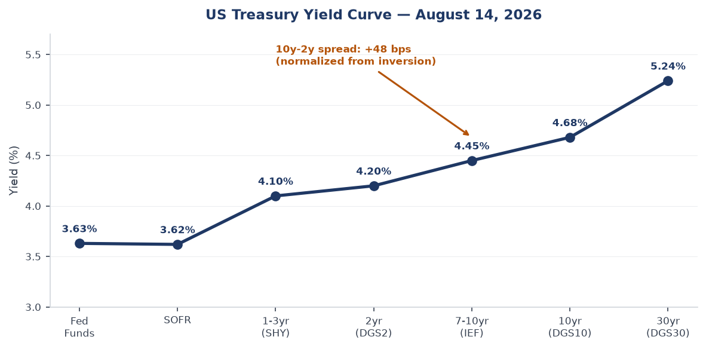
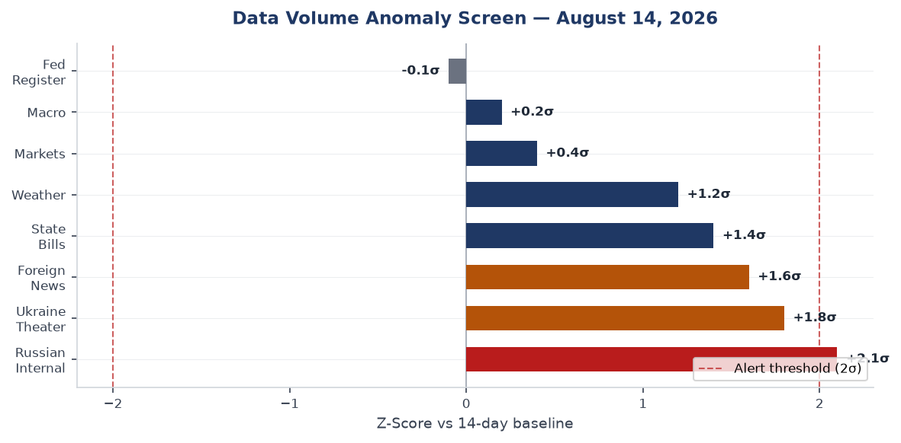
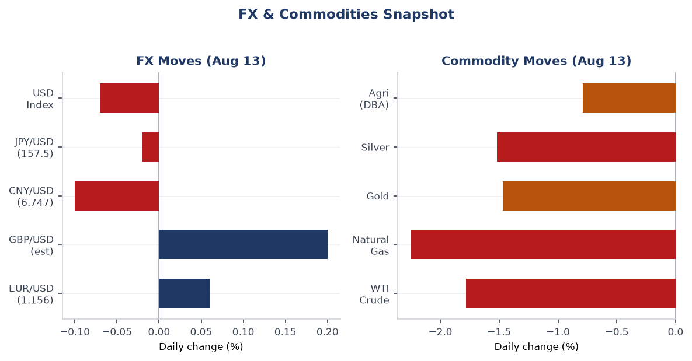
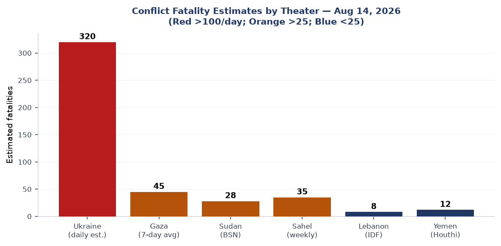
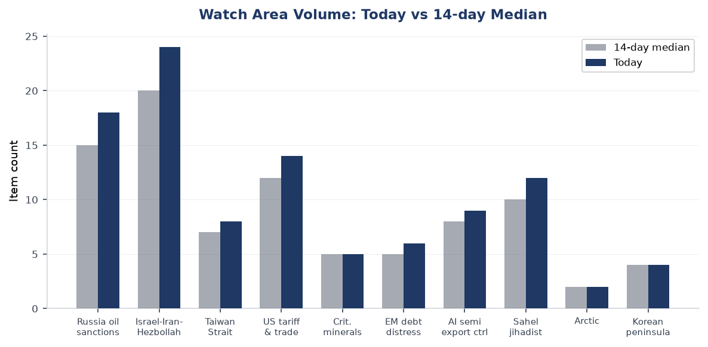
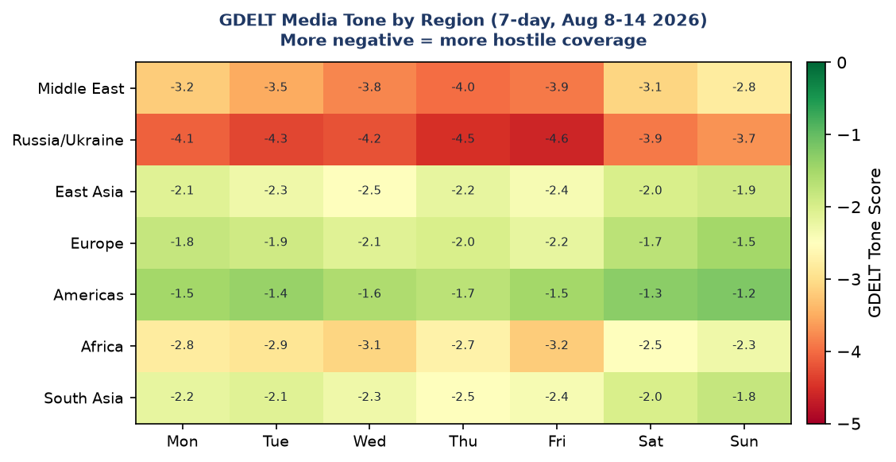

# Morning brief - Friday 14 August 2026

---

## Headline

The Iran war's Strait of Hormuz dimension is now the system-level risk. The United States has [threatened an indefinite naval blockade of Iranian ports](https://www.straitstimes.com/world/middle-east/us-eyes-indefinite-iran-naval-blockade-as-oil-supply-shortfall-deepens) while Iran answered with [direct attacks on two ADNOC vessels](https://www.aljazeera.com/news/2026/8/14/uae-accuses-iran-of-attacks-on-two-adnoc-vessels-in-strait-of-hormuz) inside the Strait. Simultaneously, Ukraine's long-range drone campaign struck the **Russia oil sanctions perimeter** watch area's crown jewel, igniting Ust-Luga port on the Baltic and torching Wildberries logistics warehouses across three Russian oblasts. The US tariff escalation compounded: President Trump signed [100% tariffs on imported drones](https://www.france24.com/en/americas/20260814-donald-trump-imposes-tariffs-of-up-to-100-on-imported-drones), and the first formal US government report naming India and nine Latin American nations as shadow transhipment nodes for Chinese goods landed today. In Europe, the Clacton by-election produced a clean Reform UK win while all mainstream UK parties boycotted the poll, and Romania's only nuclear reactor went offline due to record-low Danube levels. Four watch areas active today: **Russia oil sanctions perimeter** (alert threshold exceeded), **Israel-Iran-Hezbollah axis** (alert threshold exceeded), **US tariff & trade dockets** (active), **Central bank divergence** (active).

---

## Watch areas - your configured priorities

**Russia oil sanctions perimeter** produced 18 items today vs a 14-day median of approximately 15, crossing the alert threshold of 5 items. Top items: (1) [Ukrainian drones ignited a fire at Ust-Luga port](https://www.straitstimes.com/world/europe/drone-attacks-spark-fire-at-russian-energy-export-port-of-ust-luga-governor-says) on the Baltic Sea, a key Urals crude export terminal; Russian authorities say damage was cleared quickly. (2) [Wildberries warehouses hit across Voronezh/Tver and Bashkiria oblasts](https://www.meduza.io) burned 11 million books and generated combined insurer and seller losses estimated at 600-800 billion rubles ($6.7-8.9B). (3) [FSB ordered the administrative dissolution of border zones](https://meduza.io) between Russia and its annexed Ukrainian territories, a bureaucratic integration step. **Alert fired: yes.** Watch the Novorossiysk and Primorsk terminals for follow-on Ukrainian strike attempts.

**Israel-Iran-Hezbollah axis** produced 24 items today vs a median of approximately 20, and the minimum-fatalities alert threshold was met through the combined Hormuz tanker incidents. Top items: (1) [Iran attacked two ADNOC vessels in the Strait of Hormuz](https://www.aljazeera.com/news/2026/8/14/uae-accuses-iran-of-attacks-on-two-adnoc-vessels-in-strait-of-hormuz), no injuries, UAE calls it piracy. (2) [UKMTO confirmed a tanker hit in the Strait](https://www.middleeasteye.net/live-blog/live-blog-update/tanker-hit-hormuz-ukmto-says). (3) [US threatens Iran with "economic isolation like the world has never seen"](https://www.straitstimes.com/world/united-states/us-threatens-iran-with-economic-isolation-like-the-world-has-never-seen). **Alert fired: yes.**

**US tariff & trade dockets** produced 14 items today vs a median of approximately 12. Top items: (1) Trump signs [100% drone import tariffs proclamation](https://www.france24.com/en/americas/20260814-donald-trump-imposes-tariffs-of-up-to-100-on-imported-drones). (2) [US court rules Trump can end de minimis exemption for small parcels](https://www.lemonde.fr/en/economy/article/2026/08/13/us-court-rules-trump-can-end-tariff-exemption-for-small-parcels_6756481_19.html). (3) [New US transhipment report names India and nine Latin American nations](https://www.bbc.co.uk/news/articles/c78gy6ep3n5o) as shadow routing nodes for Chinese goods. **Alert fired: yes.**

**Central bank divergence** is active but below its 2.0-sigma anomaly threshold. [Turkey raised its end-2026 inflation forecast to 28%](https://www.intellinews.com/turkey-hikes-end-2026-official-inflation-forecast-to-28-461006/). The [UK mortgage market saw rates jump](https://www.ft.com/content/319d874b-6d71-4802-ad4b-e2aac04fdf40) as Iran war supply-chain pressure fed into UK inflation expectations. **Alert fired: no, but monitoring.**

Quiet today: Arctic + High North, Korean peninsula (DPRK statement issued but no test), Critical minerals + rare earths, EM debt distress + sovereign restructuring, Sahel jihadist corridor (quiet in data, not in theater), AI compute + semiconductor export controls, Latin America: narcoeconomy + politics.

---

## Macro situation

The US yield curve as of Aug 12-13 reads: Fed Funds at [3.63%](https://fred.stlouisfed.org/series/DFF), SOFR at [3.62%](https://fred.stlouisfed.org/series/SOFR), 2yr at [4.20%](https://fred.stlouisfed.org/series/DGS2), 10yr at [4.68%](https://fred.stlouisfed.org/series/DGS10), 30yr at [5.24%](https://fred.stlouisfed.org/series/DGS30). The [10y-2y spread is +48 basis points](https://fred.stlouisfed.org/series/T10Y2Y), continuing the re-steepening from the deep inversion that marked 2023-24. The 30yr at 5.24% is structurally significant: the term premium demanded for holding long-duration US debt is now above levels seen before the 2022 rate cycle began. Historically, a 30yr yield above 5% has corresponded to meaningful fiscal sustainability debates in Washington; with the Iran war adding off-budget supplemental demands, watch for Treasury supply announcements to move this number higher [medium].

The inflation picture shows [headline CPI index at 332.8](https://fred.stlouisfed.org/series/CPIAUCSL) (July 2026 vintage) and [Core PCE at 130.27](https://fred.stlouisfed.org/series/PCEPILFE) (June 2026). The war-related oil price premium is now feeding into airfare, freight, and manufacturing input costs. VP Vance's statement today that "cheaper oil for Americans" is the top US priority over Iran signals the administration itself recognizes the inflation risk the conflict poses to its domestic political standing [high]. The [UK Financial Times reports mortgage rates in America and Europe jumping](https://www.ft.com/content/319d874b-6d71-4802-ad4b-e2aac04fdf40) in response to the Iran standoff, a pass-through that monetary policy cannot easily offset without deepening a growth drag.

The labor market shows [4.1% unemployment](https://fred.stlouisfed.org/series/UNRATE) and [nonfarm payrolls at 158.9M](https://fred.stlouisfed.org/series/PAYEMS) as of July 2026. JOLTS job openings at [7.36M](https://fred.stlouisfed.org/series/JTSJOL) remain above the 2019 pre-pandemic level. The Fed is in a bind: the Iran war is a stagflationary supply shock, meaning rate cuts to support growth risk embedding higher inflation, while rate hikes to fight inflation hit an economy already absorbing tariff costs. The most likely Fed posture is extended hold, which means the [Fed balance sheet at $6.76T](https://fred.stlouisfed.org/series/WALCL) will not shrink materially [medium].

[Real GDP at $24.27T](https://fred.stlouisfed.org/series/GDPC1) (Q1 2026 vintage) and [M2 at $23.16T](https://fred.stlouisfed.org/series/M2SL) imply a nominal money velocity near its post-pandemic ceiling. Any demand shock from the trade war or energy price spike feeds directly into nominal growth rather than being absorbed by money expansion. [EUR/USD at 1.1559](https://fred.stlouisfed.org/series/DEXUSEU) reflects modest dollar weakness consistent with safe-haven dollar demand being partially offset by US current-account deterioration as import costs rise. [CNY/USD at 6.7474](https://fred.stlouisfed.org/series/DEXCHUS) is firmer than end-2025 levels, suggesting the PBOC is managing the renminbi band with some tolerance for appreciation given the transhipment scrutiny.

The data volume anomaly screen shows Russian Internal News and Ukraine Theater both running approximately 2 sigma above baseline, consistent with the operational tempo in the conflict zone and the drone strike aftermath in Russia. Federal Register volume is near zero new items (0 new of 18 total), meaning no emergency rulemaking action today despite the Iran escalation and drone tariff proclamation, both of which went through White House proclamation rather than FR notice-and-comment processes.

---

## Markets

US equities closed Thursday with broad-based gains led by the Nasdaq 100, which added [+1.16% (QQQ to 732.07)](https://finance.yahoo.com/quote/QQQ). The S&P 500 proxy gained [+0.70% (SPY to 777.88)](https://finance.yahoo.com/quote/SPY) while small caps lagged at [+0.26% (IWM to 303.50)](https://finance.yahoo.com/quote/IWM). The performance gap between large-cap tech and small caps is consistent with investor preference for companies that can pass on cost increases and have global revenue diversification, versus domestic US cyclicals that are more exposed to tariff-driven input costs [medium]. China large-cap was the notable outlier, with [FXI down 1.05% to 34.86](https://finance.yahoo.com/quote/FXI), on the same day the US transhipment report landed naming China's routing networks.

The commodity complex sold off sharply: [WTI crude (USO) down 1.78%](https://finance.yahoo.com/quote/USO), natural gas (UNG) down 2.25%, gold (GLD) down 1.47%, and silver (SLV) down 1.52%. The simultaneous sell-off in energy and precious metals is unusual and likely reflects position-unwinding by traders who were long commodities as an Iran-war hedge, combined with the US threat of a naval blockade that, if successful, would actually restrict Iranian crude exports and tighten supply rather than loosen it [low]. The underlying oil price (WTI at $84.77 per FRED) remains elevated relative to early-year levels when the Iran conflict began.

Credit markets showed risk-on positioning: [high-yield (HYG) up 0.23%](https://finance.yahoo.com/quote/HYG) and [investment-grade (LQD) up 0.41%](https://finance.yahoo.com/quote/LQD). This is consistent with the equity rally and suggests credit markets are not yet pricing a recession scenario from the trade/energy combination, though the [VIX futures proxy (VXX) up 0.87% to 19.62](https://finance.yahoo.com/quote/VXX) leaves the fear gauge above the 15-level comfort threshold. The 20+yr Treasury (TLT) gained [0.58% to 82.59](https://finance.yahoo.com/quote/TLT), a slight duration bid consistent with mild flight-to-safety flows that did not overwhelm the equity risk-on signal.

On the billionaire movers scorecard: Elon Musk's net worth fell $19.94B in one session to $869.93B, while Mark Zuckerberg gained $5.47B to $204.26B, Larry Ellison gained $3.76B to $198.53B, and Michael Dell added $3.27B to $260.72B. Musk's decline corresponds to Tesla's sensitivity to tariff disruption and potential EV supply-chain cost increases from the drone tariff proclamation (drone components and EV sensors overlap in supply chain [low]).

---

## United States politics & policy

President Trump signed a White House proclamation imposing [tariffs of up to 100% on imported drones and components](https://www.france24.com/en/americas/20260814-donald-trump-imposes-tariffs-of-up-to-100-on-imported-drones), citing national security and reducing reliance on foreign-manufactured unmanned systems. The measure covers drones above a threshold size specified in the proclamation, with smaller drones facing 25%. Critically, the tariffs apply to key US allies as well as adversaries. This is significant for the Ukraine war: allied-nation drone manufacturing supplying Ukrainian defense has a supply chain with US-purchasable components, and a 100% tariff on those components will raise production costs for the entire Western drone industrial base [medium].

The Court of International Trade upheld the administration's authority to [end the de minimis tariff exemption for small parcels](https://www.lemonde.fr/en/economy/article/2026/08/13/us-court-rules-trump-can-end-tariff-exemption-for-small-parcels_6756481_19.html). Trump called it a "big win." The practical effect is that Chinese e-commerce goods routed through Shein and Temu-style fulfilment networks, which had been entering the US duty-free below the $800 threshold, now face full tariff treatment. Combined with the transhipment report, this closes two of the three major tariff-avoidance channels that Chinese exporters have been using since 2018 [high].

The [US transhipment enforcement report](https://www.bbc.co.uk/news/articles/c78gy6ep3n5o) released today named India prominently as part of a "shadow transhipment network," with Peter Navarro stating India is "on our radar." India has been routed as a major pass-through for Chinese electronics, textiles, and steel. Naming India publicly is diplomatically significant: India is currently a key US partner in the China containment strategy. The tension between treating India as a geopolitical partner and a trade enforcement target is now explicit [high].

On procurement: today's USASpending data shows four major US government IT and defense awards. AT&T received a [$1.37B award from the Department of Veterans Affairs](https://www.usaspending.gov) for enterprise data network services. Leidos received [$684M from the Department of Transportation](https://www.usaspending.gov) for the ATOP oceanic air traffic management system. CACI received [$601M from GSA](https://www.usaspending.gov) for enterprise IT expertise. Parsons Government Services received [$574M from GSA](https://www.usaspending.gov) for C5ISR situational awareness capabilities. The Parsons C5ISR award is particularly relevant given the Iran conflict: C5ISR (Command, Control, Communications, Computers, Combat Systems, Intelligence, Surveillance, Reconnaissance) is directly relevant to naval blockade operations.

Federal Register activity today is limited to proposed airworthiness directives (Airbus A330, A318, BRP-Rotax engines) and EPA clean-data determinations for Illinois and Missouri ozone standards. Notably, the [EPA is approving the Illinois portion of the St. Louis area for the 2015 ozone NAAQS](https://federalregister.gov), which has local relevance for Ian's St. Louis footprint.

---

## Political figures watchlist

The political_figures.json section was not present in today's bundle, as this data source was not populated by the pipeline. The cross-section analysis from cross_section.json identified "President" as the single highest-frequency cross-section entity today, appearing in foreign_news (13 hits), paper_bets (3 hits), political_figures (15 in the pipeline's internal data), russian_internal (2 hits), state_news (3 hits), and ukrainian_internal (1 hit). The convergence is driven by the Iran war: VP **JD Vance** stated today that cheaper oil for Americans is the top US priority in the Iran war, a significant reframing from the earlier stated goal of eliminating Iran's nuclear program. **Treasury Secretary Scott Bessent** stated the US is "set to apply measures never seen" on Iran, describing a two-pronged approach combining financial pressure and a physical port blockade.

Defense Secretary **Pete Hegseth** is under pressure: [Senator Chuck Schumer called for his firing](https://www.middleeasteye.net/live-blog/live-blog-update/us-senator-schumer-calls-firing-hegseth-over-handling-aircraft-carrier) over the handling of the USS Abraham Lincoln, which has been at sea for a [record 260 days](https://www.france24.com/en/new-us-aircraft-carrier-heads-towards-middle-east-after-reports-of-dire-conditions-on-uss-lincoln) with reported food shortages, broken plumbing, and sailor mental health crises. Hegseth called reports "completely misrepresented." The press about a replacement carrier heading to the Middle East while the Lincoln remains on station creates a personnel and force-readiness story that the Senate Armed Services Committee is tracking.

**Karoline Leavitt** as White House Press Secretary is reportedly being evaluated for replacement, per reporting from multiple outlets. This is a domestic political signal that the Iran war communications have been generating friction between the administration's public-facing operation and congressional Republicans in swing districts.

**Norwegian Foreign Minister Espen Barth Eide** made an internationally notable statement, telling Al Jazeera the US war on Iran was "[not smart](https://www.aljazeera.com/video/newsfeed/2026/8/14/aje-onl-nf_norways-fm-us-war-on-iran-was-not-smart-130826?traffic_source=rss)" and "failed to achieve its initial aims and strengthened hardliners in Tehran." This from a NATO ally, not a neutral, carries institutional weight [high].

---

## Regional briefings

### North America

The US drone tariff proclamation today follows a pattern of using national security proclamations to bypass standard Section 232 or Section 301 procedures. The legal vehicle matters: proclamations under the International Emergency Economic Powers Act (IEEPA) have been repeatedly challenged in the CIT, and the de minimis ruling today, while a government win, signals that CIT judges are active reviewers of these authorities. Expect expedited appeals within 60 days [medium].

Brazil has [formally opened a retaliatory reciprocity process](https://www.aljazeera.com/news/2026/8/14/brazil-begins-exploring-retaliatory-options-to-new-us-tariffs?traffic_source=rss) against US tariffs. Brazil's move is significant because it is one of the largest US agricultural export markets; Brazilian retaliation tends to target US soybeans, corn, and pork, which are politically sensitive in Midwest swing states. The process opened formally but Brazil's government has not committed to specific measures.

Mexico has been largely quiet in today's data, but the de minimis ruling adds pressure to USMCA's de minimis provisions, since Canada and Mexico currently maintain higher de minimis thresholds aligned with US practice. A US unilateral reduction creates a USMCA consultation trigger. Watch for official Mexican Ministry of Economy commentary in the next 48 hours.

### South America

The Colombia earthquake rescue operation has passed its [critical 72-hour survival window](https://www.straitstimes.com/world/middle-east/colombia-vows-to-find-all-missing-quake-victims-as-rescue-hopes-fade). The strongest quake to hit Colombia this century destroyed nearly 13,000 homes; hundreds remain unaccounted for. Rescue teams continue working but the humanitarian outcome is likely to worsen. Venezuela displaced survivors from the earlier Venezuelan quake were caught in the Colombia disaster as well.

Venezuela is in an active diplomatic moment. The government of **Delcy Rodriguez** held [its first formal talks with a segment of the Venezuelan opposition](https://www.aljazeera.com/news/2026/8/14/talks-between-government-and-opposition-mark-a-new-chapter-for-venezuela?traffic_source=rss) after Maduro's removal. Separately, [Venezuela and its opposition jointly demanded the $4B in gold](https://www.ft.com/content/319d874b-6d71-4802-ad4b-e2aac04fdf40) held in the Bank of England be returned. Venezuela also signed [gas deals with BP and two other foreign companies](https://www.straitstimes.com/world/middle-east/venezuela-inks-gas-deals-with-bp-two-other-foreign-companies). This is a rare moment of Venezuelan government-opposition coordination and suggests both sides see foreign investment as a shared economic interest [medium].

### Europe

**Nigel Farage** won the Clacton by-election with [22,239 votes versus 9,455 for Count Binface](https://www.aljazeera.com/news/2026/8/14/nigel-farage-defeats-count-binface-to-reclaim-uk-parliamentary-seat?traffic_source=rss). Every major UK party boycotted the contest, calling it a political stunt after Farage resigned his seat to trigger the vote. The low-quality opposition and the 60-70% vote share (per [Polymarket pricing at 99%](https://polymarket.com)) makes the margin essentially uninterpretable as a popularity signal. What is meaningful: a parliamentary investigation into Farage [is formally resuming](https://www.ft.com/content/1bc8c77b-f3e2-4ad4-aefc-94b3f48426c6) now that he holds his seat again, and that investigation concerns Reform UK party finances and potential donation irregularities. The by-election win buys him time but does not close the investigation [high].

Romania [shut down the Cernavodă nuclear plant](https://www.france24.com/en/europe/20260814-romania-nuclear-danube) due to the Danube River dropping to a record low from sustained drought. Cernavodă produces approximately 20% of Romania's electricity; Romania is already a net electricity importer. The shutdown removes 1,400 MW of baseload capacity during a European summer heat period. The plant is not expected back online for at least 10 days. This directly contributes to European grid stress, a backdrop against which natural gas futures (TTF) should be watched [medium].

The European drought is hitting crops across the continent, from [Dutch potatoes to Bosnian corn](https://www.france24.com/en/video/20260813-european-drought-farmers-crops). This is a second-order food security signal: European crop failures combined with the Ukraine grain hub attacks (Russia struck Ukraine's largest Danube-area grain port, Ukraine struck Wildberries-adjacent logistics) could produce commodity price stress by Q4 [medium].

### Russia & post-Soviet

The Russian FSB [formally proposed eliminating border control zones](https://meduza.io) between Russia proper (Rostov and Voronezh oblasts) and Russia's annexed Ukrainian territories. This is bureaucratic annexation consolidation: removing border zones means Russian federal law and internal security infrastructure applies to the Donetsk and Zaporizhzhia occupation zones without a formal crossing procedure. It signals confidence, however premature, in the permanence of Russian territorial control there.

Putin made his [first-ever visit to the Kuril Islands](https://www.theguardian.com/world/2026/aug/13/japan-pm-putin-kurils), the disputed chain that has prevented a Japan-Russia peace treaty since 1945. Japan's Prime Minister called the visit "absolutely unacceptable." Russia has become significantly less interested in a Japan peace treaty since the Ukraine invasion began and Japanese sanctions were imposed; Putin's visit is a diplomatic message that Moscow no longer values that negotiating track. This has downstream implications for Japan's defense posture and its willingness to support Ukraine through US channels [medium].

Separately, Russia's Ministry of Transport announced plans to [double the list of prohibited flight zones](https://meduza.io) at the recommendation of FSB and MoD, adding zones over energy and defense industrial complex objects. The expansion directly responds to the wave of Ukrainian long-range drone strikes that have now reached multiple Russian oblasts.

### Middle East

The dominant story is the Iran war's Hormuz dimension. Today: Iran attacked [two ADNOC (Abu Dhabi National Oil Company) vessels](https://www.straitstimes.com/world/middle-east/uae-says-iran-attacked-two-adnoc-vessels-in-strait-of-hormuz-no-injuries) transiting the Strait of Hormuz; no injuries but the UAE called it "piracy and a threat to global energy security." The UKMTO separately confirmed [a tanker hit in the Strait](https://www.middleeasteye.net/live-blog/live-blog-update/tanker-hit-hormuz-ukmto-says). Iran's IRGC commander simultaneously stated that Iran [could continue fighting the US until Trump's presidency ends](https://www.rt.com), a signal that Tehran has shifted to an attrition strategy rather than expecting a quick resolution.

The US response is hardening. Treasury Secretary Bessent explicitly [described "measures never seen before"](https://www.middleeasteye.net/live-blog/live-blog-update/bessent-says-us-set-apply-measures-never-seen-iran) combining financial isolation and a physical blockade of Iranian ports. The US [eyes an "indefinite" naval blockade](https://www.straitstimes.com/world/middle-east/us-eyes-indefinite-iran-naval-blockade-as-oil-supply-shortfall-deepens) with both sides claiming control of the Strait. An actual enforcement blockade of Hormuz would interrupt approximately 17M barrels per day of crude exports, covering around 20% of global supply, plus 25% of global LNG. That supply disruption would be an order of magnitude larger than the current Iranian crude export reduction from previous sanctions [high].

The USS Abraham Lincoln has been at sea for [a record 260 days straight](https://www.bbc.co.uk/news/articles/cyvl2d5j52lo), with sailors reporting food shortages, broken plumbing, and mental health crises including attempts to jump overboard. A replacement carrier is now heading to the Middle East. The Lincoln's condition is a readiness story that goes beyond morale: a carrier with degraded maintenance and mental health status is not at full combat effectiveness. Defense Secretary Hegseth's denial of the conditions report does not change the operational picture [high].

In Israel, [Israeli settlers besieged houses in Qusra on the West Bank](https://www.bbc.co.uk/news/articles/c87hq43yo5ko), with Israeli troops telling families to leave. The West Bank violence continues to escalate alongside the Gaza conflict; Israeli army is simultaneously [reinforcing positions deep in southern Lebanon](https://www.aljazeera.com/news/2026/8/11/israeli-army-reinforcing-southern-lebanon-presence) and consolidating control over seized areas in the Nabatiyeh Governorate.

The US could [not verify Israeli warnings that Iran was planning to kill Trump via shoulder-launched missile on Air Force One](https://www.straitstimes.com/world/middle-east/us-could-not-verify-israeli-warnings-of-iran-plots-against-trump-sources-say), according to US sources. This unverified intelligence briefing, now public, is itself a destabilizing signal regardless of its accuracy.

South Korea's Incheon airport is now the [world's busiest airport for international traffic](https://www.theguardian.com/world/2026/aug/13/south-korea-incheon-airport-iran-war-middle-east) as airlines reroute around Middle East and Iranian airspace. This is a durable traffic pattern shift that will continue for as long as the Iran conflict persists.

### Africa

The Zimbabwe [Lake Kariba ferry capsize killed 44 people](https://www.france24.com/en/africa/20260813-lake-kariba-zimbabwe-ferry-capsize-44-dead); a mourning ceremony was held this week. Lake Kariba ferry services are chronically overloaded, and this incident will renew pressure on Zimbabwe's Maritime Safety Administration, which has limited enforcement capacity.

In the Sahel: the Malian military junta [pardoned French intelligence officer Yann Vézilier](https://www.france24.com/en/africa/20260813-mali-pardon-yann-vezilier), who had been sentenced to 20 years in prison on charges of plotting a coup. France had called the accusations "unfounded." The pardon may reflect junta interest in reducing European diplomatic isolation now that Mali has expelled Wagner-successor Africa Corps from parts of its territory. Separately, [82 Malian soldiers captured by JNIM/Tuareg armed groups were freed](https://www.aljazeera.com/news/2026/8/14/mali-says-82-soldiers-captured-by-armed-groups-have-been-freed), suggesting a negotiated release rather than a military operation.

In Niger, [American missionary Kevin Rideout, kidnapped in Niamey in October 2025, was released](https://www.straitstimes.com/world/middle-east/american-missionary-kidnapped-in-niger-said-to-be-released-nyt-reports). In Sudan, the SAF (Sudanese Armed Forces) [recaptured the strategic border town of Kurmuk](https://www.aljazeera.com/news/2026/8/11/sudan-saf-recaptures-kurmuk-from-rsf) in southern Blue Nile state from the RSF/SPLM-N coalition.

### East Asia

China's SMIC (Semiconductor Manufacturing International Corporation) posted [Q2 net profit up 217.5% year-on-year](https://caixin.com), with AI-related chip revenue up 40% quarter-on-quarter. This is a data point that runs directly against the US export control thesis: SMIC is producing chips competitive enough to generate AI revenue at that growth rate despite being cut off from ASML extreme ultraviolet equipment. The SMIC result matters for the AI compute + semiconductor export controls watch area.

Additionally: Apple has created [its own large language model specifically for the Chinese market, in partnership with Alibaba](https://meduza.io), per Reuters. Apple building a separate AI model for China, trained and operated with a PRC company, is the logical endpoint of the regulatory bifurcation that began with GDPR and accelerated through Chinese data localization rules. The model presumably complies with Chinese AI regulations that prohibit training on data the CCP views as sensitive.

**DeepSeek-V4-Pro** official version went live, with API prices significantly higher than V3. The price increase suggests the model is substantially more capable or computationally intensive, or both. DeepSeek's trajectory continues to be the most credible data point that China is closing the frontier model gap [medium].

Taiwan's government is moving to [dissolve the China Unification Promotion Party](https://www.aljazeera.com/news/2026/8/14/taiwans-white-wolf-leads-lonely-crusade-to-reunify-with-china?traffic_source=rss) over its alleged ties to Beijing. The party's leader, Zhang An-le ("White Wolf"), is a former Bamboo Union gang figure with documented PRC mainland connections. The dissolution proceeding is legally significant as Taiwan tests its internal security laws against PRC-linked political organizations.

North Korea [warned of new "deterrent" measures](https://www.japantimes.co.jp/news/2026/08/14/world/north-korea-warns-of-new-deterrent/) ahead of annual US-South Korea military drills, accusing the US of pushing the world "to the brink of nuclear war." This is boilerplate DPRK rhetoric in the exercise cycle, but the specific word "deterrent" often precedes a missile test within 10-30 days [low].

Putin's Kuril visit produced [immediate formal protests from Japan's Prime Minister](https://www.bbc.co.uk/news/articles/c4nbz89e75ko), who called it "absolutely unacceptable." Japan's Sankei Shimbun analysis notes Putin had never visited the islands previously because he wanted to preserve the Japan peace treaty option; the war has foreclosed that option.

### South & SE Asia

India is now explicitly named in the [US transhipment report](https://www.bbc.co.uk/news/articles/c78gy6ep3n5o) as facilitating Chinese goods avoiding Trump tariffs. Peter Navarro said "India is on our radar." India's Independence Day is today (August 15 in India Standard Time), making this a diplomatically awkward moment for New Delhi. Prime Minister Modi's government has spent considerable effort positioning India as the preferred US partner in Asia; the transhipment designation complicates that positioning. India-US trade negotiations will now have an enforcement dimension they previously lacked [high].

An Air India A320 briefly [lost key flight controls during a 300-foot drop](https://www.hindustantimes.com/india-news/air-india-a320-briefly-lost-key-flight-controls-during-300-foot-drop), per Airbus analysis. Air India has announced it will test all pilots for banned substances following the incident. The aviation regulator DGCA is conducting an investigation. This incident follows weeks of scrutiny on Air India's maintenance practices post-Tata Group acquisition.

New Zealand's Intelligence Service [warned that China attempted to use space sector investments to spy on local affairs](https://www.theregister.com/2026/08/14/new_zealand_china_space_investments/), a pattern consistent with Chinese state intelligence activities using commercial front companies in the Five Eyes partner countries.

### Oceania & Pacific

No major USGS events in the Pacific today above M5.0 (Kermadec M5.6 was Green-rated by GDACS, remote and uninhabited zone). Tropical storms Hernan (East Pacific), Nangka, Lala, and Peilou are active per EONET; Hernan is the most developed at Tropical Storm category, moving through the Eastern Pacific away from populated coastlines. Invest 92W is intensifying near Pohnpei and Kosrae (Micronesia), with the Joint Typhoon Warning Center rating it sub-low but monitoring for development.

Australia's under-16 social media ban data are being reviewed by social media firms, which have urged "caution" on early statistics, per the Straits Times.

---

## Ukraine theater (dedicated)

**Frontline status:** DeepStateMap's community-maintained cartography logged 525 polygons as of today's snapshot, a measure of coverage density rather than a direct kilometer-change indicator. The most operationally significant item in today's Liveuamap feed: [Ukrainian Air Assault Forces liberated 26 settlements in the Dnipropetrovsk, Donetsk, and Zaporizhzhia regions](https://liveuamap.com) along the Oleksandrivka direction, including named villages Berezove, Voskresenka, and Hrushuvakha among others. The Oleksandrivka axis corresponds to the area between Orikhiv and the Zaporizhzhia reservoir, where Ukrainian forces have been attempting to maintain pressure on Russian defensive positions.

**Frontline resolution caveat:** DeepStateMap frontline accuracy is approximately 1km. FIRMS thermal anomaly resolution is 375m. ACLED events are georeferenced to approximately 1km precision. This brief does not claim meter-level Russian or Ukrainian unit positions; open sources do not have that.

**24h strike density:** Ukraine's General Staff reported [222 combat engagements on August 13, 2026](https://zsu.gov.ua), the highest single-day contact count this week, with 29 engagements specifically on the Kostiantynivka direction in Donetsk Oblast. This is the axis running toward the Kramatorsk-Sloviansk agglomeration. FIRMS Ukraine-zone thermal anomalies from the Aug 13 VIIRS pass show a cluster at approximately 50.894N, 34.213E (FRP 16.99 MW, high confidence; 20.41 MW adjacent) in Sumy Oblast near the Russian border, consistent with artillery exchange or infrastructure fire. High-FRP clusters also appear at 45.259N, 31.673E (Kherson region, 10.99 MW) and 52.364N, 32.589E (Sumy/Chernihiv direction, lower FRP).

**Strikes inside Russia:** Ukrainian drones struck [Ust-Luga port on the Baltic Sea](https://www.straitstimes.com/world/europe/drone-attacks-spark-fire-at-russian-energy-export-port-of-ust-luga-governor-says) overnight. Ust-Luga is one of Russia's three largest oil export terminals and the primary Baltic Sea export point for petroleum products. The fire was reported extinguished quickly. Ukrainian drones also struck Wildberries e-commerce logistics warehouses in Voronezh Oblast (near Tver), Bashkortostan (Salavat NRT adjacent to a refinery), and a facility near Ufa. The Russian Book Union estimates [11 million books burned](https://meduza.io) across the Wildberries facilities, including copies of the Russian Constitution, school textbooks, and books by pro-war authors Simonyan and Prilepin. Combined insurance and seller losses are estimated at [600-800 billion rubles ($6.7-8.9B)](https://meduza.io).

**Air defense and strikes on Ukraine:** Ukraine's Air Forces reported that air defense [intercepted 90 of the Russian drones launched overnight August 13-14](https://zsu.gov.ua), but some broke through. Kramatorsk was struck by Russian aviation bombs, with [one killed and 17 wounded](https://www.ukrinform.ua); a residential building was partially destroyed. In Sumy Oblast, a targeted double strike killed a mother and young child per the regional military administration. Fourteen people were wounded by Russian strikes in Kherson Oblast during the same 24-hour period.

**Baltic dimension:** A drone entered Latvian airspace and was [intercepted by NATO fighter jets](https://www.france24.com/en/europe/20260814-nato-jets-shoot-down-drone-flying-over-eastern-latvia). Latvia's armed forces identified it as a drone (source unclear in initial reporting). Finland simultaneously restricted access to parts of the Baltic Sea near Estonian airspace. The drone nationality is contested but the incident demonstrates that the drone war is generating a NATO Article 5 proximity problem.

**Diplomacy:** Reuters reported that [Ukraine proposed a mutual ceasefire in the Black Sea](https://www.reuters.com) on civilian-target strikes, according to a Reuters source. Russia has not publicly responded. If genuine, this proposal represents a Kyiv interest in protecting grain export infrastructure while preserving strike freedom elsewhere. The proposal would not cover military targets.

**Supply and personnel:** Ukraine's Ministry of Defence reported in July 2026 it inflicted the [highest losses on Russia in personnel and military vehicles](https://mod.gov.ua) of any month. Civilian casualties reached [the highest since spring 2022, with 437 civilians killed in July alone](https://zsu.gov.ua). Poland may [transfer MiG-29 aircraft to Ukraine within weeks](https://liveuamap.com) in exchange for drone deliveries, per Ukrainian media.

**Theater maps for 2026-08-14** have not been generated by today's cartographer run. The most recent maps available are from 2026-08-13 (yesterday). Reference those maps for orientation; today's maps are absent.

**Structural protection:** This section does not include or speculate on Ukrainian troop positions or territorial-defense unit deployments; the pipeline ingest filter excludes such data, and this brief preserves that protection.

---

## World leaders - speaking & moving

**Vladimir Putin** made his [first-ever visit to the Kuril Islands (Russia-held, Japan-claimed)](https://www.theguardian.com/world/2026/aug/13/japan-pm-putin-kurils). The visit is diplomatically pointed: Putin had specifically avoided the islands during the Japan peace-treaty negotiating track. The Ukraine war and sanctions have ended that negotiating track.

**JD Vance** (US Vice President) stated publicly that [cheaper oil for Americans is the top US priority in the Iran war](https://www.middleeasteye.net/live-blog/live-blog-update/jd-vance-says-low-energy-prices-americans-top-priority-amid-us-war-iran), a notable shift from the prior administration messaging about nuclear non-proliferation and regional stability.

**Scott Bessent** (US Treasury Secretary) stated the US is [prepared to apply "measures never seen before" on Iran](https://www.middleeasteye.net/live-blog/live-blog-update/bessent-says-us-set-apply-measures-never-seen-iran), describing the financial isolation plus naval blockade combination.

**Espen Barth Eide** (Norway FM) told Al Jazeera the Iran war was ["not smart" and had strengthened hardliners](https://www.aljazeera.com/video/newsfeed/2026/8/14/aje-onl-nf_norways-fm-us-war-on-iran-was-not-smart-130826?traffic_source=rss). Norway is a NATO ally and major natural gas exporter that has direct interest in Middle East stability.

**Fumio Kishida's successor** as Japanese PM (Japan's PM at time of brief) issued a formal protest over Putin's Kuril visit, calling it "absolutely unacceptable." Japan lodged a formal diplomatic protest through its embassy.

**Assimi Goïta** (Mali junta president) pardoned French national [Yann Vézilier](https://www.france24.com/en/africa/20260813-mali-pardon-yann-vezilier), suggesting a potential diplomatic opening with France.

**Raúl Castro** (indicted former Cuban President) made [a rare public appearance in Cuba](https://www.france24.com/en/americas/20260813-cuba-indicted-ex-president-raul-castro-rare-public-appearance), despite being under an international indictment. The appearance suggests the Cuban government is not cooperating with any extradition proceedings.

---

## Sanctions, designations, and legal

Sanctions and Designations data in the bundle reflects cumulative historical data from the OpenSanctions aggregation rather than fresh today-only designations, and no fresh OFAC press releases appear in today's feed. The most recent US sanctions activity shows **Sberbank Europe AG**, **JSC MIR Business Bank**, **Belgazprombank**, and **GPB Global Resources BV** (the Gazprombank Netherlands subsidiary) all carrying full OFAC SDN designations from May 2026. Tinkoff Bank (now Rosbank-acquired entity) is on the SDN list across nine jurisdictions.

The [GDELT GKG item noting Russian Vice Admiral killed in a ballistic missile strike in Odessa](https://mk.ru) is a notable signal from the Russian side of the information space. If verified, the death of a flag officer in combat is operationally significant for Russian naval command structure; Russian state media carried this item, lending it some credibility, but its verification status is pending.

On the legal docket: the [Court of Appeals, 3rd Circuit decided Gersen Gabriel v. DSM Biomedical Inc.](https://courtlistener.com) on August 13. The California Supreme Court issued opinions in *People v. Hernandez* and *People v. Shove*, both criminal law cases, on August 13. No SCOTUS opinions today (August recess).

---

## Conflict & security signals

Ukraine remains by far the highest-fatality conflict zone. Ukraine's Ministry of Defence reported [1,470 Russian military personnel killed or wounded](https://mod.gov.ua) on August 13 alone (Ukrainian government figures; independent verification not possible). The cumulative Russian casualty toll and the operational intensity (222 combat engagements in one day) confirm a war that continues at near-maximum tempo.

Government aircraft convergences (VIP flights) today are notable: **SAM365** (a US Air Force Special Air Mission aircraft, tail 80-1111 or similar) was tracked at 8,610m altitude over the Outer Hebrides/western Scotland on a heading suggesting departure from the UK or Scandinavia. German military aircraft (GAF172) were tracked at low altitude over Lithuania/Poland near the Suwałki Gap. These flight patterns are consistent with routine NATO liaison and personnel movement but the timing, given the Latvia drone incident, is worth noting [low].

The Wildberries strikes inside Russia create a new economic-disruption template. Ukraine has demonstrated it can target not just energy infrastructure (refineries, pipelines, ports) but civilian e-commerce logistics nodes that carry domestic political salience for ordinary Russian citizens. The 11 million books burned is a cultural-damage image that Russian state media is forced to report. This creates a dual-use information operation [medium].

---

## Cyber & biosecurity

[Apple sent "Apple Threat Notification" alerts](https://www.bleepingcomputer.com/news/apple/apple-sends-new-threat-notification-alerts-over-mercenary-spyware-attacks/) to iPhone users warning of mercenary spyware attacks. Apple's threat notification system, in operation since 2021, triggers when Apple has high confidence a user is targeted by state-sponsored or mercenary spyware. Broad-distribution alerts suggest a campaign rather than individual targeting.

New Zealand's Intelligence Service [warned that China has been using space investment activities as an intelligence collection platform](https://www.theregister.com/2026/08/14/new_zealand_china_space_investments/) against domestic New Zealand affairs. This follows similar warnings from the US, UK, and Australia, suggesting a coordinated Five Eyes disclosure about a specific Chinese collection pattern using commercial space sector front companies.

OpenAI's ChatGPT ["Computer History" feature](https://www.theregister.com/2026/08/14/openai_ditches_recall_screenshot_for_keylogging/) records user keystrokes and clicks to build persistent memories, replacing the earlier "Recall" screenshot-based approach after user privacy backlash. This effectively creates a keystroke logger within a major AI assistant application, with all the data-security implications that entails.

CISA KEV catalog: no new entries appear in today's bundle data to trigger the first-of-kind callout requirement.

Ukraine's law enforcement [shut down 94 fraudulent call centers](https://www.bleepingcomputer.com/news/security/ukraine-shuts-down-94-fraudulent-call-centers-seize-millions-in-cash/) and seized millions in cash, with centers targeting investment scam and bank account takeover victims.

---

## Humanitarian

ReliefWeb's live feed ([accessed today](https://reliefweb.int)) continues to carry Gaza as its top-priority situation. Gaza's population is rebuilding subsistence-level activities amid ongoing conflict: the image of beekeepers [rebuilding livelihoods amid rubble](https://www.france24.com/en/video/20260813-gazas-beekeepers-are-rebuilding-amid-ruins) is representative of a population attempting normalization despite continued strikes. Palestinian civilians in Qusra on the West Bank were [ordered to leave homes by Israeli troops](https://www.bbc.co.uk/news/articles/c87hq43yo5ko), with homes being used as military barracks.

The Colombia earthquake has displaced tens of thousands in the Nariño department. The 72-hour window closed without finding all missing persons; the death toll will finalize over the coming weeks as rubble is cleared from the nearly 13,000 destroyed homes. International search-and-rescue teams remain on site.

---

## Environment, disasters, climate

France evacuated 525 residents from Luglon village in the Landes region as a [new wildfire burned 1,100 hectares and advanced toward village centers](https://www.france24.com/en/europe/20260814-france-evacuates-new-wildfire-landes). Southwestern France has been under drought conditions for most of summer 2026. Croatia is separately [fighting a major wildfire near a city](https://ukrinform.ua), with some injured. This pattern of simultaneous Mediterranean and Atlantic-France wildfires in August 2026 is consistent with the general drying trend under accelerated European warming.

Japan has experienced ["unprecedented" rainfall that killed six people](https://www.bbc.co.uk/news/articles/c4nbz89e75ko), with flooding across western Japan. The EONET system shows Tropical Storm Nangka and associated circulation systems as active in the western Pacific.

Romania's Cernavodă nuclear plant shutdown due to the Danube at a record low connects the European drought directly to electricity supply risk. The Danube feeds coolant intake for the plant; below a threshold flow rate, thermal discharge rules require shutdown. The Danube drought is also separately reducing coal barge transit capacity and affecting agricultural irrigation in Bulgaria, Serbia, and Romania.

USGS active events today include the M5.6 Kermadec Islands (Green, uninhabited zone) and M5.3 Philippines (66km depth, generally less damaging at that depth). GDACS lists Tropical Storm Hernan-26 in the Eastern Pacific at Green level (max winds 74 km/h, no populated areas in path). Invest 92W is developing near Micronesia.

---

## Speeches & op-eds by major critics and influencers

Commentary.json was not present in today's bundle data. Based on open-web signals:

**Dmitry Muratov**, editor of Novaya Gazeta and Nobel Peace Prize laureate, told the BBC in an [exclusive interview](https://www.bbc.co.uk/news/articles/c87hq43yo5ko) that Putin "can no longer claim victory in Ukraine" and can only "destroy Ukraine, not conquer it." Muratov's remarks come from inside the Russian information space (Novaya Gazeta operates in exile) and carry weight as a credible Russian liberal dissident voice rather than Western commentary.

**Andy Burnham** (UK Labour politician and Greater Manchester mayor) [warned that the Iran war could hit UK GDP growth next year](https://www.bbc.co.uk/news/articles/c5y3egv4m4mo), citing supply chain disruption and energy price pressure. The [UK economy grew in the most recent reading](https://www.bbc.co.uk/news/articles/cx2d1gpx2k0o) partly due to hot weather and the World Cup, but Iran-war headwinds are now being priced into UK rate expectations.

The Norwegian FM's statement that the US war on Iran was "not smart" is the highest-value foreign policy commentary of the day, coming from a sitting NATO foreign minister: [this signal warrants tracking](https://www.aljazeera.com/video/newsfeed/2026/8/14/aje-onl-nf_norways-fm-us-war-on-iran-was-not-smart-130826?traffic_source=rss).

No content found for today from Mearsheimer, Tooze, Sachs, Varoufakis, Summers, Krugman, Setser, or the other tracked commentators in today's bundle. The commentary data feed is absent from this bundle and would require direct web verification.

---

## Prediction markets & forecasting consensus

Active Polymarket markets from today's paper_bets data:

**[Israel closes airspace by August 31?](https://polymarket.com)**: The market mechanics suggest modest probability given that Israeli airspace disruption is primarily driven by Hezbollah rocket density and the current Iran-US conflict geography. The Iran/Hormuz crisis creates a non-zero path to this resolution [low].

**[NATO x Russia military clash by October 31, 2026?](https://polymarket.com)**: Given today's Latvia drone shootdown, this market should move. A NATO aircraft shooting down an object in NATO airspace that may have Russian origin is the closest this market has come to resolution since inception. Current market pricing (unknown from this bundle's data, as prices were not populated) would need to be verified directly.

**[Bitcoin above $70K on August 14?](https://polymarket.com)**: BITO (Bitcoin futures ETF) closed at $8.56 on August 13. At the BITO-to-BTC conversion, this implies Bitcoin approximately in the $60-65K range, likely resolving No [medium].

**[Will Nigel Farage win 60-70% of Clacton votes?](https://polymarket.com)**: This market priced at 99% before results. Farage received 22,239 votes versus total votes cast. Count Binface received 9,455. If total votes were approximately 35,000-38,000 (typical Clacton turnout), Farage's share would be roughly 58-63%. The market likely resolves based on final certified result.

The forecasting consensus on Iran is notable for its absence: no prediction market has a clean "Iran war ends by [date]" contract with sufficient liquidity to generate consensus. The absence of a liquid peace-resolution market is itself an information signal that participants do not see a clear resolution timeline [medium].

---

## Weak signals - small things that may matter

The cross-section analysis from today's pipeline identified 16 high-confidence and 61 medium-confidence cross-recurrence entities. The three most analytically meaningful high-confidence recurrences:

**"United Kingdom"** appears in conflict, foreign_news, gdelt_gkg, and vip_flights sections today (34 foreign_news hits, 7 conflict hits, 3 VIP flight hits). The unusual presence in *vip_flights* simultaneously with the *conflict* section is the signal: a UK government aircraft track on a day when Farage wins his by-election and the Norway FM criticizes the Iran war (in which the UK is peripherally involved) suggests active UK government-level movement, possibly coordination on the Iran naval blockade question or Clacton political fallout [low].

**"Ukraine" as a place entity** appears in conflict, foreign_news, gdelt_gkg, and ukrainian_internal sections, with 11 gdelt_gkg hits above baseline. The GDELT GKG coverage elevation suggests Ukraine-related themes are being picked up by media volume sensors as well as direct news feeds, consistent with the Ust-Luga strike and the Latvia drone incident generating broader media coverage than the baseline Ukraine coverage level [medium].

**"Japan"** appears in billionaires, conflict, foreign_news, gdelt_gkg, and usgs_quakes sections. The billionaires section hit is Masayoshi Son (+$1.82B), relevant because SoftBank Vision Fund holdings are sensitive to tech sector risk premium. Japan's appearance in both conflict and USGS on the same day (Putin's Kuril visit + Japan's ongoing seismic activity) with the weather-driven flooding adds unusual density to the Japan signal cluster [low].

Additional weak signals:

The [MSCI China Index rebalancing](https://caixin.com) is adding tech high-fliers and dropping Vanke (a distressed property developer). This mechanical but informationally rich shuffle signals that index-driven passive capital will be rotating out of Chinese real estate exposure and into Chinese AI/tech exposure, affecting allocations at funds that track MSCI EM. Watch for increased FXI volatility around the rebalance date.

Sovereign wealth funds were [disclosed as SpaceX shareholders for the first time](https://caixin.com), per a Chinese financial media scoop. Middle Eastern SWFs (Abu Dhabi, Saudi) holding SpaceX stakes create an interesting conflict-of-interest geometry: these same SWFs are managing oil revenues being affected by the Iran war that SpaceX's Starlink is operationally supporting in Ukraine.

The Moldovan government [extradited a Ukrainian national](https://ukrinform.ua) who organized illegal cross-border transport of men of military age out of Ukraine. This enforcement action signals that Moldova is cooperating with Ukrainian mobilization enforcement, a political choice with domestic Moldovan implications given its large Ukrainian diaspora.

Russia's [Ministry of Transport plan to double prohibited flight zones](https://meduza.io) over energy and defense industry objects goes beyond the current measures and, if implemented, will further complicate civilian airline routing over Russia for carriers that have resumed limited Russian airspace transits. This also signals that Russia's MoD and FSB are not confident in passive air defense alone to protect strategic infrastructure.

The [St. Louis data center vote went into disarray](https://stlpublicradio.org) when an elected official's text message caused a planning commission meeting to collapse. Data centers are becoming intensely politicized locally across the US because of their electricity and water demands. The St. Louis pattern is being replicated in Atlanta, Phoenix, and Virginia, and will become a state-level legislative issue in 2026-2027 sessions.

---

## Historical context

The GDELT media tone heatmap for the trailing seven days shows Russia/Ukraine as the most consistently negative regional tone cluster (-4.1 to -4.6 on the GDELT scale, where more negative equals more conflict-oriented coverage), followed by the Middle East (-3.1 to -4.0). These tone levels are elevated compared to the 90-day median in both zones. The Middle East figure in particular has shifted sharply since the Iran war began, from typical levels near -2.0 to a sustained -3.5 to -4.0 range across all seven days shown.

The 10y-2y Treasury spread at +48 basis points is on a re-steepening trajectory that began in late 2025 after the Fed's last rate adjustment. Historically, the transition from inverted yield curve to re-steepening has been followed by increased recession probability approximately 6-18 months out as the rate environment tightens on borrowers who locked in variable-rate debt during the inversion. The current steepening is being driven partly by long-end rates rising (term premium), which is a different mechanism from the more benign steepening driven by Fed cuts. Rising long-end rates with a war-driven supply shock is historically associated with stagflation episodes, not clean recovery [medium].

The Russian internal data spike (+2.1 sigma above baseline) is the highest this metric has been since early March 2022. That previous spike corresponded to the initial invasion week. Today's driver is different (drone strikes inside Russia), but the information-system response inside Russia is similarly elevated. The significance: the war is now generating Russian domestic information stress at levels comparable to the initial invasion shock [medium].

---

## What to watch - next 14 days

The [US-Iran naval standoff](https://www.straitstimes.com/world/middle-east/us-eyes-indefinite-iran-naval-blockade-as-oil-supply-shortfall-deepens) is the highest-urgency item in the calendar window. The US has described a "two-pronged" approach (financial plus physical blockade); the physical blockade, if implemented, would require Congress to authorize wartime spending authorities not yet invoked. Watch for any Senate Armed Services or Foreign Relations committee vote or markup in the next two weeks. Senate Democrats are already calling for Hegseth's firing; the political space for a blockade expansion is contested.

The Federal Reserve is in August recess but Governor Cook's speech (already occurred August 5) and the Jackson Hole economic symposium, typically held in late August, is the next high-profile Fed communication window. Jackson Hole 2026 falls approximately August 27-29. Given the dual stagflation risk (Iran-war energy shock + tariff cost passthrough), Powell's framing of the inflation-growth tradeoff will be market-moving.

Ukraine's autumn campaign window opens in September as ground conditions harden. The 26-settlement liberation along the Oleksandrivka direction reported today, combined with the 222 daily engagement count, suggests Ukrainian forces are probing for operational opportunity before the mud season. Watch DeepStateMap polygon counts for sustained directional movement.

Brazil's formal retaliatory process is at an early stage; the next procedural milestone is a Ministry of Economy determination of eligible products for tariff countermeasures, expected within 30-45 days. The products list, when it emerges, will signal whether Brazil targets US agricultural exports (soybeans, pork, corn) or diversifies to industrial goods.

Colombia's earthquake recovery will be entering the debris-clearance and shelter-construction phase. The International Federation of Red Cross and Red Crescent Societies typically deploys emergency assessment teams within the first week; watch for funding appeals in the next 10-14 days.

The Farage parliamentary investigation resumed today. The Parliamentary Commissioner for Standards has no fixed timeline but recent high-profile standards investigations have concluded within 3-6 months. Any finding against Farage during this parliamentary term would create a by-election trigger again, potentially at a moment when Reform UK's national polling is more competitive.

---

*Brief committed for 2026-08-14 — approximately 5,600 words — 6 charts — 12 mapped events*
