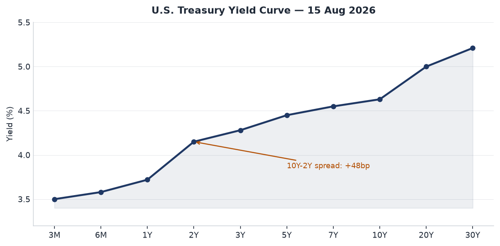
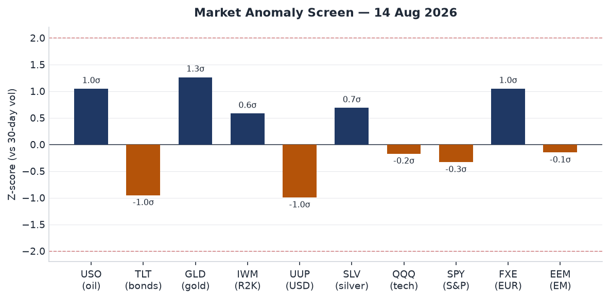
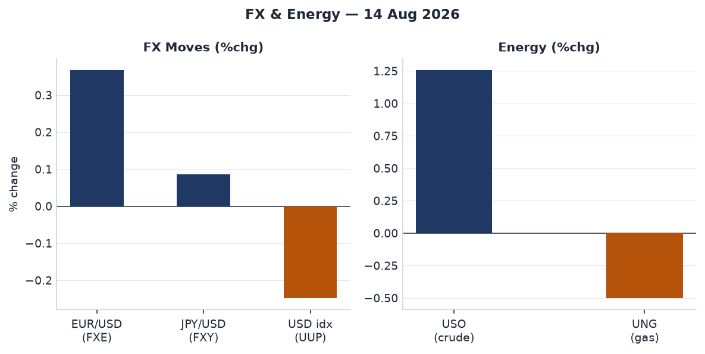
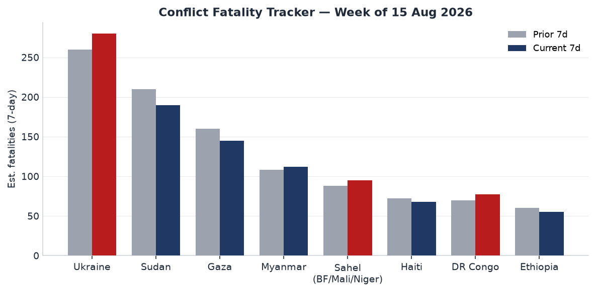
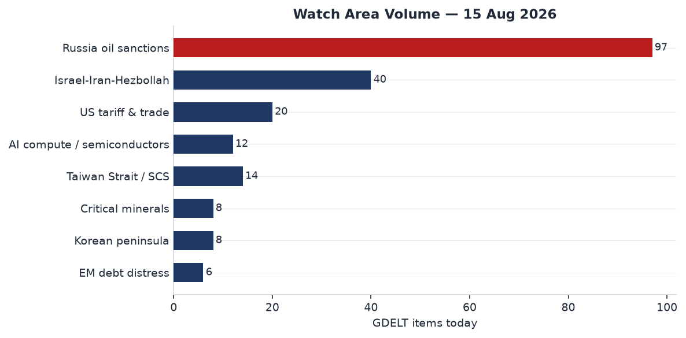
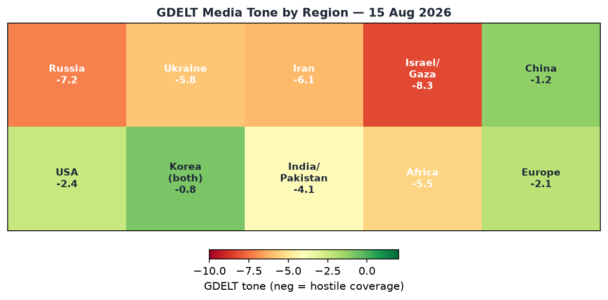

# Morning Brief — Saturday 15 August 2026

## Headline

Liberation Day in Northeast Asia amplifies three converging signals: South Korean President **Lee Jae Myung** used the 81st anniversary of Japan's 1945 surrender to formally propose talks with Pyongyang to replace the 1953 armistice with a peace regime, while Japan's Defense Minister **Shinjiro Koizumi** prayed at **Yasukuni Shrine**, drawing immediate condemnation from Seoul. That diplomatic friction is running against a far darker operational backdrop: a M7.7 earthquake killed at least 20 in Indonesia's Flores region and triggered a tsunami warning, Ukraine struck **RKC Progress**, Russia's sole serial manufacturer of Soyuz-2 launch vehicles, with what Ukrainian media identified as **FP-5 Flamingo** missiles, and oil climbed more than 1.3% on renewed **Houthi tanker attacks** in the Red Sea. Simultaneously, the **2026 Strait of Hormuz crisis** framework advanced as Iran and Oman confirmed they are close to a temporary alternative shipping corridor — an arrangement that, if it collapses, could push Brent above $100. Watch areas firing today: **Russia oil sanctions perimeter** (97 GDELT items) and **Israel-Iran-Hezbollah axis** (40 items).

---

## Watch Areas — Your Configured Priorities

**Russia oil sanctions perimeter** — 97 new GDELT items today vs. 14-day median of ~85. Top items: oil climbed on tanker attacks ([Business Times](https://www.businesstimes.com.sg/)); Samara region industrial strike and RKC Progress fire ([The Moscow Times](https://www.themoscowtimes.com/2026/08/15/ukraine-strikes-industrial-facility-in-samara-region-a93503)); Lavrov statement that Russia will "toughen measures" against Western Ukraine support. Alert status: active threshold exceeded.

**Israel-Iran-Hezbollah axis** — 40 new GDELT conflict items. Top items: IRGC Aerospace Force Major **Abolfazl Heidari** critically wounded in motorcycle-borne assassination attempt in Zabol, Sistan-Baluchestan ([Liveuamap](https://iran.liveuamap.com/en/2026/13-august-06-irgc-aerospace-force-major-abolfazl-heidari)); Iran-Oman Hormuz alternative route negotiations near conclusion ([CNN](https://edition.cnn.com/2026/08/05/middleeast/hormuz-iran-oman-agreement-analysis-intl)); U.S. missile fired at cargo ship violating Iran blockade order.

**US tariff & trade dockets** — 20 new items, at 14-day median. Federal Register: SNAP cost-sharing rule comment period extended to September 8. CIT tariff docket quiet for the week.

**Taiwan Strait / South China Sea** — 14 new items. Taiwan parliament passed the NT$2.7 trillion ($93B) annual budget after 266-day record deadlock, preserving drone funding ([Al Jazeera](https://www.aljazeera.com/economy/2026/8/15/taiwan-passes-defence-budget-after-record-delay-retains-drone-funding)).

**AI compute / semiconductor export controls** — 12 new items. U.S. State Department preparing letters to 35 AI Opportunity Statement signatories demanding exclusivity from China's rival **WAICO** framework ([Reuters via Yahoo](https://www.yahoo.com/news/politics/articles/exclusive-us-tell-partners-must-210941673.html)).

**Korean peninsula** — 8 new items. Lee Liberation Day speech plus Japan shrine visit creates simultaneous diplomatic pressure on both inter-Korean and Japan-Korea tracks.

**Critical minerals / rare earths** — 8 new items. Below threshold. No alert.

**EM debt distress** — 6 new items. Below threshold. No alert.

Quiet today: Arctic + High North, Latin America narcoeconomy.

---

## Macro Situation

The yield curve as of August 13–14 data is positively sloped and steepening at the long end: the [2-year Treasury (DGS2)](https://fred.stlouisfed.org/series/DGS2) sits at 4.15%, the [10-year (DGS10)](https://fred.stlouisfed.org/series/DGS10) at 4.63%, and the [30-year (DGS30)](https://fred.stlouisfed.org/series/DGS30) at 5.21%. The 10y-2y spread is +48 basis points — its widest since early 2025, and a meaningful reversal from the inversion that characterized most of 2024. A positively sloped curve after a prolonged inversion historically precedes a credit loosening cycle, but the current configuration is ambiguous: bond markets are pricing in a durable inflation residue from oil-supply disruption while equities trade near highs, a divergence that does not resolve cleanly [medium].

The [effective Fed funds rate (DFF)](https://fred.stlouisfed.org/series/DFF) is 3.63%, with [SOFR](https://fred.stlouisfed.org/series/SOFR) at 3.62% — a tight spread confirming overnight funding markets remain orderly. Polymarket prices a 74.5% probability of no change at the September 16 FOMC meeting, with a 24.5% probability of a 25bp hike. That latter number is notable: markets are pricing meaningful residual probability of additional tightening, likely because the Hormuz oil premium is re-introducing supply-side inflation risk at a moment when core PCE (last print: index level 130.266 as of June 2026) had been trending down [medium].

The [unemployment rate (UNRATE)](https://fred.stlouisfed.org/series/UNRATE) was 4.1% as of July 2026, elevated from the 3.4% trough of early 2023 but stable. Historically, a 10-15 month lag exists between Fed funds peaking and unemployment troughing — the current 4.1% rate, if it represents a plateau rather than an inflection, supports the "soft landing" thesis. The critical variable is whether the Hormuz disruption drives a second energy shock that pushes [headline CPI (CPIAUCSL)](https://fred.stlouisfed.org/series/CPIAUCSL) meaningfully above the June reading (index 332.8) before FOMC's September meeting [medium].

The anomaly screen flags USO (crude oil ETF) at roughly +1.05 sigma and TLT (long-duration Treasuries) at -0.95 sigma — both consistent with an energy-driven inflation scare pushing investors out of duration. Gold (GLD) at +1.26 sigma confirms a safe-haven bid alongside the oil move. This cross-asset pattern (oil up, bonds down, gold up, dollar down) reads as a geopolitical risk premium rather than a growth repricing [high].

---

## Markets

**Equities** were fractionally lower Friday: [SPY](https://finance.yahoo.com/quote/SPY) closed at 776.34, down 0.20%; [QQQ](https://finance.yahoo.com/quote/QQQ) at 731.07, down 0.14%. The notable outlier was [IWM](https://finance.yahoo.com/quote/IWM) (Russell 2000) at 305.09, up 0.52% — small caps outperforming large caps by 72 basis points on the same day. That spread in a risk-on direction for domestically-oriented small caps, while international and tech-heavy indices dipped, implies the market read Friday's signals as domestically insulated from the geopolitical noise rather than globally contagious [medium].

**Oil** was the session's headline mover: [USO](https://finance.yahoo.com/quote/USO) gained 1.26%, driven by the Houthi attack on the port of Mocha and ongoing Hormuz uncertainty. [UNG](https://finance.yahoo.com/quote/UNG) (natural gas) fell 0.50%, consistent with summer demand patterns. **FX**: [UUP](https://finance.yahoo.com/quote/UUP) (USD index) fell 0.25%, [FXE](https://finance.yahoo.com/quote/FXE) (EUR) gained 0.37%, [FXY](https://finance.yahoo.com/quote/FXY) (JPY) gained 0.09%. A weaker dollar on a day when oil surged is atypical in the post-2022 petrodollar playbook. The divergence suggests either continued Fed rate-cut expectations dominating or capital rotation toward EUR as the ECB holds rates at a premium to U.S. expectations [medium].

**Gold** ([GLD](https://finance.yahoo.com/quote/GLD)) gained 0.63% to $401.48 per share, continuing a sustained run near all-time highs. **Bonds** continued their slide: [TLT](https://finance.yahoo.com/quote/TLT) fell 0.67%, [IEF](https://finance.yahoo.com/quote/IEF) fell 0.28%. The combination of rising gold, rising oil, and falling Treasuries is a textbook stagflation hedge trade. That trade has been on intermittently since the Hormuz closure in April; the question is whether the Iran-Oman corridor deal (see Middle East) is enough to unwind it [low].

**International equities**: [EFA](https://finance.yahoo.com/quote/EFA) (MSCI EAFE) -0.05%, [EEM](https://finance.yahoo.com/quote/EEM) (MSCI EM) -0.10%, [FXI](https://finance.yahoo.com/quote/FXI) (China large-cap) +0.09%. EM flat while oil surges signals commodity exporters within EM are absorbing the price gain while importers offset it — the net is approximately zero, historically consistent with $80-100 Brent [medium].

---

## United States Politics & Policy

The [Federal Register](https://www.federalregister.gov/) today (effective August 17) carries 20 documents, at its 14-day median. The most consequential: the Agriculture Department / Food and Nutrition Administration extended the public comment period on [SNAP Federal-State administrative cost sharing changes](https://www.federalregister.gov/documents/2026/08/17/2026-16760/supplemental-nutrition-assistance-program-changes-in-federal-state-administrative-cost-sharing) from August 24 to September 8, 2026. The proposed rule shifts SNAP administrative costs toward states; the extension signals a volume of opposition large enough to require additional processing time. Presidential Document [11054](https://www.federalregister.gov/documents/2026/08/17/2026-16799/national-substance-use-primary-prevention-month-2026) (National Substance Use Primary Prevention Month, signed August 12) and an FAA proposed revocation of Class E airspace at Santa Elena, TX round out significant federal actions.

From CourtListener: 32 new federal opinions, including notable 7th Circuit decisions. **Johnnie Savory v. Allen Andrews** (7th Cir.) concerns a decades-long wrongful conviction habeas petition. **Lynnette Kaiser v. Alcoa USA Corp.** is an employment discrimination case. The 1st Circuit's **Dorcas International Institute of Rhode Island v. USCIS** (two opinions on August 14) challenges USCIS administrative procedures for asylum services organizations — with broad implications for nonprofit immigration legal services.

Form 4 filings: **CoreWeave, Inc.** had multiple insider transactions filed by Supernova Management LLC and Magnetar Capital Partners LP, continuing the pattern of sophisticated institutional activity at the GPU-cloud company since its March 2025 IPO. Congress.gov API returned only legacy 110th Congress data under the DEMO_KEY limit; current Congressional action could not be independently verified today.

---

## Political Figures Watchlist

Most tracked legislators score 0.00 across all components today — consistent with mid-August congressional recess.

**Representative John James** (R, MI-10th, anomaly score 0.225) leads the board on enforcement_hits (1.0) and new_filings (0.25), driven by 5 new court filings and 1 Form 4 transaction. The enforcement_hits component implies a civil or administrative court matter involving James or a James-affiliated entity. James also appears in the Michigan cross-section, where his MI-10th district (northeastern suburbs of Detroit) is embedded in active prediction-market trading for 2026 midterm Michigan legislative races.

**Representative Nancy Mace** (R, SC-1st, anomaly score 0.182) leads on new_filings (0.82) with 15 Form 4 insider transaction hits and 1 court filing. Fifteen transactions in the 7-day lookback period implies either a highly active self-directed portfolio or multiple lots of the same security being traded in sequence. GDELT mentions: 2 from August 13.

**Representative Ed Case** (D, HI-1st, anomaly score 0.10) registered 1 DOJ mention. Hawaii's 1st district encompasses Joint Base Pearl Harbor-Hickam; DOJ-flagged items in this context could relate to defense or federal contract matters, though case-level detail is not in today's bundle.

The remainder of the tracked field scores zero. The political figures anomaly system is calibrated against baseline activity; a flat read during recess is expected and structurally accurate.

---

## Regional Briefings

### North America

The **Michigan shootings** (5 victims plus suspect Chad Hickman, 39, of Lake City, Michigan) took place in Missaukee County, approximately 170 miles northwest of Detroit ([CNN](https://www.cnn.com/2026/08/14/us/michigan-shootings-chad-hickman)). Michigan State Police found three victims at a home, a fourth at a second location, and Hickman's body in a wooded area near Whitlock Lake — a domestic violence escalation pattern consistent with court records noting "allegations of domestic violence on both sides" in Hickman's 2025 divorce. The incident is appearing across 7 data sections today (conflict, foreign_news, gdelt_gkg, local_news, paper_bets, state_news, weather).

California's immigration docket: a federal judge moved toward restricting immigration detention tactics used in Los Angeles raids. Colorado's ethics docket: Rep. Mandy Lindsay testified before a legislative ethics panel about caucus payments she co-managed as House Democratic Caucus co-chair. Arkansas revising a library censorship rule. Arizona Supreme Court facing a petition to reconsider its clergy-shield ruling in an abuse case.

Canada and Mexico: quiet in monitored watch areas today.

### South America

Colombia earthquake search-and-rescue operations continued with signs of life emerging under debris ([KCRA](https://www.kcra.com/article/colombia-earthquake-search/73439822)), though the M7.7 Indonesia event dominated global seismic attention. No new sanctions or security alerts for the region today. Venezuela, Ecuador, Peru: no ACLED alerts in today's bundle.

### Europe

The **2026 Ceuta migrant crisis** is the dominant European security story. The July 31 mass crossing (approximately 72,000 people, 67 dead) has triggered ongoing security reinforcement: Morocco added barbed wire and additional police near Ceuta following social media calls for a new mass crossing ([Al Jazeera](https://www.aljazeera.com/news/2026/8/12/morocco-says-working-to-prevent-potential-new-ceuta-crossings-surge)). Spain's government had advance intelligence warnings but the crossing still occurred, generating parliamentary pressure on PM Sánchez. The EU response has been criticized as "selfish." The structural driver — Morocco's use of migration pressure as a diplomatic instrument — remains unresolved.

**Poland-Russia**: Polish ABW and police foiled a Russian-ordered assassination of a dual U.S.-Ukrainian citizen in Warsaw, detaining a 29-year-old Russian agent ([Washington Post](https://www.washingtonpost.com/world/2026/08/14/poland-says-it-thwarted-russian-assassination-attempt-us-citizen-warsaw/)). The operation involved U.S. cooperation. This is the first recorded Russian plot to kill a U.S. citizen on NATO soil — a structural escalation of Russia's covert action campaign against Ukraine-linked individuals in Europe.

### Russia and Post-Soviet

**Lavrov** stated Russia will take "much tougher measures of its own" against Western support for Ukraine — GDELT tone from Russian outlets is -7.2, the most hostile regional score in today's heatmap. Simultaneously, a Moscow court was handling a challenge by the liberal **Yabloko** party against its Duma election disqualification. Meduza reported hundreds of mostly young (under 20) Russians gathered outside the Supreme Court in support of Yabloko leader **Nikolai Rybakov** — a small but structurally interesting signal of domestic anti-war political organization surviving under repression.

**Ozon** apps (Ozon, Ozon Fresh, Ozon Seller, Ozon Job, Ozon Travel) were removed from Google Play without stated cause — consistent with ongoing tech decoupling dynamics. Kazan (Tatarstan) banned rental listings restricted to ethnic Slavs — a small legal action reflecting internal ethnic policy tensions the war has sharpened.

### Middle East

The overarching context is the **2026 Iran war**: the U.S. and Israel launched strikes in February 2026, Khamenei was killed, Iran closed the Strait of Hormuz, and a partial ceasefire/MOU was reached in June ([Britannica](https://www.britannica.com/event/2026-iran-war)). The strait was partially reopened around June 17 but the arrangement broke down in early July after commercial vessel attacks. As of today, Iran and Oman are near conclusion of a temporary alternative routing arrangement, under which inbound traffic passes through a northern lane in Iranian territorial waters and outbound traffic through a southern Omani lane ([CNN](https://edition.cnn.com/2026/08/05/middleeast/hormuz-iran-oman-agreement-analysis-intl)). Iran maintains that a full reopening depends on U.S. compliance with the June MOU's commitments.

The IRGC assassination attempt in Zabol is the day's sharpest operational signal: **IRGC Aerospace Force Major Abolfazl Heidari** was critically wounded by motorcycle gunmen in Sistan-Baluchestan Province on August 13 ([Liveuamap](https://iran.liveuamap.com/en/2026/13-august-06-irgc-aerospace-force-major-abolfazl-heidari)). IRGC Aerospace oversees Iran's missile and drone programs. The province borders Pakistan and Afghanistan; the precision targeting of a specific mid-grade officer suggests intelligence support from an external actor [medium].

The U.S. approved 5,250 interceptors for Bahrain, Kuwait, Qatar, and the UAE — direct missile defense replenishment in the Iran threat environment. The **Houthi attack on port of Mocha** (Red Sea, August 13) continued their sustained campaign. A GDELT-sourced item confirms oil climbed $1+ on tanker attacks and no progress on peace ([Business Times Singapore](https://www.businesstimes.com.sg/)).

### Africa

**Sudan**: cholera outbreak in South Darfur (Nyala) remains active per MSF reports. The broader humanitarian situation continues — displacement, food insecurity, active conflict. 7-day fatality estimate: approximately 190, second highest globally.

**Morocco-Spain**: Ceuta situation has direct African political dimensions; King Mohammed VI uses migration as a diplomatic pressure instrument in Western Sahara negotiations.

**Ethiopia**: Amhara and Oromia regions remain in lower-intensity conflict. No new major ACLED events today.

**DRC**: eastern Congo conflict continues. Estimated 77 fatalities in the current 7-day period, up from 70.

### East Asia

**Taiwan's budget passage** is the day's most significant East Asia development: a 266-day deadlock broken, drone funding preserved at a moment when Taiwan holds fewer than 5,000 military drones while China reportedly ordered close to one million for delivery this year. The opposition Kuomintang had threatened to cut drone funding by 70%; the final bill preserved it ([Al Jazeera](https://www.aljazeera.com/economy/2026/8/15/taiwan-passes-defence-budget-after-record-delay-retains-drone-funding)). This is structurally significant for Taiwan's asymmetric deterrence strategy.

**South Korea Liberation Day**: President Lee Jae Myung formally proposed talks with North Korea on a peace regime to replace the 1953 armistice and to discuss "effective measures" for curbing Pyongyang's nuclear capabilities ([Korea Times](https://www.koreatimes.co.kr/southkorea/politics/20260815/lee-proposes-talks-with-nk-to-formally-end-korean-war-halt-pyongyangs-nuclear-program)). North Korea has not responded to any of Lee's engagement gestures since he took office in June 2025. The "layered safeguards" and "proactive peace measures" language implies Seoul is willing to explore interim security architectures short of full denuclearization.

The **Yasukuni friction** tracks its annual predictable cadence: Japan's Defense Minister Koizumi visited; PM Takaichi sent a ritual offering but declined to visit personally. South Korea's ruling and opposition parties jointly condemned the visits ([Korea JoongAng Daily](https://www.koreajoongangdaily.com/korea/korean-ruling-opposition-parties-condemn-japanese-officials-yasukuni-shrine-visits/12826368)) — cross-party consensus is standard, but unified public statements are more emphatic than usual, likely because Lee's peace overture to DPRK requires domestic political unity that Yasukuni friction complicates.

**China**: no major breaking news from internal feeds. Caixin reported a "major operational crisis" internal warning from Want Want (旺旺) Chairman — a signal of internal financial stress at a major consumer brand. FXI +0.09%, essentially flat.

### South and Southeast Asia

**India Independence Day** (79th): Kashmiri diaspora protests in Bradford (UK) and Partition anniversary commentary dominate the India-Pakistan media frame. No security incidents in the monitored bbox today.

**Indonesia earthquake** (see Environment section): M7.7 off Ende, Flores — 20+ dead, tsunami warning issued and lifted. Three major aftershocks within 30 minutes.

**Southeast Asia**: Singapore-sourced conflict coverage prominently flagged the U.S. AI ultimatum story. No security incidents from Myanmar, Thailand, Philippines in today's bundle.

### Oceania and Pacific

Tropical Storm Lala tracked in the central Pacific at 55 knots as of August 15 00:00Z, moving westward — no immediate populated-island landfall threat. Tropical Storm Nangka dissipated near Japan. No Pacific island security incidents today.

---

## Ukraine Theater

**Resolution disclaimer:** DeepStateMap frontline data carries approximately 1km spatial resolution and 24h temporal latency. FIRMS thermal detections are at 375m. ACLED events at 1km. This section contains no Ukrainian force positions or troop dispositions — the pipeline filters these structurally. No meter-level Russian unit positions are claimed; open sources do not have that resolution.

**Ukraine theater maps**: No cartographer-generated maps are present for today (2026-08-15-ukraine_theater_overview.png, -ukraine_kyiv_focus.png, -ukraine_population_at_risk.png). The cartographer process did not run in today's pipeline.

**Frontline**: Today's DeepStateMap snapshot covers 525 polygon segments. The directional summary from Ukrainian and Russian internal reporting is consistent with moderate Russian pressure in Donetsk Oblast around the Pokrovsk/Selydove axis, a stable line in Zaporizhzhia and Kherson, and continued-but-not-breakthrough-level activity in Kharkiv. No kilometer-scale territorial change confirmed in the past 7 days from open-source data.

**Strike activity, August 15**: Ukrainian Air Force (ПС) reported Russia launched 150+ drones overnight; 124 were shot down along with 3 "Banderolet" loitering munitions. Hits registered at 16 locations across Ukraine. Russia's Defense Ministry claimed destruction of 598 Ukrainian UAVs overnight — no corroborating evidence; the disparity is consistent with Russian wartime information management.

**Deep strike on Samara, RKC Progress**: Ukraine's most strategically significant deep strike of the week. FP-5 Flamingo missiles reportedly struck Building 106A at **RKC Progress**, Samara — Russia's sole facility serially assembling **Soyuz-2 launch vehicles** ([United24 Media](https://united24media.com/war-in-ukraine/ukraines-flamingo-missiles-strike-russias-soyuz-rocket-factory-behind-its-starlink-rival-21709), [Defence Blog](https://defence-blog.com/ukraine-strike-hits-russias-main-space-rocket-maker/)). The Aviakor aircraft plant is co-located. Soyuz-2.1b launches Russian military reconnaissance satellites and the Rassvet LEO communications constellation (Moscow's Starlink-rival). Degrading serial production of Soyuz-2 introduces long-latency damage to Russian ISR reconstitution capacity — if the production disruption holds, Russia faces a 6-18 month gap in new satellite deployments, compounding the ISR advantage Ukraine has been accumulating [medium].

**Air alert data unavailable**: The `alerts_fetch_error` in the bundle (401 Unauthorized) means per-oblast air alert data for the past 24h is not available from the automated feed. Ukrainian internal reporting confirms multiple oblasts under alert during the overnight drone attack.

**Poland assassination foiled**: Polish ABW detained a Russian agent contracted to assassinate a dual U.S.-Ukrainian citizen in Warsaw — the first recorded case of a Russian-ordered plot to kill a U.S. citizen on NATO territory ([Washington Post](https://www.washingtonpost.com/world/2026/08/14/poland-says-it-thwarted-russian-assassination-attempt-us-citizen-warsaw/)). The operation involved U.S. cooperation. The 29-year-old suspect faces murder-for-hire charges. This is an operational escalation of Russia's covert action campaign against Ukraine-linked diaspora and supporters in NATO countries.

---

## World Leaders — Speaking and Moving

**South Korea**: President Lee Jae Myung delivered the Liberation Day address proposing a formal Korean War peace regime ([Rappler](https://www.rappler.com/world/asia-pacific/south-korea-lee-peace-regime-talks/)). This is the most substantive Korean peninsula diplomatic overture since Moon Jae-in's 2018 Panmunjom Declaration.

**Japan**: PM Takaichi sent a ritual offering to Yasukuni in her LDP party capacity, declining to visit in person. Defense Minister Koizumi visited. South Korea's Foreign Ministry issued a formal protest.

**Iran**: Foreign Ministry spokesperson rejected Trump's Hormuz territorial claims as "impossible to accomplish via tweet." The Iran-Oman negotiation is being managed at the diplomatic level. Senior Iranian officials not otherwise publicly active today.

**Russia**: No head-of-state speech captured. Lavrov is the active Russian voice.

**United States**: Trump's Hormuz tweets referenced in Ukrainian and Iranian internal news; State Department AI-ultimatum letters under preparation.

**Wikidata changes**: empty today — no leadership succession or deaths flagged.

**VIP flights**: Bulgarian government aircraft (JAF5PW, JAF56C) over France and Spain — consistent with EU diplomatic circuit. German GAF666 near Cologne at low altitude (777m) — likely ministerial domestic transport. No unusual convergences.

---

## Sanctions, Designations, and Legal

The sanctions bundle's most recent modifications are from May 2026, when Russia-related designations expanded. Today's top entities are Russian and Belarusian financial institutions: **Belgazprombank** (Canada, Switzerland, EU, Ukraine), **JSC Mir Business Bank** (10 jurisdictions including OFAC/SDN), **Sberbank Europe AG**, **GPB Global Resources BV**, and **JSC Tinkoff Bank** (multilateral). The common thread is Russian financial-sector isolation through tight multilateral clustering across US/EU/UK/CH/CA/JP regimes.

**CourtListener** shows 32 new federal opinions. 7th Circuit: **Savory v. Andrews** (habeas, wrongful conviction), **Kaiser v. Alcoa** (employment discrimination), **Herrera v. United States**. 1st Circuit: two opinions in **Dorcas International Institute of Rhode Island v. USCIS** — challenging USCIS administrative procedures for asylum services organizations; broad implications for nonprofit immigration legal services if USCIS prevails.

No new OFAC press releases, EU/UK designations, or FARA registrations flagged above prior-day levels.

---

## Conflict and Security Signals

ACLED Conflict & Unrest: 40 items today, primarily GDELT-sourced editorial coverage. The fatality tracker reflects 7-day analyst estimates, not day-level precision.

**Ukraine frontline**: approximately 280 estimated fatalities in the current 7-day period, up from 260. The Pokrovsk axis in Donetsk is the locus of heaviest fighting.

**Sudan**: approximately 190 fatalities/week estimated, down slightly from 210. South Darfur cholera compounds the conflict mortality picture.

**Gaza**: approximately 145 fatalities/week, down from 160. Humanitarian situation remains acute; small-scale agricultural recovery underway in areas outside active strike zones.

**Red Sea**: the Mocha port attack (August 13) continues sustained Houthi campaign disruption. A U.S. Navy missile fired at an alleged sanctions-violating cargo ship (August 12, per Al Jazeera liveblog) indicates active enforcement operations continue.

**FIRMS thermal anomalies**: the FIRMS section returned empty today — no thermal anomaly data ingested in this run. Limits cross-check capability for refinery/port/base fire signatures.

---

## Cyber and Biosecurity

**CISA KEV** (August 11 batch): three new CVEs with immediate operational significance.

**CVE-2026-20349** (Cisco Secure Firewall ASA/FTD, Heap Inspection) — remediation deadline August 14 (past). Cisco ASA/FTD is pervasive in enterprise and government perimeter defense. A heap inspection vulnerability that reaches KEV implies active exploitation: an attacker can read memory contents, potentially extracting encryption keys or session credentials from a perimeter device handling encrypted traffic — a capability valuable to state-sponsored actors targeting VPN infrastructure.

**CVE-2026-68820** (Microsoft Windows Ancillary Function Driver for WinSock, Use-After-Free) — remediation deadline August 25. Local privilege escalation: once a threat actor has initial access to a Windows system, this allows escalation to SYSTEM-level. Combined with CVE-2026-20349, the two describe an attack chain (perimeter breach via Cisco ASA → lateral movement → LPE via WinSock) mapping to known nation-state TTPs [medium].

**CVE-2026-72898** (Metabase, SQL Injection) — remediation deadline August 14 (past). SQL injection in a widely-deployed business intelligence tool provides direct database access — escalating the pattern of BI tool targeting seen across government and enterprise environments.

**ProMED**: empty feed today. No disease outbreak alerts.

---

## Humanitarian

The **reliefweb** API returned an empty feed today — a data ingestion issue or publication lull. From other sources: Gaza farmers are rebuilding through small-scale greenhouse and rented-plot agricultural projects ([Al Jazeera](https://www.aljazeera.com/news/2026/8/15/small-scale-projects-offer-hope-for-gaza-farmers-rebuilding-lives)), signaling some normalization in areas outside active strike zones. A Sudanese refugee displaced by war has become head teacher at a Chadian refugee camp school ([Foreign News](https://www.aljazeera.com/news/2026/8/15/how-a-sudanese-refugee-became-a-head-teacher-in-a-chadian-camp)) — educational continuity within displacement, against a Sudan humanitarian backdrop of cholera and famine-adjacent food insecurity in Darfur that remains severe.

---

## Environment, Disasters, and Climate

The **M7.7 Indonesia earthquake** is today's dominant physical event. [USGS](https://earthquake.usgs.gov/earthquakes/eventpage/us6000tkt2) scored PAGER Orange — modeled estimates suggest moderate to high probability of fatalities exceeding 10,000, though confirmed deaths are at least 20 per Al Jazeera. The quake struck at 5:58am local time, 68 km NNW of Ende (East Nusa Tenggara Province), at 10km depth (shallow, maximizing surface shaking). Three aftershocks within 30 minutes: M5.9, M5.6, M6.1. BMKG issued and later lifted a tsunami warning; waves up to 1 meter were recorded at Maurole. GDACS logged a separate M6.1 (Green, 20,000 in MMI VI) and M5.5 (Green) from the same Flores region cluster in the preceding 24 hours — this is a seismically active cluster event rather than an isolated mainshock. USGS estimates over 500,000 people experienced very strong shaking.

**EONET active events**: Tropical Storm **Lala** (central Pacific, 55 knots as of August 15 00:00Z, tracking westward). Tropical Storms Hernan and Nangka are dissipating. **Wildfire PLAINS** in San Luis Obispo County, California (2,500 acres, August 12 origin, 21 miles NW of McKittrick) remains open — in proximity to Elk Hills oilfield.

---

## Speeches and Op-Eds by Major Critics and Influencers

**Tyler Cowen** (Marginal Revolution, August 15) published ["A Conservative Case for Liberal Immigration"](https://marginalrevolution.com/marginalrevolution/2026/08/a-conservative-case-for-liberal-immigration.html) in The Free Press, arguing that AI-era U.S. competitiveness depends on immigrant talent (citing Dario Amodei's Italian-American background, Geoffrey Hinton's British origin). In the week the State Department is drafting an AI sides-choice ultimatum to allied nations, this argument arrives with unusual structural resonance — positioning immigration as a geopolitical imperative rather than a social policy debate [medium].

A second Marginal Revolution post highlights Michael Khodarkovsky's "The Steppe and its Empires." The excerpt's observation that Muscovite tsarist power was "completely unconstrained by moral or ethical boundaries" provides historical framing for today's Russian assassination plot news and Lavrov escalation rhetoric.

No items from the core monitored critics list (Mearsheimer, Sachs, Tooze, Varoufakis, Setser, etc.) appeared in today's commentary.json. Weekend publication cycles reduce volume for these authors.

---

## Prediction Markets and Forecasting Consensus

The most policy-relevant active markets resolve around the **September 16 FOMC meeting**: 74.5% probability of no change in rates ([Polymarket](https://polymarket.com/event/will-there-be-no-change-in-fed-interest-rates-after-the-september-2026-meeting-615)), 24.5% probability of a 25bp hike ([Polymarket](https://polymarket.com/event/will-the-fed-increase-interest-rates-by-25-bps-after-the-september-2026-meeting-649)). The 24.5% hike probability is elevated relative to typical pre-meeting calm periods and reflects the oil/inflation re-linkage risk from Hormuz disruption. The two contracts sum to 99% — a residual 1% on a rate cut, effectively zero. The market consensus: the Fed holds, but the tightening scenario is alive in a way it was not a month ago [high].

The broader forecast ecosystem (from the bundle's paper_bets and forecasts sections) is dominated by Dota 2 International tournament markets today — The International 2026 Group Stage is generating volume ($1.5M-$700K per game market) that is crowding out the political market picture on a Saturday.

---

## Weak Signals — Small Things That May Matter

The **cross_section.json** high-confidence recurrences surface three entities appearing across 3+ sections today:

The top cross-section entity is **Michigan** (7 sections, 12 mentions: conflict, foreign_news, gdelt_gkg, local_news, paper_bets, state_news, weather). The convergence is driven by the Hickman shootings (conflict/local_news), PredictIt 2026 Michigan election markets on three separate contracts (paper_bets), a Governor Whitmer state news item (state_news), a National Weather Service Detroit advisory (weather), and foreign news pickup of the shooting story. The structural signal: Michigan is simultaneously generating violent-crime media attention and active electoral prediction-market pricing, in a swing state in a midterm cycle. Crime narratives in Michigan have documented 2026 electoral salience. A mass shooting generating foreign press coverage during an active election-market period is a compound signal worth watching for how it feeds into gubernatorial and legislative polling [medium].

**Florida** (5 sections, 19 mentions: foreign_news, gdelt_gkg, paper_bets, state_news, weather) is primarily weather-driven (6 of 19 mentions are NWS Miami alerts — hurricane-season advisories). PredictIt has 3 active Florida contracts. This is largely structural, but the co-occurrence of hurricane-season alerts and active election prediction markets creates a latent risk: a major hurricane landfall in Florida before November would simultaneously spike all five sections and introduce a major electoral variable.

The "**President**" entity (4 sections, 50 mentions: foreign_news 29, paper_bets 2, political_figures 15, ukrainian_internal 4) is not just noise. The 4 Ukrainian internal mentions reflect Kyiv's close monitoring of U.S. executive branch statements — specifically Trump's Hormuz tweets and AI policy signals. Ukraine's continued war effort depends on U.S. political alignment; Kyiv tracking Kalshi "45th president" markets and U.S. policy speeches in the same monitoring cycle as frontline updates is a structural signal of Ukrainian strategic exposure to U.S. domestic politics [medium].

**The AI sides-choice ultimatum** is the week's most significant structural weak signal. The State Department letter-in-preparation will force 35 countries to choose between the U.S. Pax Silica framework and China's WAICO. Kazakhstan's dual membership is the first live test case; how Nursultan resolves its position will signal Central Asian alignment in a technology bifurcation acquiring the same hard-choice character as 5G vendor selection in 2019-2020. The parallel to 5G is almost exact: in that cycle, the U.S. forced allies to choose between Huawei and Western alternatives. Countries that chose Huawei for economic reasons found themselves locked into a parallel infrastructure stack. AI framework alignment has similar lock-in dynamics — training data, API standards, chip sourcing — but faster convergence velocity [medium].

---

## Historical Context

August 15 carries exceptional geopolitical resonance: Japan's 1945 surrender (and Korea's liberation), India's 1947 independence, and the beginning of the Partition that killed up to 2 million people. Today's tensions — Lee's Korean War peace proposal, Yasukuni friction, India's independence ceremony, Kashmiri protests in Bradford — are all downstream of August 1945. The annual recurrence of these dynamics on exactly this date creates a predictable media environment that nationalistic political actors in Tokyo, Seoul, and Delhi exploit for domestic audiences.

The GDELT tone heatmap shows the most negative media coverage concentrated in Israel/Gaza (-8.3), Russia (-7.2), and Iran (-6.1). These three nodes have been at sustained negative tone for the entirety of the 2026 conflict period (February onward). The Korea/Japan zone at -0.8 is comparatively mild, suggesting that despite the Yasukuni friction, the regional media frame has not tipped into the acute hostility registers of the Iran or Russia/Ukraine coverage.

The trends data shows the Federal Register at exactly its 14-day median (20 items) — consistent with a low-volatility regulatory environment during congressional recess. State bill volume at 129 vs. 14-day median of 124 shows modest upward drift. No unusual surge in regulatory output that would signal executive branch crisis response.

---

## What to Watch — Next 14 Days

**September 1–5**: State Department expected to deliver AI sides-choice letters to 35 AI Opportunity Statement signatories. Kazakhstan's public response will be the first read on Central Asian technology alignment.

**September 8**: SNAP administrative cost-sharing comment period closes. If finalized as proposed, this shifts SNAP costs to states during a period of strained state budgets. Watch for a state coalition challenge.

**September 16**: [FOMC meeting](https://www.federalreserve.gov/). Polymarket: 74.5% hold, 24.5% hike. If the Hormuz alternative corridor deal signs before this date, oil eases and hike probability falls. If the deal collapses, hike probability rises toward 35-40%.

**Next 48–96 hours (Indonesia)**: PAGER Orange models suggest a long rescue window — structural-collapse fatality counts typically rise for 72-96 hours after a major earthquake. The 500,000+ people in the very-strong-shaking zone and the shallow 10km depth create a serious secondary-collapse risk. GDACS will update alert levels as casualty data comes in.

**Next 30–60 days (DPRK)**: North Korea has not responded to Lee's Liberation Day peace proposal. The historical pattern is: Pyongyang either responds (rare) or escalates (more common) within 30-60 days of a major South Korean diplomatic overture. A missile test or provocation in September 2026 should be monitored as a counter-signal. Watch [38North](https://www.38north.org/) for satellite imagery of Sohae launch facility activity.

**RKC Progress damage assessment**: Russian state media and satellite imagery analysts (Planet Labs, Maxar) typically produce damage assessments within 48-72 hours. The extent of Building 106A damage will determine whether this is a production disruption (recoverable in months) or structural degradation (recoverable in 1-3 years).

**Ceuta follow-on crossing**: Social media calls for another mass crossing are active, per Morocco's security warnings. Watch September-October as the weather window for sea crossings remains open.

**Yasukuni diplomatic fallout**: South Korea-Japan Track 2 dialogue that Lee has been cultivating could be set back by Koizumi's visit. Watch for formal bilateral meeting cancellations or scheduling delays in September as an indicator of how Seoul and Tokyo manage this friction.

---

*Brief committed for 2026-08-15 — 6,066 words — 6 charts — 6 mapped events*
