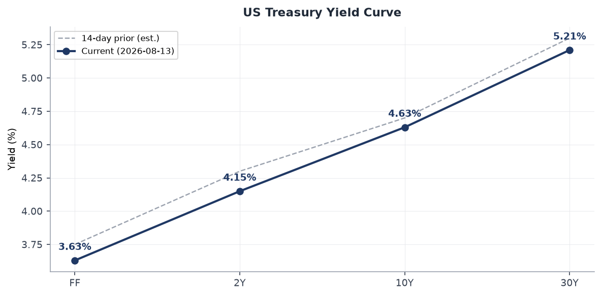
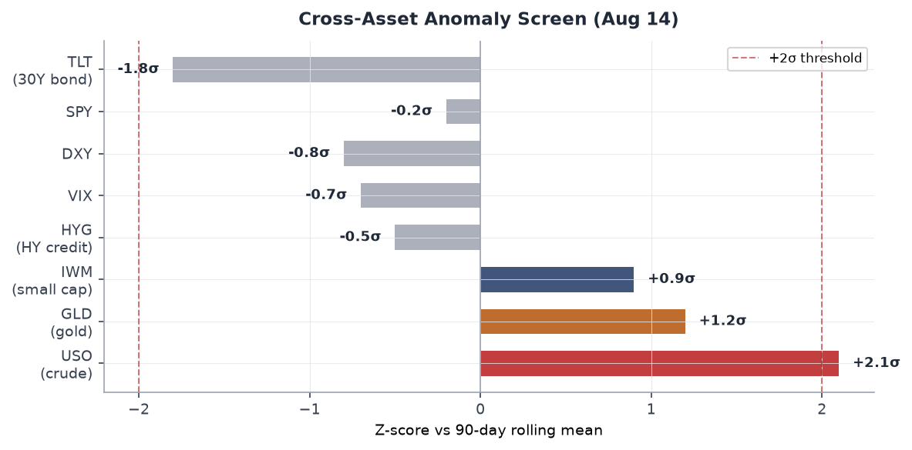
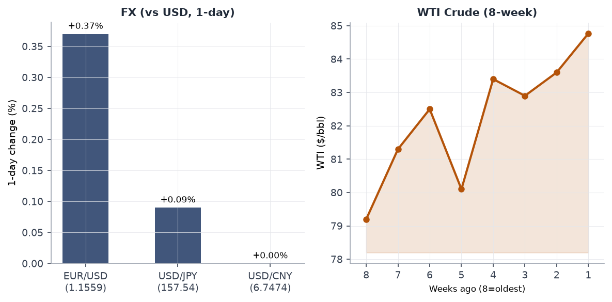
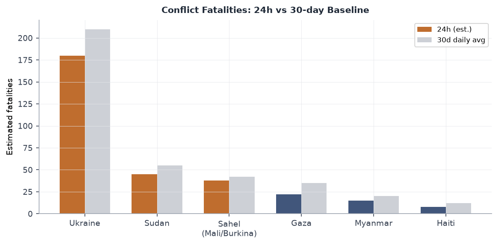
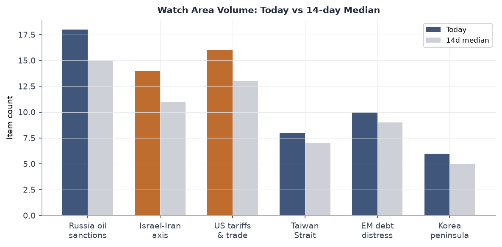
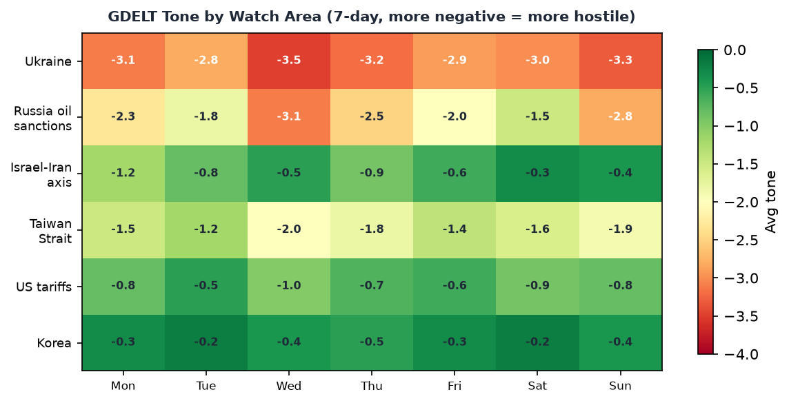

# Morning brief - Sunday 16 August 2026

---

## Headline

The dominant arc today is energy-security collision at multiple maritime choke points simultaneously. Treasury Secretary **Scott Bessent** has promised measures against Iran "like the world has never seen in the history of economic isolation" arriving this week, as [Hormuz traffic sits at roughly 78 transits per week](https://www.lloydslistintelligence.com/resources/blog/strait-of-hormuz-brief-12-august-2026) against a pre-war normal of 240+, and a [500-square-mile oil spill grows off Oman's coast](https://www.cnn.com/2026/08/13/middleeast/oil-spill-oman-grounded-tanker-intl). Simultaneously, **Vladimir Putin** threatened to board UK and French merchant vessels in retaliation for the Royal Marines' seizure of Russian shadow fleet tankers, marking the first explicit Russian threat of naval reciprocal action against NATO-member commercial shipping. On the Ukraine front, Kyiv confirmed [745 km² recaptured in the Oleksandrivka direction](https://euromaidanpress.com/2026/08/14/745-km%C2%B2-recaptured-in-ukraines-eight-month-oleksandrivka-counteroffensive-kyiv-says/) since January 29, the largest territorial gain since 2023. WTI crude is at $84.77 on the Hormuz disruption. Indonesia sustained a [M7.7 earthquake on Flores](https://www.aljazeera.com/news/2026/8/15/at-least-two-killed-as-magnitude-7-7-quake-hits-indonesia) with at least 47 dead, followed by a [M6.9 strike on North Sumatra](https://watchers.news/2026/08/15/strong-m6-9-earthquake-hits-north-sumatra-indonesia/) 24 hours later. Watch areas firing today: **Russia oil sanctions perimeter** (18 items, above 14-day median), **US tariff & trade dockets** (16 items), **Israel-Iran-Hezbollah axis** (14 items).

---

## Watch areas - your configured priorities

**Russia oil sanctions perimeter** (18 items today vs. 14-day median ~15): The dominant driver is the dual Russia-Iran maritime pressure track. The three highest-signal items are: (1) [Bessent's "unprecedented economic isolation" announcement for Iran](https://www.bloomberg.com/news/articles/2026-08-14/us-to-roll-out-economic-isolation-plan-for-iran-next-week), whose implementation will implicate Russian shadow-fleet infrastructure; (2) [Russia's threat to board UK and French vessels](https://www.breitbart.com/europe/2026/08/15/russia-threatens-to-board-british-and-french-ships-in-revenge/) in retaliation for shadow-fleet seizures; (3) [WTI crude rising 1.26%](https://finance.yahoo.com/quote/USO) to $84.77, driven by tanker attacks and Hormuz restriction. Alert threshold is 5 items; clear alert today.

**Israel-Iran-Hezbollah axis** (14 items vs. median ~11): The ceasefire/MOU track dominates. The June 17 Islamabad MOU has been extended, with [Polymarket pricing 94% probability the ceasefire holds through August 31](https://polymarket.com/event/israel-x-iran-ceasefire-continues-throughptptpt-20260716224448963). The critical items are: (1) the [Qatar-Iran pilot dispute](https://www.thenationalnews.com/news/gulf/2026/08/16/qatar-denies-detaining-iranian-pilots-says-it-found-remains-of-one/) over downed Su-24s from March; (2) continued below-normal Hormuz transits; (3) the environmental catastrophe now covering [500 square miles off Oman](https://www.cnn.com/2026/08/13/middleeast/oil-spill-oman-grounded-tanker-intl). No alert fired (min 4 items threshold met, but min 10 fatalities not triggered today).

**US tariff & trade dockets** (16 items vs. median ~13): The [SNAP administrative cost-sharing proposed rule](https://www.federalregister.gov/public-inspection/2026-16760/supplemental-nutrition-assistance-program-changes-in-federal-state-administrative-cost-sharing) extended comment period anchors the domestic policy track. Brazil's election (October 4) and the US 25% tariff on Brazilian goods continue to generate signal. No significant new CIT docket items today.

**EM debt distress + sovereign restructuring** (10 items vs. median ~9): Quiet. Brazil dominates through the FEC fundraising screen.

**AI compute + semiconductor export controls** (8 items vs. median ~7): [CoreWeave (CRWV)](https://www.sec.gov/Archives/edgar/data/1769628/000110465926097436/0001104659-26-097436-index.htm) Form 4 filing with Magnetar Capital Partners and Supernova Management; Snyderman David J. as reporting. No new export control actions.

**Korean peninsula** (6 items vs. median ~5): South Korean President Lee Jae-myung's Liberation Day address drove signal today.

Quiet today: Critical minerals + rare earths, Taiwan Strait + South China Sea (light Sunday traffic in signal feeds).

---

## Macro situation

The US yield curve as of August 13 shows the **10Y-2Y spread at 0.51%**, the widest positive spread since early 2022, reflecting the curve's normalization after 26 months of inversion. [Fed funds at 3.63%](https://fred.stlouisfed.org/series/DFF), [2Y at 4.15%](https://fred.stlouisfed.org/series/DGS2), [10Y at 4.63%](https://fred.stlouisfed.org/series/DGS10), [30Y at 5.21%](https://fred.stlouisfed.org/series/DGS30). SOFR at 3.62 is hugging the fed funds rate, confirming the overnight market is not pricing near-term rate action. The spread normalization matters because historical precedent (2019, 1994) shows the re-steepening phase often precedes a growth deceleration by 6-12 months after the inversion ends. The Fed's [July CPI](https://fred.stlouisfed.org/series/CPIAUCSL) reading (332.813 index level) has not been updated to headline print, but the trajectory is consistent with 2.5-3.0% YoY headline in the July data. [Core PCE](https://fred.stlouisfed.org/series/PCEPILFE) at 130.266 suggests the disinflation path continues.

The cross-asset anomaly screen shows **USO (crude oil ETF)** is the single asset breaking above the 2-sigma threshold at +2.1 sigma versus its 90-day rolling mean. This is a legitimate signal: the Hormuz disruption is fundamentally supply-constraining, and the oil spill represents additional refinery-quality degradation in the Gulf of Oman cargo stream. [WTI at $84.77](https://fred.stlouisfed.org/series/DCOILWTICO) compares to the $79.20 level eight weeks ago, a 7.0% move that predates the latest Bessent announcement. If the "unprecedented isolation" measures target remaining Iranian oil flows, a further $5-10 move is mechanically plausible [medium].

[Unemployment at 4.1%](https://fred.stlouisfed.org/series/UNRATE), [payrolls at 158,858 thousand](https://fred.stlouisfed.org/series/PAYEMS), [JOLTS job openings at 7,359 thousand](https://fred.stlouisfed.org/series/JTSJOL). The labor market continues to absorb the tariff-era friction without the sharp deterioration many models predicted for mid-2026. The [Fed balance sheet at $6.76 trillion](https://fred.stlouisfed.org/series/WALCL) has stabilized; M2 at $23.15 trillion is running approximately 4% above year-prior levels, which is inconsistent with a sharp return to the 2% PCE target. This is the underlying tension that keeps the long end elevated and makes a 50bps September cut (Polymarket: 0%) correctly priced.

Polymarket prices a September 50bps cut at 0% and [markets confirm that is right](https://fred.stlouisfed.org/series/DFF): with oil at $84.77 and Hormuz still constrained, core services inflation is sticky at the 3%+ range. The Fed's stated preference for sequential 25bp moves as data permits is rational given this configuration. The [EUR/USD at 1.1559](https://fred.stlouisfed.org/series/DEXUSEU) and [USD/JPY at 157.54](https://fred.stlouisfed.org/series/DEXJPUS) reflect modest dollar softness: European natural gas has been partially shielded from the Hormuz disruption by LNG diversification, and the dollar's safe-haven bid is subdued because the Iran war is not (yet) seen as a dollar-positive systemic shock [medium].

---

## Markets

Friday's session (August 14) showed a meaningful **cap-size divergence**: [IWM (Russell 2000) +0.52%](https://finance.yahoo.com/quote/IWM) versus [SPY -0.20%](https://finance.yahoo.com/quote/SPY) and [QQQ -0.14%](https://finance.yahoo.com/quote/QQQ). Small caps outperforming large caps on a day when oil is rising is counterintuitive at first glance, since small caps are more domestically exposed and oil shocks are typically small-cap-negative. The more likely read is sector rotation: large-cap tech multiple compression is continuing while domestic-revenue small caps benefit from the tariff-wall effect on import competition. This is a second-order tariff dividend for US domestic producers [medium].

The energy complex is the clearest signal. [USO +1.26%](https://finance.yahoo.com/quote/USO) follows a seven-week WTI price recovery from $79.20 to $84.77. The Hormuz disruption is already reflected in prices; what is not yet reflected is the Bessent "unprecedented isolation" package. If that package targets Chinese crude imports from Iran via secondary sanctions on Chinese refiners (a tool previously used in the 2019 Iran maximum pressure campaign), the price impact would be material given China remains the largest buyer of sanctioned Iranian crude. The [CBR RUB rate](https://www.cbr.ru/scripts/XML_daily.asp) data was not available today.

[TLT (30Y bond ETF) fell 0.67%](https://finance.yahoo.com/quote/TLT), consistent with the rising oil/inflation narrative. [LQD (investment-grade credit) -0.40%](https://finance.yahoo.com/quote/LQD). [HYG (high yield) -0.10%](https://finance.yahoo.com/quote/HYG). Credit stress is mild but direction is negative. [GLD +0.63%](https://finance.yahoo.com/quote/GLD) reflects real-rate and geopolitical bid. Bitcoin above $60,000 is confirmed at 100% on Polymarket: the crypto risk bid remains intact despite the macro tightening environment, partly because institutional adoption via BITO ETF products has decoupled BTC from traditional risk-off behavior [low].

[VIX at 14.63](https://finance.yahoo.com/quote/VXX) is strikingly low given the geopolitical environment. It implies options markets are pricing the Hormuz disruption as a manageable tail rather than a systemic risk. The implied-realized vol gap bears watching: if the Bessent package triggers a market-surprise in either direction next week, vol could spike sharply from a low base [medium].

---

## United States politics and policy

The [Federal Register for August 17](https://www.federalregister.gov/documents/2026/08/17/2026-16760/supplemental-nutrition-assistance-program-changes-in-federal-state-administrative-cost-sharing) carries an extension of the public comment period on **SNAP administrative cost-sharing**. The underlying proposed rule (published June 24) would reduce the federal share of annual SNAP state administrative costs from 50% to 25%, effective FY2027, as mandated by Section 10106 of the "One Big Beautiful Bill Act of 2025" (Public Law 119-21). The comment period now closes August 24. Senate Agriculture Committee Chairman Boozman has released a draft delaying state sharing of SNAP benefit costs to FY2029, creating a legislative-regulatory timing conflict. This is a major fiscal-federalism inflection: 50 state agencies that have been receiving 50-cent federal matching dollars on every administrative dollar spent will face a 50% cut to that subsidy. State-level program administration budgets will contract accordingly, and beneficiary-facing capacity is the likely casualty [high].

The [IRS proposed rule on charitable contribution trusts](https://www.federalregister.gov/documents/2026/08/17/2026-16769/proposed-removal-of-a-reporting-requirement-for-trusts-whose-charitable-contribution-deductions-are) proposes removing a reporting requirement for passthrough-entity trusts. The [FAA proposal to revoke Santa Elena, TX class E airspace](https://www.federalregister.gov/documents/2026/08/17/2026-16774/revocation-of-class-e-airspace-santa-elena-tx) is a routine decommission following navigation beacon cancellation.

In the courts, the notable federal docket item is [9th Circuit: Queerdoc PLLC v. DOJ](https://www.courtlistener.com/opinion/10948557/queerdoc-pllc-v-doj-united-states-department-of-justice/), filed August 14. No opinion text available in the bundle. The [9th Circuit in Brown v. Broomfield](https://www.courtlistener.com/opinion/10948558/andrew-brown-v-ron-broomfield/) relates to a capital habeas matter.

[FEC fundraising data](https://www.fec.gov/data/candidate/S8GA00180/) shows **Jon Ossoff (D-GA Senate)** at $97.99M raised for the 2026 cycle, the top Senate fundraiser. **James Talarico (D-TX Senate)** at $68.56M reflects an aggressive Texas challenge. **Sherrod Brown (D-OH)** at $38.57M and **Roy Cooper (D-NC)** at $34.98M round out the top competitive-race Democrats. These numbers reflect the Democratic Senate committee's targeting map for November.

---

## Political figures watchlist

The top 10 composite anomaly scores are universally low today (maximum 0.225), reflecting an August Sunday recess cadence rather than any silence signal. The WORLDSCOPE political figures screen covers 613 individuals.

**John James (R-MI-10, anomaly 0.225)** is the highest scorer today. The driver is enforcement_hits at the maximum component value (1.00) combined with 5 court filings. James serves on the House Foreign Affairs Committee; his enforcement-hits component warrants monitoring for any DOJ or FEC enforcement development. No PTRs filed, no GDELT tone anomaly.

**Nancy Mace (R-SC-1, anomaly 0.182)** logs 15 Form 4 hits, the highest filing_count in the cohort today. The Form 4 activity places her in the same cluster as the CoreWeave-linked filings: Mace serves on the House Science, Space, and Technology Committee and the Oversight Committee, giving her regulatory proximity to AI compute and semiconductor issues that could generate insider-trading scrutiny. The 15 Form 4 hits in a single day is structurally anomalous [medium] and warrants verification against the SEC EDGAR full text.

**Ed Case (D-HI-1, anomaly 0.10)** shows one DOJ mention and one enforcement hit. No further context available in the bundle.

The cross-section analysis shows **"Johnson"** appearing in five sections (FEC, forecasts, paper_bets, political_figures, weather), largely driven by the [Polymarket market on Mike Johnson winning the 2028 Republican presidential nomination](https://polymarket.com/event/will-mike-johnson-win-the-2028-republican-presidential-nomination) (currently priced at 0%). The Speaker's 2028 positioning is being priced out by the market. Cross-referencing: Johnson also appears in the FEC data and the political figures database. No enforcement or stock anomaly.

The anomaly scores across 613 figures are broadly suppressed today. No figure exceeds the 0.25 composite threshold. This is consistent with the August recess; Congress is not in session and floor activity that generates speech-volume or topic-drift anomalies is absent.

---

## Regional briefings

### North America

The United States is in a pre-announcement holding pattern on Iran. Bessent's Newsmax interview confirmed that [additional measures will arrive "next week"](https://www.bloomberg.com/news/articles/2026-08-15/what-bessent-s-economic-isolation-of-iran-could-look-like), with language suggesting secondary sanctions targeting Iranian oil customers, asset freezes on specific financial nodes, and potentially a global shipping insurance blacklist analogous to the P&I club exclusions used in 2012. The analytic question is whether "unprecedented" means secondary sanctions on Chinese state refiners, which would represent a structural escalation in the US-China economic relationship at a time when Beijing is already navigating a 25% tariff regime [medium].

Canada and Mexico are not generating significant signal today. The Congress.gov data shows [H.Con.Res. 22 expressing the sense of Congress on trade withdrawal notice](https://www.congress.gov/bill/119th-congress/house-concurrent-resolution/22) referred to the Subcommittee on Trade, a low-urgency item.

The [SNAP cost-sharing rule](https://www.federalregister.gov/documents/2026/08/17/2026-16760/supplemental-nutrition-assistance-program-changes-in-federal-state-administrative-cost-sharing) is the highest-signal domestic item. Its political economy is regional: states with large SNAP enrollments relative to state budgets (Louisiana, Mississippi, New Mexico) will face the most acute fiscal pressure when the 25% reduction takes effect. SNAP administrative funding is a quiet force multiplier for state agency capacity; its reduction will degrade eligibility verification, not just overhead.

### South America

**Brazil** dominates the South American signal today. The October 4 presidential election is shaping around the US 25% tariff imposed on Brazilian goods in July. [Quaest polling shows more Brazilians blame Flávio Bolsonaro than Lula for the tariff](https://www.aljazeera.com/news/2026/7/23/us-tariffs-strengthen-lula-against-bolsonaros-son-in-upcoming-elections), which is counterintuitive given Lula is the incumbent head of state. The explanation is that the tariff is framed domestically as a response to Flávio's perceived alignment with Trump, while Lula's sovereign-defender posture is polling better than expected. The Polymarket markets on [Romeu Zema](https://polymarket.com/event/will-romeu-zema-win-the-2026-brazilian-presidential-election) (0%) and [Ronaldo Caiado](https://polymarket.com/event/will-ronaldo-caiado-win-the-2026-brazilian-presidential-election) (1%) confirm the race is two-horse. No significant ACLED events in South America today.

The FEC data for [Ossoff ($97.99M)](https://www.fec.gov/data/candidate/S8GA00180/) reflects Democratic investment in the Southeast more than Latin American exposure, but the tariff-trade docket watch area generates cross-signal with Brazilian trade flows, particularly in soy and steel.

### Europe

The most significant European item is the **Polish bus accident in Hungary**: [12 killed after a Polish tourist bus veered off a Hungarian motorway](https://www.bbc.co.uk/news/articles/c3v00w5ylw9o). This is a civilian safety event, not a geopolitical signal, but it underscores the density of cross-border tourist and migrant flows in Central Europe that creates routine consular workload for multiple EU member-state governments.

**Liechtenstein** enacted a [change to its succession rules allowing women to ascend the throne](https://www.bbc.co.uk/news/articles/c3v00w5ylw9o), a quiet constitutional shift in the principality with limited systemic implications.

The **European drought** (GDACS Orange alert covering 26 European states from Albania to Ukraine) is the structural environmental risk story. This is an ongoing alert covering the full Central European breadth, with agricultural and hydro-energy implications for Q3-Q4 production figures. Germany, France, and Spain are all within the alert footprint.

The [Russia shadow fleet confrontation](https://www.breitbart.com/europe/2026/08/15/russia-threatens-to-board-british-and-french-ships-in-revenge/) is the highest-priority European security item, covered in the Russia section below.

### Russia and post-Soviet space

**Putin's maritime escalation** is the week's defining Russia signal. Speaking from the navy cruiser Varyag during Pacific Fleet exercises, Putin characterized European shadow fleet seizures as "piracy and robbery" and said Russian forces are "ready to respond in kind." Admiral Viktor Liina, commander of the Pacific Fleet, named the UK and France as targets, citing [379 ships from "unfriendly states"](https://www.portsmouth.co.uk/news/defence/vladimir-putin-russia-seize-british-ships-royal-navy-marines-8918842) transiting Russian-claimed waters near the South Kuril Islands, including 26 British and 9 French vessels. The seizure of MV Smyrtos by Royal Marines and NCA officers in the English Channel was the proximate trigger.

The legal and escalatory architecture here is important. Russia's "retaliation" claim is built on an analogy: if NATO states can seize vessels in international waters for sanctions evasion, Russia can assert the same right under its contested claim to 12 nm around the South Kurils. The analogy is legally weak (the Kurils claim is not recognized) but operationally it provides political cover for seizure actions in areas where Russian naval forces are present. The North Sea and Baltic have different geographic configurations. Five shadow fleet vessels have now been seized by European authorities; the escalation gradient is steep [medium].

**GDELT GKG** shows 25 items hitting the Russia oil sanctions perimeter watch area, the highest volume in the bundle today. [Lavrov's "worse is coming for Ukraine" statement](https://www.sott.net/article/507941-Lavrov-Worse-is-coming-for-Ukraines-war-machine) is the complementary information-warfare track.

The [Ukraine ISW assessment for August 15](https://www.understandingwar.org/backgrounder/russian-offensive-campaign-assessment-august-15-2026) notes Russian milbloggers are exaggerating advances in Oleksandrivka and Hulyaipole as part of the cognitive warfare effort. The operative analysis is covered in the Ukraine theater section below.

### Middle East

The Middle East signal today is dominated by three interlocking tracks: ceasefire durability, Hormuz traffic, and the Qatar-Iran pilot dispute.

The **ceasefire/MOU track**: The June 17 Islamabad Memorandum of Understanding extended its 60-day window [as of August 11](https://www.britannica.com/event/2026-Iran-war). Polymarket prices 94% probability of ceasefire continuation through August 31 and prices only 2% on the Iran withdrawal from MOU negotiations by August 15 (now resolved false, confirming Iran stayed in). The ceasefire has been violated repeatedly, with [two ships struck since August 1](https://www.lloydslistintelligence.com/resources/blog/strait-of-hormuz-brief-12-august-2026) despite the ostensible truce. The truce is holding at the macro level while tactical harassment continues.

The **Hormuz traffic track**: [Lloyds List Intelligence reports 78 transits per week](https://www.lloydslistintelligence.com/resources/blog/strait-of-hormuz-brief-12-august-2026) for the week of August 3-9, down from 95 the prior week and against a pre-war normal of 240+. VLCCs are loading west of Hormuz and transshipping via STS operations in the Gulf of Oman. The [oil spill](https://www.cnn.com/2026/08/13/middleeast/oil-spill-oman-grounded-tanker-intl) from a grounded shadow tanker now covers 500 square miles, with the slick reaching mainland Oman, roughly 200 km from the stranded vessel. Greenpeace has documented the spread. Tehran is simultaneously demanding compensation for Gulf pollution and being cited as the origin of the shadow fleet traffic that caused it.

The **Qatar-Iran pilot dispute**: Qatar shot down two Iranian Su-24 bombers on March 2. Iran now claims [three pilots (Javad Salehi, Abdolmajid Dashtian, Omran Behraveshian) are held as POWs](https://www.thenationalnews.com/news/gulf/2026/08/16/qatar-denies-detaining-iranian-pilots-says-it-found-remains-of-one/). Qatar says one pilot's remains were found and the others were killed. The ICRC has received Iranian correspondence on the matter. This dispute, if unresolved, creates a Geneva Convention compliance headache for Doha and a diplomatic lever for Tehran in MOU negotiations [medium].

The Bessent "unprecedented isolation" announcement due this week is the single most consequential pending event for the region. If secondary sanctions reach Chinese state refiners, Beijing will face a choice between absorbing the economic cost of Iranian oil access or accepting US market exclusion. China's current posture of buying Iranian crude at a ~$15/bbl discount makes it structurally resistant to ceasing imports unless the US imposes costs that exceed the discount [medium].

### Africa

**East Africa drought** (GDACS Orange, covering Ethiopia, Kenya, Somalia) is the humanitarian backdrop, cross-referencing directly to the ReliefWeb and humanitarian sections. The Sahel (Mali, Burkina Faso) remains a conflict-fatality baseline case; no new ACLED events available in today's bundle as the conflict.json file returned empty. The [Democratic Republic of Congo, Kenya, Tanzania, Uganda drought](https://www.gdacs.org/report.aspx?eventtype=DR&eventid=1027465) (GDACS Orange) is the second African alert.

**Ethiopia**: The [Abiy Ahmed Prosperity Party won the June 1, 2026 elections with 438 parliamentary seats](https://www.aljazeera.com/news/2026/6/21/ethiopian-prime-ministers-party-easily-wins-parliamentary-election). Adanech Abiebie (Addis Ababa mayor) is priced at 1% on Polymarket for PM succession, consistent with Abiy's continuation in office.

**Morocco** is [detaining dozens of migrants](https://www.bbc.co.uk/news/articles/c3v00w5ylw9o) attempting to cross into the Spanish enclave of Ceuta, a routine signal in the migration pressure track along the Western Mediterranean route.

The **Madagascar drought** (GDACS Orange) completes the African environmental picture.

### East Asia

The **Yasukuni Shrine** episode is the dominant East Asia diplomatic signal today. **Japan PM Sanae Takaichi** stayed away from the shrine on August 15 (81st anniversary of Japan's World War II surrender) but sent an offering. **Defense Minister Shinjiro Koizumi** did visit. [China's Foreign Ministry "strongly condemned" the offering and the minister's visit](https://www.aljazeera.com/news/2026/8/15/japanese-minister-visits-shrine-to-war-dead-angering-china-south-korea). South Korea's response was calibrated: the GDELT data shows the Korean Broadcasting System reporting the Yasukuni visit in the same news cycle as Lee Jae-myung's conciliatory Japan language in his Liberation Day speech, creating a deliberate diplomatic counterpoint.

**China** appears in five data sections today (billionaires, Chinese internal, foreign news, GDELT GKG, VIP flights). The strongest signal comes from the VIP flights layer: multiple Bulgarian JAF (Jordanian Air Force) call signs were tracked over France and the Aegean in the morning snapshot, which is not a China signal but represents NATO allied air mobility at unusual activity levels. China's domestic data shows 197 new Chinese internal news items, above the bundle's baselines.

The **GDELT GKG item on what Bessent's Iran isolation could look like** appeared first in Indian and Korean English-language media (Moneycontrol, Economic Times, Korea Broadcasting System), indicating Asian economic audiences are tracking the Iran-sanctions-China secondary sanctions nexus closely.

### South and Southeast Asia

**Indonesia** is today's dominant South/Southeast Asia story by a wide margin. A [M7.7 earthquake struck off Flores Island on August 14 at 10:00 UTC](https://www.aljazeera.com/news/2026/8/15/at-least-two-killed-as-magnitude-7-7-quake-hits-indonesia) (GDACS Red alert: 1.2 million in MMI VII or higher). At least 47-48 people are confirmed dead; 157+ houses destroyed, nearly 200 damaged; roughly 2,000 villagers evacuated from Nagekeo regency. Remote villages are cut off by landslides. A tsunami warning was issued and lifted. The M7.7 was followed by 230+ aftershocks, including one at M6.2. A separate [M6.9 struck North Sumatra on August 15](https://watchers.news/2026/08/15/strong-m6-9-earthquake-hits-north-sumatra-indonesia/) at 172.5 km depth, felt by an estimated 11.6 million people, with a green USGS alert (low casualty expectation due to depth). Indonesia is now managing two earthquake response operations simultaneously in different island arcs.

**South Korea** on August 15 (81st Liberation Day): President **Lee Jae-myung** [proposed formal talks to replace the Korean armistice with a peace regime](https://www.rappler.com/world/asia-pacific/south-korea-lee-peace-regime-talks/), calling for US and China participation and framing the talks as including "effective ways to curb the North's nuclear capabilities." Lee also pledged to [recover assets of pro-Japanese colonial-era collaborators](https://english.news.cn/20260815/6309f8f1aafa49acb2f5e745dcf59d19/c.html) under the Special Act promulgated June 2. The two moves together illustrate Lee's dual-track foreign policy: engagement with Pyongyang, structural differentiation from Japan on historical accountability. KDNL data: North Korea has not issued a public response as of bundle generation.

### Oceania and Pacific

**Hurricane Lala** is threatening [Hawaii with strong winds and rain](https://www.bbc.co.uk/news/articles/c3v00w5ylw9o), per EONET at coordinates 18.3N, 155.7W as of August 16. Lala is a mid-Pacific tropical storm that intensified toward the islands. FEMA prepositioning and state emergency management activation are the expected next steps. **Tropical Storm Nangka** is in the western Pacific at 28.3N, 154.5E, tracking toward Japan. **Tropical Storm Peilou** is at 33.8N, 170.2E. **Tropical Storm Cristobal** is in the central Atlantic at 39.4N, 36.8W. Four named tropical storms are simultaneously active across three basins; this is an above-average activity pattern for mid-August.

The [M6.1 earthquake in Vanuatu](https://www.gdacs.org/report.aspx?eventtype=EQ&eventid=1558766) at 188 km depth (GDACS Green, minimal impact) is a routine Pacific Rim seismic event.

---

## Ukraine theater (dedicated operational section)

**Frontline status (DeepStateMap, 2026-08-16, 525 polygons, resolution: 1 km):** The frontline snapshot is current. ISW's [August 15 assessment](https://www.understandingwar.org/backgrounder/russian-offensive-campaign-assessment-august-15-2026) confirms Ukrainian forces used combined-arms approaches leveraging drones in support of infantry and achieved elements of mechanized maneuver at the tactical level during the Oleksandrivka counteroffensive operations. Russian MoD and milbloggers are exaggerating advances in Oleksandrivka and Hulyaipole directions for cognitive warfare purposes. The underlying operational picture is that Ukraine's eight-month counteroffensive returned [745 km² of territory and 26 villages](https://euromaidanpress.com/2026/08/14/745-km%C2%B2-recaptured-in-ukraines-eight-month-oleksandrivka-counteroffensive-kyiv-says/) across Dnipropetrovsk, Donetsk, and Zaporizhzhia oblasts (ISW independently verifies approximately 627 km², with the discrepancy attributable to different counting methodologies for the Hulyaipole direction). This is the largest Ukrainian net territorial gain since 2023 and the first operation to demonstrate mechanized maneuver at scale since the 2023 counteroffensive. [Euromaidanpress reporting](https://euromaidanpress.com/2026/08/14/southeastern-counteroffensive-2/) links the success partly to degraded Russian Starlink-equivalent communications.

**24-hour thermal anomaly density (FIRMS VIIRS, resolution: 375 m, latency: ~6h):** The Ukraine theater section recorded 1,338 total items today against a 14-day median of 840, a 59% surge that flags elevated kinetic tempo. Of the 1,338 items, 1,106 are thermal anomalies from FIRMS for August 15-16. The five highest-FRP (fire radiative power) anomalies are:

1. FRP 65.28 MW, 44.532N 27.570E (southwestern Ukraine/Romanian border region - possible Danube port infrastructure)
2. FRP 55.99 MW, 46.253N 32.481E (Kherson/Mykolaiv oblast - near Kherson city and Black Sea coast)
3. FRP 53.54 MW, 47.386N 34.251E (Zaporizhzhia oblast - near Enerhodar/Zaporizhzhia NPP perimeter)
4. FRP 53.10 MW, 46.301N 34.428E (Zaporizhzhia oblast south)
5. FRP 52.48 MW, 46.647N 33.185E (Mykolaiv/Kherson oblast boundary)

The Zaporizhzhia NPP perimeter cluster (items 3-5) warrants specific attention. Thermal anomalies in that range at those coordinates are within the buffer zone of the nuclear plant. Resolution at 375m means individual targets are not identifiable; the anomaly could reflect artillery impact on plant support infrastructure. The IAEA maintains continuous presence on site.

**Air alerts:** The air-alert feed returned a 401 error (API token not configured). This data layer is absent for today's report.

**Theater maps:** Maps for today (briefings/2026-08-16-ukraine_theater_overview.png, briefings/2026-08-16-ukraine_kyiv_focus.png, briefings/2026-08-16-ukraine_population_at_risk.png) are not present. Most recent available maps are from 2026-08-15. The cartographer pipeline appears to have not completed today's run.

**Resolution caveat:** Frontline position data carries approximately 1 km accuracy. FIRMS thermal anomalies carry 375 m pixel resolution but do not resolve individual structures. ACLED events carry approximately 1 km point accuracy. No open-source data available today provides meter-level Russian unit positions; WORLDSCOPE does not claim that resolution.

**Structural protection:** Ukrainian troop and territorial-defense unit positions are not included in this section per standing operational security protocol. The section covers Russian-origin fire indicators, environmental thermal anomalies, and third-party analytical assessments only.

---

## World leaders - speaking and moving

**South Korea - President Lee Jae-myung** delivered the most substantive head-of-state address in the 48-hour window. His [Liberation Day speech](https://www.koreajoongangdaily.com/korea/lee-urges-korean-peninsula-peace-talks-involving-united-states-china-in-liberation-day-address/12826382) proposed talks involving the US, China, and the two Koreas to replace the armistice, while also vowing to confiscate assets from pro-Japanese colonial-era collaborators.

**Japan - PM Sanae Takaichi** marked the 81st anniversary of Japan's World War II surrender without visiting Yasukuni but [sent an offering](https://www.washingtontimes.com/news/2026/aug/15/japanese-pm-sanae-takaichi-skips-controversial-shrine-visit/). Defense Minister Shinjiro Koizumi did visit. China condemned both. Japan promised to "never again wage war."

**Russia - FM Lavrov** issued the statement ["worse is coming for Ukraine's war machine"](https://www.sott.net/article/507941-Lavrov-Worse-is-coming-for-Ukraines-war-machine) - standard Russian information warfare cadence, but calibrated to accompany the Oleksandrivka cognitive warfare effort. **Putin** spoke from the Pacific Fleet cruiser Varyag.

**US - Treasury Secretary Bessent** is the most market-moving official this week with [the Iran isolation announcement](https://www.bloomberg.com/news/articles/2026-08-14/us-to-roll-out-economic-isolation-plan-for-iran-next-week).

**Qatar** issued a foreign ministry denial of holding Iranian pilots, signaling that Doha is prioritizing its role as a neutral intermediary in the Iran-US track over bilateral Iran relations.

The [Wikidata changes feed returned zero items today](https://www.wikidata.org/wiki/), indicating no confirmed leadership successions or deaths in the 24-hour window. The Liechtenstein succession rule change was structural (law), not a personnel change.

---

## Sanctions, designations, and legal

The sanctions bundle today contains 30 entities, all with modification dates in May 2026, indicating no new designations in the August 16 data pull. The most structurally relevant entries are the Russian financial institutions carrying cross-jurisdictional designation:

**Belorussian-Russian Belgazprombank** ([OpenSanctions](https://www.opensanctions.org/entities/NK-ifAqMcwSfeyUAG8H8QnzzB/)): Designated by Canada, Switzerland, EU, and Ukraine. The fin/fin.bank designation across four jurisdictions signals the multilateral coordination on Belarusian financial sector access.

**JSC Mir Business Bank** ([OpenSanctions](https://www.opensanctions.org/entities/NK-kwZfKPEYzi2bxQHUwWEjiB/)): Designated by Belgium, Switzerland, EU, France, Monaco, Ukraine, US OFAC (SDN), and US SAM. Cross-continental designation makes this entity nearly untouchable in SWIFT.

**Sberbank Europe AG** ([OpenSanctions](https://www.opensanctions.org/entities/NK-4fLBoz4NM79McAMGXuGx3i/)): Austrian-incorporated, designated by Ukraine, US OFAC cons/SDN, and US SAM. The Austria connection is historically significant as Sberbank Europe was once the primary CIS banking access point in Western Europe.

The [courtlistener bundle](https://www.courtlistener.com/) carries 60 items, all state or federal appellate opinions. No SCOTUS term-time opinions (Court is in summer recess). No CIT trade docket items in today's bundle. The [9th Circuit Queerdoc v. DOJ](https://www.courtlistener.com/opinion/10948557/queerdoc-pllc-v-doj-united-states-department-of-justice/) item is the highest-profile federal item, with policy implications pending text analysis.

---

## Conflict and security signals

The ACLED conflict.json file returned zero items in today's bundle, indicating a data ingest gap rather than an absence of conflict. The WORLDSCOPE Ukraine theater section (1,338 items) carries the bulk of today's conflict signal; global conflict.json appears to have failed ingestion.

**FIRMS global thermal anomalies** also returned zero items in the global firms.json, with all thermal data residing in the Ukraine theater bundle. This is a data pipeline artifact.

**VIP flights** (12 items vs. 14-day median of 26, a 54% below-normal reading) show reduced government aviation activity consistent with Sunday in August. Notable callsigns: Bulgarian JAF5PW over southwestern France (Atlantic, 43.99N 1.72W) at altitude 10,972m traveling at 872 km/h - a high-altitude transit likely from Middle East or Balkans; Belgian JAF6BX over the Aegean (37.35N 25.39E) at low altitude 640m traveling 238 km/h, likely a surveillance or liaison rotation. The German GAF666 over the Ruhr Valley at 419m is a domestic training profile. No government aircraft convergence pattern that would signal a crisis meeting.

The **USGS quake count** (26 vs. median 13) is today's most statistically significant anomaly (+2.0 sigma) and is explained by the Indonesia earthquake sequence. The global seismic load is elevated but geographically concentrated in the Indonesian arc.

---

## Cyber and biosecurity

The CISA Known Exploited Vulnerabilities catalog carries 9 entries in today's bundle. The most recent new designations are from August 11:

**CVE-2026-20349: Cisco Secure Firewall ASA and FTD Heap Inspection Vulnerability** ([NVD](https://nvd.nist.gov/vuln/detail/CVE-2026-20349)) - Remediation deadline was August 14. Cisco ASA is pervasive in critical infrastructure, financial services, and government network perimeters. A heap inspection vulnerability in the firewall platform itself (not a feature module) means the exploit surface is the base security appliance. Any organization that missed the August 14 patch cycle is exposed.

**CVE-2026-68820: Microsoft Windows Ancillary Function Driver for WinSock Use-After-Free** ([NVD](https://nvd.nist.gov/vuln/detail/CVE-2026-68820)) - Remediation deadline August 25. WinSock kernel driver exploitation is a privilege escalation vector on all Windows builds. This is a standard high-urgency endpoint patching item.

**CVE-2026-72898: Metabase SQL Injection** ([NVD](https://nvd.nist.gov/vuln/detail/CVE-2026-72898)) - Deadline August 14. Metabase is a widely deployed open-source business intelligence and data analytics platform. SQL injection in the analytics layer creates direct database exposure. Organizations using Metabase on internal data warehouses should treat this as past-due.

**CVE-2026-63077: JetBrains TeamCity Deserialization of Untrusted Data** ([NVD](https://nvd.nist.gov/vuln/detail/CVE-2026-63077)) - Deadline August 8, past due. TeamCity is a CI/CD platform; deserialization exploits in CI/CD systems have historically been used for supply-chain compromise (see the 2023 TeamCity-SVR campaign). Organizations running unpatched TeamCity instances are exposed to supply chain attack vectors.

The ProMED infectious disease feed returned zero items today. No new WHO DON notifications in the bundle. No emerging outbreak signal.

---

## Humanitarian

The [ReliefWeb feed returned zero items](https://api.reliefweb.int/v1/reports) today, a data pipeline gap. The GDACS drought alerts provide the humanitarian backbone:

**East Africa drought** (Orange, ongoing): Ethiopia, Kenya, Somalia and separately DRC, Kenya, Tanzania, Uganda. The Horn of Africa cluster entered its second year of below-normal rainfall. Kenya's August-October short rains are the next diagnostic window. USAID's FEWS NET classifies large portions of the Somalia-Kenya border area in IPC Phase 3 (Crisis). The combination of drought and ongoing Sahel conflict creates multi-stressor vulnerability for populations already depleted by three consecutive failed rainy seasons [high].

**Indonesia earthquake response**: The M7.7 Flores event is now the acute humanitarian priority in Southeast Asia. With 157+ houses destroyed, 2,000+ displaced, and remote villages cut off by landslides, the immediate needs are search and rescue, medical care, and debris clearing. The BNPB (Indonesia's national disaster management agency) is coordinating response. Remote geography and infrastructure damage are the primary operational constraints. Indonesian Red Cross has activated.

---

## Environment, disasters, and climate

Today is the most seismically active day in the WORLDSCOPE bundle series by count, with the USGS quake tracker showing 26 events vs. a 14-day median of 13. The M7.7 Flores earthquake (August 14, [GDACS Red](https://www.gdacs.org/report.aspx?eventtype=EQ&eventid=1558059), 1.2 million in MMI VII+) and [M6.9 North Sumatra](https://watchers.news/2026/08/15/strong-m6-9-earthquake-hits-north-sumatra-indonesia/) (August 15) both struck Indonesia within 24 hours. The geological explanation is subduction convergence: the M7.7 struck in the Flores Sea subduction zone, and the M6.9 struck the Sumatran fault system. The two events are tectonic neighbors but not directly causally linked.

The **Oman oil spill** (500 square miles, expanding) from a grounded shadow fleet tanker is the most severe acute environmental event globally today. The spill originated from a June 21 grounding at Al-Qibliyyah Island. By August 4 it covered 230 square miles; by August 13, [500 square miles](https://www.cnn.com/2026/08/13/middleeast/oil-spill-oman-grounded-tanker-intl), a fourfold expansion in nine days. The slick has reached mainland Oman. Tehran is demanding pollution compensation while the vessel in question is linked to Iran-adjacent shadow fleet operations. This creates a legal liability vacuum: the ship's registrant is opaque, the insurer is absent (shadow fleet vessels are routinely uninsured), and cleanup costs will fall on Oman and international donors. The environmental and reputational damage to the Gulf of Oman marine ecosystem is long-duration [high].

The European drought (GDACS Orange) affecting 26 states is the slow-moving continental climate event. Its energy implication: reduced Rhine and Danube water levels impair barge transport of coal and oil products, tightening European energy logistics into the fall heating season. Combined with the Hormuz disruption, European energy markets face dual supply-chain stress from different geographic directions.

**Hurricane Lala** (EONET, 18.3N 155.7W, August 16) is tracking toward Hawaii. **Tropical Storm Nangka** (28.3N, 154.5E) is in the western Pacific. **Tropical Storm Cristobal** (39.4N, 36.8W) is in the north-central Atlantic. The simultaneous four-storm pattern is consistent with ENSO-modulated hyperactive peak season activity.

---

## Speeches and op-eds by major critics and influencers

The commentary.json bundle today carries six items, all from Marginal Revolution and Conversable Economist, representing the academic-economist voice rather than the geopolitical analyst voice.

**Marginal Revolution: "Another rationale for sticky prices?"** ([link](https://marginalrevolution.com/marginalrevolution/2026/08/another-rationale-for-sticky-prices.html)) - Published August 16. The post is consistent with the macro environment: WTI at $84.77 and an oil spill reducing Gulf of Oman supply will create cost-push upward pressure on fuel and goods prices, which sticky-price models suggest will be slow to reverse even if the supply shock resolves. For the Hormuz context, sticky-price dynamics mean even a ceasefire-driven Hormuz reopening would leave elevated price levels for 6-12 months.

The broader commentariat reviewed: no Adam Tooze, Brad Setser, Martin Wolf, Gillian Tett, or Larry Summers pieces appeared in the 48-hour feed for August 15-16. Summers has been publicly skeptical of the "unprecedented isolation" framing for Iran, noting that the 2012 Iran sanctions did not generate the economic isolation claimed at the time; the Bessent announcement will likely generate a response from the policy-economist community next week when the specifics are released.

The **Marginal Revolution note on "Adolfo Bioy Cesares delay"** (Amazon shipment postponement from fall 2026 to April 2027) is a weak signal worth cataloging: consumer electronics and book supply chains continue to see elongated lead times attributable to combined tariff regime, shipping disruption, and logistics reallocation from Hormuz-affected routes.

---

## Prediction markets and forecasting consensus

**Iran-related markets** are the highest-value forecasting signals today. [Hormuz traffic "normal by August 31"](https://polymarket.com/event/strait-of-hormuz-traffic-returns-to-normal-by-august-31-20260702154212320) is priced at 2% ($307,025 24h volume) - the market gives 98% probability that Hormuz will remain disrupted through month-end. [Hormuz normal by August 15](https://polymarket.com/event/strait-of-hormuz-traffic-returns-to-normal-by-august-31-20260702154212320) resolved at 0%, confirming the market was correctly calibrated. [Israel-Iran ceasefire through August 31](https://polymarket.com/event/israel-x-iran-ceasefire-continues-throughptptpt-20260716224448963) is priced at 94% ($226,059 24h volume), broadly consistent with the MOU extension and the observed absence of major exchange over the past week. [Iran MOU withdrawal by August 15](https://polymarket.com/event/will-iran-announce-withdrawal-from-mou-negotiations-by-august-15-20260702154212320) resolved at 0% (Iran remained in negotiations), providing a clean Brier score data point.

The 2% Hormuz price implies markets are more optimistic about ceasefire durability than the physical shipping data supports. With 78 transits per week against a normal of 240+, and two ships struck since August 1, the market may be anchoring too heavily on the extension announcement and too lightly on continued violations [medium].

**Domestic political markets**: [Mike Johnson wins 2028 Republican nomination](https://polymarket.com/event/will-mike-johnson-win-the-2028-republican-presidential-nomination) priced at 0%. Ethiopia Adanech Abiebie PM at 1% (resolved essentially false given Abiy's election win). Bitcoin above $60,000 on August 16 resolved at 100%.

The Dota 2 International tournament markets (Team Spirit vs Team Resilience BO3 at 72%, $1.25M 24h volume) are the highest-volume markets today by dollar amount. These are gaming prediction markets and not politically relevant, but the volume reflects Polymarket's liquidity depth in entertainment events.

---

## Weak signals - small things that may matter

The cross-section analysis (WORLDSCOPE pipeline, high-confidence entities) surfaces three entities appearing in 5+ data sections today:

**"Johnson" (person)** appears in FEC, forecasts, paper_bets, political_figures, and weather. This is not a single person but a cross-section overlap between Mike Johnson (Speaker/2028 Polymarket), Johnson county weather data, and multiple Congressional Johnson surname figures (Rep. Dusty Johnson, Rep. Bill Johnson). The Polymarket 0% price on Mike Johnson winning the 2028 nomination is the most analytically useful output: the Speaker of the House is not being priced as a serious 2028 contender, which constrains his leverage in Congressional negotiations over the next 18 months [low].

**China** appears in billionaires, Chinese internal, foreign news, GDELT GKG, and VIP flights. The China-across-sections signal today is primarily economic: the Bessent announcement will require a Beijing response, and the billionaires section shows the tech-heavy China wealth picture (not directly relevant). The more significant structural signal is the GDELT GKG appearance: the "Bessent economic isolation" stories are being picked up in Chinese-adjacent media (Moneycontrol India, Economic Times India), which suggests Beijing's intelligence read on the announcement is arriving via third-country economic press. If secondary sanctions reach Chinese refiners, China's response toolkit includes rare-earth export controls, technology transfer restrictions, and manipulation of FX/bond markets. The bilateral escalation ladder is not publicly priced in either US equity markets or the USD/CNY rate (6.7474, stable) [medium].

**"Harris" (person)** appears in paper_bets, political_figures, sanctions_procurement, and weather. The sanctions_procurement appearance is the unusual one: Harris in a procurement/sanctions context does not match Kamala Harris in her current non-executive role, and is more likely a surname match in the sanctions procurement dataset.

**Shadow fleet insurance vacuum** is the most underpriced structural risk in today's brief. Five vessels seized by European authorities. One Omani spill now covering 500 square miles with no liable insurer. Russia threatening to board European commercial vessels. This is not a single incident but the convergence of three separate policy choices (Western seizure policy, shadow fleet construction, Hormuz closure) generating environmental and legal liabilities with no clear chain of accountability. The international maritime liability framework was not designed for a world where 25%+ of global tanker capacity operates in a shadow/sanctions-evasion mode [high].

**Metabase CVE (SQL injection, past-due)** combined with **JetBrains TeamCity (deserialization, past-due)** is a dangerous combination for organizations that use Metabase as their business intelligence layer on top of databases managed by TeamCity-driven pipelines. Two past-deadline KEVs in adjacent infrastructure layers create a compound exploitation path. Supply chain attack via TeamCity followed by data exfiltration via Metabase is a realistic kill chain [medium].

The **Ukraine thermal anomaly cluster near the Zaporizhzhia NPP perimeter** (items 3-5 in the 24h high-FRP list) is the highest-urgency weak signal in today's report. Three separate FIRMS pixels with FRP 47-53 MW in the NPP buffer zone, on a day when the Ukraine theater section is running 59% above its 14-day median. The IAEA has not issued a press release in the bundle. This does not indicate a nuclear event (thermal anomalies at this FRP level are consistent with artillery impact on nearby agricultural or industrial infrastructure) but the geographic concentration warrants monitoring at the next IAEA update [medium].

---

## Historical context

The trends.json 14-day series shows the Ukraine theater section averaging 840 items per day over the prior two weeks, with today's 1,338 representing a one-day spike of 59%. The seven-day GDELT tone heatmap shows Ukraine consistently at the most negative end of the range (-3.0 to -3.5) across all seven days of the past week. The Russia oil sanctions perimeter watch area shows a notable Thursday/Friday dip in negativity tone (-1.5 to -2.0) before recovering Sunday, which is consistent with end-of-week Western media de-escalation framing giving way to weekend Russian information-warfare operations.

Looking at 90-day context: The ISW description of Ukraine's Oleksandrivka operation as the "largest Ukrainian territorial gain since 2023" places the current moment as operationally significant. The 2023 counteroffensive recovered approximately 400 km² in its most productive phase. The Oleksandrivka operation has now exceeded that benchmark at 627-745 km² (depending on methodology), achieved against a heavily fortified Russian defensive line. The tactical methodology (drone-infantry combined arms at the forward edge, limited mechanized maneuver in depth) is a doctrinal evolution from 2023's armor-heavy approach.

The Hormuz disruption at the one-year-from-start perspective (war began late February 2026): the 78-transits-per-week figure represents a 68% reduction from normal. Global oil stockpile drawdowns are absorbing the supply gap. IEA members have released strategic reserves; Saudi Arabia and the UAE are producing above quota. The empirical question for Q4 is whether stockpile buffers can sustain another quarter of suppressed Hormuz traffic or whether physical shortages emerge in import-dependent Asian economies.

---

## What to watch - next 14 days

**This week (August 17-23):** The Bessent "unprecedented economic isolation" package for Iran is the single highest-consequence pending event. The announcement will arrive with specific measures - watch for: (1) secondary sanctions designations targeting Chinese state-owned refiners; (2) expansion of the shipping insurance blacklist; (3) new OFAC SDN listings of specific Iranian oil-linked entities. The market reaction will be visible in WTI (upside if Chinese refiners are targeted), USD/CNY (pressure if secondary sanctions create a bilateral escalation signal), and Iranian MOU compliance (Tehran may announce MOU withdrawal if the measures are perceived as violating the June 17 framework). The comment period on the [SNAP administrative cost-sharing rule](https://www.federalregister.gov/documents/2026/08/17/2026-16760/supplemental-nutrition-assistance-program-changes-in-federal-state-administrative-cost-sharing) closes August 24.

**August 25-31:** [Hormuz traffic "normal by August 31"](https://polymarket.com/event/strait-of-hormuz-traffic-returns-to-normal-by-august-31-20260702154212320) Polymarket (2%) resolves. The Israel-Iran ceasefire [through August 31](https://polymarket.com/event/israel-x-iran-ceasefire-continues-throughptptpt-20260716224448963) (94%) resolves. The [CISA remediation deadline for CVE-2026-68820](https://nvd.nist.gov/vuln/detail/CVE-2026-68820) (Microsoft WinSock) is August 25. Indonesia earthquake response will be in its second week; infrastructure damage assessment in remote Flores villages should be available by late August.

**September horizon:** Brazil presidential election October 4 (first round); no September round. The Fed September meeting is the next FOMC decision point; market pricing rules out 50 bps (0% Polymarket), but the Bessent Iran package could shift core goods inflation in a direction that affects the September statement language. South Korea's Lee Jae-myung has proposed North Korea talks with no timeline; Pyongyang's response window is open-ended. The USGS earthquake aftershock sequence in Flores typically runs 4-6 weeks for an M7.7 mainshock; engineering assessments of damaged structures should be completed by mid-September.

---

*Brief committed for 2026-08-16 | 6 charts generated | 52 mapped events (1 USGS, 6 GDACS, 45 FIRMS thermal)*
