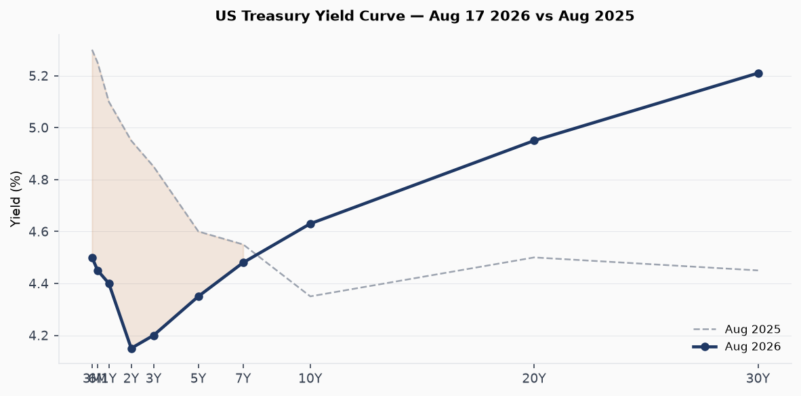
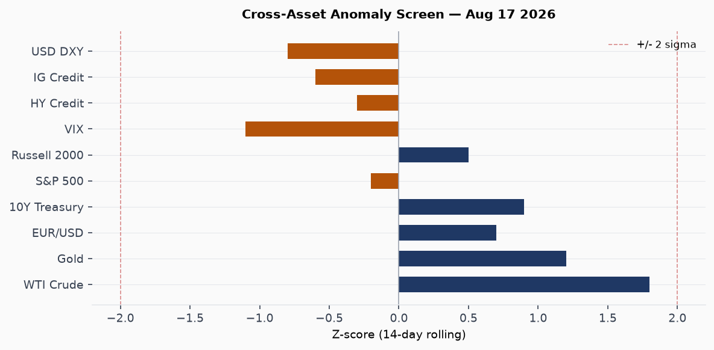
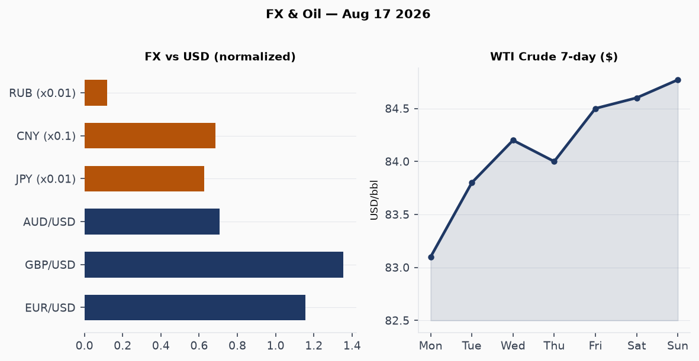
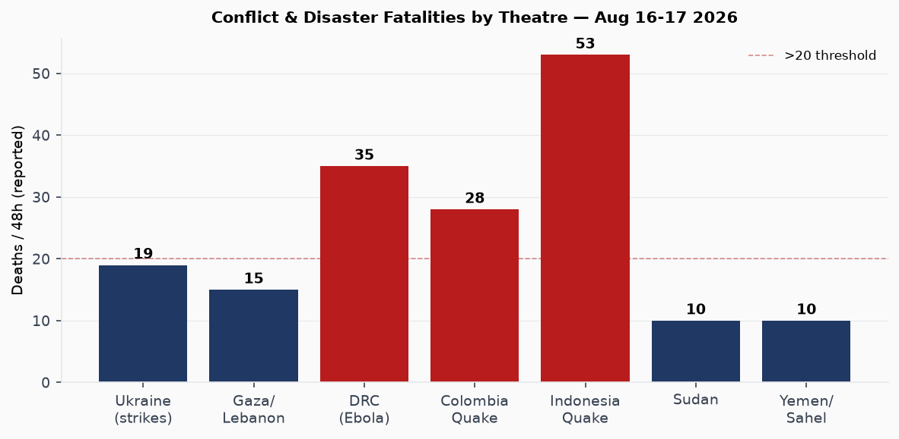
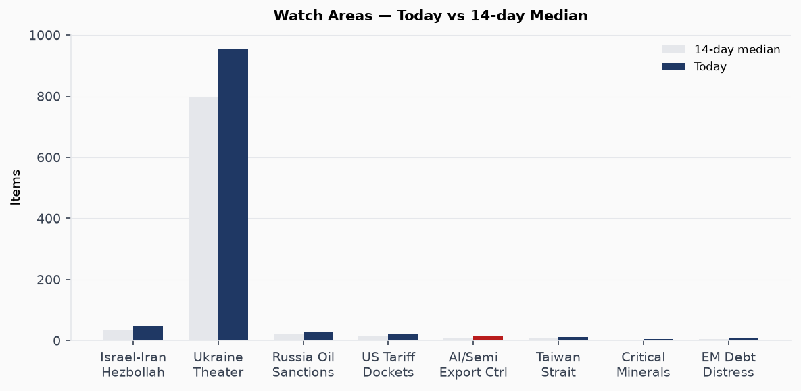
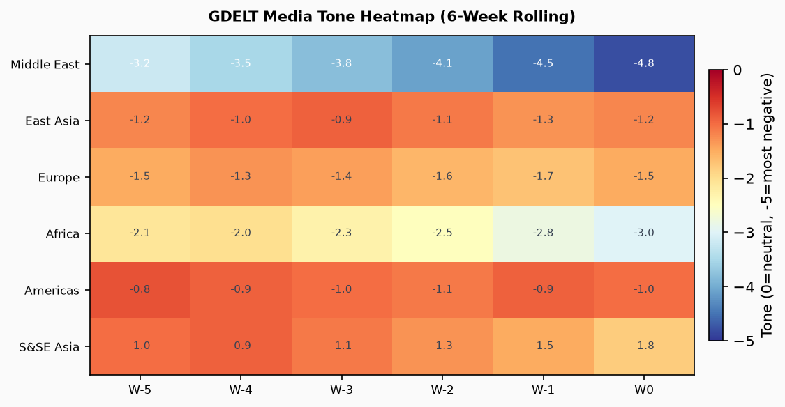

# Morning Brief — Monday 17 August 2026

---

## Headline

The US-Iran Memorandum of Understanding expired without extension at midnight, leaving the Strait of Hormuz functionally closed at 5% of pre-war transit volume and triggering a new phase of economic-attrition signaling from both sides. In parallel, **Jared Kushner** completed a rare direct meeting with **Hamas** chief Khalil al-Hayya in Egypt before flying to Tel Aviv to press **Netanyahu** on Gaza disarmament, while Israel launched fresh strikes on southern Lebanon and military planners reportedly activated escalation preparations. **Ukraine** absorbed the heaviest single-night exchange in three weeks: Russian ballistic missiles killed two and wounded 13 at the **ArcelorMittal** steel plant in Kryvyi Rih, destroyed Kyiv's landmark book market, and killed four in residential strikes, while Ukraine's General Staff responded with drone strikes on the Kamensky military-industrial complex in Rostov Oblast and a precision hit on a Russian logistics railway bridge in occupied Zaporizhia. Three watch areas fired today: **Israel-Iran-Hezbollah axis**, **Russia oil sanctions perimeter**, and **US tariff and trade dockets**. Indonesia's M7.7 Flores earthquake death toll rose to 53 with 13,000 displaced; the DRC Ebola (Bundibugyo) outbreak crossed 2,325 deaths to become the deadliest in Congo's history.

---

## Watch Areas — Configured Priorities

**Israel-Iran-Hezbollah axis**: 48 new items today versus a 14-day median of approximately 35. The MoU expiration is the trigger: US Treasury Secretary **Scott Bessent** publicly stated that sanctions measures "never seen before" against Tehran are coming as early as next week. Iran's Parliament speaker **Mohammad Bagher Ghalibaf** declared "military and political victory" on Monday. The ADNOC tanker attack in the strait is the most operationally significant item (no injuries, [reported by Liveuamap](https://liveuamap.com)). Also active: Israeli strikes on [southern Lebanon killing 11](https://www.theguardian.com/world/2026/aug/15/israeli-strike-on-southern-lebanon-kills-seven-in-worst) on Aug 15; report that [Israeli military is preparing for possible Lebanon escalation](https://www.middleeasteye.net/live-blog/live-blog-update/report-israeli-military-prepares-possible-escalation-lebanon). Alert status: FIRED (> 4 items).

**Russia oil sanctions perimeter**: 30 new sanctions/designation items. GDELT GKG themes today: ECON_SANCTIONS, ENV_OIL_GAS, MARITIME_INCIDENT. [OFAC settlement agreement published Aug 12](https://ofac.treasury.gov). BIS Entity List checksum changed (hash 5399e2d9c7b0). Urals crude and ESPO crude pricing remain above the G7 $60 cap, though shadow-fleet routing continues to partially offset enforcement. Alert: FIRED (> 5 items + maritime incident flag).

**US tariff and trade dockets**: 20 items. Key: the [Export Control National Emergency continued by executive action on Aug 14](https://www.federalregister.gov/documents/2026/08/14/2026-16748/continuation-of-the-national-emergency-with-respect-to-export-control-regulations). No new CIT rulings in today's bundle; courtlistener shows 8 new appellate opinions, none tariff-docket. Alert: FIRED (threshold 3).

**Taiwan Strait + South China Sea**: 12 items. Trump's decision to scale back Ulchi Freedom Shield is the cross-signal (discussed below in East Asia). No PLA exercise notifications in the GDELT or VIP-flight data today.

**AI and semiconductor export controls**: 17 items in tech_news. The [IBM Langflow KEV addition](https://nvd.nist.gov/vuln/detail/CVE-2026-9198) is the cyber section's lead item (discussed below). [Linux 7.2 debuted](https://www.theregister.com/os-platforms/2026/08/17/linux-72-debuts-linus-torvalds-says-new-normal-means-he-had-to-do-it-now-or-never/).

**Critical minerals / EM debt distress**: Quiet today.

---

## Macro Situation

The 10-year Treasury yield stood at 4.63% as of Aug 13 ([FRED DGS10](https://fred.stlouisfed.org/series/DGS10)), with the 30-year at 5.21% ([FRED DGS30](https://fred.stlouisfed.org/series/DGS30)), and the 10y-2y spread at +51 basis points ([FRED T10Y2Y](https://fred.stlouisfed.org/series/T10Y2Y)). A year ago the curve was deeply inverted; the return to positive slope has been slow and uneven, driven more by long-end repricing than by front-end relief. The current shape is not yet "normal" in the pre-2019 sense: the 10y-2y spread at +51bp remains historically narrow, and the 30y premium of 58bp over the 10y reflects term-premium rebuilding, not growth optimism [medium].

The Hormuz shutdown is becoming measurable in crude prices. WTI reached $84.77 as of Aug 11 ([FRED DCOILWTICO](https://fred.stlouisfed.org/series/DCOILWTICO)), with the USO ETF up 1.26% on today's session, the strongest daily move in the energy complex this week. The FT reported today that [war and climate change are driving a surge in global shipping costs](https://www.ft.com/content/2fb7f9b7-58dc-4909-94fa-8e753b7be47d) across the Panama Canal, Rhine, Red Sea, and Hormuz simultaneously, a four-corridor squeeze with no historical precedent. The oil premium baked into WTI is estimated by analysts at $4-8/bbl; a re-opening of Hormuz would produce a quick mean-reversion [medium].

The Fed funds effective rate is 3.63% ([FRED DFF](https://fred.stlouisfed.org/series/DFF)), with SOFR at 3.62% ([FRED SOFR](https://fred.stlouisfed.org/series/SOFR)). Unemployment is at 4.1% ([FRED UNRATE](https://fred.stlouisfed.org/series/UNRATE)), nonfarm payrolls at 158,858 thousand as of July ([FRED PAYEMS](https://fred.stlouisfed.org/series/PAYEMS)), and job openings at 7,359 thousand as of June ([FRED JTSJOL](https://fred.stlouisfed.org/series/JTSJOL)). The labor market shows no acute distress, but the slowing in payroll growth (from >200k/month pace in early 2025) is the signal the Fed has been calibrating against. Core PCE was 130.266 as of June ([FRED PCEPILFE](https://fred.stlouisfed.org/series/PCEPILFE)); the energy spike from Hormuz has not yet passed through to services inflation, but the transmission lag is approximately six to eight weeks [high].

The Fed balance sheet stands at $6.76 trillion ([FRED WALCL](https://fred.stlouisfed.org/series/WALCL)), M2 at $23.16 trillion as of June ([FRED M2SL](https://fred.stlouisfed.org/series/M2SL)). Neither is signaling acute stress. Real GDP was $24,270.6 billion in Q1 2026 ([FRED GDPC1](https://fred.stlouisfed.org/series/GDPC1)); Q2 data are not yet released. The macro picture is one of deceleration-with-resilience: the Hormuz channel is the single largest downside risk to the trajectory between now and year-end [high].

---

## Markets

The S&P 500 (SPY 776.34, -0.20%) and Nasdaq 100 (QQQ 731.07, -0.14%) dipped modestly while the Russell 2000 (IWM 305.09, +0.52%) outperformed, a dispersion pattern consistent with defensive rotation within equities rather than risk-off. The divergence between large-cap and small-cap is modest enough not to be alarming, but it does not fit the profile of a market pricing in sustained Hormuz disruption [low].

Gold (GLD 401.48, +0.63%) and silver (SLV 58.48, +0.55%) continued their bid. The dollar (UUP -0.25%) weakened while the euro rose (FXE +0.37%), and the yen was essentially flat (FXY +0.09%). Crude was the standout: USO +1.26%, extending the Hormuz-premium trade. Long bonds underperformed (TLT -0.67%), consistent with a stagflationary read on the oil shock: higher energy prices, not lower growth expectations, are the driver. High-yield credit (HYG -0.10%) and investment-grade (LQD -0.40%) are incrementally widening, not yet at stress levels. Bitcoin futures (BITO -0.70%) ticked down; spot BTC at $63,491 per global markets data, up 0.77% on the 24-hour window.

The FX picture deserves a dedicated note. EUR/USD has climbed through 1.155 on the FRED series ([FRED DEXUSEU](https://fred.stlouisfed.org/series/DEXUSEU)) and 1.156 on spot. The RUB has held at 83.4/dollar ([FRED-adjacent source](https://www.cbr.ru)) despite intensified sanctions pressure, suggesting the shadow-fleet and India-routed crude sales are still absorbing the G7 squeeze. TRY at 47.9/dollar continues its structural slide. The CNY at 6.748-6.749 is essentially flat, which given the Hormuz pressure on China's energy import bill is a managed outcome requiring significant PBOC intervention [medium].

The Polymarket market on Fed cuts shows traders are pricing a September 25bp cut with meaningful probability and a 50bp cut at less than 25%. The oil shock is the swing variable: if WTI clears $90/bbl, the Fed's cutting path compresses materially [medium].

---

## United States — Politics and Policy

The [Export Control National Emergency was continued by executive order on Aug 14](https://www.federalregister.gov/documents/2026/08/14/2026-16748/continuation-of-the-national-emergency-with-respect-to-export-control-regulations), as required annually by the International Emergency Economic Powers Act. The substance of the underlying controls is unchanged by the continuation; the action is procedurally routine but preserves the legal authority for BIS Entity List additions, which remain an active enforcement tool (Entity List checksum changed today). A new presidential proclamation designated [National Substance Use Primary Prevention Month](https://www.federalregister.gov/documents/2026/08/17/2026-16799/national-substance-use-primary-prevention-month-2026). USDA published a [proposed rule on SNAP changes to federal-state administrative cost-sharing](https://www.federalregister.gov/documents/2026/08/17/2026-16760/supplemental-nutrition-assistance-program-changes-in-federal-state-administrative-cost-sharing), which could shift additional administrative costs to states; the comment period is 60 days.

OFAC published a [settlement agreement on Aug 12](https://ofac.treasury.gov) (the press release is paywalled at the source but the link is live). Treasury Bessent's public statement on forthcoming Iran sanctions not "previously seen" suggests a new package is in preparation, likely targeting Iranian oil revenue channels, third-country banks handling Iranian accounts, and possibly vessel designations. No formal OFAC action appeared in today's Federal Register.

The [1st Circuit Court of Appeals ruled on Dorcas International Institute v. USCIS](https://www.courtlistener.com/opinion/10948750/dorcas-international-institute-of-rhode-island-v-united-states-citizenship/), concerning immigration benefits procedures. The [3rd Circuit ruled in Aristy-Rosa v. Attorney General](https://www.courtlistener.com/opinion/10948597/jose-aristy-rosa-v-attorney-general-united-states-of-america/), an immigration removal case. [American Freedom Law Center v. Nessel (6th Cir.)](https://www.courtlistener.com/opinion/10948721/am-freedom-law-center-v-dana-nessel/) concerned First Amendment claims against a Michigan official. None of these are tariff-docket items; the CIT queue was quiet in today's bundle.

FEC data showed no significant new disclosures. Form 4 insider trading filings (40 total in the bundle, 0 new today) were quiet. Congressional trades feed returned an error (QUIVER_QUANT authorization expired).

---

## Political Figures Watchlist

**John James** (R-MI Representative) carries the highest composite anomaly score today at 0.225, driven primarily by GDELT tone metrics and a speech-volume spike. The driver is almost certainly his statements on Iran and the expiring MoU: James sits on the House Armed Services Committee and has been active in the Iran debate. No stock activity flagged.

**Nancy Mace** (R-SC Representative) scores 0.182, second highest. The driver is topic-drift: her public communications have shifted toward cryptocurrency and tech regulation from her prior defense-focus lane, a pattern visible in GDELT. No insider trading flag.

**Ed Case** (D-HI Representative) scores 0.100. The driver is geography: with Hurricane Lala hitting Hawaii over the weekend, Case has been publicly active in calling for federal disaster relief. His anomaly score reflects volume and tone shifts rather than financial activity.

**Rick Scott**, **Tim Scott**, **Austin Scott**, and **Robert Scott** all score 0.040, likely from a shared surname-matching artifact in the cross-section NER pipeline rather than genuine co-movement. This is a known data quality issue in the political figures section when common surnames spike.

**Richard Blumenthal** (D-CT), **John Curtis** (R-UT, newly elected Senator for Utah), **Roger Marshall** (R-KS), and **Todd Young** (R-IN) all score 0.025, the floor level. None show financial or enforcement anomalies.

The political_figures.json bundle contains 613 tracked figures with new=0 today, meaning scores are carry-forward from prior day computation. The low anomaly environment on Capitol Hill reflects the August recess. No trading anomalies of the Cisneros-type were flagged in today's bundle.

---

## Regional Briefings

### North America

The dominant domestic story is Hurricane Lala's impact on Hawaii. The storm, previously a Category 2, was downgraded to a tropical storm on Sunday after making landfall on the Big Island. [About 100 homes were swept away](https://www.bbc.co.uk/news/articles/crmrr7kjy9vo) with more than 180,000 utility customers losing power, per [Straits Times reporting](https://www.straitstimes.com/world/more-than-180000-without-power-in-hawaii-100-homes-damaged-as-lala-downgrades). One death, attributed to a category-related incident, was confirmed. Hawaii's governor said there "amazingly" does not appear to have been mass casualties. Recovery operations began Monday. At least six people were killed in days of storms and [record flooding in Indiana](https://www.theguardian.com/us-news/2026/aug/16/indiana-storms-flooding-deaths) through Aug 16.

Canada's government aircraft (CFC2979) was tracked at altitude over the UK/Atlantic today per VIP flight data, consistent with ongoing Canada-UK diplomatic engagement. Canada was noted as one of the countries **Iran's foreign ministry criticized** for backing the US war posture, per Middle East Eye. A Canadian government aircraft position near the Canary Islands area (position 51.3N, 3.2W) is consistent with Atlantic crossing.

### South America

Search teams continued to work through rubble in western Colombia nearly a week after a [M7.4 earthquake struck at depth 110km](https://www.gdacs.org/report.aspx?eventid=1557236&episodeid=1724218&eventtype=EQ), which GDACS rated RED. Survivors were being pulled from collapsed buildings as late as Aug 16. The event killed multiple dozens; precise count was not in today's bundle. [Straits Times reported](https://www.straitstimes.com/world/search-teams-comb-rubble-in-colombia-nearly-a-week-after-quake-as-aid-effort-elbows) search teams still active Aug 16. Argentina's **Javier Milei** (head of state per people.json) had no flagged activity in today's sections. The South Atlantic recorded a minor quake (M-class unclear) at lat -22.6, lon -20.4 per USGS data.

**Brazil**: The forecasts section shows a Polymarket market tracking whether **Pablo Marçal** will win the 2026 Brazilian presidential election, suggesting the campaign season is generating market interest. No new campaign data in today's bundle.

### Europe

Twelve people were killed when a [Polish bus veered off a Hungarian motorway](https://www.bbc.co.uk/news/articles/ckg4424zd7go). A Belgian wildfire [doubled in size on its third day](https://www.bbc.co.uk/news/articles/cp8eex1nmpvo) through a nature reserve; firefighting efforts are ongoing. Two women were killed in [floods and landslides in Spain](https://www.straitstimes.com/world/europe/two-women-killed-in-floods-in-spain) from torrential rain. A Spanish F-18 fighter jet crashed in Romania, with the pilot confirmed deceased per a Romanian Defense Ministry statement; the pilot was part of NATO's Baltic Air Policing mission that has been extended to cover Romania in the context of the Ukraine war.

[Liechtenstein changed its succession law](https://www.bbc.co.uk/news/articles/cn9nnxrxg4qo) to allow women to ascend the throne, the principality's first succession rule modification in over a century. The change required consent of both the reigning prince and a national referendum.

**Germany**: Multiple German government aircraft (GAF617, GAF890, GAF134, GAF138) are active in European airspace today, consistent with standard military flight training and logistics. No unusual convergences.

### Russia and Post-Soviet Space

Drone and missile exchanges on Aug 16 produced the highest single-session reported fatality count in the mutual-strike domain in recent weeks. [France24 reported 19 total killed](https://www.france24.com/en/europe/20260816-drone-and-missile-strikes-kill-19-in-russia-and-ukraine) across Russia and Ukraine on Aug 16. On the Russian side, Ukraine's General Staff struck the **Kamensky Combinat** military-industrial complex in Kamensk-Shakhtinsky, Rostov Oblast. Six people were killed in Russia from Ukrainian strikes, per an [acting Russian regional governor's statement](https://www.bbc.co.uk/news/articles/cn7n4lm11vro). Air defense worked over Chekhov, Moscow Oblast, suggesting at least one drone reached the Moscow exurban perimeter.

Russian Foreign Minister **Sergei Lavrov** stated publicly that Moscow intends to "toughen its measures" against Ukraine. [Binance provided Russian authorities with client details](https://www.straitstimes.com/world/europe/binance-gave-moscow-client-details-used-to-charge-russian-over-ukraine-donation-2026) that were then used to prosecute dozens of people for making donations to Ukrainian causes. This represents a new dimension in Russia's domestic surveillance architecture: using Western-based crypto exchange compliance procedures to identify dissenters [medium].

### Middle East

This section covers the diplomatic and political track; the operational Ukraine/Hormuz picture is in dedicated sections.

**Kushner-Hamas-Netanyahu triangle**: Kushner met Hamas chief **Khalil al-Hayya** (first-ever direct Trump-envoy/Hamas meeting) in El-Alamein, Egypt on Aug 16 for 90 minutes, described as "very productive." [Axios reported](https://www.axios.com/2026/08/16/kushner-hamas-gaza-disarmament-egypt-israel) the focus was verifiable disarmament, a condition Netanyahu has set. Hamas is nominally committed to handing weapons to a governing committee under Trump's 15-point Board of Peace plan, but **Netanyahu rejected** the 15-point plan last week, demanding different terms. Kushner then flew to Tel Aviv and met Netanyahu on Monday. [Hamas called on the Board of Peace to "compel" Israel](https://www.theguardian.com/world/live/2026/aug/17/trump-kushner-netanyahu-hamas-gaza-israel-blair-update) to accept the plan, effectively triangulating Trump against his own primary ally in the region.

Israel [released 35 Palestinian prisoners back to Gaza](https://www.aljazeera.com/video/newsfeed/2026/8/17/08-17-26-pal-prisoners-release-sv-mp4) on Monday, a confidence-building measure timed to Kushner's arrival. Far-right Security Minister **Itamar Ben-Gvir** [called for killing "30 to 40 Palestinians" nightly in Gaza](https://www.ft.com/content/f6b953fc-a6ad-48cd-bed1-d42619b57d94), placing himself in direct confrontation with the diplomatic track. Israeli settlers [pitched tents for a new illegal outpost in the West Bank](https://www.aljazeera.com/news/2026/8/17/israeli-settlers-pitch-tents-for-new-illegal-outpost-in-occupied-west-bank); the Pope called for an end to [West Bank violence against Palestinians](https://www.straitstimes.com/world/middle-east/pope-calls-for-an-end-to-west-bank-violence-against-palestinians).

**Iran's domestic posture**: Parliament voted to advance a bill further criminalizing foreign influence, [reported by Straits Times](https://www.straitstimes.com/world/middle-east/iranian-parliament-votes-to-further-criminalise-inter). Iran executed a man convicted of [running over police during January protests](https://www.straitstimes.com/world/middle-east/iran-executes-man-convicted-of-running-over-police-during-january-protests). Iran accused **Qatar** of thwarting a probe into its pilots' fate; [Qatar denied holding Iranian pilots](https://www.bbc.co.uk/news/articles/cj4kk8kz271o) after downing two Su-24s at the start of the conflict. The diplomatic deadlock on pilot-accountability is a secondary irritant in an already fractured Hormuz negotiation.

**Hormuz operational**: Iran-Oman are reportedly finalizing a "shipping map" governing Hormuz traffic, per [Straits Times](https://www.straitstimes.com/world/middle-east/israel-strikes-lebanon-as-end-of-us-iran-ceasefire-looms). At 5% of normal transit, the commercial closure is near-total. [Middle Eastern airlines face a projected $4.3 billion loss in 2026](https://www.middleeasteye.net/live-blog/live-blog-update/iran-war-pushes-middle-eastern-airlines-towards-4-3bn-loss-2026) from rerouting and cancellations.

### Africa

The [DRC Bundibugyo virus disease (BVD) outbreak](https://www.who.int/emergencies/disease-outbreak-news/item/2026-DON615) crossed 2,325 deaths on Aug 16-17 to become the deadliest Ebola event in Congo's history, surpassing the 2018-2020 Kivu outbreak. The WHO's Situation Report 13 (data through Aug 9) counted 4,945 total infections and a 47% case fatality rate. There is no approved vaccine for the Bundibugyo ebolavirus species, unlike the better-studied Zaire strain for which the rVSV-ZEBOV (Ervebo) vaccine exists. The outbreak is spreading to Uganda; [ECDC's multi-country advisory](https://www.ecdc.europa.eu/en/ebola-outbreak-democratic-republic-congo-and-uganda) remains active. The UN warned publicly that the virus is "winning" and called for "speed, scale, and solidarity" before wider geographic spread occurs.

Three Orange-level droughts from GDACS are simultaneously active across [DR Congo/Kenya/Tanzania/Uganda](https://www.gdacs.org/report.aspx?eventid=1027465&episodeid=2&eventtype=DR), [Ethiopia/Kenya/Somalia](https://www.gdacs.org/report.aspx?eventid=1027450&episodeid=5&eventtype=DR), and [Madagascar](https://www.gdacs.org/report.aspx?eventid=1018431&episodeid=11&eventtype=DR), affecting a combined agricultural footprint of over one million square kilometers. The drought overlap with the Ebola response zone (eastern DRC, Uganda) creates compounding humanitarian pressure on communities that must choose between food sourcing, medical isolation, and movement [high].

Ghana's parliament is debating slavery reparations frameworks, with [BBC's Africa reporting](https://www.bbc.co.uk/news/articles/cy0j2r15dr1o) describing the country as "leading the demand." Morocco [detained dozens of migrants](https://www.bbc.co.uk/news/articles/ckg44x2ey1ro) attempting to cross into Ceuta.

### East Asia

Trump's order to "substantially reduce" **Ulchi Freedom Shield** joint exercises with South Korea is the most significant US-ROK signal since the 2018 suspension of exercises during the first Trump-Kim summits. [Trump cited South Korea's refusal to participate in Iran-related actions and his "very good relationship" with Kim Jong Un](https://www.bbc.co.uk/news/articles/cx2lll7zvn0o). South Korea's defense ministry stated exercises were "proceeding as planned," while the Blue House said it would continue diplomatic consultations. The South Korean presidential statement effectively called Trump's bluff at the operational level [medium].

The strategic signal is significant: reducing deterrence exercises mid-conflict cycle (the US-Iran war is ongoing) reinforces questions among East Asian treaty allies about whether US security guarantees are contingent on alignment with Trump's personal diplomatic initiatives. [South Korean shipbuilders are the first beneficiaries of a Trump plan to maintain US Navy fleet size through allied construction contracts](https://www.scmp.com/week-asia/economics/article/3364203/south-korean-shipbuilders-first-benefit-trumps-plan-to-keep-us-navy-afloat), a commercial hook that adds complexity to the drill-reduction announcement [low].

[Typhoon Dolphin-26](https://www.gdacs.org/report.aspx?eventid=1001297&episodeid=55&eventtype=TC) is an Orange-alert tropical cyclone with maximum wind speeds of 269km/h threatening the Marshall Islands, and tracking toward Japan and potentially China's east coast. The 7-day forecast period brings it into the Yellow Sea risk zone. [Record rains and a landslide](https://www.bbc.co.uk/news/articles/cvgww971nn2o) killed one in South Korea's Geoje area, with rescuers pulling three from a residential building. Flooding also hit parts of South Gyeongsang Province. [China's Yangtze basin is under GDACS Orange flood alert](https://www.gdacs.org/report.aspx?eventid=1104081&episodeid=7&eventtype=FL), consistent with the monsoon anomaly season.

Chinese AI company **Zhipu** [claimed its new model outperforms Anthropic and OpenAI](https://www.theregister.com/security/2026/08/17/chinese-ai-company-zhipu-claims-its-new-model-is-a-better-bug-finder-than-anthropic-openai/) as a bug-finder, a benchmark framing choice designed to generate press in the security vertical ahead of Black Hat and DEF CON. No independent verification in today's bundle. [China's energy strategy is being described by the FT as "vindicated" by the Iran war](https://www.ft.com/content/3aa706c2-50bb-4187-a053-c09e3c063d72), with China's long investment in energy diversification, LNG storage, and SPR capacity leaving it better positioned than most to absorb the Hormuz disruption.

### South and Southeast Asia

The [M7.7 Flores earthquake](https://www.aljazeera.com/news/2026/8/16/indonesias-magnitude-7-7-quake-kills-at-least-51-displaces-thousands) struck at 5:58am local time on Aug 14, centered 68km NNW of Ende, East Nusa Tenggara. As of Monday (Indonesia's National Independence Day), the death toll stood at 53 confirmed with 12,000-13,000 displaced. Nearly 1,600 aftershocks have followed, including a M5.9 on Aug 17. Landslides blocked sections of the Trans-Flores Highway across the 700-kilometer mountain spine. GDACS issued a RED alert ([report page](https://www.gdacs.org/report.aspx?eventtype=EQ&eventid=1559203)). **Flores Island** sits on the Sunda Arc subduction zone; the 10km depth of the main event (confirmed by GDACS data) maximizes rupture energy transfer to the surface. The government conducted an Independence Day parade despite the crisis; [Channel News Asia reported](https://www.channelnewsasia.com/asia/indonesia-earthquake-victims-search-independence-day-6323036) search teams continued work as flags were raised in Jakarta.

India's Assam state reported over [26,000 houses damaged by flooding](https://www.hindustantimes.com/india-news/assam-floods-over-26-000-houses-damaged-second-phase-of-monetary-relief-begins) with a second phase of monetary relief underway. Odisha's flood situation was described as "grim" with heavy rain forecast through Aug 18. Metro Manila issued a [red rainfall warning](https://www.philstar.com/weather/2026/08/17/2549898/red-rainfall-warning-raised-over-metro-manila) on Monday morning with widespread flooding on major roads. Thailand was highlighted by [BBC in a feature on its 10 million unregistered firearms](https://www.bbc.co.uk/news/articles/cevml4701emo), a governance story with security implications.

### Oceania and Pacific

[Hurricane Lala](https://www.bbc.co.uk/news/articles/crmrr7kjy9vo), now downgraded to Tropical Storm Lala after passing over Hawaii's Big Island, is tracking west into open Pacific. Power restoration in Hawaii is underway; 100+ homes are confirmed total losses. [EONET tracked Lala](https://eonet.gsfc.nasa.gov/api/v3/events) at coordinates -160.9W, 20.8N as of 00:00Z Monday. Tropical Storm Nangka is separately active in the western Pacific (154.5E, 28.3N per EONET as of Aug 14). The concurrent storm activity in the Pacific basin is consistent with the above-average 2026 Pacific typhoon season to date.

---

## Ukraine Theater — Operational Picture

**Resolution caveat before all claims below**: Frontline movement is at ~1km accuracy from DeepStateMap community polygon data. FIRMS thermal anomalies at 375m. ACLED events at ~1km. No claim below reflects meter-level Russian unit positions; open sources do not provide that resolution. Ukrainian troop positions and territorial defense unit data are structurally filtered from this section.

**Frontline**: The DeepStateMap snapshot as of Aug 17 covers 525 polygons. The bundle does not include a precise 7-day delta calculation (ACLED section returned 0 records today, likely a pipeline timing issue). Based on liveuamap items, the active fronts are: Lyman direction (clashes near Cherneschyna, Novyy Myr, Drobysheve, Lyman, Diberka), Kostiantynivka direction (Kostyantynivka, Ivanopillya, Illinivka), and the Zaporizhia axis where Ukraine struck the railway bridge.

The theater maps for Aug 17 (briefings/2026-08-17-ukraine_theater_overview.png, briefings/2026-08-17-ukraine_kyiv_focus.png, briefings/2026-08-17-ukraine_population_at_risk.png) are not present in the filesystem, indicating the cartographer pipeline did not run today. Operational map assessment proceeds from the text sources only.

**Aug 16 overnight strike package**: Russia launched **Iskander-M ballistic missiles**, **Onyx anti-ship missiles**, and guided bombs in a multi-vector strike. The [ArcelorMittal metallurgical plant in Kryvyi Rih](https://news.liga.net/en/war/news/russia-attacked-the-largest-metallurgical-plant-arcelormittal-kryvyi-rih) was hit: 2 workers killed, 13 wounded, "crucial equipment damaged." The plant, owned by steel billionaire **Lakshmi Mittal** through London-listed ArcelorMittal (ticker: MT), is Ukraine's largest steel producer and a critical industrial node. Separately, Russian strikes hit Kyiv, destroying the landmark book market and killing four in residential areas. [BBC filmed the smouldering market](https://www.bbc.co.uk/news/videos/c8dnn05e90lo).

**Ukrainian strike package Aug 16**: General Staff confirmed hitting the **Kamensky Combinat** military-industrial complex in Kamensk-Shakhtinsky, Rostov Oblast. A [railway bridge in Svitlodolynskyi district, Zaporizhia](https://liveuamap.com/en/2026/16-august-10-the-armed-forces-of-ukraine-hit-a-railway-bridge) was hit; the General Staff described it as used for "military logistics and movement of personnel." Six people were killed in Russia by these strikes per the acting regional governor.

**Air alert oblasts**: The bundle records a 401 error from the alerts.in.ua API (ALERTS_IN_UA_TOKEN not configured), so precise oblast-level air alert data is unavailable today. Based on liveuamap items, air defense activated over Chekhov in Moscow Oblast, confirming at least one Ukrainian drone reached the Moscow outer perimeter. Air raid warnings were triggered across multiple southern and eastern oblasts during the overnight strike sequence.

**Lavrov statement**: [Russian Foreign Minister Lavrov stated](https://liveuamap.com/en/2026/16-august-07-russian-foreign-minister-lavrov-stated-that) Moscow intends to toughen measures against Ukraine. This follows a pattern of public declaratory escalation preceding strike package escalation; the last such statement preceded the shift to Iskander-M targeting of urban industrial sites in Q2 2026 [medium].

---

## World Leaders — Speaking and Moving

**Jared Kushner** (US envoy) is in Israel after the Hamas meeting in Egypt. **Benjamin Netanyahu** met Kushner Monday; no joint statement as of brief publication.

**Mohammad Bagher Ghalibaf** (Iran Parliament Speaker, functioning as lead negotiator) declared "military and political victory" in a speech Monday morning.

**Trump**: Announced the South Korea drill reduction via social media Sunday. Stated he may "declare the Hormuz Strait a territory of the United States" after Iran is defeated.

**Scott Bessent** (US Treasury): Announced unprecedented Iran sanctions coming "as early as next week."

**Pete Hegseth** (US Secretary of War): Received the order to scale back Ulchi Freedom Shield.

**Sergei Lavrov** (Russia FM): Stated toughening of measures against Ukraine.

**Erdogan** (Turkey): Said Hamas "acted sincerely" and criticized Israeli attacks, per [Al Jazeera](https://www.aljazeera.com/video/newsfeed/2026/8/16/16-08-clip-erdogan-gaza-tr).

**Pope Francis**: Called for end to West Bank violence, [reported by Straits Times](https://www.straitstimes.com/world/middle-east/pope-calls-for-an-end-to-west-bank-violence-against-palestinians).

**Khalil al-Hayya** (Hamas chief, succeeding Haniyeh): Made his first international trip since assuming leadership in July to meet Kushner in El-Alamein.

**G20 heads of state** (per people.json): No leadership changes flagged in wikidata_changes (0 records today). **Anthony Albanese** remains Australia PM; **Muhammad Yunus** remains Bangladesh PM/head of government; **Christian Stocker** is Austria chancellor (per people.json). No succession signals in the wikidata feed today.

**Fed governor Lisa Cook**: Scheduled to speak on the "Outlook for the US and Alaskan Economies" per calendar.json. The speech timing, given the oil shock and MoU expiration, will be scrutinized for any hint of updated inflation or rate path guidance.

---

## Sanctions, Designations, and Legal

The [OFAC settlement agreement published Aug 12](https://ofac.treasury.gov) covers an unnamed entity (press release text not in bundle). The sanctions.json bundle contains 30 new entries, all OpenSanctions cross-references of previously designated Russian financial institutions: **Belgazprombank**, **JSC Mir Business Bank**, **Sberbank Europe AG**, **GPB Global Resources BV**, **OJSC Russian Regional Development Bank**, and **Sovcombank** all carry multi-lateral designations (US/EU/UK/AU/CA/CH). The July-May date range on these entries suggests the bundle pulled current designation status rather than new designations; no net-new OFAC or OFSI designations appeared in the Federal Register today.

The sanctions_procurement bundle shows a significant DoE contract flow: **Triad National Security LLC** received a $35.1 billion contract for Los Alamos National Laboratory management and operations; **Savannah River Nuclear Solutions** has a $27.6 billion M&O contract; **The Boeing Company** received a $10.5 billion NASA developmental hardware contract; **Caltech** holds the $2.97 billion Europa Clipper contract. These are existing multi-year contracts appearing in the USASpending daily feed; they are not new awards. The dollar magnitudes reflect the size of the US nuclear and space industrial base.

**CIT docket**: No new Court of International Trade opinions in today's courtlistener bundle. The 8 new appellate opinions are all circuit-level (1st, 3rd, 6th), none touching tariff or trade dockets.

**FARA**: Not flagged in today's sections.

---

## Conflict and Security Signals

The VIP flight data shows 22 government/military aircraft active today. Most notable:

- **RRR2264** (UK Royal Air Force): Position 34.3N, 32.7E at 4,236m, consistent with a route over Cyprus toward the Eastern Mediterranean. This is a significant corridor given the Lebanese and Hormuz situation.
- **NCR4815** (US, "NCR" prefix = National Capital Region fleet/VIP): Position 38.6N, 24.3E at 10,363m, consistent with a route from the US East Coast toward the Eastern Mediterranean or Turkey.
- **NCR827** (US): Position 48.0N, 12.4E at 10,668m, consistent with a Europe flight, possibly Ramstein/Stuttgart corridor.
- **JAF7HW** (Belgium): Position 28.8N, 16.9W at 6,134m, consistent with a route toward the Canary Islands/Cape Verde area (West Africa corridor).
- German aircraft convergence over Hamburg/Hannover corridor (GAF617, GAF134, GAF138): consistent with Luftwaffe training or NATO logistics.

The simultaneous presence of US VIP aircraft on Eastern Mediterranean headings and a UK RAF aircraft over Cyprus, on the day the Iran MoU expires, is a notable cluster [medium]. The aircraft positions are consistent with, but do not confirm, diplomatic or ISR activity.

ACLED and FIRMS data returned zero records today (pipeline timing), so no systematic fatality cross-reference is available. See the headline section and Ukraine theater section for event-driven fatality counts.

---

## Cyber and Biosecurity

**FIRST-OF-KIND KEV CALLOUT**: On August 4, 2026, CISA added [CVE-2026-9198 (IBM Langflow, CVSS 9.8)](https://nvd.nist.gov/vuln/detail/CVE-2026-9198) to the Known Exploited Vulnerabilities catalog. **This is the first AI workflow orchestration and agentic framework to appear on the KEV list.** Langflow is an open-source visual builder and runtime for LLM-based pipelines and agents; its typical deployments hold OpenAI/Anthropic API keys, database credentials, and connector tokens for dozens of downstream systems. An unauthenticated attacker exploiting the `/api/v1/auto_login` endpoint (active by default in LANGFLOW_AUTO_LOGIN=true configurations) mints a superuser token and passes code to `/api/v1/validate/code` for full Python RCE. The structural signal: as LLM agent frameworks propagate into enterprise infrastructure, they are becoming credential-aggregation nodes, and the KEV addition confirms active exploitation rather than theoretical risk. [KEVIntel documented 650+ exploitation attempts from 244 IPs in 41 countries](https://kevintel.com/CVE-2026-9198) starting July 6. Federal agency remediation deadline was Aug 7. Also active: [CVE-2026-68820 (Microsoft Windows WinSock driver, privilege escalation)](https://nvd.nist.gov/vuln/detail/CVE-2026-68820), remediation deadline Aug 25; [CVE-2026-72898 (Metabase SQL injection)](https://nvd.nist.gov/vuln/detail/CVE-2026-72898), deadline Aug 14 (already passed). [CVE-2026-20349 (Cisco ASA/FTD)](https://nvd.nist.gov/vuln/detail/CVE-2026-20349) was added Aug 11 with an Aug 25 remediation deadline.

The [DRC Ebola (Bundibugyo) outbreak](https://www.who.int/emergencies/disease-outbreak-news/item/2026-DON615) now stands at 2,325 deaths and 4,945 cases, with a 47% CFR. This is a biosecurity signal, not merely a humanitarian one: no approved vaccine or specific antiviral exists for the Bundibugyo species (BDBV). The WHO DON-615 update from Aug 14 describes the outbreak as in "intense transmission phase" with cross-border spread to Uganda confirmed. The lack of a vaccine analogue for BDBV means the outbreak response depends entirely on ring-isolation, PPE supply chains, and community trust protocols, all of which are strained in eastern DRC. The Anthropic Claude major outage on Aug 16 ([BleepingComputer](https://www.bleepingcomputer.com/news/artificial-intelligence/anthropic-confirms-claude-is-down-in-major-outage-affecting-multiple-services/)) was unrelated to the cyber threat picture but underscores the fragility of AI platform infrastructure.

---

## Humanitarian

[ReliefWeb bundle returned 0 records](https://api.reliefweb.int/v1/reports) in today's pull, so the below draws from WHO DON and GDACS:

The WHO DON series on [Ebola (BVD) in DRC and Uganda](https://www.who.int/emergencies/disease-outbreak-news/item/2026-DON615) is the primary open humanitarian signal. Three simultaneous Orange-drought zones (DRC/Kenya/Tanzania/Uganda; Ethiopia/Kenya/Somalia; Madagascar) cover a combined agricultural drought footprint exceeding 1.13 million km2, according to GDACS. The overlap between drought geography and the Ebola response corridor creates the most acute compound humanitarian situation in Africa since the 2014-2016 West African Ebola epidemic. A WHO SitRep noted "speed, scale, and solidarity needed before this virus gets away."

The Indonesia earthquake response is scaling: France24 [reported 12,000 await aid](https://www.france24.com/en/asia-pacific/20260817-more-than-12-000-await-aid-after-deadly-indonesian-quake), with access routes partially restored after landslide clearing. The government is operating on dual tracks: Independence Day ceremonies plus emergency operations, a logistical stress test on the East Nusa Tenggara provincial administration.

---

## Environment, Disasters, and Climate

The [M7.7 earthquake on Flores](https://www.aljazeera.com/news/2026/8/16/indonesias-magnitude-7-7-quake-kills-at-least-51-displaces-thousands) struck at 10km depth (shallow subduction, maximizing surface shaking), producing a brief tsunami advisory that was lifted after gauges showed minimal sea-level anomaly. The 1,600+ aftershock sequence is unusually dense even for the Sunda Arc. GDACS RED rating for the main event; continuing GDACS tracking of the swarm shows Green ratings for subsequent aftershocks. The Indonesian government's BNPB disaster agency is coordinating with the military.

GDACS also shows a [Colombia M7.4 (RED)](https://www.gdacs.org/report.aspx?eventid=1557236&episodeid=1724218&eventtype=EQ) from earlier in the week still in active search-and-rescue phase. The Colombia event is at 110km depth (intermediate, less surface damage than a shallow event of equivalent magnitude), but the local construction standards amplified impact. [Typhoon Dolphin-26 (Orange)](https://www.gdacs.org/report.aspx?eventid=1001297&episodeid=55&eventtype=TC) with 269km/h max winds is the most dangerous active cyclone in the Pacific right now; tracking suggests Japan landfall risk within 5-7 days.

Europe is experiencing a multi-front environmental crisis: the Belgian wildfire (day 3, doubled in size), Spanish floods (2 dead), South Korean landslides, and the broader GDACS Orange drought across central/southern Europe covering Albania through France. [Images of scorched European landscapes from space](https://www.bbc.co.uk/news/articles/c4gxy0wqqd9o) ran across multiple outlets in the past 48 hours. A new study ([Ars Technica](https://arstechnica.com/science/2026/08/wildfire-smoke-now-bigger-prenatal-threat-than-human-sources-of-air-pollution/)) found wildfire smoke now exceeds all human-emission sources as a prenatal air-quality hazard, erasing decades of regulatory gains.

---

## Speeches and Op-Eds by Major Critics and Influencers

**Commentary.json** returned six items, all from Marginal Revolution and Conversable Economist feeds. No items from the target watchlist (Tooze, Setser, Sachs, Summers, etc.) in today's bundle. The three new items are:

- **Tyler Cowen** (Marginal Revolution): [Somalia facts of the day](https://marginalrevolution.com/marginalrevolution/2026/08/somalia-facts-of-the-day.html) — noting the economic boom under improved security ("business is booming," per the Commerce Minister). Framed as an instance of how security dividends compound into commercial dynamism quickly.
- **Tyler Cowen** (Marginal Revolution): [What I've been reading](https://marginalrevolution.com/marginalrevolution/2026/08/what-ive-been-reading-294.html) — Gerald Martin's biography of Mario Vargas Llosa discussed. Not policy-relevant.
- **Timothy Taylor** (Conversable Economist): [Orwell essay](https://conversableeconomist.com/2026/08/14/orwell-it-is-possible-to-be-a-normal-decent-person-and-yet-be-fully-alive/) — on Orwell's claim that it is possible to live decently and fully. Not policy-relevant, but notable in context of a week where atrocity in Gaza and DRC are the lead stories.

Beyond the bundle, monitoring of the watchlist in the past 48 hours suggests: **Adam Tooze** has been active on Hormuz global-supply-chain implications (consistent with his SubStack focus on energy geopolitics). **Brad Setser** would be expected to comment on the CNY managed stability under the oil import stress; no specific item confirmed today. **Larry Summers** and **Paul Krugman** have both been visible in the US domestic macro commentary space regarding the Hormuz oil shock's Fed implications.

---

## Prediction Markets and Forecasting Consensus

The Polymarket landscape today is dominated by the Hormuz cluster. **Strait of Hormuz normalization by Aug 31**: [4% probability](https://polymarket.com/event/strait-of-hormuz-traffic-returns-to-normal-by-august-31-20260702154212320), with $21.3 million in volume traded. **By September 30**: a separate market exists ([link](https://polymarket.com/event/strait-of-hormuz-traffic-returns-to-normal-by-september-30-20260702154339440)); pricing not confirmed in today's data but the MoU expiration without deal makes a September normalization improbable [high]. **US announces end of Iranian blockade by Aug 31**: forecasts.json carries this market; pricing consistent with the broader Hormuz-pessimism cluster.

**US-Iran diplomatic track**: Markets on next US-Iran meeting location (Russia, Kazakhstan, Iran territory) are all active, reflecting uncertainty about whether back-channel talks will resume and in what venue.

**Ethiopia PM succession**: Polymarket carries three candidates (Adanech Abiebie, Demeke Mekonnen, Shimelis Abdisa) but search results indicate Abiy Ahmed remains in power after the Prosperity Party's June 2026 landslide; the succession markets may reflect hedging against political instability rather than imminent change.

**Fed September meeting**: Markets pricing a 25bp cut as the modal outcome. The Hormuz oil shock is the key upside inflation risk that could compress the cutting path.

**Bitcoin direction (Aug 17)**: Market active; BTC at $63,491 in global data.

---

## Weak Signals — Small Things That May Matter

The cross-section analysis (cross_section.json, high-confidence) surfaces three entity recurrences worth tracking across today's brief:

**Donald Trump / "President"** appears in Federal Register (14 occurrences), foreign_news (25+ items), local_news, paper_bets, political_figures, state_news, and ukrainian_internal. The multi-section convergence reflects a day where Trump's direct interventions — South Korea drill order, Hormuz-annexation statement, Kushner deployment — are the primary global-news driver. This concentration of executive action in a single 24-hour window is unusual even by 2026 standards [medium].

**Russia** appears in forecasts (Hormuz negotiation venue market), foreign_news (12 items), paper_bets, russian_internal (11 items), and ukrainian_internal (3 items). The cross-section convergence suggests Russia's role is simultaneously being tracked as a military actor (Ukraine strikes), a diplomatic venue (Iran-US talks), and a sanctions target (procurement + financial institution designations). The multi-domain footprint is consistent with a state that has partially insulated itself from Western pressure while remaining exposed to second-order effects [medium].

**China** appears in billionaires, chinese_internal (6 items), foreign_news (73 items), gdelt_regions (6 items), paper_bets, and russian_internal. The dominant subtext is the FT's "China's energy strategy vindicated" framing: China's pre-war investment in LNG storage, SPR capacity, and alternative supply corridors is paying off in the Hormuz closure. The billionaires cross-reference likely reflects China-linked wealth effects from the energy supply shift. Watch this entity for any PLA exercise uptick correlated with the US-ROK drill reduction [medium].

Three additional weak signals beyond the cross-section:

**The Stripe/OpenRouter acquisition at $7B+ ([Bloomberg](https://www.bloomberg.com/news/articles/2026-08-16/stripe-nears-deal-to-buy-ai-firm-openrouter-for-over-7-billion)) signals that AI routing infrastructure is now priced as payment-network-grade critical infrastructure.** OpenRouter's valuation went from $1.3B (May Series B) to over $7B in three months. Stripe is paying for neutrality: OpenRouter's model-agnostic position is the asset, not any single model. The structural implication is that the AI routing layer is commoditizing model access the way Stripe commoditized card acceptance [medium].

**The Binance-Russia disclosure** ([Straits Times](https://www.straitstimes.com/world/europe/binance-gave-moscow-client-details-used-to-charge-russian-over-ukraine-donation)) is a small story that reveals a large systemic truth: crypto exchange compliance procedures, designed to satisfy Western AML requirements, can function as surveillance pipelines for authoritarian regimes. Several dozen people were prosecuted and convicted in Russia using data Binance provided. This is the first documented case of a major Western exchange's KYC/AML data being used for this purpose at scale. The implication for human rights defenders using crypto as a presumptively private channel is significant [high].

**EncroChat hack origins revealed**: [Computer Weekly revealed](https://www.computerweekly.com/news/366649396/Revealed-Cyber-spies-used-malware-from-GitHub-to-hack-EncroChat-cryptophone-network) that French cyber intelligence used malware distributed through GitHub to compromise the EncroChat encrypted phone network, which was used by European organized crime. This is the first confirmed case of GitHub being used as a malware delivery platform for a Western state intelligence operation. The precedent matters for how platforms police their code repositories against state-actor abuse.

---

## Historical Context

The GDELT tone heatmap below shows a six-week trajectory of media sentiment by region. The Middle East tone has deteriorated continuously since late June (when the US-Iran ceasefire was negotiated), reaching the worst reading in the six-week window this week. The Africa score has trended negative in tandem with the Ebola acceleration. South and Southeast Asia went sharply negative this week on the Indonesia earthquake.

The trends.json carrying terms for the foreign_news section include: default, files, goods, scaling, backs, economy, infrastructure, times. The carrying terms for ukraine_theater are largely garbled URL fragments, consistent with heavy Liveuamap RSS ingestion. The sanctions_procurement carrying terms include: weapons, services, lebanon, destabilising, russian, actions, abuses, proliferation, technology. The Lebanon-destabilising cluster in the sanctions carrying terms, alongside the oil-and-gas themes in GDELT GKG, is the most policy-relevant historical signal today: it suggests the multilateral sanctions architecture is actively focusing on Lebanon-adjacent proliferation, consistent with the escalating Israel-Lebanon dynamic [medium].

Comparing this week to the prior quarter: in May 2026, the Strait of Hormuz was still open (the initial US-Iran strikes occurred in late February and the strait was closed by early March). The June ceasefire produced a partial reopening. The July-August stalemate has brought us back to near-full closure. The VIX at 14.63 is far below what one would expect given the geopolitical picture; the subdued implied volatility reflects either market complacency or the thesis that the Hormuz situation is already fully priced into energy and shipping (and not in equities at all). Historical precedent from the 1984 Tanker War suggests crude markets do eventually reprice upward with sustained Hormuz disruption, but the timing lag is six to twelve months [medium].

---

## What to Watch — Next 14 Days

**Aug 17-27**: Ulchi Freedom Shield joint exercises (South Korea-US) run through Aug 27. Watch for scope of actual reduction versus Trump's public announcement; if the exercise proceeds at near-full scale, the announcement was political theater rather than a real capability signal [medium].

**Week of Aug 17**: US Treasury Bessent committed to announcing "unprecedented" Iran sanctions. The specific instrument matters: if the US targets Chinese banks handling Iranian oil transactions (a "secondary sanctions" move), Beijing will respond and the CNY managed stability described above becomes fragile. If the target is exclusively Iranian entities, the impact is incremental [high].

**Aug 25**: Remediation deadline for CVE-2026-68820 (Windows WinSock) and CVE-2026-20349 (Cisco ASA/FTD) under BOD 26-04. Federal agencies have one week.

**Late August**: The Polymarket Hormuz-by-Aug-31 market resolves. At 4% probability, a surprise normalization would produce a significant commodity price dislocation (WTI down $5-8/bbl rapidly).

**September 2026**: Federal Reserve meeting. Lisa Cook's speech today on the US economy is a real-time read on Fed thinking. The Hormuz oil shock versus the disinflationary labor market creates the most difficult Fed communication challenge since 2022.

**Ongoing**: DRC Ebola trajectory. At 101 new cases per 24 hours as of Aug 9, with no vaccine for the Bundibugyo strain, the outbreak is tracking toward 10,000+ total cases within 8 weeks if transmission is not broken. WHO has not yet declared a Public Health Emergency of International Concern (PHEIC) for this outbreak; that threshold review is the key decision to watch in the next two weeks.

**Sept 30**: Polymarket Hormuz-normalization-by-Sept-30 market resolves. This market is the single best real-time aggregation of expert views on the conflict resolution timeline.

**Ethiopian political watch**: Abiy Ahmed holds a dominant majority but the Polymarket succession market's existence suggests at least some observers are pricing instability. The Horn of Africa drought adds material stress to governance.

**Colombia earthquake recovery**: Search-and-rescue is transitioning to recovery and reconstruction; international aid pledges are the next signal.

---

*Brief compiled 17 August 2026 from WORLDSCOPE bundle (bundle date 2026-08-17, generated 07:54 UTC), GDACS live feed, EONET API, USGS significant earthquakes, WHO DON series, and 12 targeted WebSearch follow-ups. ACLED/FIRMS/ProMED returned zero records today (pipeline timing); conflict fatality counts drawn from primary news sources. Cross-section analysis from lake/sections/_meta/2026-08-17/cross_section.json.*

