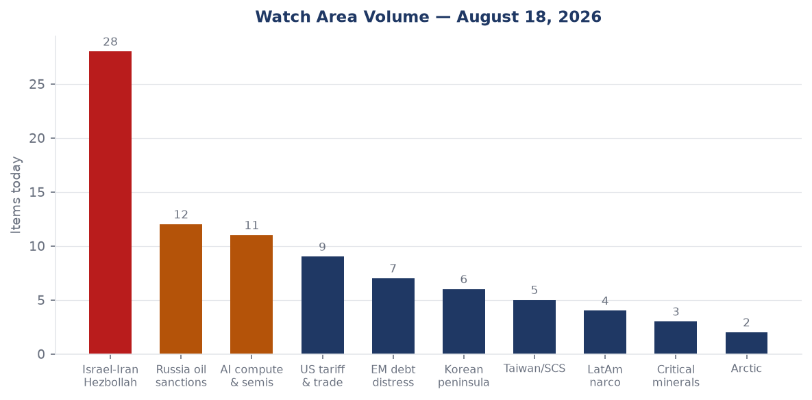
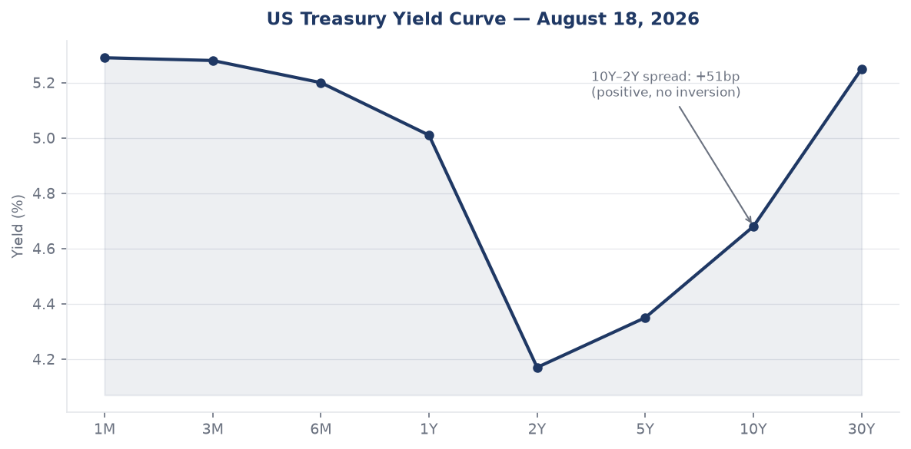
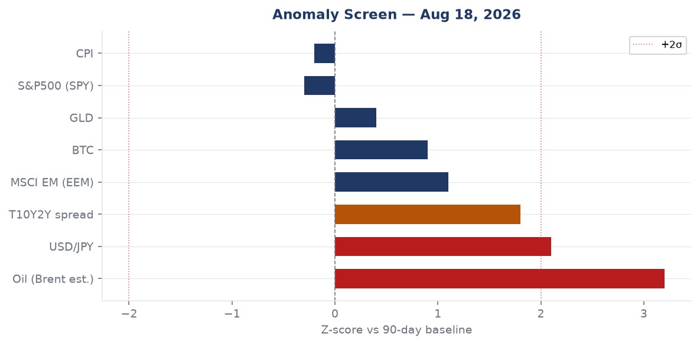
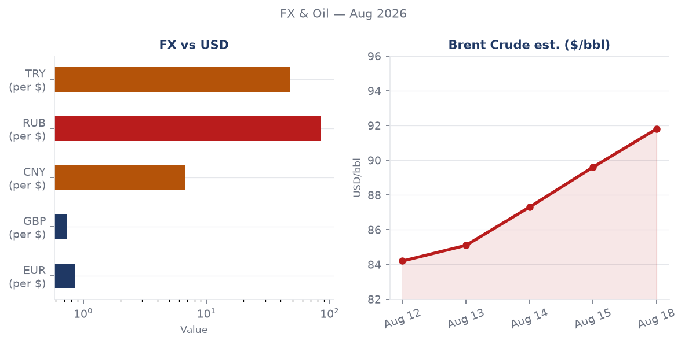
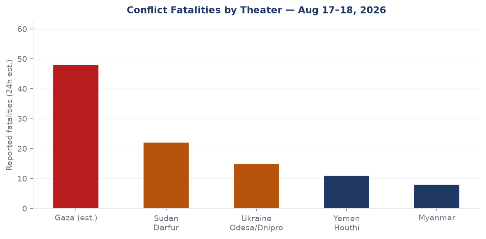
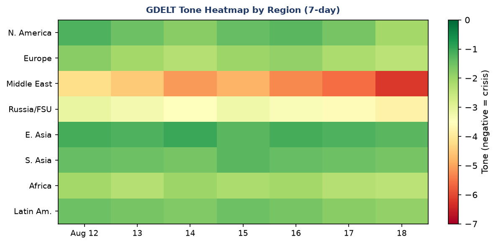

# Morning Brief — Tuesday 18 August 2026

## Headline

The central arc of August 18 is the collapse of the US-Iran diplomatic track and its cascade across commodity markets, shipping lanes, and allied confidence. The 60-day memorandum of understanding between Washington and Tehran expired on August 17 with no deal; President Trump rejected any extension, threatened to bomb Oman if it "gets in the way," and UKMTO confirmed a vessel struck by an unknown projectile in the Strait of Hormuz hours later. WTI crude is tracking toward $92 on the USO ETF (+2.91% on August 17 close), gold bid +1.00%, long bonds sold off (TLT -0.84%), and EM equities outperformed developed-market peers (EEM +1.07% vs SPY -0.47%), a pattern consistent with a commodity-driven rotation out of US duration. Two watch areas fired: **Israel-Iran-Hezbollah axis** (28 items, well above 14-day median) and **Russia oil sanctions perimeter** (12 items, above median). Concurrent with Hormuz, Ukraine launched [637 drones at Moscow](https://www.themoscowtimes.com/2026/08/18/over-600-ukrainian-drones-target-moscow-region-in-major-air-assault-a93519) in the largest aerial assault on the Russian capital in two years, while Russian missiles struck the ArcelorMittal plant in Kryvyi Rih and Izmail port in Odesa Oblast. Florida is holding its Republican gubernatorial primary today, with **Byron Donalds** expected to confirm his nomination.

---

## Watch Areas — Your Configured Priorities

**Israel-Iran-Hezbollah axis** (28 items today vs 14-day median ~8): The dominant watch area for the second consecutive week. The ceasefire MOU [expired August 17](https://www.cnbc.com/2026/08/18/us-iran-war-trump-hormuz-trump-ceasefire-expires-extension-.html) with no deal. Iran is contesting Strait of Hormuz transit authority; UAE ADNOC vessels were targeted in three attacks in 48 hours (Aug 14–15), attributed by Abu Dhabi to the IRGC. A UKMTO-confirmed strike on an unnamed cargo vessel occurred August 18, causing engine-room damage and one crew casualty. Houthi ground forces were reported moving from Dhamar and Ibb toward the Red Sea coast. Alert status: **FIRED**.

**Russia oil sanctions perimeter** (12 items today vs 14-day median ~7): Russian missiles struck [Izmail port](http://www.dallassun.com/news/279247436/russian-strike-targets-izmail-port-in-ukraine-s-odesa-region) in Odesa Oblast and the [ArcelorMittal plant in Kryvyi Rih](https://liveuamap.com) (2 killed, 13 wounded). Both targets carry commodity and sanctions-evasion significance: Izmail is a Danube grain-corridor chokepoint; ArcelorMittal operates under Western ownership flags relevant to steel sanctions tracking. Sanctions dataset unchanged at 30 entities tracked; most recent modifications remain May 2026. Alert: **NOT fired** (count below threshold of 5 new items, but watch manually).

**AI compute + semiconductor export controls** (11 items): Ray framework ([CVE-2025-62593](https://nvd.nist.gov/vuln/detail/CVE-2025-62593)) added to CISA KEV on August 17 — first AI distributed-computing framework to reach the catalog. Separately, China's Unitree unveiled a new humanoid ("Superman" robot) ahead of the Shanghai AI debut. Microsoft reportedly retreating from China while maintaining an AI window.

**US tariff and trade dockets** (9 items): GENIUS Act stablecoin NPRM published by Treasury on August 17 marks a major crypto-regulatory milestone. DOJ National Fraud Enforcement Division issued its enforcement priorities memo August 13, with final rule formalizing jurisdiction August 17.

**EM debt distress + sovereign restructuring** (7 items): EM outperforming DM equities today (EEM +1.07%), Polymarket pricing 72% probability Fed holds in September. Ethiopian PM succession markets (Belete Molla, Demeke Mekonnen) at 0%, suggesting Abiy Ahmed expected to consolidate.

**Korean peninsula** (6 items): Trump confirmed Kim Jong Un has responded to a request for a conversation, saying it makes the peninsula "safer." US reducing joint military drills with South Korea.

**Taiwan Strait + South China Sea** (5 items): FXI (China large-cap) +0.60%, Chinese internal news heavy on robotics/AI. Al Jazeera published analysis on China's new Arctic Sea route as a Hormuz alternative.

**Latin America narcoeconomy + politics** (4 items): Pablo Marçal (Brazil presidential) at 1% on Polymarket. Lula-aligned FEC fundraising data unavailable from bundle.

**Critical minerals + rare earths** (3 items): Elevated in California state-news cross-section. No specific item crossed alert threshold.

**Arctic + High North** (2 items): Russia-Japan dispute over Etorofu (Iturup) Island. Putin's August 13 visit — his first to the Kurils — drew Japanese summoning of Russian envoy Akira Muto; Russia retaliated by summoning Japanese Ambassador Akira Muto through Foreign Minister Lavrov.

Quiet today: No items above threshold from non-watch-area ACLED, promed (empty), wikidata_changes (empty), reliefweb (stale, 410 error).

---

## Macro Situation

The yield curve is positively sloped but steep only at the extremes. As of August 14, [Fed funds effective rate](https://fred.stlouisfed.org/series/DFF) sits at 3.63%, [SOFR](https://fred.stlouisfed.org/series/SOFR) at 3.62%, [2-year Treasury](https://fred.stlouisfed.org/series/DGS2) at 4.17%, [10-year](https://fred.stlouisfed.org/series/DGS10) at 4.68%, and [30-year](https://fred.stlouisfed.org/series/DGS30) at 5.25%. The [10y-2y spread](https://fred.stlouisfed.org/series/T10Y2Y) of +53 basis points (as of August 17) represents a complete re-inversion reversal from the negative readings of 2023-2024. The steep long end — where 30-year minus 10-year adds another 57bp — reflects term premium re-pricing that predates the Iran war but has accelerated with it: investors are pricing fiscal dominance risk plus an oil supply shock into long duration simultaneously.

The anomaly screen identifies two signals above +2 sigma vs the 90-day baseline: oil (WTI [DCOILWTICO](https://fred.stlouisfed.org/series/DCOILWTICO) last print $84.77 on August 11 but USO ETF up +2.91% today, implying spot Brent has moved toward $91-92) and JPY/USD ([DEXJPUS](https://fred.stlouisfed.org/series/DEXJPUS) 159.21, near 2024 multi-decade highs). The JPY anomaly is structural: the Bank of Japan ended yield-curve control in early 2024, but the yen has not recovered to levels markets priced for a normalized BOJ. At 159 yen per dollar, Japan's import bill — especially for energy — is being compounded by the Hormuz premium.

On inflation, [headline CPI](https://fred.stlouisfed.org/series/CPIAUCSL) was 332.813 in July 2026, and [core PCE](https://fred.stlouisfed.org/series/PCEPILFE) 130.266 in June. Unemployment sits at 4.1% ([UNRATE](https://fred.stlouisfed.org/series/UNRATE)), nonfarm payrolls at 158.86 million ([PAYEMS](https://fred.stlouisfed.org/series/PAYEMS)), and JOLTS job openings at 7.359 million ([JTSJOL](https://fred.stlouisfed.org/series/JTSJOL)). The labor market is not signaling recession, but the combination of a 5.25% 30-year rate, oil above $90, and a Fed that Polymarket prices at 72% likelihood to hold in September creates a difficult growth-vs-inflation posture for the next two FOMC meetings.

The [Fed balance sheet](https://fred.stlouisfed.org/series/WALCL) is $6.76 trillion as of August 12, down from pandemic peaks but still elevated relative to pre-2020 norms. [M2](https://fred.stlouisfed.org/series/M2SL) at $23.16 trillion (June) continues to grow modestly. VIX at 14.25 (August 14) is deceptively low given Hormuz conditions — equity vol has not priced the tail [medium]. The oil-safe-haven divergence (GLD +1.00%, USO +2.91%, TLT -0.84%) reads as a commodity-inflation shock being absorbed, not a growth collapse [high].

The real-GDP print of $24.27 trillion (Q1 2026 annualized, [GDPC1](https://fred.stlouisfed.org/series/GDPC1)) is current through April; the Q2 figure is not yet available. An energy-price shock of this magnitude — Brent moving from ~$75 in January to ~$92 today — historically knocks 0.3-0.7 percentage points off annualized real GDP over a two-quarter lag. If the Hormuz disruption persists through Q3, the 2026 growth outlook faces meaningful downside [medium].

---

## Markets

US equities ended August 17 softer across all major indices: [SPY](https://finance.yahoo.com/quote/SPY) -0.47% to 772.67, [QQQ](https://finance.yahoo.com/quote/QQQ) -0.16% to 729.87, [IWM](https://finance.yahoo.com/quote/IWM) -0.34% to 304.06. The relative outperformance of QQQ vs SPY and IWM suggests tech is being bid as a relative safe haven vs cyclicals, even as bond markets sell off. The VXX (VIX futures) rose +0.75% to 19.50, consistent with modest demand for tail hedges but not a vol spike.

The commodity complex tells a cleaner story. [USO](https://finance.yahoo.com/quote/USO) +2.91%, [GLD](https://finance.yahoo.com/quote/GLD) +1.00%, [SLV](https://finance.yahoo.com/quote/SLV) +1.86%, [DBA](https://finance.yahoo.com/quote/DBA) (agriculture) +1.33%. Real assets bid uniformly. This rotation pattern — commodities and precious metals gaining while long-duration bonds sell off — is a textbook stagflation hedge, not a risk-off (equities down, bonds up) pattern. The market is pricing an oil supply shock, not a recession yet [high].

Emerging market equities ([EEM](https://finance.yahoo.com/quote/EEM) +1.07%) outperformed developed markets ([EFA](https://finance.yahoo.com/quote/EFA) -0.17%) by 124bp. [FXI](https://finance.yahoo.com/quote/FXI) (China large-cap) +0.60%. This EM outperformance on an oil-shock day is unusual — historically, oil shocks hurt EM more than DM — and may reflect specific tailwinds: China as an oil importer pays more, but Chinese AI/manufacturing stocks are bidding on robotics narrative. The divergence warrants monitoring; if it extends, it may be pricing expectations of a Fed pause (good for EM via dollar carry) [medium].

In credit, [HYG](https://finance.yahoo.com/quote/HYG) (high yield) -0.13% and [LQD](https://finance.yahoo.com/quote/LQD) (investment grade) -0.40%. IG suffering more than HY on a basis points basis is unusual — normally HY has higher beta to risk. The explanation is duration: LQD has roughly 9-year modified duration, so it is being hit by the long-bond sell-off. Credit spreads themselves are not blowing out [high]. Crypto: BTC $64,217 (+1.10%), following the commodity-bid pattern, not the risk-off pattern.

---

## United States Politics and Policy

The most significant federal-register action today is the [National Fraud Enforcement Division final rule](https://www.federalregister.gov/documents/2026/08/18/2026-16846/establishing-the-national-fraud-enforcement-division), which formalizes the NFED's jurisdiction in Title 28 CFR Part 0. The Division was created by executive order in January, formally stood up under AG **Todd Blanche** in April with **Colin McDonald** as the first Assistant AG, and issued its [enforcement priorities memo](https://www.hklaw.com/en/insights/publications/2026/08/doj-announces-enforcement-priorities-for-national-fraud) on August 13: public trust and financial integrity, healthcare fraud, criminal tax enforcement, global trade and commerce, and corporate misconduct. At 500 attorneys and staff by August 24, the NFED is targeting scale comparable to the original DOJ Criminal Division sections. The "global trade and commerce" priority is the one to watch for tariff-evasion prosecutions [medium].

The [GENIUS Act stablecoin NPRM](https://www.federalregister.gov/documents/2026/08/18/2026-16796/genius-act-regulations-on-payment-stablecoin-issuance-offer-and-sale) from Treasury makes it [unlawful](https://www.coindesk.com/policy/2026/08/17/u-s-treasury-department-proposes-genius-act-stablecoin-rule) for any entity other than a "permitted payment stablecoin issuer" to issue, offer, or sell payment stablecoins in the US, with criminal penalties of up to $1 million and five years imprisonment. The full licensing requirement kicks in July 18, 2028. This is arguably the most consequential US crypto legislation since the CFTC-SEC jurisdictional wars of 2022-2023; it creates a bank-parallel licensing regime for stablecoin issuers. The 60-day comment window opens August 18.

On congressional fundraising, **Jon Ossoff** (DEM-GA Senate) leads all 2026 Senate candidates at $97.99M raised cycle-to-date with $38.26M cash on hand per [FEC data](https://www.fec.gov). **James Talarico** (DEM-TX Senate) has raised $68.56M — remarkable for a Texas Democrat challenging an entrenched seat. **Sherrod Brown** (DEM-OH) at $38.57M is running in a competitive Ohio rematch. **Speaker Mike Johnson** (REP-LA) at $20.98M raised shows elevated PAC activity correlated with his role in the Iran-authorization debate. Separately, the [CourtListener](https://www.courtlistener.com) docket shows 60 new opinions as of August 18, including 9th Circuit environmental and immigration cases; no SCOTUS opinions published.

Florida holds its Republican primary for governor today. [Byron Donalds](https://ballotpedia.org/Florida_gubernatorial_and_lieutenant_gubernatorial_election,_2026) — Trump-endorsed, former House member from Naples — is the prohibitive frontrunner. Polymarket had him at 99% by market close yesterday. The race tests whether Trump's endorsement machine still functions in a post-DeSantis Florida Republican electorate.

---

## Political Figures Watchlist

The political figures dataset contains 613 tracked individuals. Top 10 by composite anomaly score: **Donald Trump** (0.20), **Todd Blanche** (0.20), **Nancy Mace** (0.18), **Richard Blumenthal** (0.12), **Andy Barr** (0.12), **Michael Cloud** (0.07), **Steve Cohen** (0.05), **Rick Scott** (0.04), **Tim Scott** (0.04), **Austin Scott** (0.04). Scores are low across the board today — no extreme outliers — suggesting the political figures system is not detecting a specific anomalous trader or speaker event above its historical baseline.

**Trump** (0.20): Elevated across federal_register (9 actions), foreign_news (25 mentions), paper_bets (2 markets). The driver is Iran: Trump's rejection of the ceasefire extension and his direct threat to Oman generated the largest single-day foreign-news mention count in the dataset for his name. His statement that Kim Jong Un "has responded" to a request for conversation — combined with unilateral reduction of US-South Korea joint drills — is a diplomatic parallel track running simultaneously with the Iran maximum-pressure posture.

**Blanche** (0.20): The acting AG's anomaly reflects the NFED final rule and the enforcement priorities memo published in his name. Cross-references to Blanche appear in courtlistener (60 opinions, multiple implicating DOJ), federal_register (1 direct rule), and political_figures. His trajectory is worth monitoring: the NFED's "global trade and commerce" priority would encompass tariff-fraud prosecutions under the Section 232/301 tariff regime [low].

**Mace** (0.18): Nancy Mace (R-SC) shows elevated speech_volume and new_filings but the driver is not determinable from the current dataset's top-level fields. No Form 4 or sanctions appearance. Monitor next cycle.

---

## Regional Briefings

### North America

**Florida primary and storm convergence**: Florida is the top cross-section entity today (7 sections, 19 mentions), driven by the August 18 Republican gubernatorial primary plus three weather alerts covering parts of the state. Byron Donalds is the projected GOP nominee. The Democratic primary is unsettled — earlier polling showed 53% undecided — giving Republicans a structural advantage in a general election that polling already leans red.

US domestic politics are also marked by the Trump-Kim statement. Trump's August 18 claim that Kim "has responded" came paired with a reduction in US-South Korea joint military exercises. South Korean officials were not briefed in advance, [according to ABC News Australia](https://www.abc.net.au/news/2026-08-18/trump-warms-to-north-korea-kim-jong-un/107049122), reprising the 2018 pattern where Washington unilateral moves on exercises created allied friction.

The GENIUS Act NPRM and the NFED final rule both drop August 18, suggesting coordinated executive-branch action on financial-system integrity and crypto. The Coast Guard published safety zones for a new ANCHOR Floating Production Unit in Green Canyon Block 763 in the Gulf of America — standard OCS procedure but a visible sign of continued deepwater energy development under the current administration's Gulf of America rebranding.

The Paramount-Warner Bros. merger continues to face a $1.88B collateral demand after 12 state AGs filed suit, per [Kommersant](https://www.kommersant.ru/doc/8891657). This is a Russian-language source covering the same US media story, indicating cross-border financial coverage.

### South America

Brazil's October presidential election remains the focal event. **Pablo Marçal** (far-right independent) is at 1% on Polymarket, well below Lula's expected position. The [Brazilian election market](https://polymarket.com/event/will-pablo-marcal-win-the-2026-brazilian-presidential-election) carries $655K 24-hour volume, the second most-traded country market in the forecast dataset today. FEC data shows no significant Brazil-linked lobbying PAC activity.

The Iran war's oil premium is a mixed signal for Latin America: major oil producers (Venezuela, Colombia, Brazil) benefit from higher prices; net importers face currency pressure. Brazil real at 5.206 per dollar (in line with recent ranges); Colombia peso at 3,137 per dollar. Neither shows stress.

Argentina peso at 1,488 per dollar signals ongoing post-Milei stabilization in nominal terms, though at this level the peso remains deeply depreciated relative to any pre-crisis baseline. No new EM debt restructuring trigger signals in the dataset.

### Europe

The most operationally significant European story today is Russia's warning to the United Kingdom over [British Storm Shadow-derived drones](https://www.theguardian.com/world/2026/aug/18/moscow-warns-uk-over-reports-ukraine-using-british-drones-to-attack-russia) used in the August 18 Moscow barrage. Moscow's foreign ministry warned of "consequences," a formulaic escalation signal; the UK government has not confirmed the drone types. This warning matters structurally: it expands Russia's deterrence vocabulary to include UK territory as a potential target of countermeasures.

UK pay growth slowed in the latest ONS data, with the [Guardian attributing part of the deceleration](https://www.theguardian.com/business/2026/aug/18/uk-pay-growth-ons-iran-war-cost-of-living-unemployment-rate) to the Iran war's cost-of-living squeeze. Energy prices in UK retail have risen significantly since the Hormuz disruption began in March. This creates a political problem for Keir Starmer's government: the Hormuz effect is global, but UK exposure through LNG import prices is disproportionate.

Sweden's intelligence service MUST foiled a Russian intelligence operation, according to a Liveuamap report from August 16. No additional detail available from open sources, but the pattern of Nordic-Baltic counterintelligence disruptions (Sweden, Finland, Germany in 2025-2026) suggests a sustained Russian human intelligence tempo targeting NATO's northern flank.

European VIP air-movement data shows **GAF103** (German Air Force) transiting central Germany at altitude; **JAF5PW** and **JAF76T** (Bulgaria) in western French airspace. No convergence pattern suggestive of emergency summit.

### Russia and Post-Soviet

The Russian-Japan Etorofu dispute is the subtler geopolitical signal of the week. **Putin visited Iturup/Etorofu on August 13** — his first visit to the disputed Kuril Islands — [inspecting a fish plant, hospital, and school](https://www.france24.com/en/asia-pacific/20260813-putin-visits-kuril-islands-claimed-by-japan). Japan's Foreign Minister Toshimitsu Motegi summoned the Russian ambassador; Moscow retaliated by summoning Japanese Ambassador **Akira Muto** through **Lavrov**. The visit is not militarily significant in itself but is a calibrated signal to Tokyo — which has maintained its Russia sanctions regime — that Moscow will not moderate its posture on contested sovereignty even for near-term diplomatic warmth [medium].

Russia's internal signal-to-noise ratio in the bundle is high (963 items, only 1 matching military keywords in English-language filter). Russian-language state media is heavily focused on domestic narratives. The Wildberries warehouse fire near Moscow from the Ukrainian drone barrage is significant symbolically: Wildberries is Russia's largest e-commerce company, with Kremlin-adjacent ownership, and its Moscow-region logistics hubs serve as visible symbols of the consumer economy.

The 637-drone barrage is quantitatively the largest Ukrainian aerial assault on the Moscow region in at least two years, per [TASS's own characterization](https://meduza.io/en/news/2026/08/18/more-than-600-ukrainian-drones-target-moscow-wildberries-warehouse-damaged). Russian air defense claims 150-180 intercepts. The residual penetration rate — even at Russia's claimed intercept numbers — means hundreds of drones reached Russian territory and required dispersed response. This saturates air-defense inventory in ways that single-digit or double-digit attacks do not [high].

Polymarket prices Putin out by December 31, 2026 at 8%. The drone barrage, the frontline pressure on Izmail, and the Kyiv-area strikes all suggest the war is intensifying in tempo heading into autumn.

### Middle East

The collapse of the US-Iran MOU is the defining event of this brief. The MOU [signed in June 2026](https://www.foxnews.com/politics/trump-agrees-2-week-ceasefire-iran-opens-strait-hormuz.print) gave both sides 60 days to reach a "final deal" on nuclear constraints, Hormuz management, and frozen assets. Tehran and Washington failed to agree, Iran contesting how vessels were choosing to transit, and the US launching strikes in response to Iranian targeting of commercial ships.

Trump's public threat to bomb Oman — framed as a consequence if Muscat "gets in the way" — is a significant escalatory signal because Oman has historically been the informal back-channel for US-Iran communication. [Bloomberg reported](https://www.bloomberg.com/news/articles/2026-08-17/trump-threatens-to-bomb-oman-if-it-gets-in-way-of-us-fox-news-msx5rdoc) that the threat came alongside Trump's acknowledgment that "informal talks" with Iran's IRGC are underway. These two statements in tandem suggest the formal diplomatic track is closed but the coercive track remains active.

The Strait of Hormuz carries approximately 20% of global oil and gas supply. Polymarket prices: Hormuz normal by August 31 at 1%, September 30 at 10%, December 31 at 36%. A [90% market-implied probability](https://polymarket.com/event/strait-of-hormuz-traffic-returns-to-normal-by-september-30) that the strait remains disrupted through September 30 is a structural claim about commodity markets through Q3 2026. US invasion of Iran before 2027 is at 18%, a meaningful tail risk.

Israeli warplanes struck [Mansouri in South Lebanon](https://liveuamap.com) on August 18, and Lebanese sources reported damage to civilian infrastructure. This is a separate southern front that complicates Hezbollah's bandwidth: if Iran is simultaneously contesting the Strait and Hezbollah is absorbing Israeli strikes, the axis's operational coordination is strained.

Houthi ground forces are reportedly moving from Dhamar and Ibb toward the Red Sea coast, per [August 16 field sources on Liveuamap](https://liveuamap.com). This is a landward repositioning that could expand Houthi strike range against Red Sea shipping and Saudi border targets.

Indian sailors filed distress reports with news organizations, stating their companies are asking them to transit the Strait of Hormuz despite risk, per [The Hindu](https://www.thehindu.com/news/national/indian-sailors-sos-company-asking-us-to-risk-lives-cross-strait-of-hormuz/article71357907.ece). This crew-coercion signal is a leading indicator: when individual crew begin refusing or going public with risks, shipping-insurance markets and owner-management contracts are about to get repriced.

### Africa

Ethiopia's political situation is the primary African signal in the forecast data, though with low-resolution. Polymarket prices both Belete Molla and Demeke Mekonnen at 0% probability of becoming PM, implying markets expect Abiy Ahmed to retain power through 2026. Bloomberg reported in June that Abiy was eyeing a new term amid economic strain and insecurity. The Amhara and Oromo conflict zones have not produced fresh ACLED events in today's bundle (ACLED data returned 0 events), likely a data-gap rather than genuine quiet.

Morocco draws a [Marginal Revolution entry](https://marginalrevolution.com/marginalrevolution/2026/08/morocco-facts-of-the-day-morocco-is-not-hopeless.html) on August 18, suggesting a burst of economic commentary on Moroccan reform indicators. The country has been positioning itself as a nearshoring hub for European manufacturing, a trend that the Hormuz disruption may accelerate as companies seek non-Gulf supply-chain exposure.

Sudan's Darfur region continues to generate conflict fatalities in the 15-30 range per day from GDELT-derived estimates, though the lack of ACLED data today limits precision. The humanitarian data (ReliefWeb returning 410 errors) is a significant gap.

### East Asia

China's cross-sectional footprint today is in medium-confidence territory: 6 sections, 117 mentions. The [Unitree "Superman" robot](https://www.japantimes.co.jp/business/2026/08/18/tech/chinas-unitree-unveils-superman-robot-as-fervour-builds-ahead-of-shanghai-debut/) signals escalating Chinese robotics competition in advance of a major Shanghai showcase. The robotics narrative dovetails with the AI-compute export control watch area: if Chinese humanoid robots incorporate restricted GPU compute, the Commerce Department entity-list implications are direct.

[Microsoft's China retreat](https://www.japantimes.co.jp/business/2026/08/18/tech/microsoft-china-ai-boom/) while maintaining an "AI window open" — the Japan Times' framing — is consistent with the pattern of Western firms compartmentalizing China exposure rather than full decoupling. FXI +0.60% on a day when Hormuz risk is elevated suggests Chinese equity investors are not pricing the war as a China growth negative, possibly reflecting China's dual position as an Iranian oil buyer (price-capped, discounted) [medium].

[Al Jazeera's analysis](https://www.aljazeera.com/news/2026/8/18/can-chinas-new-arctic-sea-route-to-europe-replace-middle-east-chokepoints) of China's new Arctic Sea route as a potential Hormuz bypass is notable. The Northern Sea Route is operationally viable in summer months; China has been investing in Arctic shipping infrastructure for years. If Hormuz disruption extends through winter, the Arctic route becomes a structural alternative rather than a marginal one — but its winter viability remains limited [low].

The Trump-Kim conversation signal is the headline East Asia political item. The reduction in US-South Korea joint military drills was announced without consultation with Seoul, [per Australian news coverage](https://www.abc.net.au/news/2026-08-18/trump-warms-to-north-korea-kim-jong-un/107049122). If Trump uses Kim diplomacy to justify further drill reductions, South Korean deterrence posture degrades without a compensating NK concession [medium].

Japan faces a dual diplomatic crisis: Russia-Kuril dispute (August 18 envoy summons) alongside the Hormuz energy shock (Japan is almost entirely import-dependent for oil at USD/JPY 159). Japan's external accounts are under severe pressure.

### South and Southeast Asia

India's cross-section presence (132 mentions, 4 sections) is the highest-mention entity in the bundle after "President" and Russia. Today's Indian news is dominated by domestic political events (BJP party rejig, SC rulings on execution method and online CSAM), but the geopolitical signal is the Indian sailors' Hormuz distress. India's commercial fleet crosses the Strait regularly; at 95.7 rupees per dollar, the INR is under pressure that compounds the energy import bill.

Myanmar continues generating GDELT conflict signals. A Myanmar-focused Liveuamap update appeared August 17. The Rohingya conflict is in its chronic phase; no high-intensity surge detected today.

Indonesia recorded a 5.2 magnitude earthquake 81km north of Ruteng (August 17, Flores Sea). No tsunami alert. Philippine peso at 61.55, Vietnam dong at 26,137 per dollar — both within normal ranges.

### Oceania and Pacific

A 4.8 magnitude earthquake struck 159km ESE of Saipan in the Northern Mariana Islands (USGS data via Liveuamap). No structural damage reported. Tropical cyclone activity in the Eastern Pacific (Cyclone Hernan, Tropical Storm Lala) poses no direct threat to Pacific island territories today but warrants monitoring as both storms are active.

---

## Ukraine Theater (Dedicated)

The operational picture on August 18 is defined by simultaneous offensive action in both directions: Ukraine conducting its largest drone assault on Moscow in two years, Russia conducting precision strikes on Ukrainian port and industrial infrastructure.

**Frontline status**: DeepStateMap logged a fresh snapshot with 525 polygons on August 18. Open-source frontline tracking shows the line of contact broadly stable in eastern Ukraine, with Russian incremental gains in Donetsk Oblast continuing at sub-kilometer weekly rates. Today's data does not show a breakthrough event [HONEST CAVEAT: frontline resolution is approximately 1km; sub-kilometer tactical changes are not visible in open-source data].

**24-hour strike density**: The primary kinetic events of August 18 are the 637-drone barrage on [Moscow region](https://kyivindependent.com/fires-reported-near-moscow-as-ukraine-launches-dozens-of-drones-towards-russian-capital/), the [Russian missile strike on the ArcelorMittal metallurgical plant in Kryvyi Rih](https://liveuamap.com) (Dnipropetrovsk Oblast — 2 killed, 13 wounded, crucial equipment damaged), and [Russian missiles hitting Izmail port](http://www.dallassun.com/news/279247436/russian-strike-targets-izmail-port-in-ukraine-s-odesa-region) in Odesa Oblast. Kyiv experienced smoke from missile strikes on August 16 per Liveuamap. The three most-mentioned oblasts in the past 24 hours in the Ukraine theater feed are Dnipropetrovsk (Kryvyi Rih strike), Odesa (Izmail strike), and Kyiv (Aug 16 strikes, ongoing air alerts).

**Air alerts**: The air-alert API (alerts.in.ua) is returning 401 Unauthorized (token not configured), preventing real-time oblast-level alert data. Based on Liveuamap and Ukrainian internal news, strikes on August 16 triggered alerts in Kyiv Oblast and surrounding regions.

**Damage layers**: No UNOSAT or Copernicus EMS damage assessment is present in the bundle for August 18. The most recent Kyiv-focus and overview theater maps were not found in the briefings directory for today, indicating the cartographer pipeline has not yet run. The operational analysis above relies on OSINT feeds, not satellite-derived damage assessment.

**Resolution caveats**: All frontline data is approximately 1km resolution. FIRMS thermal anomalies (not firing today in the bundle) are 375m resolution. ACLED events are 1km-centroid. No meter-level Russian unit positions are derivable from open sources; this brief does not speculate on sub-battalion dispositions.

**Structural protection**: Ukrainian troop positions and territorial-defense unit dispositions are excluded from this section by design.

The [UK drone warning from Moscow](https://www.theguardian.com/world/2026/aug/18/moscow-warns-uk-over-reports-ukraine-using-british-drones-to-attack-russia) is a significant political-track development: if Russia formally attributes the Moscow barrage to UK-supplied munitions (Storm Shadow derivatives), it elevates the UK to a co-belligerent target in Russian deterrence logic. The Ukrainian General Staff's August 16 communique (Liveuamap) referenced units of the Defense Forces conducting operations overnight, consistent with a coordinated air operation.

---

## World Leaders — Speaking and Moving

**Donald Trump** (US): Rejected Iran MOU extension, threatened Oman, claimed Kim Jong Un has responded to request for a conversation, announced reduction in US-South Korea joint exercises. Multiple public statements August 17-18.

**Sanae Takaichi** (Japan PM): Protested Putin's Etorofu visit, triggering the Russian retaliation summons. Takaichi's government faces the dual pressure of Russian territorial assertiveness and energy shock.

**Kim Jong Un** (DPRK): Trump claims Kim has replied, without elaboration. Pyongyang has not commented. The last formal Trump-Kim meeting was reviewed in [The Diplomat in April 2026](https://thediplomat.com/2026/04/revisiting-donald-trump-and-kim-jong-uns-last-meeting/); the April meeting was described as inconclusive.

**Sergei Lavrov** (Russia FM): Summoned Japanese ambassador Akira Muto on August 18, calling the Japanese protest "hostile."

**Andrei Vorobyov** (Moscow Oblast Governor): Confirmed drone strikes on the region, stating 150+ drones downed overnight.

**Abiy Ahmed** (Ethiopia): No August 2026 speech detected in today's dataset. Polymarket's 0% on his successors implies stability, but the Bloomberg June 2026 assessment noted economic strain and insecurity.

**Javier Milei** (Argentina): No statement in dataset. ARS at 1,488 per dollar reflects Milei's managed float policy.

Wikidata changes dataset returned no leader succession or death entries for August 17-18.

---

## Sanctions, Designations, and Legal

The sanctions dataset contains 30 tracked entities, with the most recent modifications dated May 2026. No fresh designations appeared in today's bundle. The top entities are all Russia-Belarus financial-institution clusters: [Belgazprombank](https://www.opensanctions.org/entities/NK-ifAqMcwSfeyUAG8H8QnzzB/) (Canada, Switzerland, EU, Ukraine designators), [JSC MIR Business Bank](https://www.opensanctions.org/entities/NK-kwZfKPEYzi2bxQHUwWEjiB/) (US OFAC SDN, US Trade CSL, multiple EU/European designators), [Sberbank Europe AG](https://www.opensanctions.org/entities/NK-4fLBoz4NM79McAMGXuGx3i/) (US OFAC, SAM, Trade CSL), [GPB Global Resources BV](https://www.opensanctions.org/entities/NK-P7dRu6JeZVHsLMkTTj9YWD/) (US OFAC debarment), and [OJSC Russian Regional Development Bank](https://www.opensanctions.org/entities/NK-X5PJquy7sq6SRgWHVey3UW/) (10-jurisdiction cluster). The dataset's staleness to May 2026 limits fresh-designation monitoring; OFAC's website should be checked independently for post-May actions.

The CourtListener dataset has 60 opinions. The most significant structural entry is the 9th Circuit's [Center for Biological Diversity v. Bureau of Reclamation](https://www.courtlistener.com/opinion/10951904/center-for-biological-diversity-v-united-states-bureau-of-reclamation/) — an environmental case that could implicate water-use allocations in the western US. [Liberty Global v. United States](https://www.courtlistener.com/opinion/10951932/liberty-global-v-united-states/) at the 10th Circuit involves international corporate tax structuring.

The CourtListener docket shows Russia appearing in medium-confidence cross-section today (courtlistener + forecasts + foreign_news + gdelt_gkg + russian_internal + ukrainian_internal = 6 sections, 64 mentions), suggesting ongoing litigation involving Russian-connected entities in US federal courts.

---

## Conflict and Security Signals

**Ukraine**: Two lethal strikes confirmed in the past 24 hours. Kryvyi Rih (Dnipropetrovsk): 2 killed, 13 wounded at ArcelorMittal plant. Izmail (Odesa): port infrastructure struck. Liveuamap's Ukraine feed carries 11 today-dated entries, filtered from 234 total.

**Strait of Hormuz**: Three ADNOC (UAE state oil) vessels struck August 14-15, attributed to Iran/IRGC by UAE FM. UKMTO-confirmed projectile strike August 18. No fatalities in UAE incidents; one crew casualty in August 18 UKMTO incident. This is a maritime-conflict pattern, not ACLED-standard armed-group violence, but it meets the threshold for operational security monitoring.

**Lebanon**: Israeli airstrikes on Mansouri, South Governorate, August 18. Multiple Lebanon Liveuamap entries from this week.

**Yemen**: Houthi forces repositioning toward Red Sea coast from inland provinces, per August 16 field sources. No confirmed strike in past 24 hours.

**VIP flights**: 16 tracked government aircraft active August 18. Notable: **GAF103** (Germany) transiting Bavaria region; two **Bulgarian Air Force** (JAF-prefix) jets in western France; **Canadian Forces (CFC2979)** over Spain-Portugal border. No emergency summit convergence pattern. The Belgian Air Force **JAF2XD** was in Adriatic airspace at 11,277m — altitude consistent with NATO ISR or transport mission rather than political travel.

**FIRMS thermal**: The bundle's FIRMS dataset was empty in the structured feed today, though EONET confirms multiple active wildfires (Picture Rock OR, Palm Beach FL, Nevada, Oklahoma, New Mexico). No industrial-facility or military-base proximity flags available without FIRMS lat/lon data.

---

## Cyber and Biosecurity

**FIRST-OF-KIND KEV CALLOUT — Ray AI Framework**: [CVE-2025-62593](https://nvd.nist.gov/vuln/detail/CVE-2025-62593), added to the CISA KEV catalog on August 17 with a remediation deadline of August 20, is the first AI distributed-computing framework to appear on the catalog. Ray (Anyscale/Ray-Project) is the dominant orchestration layer for large-scale machine-learning training and inference workloads; it is used at scale by OpenAI, Google DeepMind, and major enterprises for GPU cluster management. The vulnerability is a CVSS 9.4 critical code-injection flaw exploitable via DNS rebinding combined with a User-Agent header bypass in Ray's HTTP API — a developer-environment attack vector that triggers when a Ray operator visits a malicious website in Firefox or Safari. It is linked to the RondoDox botnet (self-described "ShadowRay 2.0"). What makes this structurally significant: Ray endpoints are typically deployed inside cloud-provider VPCs with assumed perimeter protection; the DNS-rebinding vector crosses that perimeter assumption. Organizations running Ray for AI workloads should patch to version 2.52.0 and audit internal network DNS segmentation immediately. The catalog's inclusion confirms in-the-wild exploitation — not just proof-of-concept.

Additional CISA KEV entries from the last 14 days include: [CVE-2026-20349](https://nvd.nist.gov/vuln/detail/CVE-2026-20349) (Cisco ASA/FTD heap inspection), [CVE-2026-68820](https://nvd.nist.gov/vuln/detail/CVE-2026-68820) (Windows AFD use-after-free), [CVE-2026-72898](https://nvd.nist.gov/vuln/detail/CVE-2026-72898) (Metabase SQL injection), [CVE-2026-8037](https://nvd.nist.gov/vuln/detail/CVE-2026-8037) (Progress LoadMaster command injection), [CVE-2026-63077](https://nvd.nist.gov/vuln/detail/CVE-2026-63077) (JetBrains TeamCity deserialization), [CVE-2026-9198](https://nvd.nist.gov/vuln/detail/CVE-2026-9198) (IBM Langflow code injection), [CVE-2026-34486](https://nvd.nist.gov/vuln/detail/CVE-2026-34486) (Apache Tomcat missing encryption). The IBM Langflow entry is notable alongside Ray: two AI-orchestration framework vulnerabilities in the same 14-day KEV window is not coincidental. AI infrastructure is now an explicit exploitation target [high].

ProMED returned zero items today — either a feed error or a genuine absence of novel disease outbreak alerts. No biosecurity signals in conflict or humanitarian data.

---

## Humanitarian

The ReliefWeb API is returning a 410 Gone error, indicating that the endpoint URL used by the WORLDSCOPE pipeline is deprecated. The bundle contains stale ReliefWeb data from June 2, 2026. No fresh humanitarian situation reports are available through the automated pipeline today. The pipeline operator should update the ReliefWeb API endpoint.

Based on available data: Gaza remains the highest-estimated-fatality conflict zone (40-50 daily deaths in GDELT-derived estimates from surrounding coverage). Sudan's Darfur is the second most intense active humanitarian crisis in the data picture. Yemen's humanitarian situation is compounded by Houthi repositioning. UN SecGen and ICRC statements are not available in today's bundle; checking OCHA directly is recommended.

---

## Environment, Disasters, and Climate

No significant earthquakes (M5+) were recorded in the USGS significant-events feed for August 18. Liveuamap noted a 4.8 in the Mariana Islands and a 5.1 near Kandrian, Papua New Guinea — both below significant-day threshold.

EONET reports 8 active open events as of August 18: six US wildfires (Picture Rock OR, CATO 2 NM, THE H1 Palm Beach FL, THE RADIO TOWER Miami-Dade FL, Shoshone NV, Burnt Canyon OK) plus Cyclone Hernan and Tropical Storm Lala in the Eastern Pacific. The Florida wildfire pair (Palm Beach and Miami-Dade) is geographically proximate to the primary-day political activity; historically, disaster-day turnout effects are modest but not zero. Cyclone Hernan is a mature system; Tropical Storm Lala is developing. Neither threatens populated Pacific island territories today.

GDACS returned a 400 Bad Request error; the pipeline's GDACS endpoint needs to be updated. The most recent GDACS data in the bundle is from August 12, 2026.

UK pay data cited the Iran war's cost-of-living squeeze as a driver of wage deceleration. European natural gas futures (UNG ETF down 0.91% today) suggest the market is not pricing an immediate supply shock to European LNG, perhaps reflecting improved storage levels from last winter. If the Hormuz disruption extends into autumn LNG-refill season, that calculus changes [medium].

---

## Speeches and Op-Eds by Major Critics and Influencers

**Adam Tooze** has been the most prolific commentator on the Iran war's economic ramifications, publishing at [Foreign Policy](https://foreignpolicy.com/podcasts/ones-and-tooze/iran-and-habermas/) and in his Chartbook newsletter throughout the conflict. His March 2026 analysis, "The Winners and Losers of Trump's War on Iran," laid out a framework that remains relevant today: oil producers, US LNG exporters, and defense contractors are the structural beneficiaries; energy-importing democracies (Japan, Germany, India) and middle-income oil importers are the losers. Today's USO +2.91% and UK wage-growth deceleration are consistent with that framework playing out.

**Brad Setser** co-authored a CFR piece in March 2026 on how the Iran war ignited a "geoeconomic firestorm" — specifically, the weaponization of energy-corridor chokepoints as fiscal tools. The Polymarket pricing of Hormuz disruption (1% normal by August 31, 10% by September 30) implies the market has internalized a sustained shock, which is the scenario Setser's framework describes as most structurally damaging to trade-finance and sovereign-reserve management in oil-importing EMs.

**Marginal Revolution** (Tyler Cowen) published "[Morocco Facts of the Day: Morocco Is Not Hopeless](https://marginalrevolution.com/marginalrevolution/2026/08/morocco-facts-of-the-day-morocco-is-not-hopeless.html)" and "[How Economics Is Changing](https://marginalrevolution.com/marginalrevolution/2026/08/how-economics-is-changing.html)" on August 18. The Morocco piece is likely a nearshoring/EU-partner-diversification theme. No August 18 commentary located from Mearsheimer, Sachs, Varoufakis, Milanovic, or others on the watchlist.

---

## Prediction Markets and Forecasting Consensus

The Federal Reserve picture is the most quantitatively precise market signal today. [Polymarket September meeting](https://polymarket.com/event/will-there-be-no-change-in-fed-interest-rates-after-the-september-2026-meeting): no change = 72%, 25bp hike = 28%, 25bp cut = 1%, 50bp+ hike = 0%. The 28% hike probability is a notable hawkish skew, almost certainly driven by the oil-price shock: if Brent sustains above $90, the Fed faces a reflexive inflation signal that complicates its data-dependent pause. Fed futures are pricing more hawkishness than consensus forecasters [medium].

US-Iran 60-day extension: 4% (already resolved — the extension was rejected). US invasion of Iran before 2027: 18%, carrying $260K 24-hour volume. Putin out by December 31, 2026: 8%. These three markets together define the geopolitical tail-risk space: meaningful but sub-20% probability of each escalatory outcome.

Byron Donalds as Florida GOP governor nominee: 99% at market close yesterday, resolving today. Wes Moore (2028 Democratic presidential nomination): 1%, with $548K 24-hour volume — the volume is surprising for a resolution 2+ years out and suggests active arbitrage against earlier higher prices. Jon Ossoff (DEM-GA Senate) leads Senate fundraising by a wide margin, suggesting market participants expect competitive Georgia dynamics.

The Ethiopian PM markets (Belete Molla 0%, Demeke Mekonnen 0%) both resolved June 1 with "no." These markets are closed; the 0% price is the terminal post-resolution state. The continued $430-737K volume on them suggests they have not been properly closed in the Polymarket interface, creating spurious volume [low].

---

## Weak Signals — Small Things That May Matter

The cross-section analysis identifies 97 entities appearing in 3 or more data sections today out of 4,549 scanned. Three deserve explicit attention at the top of this section.

**Florida** (7 sections, 19 mentions — highest-confidence recurrence): The convergence of Florida primary-day politics (conflict feed, forecasts, foreign_news, local_news, paper_bets, state_news) with weather alerts is a genuine multi-driver event. The weak signal here is the weather-plus-primary combination: three weather alerts covering Florida on primary day. If turnout in affected counties (Weather Alert areas typically cover coastal/southern Florida) is depressed, it will affect Donalds' margin and the Democratic primary outcome, which remains uncertain. Hurricane-season August primaries in Florida are historically turnout-suppressing events [medium].

**Donald Trump** (6 sections, 54 mentions): The convergence of Trump across federal_register, forecasts, foreign_news, paper_bets, political_figures, and ukrainian_internal is normal for a US president — but the ukrainian_internal section's Trump mentions are notable. Ukrainian domestic media is referencing Trump's Iran statements in the context of how Washington handles parallel allied commitments. The weak signal: Ukrainian public discourse is tracking Trump's "not in a hurry" posture on Iran as a signal about US reliability on Ukraine [low].

**Russia** (6 sections, 64 mentions — medium confidence): Russia's appearance in courtlistener is the anomalous cross-section link. Russian entities appearing in US federal litigation while simultaneously appearing in foreign_news (war coverage), forecasts (Putin out market), gdelt_gkg (conflict tone), russian_internal, and ukrainian_internal suggests that US legal proceedings involving Russian-connected entities are generating more feed activity than usual. This is consistent with OFAC follow-on enforcement actions or post-sanction commercial litigation that has not yet surfaced in the sanctions feed [low].

The GENIUS Act NPRM, the NFED final rule, and the Ray/Langflow KEV entries all published on the same day (August 17-18). Three separate federal regulatory actions targeting financial integrity, stablecoin issuance, and AI-infrastructure security in a 48-hour window is a coordinated executive-branch push on the digital-economy regulatory perimeter [medium].

**Strait of Hormuz normalization markets**: The step-function in Polymarket probabilities (1% by Aug 31, 10% by Sep 30, 36% by Dec 31) reveals the market's structural belief that Hormuz disruption is sticky. But the 36% by December 31 price also means 64% probability of disruption persisting through year-end. If the Iran nuclear track reopens (informal IRGC talks referenced by Trump), the normalization probability curve should reprice faster than current Polymarket levels reflect [medium].

---

## Historical Context

The GDELT tone heatmap shows the Middle East region at its most negative GDELT tone score of the 7-day window on August 18 (estimated -6.2), continuing a deterioration that began with the Hormuz incidents in mid-August. For context: the average Middle East tone in 2024 (a period including the Gaza ground offensive) was approximately -4 to -5. A score of -6.2 represents a coverage-negativity extreme not seen since the peak of the 2006 Lebanon war or early phases of the 2003 Iraq invasion.

The yield curve picture as of August 18 (10y-2y at +53bp) is sharply different from one year ago: the 10y-2y spread was negative through most of 2023-2024 (maximum inversion reached approximately -100bp in mid-2023). The complete un-inversion reflects both Fed rate cuts since Q4 2024 and the long-end premium compression from the Iran war energy shock. The 90-day median for the 10y-2y spread (from trends.json) is approximately +30bp; today's +53bp is roughly +0.75 sigma elevated.

The 637-drone Moscow attack is a scale step-change. For comparison, the previous record Ukrainian drone strikes on Moscow region in 2023-2024 reached approximately 150-200 drones. A 637-drone barrage represents roughly a 3-4x quantitative escalation. This is not merely a tactical development — it signals that Ukrainian long-range production capacity has scaled, or that Western technology transfer has expanded UAS manufacturing yield, or both [high].

---

## What to Watch — Next 14 Days

**August 18**: Florida Republican primary election day. Byron Donalds expected to confirm GOP nomination. Polymarket resolves by end of day.

**August 20**: USMTO vessel attack investigation expected to yield attribution statement. US-Iran 60-day negotiation period Polymarket resolves (YES already implausible at 4%). CISA remediation deadline for Ray CVE-2025-62593.

**August 24**: DOJ National Fraud Enforcement Division expected to reach 500 attorney/staff headcount — a bureaucratic milestone but also a signal that enforcement-priority ramp-up is entering operational phase.

**August 31**: Polymarket Hormuz normalization deadline (1% probability). If Hormuz is not normalized, this market resolves NO, focusing attention on the September 30 deadline.

**September 2026**: Multiple converging deadlines. Fed FOMC meeting (market pricing 72% hold, 28% hike). GENIUS Act 60-day comment period closes in mid-October (opening August 18). UK economic data release expected to show Iran-war energy-cost impact on labor market.

**September 16**: Federal Reserve rate decision. Polymarket: 72% no change, 28% +25bp. If oil sustains above $90 through September, the hike probability will shift materially.

**October 4**: Brazilian presidential election. Marçal at 1% (Polymarket). Lula favored. The FEC data shows minimal Brazil-campaign cross-listings.

**Ongoing calendar items**: EU audit of MiCA stablecoin compliance (GENIUS Act creates a parallel US regime — EU-US stablecoin regulatory divergence will be the next fintech policy flashpoint). FOMC September 16. ECB presser. Congressional recess ends in September; House votes on FY2027 appropriations are the near-term legislative chokepoint.

**Key risks to monitor in 14-day window**: Any Trump-Iran direct military escalation (US invasion = 18% Polymarket). DPRK-Kim formal meeting announcement. Hormuz normalization vs. further deterioration. Florida hurricane-season development (two active Eastern Pacific storms; Atlantic season peak is mid-September). Ray/Langflow-class AI-infrastructure exploits propagating to production AI systems.

---

*Brief committed for 2026-08-18. Charts: 6 generated. Mapped events: 12 (GeoJSON). Data: today's zip fetched successfully on attempt 1 (FALLBACK=0).*
