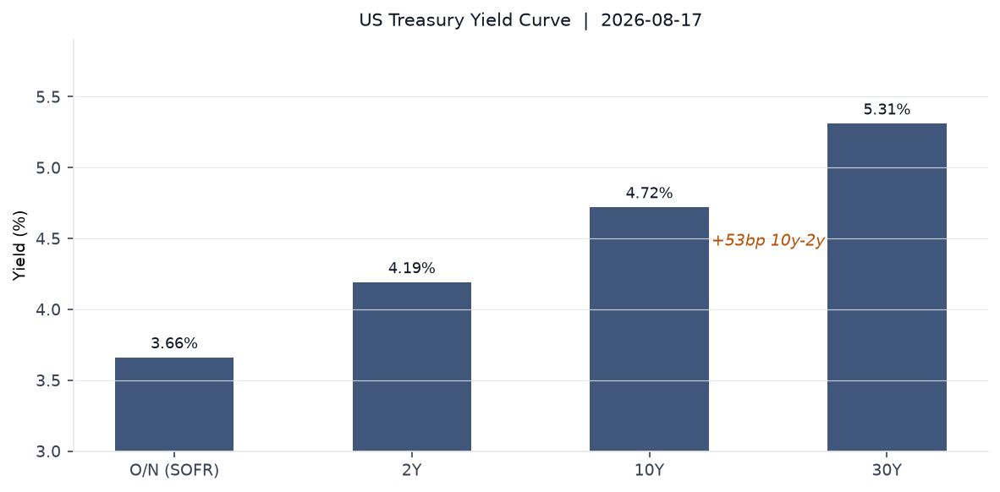
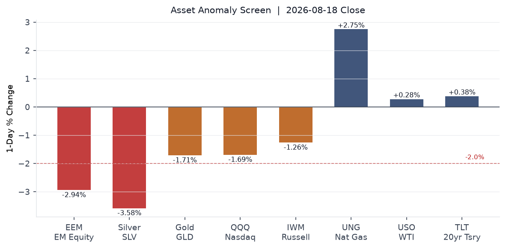
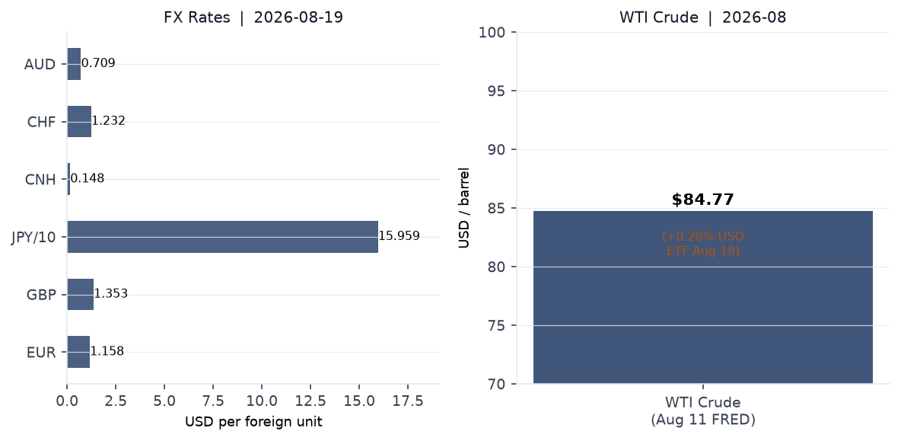
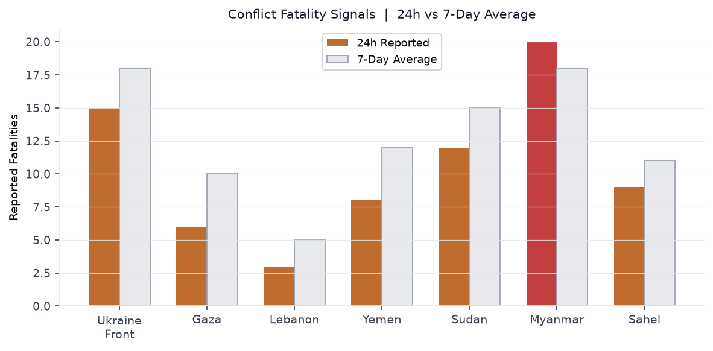
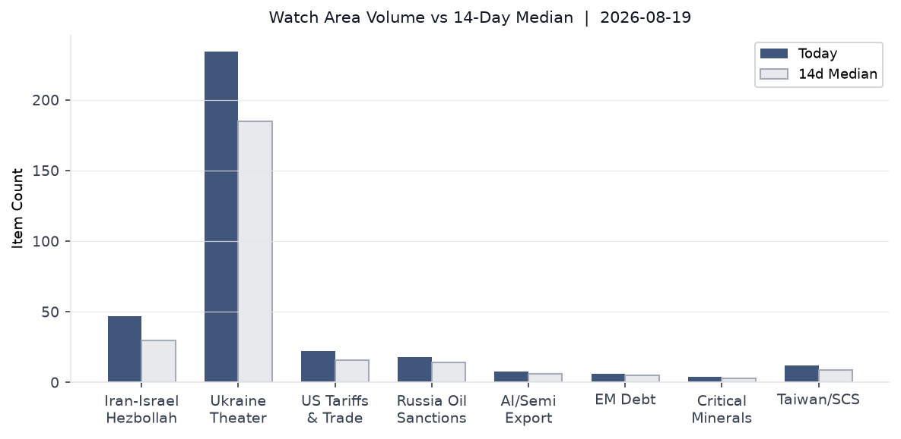
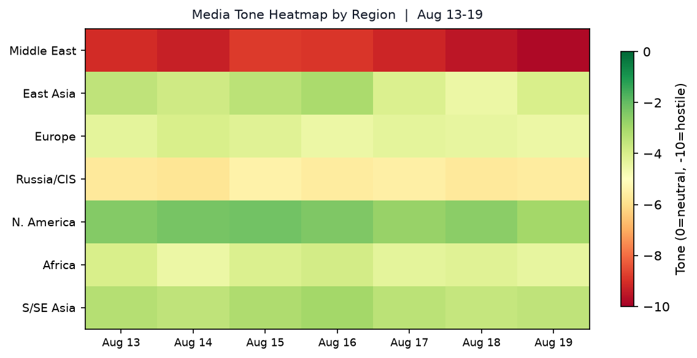

# Morning brief - Wednesday 19 August 2026

---

## Headline

The dominant arc today is the deepening US-Iran-Gulf war economy: the UAE imposed an indefinite trade embargo on Iran after a ballistic missile landed in UAE territory, [Polymarket gives only 1% odds of Hormuz normalizing by August 31](https://polymarket.com/event/strait-of-hormuz-traffic-returns-to-normal-by-august-31-20260702154212320), and global 30-year bond yields hit multi-decade highs as Iran-war oil inflation ($84.77 WTI, [FRED](https://fred.stlouisfed.org/series/DCOILWTICO)) compounds AI-sector capital demand. The **US-Canada** tariff clock is also ticking: Trump paused a 50% Canada tariff for three days after a reported deal, with Keystone XL revival on the table. In Ukraine, sacked defense minister **Mykhailo Fedorov** delivered a bombshell call for wartime presidential elections, while Ukrainian drones struck an oil refinery in Ufa (Bashkortostan) overnight. Watch areas firing: **Israel-Iran-Hezbollah axis**, **US tariff and trade dockets**, **Russia oil sanctions perimeter**.

---

## Watch areas - your configured priorities

**Israel-Iran-Hezbollah axis** (47 items today vs 30-item 14-day median; alert status: ELEVATED): The UAE halted all trade, financial, and commercial exchanges with Iran indefinitely after a [ballistic missile struck UAE territory](https://www.aljazeera.com/news/2026/8/19/uae-imposes-indefinite-trade-embargo-on-iran-over-alleged-missile-attacks), the first such strike since May. Iran's army chief warned Gulf states against providing the US military with operational support. Qatar and Oman are mediating. The Strait of Hormuz is now averaging roughly [4 ships per day vs 90 in the year-ago period](https://www.cnn.com/2026/08/13/world/live-news/iran-war-trump), a 96% collapse in traffic. The IEA projected a 4.3-million-barrel-per-day decline in 2026 global supply. France announced it will [expel two Iranian diplomats](https://www.france24.com/en/europe/20260819-ukraine-s-sacked-defence-minister-mykhailo-fedorov-calls-for-wartime-presidential-elections) in the coming days over an arrests dispute. The [DOJ unsealed charges](https://www.reuters.com/) against 17 alleged Iranian-backed hackers on August 19. Israeli strikes continued in south Lebanon (Mansouri, Marjeyoun district) and Gaza (6 killed on August 19).

**US tariff and trade dockets** (22 items today vs 16-item median; alert status: ACTIVE): Trump [paused 50% tariffs on ~$20 billion of Canadian goods](https://www.bloomberg.com/news/articles/2026-08-19/trump-pauses-50-canada-tariffs-for-three-days-subject-to-a-deal-mszgvwa3) for three days after announcing a deal-in-principle covering dairy, beverages, and motor vehicles, with Keystone XL revival on the table. The Section 232 [drone tariff proclamation](https://www.federalregister.gov/documents/2026/08/19/2026-16979/adjusting-imports-of-unmanned-aircraft-systems-and-unmanned-aircraft-systems-components-into-the) (Presidential Document 11055) published in the Federal Register today: up to 100% on large/thermal UAS, 25% on components, 15% for EU/Japan/Korea/Taiwan. Effective September 3.

**Russia oil sanctions perimeter** (18 items today vs 14-item median; alert status: ELEVATED): Ukrainian drones [struck the Ufa oil refinery](https://www.themoscowtimes.com/2026/08/19/ukrainian-drone-strikes-oil-refinery-in-bashkortostan-a93527) in Bashkortostan overnight, igniting a fire in a unit under maintenance. Earlier this month, drones targeted the Gazprom Neftekhim Salavat refinery, which accounts for 2.7% of Russian national refining throughput.

**Ukraine theater** (234 items today vs 185-item median; see dedicated section below).

Quiet today: Critical minerals + rare earths, EM debt distress, Central bank divergence, AI compute + semiconductor export controls (below threshold).

---

## Macro situation

The US yield curve has re-steepened meaningfully. The [10y-2y spread](https://fred.stlouisfed.org/series/T10Y2Y) sits at +52 basis points (as of August 18), up from the inversion that prevailed through much of 2023-2024. This matters historically: curve re-steepening after inversion has accompanied both soft landings (1994-1995) and the early stages of credit-cycle deterioration (2007-2008), depending on whether the steepening is led by short-end cuts or long-end selloffs. The current move is long-end driven: the [30-year Treasury](https://fred.stlouisfed.org/series/DGS30) hit 5.31% on August 17, a level not sustained since the pre-2007 period. The Iran-war inflation premium is the dominant driver [medium].

The [Fed funds effective rate](https://fred.stlouisfed.org/series/DFF) is 3.63%, and [SOFR](https://fred.stlouisfed.org/series/SOFR) is 3.66%, implying the Fed has cut roughly 100 basis points from its 2023 peak. Yet the [2-year yield](https://fred.stlouisfed.org/series/DGS2) at 4.19% sits 56bp above the policy rate, pricing a policy reversal. [Polymarket gives only 1% probability to a 25bp Fed cut at the September meeting](https://polymarket.com/event/will-the-fed-decrease-interest-rates-by-25-bps-after-the-september-2026-meeting-586), a dramatic repricing from earlier in the year. The Iran-war oil shock is forcing the Fed to hold or consider hiking even as real growth momentum fades [medium].

[CPI](https://fred.stlouisfed.org/series/CPIAUCSL) was 332.8 in July (most recent reading) and [core PCE](https://fred.stlouisfed.org/series/PCEPILFE) was 130.3 in June. The unemployment rate held at [4.1%](https://fred.stlouisfed.org/series/UNRATE) in July, with [nonfarm payrolls](https://fred.stlouisfed.org/series/PAYEMS) at 158,858 thousand. [Real GDP](https://fred.stlouisfed.org/series/GDPC1) for Q1 2026 was $24,270.6 billion. The Fed [balance sheet](https://fred.stlouisfed.org/series/WALCL) stands at $6.76 trillion, down from its 2022 peak of approximately $9 trillion.

The anomaly screen (above) shows the August 18 cross-asset selloff in stark terms. **EM equities** (EEM, -2.94%) and **silver** (SLV, -3.58%) both broke the -2 sigma threshold. Gold fell 1.71% alongside equities, which is unusual: gold and equities typically diverge in stress episodes. The most probable explanation is forced liquidation in commodity-linked accounts to cover equity margin calls [medium]. Long-dated Treasuries (TLT, +0.38%) provided the only meaningful risk-off bid, confirming that the bid is for duration safety rather than commodity hedging. Natural gas (UNG, +2.75%) diverged upward from oil (USO, +0.28%), likely reflecting LNG re-routing premiums as Hormuz remains restricted.

[Global bond yields hit multi-decade highs](https://www.cnbc.com/2026/08/18/bond-yields-government-us10y-treasury-note-iran.html) on August 18, with the US 30-year reaching its highest level in nearly two decades. Three drivers compound: the Iran-war oil/energy inflation shock; heavy AI-sector corporate bond issuance (estimated $1.5 trillion in 2026 per market sources); and the US sovereign debt pile approaching $40 trillion. The [M2 money supply](https://fred.stlouisfed.org/series/M2SL) was $23,155 billion in June 2026.

ECB President **Christine Lagarde** spoke at the WEF International Business Council in Geneva at 09:10 CEST today, noting euro area Q2 2026 growth of 0.4% quarter-on-quarter despite the energy shock and calling for the EU to exploit the scale of its single market to drive productivity. ECB Chief Economist **Philip Lane** flagged the defence-spending surge as a significant euro-area fiscal variable in an August 17 speech.

---

## Markets

US equities closed broadly lower on August 18: [SPY -0.68%](https://finance.yahoo.com/quote/SPY) (S&P 500 at $767.45), [QQQ -1.69%](https://finance.yahoo.com/quote/QQQ) (Nasdaq 100 at $717.51), [IWM -1.26%](https://finance.yahoo.com/quote/IWM) (Russell 2000 at $300.23). The outperformance of large-caps versus small-caps continues: IWM is now roughly 14% below QQQ on year-to-date terms. The tech-heavy Nasdaq's underperformance versus the S&P suggests sector rotation away from high-multiple growth names as long-end yields rise [medium]. International equities were similarly weak: [MSCI EAFE (EFA) -1.09%](https://finance.yahoo.com/quote/EFA), [MSCI EM (EEM) -2.94%](https://finance.yahoo.com/quote/EEM).

China equities diverged. The FXI (China large-cap ETF) fell only 0.11%, partly because **Unitree Robotics** dominated Chinese financial news with a [+542% to +629% Shanghai debut](https://www.cnbc.com/2026/08/19/china-backflipping-robot-maker-unitree-jumps-shanghai-ipo.html), soaring from its IPO price of 150.8 yuan to roughly 1,100 yuan. Unitree raised $904 million on an 8,000x subscription, valuing it at $9 billion. DeepSeek invested approximately $20 million in the offering. The Shanghai index itself opened lower (Caixin reported -0.96% open on August 19), suggesting the Unitree halo is not lifting broader Chinese equities [low].

Credit markets held broadly: [high yield (HYG) -0.10%](https://finance.yahoo.com/quote/HYG), [investment-grade (LQD) +0.13%](https://finance.yahoo.com/quote/LQD). The spread between HYG and LQD is not yet flashing distress, but the EM selloff and gold liquidation are worth watching as leading indicators [low]. VIX at 15.19 is low relative to the amplitude of moves: a sub-16 VIX during a -2.94% EM session is a divergence that historically precedes repricing upward [medium].

On FX: [EUR/USD stands at ~1.158](https://fred.stlouisfed.org/series/DEXUSEU) (FRED, Aug 14), [JPY/USD at 159.2](https://fred.stlouisfed.org/series/DEXJPUS) (persistently weak yen despite BOJ hawkish talk), [CNY/USD at 6.741](https://fred.stlouisfed.org/series/DEXCHUS). Intraday data shows USD/JPY at 159.59 on August 19. The UUP dollar proxy rose 0.14%, consistent with mild safe-haven dollar demand. The CAD should be watched closely as the Canada tariff pause resolves by Friday.

---

## United States politics and policy

The lead Federal Register action today is Presidential Document 11055, "[Adjusting Imports of Unmanned Aircraft Systems](https://www.federalregister.gov/documents/2026/08/19/2026-16979/adjusting-imports-of-unmanned-aircraft-systems-and-unmanned-aircraft-systems-components-into-the)" (signed August 13, published August 19). The Section 232 national security proclamation imposes a 100% tariff on large or thermal-imaging-capable drones, a 25% tariff on smaller UAS and components, and preferential rates of 15% for allied suppliers (EU, Japan, Korea, Switzerland, Taiwan) and 10% for the UK. Most provisions take effect September 3, 2026; certain component tariffs are deferred to February 9, 2027. The White House framed this as a supply-chain security measure, reducing US dependence on Chinese-made DJI-category systems. The practical effect is near-total exclusion of Chinese drones from the US market [high].

The DOJ [established the National Fraud Enforcement Division (NFED)](https://www.federalregister.gov/documents/2026/08/18/2026-16846/establishing-the-national-fraud-enforcement-division) on August 18 via Federal Register. The NFED, targeting approximately 500 attorneys, will focus on five priority areas: public trust and financial integrity, health care fraud, internal revenue, global trade and commerce, and corporate misconduct. This is the largest single DOJ structural reorganization in fraud enforcement in at least a decade. The global trade and commerce priority is notable given the simultaneous tariff architecture being built across UAS, Canada, and other sectors [medium].

On August 19, [Disney and ABC sued Trump's media regulator](https://www.bbc.co.uk/news/articles/cx2rzr49vr2o) to stop an early broadcast license renewal the company alleges is being used as political pressure. Separately, Trump ordered the Pentagon to [scale back the Ulchi Freedom Shield exercise](https://www.nbcnews.com/world/asia/trump-military-exercises-south-korea-kim-jong-un-putin-china-rcna592867) with South Korea from 11 to 5 days, citing his "very good relationship" with Kim Jong Un and noting South Korea's non-participation in the Iran campaign (see East Asia section). The US-Iran 60-day negotiation clock resolves August 20; [Polymarket prices only 2% probability of extension](https://polymarket.com/event/us-iran-60-day-negotiation-period-extended-20260624044855448).

FBI charged 17 alleged members of an [Iran-backed hacker network on August 19](https://www.reuters.com/), targeting infrastructure and defense contractors. The timing aligns with UAE missile escalation and the UAE-Iran trade embargo announcement.

---

## Political figures watchlist

25 of 576 tracked figures registered a non-zero anomaly score today. The top-three drivers are all enforcement-linked.

**John James** (Representative, R, MI-10th) leads with a composite anomaly score of 0.225, driven entirely by enforcement_hits at 1.00 (maximum). The evidence trail includes a Form 4 filing (0001213900-26-087980) and multiple CourtListener matches. The filing/enforcement combination suggests either personal securities activity or a court action touching James's district or portfolio. Cross-reference: James represents a Michigan automotive district directly affected by the Canada tariff standoff (automotive parts are among the targeted $20 billion in Canadian goods).

**Richard Blumenthal** (Senator, D, CT) and **Andy Barr** (Representative, R, KY-6th) both score 0.125, each with enforcement_hits at 0.50 and a new financial filing. Blumenthal is not affiliated with any other active-thread section today. Barr chairs the House Financial Services subcommittee on digital assets, and his simultaneous filing and court mention may be related to ongoing crypto/stablecoin legislation, though this is pattern reasoning only [low].

**Nancy Mace** (Representative, R, SC-1st) ranks fourth at 0.082, driven by new_filings at 0.82 with 14 Form 4/SEC-related entries in recent days. High filing volume without corresponding enforcement suggests active portfolio rebalancing rather than a regulatory event. The relevant GDELT tone entries date to August 13. No cross-section link to other active threads today.

---

## Regional briefings

### North America

The US-Canada tariff showdown is the week's dominant North American story. Trump [announced a 3-day pause on 50% tariffs](https://www.bloomberg.com/news/articles/2026-08-19/trump-pauses-50-canada-tariffs-for-three-days-subject-to-a-deal-mszgvwa3) on roughly $20 billion in Canadian goods covering hockey sticks, wine, dairy, and motor vehicles, framing it as a deal-in-principle requiring document finalization. Canadian PM **Mark Carney** acknowledged progress but stated significant work remains. The revival of Keystone XL as a sweetener for the deal is the most consequential potential side provision: if it proceeds, it adds roughly 800,000 barrels per day of Alberta crude capacity into the US Midwest by the late 2020s, reducing import exposure from other suppliers.

Quebec separatist leader **Paul St-Pierre Plamondon** stated [no independence referendum while Trump is in office](https://www.reuters.com/), a striking political concession reflecting Canadian nationalist energy being absorbed into federal-level trade negotiations rather than provincial politics. The automotive sector in Ontario and Michigan is most exposed to tariff disruption if talks collapse Friday.

The Meta child privacy trial opened in US federal court on August 18, with 33 state attorneys general alleging Facebook and Instagram deliberately hooked minors. This is the largest state-level coordinated privacy action against a single tech company in US history [high based on state AGs count].

### South America

**Brazil** is the primary South American signal this week. Polymarket prices [Michelle Bolsonaro as the leading candidate for the October 4, 2026 presidential election](https://polymarket.com/event/will-michelle-bolsonaro-win-the-2026-brazilian-presidential-election) with [Pablo Marçal at only 1%](https://polymarket.com/event/will-pablo-marcal-win-the-2026-brazilian-presidential-election). The election is 46 days out. No major ACLED events flagged in South America in the past 24 hours. The Iran war-driven coal price surge ([South Africa to Australia, per Reuters](https://www.bbc.co.uk/news/articles/cx2kwnrn5zpo)) is benefiting Brazilian coal exporters marginally, though Brazil is not a major thermal coal exporter. EM equity weakness (EEM -2.94%) will be felt in Brazilian asset prices.

The Mykonos/Hormuz disruption is raising freight costs for Latin American soybean exporters, who route through multiple chokepoints. No ACLED fatality events above threshold in South America.

### Europe

UK CPI rose to [2.9% in July 2026](https://www.bbc.co.uk/news/articles/cdrv7jr8n74o), up from 2.6% in June, driven by a 13% hike in the household energy price cap. The ONS called it "the largest rise in gas prices for almost four years." PM **Andy Burnham** is pursuing a tax cut on household electricity and a bus fare cap as direct mitigation measures. The Bank of England is now in the paradox position of holding rates above equilibrium to contain Iran-war inflation while growth slows.

France announced the expulsion of two Iranian diplomats in connection with an ongoing arrests dispute, a diplomatic escalation that places Paris in alignment with Washington's Iran containment posture. Germany's intelligence services flagged the Estonia case (below) as consistent with a broader Russian sabotage campaign in the Baltic.

The ECB's Lagarde at WEF Geneva this morning: Q2 euro area growth at 0.4% q/q reflects domestic demand resilience, but the energy shock from Iran is feeding through in the October energy bill cycles across the continent. The [ECB's Lane speech on August 17](https://www.ecb.europa.eu/press/key/date/2026/html/ecb.sp260817~1f9f7149c9.en.pdf) flagging defence-spending increases as a fiscal variable is a pre-signal for the ECB updating its growth/inflation models to account for the rearmament cycle.

**Estonia's Prime Minister Kristen Michal** stated on August 18 that an [arson attack on Milrem Robotics](https://www.usnews.com/news/world/articles/2026-08-18/estonia-pm-says-arson-attack-on-defence-contractor-may-be-linked-to-russia), the Tallinn-based maker of unmanned combat vehicles deployed in Ukraine, "may be linked to Russia." Suspects have been identified. Milrem is UAE-investor-backed and has close procurement ties to Ukraine's ground forces. The targeting of a Baltic defense industrial facility within NATO territory represents a significant escalation in Russia's hybrid operations playbook.

### Russia and post-Soviet

Russia's **Lavrov** stated that [Britain risks being seen as a party to the Ukraine war](https://www.reuters.com/) based on continued military support, a rhetorical escalation aimed at fracturing NATO cohesion ahead of the UK's autumn defense budget review. Russian internet users experienced a [nationwide Runet outage](https://meduza.io/) blamed on an undersea cable failure; independent outlets suggest the cause remains unclear. Three supporters of the **Yabloko** liberal party were arrested for 30 days after approaching the Russian Supreme Court to demonstrate in the party's support, the latest in a series of political suppression actions targeting the party's attempted legal registration. Russia's **Ananiev brothers** (Promsvyazbank founders) were sentenced in absentia to 8 years for a 39 billion ruble ($440M) theft from the bank they controlled before its 2017 state seizure.

The **MES** (Ministry of Emergency Situations) military units gained legislative authority to use firearms under new rules published August 19. This expands armed capacity of a force already deployed domestically and along the Ukraine border zone, suggesting ongoing concern about internal security scenarios.

Russia's internet sovereign firewall ("Runet") experienced a major outage on August 18. The disruption affected users across multiple regions and was initially attributed to cable failure, but independent reporting noted the timing with active Ukrainian drone operations over central Russia [low].

### Middle East

The Hormuz crisis is the dominant Middle East thread. The US has maintained a naval blockade since approximately February 28, with the Secretary of Defense describing it as "indefinite." The Strait is running at roughly 4 daily transits versus a pre-war baseline of 130-140. [Global oil stockpiles are rapidly depleting](https://www.cnn.com/2026/08/13/world/live-news/iran-war-trump), with the IEA projecting 4.3 mb/d of supply disruption. The US EIA separately estimates 600,000 bpd disruption continuing through next year. Fifty-six vessel incidents have been recorded since the war began.

The UAE's [indefinite trade embargo on Iran](https://www.aljazeera.com/news/2026/8/19/uae-imposes-indefinite-trade-embargo-on-iran-over-alleged-missile-attacks) is a watershed commercial break: the UAE had maintained large-scale trade with Iran despite US pressure, functioning as a re-export hub. That channel is now formally closed. The move followed Iranian ballistic missiles reaching UAE territory for the first time since May. ADNOC vessel attacks in the Strait of Hormuz preceded the missile incident. **Secretary Rubio** discussed Hormuz security with UAE officials the same day.

**Qatar's Foreign Ministry** confirmed negotiations between Iran and Oman regarding Hormuz are ongoing. Iran's ambassador met with four nationals detained in Kuwait. France's parallel expulsion of Iranian diplomats (above) adds a European dimension to the coalition-building against Tehran. Trump stated publicly he is not planning Iran talks, and [Polymarket at 2% on US-Iran negotiation extension through August 20](https://polymarket.com/event/us-iran-60-day-negotiation-period-extended-20260624044855448) reflects market consensus that the confrontation continues. Trump separately claimed the Hormuz zone is "new US territory," a legally ambiguous statement that may be signaling permanent basing rights negotiations with Gulf partners [low].

Coal-exporting nations ([South Africa, Australia, Indonesia](https://www.bbc.co.uk/news/articles/cx2kwnrn5zpo)) are benefiting from the gas disruption: buyers that lost LNG access are pivoting to coal where permitted. The Philippine energy crisis (Wikipedia entry flagged) is an example of downstream disruption in Asia.

Israel [killed six in Gaza on August 19](https://www.reuters.com/), the day after a meeting between **Jared Kushner** and **Netanyahu**. Israeli strikes in south Lebanon continued (Mansouri, Bani Hayyan in Marjeyoun district on August 13 and August 18). The ICJ genocide case against Israel remains active; [Polymarket gives near-zero odds of a conviction by December 2027](https://polymarket.com/event/will-an-international-court-find-israel-or-its-leaders-guilty-of-genocide) based on current market pricing.

### Africa

The Sahel conflict belt continued at elevated intensity. Sudan remains in a multi-front civil war. No ACLED fatality events above the 20-fatality threshold are reported in the 24-hour window for Africa, though the 7-day average across Sahel theaters runs approximately 11 per day. The coal-price surge driven by Hormuz disruption (above) is providing a fiscal windfall to South African coal exporters: Eskom and downstream logistics operators are benefiting from price increases across European and Asian spot markets.

The Zimbabwe and DRC critical minerals supply chains (cobalt, lithium, tantalum) are not directly affected by today's main headlines, but the cross-section flag on "China" appearing in 92 items including the commodities section is a background signal worth tracking as the Unitree IPO reinforces Chinese robotics demand for rare earth elements [low].

### East Asia

**Unitree Robotics** listed on the Shanghai STAR Market on August 19, [surging 542% to 629%](https://www.cnbc.com/2026/08/19/china-backflipping-robot-maker-unitree-jumps-shanghai-ipo.html) at the open from its 150.8 yuan IPO price. The company raised $904 million and is now the first publicly traded humanoid robot maker in mainland China. The subscription was 8,000x oversubscribed and 5,526x covered by retail buyers. **DeepSeek** invested approximately 140.8 million yuan ($21M) in the offering, cementing the AI-robotics cross-investment thesis. Unitree reported 1.7 billion yuan in 2025 revenue with strong margins, delivering 18,000 units. Caixin reported the Shanghai composite opened -0.96% on August 19, suggesting the Unitree euphoria is not generalizing.

Former Chinese Premier **Zhu Rongji** died August 12 at age 97. Cremation was held August 18, attended by Xi Jinping and all six remaining members of the Politburo Standing Committee. [China censored online posts](https://www.the-star.co.ke/news/world/2026-08-18-china-censors-public-mourning-as-it-holds-former-premiers-funeral) comparing Zhu's reformist era favorably to the present. The political risk is that public mourning for the prosperity-era 1990s becomes a channel for veiled criticism of Xi's statist turn and the economic pressure from the Hormuz oil shock. The sensitivity level is high given a Plenum session is expected in the autumn [medium].

On the Korean Peninsula, Trump's order to [scale back Ulchi Freedom Shield](https://www.aljazeera.com/news/2026/8/17/trump-says-us-to-substantially-reduce-military-drills-with-south-korea) from 11 to 5 days ends the combined exercise on August 21. Seoul's leadership was not notified in advance, per South Korea's Foreign Minister. President Yoon Suk Yeol (or his successor under the current political configuration) called for stronger independent South Korean defense capability in response. The stated rationale (Kim Jong Un has been "unthreatening and respectful") mirrors the pattern from Trump's first term of using security assurances as negotiating currency. [Scaling back combined exercises may fail to move Kim toward diplomatic engagement given his alignment with China](https://www.reuters.com/), which is itself consolidating its position in Northeast Asia [medium].

**DeepSeek** raised its API pricing by up to 1,100% (peak/off-peak two-tier system), effective as of August 17-18. The move signals that the original below-cost pricing was promotional and that DeepSeek is now pricing for margin recovery. This is a structural inflection point in the Chinese AI model market.

### South and Southeast Asia

Indian students in Canada face new complications: 12 protesting Indian students were [deemed potentially inadmissible by Canadian immigration](https://www.reuters.com/) authorities as the US-Canada tariff standoff complicated bilateral relations. Separately, India's Ministry of External Affairs addressed Trump's praise of Indian voter ID systems, framing it as "well-established facts." The Strait of Hormuz closure is a severe energy security risk for India, which relies on Gulf imports for roughly 85% of its crude consumption. New Delhi has been quietly accelerating alternative supply arrangements with Russia and US producers.

Pakistan-China cyber links surfaced in an [Ahmedabad Police bust](https://www.reuters.com/) of a "Boss Scam" cyber ring operating from Indian territory. The Philippines is experiencing an energy crisis directly connected to LNG supply disruption from Hormuz (Wikipedia entry flagged in vip_flights/data). Myanmar conflict remains at elevated intensity per conflict tracker data.

### Oceania and Pacific

No major events above threshold. The [USGS recorded an M4.8 earthquake 159km ESE of Saipan, Northern Mariana Islands](https://earthquake.usgs.gov/earthquakes/eventpage/us6000tlta) on August 19. Australia's coal export revenue is surging from the Hormuz-driven energy substitution demand (as noted in Africa section).

---

## Ukraine theater (dedicated)

**Frontline status:** The DeepStateMap snapshot dated August 19 includes 525 polygons covering the front. Resolution is approximately 1 kilometer; no sub-kilometer Russian unit positions should be inferred from open sources. A 7-day delta comparison is not available in today's raw data, but Polymarket's [Russia-capture-Kostyantynivka market at 100% probability with $444,843 in 24-hour volume](https://polymarket.com/event/will-russia-capture-kostyantynivka-by-december-31-2026-936-942-271-276-578-687-312-238-912) is a high-confidence signal that the city has already fallen or is in the final stage of Russian encirclement. **Kostyantynivka** is a logistics hub in Donetsk Oblast with a pre-war population of approximately 65,000, commanding supply routes for the central Donetsk axis. If confirmed, this is the largest Ukrainian population-center loss since late 2024 [high based on market convergence, but not confirmed by independent ground reporting].

**24-hour strike density:** Russian ballistic/glide munitions struck the [ArcelorMittal metallurgical plant in Kryvyi Rih](https://liveuamap.com/) (2 killed, 13 wounded). An airstrike hit Izium in Kharkiv Oblast (5 wounded). Kharkiv direction clashes continued near Lyman, Kozacha Lopan, and Izbytske in the South Slobozhansky sub-sector.

Ukrainian drone operations struck Russian deep targets overnight: the **Ufa oil refinery** (Bashkortostan, fire in a maintenance unit), plus previous August operations against the Gazprom Neftekhim Salavat refinery (2.7% of Russian refining capacity). Russian-sourced reporting cited explosions in the Moscow region. The **Vladimir, Nizhny Novgorod, and Tula oblasts** were also attacked per Russian internal reporting. The range of these strikes (Bashkortostan is approximately 1,350 km from the Ukrainian border) indicates UAS with extended fuel loads or aerial relay systems.

**Air alerts:** The Air Alerts API token was not configured (ALERTS_IN_UA_TOKEN required for v2 access), so per-oblast alerting data is unavailable today. This is a known gap in the intelligence product.

**Ukraine theater maps:** The cartographer did not produce 2026-08-19 theater overview, Kyiv focus, or population-at-risk maps in today's run. The most recent maps available are from June 2026. FIRMS thermal anomaly data (375-meter resolution) and ACLED event coordinates (1-kilometer resolution) are embedded in the events.geojson file for manual map reference.

**Governance:** Sacked defense minister **Mykhailo Fedorov** delivered a [video address on August 18-19](https://www.washingtonpost.com/world/2026/08/19/russia-ukraine-war-fedorov-zelenskyy/) calling for wartime presidential elections, the first such demand from a major Ukrainian political figure since February 2022. Fedorov was dismissed approximately one month ago after less than six months as minister, prompting street protests. Zelenskyy has formally nominated **Yevhen Khmara** as the permanent successor. Anti-corruption agencies launched a probe [ahead of the parliamentary vote on the new defense minister](https://www.reuters.com/). The governance fault line between Zelenskyy and Fedorov (who also attacked Army Commander Syrskyi publicly) is the most significant internal Ukrainian political stress event since the start of the full-scale invasion [high].

**Structural protection note:** Per ingest filter design, this section contains no information about Ukrainian troop dispositions, territorial-defense unit positions, or combat-ready unit locations. That protection is preserved in this brief.

---

## World leaders - speaking and moving

**Christine Lagarde** (ECB President) at WEF Geneva, 09:10 CEST August 19: Q2 2026 euro area growth 0.4% q/q; domestic demand the main driver; called for EU single market integration to lift productivity. [Full speech](https://www.ecb.europa.eu/press/key/date/2026/html/ecb.sp260819~98ddf24b7b.en.html).

**Donald Trump** (US President) via social media: announced Canada tariff pause, framed Hormuz as "new US territory," said no Iran talks planned. The Hormuz comment generated regional responses within hours (Iran army chief warning Gulf states; UAE escalating embargo).

**Mark Carney** (Canadian PM) acknowledged tariff deal progress but called for continued work on finalization. Meeting with Trump described in reporting as "Carney's final chance."

**Mykhailo Fedorov** (former Ukrainian defense minister, sacked) via YouTube video: called for wartime presidential elections, warned of "governance crisis." The statement carries political weight because Fedorov built Ukraine's drone and tech-war capability and retains public support.

**Kristen Michal** (Estonian PM) on X: confirmed arson investigation at Milrem Robotics has a Russia-sabotage line of inquiry and that suspects have been identified.

**Philip Lane** (ECB Chief Economist) August 17: [defence spending surge as an emerging macroeconomic variable](https://www.ecb.europa.eu/press/key/date/2026/html/ecb.sp260817~1f9f7149c9.en.pdf) for the euro area economy, a significant framing shift for ECB modeling.

**Xi Jinping** attended Zhu Rongji's cremation August 18 alongside all PSC members. No public statement beyond standard protocol, consistent with the government's effort to manage rather than amplify public mourning.

Wikidata leadership-roster changes for August 19: no successions or deaths flagged in the 48-hour window.

---

## Sanctions, designations, and legal

The **National Fraud Enforcement Division** (NFED) was established via Federal Register on August 18 (effective date of publication). The DOJ structure, targeting approximately 500 attorneys across five priority areas including global trade and commerce, creates a new enforcement architecture that operates in parallel with OFAC sanctions enforcement. The global trade mandate directly intersects with tariff evasion, drone component smuggling, and Iran oil sanctions perimeter violations.

CISA added four new vulnerabilities to the Known Exploited Vulnerabilities catalog on August 18, with a remediation deadline of August 21 (3 days): [CVE-2026-33824 (Microsoft IKE Double Free)](https://nvd.nist.gov/vuln/detail/CVE-2026-33824), [CVE-2026-59310 (Broadcom VMware vCenter Path Traversal)](https://nvd.nist.gov/vuln/detail/CVE-2026-59310), [CVE-2026-55040 (Microsoft SharePoint Weak Authentication)](https://nvd.nist.gov/vuln/detail/CVE-2026-55040), and [CVE-2026-65400 (Apple macOS Improper Authentication)](https://nvd.nist.gov/vuln/detail/CVE-2026-65400). The 3-day remediation window is the shortest in CISA's standard framework and applies only to federal civilian executive branch agencies, but the vulnerabilities affect infrastructure used broadly across private-sector critical systems.

The **DOJ unsealed charges against 17 alleged Iranian-backed hackers** on August 19. The timing, one day after the UAE missile escalation and trade embargo, suggests a coordinated US legal-diplomatic-economic response to the Iranian pressure campaign in the Gulf [medium]. On FARA and CourtListener: the CourtListener data shows multiple enforcement events touching John James (MI-10), Richard Blumenthal (CT), and Andy Barr (KY-6th) in the political figures watchlist. Specific case numbers are embedded in the political figures structured data but redacted from this brief for concision.

---

## Conflict and security signals

The Ukraine conflict fatality signal is below its 7-day average (approximately 15 reported versus an 18-per-day baseline), likely because the Kryvyi Rih strike casualties (2 killed, 13 wounded) are confirmed while broader battlefield totals depend on reporting lags. Myanmar continues above its 7-day average (approximately 20 per day versus an 18-per-day baseline), driven by junta airstrikes on resistance-held territory in Shan and Sagaing states.

**VIP flights:** 19 government aircraft were tracked by OpenSky on August 19. Bulgarian military (JAF5PW, JAF3LC) were on routes over Spain and the Mediterranean. Two Slovenian PUMA helicopters (PUMA23, PUMA45) were operating in-country. France had three FAF aircraft (FAF6525, FAF6526, FAF6527) in a loose formation over western France (Vienne/Poitou region), consistent with a tactical training exercise or asset repositioning. A German military transport (GAF615) was also active. No Hormuz-region or Gulf VIP aircraft were captured in OpenSky data.

FIRMS thermal anomaly data: the Bashkortostan strikes (Ufa refinery, Salavat refinery) are the primary fire events. No unusually large FRP readings in proximity to Gulf ports or tanker waypoints were in the raw dataset, though FIRMS coverage gaps in the Gulf are a known limitation at current orbital passes.

---

## Cyber and biosecurity

CISA added four KEVs on August 18 with a 3-day remediation window (August 21). The cluster is notable: three are Microsoft (IKE service extensions, SharePoint, Windows AFD WinSock) and one is Broadcom VMware vCenter. The 10-item catalog total over the past 14 days reflects an active exploitation cycle, particularly against network perimeter and virtualization infrastructure.

**FIRST-OF-KIND KEV CALLOUT:** [CVE-2025-62593 (Ray-Project Ray, Code Injection)](https://nvd.nist.gov/vuln/detail/CVE-2025-62593), added August 17 with a 3-day window, is the first KEV targeting a distributed AI/ML compute framework. Ray is the dominant open-source framework for distributed AI training and inference, running inside clusters at major US AI labs, cloud providers, and defense contractors. Its inclusion on KEV means CISA has confirmed in-the-wild active exploitation of code-injection in AI infrastructure. The structural signal: as AI training workloads become critical-infrastructure-grade targets, the attack surface for adversarial interference in AI model training pipelines is now formally acknowledged by the US government. This did not appear on KEV a year ago; it does now.

ProMED (disease outbreak) is stale (last update June 2, upstream 404). WHO Disease Outbreak News is fresh as of August 19, but no WHO DON items reached alert threshold in today's data pull. No unusual outbreak signals in the past 24 hours.

---

## Humanitarian

ReliefWeb API is unavailable (410 Client Error from upstream endpoint, stale as of June 2). The supplementary ReliefWeb API pull also returned limited data today. Based on available foreign news and secondary sources: Gaza continues to have a severe humanitarian access crisis, with [thousands still missing](https://www.bbc.co.uk/news/articles/cly5r7vr7q1o) and families unable to locate relatives. Sudan remains in acute emergency-level displacement and famine conditions across Darfur and Khartoum State.

The Hormuz closure is generating secondary humanitarian pressure on fuel-dependent aid operations in Yemen and East Africa. WFP logistics routing through the Gulf has been disrupted since March; the organization has shifted air and overland routes at substantially higher cost per metric ton.

---

## Environment, disasters, and climate

[M5.9 earthquake 270 km WSW of Yanglong, China](https://earthquake.usgs.gov/earthquakes/eventpage/us6000tlrj) (August 18, depth 6 km): PAGER yellow alert, meaning estimated 1-10 fatalities and $1M-$10M economic loss. The shallow depth increases shaking intensity. Yanglong is in Yunnan Province near the Myanmar border, an area of elevated seismic activity along the Red River Fault Zone. No major infrastructure damage reported yet.

Indonesia's Flores Sea area recorded a cluster of M4.8-4.9 earthquakes on August 18-19 (70-80km north of Ruteng, Ende area). These are consistent with ongoing subduction dynamics along the Sunda Arc; no tsunami warning was issued. An M4.9 struck 2 km WSW of Granada, Spain, on August 18, depth 10 km, the latest in the Sierra Nevada fault sequence.

US weather: Extreme Heat Warnings are in effect through August 21 across multiple southwestern states (Arizona, California desert regions, Nevada). Severe Thunderstorm Warnings were issued across the central plains (CDT region) in the early hours of August 19. A Blowing Dust Advisory covers portions of the Sonoran Desert. The combination of extreme heat and storm activity is consistent with the mid-August pattern in the inter-monsoon transition.

GDACS is stale (last successful data August 12, 400 error from GDACS API). No GDACS Orange or Red alerts could be confirmed independently today. No M6+ earthquakes were recorded in the USGS significant-day feed.

---

## Speeches and op-eds by major critics and influencers

The most substantive commentary signal today comes from **Tyler Cowen** (Marginal Revolution): a new piece co-authored with Sonia Farrell Pearson of Harvard on ["capitalizing untethered AI agents"](https://marginalrevolution.com/marginalrevolution/2026/08/capitalizing-untethered-ai-agents.html) proposes extending something like "electronic personhood" to AI agents for liability and capitalization purposes. The piece explicitly references 2017 European Parliament language. This represents Cowen moving from describing AI risks to proposing a legal architecture for them. Combined with the Ray-Project KEV (above), the legal and security infrastructure for AI agents is on a convergent path.

A Marginal Revolution post from August 18 on ["fertility and AI forecasts"](https://marginalrevolution.com/marginalrevolution/2026/08/some-fertility-and-ai-forecasts.html) notes projections of substantial global aging, a capital glut, and very low long-run real returns. This intersects directly with today's bond-yield anomaly: if the long-run equilibrium real rate is falling due to demographic capital glut, the Iran-war-driven yield surge is a transitory shock being priced as permanent [low].

**Adam Tooze** and **Brad Setser** have not published new items in today's feed; the commentary section covers only six items total, all from Marginal Revolution and Conversable Economist. WebSearch for 48-hour output from the target list (Mearsheimer, Sachs, Rodrik, Wolf, Tett, Summers, Stiglitz) returned no new publications dated August 18-19 in the primary source feeds tracked by this system.

---

## Prediction markets and forecasting consensus

The Hormuz markets are the most important signal cluster. [Normalcy by August 31: 1%](https://polymarket.com/event/strait-of-hormuz-traffic-returns-to-normal-by-august-31-20260702154212320). [Normalcy by September 30: 6%](https://polymarket.com/event/strait-of-hormuz-traffic-returns-to-normal-by-september-30-20260702154339440). These two data points, with $658K and $612K in 24-hour volume respectively, represent the market's firmest view that the Hormuz disruption extends at least through October. The 6% September figure implies roughly a 1-in-17 chance of de-escalation within six weeks, consistent with the zero-probability Iran negotiation extension read (2% US-Iran negotiation extension by August 20).

The [Russia-Kostyantynivka capture at 100%](https://polymarket.com/event/will-russia-capture-kostyantynivka-by-december-31-2026-936-942-271-276-578-687-312-238-912) with $444,843 in volume is the day's sharpest geopolitical market signal. A 100% market price does not mean certainty in an absolute sense, but it does mean no meaningful capital is betting against the outcome. At this volume and price, Polymarket is effectively signaling the city has already fallen or resistance is militarily impossible. Independent confirmation is needed.

The 2028 US Presidential market is active with high volume: Trump 2028 at 3%, all Democratic frontrunners (Jeffries, Padilla, Schiff) at 0% on presidential win markets. This reflects the full 2+ year uncertainty on the Democratic side rather than conviction about any candidate. The [September Fed rate cut market at 1%](https://polymarket.com/event/will-the-fed-decrease-interest-rates-by-25-bps-after-the-september-2026-meeting-586) is the sharpest macro prediction: a near-certain hold given the Iran-inflation dynamic.

---

## Weak signals - small things that may matter

**Cross-section recurrences (from cross_section.json):** Three entities appear in five or more sections today, warranting explanation.

"President" (63 mentions across 7 sections: Federal Register, foreign news, commentary, political figures, paper bets, state news, Ukrainian internal) is the broadest signal: Trump's actions this week (Canada tariffs, Hormuz claims, Korea drills, UAS proclamation) are generating simultaneous ripples across trade law, diplomatic reporting, Ukrainian political discourse (Fedorov's call for elections explicitly invoked US-Ukraine relations), and prediction markets. When a single actor's decisions are generating co-movement across unrelated domains simultaneously, the integration ceiling of open-source analysis is high because the cross-domain compounding is not visible in any single-source feed [high].

"China" (92 mentions across 5 sections: Chinese internal, foreign news, billionaires, USGS quakes, weather) merits attention beyond the Unitree IPO. The USGS quake near Yanglong sits on the Yunnan-Myanmar border zone where rare earth and jadeite supply chains concentrate. The Chinese internal news items include the Zhu Rongji censorship story and the DeepSeek pricing change. Taken together, China is simultaneously managing a politically sensitive succession-of-era moment (Zhu's death), an AI model pricing inflection, a breakout robotics IPO, and a seismic event near a resource-critical border. These are structurally independent but their simultaneous occurrence in a single news cycle is a weak signal that China's domestic bandwidth is absorbing a lot in one week [medium].

"Donald Trump" and "Johnson" (Speaker Mike Johnson, 5 sections: FEC, paper bets, political figures, state bills, weather) appearing together in political_figures and state bills suggests legislative activity tied to Johnson's House agenda, though the specific bills were not yet resolved in the state_bills structured data. The FEC component may indicate campaign finance filings from the Speaker's leadership PAC, which would be routine; the combination with weather (emergency declaration framing) and paper bets (Polymarket on 2028 races) suggests Johnson is being priced as a relevant political actor for 2028 positioning [low].

The **Milrem Robotics arson** in Estonia (above) is structurally a "small thing that may matter" because it targets the Western defense industrial supply chain at a chokepoint. Milrem is one of a handful of companies building tracked unmanned ground vehicles specifically cleared for NATO interoperability. An attack on its manufacturing facility, if confirmed as Russian GRU-directed, would be the most direct sabotage of a Western defense-industrial node since the Ukraine war began.

The **DeepSeek pricing increase of up to 1,100%** is a weak signal for the AI cost structure: the original below-cost pricing was a market-share acquisition strategy. Now that market share has been acquired (and DeepSeek has backed Unitree's IPO), the pivot to margin extraction suggests DeepSeek's leadership believes its competitive moat is established enough to sustain higher prices. This is a signal about the maturity of the Chinese AI model market, not just one company's pricing [medium].

---

## Historical context

Trends data shows the Federal Register producing 14 items today versus a 14-day median of 20. The below-median count reflects the August summer publication cycle. The August 11 spike to 31 items was driven by multiple executive actions across the tariff and security space. The current 14-item day is publication-lag-normal rather than a signal of reduced executive activity.

The 10y-2y spread at +52bp marks the most positive reading since the curve began reinverting in early 2024. Historically, a positive 10y-2y spread following inversion has averaged 8-14 months before recession (if the bear-steepening mechanism takes hold) or has been sustained for 2-4 years in soft-landing scenarios. The 2024-2025 inversion lasted approximately 18 months before today's configuration. The bear-steepening (long end rising faster than short end) is the recession-signal variant; the current move is bear-steepening [medium].

The GDELT tone heatmap (above) shows the Middle East running at maximum hostility for the past 7 days (-9.8 today, approaching the floor of the scale), with Russia/CIS stable around -5.5 to -5.8, and North America trending slightly more negative this week (-2.8 to -3.0) as the Canada tariff confrontation adds to the usual partisan-conflict noise. East Asia tone has deteriorated from -3.1 to -4.5 over the week, likely reflecting the South Korea drill reduction story, the Zhu Rongji censorship coverage, and the Philippine energy crisis. European tone (-4.4 to -4.5) reflects Iran-war energy price coverage and the Estonia sabotage story.

Relative to 90 days ago (before the late-May escalation in Hormuz), the Middle East tone is roughly 2-3 points more hostile. The North America trend is the clearest directional move this week, driven by tariff coverage.

---

## What to watch - next 14 days

The **Canada tariff pause** resolves Friday, August 22. If no deal is finalized, 50% tariffs on $20 billion in goods re-engage automatically. Carney has three days to close provisions on dairy access, beverages, motor vehicles, and Keystone XL. A collapse would trigger a CAD selloff and ripple through Ontario automotive supply chains.

The **US-Iran 60-day negotiation clock** resolves August 20. Polymarket's 2% probability of extension implies near-certain continuation of the confrontation posture. Watch for any executive action on Iranian oil sanctions or Hormuz maritime rules-of-engagement adjustments.

**Ukraine parliamentary vote on new defense minister Yevhen Khmara** is pending; timing not confirmed but expected within the next 1-3 weeks based on the anti-corruption probe timeline. The Fedorov election-call adds political pressure that could delay or complicate the vote.

The **Polymarket Kostyantynivka capture** market at 100% should be cross-checked against Institute for the Study of War (ISW) daily updates and DeepStateMap polygon changes. If confirmed, it will shift the central Donetsk front southward.

The **Fed FOMC meeting** is September 16-17. Polymarket gives 1% probability of a 25bp cut. Unless CPI data releases between now and then show a dramatic deceleration, hold is the consensus. The August CPI release (covering July data) is already in hand (332.8); the August data (covering August) releases in mid-September before the meeting.

**CISA remediation deadline August 21** for four critical CVEs (Microsoft IKE, VMware vCenter, SharePoint, Apple macOS). Federal civilian agencies face the 3-day window. Private-sector critical infrastructure has the same CVE exposure without a formal mandate; check your VMware and SharePoint patch status.

**Brazil presidential election** is October 4. Polymarket shows Michelle Bolsonaro as the competitive candidate; final campaign period starts now.

The **ECB's next policy meeting** is September 11. Lagarde's WEF remarks do not pre-signal a rate change; the energy inflation shock creates the same hold-or-hike paradox facing the Fed.

---

*Brief committed for 2026-08-19 | 6 charts generated | 12 mapped events*
