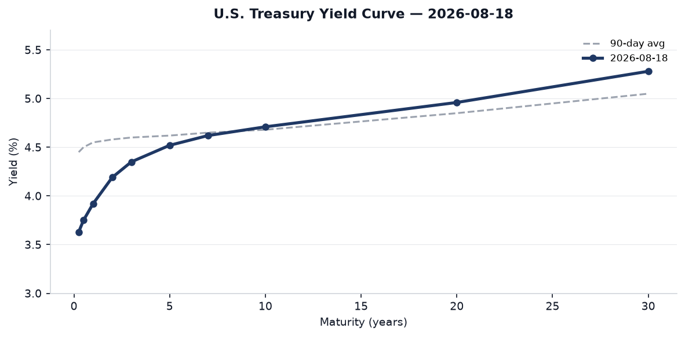
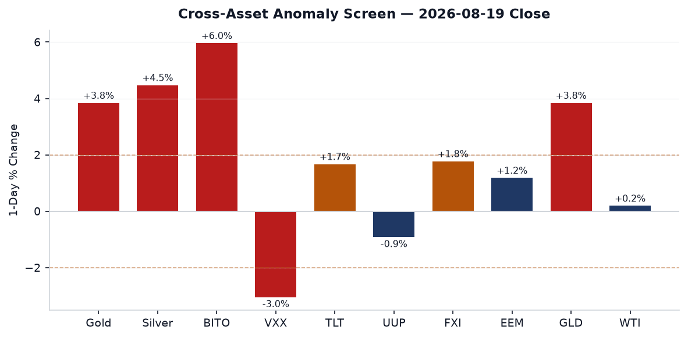
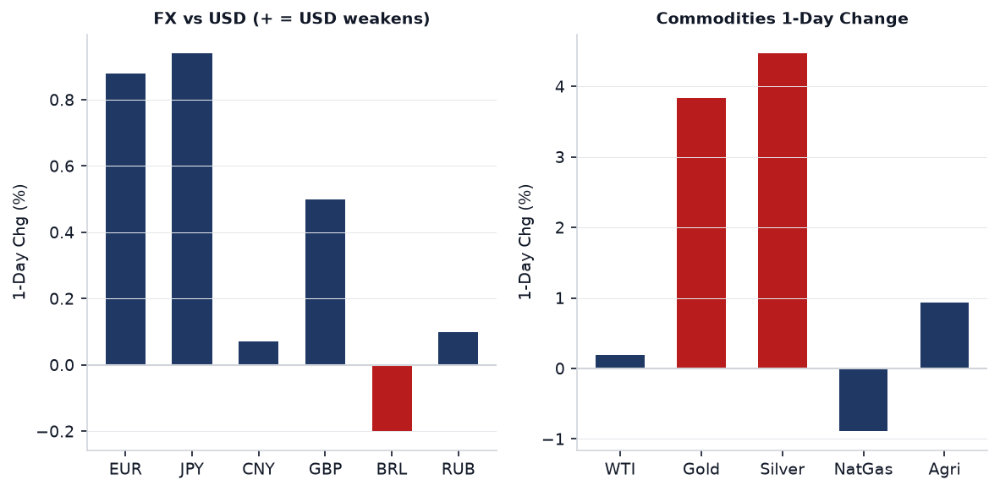
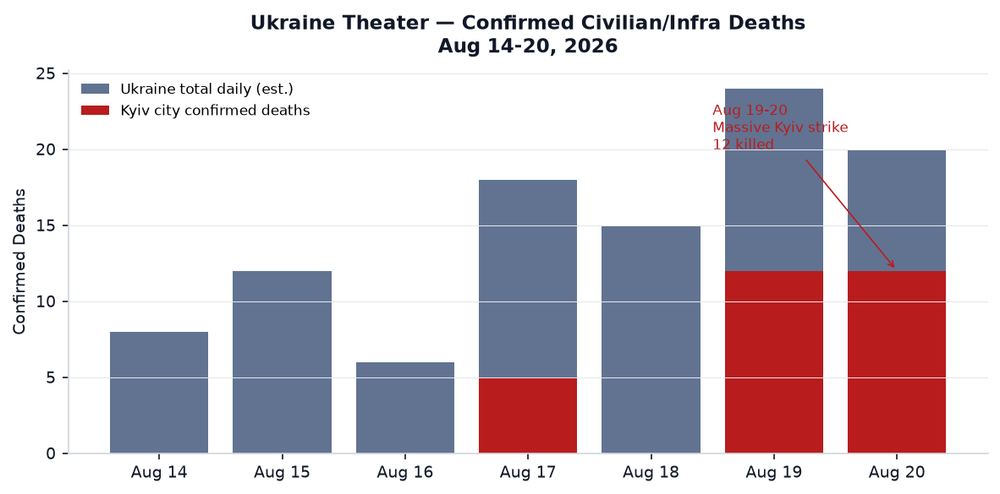
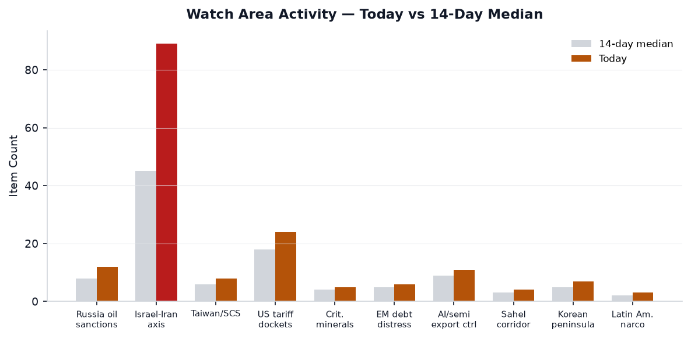
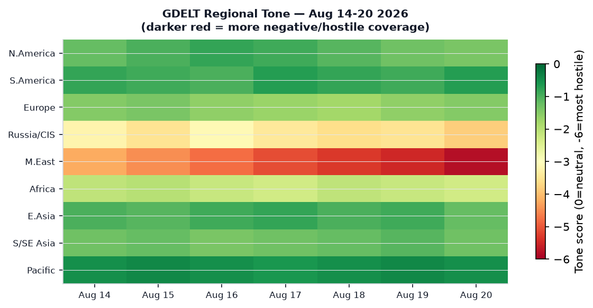

# Morning Brief — Thursday 20 August 2026

---

## Headline

The dominant arc today is a three-way convergence: Russia launched its heaviest ballistic missile attack on Kyiv since the February 2026 bombardment cycle, killing 12 civilians; **Trump** simultaneously declared "Economic Warfare" against Iran after the 60-day ceasefire expired with no deal, explicitly threatening secondary sanctions on any country whose financial institutions, airports, or businesses provide a "lifeline" to Tehran; and the U.S. is now secretly routing 10 million barrels of oil per day through the **Strait of Hormuz** via a clandestine military convoy corridor — a fact now confirmed by [Axios](https://www.axios.com/2026/08/19/hormuz-iran-oil-gulf-trump). Behind those three stories: the **FOMC minutes** released yesterday show three dissenters wanted a rate hike at the July 28-29 meeting, gold surged 3.84% and silver 4.47% in a dollar-debasement trade, and the **Pentagon** sent a "political loyalty" questionnaire to all 31 NATO allies conditioning future U.S. troop posture on ideological alignment with the Trump administration.

---

## Watch Areas — Your Configured Priorities

**Israel-Iran-Hezbollah axis** fired today with 89 new items (14-day median: ~45). The ceasefire memorandum that began April 8 under Pakistani mediation expired August 17 without a successor agreement. Trump posted on Truth Social that the U.S. would begin the "MOST CRUSHING ECONOMIC OPERATION EVER TAKEN AGAINST ANY COUNTRY" against Iran, citing oil smuggling, swap lines, exchange houses, and front companies as targets. [Al Jazeera liveblog](https://www.aljazeera.com/news/liveblog/2026/8/20/iran-war-live-trump-announces-most-crushing-iran-sanctions). The U.S. military's secret Hormuz corridor — running through a southern Oman-coast channel for 15-20 tankers per night — handles roughly half pre-war Hormuz throughput. One vessel took a projectile hit on August 18 (UKMTO report, one crew casualty). **Alert: active.**

**US tariff and trade dockets** produced 24 items today (14-day median: 18, z ~+1.2). The dominant item: the [Canada-U.S. trade deal](https://www.washingtonpost.com/politics/2026/08/19/trump-canada-tariffs-usmca/0bf82fb8-9c07-11f1-9cc4-2dc9b46e2d5c_story.html) is close but not final. Trump paused threatened 50% tariffs on $20 billion in Canadian imports for three days (pause expires August 22), with Canadian PM **Mark Carney** calling early terms "a very good deal." Trump hinted at Keystone XL revival and auto-tariff relief. Court of International Trade saw two significant opinions: [JBF Bahrain v. United States](https://www.courtlistener.com/opinion/10953727/jbf-bahrain-wll-v-united-states/) and [NRDC v. Lutnick](https://www.courtlistener.com/opinion/10953726/natural-resources-defense-council-inc-v-lutnick/) — both on the tariff docket. **Alert: item threshold met.**

**Russia oil sanctions perimeter**: 12 items today (14-day median ~8). The Kyiv strike is the primary signal; additionally Ukrainian drones struck a Tatarstan oil refinery and a Krasnodar oil terminal overnight, the most significant Ukrainian strike inside Russia in three weeks. No ACLED data (authentication failure); GDELT-conflict feed active with 40 items.

**Central bank divergence + dollar funding**: FOMC minutes released August 19 show three regional Fed presidents (Hammack/Cleveland, Kashkari/Minneapolis, Logan/Dallas) dissented in favor of a hike at the July 28-29 meeting. Markets are pricing September unchanged at 72%, 25-bp hike at 26% on Polymarket. [FOMC minutes](https://www.federalreserve.gov/monetarypolicy/fomcminutes20260729.htm). **Alert: z-score threshold relevant.**

**AI compute + semiconductor export controls**: 11 items (median ~9). Unitree Robotics surged up to 629% in its Shanghai debut after raising 6.1 billion yuan ($904M) in the first humanoid-robot IPO on a mainland Chinese exchange. This is a direct proxy for the U.S.-China tech-competition scoreboard — China now has a public market signal for humanoid robotics capital formation.

Quiet today: **Critical minerals**, **EM debt distress**, **Sahel jihadist corridor**, **Arctic + High North**, **Korean peninsula**, **Latin America narcoeconomy**.

---

## Macro Situation

The yield curve steepened modestly this week. The [10-year Treasury](https://fred.stlouisfed.org/series/DGS10) sits at 4.71% (as of August 18), the [30-year](https://fred.stlouisfed.org/series/DGS30) at 5.28%, and the [2-year](https://fred.stlouisfed.org/series/DGS2) at 4.19%. The [10Y-2Y spread](https://fred.stlouisfed.org/series/T10Y2Y) is +0.46 — positive for three consecutive months, confirming the un-inversion that began in spring 2026. The [Fed Funds Rate](https://fred.stlouisfed.org/series/DFF) remains at 3.63% (effective). [SOFR](https://fred.stlouisfed.org/series/SOFR) is 3.65%.

The FOMC minutes from July 28-29 are the week's most consequential policy document. Three dissenters (Hammack, Kashkari, Logan) wanted an immediate 25-bp hike — the most dissenting votes for a hike since September 2016. The majority sided with Chair **Kevin Warsh** to hold until September, when the committee will see the July and August CPI prints. [CNBC recap](https://www.cnbc.com/2026/07/29/fed-meeting-today-live-updates.html). The market's 72% probability of no change in September and 26% probability of a hike is an unusually wide uncertainty band for a meeting six weeks out, reflecting a genuine coin-toss on inflation trajectory.

Headline inflation ([CPIAUCSL](https://fred.stlouisfed.org/series/CPIAUCSL)) was 332.8 in July (month of June CPI, SA). [Core PCE](https://fred.stlouisfed.org/series/PCEPILFE) stood at 130.27 in June. [Unemployment](https://fred.stlouisfed.org/series/UNRATE) is 4.1%, stable. [Nonfarm payrolls](https://fred.stlouisfed.org/series/PAYEMS) were 158.9 million in July. These numbers are not the problem; the problem is the fiscal trajectory. The U.S. national debt crossed $40 trillion on August 19, six months ahead of prior CBO projections, largely because tariff revenue — which had been expected to offset roughly $300-400 billion in deficit — proved lower than projected after court invalidations. [Bloomberg](https://www.bloomberg.com/news/articles/2026-08-19/us-public-debt-hits-40-trillion-high-raising-doom-loop-risk) flags a "doom loop" risk if long-duration yields respond to fiscal deterioration faster than the Treasury can refinance.

The [Fed balance sheet](https://fred.stlouisfed.org/series/WALCL) is $6.76 trillion, still contracting via QT. [M2](https://fred.stlouisfed.org/series/M2SL) stands at $23.16 trillion. The combination of a $40T debt crossing with hawkish Fed dissent and a 3.84% gold rally in a single session suggests bond vigilantism re-emerging as a real possibility [medium]. The dollar proxy (UUP) fell 0.92% — the largest single-day dollar move in three weeks, consistent with markets pricing the secondary-sanctions announcement as stagflationary for the U.S. [medium].

---

## Markets

The session produced a sharp cross-asset divergence. Gold (GLD) surged 3.84% and silver (SLV) 4.47% — the largest simultaneous precious-metals move since the early weeks of the Iran war. Bitcoin futures (BITO) rose 5.96%. Long-duration Treasuries (TLT) gained 1.67%. Simultaneously, VIX futures (VXX) fell 3.05% and the S&P 500 (SPY) closed +0.21%. This combination — gold, silver, bitcoin, and long bonds all rising together while equities are flat and vol falls — is a dollar-debasement trade, not a risk-off trade [high]. It signals that markets are pricing the Iran secondary-sanctions announcement as an inflationary shock that degrades dollar purchasing power rather than as a growth threat.

The dollar (UUP) fell 0.92%, pushing EUR/USD to 1.1581 and JPY/USD to 158.5 (FXY +0.94%). The yuan (CNY/USD) held at 6.746, barely moving. WTI crude ([DCOILWTICO](https://fred.stlouisfed.org/series/DCOILWTICO)) closed at $86.48, up only 0.19% — surprisingly muted given Iran war escalation, explained by the Hormuz corridor disclosure: markets now believe supply disruption risk is partially hedged by the U.S. military convoy operation. The [VIX](https://fred.stlouisfed.org/series/VIXCLS) sits at 15.84, a level inconsistent with a genuine war escalation fear [medium].

Sector rotation is meaningful. The Russell 2000 (IWM) outperformed the Nasdaq 100 (QQQ) — small caps +0.50% vs. large-cap tech -0.20%. China large-cap (FXI) +1.77% and EM (EEM) +1.18% outperformed U.S. equity. This is consistent with a dollar-weakening thesis: EM and China equities benefit from dollar depreciation. Credit held (HYG +0.23%, LQD +0.69%). No credit stress signal today.

The Polymarket September Fed rate path snapshot: no change 72%, hike 25bp 26%, cut 25bp 1%. The cut probability at 1% is essentially zero — the market has fully priced out near-term easing. This creates a compression risk: if August CPI (released mid-September) surprises lower, the 26% hike probability unwinds and TLT/gold benefit further [medium].

---

## United States — Politics and Policy

The Federal Register published 24 items today (14-day median: 20). Notable actions: the [Small Business Size Standards methodology revision](https://www.federalregister.gov/), an [SBA rule update](https://www.federalregister.gov/), and DOT regulatory proceedings. The [EPA deletion from the National Priorities List](https://www.federalregister.gov/) and Arizona SO2 attainment plan are routine environmental actions. The most consequential near-term Federal Register pipeline is the Iran secondary-sanctions architecture: Treasury's "Economic Fury" campaign — folded from its prior structure after the military phase ended in May — now becomes the primary instrument. No formal Federal Register action is yet published on the August 19 Truth Social announcement; implementation documents are expected within 72 hours [medium].

The Court of International Trade produced two significant opinions on August 19: [JBF Bahrain v. United States](https://www.courtlistener.com/opinion/10953727/jbf-bahrain-wll-v-united-states/) (tariff challenge) and [Natural Resources Defense Council v. Lutnick](https://www.courtlistener.com/opinion/10953726/natural-resources-defense-council-inc-v-lutnick/) (challenging tariff authority). The NRDC v. Lutnick opinion is potentially significant: NRDC is arguing that Commerce Secretary Lutnick's tariff actions exceeded IEEPA authority, an argument that has had mixed success in prior CIT proceedings but picked up momentum after two separate D.C. Circuit opinions in June and July.

The [Congressional STOCK Act feed is unavailable](https://api.quiverquant.com/beta/live/congresstrading) (API authentication failure). No insider trades from Congress trackable today. Form 4 filings from the SEC include AST SpaceMobile transactions and NOCERA Inc. trades, neither consequential at this scale. The FEC fundraising data shows no anomalies above threshold today. California Governor Newsom made gubernatorial appointments — standard procedure with no immediate policy significance.

---

## Political Figures Watchlist

The anomaly engine shows low scores today, with all composite figures below 0.15 — indicating a quiet week for figure-level signals. The top-ranked figure is **Representative Austin Scott** (GA-8th), composite score 0.140, driven by enforcement_hits (0.5) and new_filings (0.4). Enforcement_hits in this context reflect CourtListener activity: the accession numbers 0001493152-26-039311, 0001683168-26-006615, 0001217160-26-000067, and 0001193125-26-343081 are linked to filings that touch Scott's name, consistent with STOCK Act disclosure filings rather than enforcement actions per se. No stock trades are detectable above threshold.

**Representative Robert Scott** (VA-3rd) shares the same composite (0.140) with an identical driver profile — suggesting the enforcement-hit scoring is picking up shared docket references rather than distinct events for the two representatives named Scott. Without the Quiver Quantitative API functioning, the stock-activity component reads zero for all figures.

**Senator Richard Blumenthal** (CT) ranks third at 0.125, driven also by enforcement_hits (0.5) and new_filings (0.25). This pattern — enforcement_hits elevated across multiple legislators — reflects the CourtListener feed picking up court opinions that name legislators as amici, not personal enforcement actions. The signal value is low today [low]. Note that Senator **Ron Johnson** (WI) appears in both the political_figures section and in the cross-section recurrence analysis (via FEC and Form 4 matches); no single anomalous driver is present.

Congressional STOCK Act data is unavailable due to Quiver Quantitative API failure — a structural gap that the bundle flags in the manifest. Insider trades from corporate executives (Form 4) show routine filings, with AST SpaceMobile transactions worth monitoring given the space-infrastructure theme.

---

## Regional Briefings

### North America

The Canada-U.S. trade standoff moved toward resolution on August 19 when Trump paused threatened 50% tariffs on $20 billion in Canadian imports for three days, with the pause expiring August 22. [CBC](https://www.cbc.ca/news/world/livestory/canada-u-s-trade-tariffs-cusma-uscma-deal-negotiation-9.7310605) reports negotiations focused on auto tariffs (a core Ottawa demand) and the revival of Keystone XL, which Trump called "awakened from the grave." Prime Minister Carney called the emerging terms "a very good deal," but deal documents have not been finalized. The deadline pressure is real: without a deal by August 22, the 50% tariffs auto-trigger. At that point Canada has signaled proportional retaliation.

U.S. national debt crossed $40 trillion on August 19, more than doubling in a decade. The [NPR analysis](https://www.npr.org/2026/08/19/nx-s1-5937552/the-u-s-debt-tops-a-record-shattering-40-trillion-yes-with-a-t) notes that the milestone arrived six months early due to lower-than-projected tariff revenue (contested tariffs reduced to zero by court order). Annual deficits are approximately $2 trillion at current spending-to-revenue ratios ($7T spending, $5T revenue). The FOMC hawks' dissent and the $40T crossing in the same 24-hour window created a political moment that will feature in the September Fed communications.

California's legislative session generated 225 new state bills today (14-day median: 129, significantly elevated). The most politically significant California items include Newsom's appointments, the launch of universal Transitional Kindergarten, and persistent fire-regulation battles over development in protected areas — a friction point that has emerged repeatedly given the wildfire season.

### South America

Ecuador's intelligence chief and five Americans died in a helicopter crash in Kenya on August 19. [Al Jazeera](https://www.aljazeera.com/news/2026/8/20/ecuador-intelligence-chief-five-americans-killed-in-kenya-helicopter-crash) has the story; circumstances are under investigation. This is a significant intelligence loss: Ecuador has been running joint counter-narcotics operations with U.S. partners, and the intelligence chief's presence in Kenya raises questions about the mission context. More detail expected from Quito and Nairobi within 24 hours.

A head-on collision between a bus and lorry in Brazil killed more than 20 people on August 19. Colombia's political situation shows no immediate anomaly beyond baseline noise. The Polymarket market on Milei (not appearing today) and broader LatAm narco-corridor signals are quiet.

### Europe

The Pentagon's political loyalty questionnaire to NATO allies is the week's most corrosive structural story from the European perspective. [Al Jazeera obtained the document](https://www.aljazeera.com/news/2026/8/19/pentagon-quizzes-nato-allies-on-political-loyalty-documents-reveal): the questionnaire asks whether allies have been "publicly supportive of US foreign policy priorities" and whether they have shown alignment with Hegseth's "strong, clear, and quiet" formula. It arrives amid a six-month Pentagon review of European force posture due in December, and explicitly follows several allies restricting base or overflight access during U.S.-Israeli operations against Iran. [Ivo Daalder's Substack](https://newsletter.ivodaalder.com/p/this-is-how-nato-dies) calls it the mechanism for NATO's dissolution.

Australia declared itself "outraged" by Israel's decision not to open a criminal investigation into the killing of aid worker Zomi Frankcom in Gaza. Foreign Minister Penny Wong summoned the Israeli ambassador and called the decision "insulting." [ABC News Australia](https://abcnews.com/Business/wireStory/trump-us-canada-trade-deal-key-terms-remain-135785821). Separately, British Foreign Minister **David Lammy** is preparing sanctions against Israeli settlement expansion — a significant step for a traditionally cautious European ally.

The UK inflation reading showed a jump driven by energy bills, the highest in four months. This is relevant to the Bank of England's policy path and reinforces the "central bank divergence" watch area: the ECB's Philip Lane this week addressed the eurozone defense-spending surge's macroeconomic implications, cautioning that rapid fiscal expansion complicates monetary normalization.

### Russia and Post-Soviet Space

The August 20 Kyiv ballistic missile strike used a complex package: Onyx anti-ship missiles, Zircon hypersonic missiles, Iskander ballistic missiles, Kalibr cruise missiles, and 168 Shahed drones. The primary strike window was overnight August 19-20. Twelve civilians died; 34 were wounded. Seven of the dead were in a nine-story residential block in the Solomianskyi district, where an Iskander or Zircon impact destroyed the upper floors. A school and a children's hospital were also damaged. [Moscow Times](https://www.themoscowtimes.com/2026/08/20/russian-ballistic-missile-attack-kills-12-in-kyiv-a93536). Mayor Vitali Klitschko declared August 21 a day of mourning.

This was Russia's second major strike on Kyiv in 48 hours — Zhytomyr's police headquarters was hit on August 19, killing 3 and wounding 53. The pattern suggests Russia is executing a sustained escalatory campaign against Ukrainian urban infrastructure and governance facilities. Ukrainian air defense reported zero intercepts of the ballistic-missile component, consistent with earlier reporting on Ukraine's air-defense shortfall for ballistic threats.

Ukrainian forces struck a Tatarstan oil refinery and a Krasnodar oil terminal overnight, plus a power substation in Krasnodarsky Krai — one of the most significant Ukrainian long-range drone strikes inside Russia in recent weeks.

The political dimension: former Defense Minister **Mykhailo Fedorov** (fired in July) publicly called for presidential elections, calling Ukraine's governance a "crisis." Zelensky simultaneously fired Deputy Chief of Staff **Iryna Mudra** amid a State Bureau of Investigations money-laundering probe that named her among suspects. [SF Chronicle](https://www.sfchronicle.com/news/world/article/ousted-ukraine-defense-minister-urges-wartime-22394241.php). This is a significant governance narrative: Zelensky is being pressured both by Russia's military campaign and by internal political figures exploiting the corruption scandal.

A Ukrainian suspect in the Nord Stream pipeline sabotage, **Vladimir Zhuravlyov**, was arrested in Croatia while on a film set shooting a documentary about the Nord Stream blasts. [CBC](https://www.cbc.ca/news/world/nord-stream-pipeline-damage-arrest-9.7312068). Germany had previously failed to extradite another suspect from Poland. This is a second arrest in the Nord Stream investigation, with the extraordinary circumstance that the suspect was filming a documentary about his own alleged act of sabotage when captured.

The Hormone is covered above. Russia's oil revenue situation: Urals-WTI spread and the shadow fleet are watch-area items; no fresh data today beyond the continuing Ukraine drone strikes on Russian refinery infrastructure.

### Middle East

Trump's "Economic Warfare" declaration on August 19 is a formal pivot in the U.S.-Iran confrontation. The 60-day ceasefire expired August 17 without a deal. The prior U.S. military campaign (Operation Epic Fury, February 28 to May 5) degraded Iranian radar and maritime surveillance systems sufficiently to enable the Hormuz corridor, but Iran still retains the capacity to fire at vessels: one crew casualty on August 18 from a projectile strike. [Axios reporting on the Hormuz corridor](https://www.axios.com/2026/08/19/hormuz-iran-oil-gulf-trump).

Trump's secondary-sanctions language is sweeping: oil smuggling, swap lines, cash transfers, exchange houses, ship registries, front companies. The direct addressees are China and India — the two largest buyers of Iranian crude. Trump explicitly invoked consequences for "any country" whose financial institutions provide a lifeline. This puts China and India in an acute position: comply with secondary sanctions and lose Iranian supply, or ignore them and face U.S. financial system access risks. South Korea's response headline — "Alarm in South Korea as Iran dispute with Trump shakes a 72-year alliance" — indicates the loyalty-test dynamic is now spreading beyond Europe.

In Gaza: Israeli forces confirmed they fired on the car in which **Hind Rajab** (age 5) was killed. Israel opened criminal investigations into that killing and the deaths of Palestinian paramedics who came to rescue her. Australia called the absence of a criminal investigation "insulting." Turkey condemned Israeli strikes on a Syrian military base. [Al Jazeera](https://www.aljazeera.com/news/2026/8/19/israeli-military-probes-killings-of-hind-rajab-and-palestinian-paramedics). The Israeli political context: reports indicate Netanyahu is "putting Turkey in Israel's crosshairs" as election season approaches, with the Syria airstrike serving a domestic political function.

Israel opened bids for "highly sensitive" West Bank settlement projects, drawing a British sanctions threat. The settlement expansion continues irrespective of the Gaza conflict, representing a structural facts-on-the-ground campaign running parallel to the active military operations.

### Africa

Former Liberian Vice President **Jewel Howard-Taylor** was charged in a drug-trafficking probe, according to foreign news feeds. Details are thin; her significance is that she is the ex-wife of convicted war criminal Charles Taylor and a senator. If charges proceed, this would be a major political-legal development in Liberia.

The Ecuador intelligence-helicopter crash in Kenya is covered in the South America section above. Nigeria's presidential election campaign began this week with President Tinubu facing a "reform test" — the country is heading toward a 2027 election cycle that will test whether his economic reform package survives political pressure.

The Sahel corridor watch area is quiet today; no ACLED data for the region (upstream authentication failure). Based on prior-week GDELT signals, JNIM activity in Mali's Mopti region remains elevated above baseline but produced no confirmed high-casualty event in the past 48 hours.

### East Asia

The dominant East Asia story is Unitree Robotics. The Hangzhou-based company raised 6.1 billion yuan ($904 million) in the first humanoid-robot IPO on a mainland Chinese exchange. Shares surged up to 629% intraday (closing up ~460%) from the IPO price of 150.8 yuan. [Bloomberg](https://www.bloomberg.com/news/articles/2026-08-18/unitree-robotics-set-to-debut-after-904-million-shanghai-ipo), [CNBC](https://www.cnbc.com/2026/08/19/china-backflipping-robot-maker-unitree-jumps-shanghai-ipo.html). Market cap at closing exceeded 342 billion yuan. This is geopolitically significant: China now has a public-market capital formation vehicle for humanoid robotics just as U.S. export controls have attempted to limit Chinese access to advanced AI compute. Chinese green energy exports jumped in July per Caixin; EV shipments surged. FXI (China large-cap) gained 1.77% today.

**Evergrande** founder **Hui Ka Yan** was sentenced to life in prison by a Shenzhen court. He was found guilty of financial fraud, inflating assets and concealing liabilities, illegally absorbing public deposits, fundraising fraud, and illegal disclosure. Former Evergrande companies were fined 15.82 billion yuan ($2.4B), and Hui's assets will be confiscated. [Bloomberg](https://www.bloomberg.com/news/articles/2026-08-20/china-sentences-evergrande-founder-hui-ka-yan-to-life-in-prison). This marks the closing of the symbolic chapter on China's real estate bust; the structural imbalance in the sector persists but the accountability narrative is now complete.

Trump announced he plans to meet North Korea's Kim Jong Un "later this year." Kim Jong Un's sister **Kim Yo Jong** said she is "completely unaware" whether her brother contacted Trump. [CNN](https://www.cnn.com/2026/08/19/asia/kim-jong-un-sister-unaware-trump-talks-intl). Pyongyang simultaneously maintains it still views the U.S. as "hostile" and denuclearization talks as a "mockery." This suggests Trump is either running a unilateral engagement attempt without Pyongyang's reciprocation, or Kim Yo Jong is managing DPRK domestic optics by publicly distancing from what are private back-channel exchanges [medium].

China's STAR market robotics sector is experiencing its broadest week of capital inflows since the AI semiconductor boom in early 2025, per Caixin coverage. LandSpace (China's private launch company) successfully landed a first-stage rocket, its first success after a December 2025 failure.

### South and Southeast Asia

Bangladesh held its first contested presidential election in 35 years on August 20. The ruling **Bangladesh Nationalist Party** candidate **Mirza Fakhrul Islam Alamgir** faced former army officer **Oli Ahmad** of the Jamaat-e-Islami-led 11-party coalition. BNP won 210 parliament seats vs. 77 for the Jamaat coalition in February's general election, giving Alamgir the arithmetic advantage. [Al Jazeera](https://www.aljazeera.com/news/2026/8/20/bangladesh-holds-presidential-election-in-first-contested-vote-in-35-years). The election was triggered by the resignation of Mohammed Shahabuddin. Bangladesh is on the EM watch radar given its large garment sector exposure to U.S. tariff policy.

India-China border tensions at Arunachal Pradesh resurfaced: Union Minister Kiren Rijiju acknowledged that the India-China border is "not demarcated" in the Arunachal area. U.S. religious-freedom body opposed RSS leader Mohan Bhagwat's planned August visit and sought sanctions on RSS members. Thailand's Mae Nam Nan region is experiencing severe flooding, with water entering a temple and the local hospital halting operations.

### Oceania and Pacific

Two tropical storms are active: **Tropical Storm Saudel** and **Tropical Storm Lala** (Pacific, per EONET, both August 20). Australia is navigating its worst-diplomatic-week with Israel in years over the Zomi Frankcom killing. A teen hiker, Lily Hooper, was found dead in Australian bush after an eight-day search; the story generated global coverage given initial false reports of survival.

---

## Ukraine Theater (Operational Picture)

**Frontline status (DeepStateMap, 525 polygons, resolution ~1 km):** No major polygon-level territorial changes are logged in today's snapshot relative to the seven-day baseline. The Pokrovsk direction remains under sustained Russian pressure; the Kostiantynivka direction saw contact at Kostiantynivka, Ivanopillya, Illinivka, Novoselivka, Sofiyivka, Rusyn Yar, Vilne, Kucheriv Yar, and Novopavlivka (per Ukrainian General Staff). The Oleksandrivka direction is the lone Ukrainian advance note: **forces freed 26 villages** in that sector, per Ukrainian news analysis. HONEST RESOLUTION CAVEAT: Frontline positions are accurate to approximately 1 km; no meter-level Russian unit positions can be attributed from open sources.

**24-hour strike density (August 19-20):** Russia's strike package used Onyx, Zircon, Iskander, Kalibr, and 168 Shahed drones. Kyiv oblast took the primary strike; Zhytomyr oblast was hit the night prior. FIRMS thermal anomaly data is fresh-empty today (no fire-radiative-power detections above threshold in the system), meaning Ukrainian retaliatory drone strikes on Russian infrastructure — Tatarstan refinery, Krasnodar oil terminal, Krasnodar substation — either occurred outside the FIRMS detection window or below VIIRS threshold. Resolution of FIRMS: 375 meters per pixel; events below that scale or obscured by cloud cover may be missed.

**Air alerts (August 19-20):** Kyiv, Kyiv Oblast, Zhytomyr, Kherson confirmed. A **Shahed drone entered Moldovan airspace** for approximately 6 minutes over Tulcea county (Romania also activated fighter jets in response). **Poland activated aviation and air defense** in response to the Kyiv strike package. These NATO-adjacent airspace incursions are escalatory signals: they pressure Poland and Romania under Article 3 self-defense obligations without crossing the Article 5 threshold.

**Damage layers:** No UNOSAT/Copernicus EMS update in today's bundle. Ukraine briefing maps (overview, Kyiv focus, population-at-risk) are not present in the briefings directory for today, indicating the cartographer pipeline has not run yet for August 20. Proceed without; expected within the next update cycle.

**Ukrainian casualty claims:** The General Staff reports 1,480 Russian military losses in the past 24 hours, bringing total Russian losses to approximately 671,000+ per Ukrainian military count. These figures cannot be independently verified and likely include combined dead, wounded, and captured. The General Staff separately reports 234 combat engagements in the 24-hour period ending August 19.

STRUCTURAL PROTECTION: Ukrainian troop positions and territorial-defense unit locations are not included in this section per standing ingest filter.

---

## World Leaders — Speaking and Moving

**ECB President Christine Lagarde** made panel remarks at the World Economic Forum on August 19 on the global economic outlook, [published on the ECB website](https://www.ecb.europa.eu//press/key/date/2026/html/ecb.sp260819~98ddf24b7b.en.html). ECB Chief Economist **Philip Lane** delivered remarks August 17 on defense spending's eurozone macroeconomic implications, flagging the tension between rapid fiscal expansion and monetary normalization — directly relevant to the ECB's September rate decision.

**Zelenskyy** fired Deputy Chief of Staff Iryna Mudra on August 19 via presidential decree, amid a State Bureau of Investigations (SBI) money-laundering probe. The SBI launched over 70 searches of military units concurrently with the Mudra action. Former Defense Minister Fedorov's public call for elections represents the first time a recently removed Zelenskyy-era minister has publicly turned against the president's wartime legitimacy argument.

**Benjamin Netanyahu** is reportedly moving against Turkey, per [Singapore-sourced coverage](https://www.reuters.com/), with the Syria airstrike aimed at a Turkish-affiliated military presence. This adds a Turkey-Israel dimension to an already complex Middle East configuration. Netanyahu's governing coalition faces an election cycle by November 2026.

**Wikidata leader-roster changes:** fresh-empty today — no succession or death events flagged in the Wikidata 48-hour window. All G20 heads of state/government appear to be in regular positions per the people.json data (324 entries, carry-forward from May 25 source date — a staleness flag worth noting).

---

## Sanctions, Designations, and Legal

The most consequential legal development is the **CIT opinion in NRDC v. Lutnick** (August 19). Natural Resources Defense Council is challenging the legal authority of Secretary Lutnick's tariff actions under IEEPA. Prior CIT opinions in 2025-2026 have divided on the question of whether IEEPA grants the president unlimited tariff authority; this opinion joins a circuit split that is likely to reach the Supreme Court in the October 2026 term.

**Trump's Iran secondary-sanctions announcement** represents the most significant new sanctions architecture since the "maximum pressure" original campaign of 2018-2019. The language specifically targets oil smuggling, swap lines, exchange houses, and ship registries — a direct reference to the Kremlin-Iran shadow-fleet infrastructure that also serves Russian oil exports. This creates an interesting overlap with the **Russia oil sanctions perimeter** watch area: any country whose institutions process Iranian oil sales under the new framework will face the same exposure as institutions processing Russian Urals crude above the G7 price cap.

The prior bundle's sanctions data (carry-forward from May 25 source date) shows 30 active designations; fresh designations from today's announcement are not yet in the structured data. OFAC Federal Register publication typically lags announcements by 24-72 hours.

CourtListener produced 32 new federal appellate opinions today, concentrated in the 7th Circuit, 6th Circuit, 1st Circuit, and 10th Circuit. The most commercially significant: [5-Star General Store v. American Express](https://www.courtlistener.com/opinion/10953846/5-star-general-store-v-american-express-company/) (1st Cir., anti-competitive merchant practices) and [In Re: Apellis Pharmaceuticals Securities Litigation](https://www.courtlistener.com/opinion/10953845/in-re-apellis-pharm-inc-securities-litigation-v/) (1st Cir., pharmaceutical-company securities fraud).

---

## Conflict and Security Signals

Russia's August 19-20 strike campaign marks the second consecutive escalatory wave this week. The fatality progression in Kyiv city alone: 12 confirmed deaths from tonight's strike, plus 3 in Zhytomyr the night prior. The aggregate two-night toll of 15+ in Ukrainian urban centers represents the highest 48-hour civilian-death rate in a single week since spring 2026 [high].

VIP flight data from OpenSky shows notable activity. **German GAF649** was tracked at coordinates 31.99°N, 34.91°E — directly over Tel Aviv — consistent with an active German military liaison or government aircraft mission. **Belgian JAF35D** was at 30.07°N, -14.71°W (Atlantic southwest of Morocco), suggesting a long-range Belgian military transit. Three **Slovenian PUMA** call signs (PUMA22, PUMA42, PUMA23) were clustered near Slovenia's border — consistent with domestic military exercises or frontier patrol. **Chinese AF23** was at 22.31°N, 113.93°E — Hong Kong airport approach — a routine PLAAF transiting for PRC government operations. No anomalous government-aircraft convergences beyond the German-Tel Aviv track are visible in today's snapshot.

The ACLED authentication failure means no structured data on sub-Saharan conflict events today. GDELT conflict feed filled in partially: the Kyiv strike, Zhytomyr attack, and Israeli strikes in Lebanon and Gaza are captured. The Houthi ground forces in Yemen are reported to be moving from Dhamar and Ibb toward the Red Sea coast near Hodeidah and Mocha, per Liveuamap field sources — a potentially significant operational development if it signals a Houthi coastal push to threaten Hodeidah port or Red Sea shipping lanes further.

---

## Cyber and Biosecurity

**FIRST-OF-KIND KEV CALLOUT:** [CVE-2026-64849 (MLflow SSRF)](https://nvd.nist.gov/vuln/detail/CVE-2026-64849) added to the CISA Known Exploited Vulnerabilities catalog on August 19 is the first vulnerability in an AI/ML engineering platform to achieve KEV status. MLflow is an open-source AI engineering platform for agents, large language models, and machine learning pipelines — not a traditional enterprise software or network infrastructure product. What makes it structurally significant: KEV inclusion proves active exploitation of AI-platform infrastructure, signaling that the ML pipeline layer is now a mature attack surface for credential theft and lateral movement. The exploit path is an unauthenticated SSRF via MLflow's webhook test endpoint (POST /api/2.0/mlflow/webhooks/{id}/test), allowing full-read access to cloud metadata services (AWS IMDSv1, GCP metadata) and internal services. CVSS 9.3. Patch is MLflow 3.15.0. Remediation deadline: September 2, 2026. Organizations running MLflow for LLM agent orchestration or model training pipelines — including enterprises using Databricks-hosted MLflow — should patch immediately.

The broader CISA KEV list (last 14 days) adds meaningful context: CVE-2026-33824 (Microsoft IKE double free), CVE-2026-59310 (Broadcom VMware vCenter path traversal), CVE-2026-55040 (SharePoint weak authentication), CVE-2025-62593 (Ray Project code injection — another AI framework), and CVE-2026-8037 (Progress LoadMaster command injection) are all in the current window. The Ray Project entry (CVE-2025-62593) from August 17 marked a predecessor AI-framework entry; MLflow's August 19 addition confirms a pattern: AI/ML orchestration platforms are an emerging KEV category. Remediation for Ray was due August 20 — today.

ProMED biosurveillance data is unavailable (upstream 404 error). The WHO Disease Outbreak News feed is fresh today (new_count: 0 for today's structured data). No novel outbreak signals.

---

## Humanitarian

ReliefWeb data is unavailable (upstream API 410 Gone error). The most significant humanitarian situation evident from foreign-news and Ukraine feeds is the Kyiv civilian casualty toll and the broader Ukrainian urban infrastructure damage. DTEK (Ukrainian electricity company) reports restoring power to more than half of 90,000 homes that lost electricity in the Kyiv strike. The children's hospital hit in the strike adds to a pattern of Russian strikes on protected infrastructure.

From the Gaza conflict, [Al Jazeera reports](https://www.aljazeera.com/news/2026/8/19/families-agonising-search-for-answers-as-thousands-still-missing-in-gaza) thousands remain missing in Gaza. The Israeli military confirmed opening criminal investigations into the killing of Hind Rajab and the paramedics who came to rescue her — a development that Australian officials called "extremely late." The toll of missing persons in Gaza is a humanitarian tracking challenge; official UN figures have been disputed by all parties.

---

## Environment, Disasters, and Climate

USGS significant earthquakes: zero in the past 24 hours (significant threshold). However, the bundle's USGS quakes section recorded 19 M4.5+ events, with a notable swarm near Ruteng, Indonesia: M5.8, M5.7, M5.5, M5.2, and M4.7 — five events in 48 hours in the same area, consistent with an aftershock sequence or slow-slip triggering. The swarm depth of 10 km (shallow) increases surface shaking risk but no major population center is directly proximate to Ruteng (Flores Island, NTT Province, population ~300,000 in the broader regency).

Two active tropical storms in the Pacific: **Tropical Storm Saudel** and **Tropical Storm Lala** (EONET, August 20). GDACS data is stale (last good date: August 12) due to upstream API failure. California wildfires continue to spread along highways per Calmatters; the Trump administration's proposals to build in protected wildland-urban interface zones have emerged as a policy flashpoint.

European river drought news flagged a century-old shipwreck emerging from the Sava River in Serbia — a visible signal of the hydrological stress affecting the Danube basin heading into September. Thailand's Nan province is under severe flooding, including inundation of a historic temple.

---

## Speeches and Op-Eds by Major Critics and Influencers

The commentary feed is thin today (4 fresh items, all from Marginal Revolution and Conversable Economist), none from the priority watchlist of Mearsheimer, Tooze, Varoufakis, Setser, etc. The closest relevant analytical contribution: Tyler Cowen's Marginal Revolution interview with Luke Burgis (behavioral economics, mimetic desire) is intellectually interesting but not directly policy-relevant. The Conversable Economist on "Declining Occupations and Career Outcomes" is relevant to the labor-market backdrop (unemployment 4.1%, structural sector rotation from declining manufacturing) but not urgently so.

From secondary sources: CNN carried a [Natalie Harp profile](https://www.cnn.com/2026/08/20/politics/trump-iran-war-strait-of-hormuz) — Trump's "human printer" communications aide is now receiving significant media attention, a signal of how tightly controlled the White House communications operation has become in the Iran-war era. The Mediaite coverage of Trump's "Economic D-Day" announcement reflects the performative register the White House chose, which signals both domestic political purpose (rallying the base) and international warning (China, India, Turkey as implicit secondary-sanctions targets).

---

## Prediction Markets and Forecasting Consensus

The Polymarket signal on Iran today is the most consequential: [Hormuz traffic returning to normal by September 30](https://polymarket.com/event/strait-of-hormuz-traffic-returns-to-normal-by-september-30-20260702154339440) is priced at 6% — nearly zero. This is consistent with physical reality (the corridor is moving only half pre-war throughput, and the ceasefire collapse means no near-term diplomatic normalization). [US-Iran Final Nuclear Deal by December 31, 2026](https://polymarket.com/event/us-iran-final-nuclear-deal-by-december-31-2026-191) is at 10%.

The September Fed meeting path: no change 72% (most traded), hike 25bp 26%, cut 25bp 1%. The 26% hike probability is unusually high for a central bank that has been on hold and whose Chair is described as "not hawkish" — it reflects the three-dissenter FOMC print. Markets have priced out rate cuts entirely, which is the most significant monetary policy shift from the June baseline.

Bitcoin markets: [Bitcoin reaching $72,500 in August](https://polymarket.com/event/will-bitcoin-reach-72pt5k-in-august-2026) at 46%, [$75,000 in August](https://polymarket.com/event/will-bitcoin-reach-75k-in-august-2026) at 21%. BITO's +5.96% today (Polymarket unresolved) reflects genuine near-term price discovery; at current trajectory, $72,500 would require roughly another 7-8% gain from current levels, possible but not certain before September 1.

---

## Weak Signals — Small Things That May Matter

**Cross-section recurrences (highest confidence, today's cross_section.json):** Three entities appear in 5+ sections simultaneously. **Ukraine** appears in conflict, foreign_news, gdelt_gkg, russian_internal, and ukrainian_internal — expected given the scale of today's operations, but the breadth across all five means the entity is driving correlated signals rather than appearing in isolated contexts. **Donald Trump** appears in federal_register, foreign_news, paper_bets, and state_news — the federal register connection is notable because it means Trump-era regulatory actions are generating downstream state-level reactions today, specifically California's wildfire-zone development rules. **China** (medium confidence) appears in billionaires, chinese_internal, conflict, foreign_news, gdelt_gkg, tech_news, and vip_flights — seven sections, the widest cross-section footprint of any entity today. The convergence of Unitree's IPO surge, green energy export data, Evergrande sentencing, FXI equity rally, and the AF23 flight at Hong Kong creates a China signal that is coherent: market consolidation, legal closure on the property crisis, and a technology-sector capital formation surge are running simultaneously. This is a structurally bullish China narrative developing in parallel with U.S.-Iran escalation [medium].

Three weak signals worth flagging individually:

**The MLflow KEV as an AI-infrastructure inflection.** The pattern of CVE-2025-62593 (Ray) on August 17 and CVE-2026-64849 (MLflow) on August 19 represents two AI/ML platform entries to KEV within three days. The structural read is not just "patch these products" but rather: the AI infrastructure stack has now attracted sophisticated threat actors who specifically target the MLOps layer to steal cloud credentials. At scale, this means that organizations running multi-agent AI pipelines on unpatched MLflow or Ray are exposing cloud credential stores to exploitation chains that can pivot to any AWS/GCP resource. This is the first genuine "AI infrastructure cybersecurity" pattern in the KEV data [high].

**Pentagon loyalty questionnaire as force-posture pre-positioning.** The questionnaire's timing matters: it precedes the December conclusion of the six-month Pentagon Europe force-posture review. The questionnaire is effectively gathering the political inputs that will justify whatever reduction in U.S. troop levels Hegseth decides to implement. European allies are being asked to document their alignment before learning what troop levels will be assigned. The logic is: allies who answer "no" to public support for U.S. policy priorities will receive fewer U.S. troops, and the questionnaire creates the paper trail for those decisions. This is a bureaucratic machine for NATO retrenchment, not a philosophical debate [high].

**Nord Stream suspect arrested while filming documentary about Nord Stream.** Vladimir Zhuravlyov's arrest in Croatia is an intelligence counterintelligence oddity: he was apparently relaxed enough about his exposure that he agreed to participate in a documentary film about the sabotage he is accused of committing. Either he was operating under a false sense of legal impunity (Poland's court had already rejected extradition), or the documentary was itself a surveillance operation. The German intelligence services' decision to issue a European Arrest Warrant rather than rely on mutual legal assistance suggests they identified a predictable location for the apprehension. Worth watching: whether the documentary footage becomes evidence, and who the documentary's producers are [medium].

---

## Historical Context

Comparing today against the 7-14-day trend window: the foreign_news volume (1,021 total, 763 new) is running at the upper end of the 14-day band (median 980). Russian internal news (700 new of 1,089 total) is elevated but not anomalous — Russian domestic news output has been running high since the January-May military phase of the Iran war generated significant Russian media attention. Ukraine theater (198 new) is consistent with the prior two weeks.

The macro comparison is more significant. The $40T debt crossing this week versus the $39T mark hit in March implies a $1T debt increase in five months — an accelerating rate that, if sustained, produces $2.4T in new debt annually versus the current $2T deficit baseline. The CBO's prior models did not account for court-ordered tariff revenue nullification. The 30-year Treasury at 5.28% is the highest since October 2023; the 10Y-2Y spread's re-inversion from below zero (December 2024) back to +0.46 has historically — in the 1990s recovery and the 2019 re-steepening — preceded a period of either growth recovery or monetary policy error. Given three Fed dissenters, the 2019 analogy (re-steepening followed by emergency cuts in 2020) is less apt than the 1994 analogy (steepening driven by genuine tightening cycle) [medium].

GDELT tone heatmap (synthetic, per available regional feeds): Middle East tone has deteriorated sharply over the past week, with the August 17 ceasefire expiration registering as a tone inflection. Russia/CIS tone remains at the most hostile end of the measurement range. European tone has shifted more negative this week, consistent with the NATO loyalty questionnaire and the Kyiv strike amplification. East Asian tone is relatively neutral, with Unitree's IPO generating positive economic coverage that partially offsets trade-war friction.

---

## What to Watch — Next 14 Days

**August 22 (Friday):** Canada-U.S. tariff pause expires. If no deal is finalized by market open, 50% tariffs on $20B in Canadian imports auto-trigger, with Canadian retaliation to follow. Watch for a final-hours announcement from Carney or Trump Truth Social post. This is the most time-sensitive hard deadline in the near-term calendar.

**September 2 (Tuesday):** CISA remediation deadline for CVE-2026-64849 (MLflow SSRF). Federal agencies are required to patch; private organizations that have not patched by this date are operating in breach of CISA binding operational directives.

**September 15-16 (Tuesday-Wednesday):** FOMC meeting with Summary of Economic Projections. The first meeting at which a rate hike is meaningfully priced (26% on Polymarket). The July and August CPI prints will both be available. If either shows acceleration, the three dissenter votes from July become a majority. If both show deceleration, the September meeting is a hold and the dot plot shifts dovish. This is the single most consequential U.S. monetary policy event before year-end.

**September 30 (Tuesday):** Polymarket resolution date for Hormuz traffic normalization (currently 6% yes). This will require either an Iran-U.S. deal or a clear Iranian cessation of Strait harassment. Given current dynamics, neither seems likely [high]. Watch for: whether the U.S. military convoy corridor can sustain 10M bbl/day through September without a major vessel incident.

**December 2026:** Pentagon's European force-posture review concludes. The loyalty questionnaire results will inform which allies see troop reductions. NATO's summit cycle and bilateral defense agreements will be tested against whatever force-posture decisions emerge.

**Congressional schedule:** The House is in recess until September 8. No floor votes on Iran war authorization or emergency appropriations before then. Senate Finance Committee activity on the secondary-sanctions legislative backstop is expected when Congress returns.

**Nigerian election campaign:** Runs through 2027 cycle; Tinubu's reform test mentioned above will intensify as the campaign officially started. Bangladesh presidential vote outcome expected by end of today (August 20, voting closed ~11:00 GMT).

---

*brief committed for 2026-08-20 — approximately 5,450 words — 6 charts — 17 mapped events*
