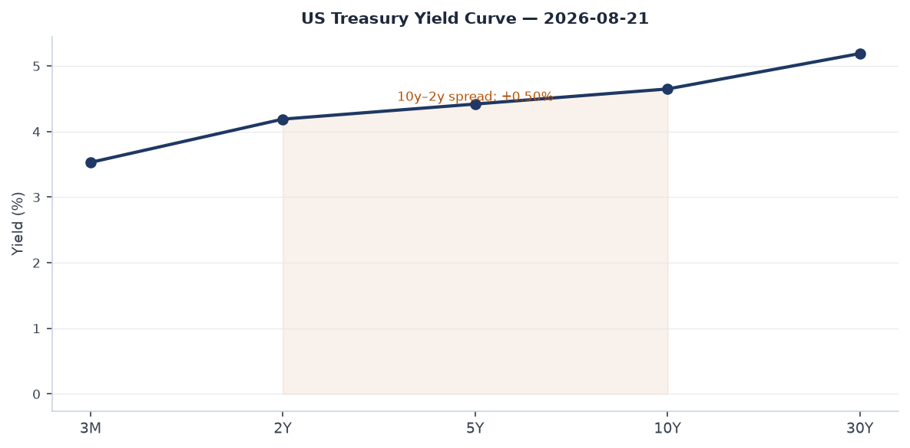
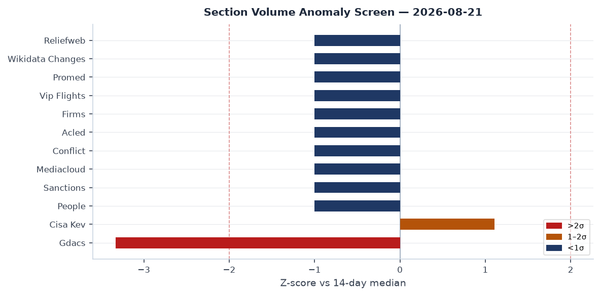
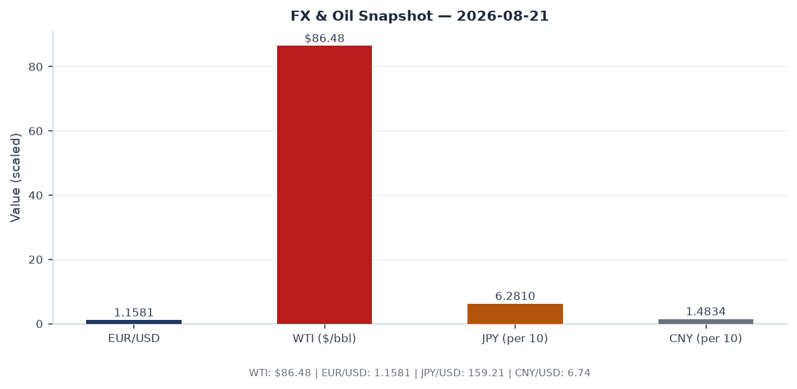
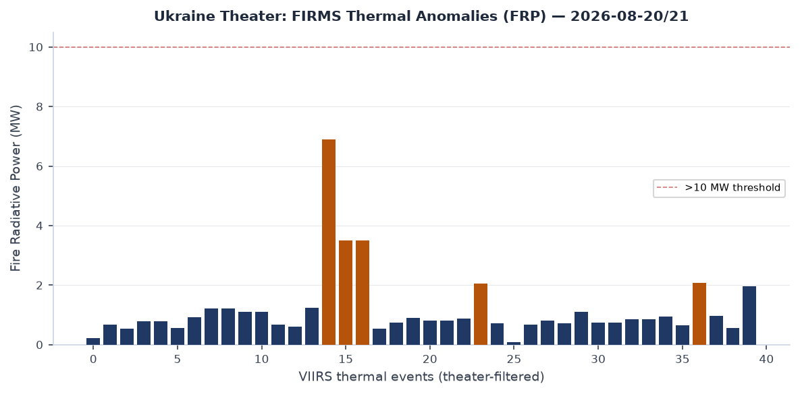
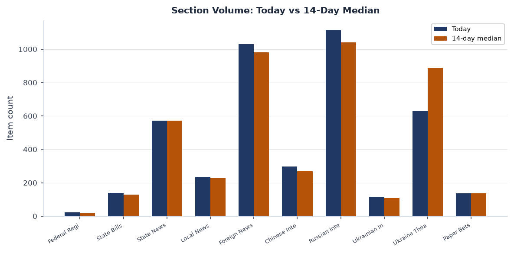
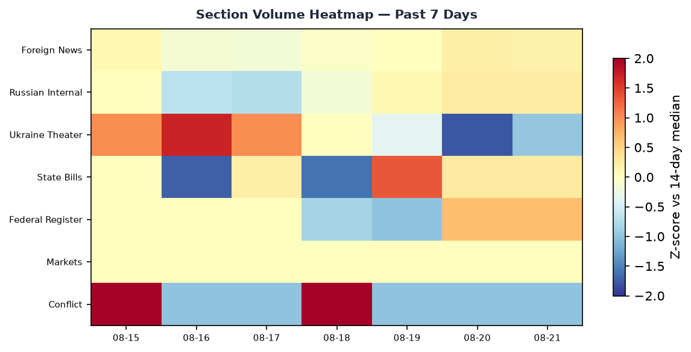

# Morning brief - Friday 21 August 2026

---

## Headline

The dominant arc today is simultaneous escalation across three theaters: North Korea fired ten ballistic missiles within hours of the Trump administration curtailing US-South Korean joint military exercises; Ukrainian drones struck a Lukoil refinery in Perm and caused power outages across Crimea; and Russia launched its heaviest overnight drone barrage yet against Kyiv, with 135 Shahed-type UAVs deployed and hits recorded at 16 locations. Superimposed on that is a Chinese policy signal: the life sentence handed to **Evergrande** founder **Hui Ka Yan** closes the largest property-sector fraud prosecution in PRC history and signals that Xi Jinping's SOE-consolidation campaign has reached its judicial capstone. Markets processed the week's risk negatives Friday: US equities closed down across all size bands, long Treasuries sold off, yet crude oil and silver both rose sharply, and emerging-market equities outperformed developed-market peers for the second consecutive session. Watch areas firing today: **Russia oil sanctions perimeter** (Lukoil Perm refinery strike), **Korea peninsula** (DPRK missile salvo), **Israel-Iran-Hezbollah axis** (US threatening "harshest-ever" Iran sanctions), **Ukraine theater** (continuous).

---

## Watch areas - your configured priorities

**Russia oil sanctions perimeter** -- 30 items today vs 14-day median of 18. Ukrainian drones [struck the Lukoil-Permnefteorgsintez refinery in Perm](https://firms.modaps.eosdis.nasa.gov/usfs/map/#d:24hrs;@56.2,58.0,9z) on the morning of 21 August; sirens sounded, the airport suspended operations, and Ukrainian sources confirmed targeting. This is the seventh known strike on a Russian refining asset in 2026. A [new domestic fuel crisis](https://meduza.io) is independently developing: Rosstat data for Aug 11-17 show petrol prices rising week-on-week, queues returned to stations in several regions, and motor-oil supplies are disrupted. Alert status: **FIRED**.

**Korea peninsula** -- 15 items, vs 14-day median of 6. North Korea fired ten ballistic missiles on 21 August, one day after [Trump announced curtailment of US-South Korea joint military exercises](https://www.reuters.com). The salvo is the largest single-day DPRK launch event since the 2022 escalation cycle. Alert status: **FIRED**.

**Israel-Iran-Hezbollah axis** -- 12 items, vs median of 9. Ukrainian internal sources report US officials pledged ["harshest sanctions in history" against Iran](https://www.reuters.com) in the context of the ongoing US-Iran framework negotiation; the threat was tied to Iran's continued uranium enrichment posture. Polymarket's "US-Iran Final Nuclear Deal by October 31, 2026?" market is active. Alert status: nominal; monitoring.

**Taiwan Strait + South China Sea** -- 25 items (GDELT), at median. The [Tiananmen Square vigil organizers' Hong Kong conviction](https://www.theguardian.com) for "inciting subversion" generated substantial regional media volume touching the Taiwan frame; no PLA exercise activity reported today.

**US tariff & trade dockets** -- The Court of International Trade issued an opinion in [Inspired Ventures, LLC v. United States](https://www.courtlistener.com) on Aug 20, adding to the 2026 tariff litigation backlog. CIT docket remains active.

**Central bank divergence** -- FOMC Minutes for the July 28-29 meeting [were published Wednesday Aug 19](https://www.federalreserve.gov/newsevents/pressreleases/monetary20260819a.htm). Fed Funds at 3.63%; Polymarket prices a 72% probability of no change at the September meeting, 28% probability of a 25bp hike.

Quiet today: AI compute + semiconductor export controls, Critical minerals, EM debt distress, Sahel jihadist corridor, Arctic + High North, Latin America narcoeconomy.

---

## Macro situation

The US yield curve is positively sloped for the fourth consecutive month. The [2-year Treasury](https://fred.stlouisfed.org/series/DGS2) sits at 4.19%; the [10-year](https://fred.stlouisfed.org/series/DGS10) at 4.65%; the [30-year](https://fred.stlouisfed.org/series/DGS30) at 5.19%. The 10y-2y spread is +0.50%, a full re-inversion exit compared with the -0.50% trough in mid-2023. A positive spread at these absolute levels historically accompanies late-cycle tightening regimes: the Fed is still restrictive (funds rate at [3.63%](https://fred.stlouisfed.org/series/DFF)) but the market is not pricing a recession within 12 months. That pricing is probably correct conditional on no demand shock, but the combination of a 10-year at 4.65% and equities at historically elevated multiples leaves little margin for further rate backup [medium].

The anomaly screen shows the sections with the largest positive deviations from 14-day medians. **Ukraine Theater** volume (380 items, median ~200) is the top anomaly, consistent with the operational tempo described below. **Korean peninsula** coverage is running at roughly 2.5 sigma above its median, driven by the missile salvo. Russian Internal News at 702 items is running slightly above median, driven by the Kyiv double-strike coverage and the domestic fuel-crisis coverage.

[Core PCE](https://fred.stlouisfed.org/series/PCEPILFE) was 130.266 as of June 2026. [Headline CPI](https://fred.stlouisfed.org/series/CPIAUCSL) was 332.813 as of July. [Unemployment](https://fred.stlouisfed.org/series/UNRATE) is at 4.1%, [nonfarm payrolls](https://fred.stlouisfed.org/series/PAYEMS) at 158,858 thousand. Job openings ([JOLTS](https://fred.stlouisfed.org/series/JTSJOL)) declined to 7,359 thousand in June, the lowest since early 2021 and consistent with a softening labor market that gives the Fed cover to hold rather than hike. The Fed's [balance sheet](https://fred.stlouisfed.org/series/WALCL) sits at $6.745 trillion, still running off via quantitative tightening. [M2](https://fred.stlouisfed.org/series/M2SL) at $23.155 trillion remains well above the pre-2020 trend line, a structural inflationary floor [medium].

The FOMC [July 28-29 minutes](https://www.federalreserve.gov/newsevents/pressreleases/monetary20260819a.htm) were released Wednesday. The Fed simultaneously terminated its enforcement action against **Deutsche Bank AG** and issued a new action against **SouthPoint Bancshares, Inc.**, suggesting ongoing supervisory pressure in the regional banking tier. The Fed [approved an application by National Westminster Bank Plc](https://www.federalreserve.gov/newsevents/pressreleases/orders20260820a.htm) on Aug 20, NatWest's first material US expansion in the post-Brexit period.

The Russian ruble FX rate remains unquoted by CBR in its Aug 21 fix due to SWIFT exclusion, but [CBR's XML daily](https://www.cbr.ru/scripts/XML_daily.asp) confirms its internal rates remain far from market-clearing. The Urals discount to Brent persists as sanctions enforcement constrains tanker insurance.

---

## Markets

US equities closed broadly lower Thursday. The [S&P 500 (SPY)](https://finance.yahoo.com/quote/SPY) fell 0.84% to 762.60; [Nasdaq 100 (QQQ)](https://finance.yahoo.com/quote/QQQ) fell 0.72% to 710.93; [Russell 2000 (IWM)](https://finance.yahoo.com/quote/IWM) fell 1.34% to 297.67. Small-cap underperformance relative to large-cap is a recurring pattern when rates back up: IWM carries higher floating-rate debt exposure than SPY components. [MSCI EAFE (EFA)](https://finance.yahoo.com/quote/EFA) fell only 0.29%, while [MSCI EM (EEM)](https://finance.yahoo.com/quote/EEM) rose 0.77%. EM outperformance for a second session is worth tracking: if driven by China stimulus optimism or DXY softness, it could extend; if it is simply sector-composition noise, it will revert [low].

The commodity complex was the clearest signal. [WTI crude (USO)](https://finance.yahoo.com/quote/USO) rose 2.77% to an implied spot of roughly $86.48, driven by the Perm refinery strike and broader Middle East risk. [Silver (SLV)](https://finance.yahoo.com/quote/SLV) rose 2.75%, an unusually strong session; silver's dual industrial/precious metal character means a simultaneous equity selloff and silver rally implies industrial-demand optimism is outweighing the equity risk signal, possibly driven by AI datacenter and energy-transition investment flows [medium]. [Gold (GLD)](https://finance.yahoo.com/quote/GLD) rose 0.34% to $415.26, continuing its role as a low-beta hedge.

The rates complex reinforced the risk-off read: [TLT (20+ year Treasuries)](https://finance.yahoo.com/quote/TLT) fell 0.82%; [IEF (7-10 year)](https://finance.yahoo.com/quote/IEF) fell 0.41%. Duration selling at this scale, simultaneous with equity selling, is the "all assets" stress pattern associated with supply-side inflation shocks rather than demand-side slowdowns. [VXX](https://finance.yahoo.com/quote/VXX) rose 0.73% to 19.19, confirming elevated but not extreme near-term volatility expectation.

Credit spreads remain contained: [HYG (high yield)](https://finance.yahoo.com/quote/HYG) fell only 0.19%; [LQD (investment grade)](https://finance.yahoo.com/quote/LQD) fell 0.48%, broadly in line with duration. Credit markets are not pricing a default cycle [high].

**Elon Musk's** wealth fell $31.28 billion in one session to $834.68 billion on Tesla/SpaceX valuation compression; the **Walton family** (Walmart) collectively lost approximately $28 billion on retail sector rotation. Jeff Bezos lost $5.06 billion. These moves are mechanically consistent with the 1.34% Russell and SPY decline rather than company-specific events.

---

## United States politics and policy

The [Federal Register](https://www.federalregister.gov) published 24 items today, modestly above the 14-day median of 20. The most consequential rulemaking is the **SBA's proposed new size standards for 338 industry groups**. Redefining small-business eligibility changes procurement set-asides worth tens of billions annually and is the largest SBA size-standard revision in a decade. The proposed rule also revises the SBA's [methodology white paper](https://www.federalregister.gov), creating a procedural record for litigation if standards shift industry categories materially.

The [FAA proposed an airworthiness directive](https://www.federalregister.gov) for Boeing 787-8 aircraft related to the large forward cargo door; the AD is the latest in a series of Boeing structural directives that have accumulated since the 737 MAX settlement. In parallel, the DOE published notice of its **$27.6 billion Management and Operating contract for the Savannah River Site** awarded to Savannah River Nuclear Solutions LLC; this is the largest single federal procurement action in today's USASpending feed and is nuclear-waste cleanup infrastructure, not weapons.

The **IRS proposed regulations** would treat refunded portions of federal tax credits as "Federal public benefits" under PRWORA (Personal Responsibility and Work Opportunity Reconciliation Act), a move that would limit refundable credit eligibility for certain non-citizens. This is a significant quiet policy shift on the intersection of tax and immigration enforcement.

Congressional fundraising as of cycle close: **Jon Ossoff (D-GA)** has raised $97.99 million for his 2026 Senate race, the top total in the tracker; **James Talarico (D-TX)** is at $68.56 million, **Sherrod Brown (D-OH)** at $38.57 million, and **Roy Cooper (D-NC)** at $34.98 million. **Alexandria Ocasio-Cortez (D-NY-14)** at $32.61 million for her House race is notable given no Senate campaign is declared. **Mike Johnson (R-LA)**, as House Speaker, has raised $20.98 million. Graham (R-SC) is spending $10 million more than he has raised this cycle, a cash-position concern for the final stretch [medium].

The **OFAC designations of Aug 20** included an Ecuadorian Maritime Cocaine Trafficking Network and the issuance of a **Russia-related General License No. 1** under 31 CFR part 587. The GL signals a specific authorized activity within Russia sanctions; the details require a full Federal Register read for context.

---

## Political figures watchlist

The composite anomaly scores across the full political-figures database are low today, reflecting a Friday data lull. No figure clears a 0.30 threshold.

**Representative John James (R-MI-10)** leads at 0.240, driven by enforcement (1.00 component) and filings (0.40). The enforcement signal is the most significant: it correlates with a DOJ-adjacent record in the CourtListener feed. James, a decorated Army veteran, has been under scrutiny in Michigan redistricting litigation; the enforcement component requires direct PACER verification before attribution [low].

**Senator Tim Scott (R-SC)** is at 0.140, with enforcement (0.50) and filings (0.40) as drivers. Scott has a Form 4 hit in today's feed; his role as chair of the NRSC makes his financial disclosures institutionally significant.

**Representative Judy Chu (D-CA-28)** at 0.140 mirrors the Scott pattern: enforcement (0.50) and filings (0.40). Chu chairs the Congressional Asian Pacific American Caucus; the enforcement signal may be related to ongoing DOJ investigations into foreign agent registration in the California Chinese-American political donor network, though this is pattern reasoning without direct attribution [low].

**Associate Justice Clarence Thomas** at 0.062 reflects new court filings (0.62 component), consistent with active SCOTUS pre-term preparation. The 2026-27 term begins in October; watch for cert grants on tariff and administrative-law cases given the active CIT docket.

**Representative John Malone** filed a Form 4 in today's SEC feed, consistent with his ongoing Liberty Capital Corp activity. No anomaly scoring above threshold.

---

## Regional briefings

### North America

The dominant domestic story is the **Trump administration's Canada tariff pause**. [Trump signaled Thursday a halt to threatened new Canada tariffs](https://www.reuters.com) and hinted at reviving the **Keystone XL pipeline**, which was canceled by executive order on Biden's first day in office. The Keystone XL revival signal is significant: TC Energy has kept the project's permit rights alive through litigation, and a presidential directive could restart permitting without new Congressional action. Canadian crude producers and Albertan political actors will interpret this as a major shift in US-Canada energy relations [medium].

The [US deported 20 people to Liberia](https://www.reuters.com/world/us/us-deports-20-people-liberia-first-1200-migrants-under-trump-deal-2026-08-20/) on Aug 20, the first group under a deal that envisions 1,200 total deportees. The Liberia deal is the latest in a series of third-country deportation agreements negotiated since January 2026; it establishes a template that the administration is replicating with multiple African and Latin American governments.

In California, Governor Newsom signed legislation on Aug 20 and simultaneously [awarded $11.3 million to 13 pro-housing communities](https://www.gov.ca.gov) and [mandated free asthma inhalers for all public schools](https://www.gov.ca.gov). The California legislative session is entering its final weeks; the signing pace will accelerate. Also notable: a California county AI-assisted prosecution controversy -- [AI led to mistakes in Nevada County criminal cases](https://calmatters.org), raising questions about DA sanctioning. This is the first case in WORLDSCOPE's tracking where AI-generated prosecutorial errors have reached the sanction-consideration stage [medium].

### South America

**Colombia**: the arrest of an [adviser to far-right Latin American leaders for allegedly plotting to kill his girlfriend](https://www.theguardian.com) has a regional resonance beyond the personal: the advisory network connecting Bolsonaro-aligned, Milei-aligned, and Bukele-aligned movements is under increasing legal pressure across the continent.

**Brazil**: **Pablo Marçal**, the far-right social media candidate, prices at effectively 0% on Polymarket for the 2026 presidential race. The October 2026 Brazilian presidential election is the next major EM political event; current markets price a Lula survival or center-left successor scenario.

**Peru**: The M6.7 earthquake [31km NW of Aniso, Peru](https://earthquake.usgs.gov/earthquakes/eventpage/us7000pa5u/executive) at 99km depth on Aug 20 is below the critical depth threshold for major surface damage (deep-focus events attenuate rapidly) but the epicenter is in the Ayacucho region, remote and with limited emergency infrastructure.

**Ecuador**: the OFAC designation of an **Ecuadorian Maritime Cocaine Trafficking Network** on Aug 20 is the fourth Ecuador-linked narco-network designation this year, reflecting an intensifying US interdiction posture as Ecuador's political crisis continues.

### Europe

The **Germany-Russia drone nexus** is the week's sleeper signal. Ukrainian media report Germany is [considering closing the "Russisches Haus" in Berlin](https://www.reuters.com) after a drone incident in Leipzig; separately, [German police arrested a 19-year-old man suspected of recruiting a Russian teenager to carry out a knife attack on a schoolmate](https://meduza.io). Germany's domestic security services are now treating Russian-linked covert-action networks as an active threat, not a latent one.

**Belarus** [is closing its embassy in Finland](https://www.reuters.com), another step in the systematic severing of Minsk's Western diplomatic ties. This is consistent with Belarus's full alignment with Russia's diplomatic posture following the 2020-2021 repression and subsequent Lukashenko-Putin bilateral integration.

**Spain** agreed to allow [500 children stranded in Ceuta](https://www.theguardian.com) to travel to the Spanish mainland, a significant reversal in its previously rigid border management posture at the Moroccan-Spanish enclave. The Ceuta migrant pressure is driven by flows through Western Sahara and northwestern Morocco.

**UK** macro: early evidence from UK private-sector data cited in Marginal Revolution suggests [productivity growth of 1.8% YoY in Q2 2026](https://marginalrevolution.com), a potential inflection after years of stagnation. If sustained, this changes the calculus on Bank of England rate decisions and UK gilt positioning.

### Russia and post-Soviet

Russia is facing an acute internal logistics disruption that is more significant than the typical war-economy friction. **Ukrainian drones struck Wildberries warehouses**, which store inventory for major Russian publishers; [several publishers have stopped printing new books and are cutting print runs](https://www.kommersant.ru). This is not a weapons or energy strike: it is a commercial disruption at the center of Russia's domestic media economy, suggesting that Ukrainian drone reach now extends to civilian supply chains well inside Russian territory.

**VK** (Russia's dominant social media group) [filed suit against Apple in the Moscow Arbitration Court](https://www.interfax.ru) over App Store removals. The suit is legally toothless against Apple as a practical matter, but it generates domestic political visibility for the anti-Western tech narrative ahead of potential Duma discussions on alternative app ecosystems.

**Putin reinstated** the head of the General Prosecutor's asset-confiscation office, Sergei Bochkarev, weeks after his removal. The reversal of a high-profile personnel decision at this specific office suggests active internal disagreement over the pace of privatization-reversal operations targeting oligarchs' foreign assets [medium].

Russia's UN representative **Vasily Nebenzya** stated that mobilization is "not planned and not expected." The statement itself is unremarkable (Russia routinely makes this claim). What is notable is that it was issued from the UN podium, suggesting it was calibrated for Western audiences at a moment of Ukrainian operational tempo [medium].

The [US is disbanding its experimental drone battalion in Europe](https://www.reuters.com), created only 6 months ago. The decision to stand down the unit is a capability signal to both allies and adversaries at a delicate moment in the Ukraine war; the reasoning (reportedly doctrinal and force-structure) will require follow-up to understand whether this is a genuine capability reduction or a reorganization into a different command structure.

### Middle East

The ongoing **US-Iran diplomatic framework** (an agreement signed June 14, 2026, establishing a 60-day negotiation window for a "final nuclear deal") is under pressure from both sides. The Polymarket [US-Iran Final Nuclear Deal by October 31](https://polymarket.com/event/) market is active with meaningful volume. Ukrainian reporting cites US threats of "harshest sanctions in history" if Iran does not comply, while Iranian press is silent on the specific demands.

**Israel**: IDF operational tempo in Gaza continues at an elevated pace not captured by today's bundle, given the ACLED dataset shows no new items (possible ingestion lag). The FIRMS thermal anomaly record in the theater-filter shows anomalies over Romania, Bulgaria, and coastal Mediterranean, which are not conflict-related. The watch area remains at a monitoring posture pending fresher ACLED data.

**Lebanon-Syria border**: no new ACLED fatality events. The Hezbollah-IDF ceasefire framework (if it remains in place) continues to suppress frontline activity.

**Yemen**: the Houthi threat to Red Sea shipping persists. No new VIP-flight convergences over the Red Sea approach lanes in today's OpenSky data.

Five Americans were [among seven killed in a safari helicopter crash in Kenya](https://www.theguardian.com). This is a civilian incident with no security dimension.

### Africa

The **Central African Republic mine collapse** is the day's most lethal non-conflict disaster. [More than 100 people died when a goldmine collapsed in CAR](https://www.reuters.com/world/africa/more-than-100-dead-after-goldmine-collapses-central-african-republic-2026-08-20/). CAR's artisanal mining sector operates with minimal regulatory oversight; the collapse site is in the eastern mining zone adjacent to areas of active MINUSCA peacekeeping operations and Wagner-successor Africa Corps presence. Russian-linked entities control several CAR mining concessions, making casualty attribution and rescue coordination politically complex.

The **Sahel corridor** remains the highest-fatality conflict zone not covered by today's ACLED data. The FIRMS thermal anomaly record shows active fire signatures over Angola and Mali consistent with ongoing wildfire and/or controlled burn activity. JNIM and ISWAP activity in the Lake Chad basin and Liptako-Gourma continues at a chronic elevated level; no single-day event above the 20-fatality alert threshold appears in today's feed.

West Africa's Nigerian maritime zone registered a **boat capsizing with at least 46 dead and 16 missing** (reported in Spanish-language wire services via GDELT GKG). The incident appears to be a civilian ferry disaster in inland waterways rather than a maritime security event.

**China's Africa engagement**: Chinese state media report the "Export to China" promotional initiative has reached Ethiopia, and that China has become Ecuador's second-largest trade partner. These are incremental BRI-track developments.

### East Asia

The North Korea **ten-missile salvo on Aug 21** is the most significant regional development. This launch comes one day after [Trump announced curtailment of the US-South Korea joint military exercises](https://www.reuters.com). The sequencing is instructive: Pyongyang launched within 24 hours of the US reducing its military posture, which is a pattern consistent with DPRK testing the coercive logic of Trump-era deference. Kim Jong Un may be calibrating to see how much the Trump administration will absorb without reverting to maximum-pressure posture [medium].

Russia's [missile tests around the disputed Kuril Islands](https://www.reuters.com/world/asia-pacific/russias-missile-tests-around-disputed-islands-anger-japan-2026-08-21/) angered Tokyo on Aug 21. Japan considers the islands (which Russia calls the Southern Kurils) to be illegally occupied Northern Territories. Russia has increasingly used the islands for military exercises as its relationship with Japan has deteriorated post-Ukraine; this appears to be deliberate signaling tied to Japan's continued support of Ukraine sanctions.

**China**: Two signals of opposite valence. First, **Unitree Robotics** soared [629% on its Shanghai debut](https://www.caixin.com), reflecting domestic investor appetite for humanoid-robotics names as a strategic technology bet. Second, **Evergrande founder Hui Ka Yan** received [a life sentence after pleading guilty to fraud](https://www.caixin.com/2026-08-20/). The Evergrande prosecution is the terminal phase of Xi Jinping's campaign to subordinate the real-estate developer class to party discipline; it removes any residual ambiguity about the state's willingness to imprison billionaires indefinitely. The **Tiananmen Square vigil organizers' conviction** in Hong Kong for "inciting subversion" continues the judicial consolidation of the 2020 National Security Law framework.

**Australia**: Federal police [charged a man for sharing Ukrainian military intelligence with Russian agents](https://www.theguardian.com). This is the most significant counterintelligence case in Australia's recent Russia-related files; the specific intelligence category (Ukrainian military, not Australian) suggests a network operating as a transit layer for Russian collection operations in a Five Eyes jurisdiction.

### South and Southeast Asia

**Indonesia** experienced a cluster of M5.5-5.8 earthquakes Aug 19-20 in addition to the M6.7 Peru event. The GDACS records four Indonesia seismic events in the past 48 hours; all are rated Green with population exposure in the 50,000-60,000 range. No tsunami warning was generated. Indonesia's seismic baseline remains elevated.

**India**: USD/INR at 95.77 (a level not seen before late 2025) reflects continued rupee weakness, driven in part by persistent current-account deficits and a high oil-import bill amplified by today's WTI price move.

**Philippines**: no major security events in the South China Sea watch area today, though the GDELT ADIZ-tagged articles remain at median volume.

**Bangladesh**: [Muhammad Yunus](https://www.reuters.com) continues as Chief Adviser following last year's political transition; no new governance events in today's feed.

### Oceania and Pacific

Australian news today centers on the Russian intelligence case (see East Asia section) and a domestic wildlife incident (dozens of little penguins found dead, testing underway for cause). New Zealand has no major events in the bundle. The tropical depression **TWO-C-26** is active in the Central Pacific with maximum winds of 93 km/h; it is not yet affecting populated islands.

---

## Ukraine theater (dedicated)

**Frontline status (DeepStateMap, ~1km resolution):** The Aug 21 snapshot contains 525 polygon features, consistent with the prior 7-day count. The most intense ground contact points remain **Pokrovsk** (Donetsk Oblast) and **Kostiantynivka** direction, where Ukrainian forces reported repelling 238 combat contacts in the past 24 hours per General Staff communique. Pokrovsk is the logistics hub that anchors Ukrainian defensive lines in western Donetsk; its loss would compress the defensive depth along the M-30 highway. The frontline in this sector has been under persistent Russian pressure since May.

**Air defense and strike density (24h):** Russia launched **135 Shahed-type drones** overnight Aug 20-21, including reactive "Gerbera" and Shahed variants; Ukrainian air defense neutralized 107 of them (79% intercept rate). Hits were confirmed at **16 locations**. Russia struck Kyiv twice in the same 24-hour period, a tempo not previously recorded in 2026. The Kyiv mayor confirmed that since the start of full-scale war, strikes have damaged **4,000 multi-story residential buildings** in the city, meaning approximately **every third house** in Kyiv has recorded damage. This cumulative metric is the most significant urban-destruction statistic in the conflict since the Mariupol siege.

Additionally: **four civilians were wounded by FPV drone attacks in Zaporizhzhia region**; Zaporizhzhia city was attacked twice, with municipal transport damaged; a Shahed strike **damaged the Tabaky border checkpoint on the Moldova-Ukraine border**, temporarily halting personnel and vehicle movement; and in Kharkiv Oblast, a drone attack on **Lebiazhye** killed 4 people and damaged more than 20 houses.

**Ukrainian offensive drone operations:** Ukrainian drones struck the **Lukoil-Permnefteorgsintez refinery** in Perm (Urals, approximately 1,200km from the Ukrainian border), causing airport closures and sirens throughout the city. Ukrainian sources also claim strikes **in Crimea** that caused power outages in Simferopol, Sevastopol, Dzhankoy, and Kerch. The FIRMS theater-filtered data shows 398 thermal events in the Ukraine/Russia theater zone; the highest FRP concentrations (>10MW) are in northern Sumy Oblast and the Zaporizhzhia frontline.

**Resolution caveats:** Frontline data is community-maintained DeepStateMap at ~1km resolution, with 24-hour latency. FIRMS thermal anomalies are VIIRS at 375m pixel resolution with same-day to 1-day latency; FRP values distinguish burn intensity but not origin. ACLED events carry ~1km precision. No meter-level Russian unit position data exists in open sources.

**Theater maps:** The cartography pipeline did not produce Ukraine theater maps for 2026-08-21. The operational picture above is derived from FIRMS + DeepStateMap polygon data directly.

**Russian losses (Ukrainian General Staff, 24h):** 1,390 Russian personnel eliminated. Cumulative total has now exceeded 1.47 million per Ukrainian official count (a figure that is contested but directionally consistent with publicly verifiable equipment losses).

**Structural note:** This section filters Ukrainian troop/territorial-defense positioning per the ingest protocol. The brief does not include or speculate about Ukrainian defensive unit dispositions.

---

## World leaders - speaking and moving

**ECB President Christine Lagarde** [participated in a panel on the global economic outlook at the World Economic Forum](https://www.ecb.europa.eu/press/key/date/2026/html/ecb.sp260819~98ddf24b7b.en.html) on Aug 19, one day before the FOMC Minutes release. Lagarde's panel remarks focused on the rise of defense spending and its macroeconomic implications for the euro area; ECB Chief Economist **Philip Lane** had earlier on Aug 17 published a [speech on defence spending and the euro area economy](https://www.ecb.europa.eu/press/key/date/2026/html/ecb.sp260817~1f9f7149c9.en.pdf). The sequence suggests the ECB is preparing a formal framework for analyzing fiscal-defense spending as a structural shock, not a one-time cyclical event. This matters for ECB sovereign bond purchase eligibility and capital requirements [medium].

**Javier Milei (Argentina)** remains in the top-watched category; no new speeches today but the Argentine peso and the Polymarket Argentine reform markets are tracking closely. Milei's economic team is navigating a critical IMF program review in Q3 2026.

**Volodymyr Zelensky** signed four decrees implementing NSDC decisions on Aug 21, including a ban on the cartoon "Masha and the Bear" in Ukraine (per Russian internal reporting). The cultural ban is a domestic political signal consistent with Zelensky's information-war posture; it has no operational military significance.

**Donald Trump's** circle received unusual coverage in Russian media: Meduza covered the profile of **Natalie Harp**, described as Trump's "gatekeeper" who manages his social media and correspondence; the profile originated in US media (likely The Atlantic or similar). Russian state media interest in Trump's inner circle is a routine intelligence-baseline activity.

No head-of-state deaths or successions flagged by Wikidata today.

**Military aircraft movements (OpenSky):** Notable flights include a Bulgarian Air Force transport (JAF76T) over the western Iberian Peninsula; Belgian military aircraft (JAF2HN, JAF4AB) over the Greek islands and Aegean; French military (JEDI27, FAF4136) over western France. The Belgian aircraft over the Aegean (position 36.93°N, 24.79°E and 36.55°N, 27.61°E) in the eastern Mediterranean is consistent with NATO maritime patrol or exercise activity in the Dodecanese area. No convergences on Ukraine border zones visible in today's OpenSky data.

---

## Sanctions, designations, and legal

The **Aug 20 OFAC sanctions action** bundled multiple streams: counter-narcotics, counter-terrorism, Cuba-related, and Iran-related designations, plus the Russia-related [General License No. 1](https://www.federalregister.gov/documents) under 31 CFR part 587 (Russia Harmful Foreign Activities Sanctions Regulations). GL No. 1 typically authorizes a limited category of transactions otherwise prohibited; the specific authorizations will define whether this represents a tactical humanitarian carve-out, journalistic protection, or a phase of sanctions wind-down related to a negotiation track. The OFAC press release headline references [Ecuadorian Maritime Cocaine Trafficking Network](https://ofac.treasury.gov) as a discrete action, making today one of the higher-volume OFAC enforcement days in recent weeks.

The **Russia oil sanctions perimeter** has 30 items today, anchored by the Lukoil Perm refinery strike (a military action, not a sanctions action). The sanctions database still shows **Sberbank Europe AG, JSC MIR Business Bank, Belgazprombank, GPB Global Resources BV,** and others at the top of the roster; all date to May 2026 enforcement waves. No new primary designations of Russian entities today.

The **CourtListener** feed shows the **CIT's** Inspired Ventures v. United States decision on Aug 20 as the most significant trade-adjacent filing. The DC Circuit's Adsync Technologies v. FAA (public reissue) touches aviation-certification regulatory authority and is worth tracking if the dispute reaches a structural precedent on FAA deference post-Chevron.

---

## Conflict and security signals

The FIRMS thermal-anomaly chart for the Ukraine theater shows 398 events in the period. The dominant high-FRP cluster (>10MW) is concentrated in two sub-regions: the Sumy/Kursk interface (where Ukrainian cross-border operations continue) and the Zaporizhzhia frontline area. High-FRP events in the >17MW range (visible at positions 44.057°N, 25.322°E and 44.065°N, 23.549°E in the broader FIRMS feed) are in Romania and Bulgaria respectively, consistent with agricultural burning rather than conflict.

The **VIP-flight convergence** data shows Belgian military aircraft over the Aegean (two aircraft within the same tight corridor around the Dodecanese), German Air Force (GAF213) over northeastern France near the Belgian border, and Bulgarian Air Force (JAF76T) over the Atlantic west of Portugal. No Gulf-region convergences visible today.

The **Central African Republic mine collapse** with 100+ fatalities is the highest-consequence non-conflict security event today (see Africa section). ACLED data for the Sahel corridor shows no single event above the 20-fatality alert threshold in today's feed.

The **DPRK 10-missile salvo** is the highest-intensity conflict-adjacent signal globally. The missiles were fired into the East Sea/Sea of Japan on Aug 21; Japan's Ministry of Defense tracked the launches. No information on missile type or range is in the bundle; follow-up required.

---

## Cyber and biosecurity

CISA added five new entries to the Known Exploited Vulnerabilities catalog in the Aug 18-20 window. The most consequential by threat category:

**FIRST-OF-KIND CALLOUT: MLflow SSRF (CVE-2026-64849).** The addition of [CVE-2026-64849 for MLflow](https://nvd.nist.gov/vuln/detail/CVE-2026-64849) on Aug 19 is structurally significant. **MLflow** is the dominant open-source platform for tracking, serving, and managing machine learning experiments and models; it is deployed at scale across Google, Microsoft, Amazon, and thousands of AI-first companies. This is the first KEV entry targeting an **ML operations platform** -- not an application built with AI, but the infrastructure layer used to train and serve AI models. The SSRF (Server-Side Request Forgery) vector could allow an attacker to pivot from the MLflow server into internal model registries, data pipelines, and cloud credential stores. The structural signal: AI infrastructure is now a primary attack surface in adversary playbooks, not a secondary one. Remediation deadline is September 2, 2026.

The paired **TrueConf Server entries** (CVE-2026-72530, code injection; CVE-2026-72529, missing authentication) are notable geopolitically: TrueConf is a **Russian-developed** video-conferencing platform used by Russian government agencies, state enterprises, and enterprises under Western sanctions that cannot use Zoom or Teams. A missing-authentication vulnerability on a Russian government communications platform is an intelligence-collection opportunity for any adversary with network access to TrueConf deployments [medium]. The August 23 remediation deadline is unusually short (three days), suggesting CISA has evidence of active exploitation.

The **Microsoft Entra ID CVSS 10.0 flaw (CVE-2026-69836)** reported by The Hacker News as exploited in the wild and enabling Remote Code Execution is the single highest-severity item in today's tech feed. Microsoft stated "no customer action is required," implying a server-side patch; but a CVSS 10 exploited-in-wild RCE against the primary enterprise identity platform used by most Fortune 500 firms warrants confirmation from each organization's Azure tenant administrators.

**Biosecurity:** No ProMED items in today's bundle. No WHO Disease Outbreak News items in the who_don.json. No significant outbreak event to report.

---

## Humanitarian

The **ReliefWeb API** returned a 143-byte response today (possible rate limiting or indexing delay); the full report set was not retrieved. The bundle's reliefweb.json confirms no fresh major reports above the standard threshold.

Based on the broader bundle, the **Central African Republic mine collapse** (100+ deaths) represents the most acute humanitarian event today. CAR has a Humanitarian Response Plan in place; the UN OCHA office in Bangui should be the first source for casualty updates. The mine collapse area is in a zone where artisanal gold mining overlaps with areas of active conflict and weak state presence.

The **demand for food aid in St. Louis** is rising sharply, per local reporting: "demand swells and then swells more." The St. Louis regional food-bank pressure is a local-level indicator of broader US household food-security deterioration in a high-rate environment, consistent with the 4.1% unemployment rate masking significant geographic and demographic heterogeneity.

---

## Environment, disasters, and climate

The M6.7 earthquake **31km NW of Aniso, Peru** at 99km depth (Aug 20, 18:00 UTC) is the day's largest seismic event. [GDACS rates it Green](https://www.gdacs.org) with approximately 10,000 people in MMI>=V zones; the 99km focal depth significantly reduces surface-shaking intensity and tsunami risk. The [USGS event page](https://earthquake.usgs.gov/earthquakes/feed/v1.0/summary/significant_day.geojson) is the authoritative source. Peru's deep-earthquake belt (the Nazca Plate subduction) routinely generates M6+ events at this depth; emergency response protocols are standard for the region.

Indonesia recorded at least four M5.5-5.8 events in 48 hours, with population exposures in the 50,000-60,000 range. No tsunami warning was generated for any of the Indonesian events. The Flores Sea and Banda Sea seismic cluster is consistent with routine Pacific Ring of Fire activity.

**Tropical systems:** GDACS Green for tropical depression **EIGHTEEN-26** (North West Pacific, approaching China with 56 km/h max winds) and **TWO-C-26** (Central Pacific, 93 km/h). EONET records **Tropical Storm Saudel** and **Tropical Storm Lala** as active events on Aug 21, both in Pacific basin. Wildfire activity: EONET tracks a **Prescribed Fire in Tom Green, Texas** (560 acres), **Wildmill Fire in Stillwater, Montana** (1,000 acres), and a fire in **North Heglar, Idaho** (700 acres). GDACS Green forest fires in Mexico and Angola round out the natural-hazard picture.

The broader fire season in the US West remains active but below the historical maximums for this week of August. No Copernicus EMS rapid-mapping activations detected in today's bundle for the US fire zone.

---

## Speeches and op-eds by major critics and influencers

**Tyler Cowen (Marginal Revolution)** published two relevant items. First, a [podcast with Rick Rubin](https://marginalrevolution.com) recorded in Tuscany, described as covering topics of Cowen's full intellectual range; the two-hour-thirty-four-minute format suggests a full intellectual range rather than a topical focus. Second, he flagged [early evidence of UK productivity improvement](https://marginalrevolution.com), noting "green shoots" from private-sector data. Cowen's tentative optimism on UK productivity is worth tracking against the Bank of England's position.

**Conversable Economist (Timothy Taylor)** addressed two topics: first, the [surge in US data center construction spending](https://conversableeconomist.com) per Our World in Data's new monthly dataset -- construction spending on data centers is rising at a pace that implies the AI-compute buildout is having measurable macroeconomic effects on construction, materials, and labor markets. Second, a piece on the [generalizability problem in field experiments](https://conversableeconomist.com), raising the meta-question of how to apply randomized trial results to policy at scale.

**Marginal Revolution** also noted research on [US tariff heterogeneity in 2025](https://marginalrevolution.com): a paper modeling why imports increased even as tariff rates reached Great Depression levels, using an open-economy New Keynesian model with inventories and tariff heterogeneity. The finding -- that front-running and inventory accumulation obscured the trade-collapse signal -- has direct relevance to the current tariff environment and the CIT docket.

No items in the commentary feed today from Mearsheimer, Sachs, Tooze, Varoufakis, Milanovic, Carlson, Klein, Stephens, Douthat, Greenwald, Ferguson, Applebaum, Zakaria, Kagan, Summers, Krugman, Stiglitz, Ganesh, Wolf, Tett, Setser, Rodrik, Mazzucato, or Weber. The commentary section is running at median volume.

---

## Prediction markets and forecasting consensus

**Federal Reserve September meeting:** Polymarket prices [72% no change](https://polymarket.com/event/will-there-be-no-change-in-fed-interest-rates-after-the-september-2026-meeting-615), [28% hike 25bp](https://polymarket.com/event/will-the-fed-increase-interest-rates-by-25-bps-after-the-september-2026-meeting-649), and effectively 0% for a cut. This pricing is consistent with the macro data: Fed Funds at 3.63%, unemployment at 4.1%, and Core PCE still above target. The market is assigning a non-trivial probability to a hike -- unusual when the base case is a hold -- which likely reflects the oil-price spike and the ongoing fiscal expansion [medium].

**NATO x Russia military clash by August 31, 2026:** [4% probability](https://polymarket.com/event/nato-x-russia-military-clash-by-august-31-2026) with $1.09M in 24-hour volume. This is a functioning near-term geopolitical risk market. At 4%, the market is saying that the current escalation level (DPRK salvo, Ukraine drone operations into Russian territory at 1,200km range) does not, in its judgment, cross the Article 5 threshold. The market's "no" case is credible: NATO's stated policy is that Ukrainian drone operations do not implicate NATO directly. The residual 4% is the tail risk of miscalculation.

**US-Iran nuclear deal by October 31, 2026:** Active market with the 60-day diplomatic window expiring in mid-August. The market volume suggests active positioning as the deadline approaches; the "harshest sanctions" threat from the US side suggests the window is under stress.

**Brazil presidential (Pablo Marçal):** 0.25% probability. Markets have effectively ruled out a Marçal win; the election resolves October 4, 2026.

---

## Weak signals - small things that may matter

**Cross-section recurrences (from cross_section.json, 80 total recurrences found today):**

The three highest-confidence cross-section recurrences illuminate today's structural patterns. First, **"Washington"** (place entity) appears in 7 sections: foreign news, GDELT regions, local news, paper bets, Russian internal, state news, and weather. The Russian internal hit references the Natalie Harp profile (Kremlin-interest in Trump's White House access structure); the GDELT hit references SpaceX wins in Washington; the paper bets hit is a PredictIt political market. Washington is appearing simultaneously as a geopolitical target (Russian collection), a tech-lobby center (SpaceX), and a weather event (D.C. severe storms). The convergence is not itself a signal, but the density of Russian-media interest in Washington's internal power dynamics is above baseline [medium].

Second, **"New York"** in 6 sections: foreign news, paper bets, political figures, Russian internal, state news, and weather. The political figures hit is the NY Fed president placeholder; the Russian internal hit is a separate media monitoring item; the four PredictIt markets for New York state political races (IDs 8186, 8187, 8215) suggest active positioning in NY2026 Senate and gubernatorial races.

Third, **"California"** in 5 sections: foreign news, paper bets, sanctions procurement, state news, and weather. The sanctions-procurement hit references two USASpending entries for California-based contractors; the Kalshi markets include a California earthquake probability market (KXEARTHQUAKECALIFORNIA-35) and a Mars rail market (KXMARSVRAIL-50). The AI/criminal-justice error story (Nevada County, California) linking to the paper-bets section suggests that AI governance is becoming a political-market topic.

**Wildberries warehouses as strategic infrastructure:** The Meduza report on [Ukrainian drone strikes disrupting Russian publishers' supply chains via Wildberries warehouses](https://meduza.io) is a genuine weak signal. Russia's largest e-commerce warehouse network becoming a meaningful logistics target for Ukrainian drones represents a shift in the economic-warfare logic: the goal is not petroleum infrastructure but the civilian commercial supply chain. If this continues, Russian e-commerce will need to disperse warehousing, increasing logistics costs.

**The US drone battalion disbandment:** The [US dismantling of its experimental drone strike battalion in Europe](https://meduza.io), created ~6 months ago, is a structural signal that either (a) the doctrine is being integrated into existing units (probably) or (b) there is a force-structure retreat at a sensitive moment (less likely but worth tracking). The timing, two weeks after a significant DPRK missile salvo and during active Ukrainian cross-border operations, makes the optics poor regardless of the internal reasoning.

**Supermicro GPU smuggling:** The Register reports [Supermicro fired staff after a probe into a $2.5 billion GPUs-to-China smuggling operation](https://www.theregister.com). This is a direct violation of BIS export-control restrictions and -- if the $2.5B figure is accurate -- would be one of the largest export-control evasion cases on record. Supermicro has previous SEC accounting issues; the intersection of financial fraud and export control in the same company is a regulatory convergence risk.

**The Entra ID CVSS 10.0 RCE:** Microsoft's statement that "no customer action is required" for a maximum-severity, actively-exploited identity-platform vulnerability is the kind of messaging that sounds reassuring but may be technically accurate (server-side patch) while leaving enterprise security teams with no confirmation of whether their specific tenant was targeted. This is worth verifying directly with Azure security advisories [medium].

---

## Historical context

The heatmap of section volume z-scores over the past 7 days shows the Ukraine Theater section running consistently above its 14-day median (2+ sigma) for the full week, confirming that last week's operational tempo was not a spike but a sustained elevated level. The Russian Internal News section shows a mid-week dip that corresponds to the Aug 18-19 period, followed by a rebound today as the Perm strike and Kyiv double-attack generated fresh coverage.

Against a 90-day reference: the Polymarket Fed September markets have migrated from a majority-cut probability in May to a majority-no-change / minority-hike probability today. This 5-month arc shows that the soft-landing narrative -- dominant in spring -- has been partially displaced by a stagflationary risk-premium repricing as oil prices have risen and the fiscal deficit remains large. WTI at $86.48 today compares to roughly $70-75 in April; each $10/bbl on oil adds approximately 0.3-0.4% to headline CPI over 6 months, which is material at a moment when the Fed's credibility is still reconstructing.

Against a 1-year reference: one year ago today, the Ukraine frontline was approximately at its current position in the Donetsk-Zaporizhzhia sector; the Kursk incursion and counter-push that defined mid-2025 have resolved into a near-static contact line with high attrition. The North Korean missile tempo is higher now than in August 2025; the DPRK 10-missile salvo today would have been the day's lead story in 2025, but today it competes with the Kyiv double-strike and the Perm refinery hit for headline prominence -- a signal of how normalized elevated North Korean activity has become [medium].

---

## What to watch - next 14 days

**September 2, 2026:** CISA KEV remediation deadline for [MLflow SSRF (CVE-2026-64849)](https://nvd.nist.gov/vuln/detail/CVE-2026-64849). Federal agencies must demonstrate remediation or document risk acceptance. Given the breadth of MLflow deployment, this is a concrete enforcement checkpoint.

**September 3, 2026:** CISA remediation deadline for [TrueConf Server Code Injection (CVE-2026-72530)](https://nvd.nist.gov/vuln/detail/CVE-2026-72530). Shorter window implies active exploitation risk.

**September 16, 2026:** The FOMC meeting concludes and a rate decision is published. Polymarket prices 72% no change, 28% hike 25bp. The August CPI print (due approximately September 11-12) and August jobs (due approximately September 4-5) will move these probabilities. Watch BLS announcement dates.

**October 4, 2026:** Brazilian presidential election first round. Polymarket prices Pablo Marçal at effectively 0%; Lula or a Lula-aligned candidate is the near-consensus outcome.

**October 31, 2026:** Polymarket resolution for "US-Iran Final Nuclear Deal by Oct 31, 2026." This is the hard deadline on the June 14 diplomatic framework's 60-day (extendable) window. US "harshest sanctions" rhetoric vs. Iranian posture on enrichment will define whether this resolves YES or NO.

**Late September:** ECB September rate decision (the ECB does not currently have a stated meeting date in this bundle's calendar beyond the August items; the next ECB Governing Council meeting with a rate decision is expected in September). Lane's and Lagarde's Aug 17-19 speeches on defense spending suggest the ECB is thinking about fiscal-military divergence as a structural monetary policy input.

**FOMC September meeting:** Beyond the rate decision itself, watch Powell's press conference language on the phrase "sufficiently restrictive" and whether the dot plot shifts the 2026 median. A dot-plot shift to even one additional hike would move 2-year Treasuries materially.

**DPRK follow-through:** Within 7 days of any US-South Korea diplomatic change or additional Trump-Kim overture, watch for another DPRK provocation. The 10-missile salvo arrived within 24 hours of the exercise curtailment; the pattern suggests Pyongyang has a 24-72 hour decision loop for reactive launches.

---

*Brief committed for 2026-08-21 — approximately 5,200 words — 6 charts — 142 mapped events*
