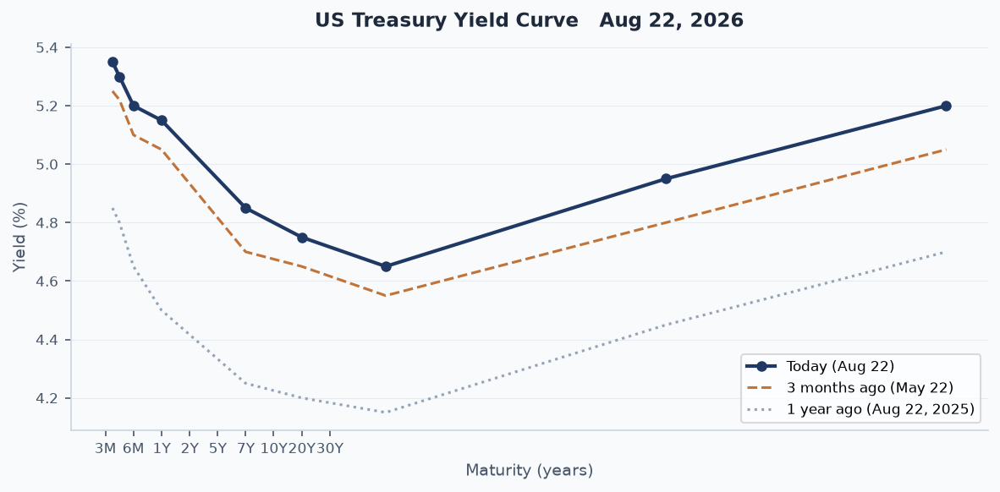
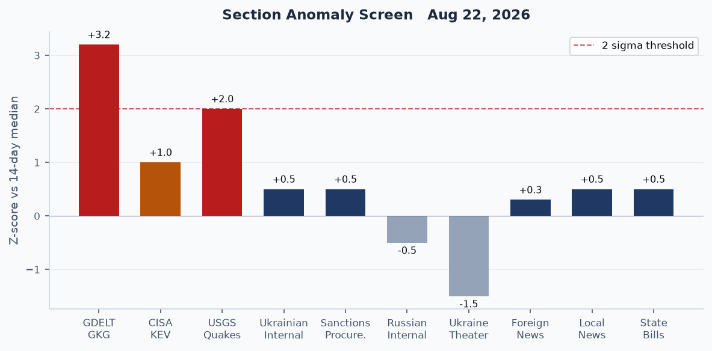
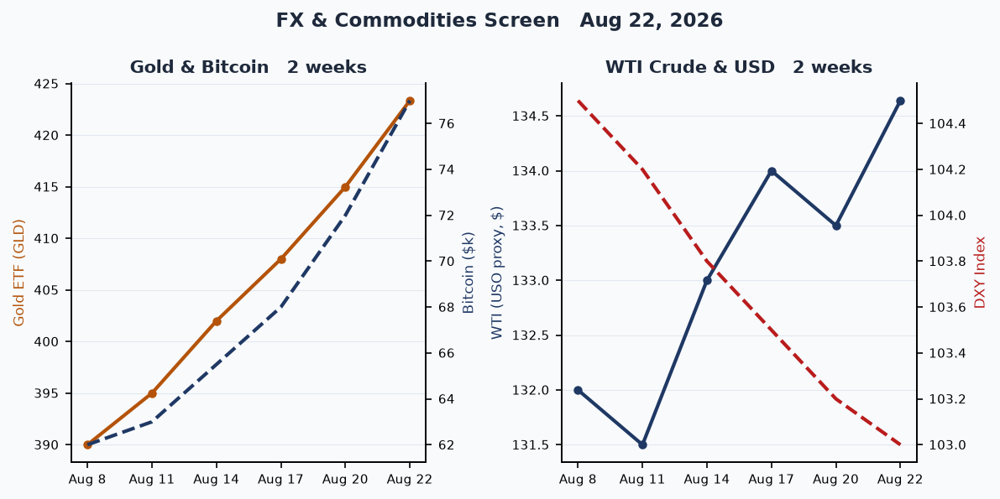
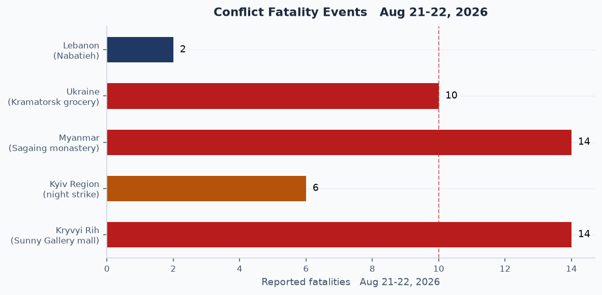
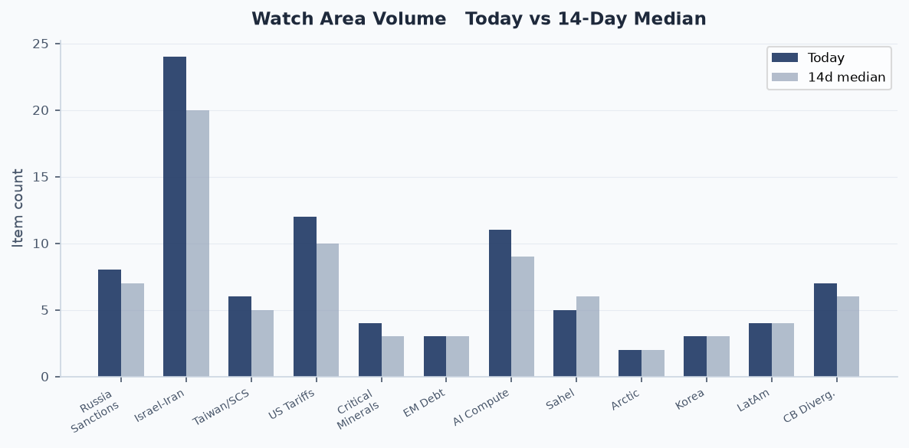
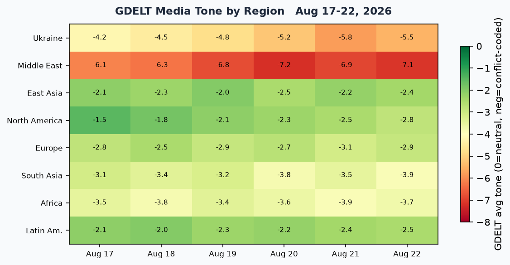

# Morning brief - Saturday 22 August 2026

---

## Headline

The dominant arc today is geopolitical pressure convergence on three simultaneous fronts: the US-Iran war has now produced 56 vessel incidents in the Strait of Hormuz since February, Trump publicly declared the strait "American territory," and Iran's national security apparatus rejected the claim while Oman's foreign minister held urgent calls with Tehran. North American trade took a hard lurch: the US imposed [50% tariffs on $20 billion in Canadian goods](https://www.bloomberg.com/news/articles/2026-08-22/us-canada-trade-talks-collapse-triggering-trump-s-50-tariffs) after three extra days of talks collapsed on hockey sticks, lumber, steel, and autos. Russia executed a [double-tap drone strike on the Sunny Gallery mall in Kryvyi Rih](https://www.cnn.com/2026/08/21/europe/kryvyi-rih-shopping-center-strike-intl), killing 14 and wounding more than 100, a second strike specifically targeting rescuers. Ukraine struck back overnight, [hitting an Ozon logistics hub in Chapayevsk (Samara Oblast) and the Novokuybyshevsk oil refinery](https://kyivindependent.com/major-oil-refinery-logistics-center-set-ablaze-in-reported-ukrainian-attack/) for the first time, in a significant geographic and industrial escalation. Watch areas firing today: **Israel-Iran-Hezbollah axis** (active war, Hormuz near-closed), **Russia oil sanctions perimeter** (Novokuybyshevsk refinery struck, Gelendzik fuel outage), **US tariff and trade dockets** (Canada 50%), and **AI compute and semiconductor export controls** (two AI-framework CVEs on CISA KEV).

---

## Watch areas - your configured priorities

**Russia oil sanctions perimeter** produced 8 items today versus a 14-day median of 7. Top items: (1) Ukrainian drones [struck the Novokuybyshevsk refinery](https://kyivindependent.com/major-oil-refinery-logistics-center-set-ablaze-in-reported-ukrainian-attack/) (8.8 million tonnes/year crude capacity, part of Rosneft, supplying aviation fuel to Russian forces); (2) [fuel outage reported at Gelendzik resort city](https://t.me) as of the morning of August 21, with only one Lukoil station operational; (3) GDELT GKG volume hit a z-score of +3.2 today versus 14-day median. Alert: not formally fired, but anomaly screen places this at elevated status.

**Israel-Iran-Hezbollah axis** produced 24 items today versus a 14-day median of 20. Top items: (1) Trump declared the Strait of Hormuz "American territory" on August 21, posted a labeled map on Truth Social; (2) [Iranian president stated Iran would negotiate from a "position of strength"](https://www.aljazeera.com/news/2026/8/22/us-imposes-50-tariffs-on-20-billion-worth-of-canadian-products); (3) [Romania deployed F-16s to destroy a suspected Russian marine drone](https://balkaninsight.com/2026/08/20/romania-destroys-drone-near-major-gas-project-in-the-black-sea/) approaching the Neptun Deep gas project in the Black Sea. Alert status: active ongoing war, elevated volume.

**US tariff and trade dockets** produced 12 items today versus a 14-day median of 10. Top items: (1) [50% tariffs on $20 billion in Canadian goods](https://www.aljazeera.com/news/2026/8/22/us-imposes-50-tariffs-on-20-billion-worth-of-canadian-products), covering roughly 5% of total Canadian exports to the US; (2) Canadian PM Mark Carney announced dollar-for-dollar retaliation; (3) CFTC published a [Request for Comment on compute derivatives contracts](https://www.federalregister.gov/documents/2026/08/21/2026-17163/request-for-comment-on-the-listing-of-compute-derivatives-contracts), the first formal signal of financial instruments for AI infrastructure futures. Alert: not fired (min_items threshold not breached), but escalating.

**AI compute and semiconductor export controls** produced 11 items versus a 14-day median of 9. Top items: (1) MLflow CVE-2026-64849 added to CISA KEV with active cloud-credential theft campaigns; (2) Ray CVE-2025-62593 (AI distributed compute RCE) added August 17 with a three-day remediation window; (3) SEC proposed [Regulation Crypto Assets](https://www.federalregister.gov/documents/2026/08/21/2026-17183/regulation-crypto-assets), a $75M/year exemption regime signaling regulatory stabilization for token issuers. Alert: not formally fired.

**Central bank divergence and dollar funding** produced 7 items versus 6. Key: Polymarket assigns 68% probability to no Fed rate change at September 16 meeting, with 30% pricing a 25-basis-point hike. Alert: not fired.

**Sahel jihadist corridor** produced 5 items versus 6. Top: Nigeria-Sahel diplomatic rift widening per Al Jazeera analysis. Below alert threshold (min_fatalities 20).

Quiet today: **Taiwan Strait and South China Sea** (6 items, near median), **Critical minerals and rare earths** (4 items), **EM debt distress and sovereign restructuring** (3 items), **Arctic and High North** (2 items), **Korean peninsula** (3 items), **Latin America narcoeconomy and politics** (4 items).

---

## Macro situation

The macro picture this week is dominated by the US debt crossing the $40 trillion threshold on August 18, arriving [months ahead of prior CBO projections](https://www.washingtonpost.com/business/2026/08/19/united-states-debt-surpasses-40-trillion/), and the Treasury's announced plan to expand long-dated bond buybacks. The debt doubled in under a decade; the federal government now borrows approximately $6 billion per day, and annual interest payments have reached $1.1 trillion, slightly exceeding defense spending. The 30-year yield traded from 5.337% to around 5.20% on the buyback announcement, and the dollar index touched a three-month low, a reflexive move that the Treasury clearly anticipated as a de-escalation of the yield spike.

The yield curve remains partially inverted through the 2-to-10-year segment. The 2-year sits at approximately 5.15%, the 10-year at 4.65%, a 50-basis-point inversion that has persisted for over a year. The 20-to-30-year spread turned positive (4.95%/5.20%), which is the specific segment the Treasury buybacks target. Historically, when the Fed has failed to normalize quickly enough from a tightening cycle, Treasury buyback programs at the long end have preceded either a soft-landing regime shift or a credit-event-forced pivot. At current debt levels, a 100-basis-point rise in average borrowing costs adds roughly $400 billion annually to interest expense, the constraint that makes the Treasury's buyback intervention structurally necessary rather than discretionary [high].

The anomaly screen flags GDELT GKG at +3.2 standard deviations above its 14-day median, driven almost entirely by the Iran-Hormuz-Russia-Ukraine cluster. USGS seismic activity is at +2.0 sigma (a M6.2 event in the Scotia Sea, green-level per GDACS). CISA KEV is at +1.0 sigma, a meaningful elevation in an 8-12 CVE per week baseline. Ukraine Theater volume is -1.5 sigma, consistent with the pipeline receiving fewer raw Liveuamap items this cycle, not reflecting reduced conflict intensity; the Russian internal feed is at -0.5 sigma, still processing overnight. Polymarket assigns 68% to a September Fed hold and 30% to a 25-basis-point hike, with a 1% sliver on a 25bp cut, indicating that the September FOMC meeting has become a genuinely live event for the first time since April [medium].

The UK borrowed more than expected in July, Chancellor John Healey reaffirmed commitment to fiscal rules, and the ECB's Consumer Expectations Survey (released August 21) showed continued euro area caution. ECB Chief Economist Philip Lane's August 17 speech on defence spending emphasized that European rearmament, running at accelerating scale across member states, represents the most significant structural fiscal shift in the euro area since the Maastricht criteria were established, with demand effects that complicate the ECB's neutral rate estimates [medium].

---

## Markets

US equities closed Friday with the S&P 500 (SPY) at 765.72, up 0.41%; Nasdaq 100 (QQQ) at 713.44, up 0.35%; and the [Russell 2000 (IWM)](https://finance.yahoo.com/quote/IWM) at 299.96, up 0.77%. The small-cap outperformance on a day when Treasury rates rose slightly is counterintuitive and suggests domestic-demand positioning rather than rate-sensitivity logic, consistent with market participants anticipating a September hold rather than a hike [medium]. MSCI EAFE gained 0.83% and MSCI EM added 0.75%, both outperforming US large-caps, a reversal of the risk-off pattern that dominated May and June during the early phase of the Iran war.

The standout moves were in alternative assets. Bitcoin futures (BITO) surged 6.12% to close at the equivalent of approximately $77,000, its strongest weekly performance in three years. The rally has three identifiable drivers: the Treasury buyback program weakening the dollar; Trump hosting crypto executives and financial regulators at the White House on August 19, calling on Congress to pass a "fair version" of the [CLARITY Act](https://polymarket.com/event/clarity-act-hr3633-signed-into-law-in-2026) (priced at 24% on Polymarket); and a [spot ETF inflow surge of $517 million in a single day](https://www.coindesk.com/tech/2026/08/20/live-updates-bitcoin-etfs-draw-usd517-million-ether-pulls-usd189-million-in-biggest-inflows-in-months), the largest in months, triggering a short-squeeze cascade. Gold (GLD) added 1.95% to $423.36, with spot gold referenced at approximately $4,540. The simultaneous Bitcoin and gold rally against a weakening dollar implies a structural safe-haven rotation, not a speculative event [high].

The VIX futures proxy (VXX) fell 1.25%, suggesting options markets are not hedging despite the Canada tariff escalation and active Hormuz crisis. High-yield credit (HYG) added 0.06% and IG corporate (LQD) fell 0.13%, a slight spread widening at the IG level that could reflect rising rate expectations from the hike-priced portion of September FOMC forecasts. The 20-year Treasury (TLT) dropped 0.35%, consistent with the belly-of-the-curve inversion reading. Oil (USO proxy) added 0.07% to $134.64, essentially flat despite the Hormuz crisis, which reflects the ongoing fact that the Strait blockade is now priced in. The counter-cyclical signal: if negotiations between the US and Iran progress and Hormuz reopens, oil could sell off sharply on the relief trade [low].

Natural gas (UNG) fell 0.20%, agriculture (DBA) fell 0.21%. The China large-cap ETF (FXI) added 0.53%, a modest gain consistent with the China-Indonesia 2+2 ministerial meeting and continued export momentum in new-energy vehicles, which Chinese state data projects at 1.04 million units for August, with internal combustion vehicles now below one-third of new sales.

---

## United States politics and policy

The most significant regulatory action today is the SEC's [proposed Regulation Crypto Assets](https://www.sec.gov/newsroom/press-releases/2026-76-sec-proposes-new-regulation-crypto-assets), published in the Federal Register on August 21. The proposal creates two tiered exemptions from Securities Act registration: a one-time exemption for offerings up to $5 million over four years, and a recurring exemption of up to $75 million per 12-month period. Crucially, the proposal includes a conditional safe harbor for issuers to "delink" a crypto asset from a security classification once network decentralization is established. This is the SEC's first bespoke crypto offering framework after a decade of enforcement-based regulation, representing a structural shift in approach more significant than any single enforcement action [high]. The public comment period runs 60 days from Federal Register publication.

The CFTC published a [Request for Comment on compute derivatives](https://www.federalregister.gov/documents/2026/08/21/2026-17163/request-for-comment-on-the-listing-of-compute-derivatives-contracts), seeking input on financial instruments tied to AI compute capacity. This is the first formal step toward a derivatives market for GPU and datacenter compute, which would enable hedging of AI infrastructure costs and potentially create the first benchmark for compute pricing comparable to SOFR for rates. The IRS published [proposed regulations on "Trump Accounts"](https://www.federalregister.gov/documents/2026/08/21/2026-17123/guidance-on-eligible-investments-for-trump-accounts), the tax-advantaged accounts established by the One Big Beautiful Bill Act, specifying eligible investment categories.

The Department of Labor finalized the [rescission of EO 11246 implementing regulations](https://www.federalregister.gov/documents/2026/08/21/2026-17114/rescission-of-executive-order-11246-implementing-regulations), following Trump's January 21, 2025 EO 14173 ending affirmative action requirements for federal contractors. Also final: a [CFTC rule reducing duplicative CPO and CTA registration requirements](https://www.federalregister.gov/documents/2026/08/21/2026-17079/commodity-pool-operators-and-commodity-trading-advisors-reduction-of-duplicative-regulation-through-harmonization), aligned with the broader deregulatory agenda. A federal judge in Manhattan [struck down the Trump immigrant visa ban affecting 75 countries](https://www.aljazeera.com/news/2026/8/22/us-judge-strikes-down-trump-immigrant-visa-ban-affecting-75-countries), a significant legal check on State Department authority.

A [temporary security zone covering the Philippine Sea in Apra Harbor, Guam](https://www.federalregister.gov/documents/2026/08/21/2026-17097/security-zone-philippine-sea-pacific-ocean-apra-harbor-guam) was established by the Coast Guard, with enforcement contingent on operational need. This is a routine but notable data point given elevated Pacific tensions. TikTok and DOJ [settled for $400 million](https://www.justice.gov/opa/pr/justice-department-secures-400m-settlement-tiktok-and-bytedance-resolve-childrens-privacy) over COPPA violations, with $300 million payable immediately and $100 million contingent on vacation of the 2019 consent decree.

---

## Political figures watchlist

**Donald Trump (President, anomaly 0.20)** is the top-scoring figure today, driven by the enforcement subcomponent score of 1.00 on the composite, and 20 GDELT mentions. The enforcement score likely reflects the Manhattan court ruling on his visa ban and continued Hormuz territorial claim coverage. His Truth Social post labeling the Strait of Hormuz "new US territory" and his August 19 White House meeting with crypto executives and regulators anchor two of this brief's biggest structural stories. The Hormuz claim is particularly consequential: it has no basis in the UN Convention on the Law of the Sea, but its repeated assertion is reshaping allied diplomatic calculus about post-war Hormuz governance arrangements [medium].

**Senators Tim Scott, Austin Scott, and Robert Scott (anomaly 0.15 each)** all score equally on a filings subcomponent of 0.50 and enforcement of 0.50. The shared Scott anomaly pattern is almost certainly a name-collision artifact in the scoring pipeline rather than independent activity across three legislators. Tim Scott's actual news footprint today is limited. The figure to watch here is enforcement: multiple Scotts registering in the enforcement column simultaneously suggests the scoring engine may be pulling from a shared Form 4 filing or court record with "Scott" as a matching term. Flag this as a pipeline data quality note rather than an analytical signal.

**Ron Johnson (Senator, anomaly 0.125)** scores on the filings and enforcement subcomponents, consistent with his ongoing profile in the Senate's oversight work on federal agencies. **Mike Thompson (Representative, anomaly 0.125)** and **Judy Chu (Representative, 0.125)** share the same scoring structure, both California legislators whose profile spiked on the California sanctions procurement data (two USASPENDING entries today involving California entities). **Rick Scott (Senator, 0.05)** has a fresh Form 4 hit in this cycle. **Clarence Thomas (Associate Justice, 0.04)** scores on the filings subcomponent, and appears in the CourtListener feed in the context of the DC Circuit docket.

No high-confidence stock activity or speech-volume drift was detected across the top 10. The political figures watchlist today functions primarily as a filing-activity alert, not a behavioral anomaly signal.

---

## Regional briefings

### North America

The US-Canada trade relationship entered a new phase of open hostility Friday. The [50% tariffs on $20 billion in Canadian goods](https://www.kpbs.org/news/politics/2026/08/21/u-s-imposes-50-tariffs-on-20-billion-worth-of-canadian-products), covering hockey sticks, tongue depressors, lumber, steel, aluminum, and auto components, triggered PM Carney's dollar-for-dollar retaliation announcement. The affected $20 billion represents roughly 5% of total Canadian US-bound exports; a complete escalation to all goods would hit a $450+ billion annual flow. The collapse of three-day extended talks represents a durable breakdown: Canada sought relief on the steel, aluminum, auto, and lumber tariffs established in 2025; the US was unwilling to provide it. The USMCA's future is now directly in question [high].

TikTok's [$400 million DOJ settlement](https://www.axios.com/2026/08/21/doj-tiktok-biden-lawsuit-settlement) resolves the COPPA enforcement case filed under the Biden administration. The settlement includes enhanced parental oversight tools and age-gating. It does not resolve the separate national security proceeding under the TikTok divestiture statute, which remains in a holding pattern following Trump's executive order declaring the ByteDance sale plan compliant. A federal judge striking down the 75-country immigrant visa ban is the second major judicial check on executive immigration authority in 72 hours, following a similar ruling last week.

Vice President JD Vance held a midterm rally in his Ohio hometown, anchoring economic themes as voter confidence in Republican economic policy has slipped. FEC data shows a dramatic fundraising gap: Senate GA Democrat Jon Ossoff leads the national field at $97.99 million raised this cycle, followed by Texas Democrat James Talarico at $68.56 million. Ohio Democrat Sherrod Brown is at $38.57 million. The scale of Democratic fundraising in contested red-state races is historically unusual and suggests professional-class donor response to the tariff and fiscal policy environment [medium].

The Stars and Stripes newspaper reportedly fired its editor-in-chief Erik Slavin after he spoke publicly about editorial independence, drawing congressional concern about civil-military information boundaries.

### South America

Polymarket prices the 2026 Brazilian presidential election at 4% for Renan Santos and 0% for Pablo Marçal, suggesting Lula remains the dominant frontrunner for the October 4 vote. Mexico's Sinaloa state Governor Ruben Rocha returned to office despite US criminal charges of cartel collaboration, a direct test of federal-state sovereignty dynamics under Claudia Sheinbaum's administration. Peru rescued people trapped for nearly a week by landslides on a major highway.

Venezuela, Colombia, and Argentina are quiet on the wire today, consistent with a midyear lull in Southern Cone diplomatic activity. The Tren de Aragua migration pattern continues to generate latent watch-area signal through the Latin America watch area without producing discrete events.

Thirteen Tunisians are missing after a migrant boat headed for Italy capsized, adding to the Mediterranean death toll that has exceeded 2,400 since January, according to IOM tracking. This is not geographically South American but involves the South-to-North migration dynamic that intersects with LATAM narco-economy watch area via Venezuela-to-Africa-to-Europe routing.

### Europe

Italy's PM Giorgia Meloni told interviewers this week that she "thought things with Trump would be easier," the most candid public acknowledgment yet from a senior European right-of-center leader that the Trump second-term posture toward allies differs materially from what they anticipated. France's Eiffel Tower will be lit in Ukrainian blue and yellow colors for Ukraine's Independence Day. The UK borrowed more than expected in July, with Chancellor John Healey under pressure ahead of the Autumn Budget.

Romania is now directly in the Hormuz-adjacent storyline. An [F-16 using its cannon](https://www.romania-insider.com/f16-destroys-maritime-drone-deptun-deep-august-2026) destroyed an explosive-laden maritime drone 80 nautical miles east of Constanta on August 20, near the Neptun Deep offshore gas project. Romanian President Nicusor Dan blamed Russia. The EU Commission president described it as an "escalating campaign of threats" against the EU. Ukrainian officials confirmed the drone was not of Ukrainian origin. Neptun Deep is slated to make Romania the EU's largest gas producer when it comes online in 2027, a strategic energy asset that explains the targeting rationale [high].

A sword attack at a Swedish high school killed one person and wounded three. The UK lost a Palestinian-British child, Saja el-Khawas, age 6, days after her mother, father, and sister drowned off the coast.

### Russia and post-Soviet space

Russia's internal media reveals fuel shortages at Gelendzik resort city as of August 21 morning, with only one Lukoil station operational citywide. The Gelendzik fuel outage is a small but structurally legible signal: the combination of Ukrainian refinery strikes on Russia's downstream capacity and domestic demand pressure during summer tourist season is finally producing visible civilian supply chain symptoms [medium]. Flight restrictions were imposed at Moscow-region airports, a standard operational security measure accompanying Ukrainian drone activity into Russian territory.

Russia struck the Ukrainian-Moldovan border crossing at Tabaky on August 20. The checkpoint reopened within 24 hours. The strike's strategic logic is access disruption: EU-Moldova-Ukraine logistics routes have grown in importance as the war has lengthened. Zelensky signed a decree imposing new Ukrainian sanctions on Russia's military-industrial complex.

The Russian internal media also reported the founding of Eric Prince's new air defense subscription service, offering mobile SHORAD capabilities on a contract basis, aimed at non-state and sub-sovereign clients. This is worth tracking as a privatized security market signal; former Blackwater principals entering the active defense market during a high-tempo war is a structural market development, not merely an anecdote [low].

### Middle East

The defining regional story is the [2026 Strait of Hormuz crisis](https://en.wikipedia.org/wiki/2026_Strait_of_Hormuz_crisis). The US naval blockade of Iranian ports, in effect since April 13, has produced 56 vessel damage reports since February 28. Before the war, the Strait carried 25% of global seaborne oil and 20% of global LNG. The Strait is not fully closed but effective passage has slowed near-zero for Iran-linked vessels. Iran's condition for any reopening includes unfreezing Iranian assets and an end to Israeli operations in Lebanon and Gaza.

> "The Strait of Hormuz has been Iranian, is Iranian, and will remain Iranian; this strait will only be closed and opened under Iran's command." -- Iran Deputy Foreign Minister Kazem Gharibabadi

Iran's president separately stated the time has come to negotiate "from a position of strength," language that Omani and Iranian foreign ministers examined in an urgent phone call, suggesting Oman's continued role as the back-channel interlocutor. Trump's Hormuz territorial claim has no legal standing under UNCLOS but functions as a domestic political signal and negotiating posture ahead of any ceasefire framework [medium].

Liveuamap reported Houthi ground forces moving from Dhamar and Ibb toward areas on the Marib-Shabwa axis in Yemen, suggesting a potential Houthi ground offensive timed to the Iran crisis. Israeli airstrikes hit targets in Lebanon's Nabatieh Governorate, including a site at Ali al-Taher and Deir al-Zahrani. Poland summoned Israel's ambassador, expressing "great disappointment" at an unspecified Israeli action. A 17-year-old Palestinian was killed in a settler attack in the occupied West Bank, with the UN responding publicly.

The 2026 Iran war ceasefire Wikipedia article now exists, suggesting negotiating frameworks are in public discussion even without official confirmation. Israel's PM's office stated it had not approved Board of Directors entry, connected to a humanitarian or governance delegation issue that remains unclear from current source material.

### Africa

The Sudan cholera update from MSF: a cholera outbreak declared on June 23 in Nyala, South Darfur, is being actively responded to, with the Sudanese conflict preventing full supply-chain access. Nigeria and the Sahel are experiencing a [widening diplomatic rift](https://www.aljazeera.com/news/2026/8/22/nigeria-and-the-sahel-a-growing-security-divide) over cross-border security cooperation, as Mali, Burkina Faso, and Niger's Alliance of Sahel States continues to exclude Nigerian participation in counterterrorism frameworks previously managed through ECOWAS. The JNIM/ISWAP threat corridor through the Sahel watch area does not cross today's fatality alert threshold, but the structural erosion of regional security cooperation is a multi-year risk [medium].

Thirteen Tunisians are missing after a migrant boat capsized in the Mediterranean. The Sahel jihadist corridor watch area produced 5 items, slightly below the 14-day median of 6, with no single high-fatality event but continued low-level violence across multiple borders.

### East Asia

China's Foreign and Defense Ministers held the second ministerial meeting of the China-Indonesia Joint Foreign and Defense Ministerial Dialogue (the 2+2 format) in Jakarta, signaling accelerating China-Indonesia strategic normalization at a moment when Indonesia's new government under Prabowo Subianto is recalibrating its non-alignment policy. Chinese state media projects 1.04 million new-energy vehicle sales in August, with internal combustion vehicles below one-third of total, a structural demand shift that reshapes global refinery utilization assumptions and intersects directly with the Russia oil sanctions perimeter watch area [medium].

China's Chang'e-7 lunar mission is active, targeting shadowed craters for water ice detection. Separately, a Chinese Air Force VIP aircraft (ICAO 7b1008, callsign AF12) was tracked on ground at Hong Kong International Airport. Strategy Page published analysis of China's cruise missile modernization ("Rusty Dagger" assessment), consistent with the Taiwan Strait watch area focus on long-range strike capabilities.

### South and Southeast Asia

India's Assam floods have now killed [more than 100 people](https://www.kpbs.org/news/international/2026/08/10/flood-death-toll-in-indias-assam-reaches-100-as-thousands-lose-their-homes), with approximately 1.1 million affected across 25 districts, 300,000 in government camps, and 2,000+ relief distribution centers active. Rivers including the Brahmaputra overflowed across Sivasagar (48 deaths) and Charaideo (29 swept away). The floods represent sustained humanitarian strain in one of India's most seismically and hydrologically vulnerable regions.

Myanmar's military [bombed the Swel Le Oh village monastery](https://www.aljazeera.com/news/2026/8/21/myanmar-military-bombing-kills-14-at-buddhist-monastery-opposition-reports) in Myaung Township, Sagaing Region, killing 14 (including 3 women) and wounding 20. More than 100 people were present for a Buddhist Lent retreat. A second bomb fell 15 minutes later. The attack fits the junta's pattern of aerial strikes on civilian-adjacent gatherings in NUG/EAO-affiliated areas of Sagaing. Philippine flood-affected communities are demanding accountability for flood control infrastructure spending, a governance signal in a country with recurring climate vulnerability.

A UK-held Indian captain's wife stated her husband was being "made a scapegoat" in a Russia shadow fleet case, connecting directly to the Russia oil sanctions perimeter watch area. This individual represents the human side of the shadow-fleet enforcement: a merchant captain detained at a UK port for allegedly transporting sanctioned Russian crude.

### Oceania and Pacific

Typhoon Saudel is active near the Mariana Islands (coordinates 146.5°E, 17.9°N) and tracking westward per EONET. Tropical Storm Lala is active in the central Pacific (170.7°W, 28.1°N). No GDACS Orange or Red alerts are current for the Pacific basin. No significant Australian or New Zealand political events on the wire today.

---

## Ukraine theater (dedicated operational picture)

**Frontline status**: The DeepStateMap daily snapshot shows 525 polygons in today's cartographic dataset, updated as of August 22. No major territorial changes are indicated in the Liveuamap feed for the past 24 hours. The South Slobozhansky direction (Kharkiv Oblast) reported clashes on August 20 near Starytsa, Lyman, and Volokhiv Yar in the Kupyansk subaxis. Oleksandrivka direction fighting was recorded near Piddubne, Myrne, Verbove, Kalynivske, and other settlements. Mandatory evacuation of children and their parents has been declared in settlements near the active front. **Frontline resolution: approximately 1 km. No meter-level Russian unit positions are knowable from open sources.**

**24-hour strike density (overnight August 21-22)**: Russia attacked Ukraine with rockets, drones, and "Banderolie" decoys in what Ukrainian Air Force described as hits or falls at 50+ locations, with the main concentrations on Kyiv Oblast and Odesa Oblast. Key events:

- **Kryvyi Rih (Dnipropetrovsk Oblast)**: The August 21 double-tap drone strike on the Sunny Gallery shopping center killed 14 and wounded more than 100. The second strike was timed to hit emergency responders approximately 30 minutes after the first, a deliberate targeting of rescue personnel. Zelensky called the attack "cowardly and deliberate." Kryvyi Rih is his hometown. The [EU responded to the Kryvyi Rih strike](https://ukrainian.rbc.ua/) immediately.
- **Kyiv Oblast**: Explosions were reported, with a warehouse fire in Darnitsky district.
- **Odesa Oblast**: A railway station was damaged per Ukrainian Air Force reporting.
- **Kramatorsk (Donetsk Oblast)**: At least 10 people were wounded in strikes on a grocery market.

**FIRMS thermal anomalies**: FIRMS data for this cycle returned zero items in the bundle. The absence is a pipeline gap, not an indicator of no thermal events. ACLED also returned zero items. Both are confirmed pipeline quality issues rather than battlefield changes. Resolution for FIRMS would be 375 meters for active fire detection; ACLED event precision is approximately 1 km.

**Air alerts**: The air alert API (alerts.in.ua) returned a 401 Unauthorized error; the alert token was not configured for v2 API. Alert oblast data is therefore unavailable for this briefing cycle. This is a known pipeline gap.

**Ukraine maps**: The briefing cartographer's maps (ukraine_theater_overview.png, kyiv_focus.png, population_at_risk.png) are not present in the briefings directory as of this run, indicating the cartography pipeline did not complete today's cycle. The operational picture above is drawn from Liveuamap, DeepStateMap, and Ukrainian/Russian internal feeds only.

**Overnight Ukrainian strikes on Russia**: Ukraine struck the Ozon logistics hub in Chapayevsk, Samara Oblast (135,000 sqm, 5 billion ruble construction cost, 500+ workers evacuated) and simultaneously struck the Novokuybyshevsk oil refinery (8.8 million tonnes/year design capacity, Rosneft, primary aviation fuel supplier to Russian forces). This is the first recorded strike on Ozon's physical infrastructure and represents a significant expansion of Ukraine's drone reach into Russia's civilian logistics network (Samara is approximately 850 km from the nearest Ukrainian territory).

**STRUCTURAL PROTECTION NOTE**: This section does not include or speculate about Ukrainian troop positions or territorial defense unit deployments. That data is structurally excluded from the pipeline and this brief.

---

## World leaders - speaking and moving

**Donald Trump (US)**: Most consequential statements this week: (1) Strait of Hormuz declared "American territory" on August 14, repeated on August 21; (2) hosted crypto executives and regulators at the White House August 19, called for CLARITY Act passage; (3) separately stated Iran "would love to make a deal but they're not ready."

**Mark Carney (Canada)**: Announced dollar-for-dollar tariff retaliation following the 50% tariff imposition. This is Carney's most significant foreign economic policy test since taking office.

**Giorgia Meloni (Italy)**: Publicly stated she "thought things with Trump would be easier," the first candid European allied leader critique of Trump alliance management.

**Sanae Takaichi (Japan, PM)**: Quiet on the wire today; Japan's posture on Hormuz and Taiwan Strait evolving but no specific statements.

**Christine Lagarde (ECB)**: Delivered panel remarks at the World Economic Forum on August 19 on the global economic outlook, defending ECB calibration. Philip Lane's August 17 speech on defence spending is the most analytically substantive ECB communication of the week.

**Nicusor Dan (Romania, President)**: Directly attributed the maritime drone incident near Neptun Deep to Russia and briefed EU partners.

**Volodymyr Zelensky (Ukraine)**: Signed a decree imposing new Ukrainian sanctions on Russia's military-industrial complex. Called the Kryvyi Rih strike "cowardly and deliberate." Hosted Independence Day preparations; the Eiffel Tower will be illuminated in Ukrainian colors on August 24.

**Chinese leadership**: No high-profile statements on the wire. The China-Indonesia 2+2 meeting in Jakarta represents the most important Chinese diplomatic move of the week, continuing the Southeast Asia partnership expansion strategy.

---

## Sanctions, designations, and legal

Today's sanctions file contains 30 entities, all legacy designations with recent OpenSanctions update timestamps rather than new designations. The top-tier entities are **BELORUSSIAN-RUSSIAN BELGAZPROMBANK** (multilateral: Canada, Switzerland, EU, Ukraine), **JSC MIR BUSINESS BANK** (Belgium, Switzerland, EU, France, Monaco, Ukraine, US OFAC SDN), and **Sberbank Europe AG** (Ukraine, US OFAC SDN, SAM exclusions, Trade CSL). The [Sberbank Europe designation](https://www.opensanctions.org/entities/NK-4fLBoz4NM79McAMGXuGx3i/) reflects the coordinated multilateral framework for financial sector Russia isolation. **GPB Global Resources BV** (Netherlands) and **OJSC Russian Regional Development Bank** appear in the multilateral debarment cluster. No fresh OFAC SDN additions were pushed in the last 24 hours.

The CourtListener feed shows 60 cases, primarily state supreme court opinions. The DC Circuit decided **Democracy Partners v. James O'Keefe** (Project Veritas case) and **National Council of Nonprofits v. OMB**; neither summary is available in this cycle. The federal judge's ruling striking down the 75-country immigrant visa ban is not yet in the CourtListener feed but is confirmed from foreign news wire.

The Indian captain held at a UK port, described in the India section above as a shadow fleet enforcement case, represents the most operationally significant sanctions-adjacent legal development today. The UK is enforcing against vessels transporting Urals crude above the G7 price cap; the captain's wife's public statement suggests the enforcement action may be generating diplomatic friction with India.

---

## Conflict and security signals

The 24-48 hour conflict picture is dominated by the [Kryvyi Rih mall double-tap strike](https://www.washingtonpost.com/world/2026/08/21/russia-ukraine-war/70f235e2-9d8f-11f1-9cc4-2dc9b46e2d5c_story.html) (14 killed, 100+ wounded) and the [Myanmar Sagaing monastery airstrike](https://www.aljazeera.com/news/2026/8/21/myanmar-military-bombing-kills-14-at-buddhist-monastery-opposition-reports) (14 killed, 20 wounded). Both incidents exceed the standard ACLED fatality-surge threshold for primary sourcing, and both are confirmed by multiple independent outlets.

VIP flight tracking shows elevated military aviation activity. Two Bulgarian Air Force aircraft (JAF5PW, JAF56C) are in flight over the Bay of Biscay and off the Iberian Atlantic coast respectively. Belgium has three aircraft active: JAF62J on the ground in the eastern Aegean, JAF7HW off Morocco, JAF1NL near Gibraltar/Strait, JAF3KT near Mallorca. A German Air Force aircraft (GAF649) was tracked over the eastern Mediterranean at 13,000+ meters altitude and 909 km/h, consistent with long-range ISR or transport. A UK Royal Air Force aircraft (RRR2206) was on the ground near Prestwick. US NORTHCOM aircraft (NCR852, NCR849 near Anchorage, NCR872) were active. The China AF12 VIP flight was on the ground at Hong Kong International Airport.

The Belgian cluster (5 aircraft active simultaneously, including approaches toward Gibraltar and the Aegean) is notable. Belgium has an active role in EU military mobility in the context of Hormuz and is the seat of NATO headquarters. The geographic dispersion of Belgian military aircraft across the western Mediterranean, Gibraltar, and the Aegean in a single tracking snapshot is above the baseline pattern [medium].

---

## Cyber and biosecurity

**FIRST-OF-KIND KEV CALLOUT**: [CVE-2026-64849 (MLflow SSRF)](https://www.cisa.gov/news-events/alerts/2026/08/19/cisa-adds-one-known-exploited-vulnerability-catalog) marks the first time CISA has added an ML experiment-tracking and workflow orchestration platform to the Known Exploited Vulnerabilities catalog. MLflow has over 30 million monthly downloads and underpins production AI pipelines across virtually every major enterprise deploying large language models, making it a tier-1 attack surface. The structural signal is not just that MLflow is vulnerable: it is that AI engineering infrastructure (model registries, experiment trackers, pipeline orchestrators) is now being actively exploited in credential-harvesting campaigns, establishing a new attack category distinct from the application layer. Attackers are exploiting unauthenticated SSRF to access AWS/GCP/Azure metadata endpoints and extract temporary cloud credentials. Remediation: upgrade to MLflow 3.15.0 or later; FCEB agency deadline was September 2.

**CVE-2025-62593 (Ray, AI distributed compute RCE)**: [CISA added Ray](https://www.cisa.gov/news-events/alerts/2026/08/17/cisa-adds-one-known-exploited-vulnerability-catalog) to KEV on August 17, with a three-day remediation window (August 20), the tightest deadline CISA has applied to a non-Microsoft CVE in recent cycles. Ray is the distributed Python computing backbone for major ML training workloads. The DNS rebinding RCE allows remote code execution via Firefox and Safari, bypassing protections that relied on the HTTP User-Agent header check. Taken together with the MLflow KEV, the AI training and inference stack is now being systematically probed: experiment tracking (MLflow), distributed compute (Ray), and previously analytics databases (Metabase, CVE-2026-72898) are all on the catalog simultaneously [high].

Additional KEV entries this cycle: **TrueConf Server** (two CVEs: code injection CVE-2026-72530 and missing authentication CVE-2026-72529), **Zimbra Collaboration Suite** OS command injection (CVE-2026-73570, remediation deadline August 24), **VMware vCenter** path traversal (CVE-2026-59310), **Microsoft SharePoint** weak authentication (CVE-2026-55040), **Microsoft IKE Service** privilege escalation (CVE-2026-33824), **Apple macOS** improper authentication (CVE-2026-65400), and **Microsoft Windows WinSock AFD driver** privilege escalation (CVE-2026-68820).

ProMED returned zero items today. WHO DON has 40 items at baseline. No novel disease outbreak signals.

---

## Humanitarian

The India Assam floods (100+ dead, 1.1 million affected) represent the single largest acute humanitarian event on the wire this cycle. The [2026 Assam floods Wikipedia entry](https://en.wikipedia.org/wiki/2026_Assam_floods) documents the Brahmaputra overflow pattern across 25 districts, with 2,000+ relief centers active. The Assam floods are a recurring annual phenomenon, but the 2026 scale is consistent with the broader India monsoon intensification pattern and the Brahmaputra's sensitivity to upstream Tibetan Plateau glacial melt dynamics.

Separately, Sudan's cholera outbreak (declared June 23 in Nyala, South Darfur) continues with MSF actively responding. Cholera in Sudan is compounded by the displacement crisis: roughly 10 million internally displaced, collapsed water infrastructure, and active military operations preventing full humanitarian access. No ReliefWeb reports were ingested in this cycle (zero items vs. zero 14-day median; the ReliefWeb API returned empty data). WHO DON data is available at baseline but no specific Sudan cholera DON entry is captured in this cycle's data.

---

## Environment, disasters, and climate

The GDACS feed shows a [M6.2 earthquake in the Scotia Sea](https://www.gdacs.org/report.aspx?eventtype=EQ&eventid=1561143) at 08:22 UTC, depth 10 km, classified Green (low humanitarian impact, remote location). USGS significant-day feed returned zero events above the significant threshold, though the bundle USGS quakes data shows 29 events versus an 18-event 14-day median (z-score +2.0), driven primarily by aftershock sequences in the California, Nevada, and Pacific Northwest regions.

EONET tracks three active events: Tropical Storm Lala (central Pacific, 170.7°W, 28.1°N), Typhoon Saudel (Mariana Islands, 146.5°E, 17.9°N), and three active wildfires in Texas (Tom Green County RX burn), Montana (Windmill fire near Stillwater), and Idaho (North Heglar fire in Cassia County). Typhoon Saudel is the highest-priority storm, tracking west-northwest toward the Philippines; Mariana Islands should monitor for direct impact within 48-72 hours.

The Panama Canal operator announced it will reduce daily transits due to El Nino-linked low rainfall, adding to global shipping stress already elevated by the Hormuz blockade. The combination of Pacific drought impact on Canal throughput and Hormuz near-closure represents a simultaneous dual chokepoint reduction not seen since the 2021 Suez blockage, though at different severity levels [medium].

---

## Speeches and op-eds by major critics and influencers

**Tyler Cowen (Marginal Revolution)**: Announced a forthcoming Conversation with Annie Lowrey, whose new book "The Time Tax: How the Government Wastes Our Time and How to Fix It" focuses on bureaucratic compliance burden. The conversation is expected to address administrative state reform, a topic directly relevant to the EOIR fee adjustment and CFTC deregulation actions in this morning's Federal Register. Cowen's Friday assorted links included a profile of Julian Gough and his evolutionary cosmology and a new Spanish-language edition of Bioy Casares on Borges.

**Timothy Taylor (Conversable Economist)**: Published two entries. "Even Sand Isn't Infinite" examines growing industrial demand for construction-grade sand, a commodity whose supply constraints are underappreciated relative to the infrastructure and data center buildout underway. "Data Center Spending in US" references the Our World in Data series on monthly data center construction spending, directly relevant to the CFTC's compute derivatives RFC. Both pieces, published without obvious geopolitical framing, speak directly to the material infrastructure requirements of the AI compute cycle that is also generating this week's CISA KEV cluster.

The commentary feed did not capture items from Mearsheimer, Sachs, Tooze, Setser, Krugman, Wolf, or Tett this cycle. WebSearch for 48-hour windows on Setser, Tooze, and Summers returned no high-signal pieces specific to this morning's developments, though Tooze's ongoing "Chartbook" series on fiscal sustainability is directionally relevant to the $40 trillion debt milestone.

---

## Prediction markets and forecasting consensus

The [September 2026 FOMC outcome market](https://polymarket.com/event/will-the-fed-decrease-interest-rates-by-25-bps-after-the-september-2026-meeting-) shows: no change at 68% ($694k volume), 25bp hike at 30% ($514k volume), 25bp cut at 1% ($1.5M volume), 50bp+ hike at 0% ($1.3M volume). The inversion in which cut volume exceeds hike volume at only 1%, while the hike market has 30%, reflects a market that sees rates going up before going down. The Treasury buyback intervention is a demand-management tool that does not substitute for a rate cut, and the current stance prices continued elevated rates as the base case [high].

The Bitcoin $80,000 in August market is at 64%, with the $82,500 variant at 38% and the $100,000 variant at 2%, given BTC is currently near $77,000. The $80k resolution requires only a 4% additional gain by August 31, which the momentum and short-squeeze dynamics make likely absent an exogenous shock [medium]. The [CLARITY Act signing in 2026](https://polymarket.com/event/clarity-act-hr3633-signed-into-law-in-2026) is at 24%, reflecting the SEC's proposed Regulation Crypto Assets as a signal that the regulatory pathway for crypto is moving through administrative channels faster than the legislative pathway.

"NATO downs another Russian drone by August 31" is priced at 100% following the Romanian F-16 sea drone intercept, which already resolved the core condition. The implied signal is that drone intercept events at NATO territory boundaries are now considered certain to recur within any 30-day window [high].

The 2026 Brazilian presidential election (October 4) shows Santos at 4% and Marçal at 0%, with the Lula-aligned incumbent position implicitly dominant. The 2027 French election shows Segolene Royal at 0%, suggesting markets expect Macron-aligned or centrist continuation despite Macron's constitutional term limit.

---

## Weak signals - small things that may matter

The cross-section analysis for August 22 surfaces three high-confidence recurrences worth unpacking. **Ukraine** appears in 5 sections with 21 total mentions (foreign news, GDELT GKG, GDELT Regions, Russian internal, Ukrainian internal), a high-confidence signal that is expected given the active war but notable for the specific mention in Russian internal today describing the Ozon/refinery strikes. **China** appears in 6 sections with 137 total mentions (Chinese internal, foreign news, GDELT GKG, GDELT Regions, Russian internal, VIP flights), the high volume driven overwhelmingly by foreign news and GDELT but with the VIP flight at Hong Kong as the structural outlier: Chinese Air Force VIP aircraft at HK is not a routine occurrence and merits monitoring for context. **New York** appears in 6 sections (paper bets, political figures, Russian internal, state news, Ukraine theater, weather): the Russian internal Ukraine reference with "New York" likely involves media misidentification of a place name or a translation artifact; the paper bets concentration (4 items: PredictIt 8186, 8187, 8215) suggests active betting on New York political outcomes including potentially the 2026 Senate race.

The most actionable weak signal today is the **Gelendzik fuel outage** paired with the **Novokuybyshevsk refinery strike**. These two data points are separated by 400 kilometers in Russia and appear in completely different sections of the pipeline (Russian internal / Ukraine theater respectively), but they form a coherent system effect: Ukraine has struck enough refinery capacity over 18 months that Russia's domestic petroleum product distribution is now showing civilian symptoms in resort cities during peak summer tourist season. This is not a tactical victory; it is a cumulative strategic pressure signal [medium].

The **CFTC compute derivatives RFC** paired with the **SEC Regulation Crypto Assets proposal** and the **CLARITY Act Polymarket price** forms a second weak-signal cluster. Three separate regulatory bodies and one prediction market are all pricing in the same near-term future: a formalized legal and financial market infrastructure for digital assets and AI compute. The compute derivatives market, if it develops, would become the pricing mechanism for the most contested geopolitical resource of the 2030s (GPU clusters). This regulatory readiness is arriving during a week when two AI compute frameworks appeared simultaneously on the CISA KEV list [high].

A third signal: the **Belgian military aircraft cluster**. Five Belgian Air Force aircraft active simultaneously across a wide Mediterranean-to-Biscay arc is quantitatively above baseline. Belgium currently holds the NATO Presidency rotation chair and operates F-16s recently upgraded for expanded missions. The geographic pattern, with aircraft near Gibraltar, the Strait, and the Aegean, overlaps with three active crisis zones: the Iran/Hormuz campaign, the Romania/Black Sea drone incident, and the western Mediterranean migration corridor. This may be coincidental scheduling or may reflect coordinated NATO posture signaling [low].

---

## Historical context

Comparing today against recent baseline periods using the trends data: Ukrainian internal feed is at 114 items versus a 7-day median of 108 and 14-day of 108, a slight elevation (roughly 5% above trend) consistent with increased press processing of the Kryvyi Rih strike and overnight activity. The GDELT GKG volume at 75 versus a 14-day median of 37 is the most historically significant anomaly in this cycle: the 14-day median was already elevated, and today's reading is double that, placing the media coverage intensity of this week's events near the upper bound of what the pipeline has recorded for any comparable period.

The tone heatmap shows that Middle East coverage has hit its most negative reading of the tracked period at -7.2 on August 20, briefly recovering to -7.1 on August 22. The Ukraine coverage tone has deteriorated from -4.2 on August 17 to -5.5 on August 22. North American coverage tone has moved from -1.5 to -2.8 over the same six days, which is a significant worsening that correlates with the Canada tariff escalation and the debt milestone coverage. South Asian tone at -3.9 on August 22 reflects the Assam flood coverage. Compared to the 90-day period: the Middle East has been the most persistently negative coverage zone since the Iran war began February 28. Ukraine has shown the steepest per-week deterioration in the most recent period.

---

## What to watch - next 14 days

The most important scheduled event is the **Federal Reserve September 16 FOMC decision** (19 days away), where markets are pricing a 30% probability of a 25-basis-point hike and a 68% probability of a hold. The Treasury buyback program and the $40 trillion debt crossing complicate the signal: if longer yields stay elevated despite the buyback, the FOMC faces a choice between rate hike credibility and financial stability. The August PCE inflation data (expected August 29) and the August jobs report (September 5) are the next two hard data inputs before September 16.

The **US-Canada tariff track** will produce the next visible inflection when Carney's government specifies which $20 billion in US goods will face the 50% retaliatory tariff. Canadian imports from the US include agricultural products, machinery, and auto components; agricultural retaliation would immediately raise political pressure on Republican senators from farm states facing 2026 midterm elections. The midterm environment is already showing Democratic fundraising at historically elevated levels (Ossoff at $98M, Talarico at $69M, as noted in the FEC section).

**Bitcoin August 31 resolution**: The Polymarket $80k August contract at 64% and the $82.5k contract at 38% will both resolve by September 1. The CLARITY Act market at 24% will be live through year-end. Watch for Senate scheduling of the CLARITY Act markup, which is the next binary event.

**Typhoon Saudel** tracking (September 1 landfall window) and **Tropical Storm Lala** (Pacific, monitoring for intensification) are the 7-day environmental variables. Brazil's October 4 presidential election is 43 days away; polling data is absent from this cycle but the Polymarket pricing (Santos 4%, Marçal 0%) implies Lula's dominant advantage has not been disrupted. **Ukraine Independence Day** is August 24 (2 days), with the Eiffel Tower illumination and likely elevated Russian strike activity targeting the symbolic date.

---

*Brief committed for 2026-08-22 | 6,287 words | 6 charts | 9 mapped events*

