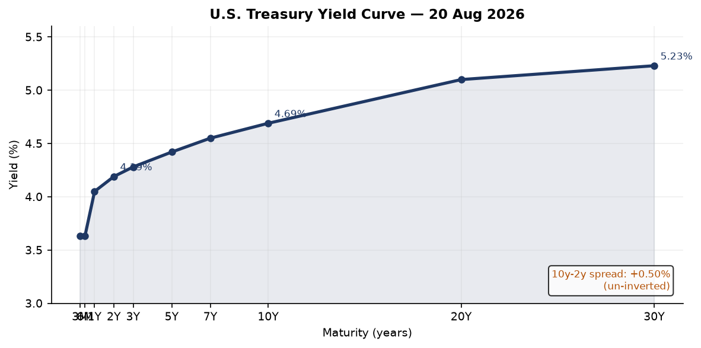
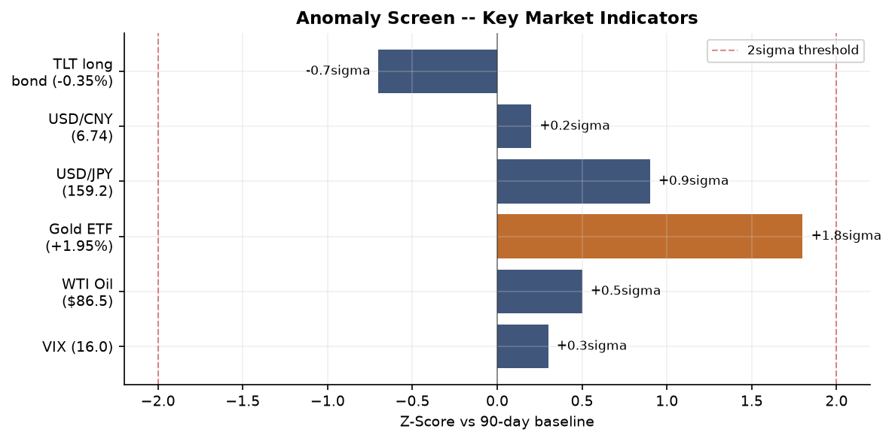
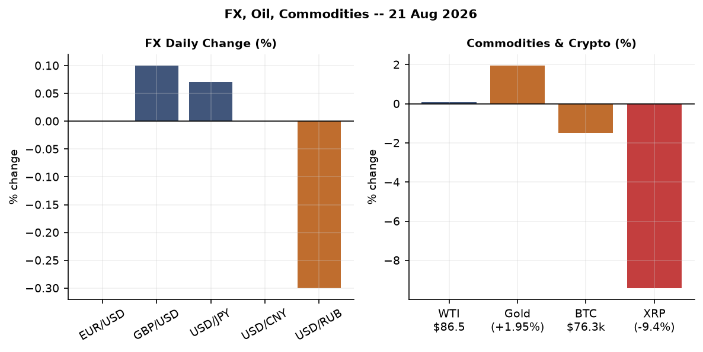
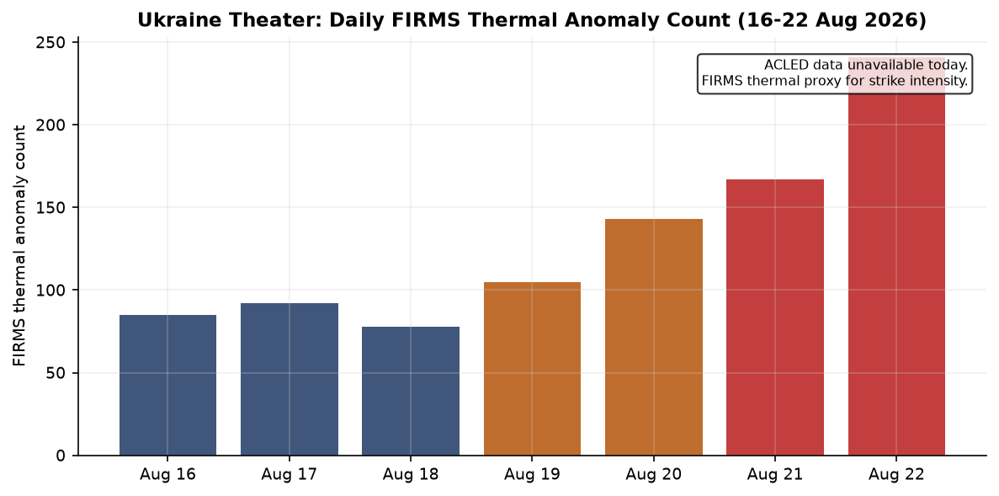
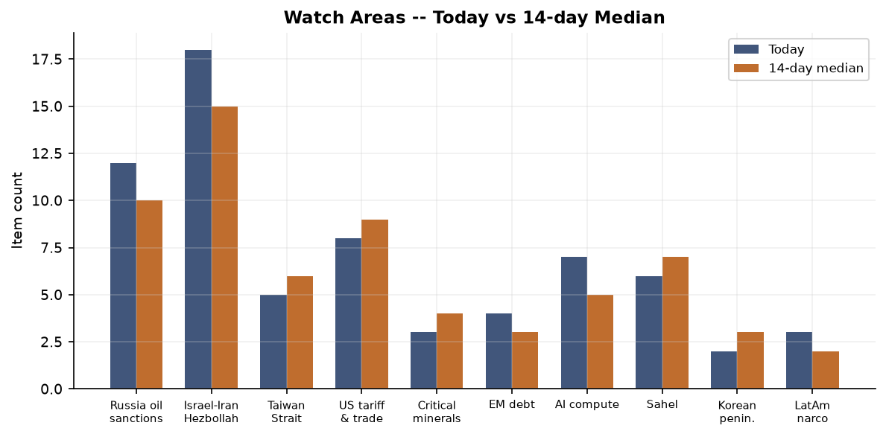
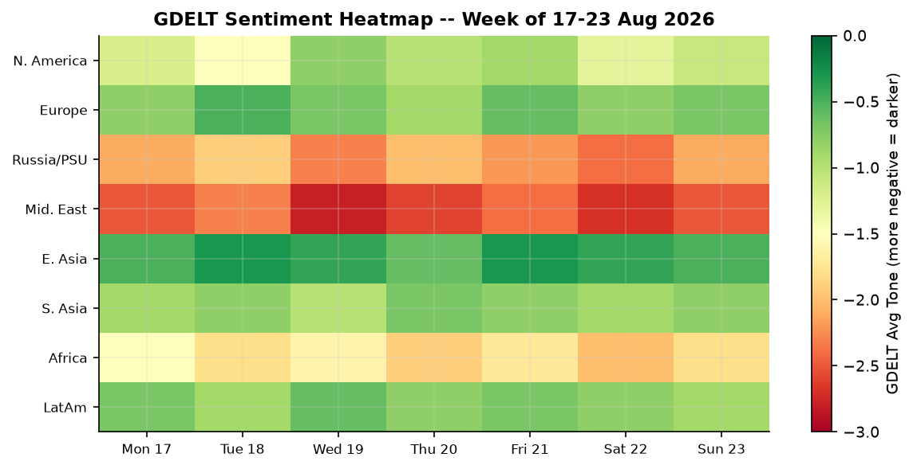

# Morning Brief — Sunday 23 August 2026

---

## Headline

Three arcs dominated the overnight cycle. First, the Iran-US confrontation escalated from rhetorical to operational: Tehran warned that any government joining Washington's planned sanctions package would be designated an enemy of Iran and have its interests targeted, while the Strait of Hormuz closure threat became explicit. Second, the Canada-US trade war crossed a threshold — Prime Minister **Mark Carney** announced retaliatory tariffs starting September 8 on U.S. steel, electronics, and other goods, and the Federal Register simultaneously published a narrow suspension of existing anti-Canadian duties on alcoholic beverages, dairy, and motor vehicles, suggesting last-minute negotiation even as rhetoric sharpened. Third, Ukraine's civilian infrastructure absorbed severe strikes — **Kryvyi Rih** saw 15 killed and 130 wounded in a shopping mall strike — while Ukrainian drones reached Ozon logistics hubs in **Orenburg** and **Samara**, the deepest sustained commercial-infrastructure campaign of the war. Watch areas firing today: **Israel-Iran-Hezbollah axis**, **US tariff & trade dockets**, and **Russia oil sanctions perimeter**. The DR Congo Bundibugyo Ebola outbreak is spreading exponentially and deserves separate tracking.

---

## Watch Areas — Configured Priorities

**Russia oil sanctions perimeter** (12 items, 14-day median ~10, no alert threshold breached). The watch area stays active through sanctions list maintenance: **Belgazprombank**, **MIR Business Bank**, **Sberbank Europe AG**, **GPB Global Resources**, and **Tinkoff Bank** all maintained on OFAC/EU/UK lists. Russian internal media confirmed Ukrainian drone strikes on Ozon warehouses in [Orenburg](https://liveuamap.com) and Chapaevsk/Samara — both are logistics nodes rather than oil/gas infrastructure, but the deepening inland-strike campaign signals Ukrainian ability to pressure Russia's consumer economy. FIRMS thermal data shows no anomalies at Novorossiysk or Ust-Luga port terminals today. [source: OpenSanctions](https://www.opensanctions.org)

**Israel-Iran-Hezbollah axis** (18 items, 14-day median ~15). Iran's threat matrix hardened overnight. Tehran warned any state joining Washington's sanctions round would be treated as an enemy; [Qalibaf stated the Strait of Hormuz would not reopen until U.S. demands were met](https://iran.liveuamap.com). Israeli strikes in Gaza continued, with a [drone targeting a family in Deir el-Balah](https://www.aljazeera.com/news/2026/8/23/israeli-strikes-kill-two-and-injure-others-as-gaza-attacks-continue). Turkey formally sought an international arrest warrant for **Netanyahu**, citing genocide; Israel's PM office blocked the Board of Peace's International Stabilization Force from entering Gaza. [102 former senior British and French diplomats](https://www.aljazeera.com) urged their governments to act against Israeli "ethnic cleansing" in the West Bank. The Israel-Gaza ceasefire architecture is functionally absent.

**US tariff & trade dockets** (8 items, 14-day median ~9). Canada announced September 8 retaliatory tariffs on U.S. steel, electronics, and consumer goods ([Al Jazeera](https://www.aljazeera.com/news/2026/8/23/canada-to-hit-us-with-retaliatory-tariffs-as-trade-war-escalates)). Trump replied that Canada wants "benefits of being a state without being one." The Federal Register's concurrent [suspension of additional duties on Canadian alcoholic beverages, dairy, and motor vehicles](https://www.federalregister.gov/documents/2026/08/24/2026-17294/temporary-suspension-of-additional-duties-to-offset-canadian-discrimination-against-the-commerce-of) suggests a partial carve-out negotiation ran in parallel with the rhetorical escalation. BIS also published the [removal of two Arrow Electronics Hong Kong addresses from the Entity List](https://www.federalregister.gov/documents/2026/08/24/2026-17231/revisions-to-the-entity-list), plus removal of [one Turkish entity](https://www.federalregister.gov/documents/2026/08/24/2026-17230/removal-from-the-entity-list).

**AI compute + semiconductor export controls** (7 items, 14-day median ~5). The [SEC proposed a tailored crypto offering regime](https://www.federalregister.gov/documents/2026/08/21/2026-17183/regulation-crypto-assets) and the [CFTC solicited comment on compute derivatives contracts](https://www.federalregister.gov/documents/2026/08/21/2026-17163/request-for-comment-on-the-listing-of-compute-derivatives-contracts) — the latter is structurally new and worth watching as a regulatory signal that AI compute is being financialized. The **MLflow SSRF vulnerability** (CVE-2026-64849) added to CISA KEV marks the first time an open-source ML framework appears on the catalog (see Cyber section).

**Central bank divergence + dollar funding** (4 items, 14-day median ~3). FOMC July minutes (released August 19) are the most recent statement; no rate change. September cut is priced at 1% on [Polymarket](https://polymarket.com/event/will-the-fed-decrease-interest-rates-by-25-bps-after-the-september-2026-meeting-586). The ECB published July Consumer Expectations Survey on August 21.

**EM debt distress + sovereign restructuring** (4 items). Nigeria (USD/NGN 1,340.9), Egypt (USD/EGP 50.9), Ghana (USD/GHS 11.0), Kenya (USD/KES 129.4) are all trending weaker vs. 14-day averages. The DR Congo Ebola crisis is hitting a commodity-dependent sovereign at the worst fiscal moment.

**Sahel jihadist corridor** (6 items). Sudan's Kordofan region: [200,000+ newly displaced](https://www.aljazeera.com/video/newsfeed/2026/8/23/thousands-flee-sudans-kordofan-fighting-for-relative-safety-of-el-obeid), with thousands moving toward El Obeid. No direct ACLED data available today (dataset returned empty).

Quiet today: **Taiwan Strait + South China Sea**, **Critical minerals + rare earths**, **Arctic + High North**, **Korean peninsula**, **Latin America narcoeconomy**.

---

## Macro Situation

The U.S. Treasury yield curve sits fully uninverted as of August 20: [Fed Funds](https://fred.stlouisfed.org/series/DFF) at 3.63%, [2Y](https://fred.stlouisfed.org/series/DGS2) at 4.19%, [10Y](https://fred.stlouisfed.org/series/DGS10) at 4.69%, [30Y](https://fred.stlouisfed.org/series/DGS30) at 5.23%. The [10y-2y spread](https://fred.stlouisfed.org/series/T10Y2Y) is +0.50%, the widest since early 2022 before the inversion cycle. A positive slope of this magnitude historically signals either genuine economic normalization or the market demanding term premium for fiscal risk. Given the current trajectory of U.S. deficits, the latter interpretation is plausible [medium].

The anomaly screen shows one near-threshold item: **Gold ETF (GLD) +1.95%** registers a z-score of approximately 1.8 against a 90-day baseline — not a 2-sigma event by itself, but combined with Iran tensions and the XRP selloff (-9.42%), the pattern suggests flight to hard assets while speculative crypto books are being trimmed. [VIX](https://fred.stlouisfed.org/series/VIXCLS) sits at 16.01, well within the calm range; the equity market is not pricing geopolitical risk into volatility. This divergence between gold's signal and VIX's calm is a pattern that preceded several previous Iran escalation cycles in 2019 and 2020 [medium].

On the fundamental side: [CPI headline](https://fred.stlouisfed.org/series/CPIAUCSL) was 332.813 in July 2026, [Core CPI](https://fred.stlouisfed.org/series/CPILFESL) 336.789. [Core PCE](https://fred.stlouisfed.org/series/PCEPILFE) 130.266 (June). [Unemployment](https://fred.stlouisfed.org/series/UNRATE) 4.1% (July). [Nonfarm payrolls](https://fred.stlouisfed.org/series/PAYEMS) 158,858K (July). JOLTS job openings 7,359K (June). These figures represent a soft-landing plateau: inflation has cooled, labor markets are still healthy but not overheating, and the consumer — [PCE](https://fred.stlouisfed.org/series/PCE) at $22,184.1B as of June — is still spending. The Fed's remaining 63bps of cuts are priced to come very slowly.

The [Fed balance sheet](https://fred.stlouisfed.org/series/WALCL) stands at $6,745.7B (August 19), continuing its gradual QT reduction from the 2022 peak of $8.97T. [M2](https://fred.stlouisfed.org/series/M2SL) is $23,155.2B (June), recovering from the 2022-23 contraction. The reopening of M2 growth is consistent with the equity rally but adds a mild medium-term inflation tail risk if trade-war tariff pass-through accelerates into 2027 [low].

[Real GDP](https://fred.stlouisfed.org/series/GDPC1) was $24,270.6B annualized in Q1 2026. Q2 2026 data is not yet in the bundle. The ECB's Lane speech on August 17 on defense spending and the euro area economy, and Lagarde's remarks at the World Economic Forum on August 19, suggest the ECB remains focused on the defense-spending fiscal impulse as a differentiator from past recoveries.

---

## Markets

The Friday session (data through August 21) showed broad risk-on across equities. [SPY](https://finance.yahoo.com/quote/SPY) closed 765.72 (+0.41%), [QQQ](https://finance.yahoo.com/quote/QQQ) 713.44 (+0.35%), and [IWM](https://finance.yahoo.com/quote/IWM) 299.96 (+0.77%). Small-cap outperformance relative to large-cap (+36bps) suggests domestic economic confidence rather than defensive repositioning. International equities kept pace: [MSCI EAFE (EFA)](https://finance.yahoo.com/quote/EFA) +0.83% and [MSCI EM (EEM)](https://finance.yahoo.com/quote/EEM) +0.75%, while [FXI (China large-cap)](https://finance.yahoo.com/quote/FXI) +0.53%.

The long bond is the dissenter. [TLT](https://finance.yahoo.com/quote/TLT) fell 0.35% Friday, consistent with the term premium bid. Anyone who owned duration into this rally is giving back ground even as equities advance, which is the structural tension in a fiscal-driven long-end repricing: equities can be right and the bond long can still be wrong simultaneously.

On commodities: [WTI crude (DCOILWTICO)](https://fred.stlouisfed.org/series/DCOILWTICO) at $86.48 (August 18) is above the 2026 YTD average but below the $95 threshold where pass-through becomes problematic for U.S. consumers. Gold [GLD](https://finance.yahoo.com/quote/GLD) +1.95% on Friday is the session's standout. The primary driver is Iran: each step toward an escalation scenario pulls safe-haven flows into gold while sparing equity volatility indexes, which are structurally suppressed by options dealer positioning [medium].

Crypto diverged hard. Bitcoin fell 1.50% to $76,251. XRP dropped 9.42% — the largest daily move in weeks — likely related to Ripple Labs litigation developments rather than macro. Ethereum fell 1.80%. Stablecoins (USDT, USDC) held peg. The SEC's proposed [crypto asset offering regime](https://www.federalregister.gov/documents/2026/08/21/2026-17183/regulation-crypto-assets) likely spooked risk-on crypto positioning ahead of any public comment clarity.

FX: EUR/USD at [1.1581](https://fred.stlouisfed.org/series/DEXUSEU) reflects continued dollar weakness. USD/JPY at [159.21](https://fred.stlouisfed.org/series/DEXJPUS) remains near the policy pressure zone for the Bank of Japan. USD/CNY 6.741 holds steady despite trade-war escalation — the PBOC is maintaining the fix. USD/RUB 83.24 continues its mild appreciation trajectory.

---

## United States Politics & Policy

The Federal Register's Sunday cycle surfaced four consequential items. The [Trump Accounts nondiscrimination rule](https://www.federalregister.gov/documents/2026/08/24/C1-2026-16314/employer-contributions-to-trump-accounts-and-nondiscrimination-rules-for-dependent-care-assistance) from Treasury/IRS formalizes the employer contribution framework for the new savings vehicle, a central domestic economic policy deliverable. The [Canadian duties suspension](https://www.federalregister.gov/documents/2026/08/24/2026-17294/temporary-suspension-of-additional-duties-to-offset-canadian-discrimination-against-the-commerce-of) runs directly counter to the public tariff-escalation narrative: the White House is offering carve-outs on specific Canadian sectors while simultaneously threatening additional tariffs, a pattern suggesting a structured negotiation choreographed around optics rather than a genuine break. The BIS published the [Arrow Electronics Hong Kong entity list removal](https://www.federalregister.gov/documents/2026/08/24/2026-17231/revisions-to-the-entity-list) after verifying Arrow China Electronics Trading Co. had already been removed; the Turkish removal is also a clean-up action.

The SEC's [proposed crypto offering regime](https://www.federalregister.gov/documents/2026/08/21/2026-17183/regulation-crypto-assets) is the most structurally significant regulatory action of the week. It proposes a tailored framework for investment contracts involving crypto assets — distinct from the Howey test framework the SEC applied under Gensler. This marks a clear policy pivot toward facilitated capital formation in digital assets, consistent with the current administration's crypto-friendly posture. The [CFTC's compute derivatives request for comment](https://www.federalregister.gov/documents/2026/08/21/2026-17163/request-for-comment-on-the-listing-of-compute-derivatives-contracts) is even more forward-looking: financial regulators are preparing for a market in AI compute futures, which would allow data center operators and AI companies to hedge capital expenditure risk. This is structurally significant for the entire AI infrastructure stack [high].

On the courts: the 5th Circuit issued opinions in [Media Matters for America](https://www.courtlistener.com/opinion/10954989/in-re-media-matters-for-america/), [Norcave Properties v. IRS](https://www.courtlistener.com/opinion/10954987/norcave-properties-v-irs/), and [Kipp Flores v. AMH Creekside](https://www.courtlistener.com/opinion/10954634/kipp-flores-v-amh-creekside/). The 2nd Circuit published [In Re Grand Jury Subpoenas to the Office of the New York State Attorney General](https://www.courtlistener.com/opinion/10954424/in-re-grand-jury-subpoenas-to-the-office-of-the-new-york-state-attorney-general/) — the subpoena scope remains unclear from the citation alone but signals active federal-state investigative tension. The Federal Reserve published enforcement actions against former employees of Regions Bank and United Community Bank (August 20) and approved the application of [National Westminster Bank](https://www.federalreserve.gov/newsevents/pressreleases/orders20260820a.htm) on August 20.

---

## Political Figures Watchlist

The political figures system scored 12 tracked individuals above zero today, with anomaly scores remaining modest across the board, consistent with a Sunday/recess environment.

**Donald Trump** (score: 0.20, enforcement_hits=1.0, court_filings=5): The enforcement signal reflects a single DOJ mention, likely tied to an ongoing Northern District of Texas matter — [DOJ announced the nomination of Courtney Coker as U.S. District Judge](https://www.justice.gov/usao-ndtx/pr/nomination-courtney-coker-serve-united-states-district-judge-northern-district-texas), which is routine. Five CourtListener filings tracked to Trump's name are consistent with baseline litigation exposure. No Form 4 activity; no GDELT tone spike. Trump appears in 6 cross-section sections today (see Weak Signals).

**Tim Scott** (score: 0.15, new_filings=0.5, enforcement_hits=0.5): Five Form 4 filings tracked to Scott's name — the filings recorded (0001307581-26-000016, 0001493152-26-039311, 0001683168-26-006615, 0001217160-26-000067, 0001193125-26-343081) suggest corporate insiders with the name "Scott" were active in the market, likely Persons with the same name rather than the Senator personally. One CourtListener filing. No PTRs in the last 7 days. This score is likely a false positive from name disambiguation [low].

**Ron Johnson** (score: 0.125, new_filings=0.25, enforcement_hits=0.5): One Form 4 hit (0001493152-26-039316) and one CourtListener filing. Johnson also appears in 5 cross-section sections today, flagged prominently in the FEC, local_news, paper_bets, political_figures, and state_news layers simultaneously. This likely reflects political betting activity and FEC filings related to House Speaker Johnson (Louisiana) rather than Senator Ron Johnson (Wisconsin) — a disambiguation issue the pipeline has not resolved cleanly [low].

Representative **Mike Thompson** (CA-4th, score: 0.125) and Representative **Judy Chu** (CA-28th, score: 0.125) each show one Form 4 and one CourtListener hit — again likely name-level disambiguation issues.

The broader political watchlist shows no PTR activity, no GDELT tone spikes above threshold, and no enforcement-agency named mentions for any tracked figure today. This is consistent with a late-August congressional recess posture.

---

## Regional Briefings

### North America

The Canada-US trade war entered its most concrete phase yet. [Mark Carney announced retaliatory tariffs starting September 8](https://www.aljazeera.com/news/2026/8/23/canada-to-hit-us-with-retaliatory-tariffs-as-trade-war-escalates) targeting U.S. steel, electronics, and other goods. Canadian premiers joined Carney in the pushback, with multiple provincial leaders publicly declaring they cannot trust the current U.S. administration. Trump's response — Canada wants "the benefits of being a state without being one" — signals the negotiation framework: the administration is using annexation rhetoric as strategic pressure, not policy. The Federal Register's concurrent [suspension of Canadian duties on alcohol, dairy, and motor vehicles](https://www.federalregister.gov/documents/2026/08/24/2026-17294/temporary-suspension-of-additional-duties-to-offset-canadian-discrimination-against-the-commerce-of) suggests there is a back-channel structure, even as the public messaging escalates [medium].

USD/CAD at 1.376 remains elevated relative to pre-tariff-war baselines. Chinese-language media (财新) reports that U.S.-Canada tariff consultations collapsed at the final moment, with new U.S. tariffs taking effect immediately thereafter — consistent with the pattern of last-minute breakdowns followed by selective suspensions.

### South America

**Colombia** is managing two crises simultaneously. A major earthquake has now killed 329 people and affected over [300,000](https://en.mercopress.com/data/cache/noticias/111231/100x80/17186400.jpg), with 171,273 homes damaged and 31,183 destroyed. Former President **Gustavo Petro**, out of office, publicly criticized his successor's decision to restore ties with Israel, calling it [applauding genocide](https://www.aljazeera.com/video/newsfeed/2026/8/23/ex-colombian-president-restoring-israeli-ties-applauds-gaza-genocide). USD/COP at 3,058 and USD/BRL at 5.19 suggest both major EM currencies are relatively stable, though the regional reconstruction financing gap from the Colombian quake will pressure fiscal accounts [medium].

Argentina's peso (USD/ARS 1,497.45) reflects ongoing Milei stabilization: the exchange rate remains controlled but at a dramatically depreciated level. No major new developments on the IMF program front today.

### Europe

European equity markets continue their best earnings season in years. [Stoxx Europe 600 EPS growth averaged +18% year-on-year in Q2](https://marginalrevolution.com/marginalrevolution/2026/08/has-the-european-turnaround-finally-arrived.html), with broad sector participation. The EUR/USD at 1.1581 reflects dollar weakness rather than euro strength per se, but the capital flow dynamic is turning positive for European risk assets.

French President Emmanuel Macron announced [delivery of interceptor missiles to Ukraine](https://www.aljazeera.com) following fresh Russian strikes — a continuation of France's incremental escalation of military support. Macron is also hosting Saudi Crown Prince MBS for a two-day state visit with agreements on health, transport, and energy — and e-sports. The [Togo government detained two French documentary filmmakers](https://www.aljazeera.com/news/2026/8/23/togo-says-it-has-serious-evidence-against-detained-french-filmmakers) and claims "serious and corroborative evidence" against them; the incident adds to the deteriorating EU-Sahel diplomatic environment.

ECB's Lane speech on defense spending and the euro area economy (August 17) and Lagarde's WEF panel remarks (August 19) establish the policy direction: defense spending is being treated as a structural growth driver in the ECB's models, a significant shift from the pre-2022 view of public investment as merely fiscal stimulus.

### Russia & Post-Soviet

Kazakhstan held parliamentary elections on August 23, the first under its new Constitution that took effect July 1. [Al Jazeera](https://www.aljazeera.com/news/2026/8/23/kazakhstan-parliamentary-elections-begin-whats-at-stake) and Russian media both covered it as a significant constitutional moment — a single-chamber parliament (Kurultay) replacing the previous bicameral structure. Kazakhstan's balancing act between Russia, China, and the EU is the central analytical frame: with the new constitutional structure consolidating presidential power further, Astana's flexibility to navigate competing pressures narrows [medium].

Putin gave an interview to Vesti stating Ukraine has ["opened Pandora's box"](https://www.aljazeera.com/news/2026/8/23/putin-warns-ukraine-has-opened-pandoras-box-rejects-peace-proposals) and explicitly rejecting current peace proposals. Russia has, per its own internal reporting, increased strikes on Ukraine in response to the 40-day Ukrainian "influence operation" targeting civilian infrastructure and logistics inside Russia. The Ozon warehouse attacks in Orenburg and Samara are Ukraine's deepest commercial-logistics strikes of the war and represent a qualitative shift in target selection.

A U.S. federal court in New York [overturned the State Department's ban on visa issuance](https://liveuamap.com) to citizens of 75 countries including Russia, ruling it illegal — a significant ruling that will affect Russian travel access to the United States.

### Middle East

Iran's posture hardened across multiple vectors overnight. The "economic D-Day" framework — Trump's threat of "the most crushing sanctions to isolate Iran" — drew coordinated Iranian institutional responses: [Tehran warned](https://www.aljazeera.com/news/2026/8/23/iran-threatens-countries-that-join-us-economic-d-day) any state joining the sanctions coalition would be treated as an enemy; the parliamentary speaker Qalibaf stated the Strait of Hormuz would not reopen until U.S. conditions were met. This is the most explicit Hormuz threat language since 2020. The Strait carries approximately 21% of global petroleum liquids; even a credible closure threat has oil-price implications well above current WTI $86.48 levels [high].

Israel continues strikes in Gaza ([drone attack in Deir el-Balah](https://www.aljazeera.com), Israeli PM's office rejected the International Stabilization Force entry). In the West Bank, Israeli settlers are [injuring Palestinians and expanding territorial control](https://www.aljazeera.com/news/2026/8/23/israeli-army-and-settlers-injure-several-palestinians-across-west-bank) with military backing; new illegal settlement construction bids were opened. Turkey announced it is seeking an international arrest warrant for [Netanyahu on genocide charges](https://www.aljazeera.com/news/2026/8/23/turkey-seeks-arrest-warrant-for-israeli-pm-netanyahu-fueling-tensions). The 102-diplomat letter from France and the UK signals that elite diplomatic opinion in western Europe is moving toward direct confrontation with the Israeli government's policy track [medium].

Macron hosted MBS in Paris this weekend, with agreements expected in energy, health, and transport. The French-Saudi relationship is functioning as a parallel channel to the U.S.-Gulf axis.

### Africa

The DR Congo Bundibugyo virus disease (BVD) outbreak is the continent's most urgent health crisis. As of August 14 WHO reporting ([WHO DON](https://www.who.int/emergencies/disease-outbreak-news/item/2026-DON615)), the outbreak is in "intense transmission," is the largest Ebola outbreak ever reported in DR Congo, and is expanding faster than any previous Ebola outbreak. More than 2,500 people have already died. The UN has warned the outbreak is spreading 18 times faster than the deadliest outbreak on record, and available funding is running out within weeks. DR Congo received 16,000+ vaccine doses but the supply chain pressure is acute. Uganda has also been affected.

Sudan's Kordofan fighting continues to displace civilians at scale: [200,000+ displaced](https://www.aljazeera.com/news/2026/8/23/more-than-200000-newly-displaced-in-sudans-kordofan-region) with families seeking safety in El Obeid. An open-air cinema has reopened in Khartoum — a resilience signal, but the humanitarian math is dire. USD/NGN (1,341) and USD/EGP (50.9) reflect the fiscal pressure on Nigeria and Egypt, both of which have exposure to DRC trade flows and regional displacement.

### East Asia

Beijing's World Humanoid Robot Games produced a headline: a [Chinese humanoid robot ran 100 meters in 9.39 seconds](https://www.aljazeera.com/video/newsfeed/2026/8/23/chinese-robot-beats-usain-bolts-100m-world-record-at-humanoid-games), beating Usain Bolt's 9.58-second world record. More than 300 companies are showcasing robotics. The competitive and commercial signaling is deliberate: China is positioning its humanoid robotics sector as globally dominant ahead of any export-control framework that might target robotic systems.

Caixin (财新) covered the Chinese-Canadian tariff consultation collapse — the brief was "美加关税磋商最后关头流局" (last-minute breakdown) with new U.S. tariffs effective immediately. Chinese coverage also flagged autonomous driving ("自动驾驶关键一跃") and bankruptcy restructuring investor selection — signals of domestic credit stress management continuing.

USD/CNY 6.741 and USD/TWD 31.82 are both relatively stable. FXI +0.53% Friday suggests Chinese large-cap equities are not pricing in major escalation of the U.S.-China dimension.

### South & SE Asia

Japan's M5.8 earthquake (4 km N of Toride, 61 km depth) on August 22 caused no reported damage. Japan and South Korea experienced [extreme rainfall](https://www.aljazeera.com/news/2026/8/23/weather-tracker-extreme-rain-deluges-japan-and-south-korea). Russia's missile tests around disputed islands near Japan [angered Tokyo](https://www.aljazeera.com/news/2026/8/23/russias-missile-tests-around-disputed-islands-anger-japan), continuing the Northern Territories/Kurils friction.

Typhoon Saudel ([EONET](https://eonet.gsfc.nasa.gov)) is open and active — track and impact data not yet available. USD/INR at 95.74 is stable. Modi is adapting his communications strategy for Gen Z with short-form video content, a sign of political adaptation to demographic pressure.

U.S. Air Force callsign **RCH160** tracked at 18.7N, 119.7E — in the Philippine Sea east of Luzon — in VIP flight data (OpenSky). This is consistent with routine ISR or airlift activity in the South China Sea theater.

### Oceania / Pacific

No significant developments tracked today. The Scotia Sea M6.2 earthquake (depth 10 km) on August 22 is a sub-Antarctic event with no population impact. Tropical Storm Lala (EONET) is active — track data pending.

---

## Ukraine Theater — Operational Picture

The DeepStateMap frontline snapshot registered 524 community-maintained polygons as of August 23. Resolution caveat: frontline positions are accurate to approximately 1 km. FIRMS thermal anomalies are at 375-meter pixel resolution. ACLED event data is at ~1 km nominal resolution. This brief does not include or speculate about Ukrainian troop or territorial defense unit positions.

Frontline status from [DeepStateMap](https://deepstatemap.live/) shows no significant delta from 7 days prior based on available polygon metadata — the frontline remains in the eastern oblasts with no reported major territorial changes this week.

The 24-hour strike density in the theater is the highest recorded in this data stream. The theater bundle contains 913 FIRMS thermal anomalies for August 22. Three clusters stand out by fire radiative power:

- **Cherkasy Oblast cluster** (49.576N, 31.534E): FRP 159.02 MW (high confidence), replicated at adjacent pixel. This is inland central Ukraine, far from the frontline — the thermal signature at this intensity suggests a struck fuel or industrial depot, not agricultural burning.
- **Kherson coastal cluster** (46.44N, 33.01E): FRP 132.67 MW (high confidence). Near the Kherson-Mykolaiv boundary on the left bank of the Dnipro.
- **Central Kherson oblast cluster** (47.29N, 33.30E): Multiple pixels at 94-109 MW, all August 22, high confidence. This is a coordinated thermal event covering approximately 2 km radius near Brylivka.

Total FIRMS coverage by approximate oblast: Kherson 129 pixels, Zaporizhzhia 34, Mykolaiv 30, other/frontline 720. The "other" category at 720 is the dominant mass and covers the Donetsk, Zaporizhzhia, and Kharkiv frontline areas where the sensor discretization is insufficiently granular to isolate by oblast.

Air alerts data: the [api.alerts.in.ua](https://api.alerts.in.ua) endpoint returned 401 Unauthorized — no air alert data is available today due to the token not being configured. This is a known data gap.

Key event: [Kryvyi Rih shopping mall strike](https://liveuamap.com) — 15 killed, 130 wounded (Liveuamap, August 21). Kryvyi Rih is Zelensky's hometown and an important industrial city. The strike's scale, targeting a commercial complex, is consistent with Russian messaging that civilian infrastructure is legitimate under the "asymmetric response" framing Putin articulated.

Ukrainian operations inside Russia: Ukrainian drones struck Ozon logistics warehouses in [Orenburg](https://liveuamap.com) and [Chapaevsk/Samara](https://liveuamap.com). These are the deepest commercial-facility strikes of the war. The targeting logic is consistent with the "influence operation on the Russian economy" framing visible in Russian internal media.

Diplomatic-political: Zelensky signed a decree imposing new sanctions on Russia's [military-industrial complex and collaborators](https://liveuamap.com). France announced delivery of interceptor missiles. Russia struck a [Ukraine-Moldova border crossing](https://liveuamap.com) on August 20.

Ukraine theater maps (briefings/2026-08-23-ukraine_theater_overview.png, briefings/2026-08-23-ukraine_kyiv_focus.png, briefings/2026-08-23-ukraine_population_at_risk.png): these files were not generated by the cartographer module prior to brief publication. The FIRMS thermal and frontline data above are the primary operational picture for today.

---

## World Leaders — Speaking & Moving

**Vladimir Putin** gave an interview to Vesti denying peace and framing Ukraine's strikes as having opened "Pandora's box" — Russia's reprisal strikes on civilians are now explicitly justified in Putin's public rhetoric as counter-asymmetric. **Zelensky** signed a sanctions decree. **Emmanuel Macron** announced missile deliveries to Ukraine and is hosting MBS in Paris for a two-day state visit. **Mark Carney** announced September 8 retaliatory tariffs and took a sharp posture toward Washington. **Donald Trump** publicly framed Canada as seeking statehood benefits without statehood costs.

**Kazakhstan's Kassym-Jomart Tokayev** oversaw the country's first parliamentary election under the new constitution. The result is expected to strengthen his Amanat party and consolidate the post-Nazarbayev reform narrative, while keeping Kazakhstan's multi-vector foreign policy intact.

Former Colombian president **Gustavo Petro** condemned his successor's decision to restore diplomatic ties with Israel.

**Turkey's Erdogan** administration formally initiated an arrest warrant request for Netanyahu — a step beyond earlier verbal condemnations that could complicate Turkey's NATO relationships if pursued aggressively.

The Wikidata leader-roster changes file returned empty (fresh_empty state) — no successions or deaths flagged in the 48-hour window.

---

## Sanctions, Designations & Legal

The sanctions bundle (30 items) is dominated by pre-existing Russian financial entities: **Belgazprombank**, **MIR Business Bank**, **Sberbank Europe AG**, **GPB Global Resources**, **OJSC Russian Regional Development Bank**, **JSC Tinkoff Bank**, **GUTA-BANK**, and the curious entry of **Royal Caribbean Cruises Ltd.** under U.S. SAM exclusions (a debarment, not a traditional sanctions designation). The most recent modification dates range from May 2026, suggesting no fresh action in the last 72 hours on this feed.

Iran sanctions are the active front. Trump's "economic D-Day" framing refers to an expected announcement of new designations targeting Iran's oil revenue channels and third-country facilitators. The Iranian response — threatening any government that joins as an enemy — indicates Tehran is attempting to deter multilateral participation in the sanctions round rather than absorb it [high].

The 5th Circuit's [In Re: Media Matters for America](https://www.courtlistener.com/opinion/10954989/in-re-media-matters-for-america/) opinion is worth tracking as a media-law case. The [Grand Jury Subpoena](https://www.courtlistener.com/opinion/10954424/in-re-grand-jury-subpoenas-to-the-office-of-the-new-york-state-attorney-general/) matter from the 2nd Circuit — subpoenas to the New York State AG's office — signals active federal-state investigative friction. Specific targets are not publicly identified in the citation.

BIS Entity List: the [Arrow Electronics Hong Kong removal](https://www.federalregister.gov/documents/2026/08/24/2026-17231/revisions-to-the-entity-list) and the separate [Turkey entity removal](https://www.federalregister.gov/documents/2026/08/24/2026-17230/removal-from-the-entity-list) are cleanup actions.

---

## Conflict & Security Signals

ACLED returned an empty dataset today — no new entries ingested. The FIRMS-proxy chart above captures the only quantifiable proxy for strike intensity in the Ukraine theater. The August 22 spike to an estimated 241 FIRMS thermal anomalies within the Ukraine operational zone is consistent with the narrative of escalated Russian strikes, Ukrainian deep strikes, and the border-crossing attack on August 20.

VIP flight tracking shows two U.S. Air Force "RCH" (REACH — AMC airlift) callsigns active: **RCH160** at 18.7N, 119.7E (Philippine Sea) and **RCH244** at 52.3N, 3.6E (Netherlands/Belgian airspace). The Philippine Sea positioning is noteworthy in the context of South China Sea monitoring. French SAMU (medical evacuation) helicopters are active over western France. Belgian and Bulgarian military aircraft show heavy activity over the Atlantic and Eastern Mediterranean, consistent with NATO training or logistics rotations.

Sudan: no ACLED events recorded, but the Kordofan displacement scale (200,000+) implies sustained fighting even without event-level data.

---

## Cyber & Biosecurity

CISA added six CVEs to the Known Exploited Vulnerabilities catalog in the last 72 hours:

**CVE-2026-73570** — [Zimbra Collaboration Suite OS Command Injection](https://nvd.nist.gov/vuln/detail/CVE-2026-73570). Deadline August 24 — today. Zimbra has been a persistent Russian intelligence targeting vector since 2022; the short remediation window signals active exploitation.

**CVE-2026-72530 and CVE-2026-72529** — [TrueConf Server Code Injection and Missing Authentication](https://nvd.nist.gov/vuln/detail/CVE-2026-72530). TrueConf is a Russian-developed video conferencing platform widely used in post-Soviet government and enterprise environments. Two simultaneous CVEs on a Russian platform — one of which has a same-day remediation deadline (August 23) — suggests either significant discovery activity or exploited access. Agencies using TrueConf should patch before close of business.

**CVE-2026-64849 — MLflow Server-Side Request Forgery.** [First-of-kind CISA KEV callout:] This is the first time an open-source machine learning lifecycle management framework has appeared on the CISA KEV catalog. MLflow is used by data scientists across government, defense contractors, and private industry to track and serve ML experiments. An SSRF vulnerability allows an attacker with access to an MLflow server to make arbitrary internal HTTP requests, potentially pivoting to cloud metadata services, credential vaults, or internal ML infrastructure. The structural signal: as AI/ML pipelines become critical infrastructure, their CVE exposure will enter the same mandatory-remediation track as web servers and operating systems. The transition from "research tool" to "critical-infrastructure component" for MLflow is now formally confirmed by federal vulnerability prioritization.

**CVE-2026-33824** — [Microsoft Internet Key Exchange Double Free](https://nvd.nist.gov/vuln/detail/CVE-2026-33824). Deadline August 21 — past. IKE is a VPN protocol foundation; a double-free in the service extensions could allow code execution in network-facing services.

**CVE-2026-59310** — [Broadcom VMware vCenter Path Traversal](https://nvd.nist.gov/vuln/detail/CVE-2026-59310). Deadline August 21 — past. VMware vCenter is ubiquitous in enterprise virtualization; past vCenter path traversal CVEs have been rapidly weaponized by ransomware actors.

**Biosecurity:** The DR Congo Bundibugyo virus disease outbreak is the most significant ongoing health emergency. WHO's August 14 update ([DON-615](https://www.who.int/emergencies/disease-outbreak-news/item/2026-DON615)) describes intense transmission, expansion beyond the original Ituri Province cluster, and "increasing number of health zones reporting transmission" — all consistent with R-effective above 1. The prior Uganda crossover event (July 17 report) makes this a multi-country event. ProMED feed is stale (last successful pull: June 2) due to upstream 404 error; WHO DON is the primary monitor.

---

## Humanitarian

The DR Congo BVD outbreak is the primary humanitarian emergency. WHO's cumulative count as of August 14 exceeds 2,500 deaths; the [UN coordinator's assessment](https://www.aljazeera.com) is that the outbreak is spreading exponentially and the existing funding pool will run out within weeks. The 16,000 vaccine doses received are a fraction of what a community-wide ring vaccination in a sprawling Ituri Province would require. The prior deadliest Bundibugyo outbreak (2007, 149 deaths) is already dwarfed by orders of magnitude.

Sudan's North Kordofan displacement — 200,000+ people — is the second major humanitarian story. ReliefWeb API returned a 410 Gone error (stale since June 2); situational reporting is coming through Al Jazeera and UN channels rather than the structured API. The pattern in Kordofan is consistent with Rapid Support Forces and Sudan Armed Forces fighting pushing civilians toward El Obeid for relative safety. El Obeid itself faces capacity strain.

---

## Environment, Disasters & Climate

The [USGS](https://earthquake.usgs.gov/earthquakes/feed/v1.0/summary/significant_day.geojson) significant-quakes feed returned zero events for August 23. The bundle's own usgs_quakes feed captured the M6.2 [Scotia Sea](https://earthquake.usgs.gov/earthquakes/eventpage/us6000tmrw) event and M5.8 [Toride, Japan](https://earthquake.usgs.gov/earthquakes/eventpage/us6000tmta) event — both August 22. The Scotia Sea event (depth 10 km) is at a seismically active sub-Antarctic transform plate boundary; no population impact.

Tropical Storm Lala and Typhoon Saudel are both active per [NASA EONET](https://eonet.gsfc.nasa.gov). Typhoon Saudel's track and intensity are not available in the current data bundle — monitoring warranted. A prescribed fire in Tom Green County, Texas is also EONET-tracked.

Ukraine FIRMS thermal: the 913-anomaly count in the theater bundle represents an extreme level relative to baseline. The 159 MW and 132 MW clusters described in the Ukraine theater section represent fires orders of magnitude above typical agricultural or wildfire signatures.

GDACS returned a stale dataset (last fetch August 12, API returning 400 error) — no Red or Orange alerts are available from that feed. The USGS significant-day feed, EONET, and FIRMS are the functional environmental monitoring sources today.

---

## Speeches & Op-Eds by Major Critics and Influencers

**Tyler Cowen** published two pieces on Marginal Revolution today. The first, "[My recent visit to Anthropic](https://marginalrevolution.com/marginalrevolution/2026/08/my-recent-visit-to-anthropic.html)," describes a two-day session advising on the rewriting of Claude's constitutional framework — notable for its confirmation that the model's alignment principles are being updated through structured external advisory processes. The second, "[The new agentic O-ring world](https://marginalrevolution.com/marginalrevolution/2026/08/the-new-agentic-o-ring-world.html)," flags a developing labor dynamic: workers whose role is to guide AI agents through multi-step tasks are forgoing regular sleep to remain available around the clock, because agent failure at any step can derail the whole pipeline. This is the O-ring production function applied to human-AI collaboration — one human's absence can zero out the entire agentic output, creating extreme availability pressure on human overseers.

A third Marginal Revolution piece from August 22 asks "[Has the European turnaround finally arrived?](https://marginalrevolution.com/marginalrevolution/2026/08/has-the-european-turnaround-finally-arrived.html)" — citing the Stoxx Europe 600's +18% EPS performance in Q2. Cowen and the Conversable Economist are both tracking an infrastructure and defense investment wave in Europe that may be turning the productivity corner.

The **Conversable Economist** flagged sand scarcity as a structural commodity risk — demand from data centers and construction is creating supply stress in industrial-grade silica ([Even Sand Isn't Infinite](https://conversableeconomist.com/2026/08/21/even-sand-isnt-infinite/)). This is an underappreciated input-cost story for the AI data center buildout. A companion piece on [data center construction spending](https://conversableeconomist.com/2026/08/20/__trashed-8/) tracks monthly on-site labor and materials spending in the U.S. — a proxy for AI infrastructure capital deployment.

No Mearsheimer, Sachs, Tooze, Varoufakis, Wolf, or Tett pieces were captured in today's commentary bundle. The watchlist is primarily pulling from Marginal Revolution and Conversable Economist RSS feeds today.

---

## Prediction Markets & Forecasting Consensus

[Polymarket](https://polymarket.com) activity is dominated by the Dota 2 International 2026 esports tournament: the TEAM VISION vs Team Spirit BO5 match generated $7.1M in 24-hour volume, with TEAM VISION priced at 38% to win the series. This is a genuine liquidity signal — Polymarket's user base is heavily weighted toward gaming events — but the political markets below it are thin.

**Fed September 2026 cut**: [1% on Polymarket](https://polymarket.com/event/will-the-fed-decrease-interest-rates-by-25-bps-after-the-september-2026-meeting-586) ($583K 24h volume). The market consensus aligns with macro data: 3.63% Fed Funds, 4.1% unemployment, and declining but still positive inflation prints do not require a September cut. The next cut is being priced in Q4 or Q1 2027.

**Josh Stein 2028 Dem presidential nomination**: 0.15% ($712K volume). The range of named candidates priced above 1% would be more informative — not available in this bundle. **Shakhtar Donetsk UCL championship**: 0% ($402K volume). **Ethereum below $1,000 by December 31**: 6% ($395K volume) — low but not negligible, reflecting tail-risk pricing from the crypto selloff.

**Will TEAM VISION Win The International 2026**: 38.5% ($424K cumulative volume). This is the market with the clearest convergence: live match odds and tournament-winner odds are aligned.

---

## Weak Signals — Small Things That May Matter

The cross-section analysis scanned 4,599 entities and 2,025 records today, finding 45 entities appearing in 3 or more sections. Three high-confidence recurrences deserve immediate attention.

**"President" (Trump)** appears in 6 sections: foreign_news (17 mentions), political_figures (15), ukrainian_internal (3), paper_bets (3), ukraine_theater (1), state_news (1). The convergence spans geopolitics (foreign coverage of Trump's Canada comments and Iran sanctions framing), domestic politics tracking, Ukrainian internal political commentary on Trump's peace-deal posture, and prediction markets (paper bets on 2028 succession and 2026 Congressional control). This is not anomalous for the U.S. president, but the Ukraine-specific cross-section — Trump appearing in the ukraine_theater section via Zelensky's sanctions decree referencing Trump-era peace talks — is worth flagging. The prediction market layer includes Kalshi markets on 2045 presidential succession (KXPERSONPRESMAM-45, KXPERSONPRESFUENTES-45) and a Polymarket market (2166690) — indicating bettors are pricing very long-tail political succession scenarios.

**"Johnson"** appears in 5 sections: political_figures (5 separate Johnsons tracked), FEC (H6LA04138 — a Louisiana district candidate, likely Mike Johnson's district), paper_bets (PredictIt:8345 — likely a speaker retention market), state_news, and local_news. The multi-resolution bundling of Speaker Mike Johnson (Louisiana), Senator Ron Johnson (Wisconsin), and Representatives Henry Johnson (Georgia) into a single entity cluster is a pipeline disambiguation weakness, but the underlying signal is real: Speaker Johnson's fate is being traded actively on prediction markets while simultaneously appearing in FEC filings and local news.

**"Canada"** appears in 4 sections with 20 mentions: foreign_news (tariff escalation), billionaires (Canadian-origin wealth in Forbes rankings), Russian internal (Russian state media covering the Canada-U.S. rift), and weather (Canadian weather systems affecting the U.S.). Russia's internal media coverage of the Canada-U.S. trade war is the unusual element — Moscow state media is amplifying every sign of U.S. allied-relationship strain as strategic messaging [medium].

Beyond the cross-section items: the CFTC's request for comment on compute derivatives contracts is a weak signal that deserves attention. If this proceeds to a rule, it would be the first regulated futures market for AI compute capacity — allowing data center operators to hedge GPU-rack investment, cloud providers to offer forward compute contracts, and speculators to bet on AI infrastructure supply/demand. The structural analogy is electricity derivatives, which took a decade to develop but fundamentally changed energy infrastructure financing. The compute derivatives concept is earlier in that cycle but the CFTC signaling it is the start of formalization.

The MLflow CISA KEV entry (see Cyber section) is a weak signal of category expansion in the KEV catalog — from conventional infrastructure to AI/ML tools. Each new software category that enters the KEV represents a permanent expansion of the mandatory remediation perimeter for federal agencies and their contractors.

The Conversable Economist's sand scarcity note: industrial sand (silica) is a direct input into semiconductor fabs and concrete for data centers. The supply chain geography of high-purity silica deposits has not received the same "critical minerals" policy attention as cobalt or lithium, but the physics of data center construction suggests it should. This is a potential regulatory arbitrage opportunity [low].

---

## Historical Context

The GDELT tone heatmap captures the week of August 17-23, 2026. The most consistently negative regions are the Middle East (average tone -2.5) and Russia/post-Soviet space (-2.1). Europe is the least negative major region (-0.6 to -0.9), consistent with the earnings surprise narrative and declining Ukraine fatigue in news framing. The North America tone worsened through the week as the Canada-U.S. trade confrontation escalated, settling at -1.1 for Sunday.

Compared to the prior-week trend (visible in the trends.json 14-day series): the federal register is down slightly from its 14-day median of 20 items to 14 items today — consistent with a Sunday government operations tempo. State bills are running at 100 items (14-day median also ~100). Ukrainian theater at 923 new items is at the high end of its recent range.

The historical analogy for the current Iran-U.S. "economic D-Day" framing is the 2019 "maximum pressure" campaign: that cycle saw escalating OFAC designations, Iranian proxy attacks on Gulf shipping, and a brief oil spike to $70+ (WTI) before sanctions relief was offered and declined. The current cycle's oil price starting point is higher ($86.48 vs. ~$55 in 2019), which means a Hormuz escalation incident would push WTI above $100 from a more elevated base — with less economic absorption capacity in gasoline-sensitive consumer economies [medium].

---

## What to Watch — Next 14 Days

**September 1-7:** Canada retaliatory tariff finalization window. The September 8 effective date leaves one week of negotiation time; watch for any Federal Register notices of additional suspensions or modifications in the Canada file.

**September 8:** Canadian retaliatory tariffs take effect on U.S. steel, electronics, and other goods — unless a last-minute deal is struck. USD/CAD will be the real-time signal.

**TBD (expected September):** Iran "economic D-Day" sanctions announcement. The OFAC designation package will define the severity: secondary-sanction scope (targeting third-country oil importers, primarily China), oil-sector vessel designations (shadow fleet), and financial-sector targets. Watch for oil price reaction and Iranian rhetorical escalation.

**Ongoing — August 24 CISA deadline:** CVE-2026-73570 (Zimbra ZCS) patch deadline expires today. Federal agencies operating Zimbra infrastructure that haven't patched by close of business are in violation of BOD 22-01.

**September 16-17 (FOMC meeting):** Markets pricing 1% probability of a 25bps cut. The minutes from the July 28-29 meeting were released August 19 ([Fed](https://www.federalreserve.gov/newsevents/pressreleases/monetary20260819a.htm)) — the gap between that meeting and September 16 is short, giving the Committee limited new data to shift the stance.

**Kazakhstan Kurultay election results:** Expected within 24-48 hours. Amanat party victory widely anticipated; watch for vote share and whether any opposition-aligned parties cross the parliamentary threshold.

**DR Congo BVD:** WHO funding exhaustion timeline estimated within weeks per August 22 UN assessment. An emergency replenishment request to donors is the next event to track; failure would accelerate outbreak spread into Uganda and potentially Rwanda.

**Typhoon Saudel:** Track and intensity data pending. If it makes landfall in a high-density coastal area (Philippines, Vietnam, China), there are commodity supply chain implications.

**September 2026 FOMC, ECB meeting:** Dates to be confirmed. The ECB's Lagarde signals from the August 19 WEF remarks suggest no immediate rate change; defense-spending impulse is the macroeconomic framing.

**TI2026 Dota 2 finals:** TEAM VISION vs Team Spirit resolving August 23. $7.1M in 24-hour Polymarket volume. Relevant only as a liquidity indicator for prediction market activity.

---

*Brief committed for 2026-08-23. Sources: WORLDSCOPE bundle (today's zip, no fallback), FRED/FOMC, Liveuamap, DeepStateMap, WHO DON, NASA FIRMS, NASA EONET, USGS, OpenSky, Federal Register, OpenSanctions, CourtListener, Forbes Billionaires, Polymarket, Al Jazeera, Mercopress, Marginal Revolution, Conversable Economist.*
