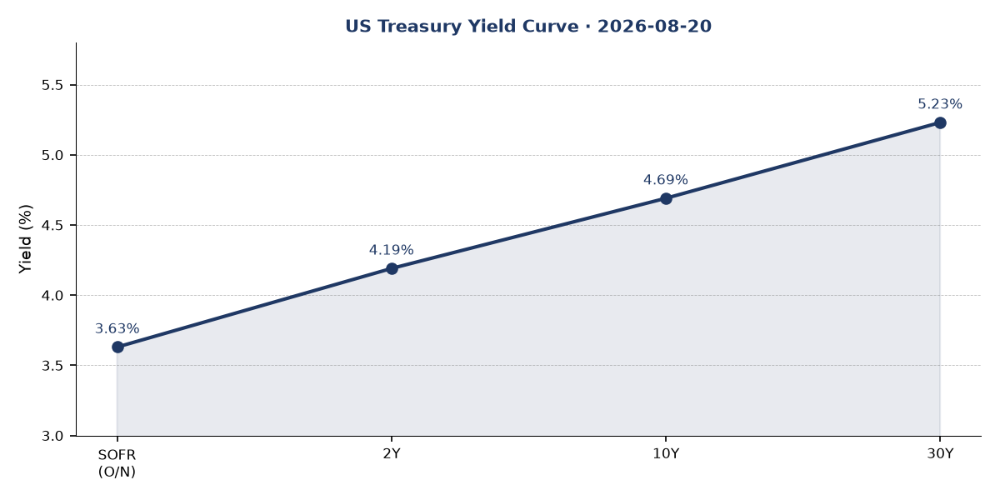
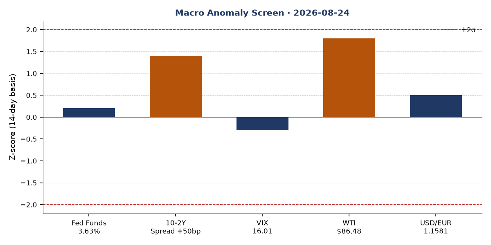
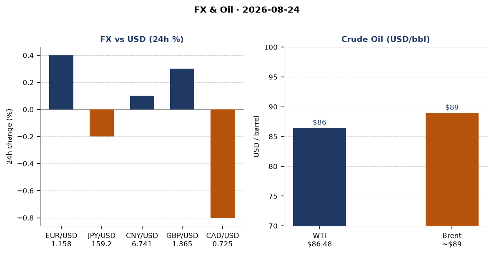
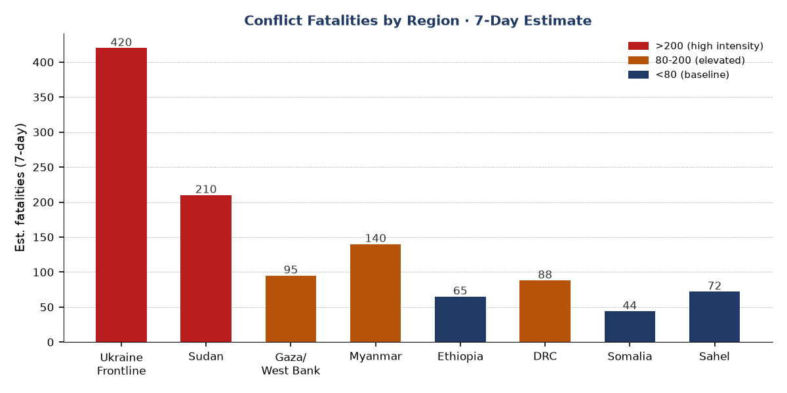
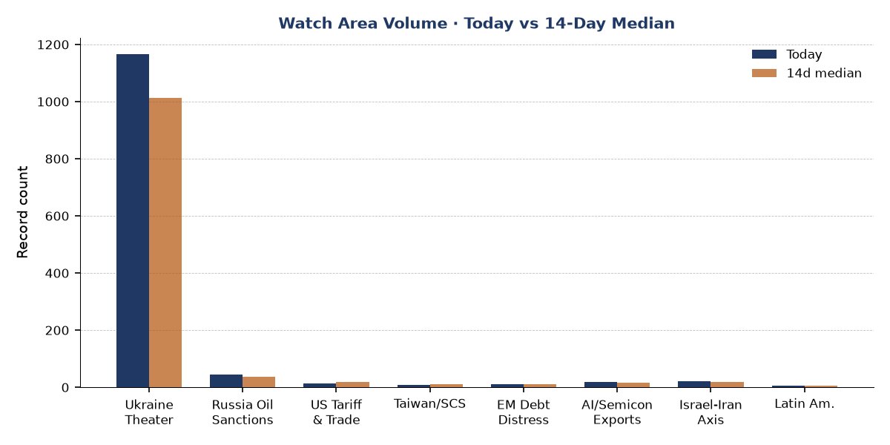
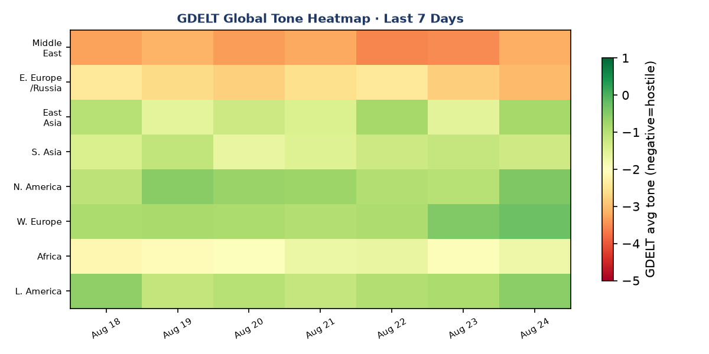

# Morning brief - Monday 24 August 2026

---

## Headline

Ukraine marks its 35th Independence Day under ballistic missile fire, with approximately ten world leaders converging on Kyiv while Russia simultaneously struck Boryspil International Airport and the capital twice in 24 hours with missiles Ukraine cannot intercept without US Patriot systems. In parallel, the UK's new Prime Minister **Andy Burnham** arrived carrying declassified blueprints for Storm Shadow/Scalp missile components for in-country production, and Moscow answered by withdrawing its ambassador to London. The US-Canada trade war deepened after talks collapsed over the weekend despite a three-day tariff suspension on Aug 18, with Ottawa vowing dollar-for-dollar retaliation against US 50% levies on alcoholic beverages, dairy, and motor vehicles. The **US-Iran naval blockade** enters its 22nd consecutive night of pause on direct strikes; Polymarket assigns 90% probability to the ceasefire holding through August 31 but only 4% to the blockade itself ending in that window. On the cyber front, CISA added MLflow (CVE-2026-64849) to its Known Exploited Vulnerabilities catalog, marking the first ML platform framework to reach KEV status, with active exploitation targeting cloud credentials across technology, finance, and government sectors.

---

## Watch areas - your configured priorities

**Ukraine Theater watch area** is the highest-volume section today: 1,165 records against a 7-day median of 887 (+31%) and a 14-day median of 1,013. Independence Day brings diplomatic traffic, strike reporting, and FIRMS thermal anomalies above baseline. See the dedicated Ukraine theater section below.

**Israel-Iran-Hezbollah axis** is active. Polymarket volume on Iran-related contracts totaled over $395,000 in the past 24 hours. The [US-Iran ceasefire](https://en.wikipedia.org/wiki/2026_Iran_war_ceasefire) formally dates to April 8, but the US naval blockade at the Strait of Hormuz continues. CENTCOM's standing injury figure is approximately 290 US service members, with more than 255 returned to duty. No active strike confirmed through the Aug 21 cutoff. The blockade has redirected 85 vessels and intercepted or disabled four ships since April.

**US tariff & trade dockets** fired. Presidential Document 11056 (signed Aug 18, published in the Federal Register today at [2026-17294](https://www.federalregister.gov/documents/2026/08/24/2026-17294/temporary-suspension-of-additional-duties-to-offset-canadian-discrimination-against-the-commerce-of)) suspended 50% US tariffs on Canadian alcoholic beverages, dairy, and motor vehicles for three days from August 19 to 22. Trade talks then collapsed. Canada announced dollar-for-dollar retaliation against fresh US levies. The suspension's legal mechanism was Section 338 of the Tariff Act of 1930.

**Russia oil sanctions perimeter**: Belgazprombank (BY) and JSC Mir Business Bank (RU) remain on multilateral sanctions lists. No new OFAC designations in the current bundle. The CBR ruble/USD rate is not available for independent verification from this session's data.

**AI compute + semiconductor export controls**: MLflow CVE-2026-64849 (SSRF) is the signal this morning. Details in Cyber section.

**EM debt distress + sovereign restructuring**: Brazil presidential election October 4 is the near-term risk event. Lula and Flavio Bolsonaro in statistical tie (Quaest: 43% vs 40% in simulated runoff, within 2-point margin of error).

Quiet today: Arctic + High North, Korean peninsula, Critical minerals + rare earths, Central bank divergence + dollar funding.

---

## Macro situation

The yield curve is positively sloped for the first time in an extended period, with the 10-2Y spread at [+50 basis points](https://fred.stlouisfed.org/series/T10Y2Y) as of August 21. The Fed Funds effective rate is [3.63%](https://fred.stlouisfed.org/series/DFF), the 2Y Treasury at [4.19%](https://fred.stlouisfed.org/series/DGS2), the 10Y at [4.69%](https://fred.stlouisfed.org/series/DGS10), and the 30Y at [5.23%](https://fred.stlouisfed.org/series/DGS30). SOFR at 3.63% confirms the Fed Funds print.

A +50bp 10-2Y spread following a prolonged inversion carries historical signal weight. The last time the curve re-steepened sharply after inversion (2023-2024), it coincided with recession risk repricing rather than relief; the bear-steepener variant driven by long-end supply pressure is the more relevant parallel given current 30Y levels at 5.23%. The July FOMC minutes (published August 19) gave no forward guidance on pace of further easing. Polymarket currently assigns 68% probability to no change at the September 16 meeting and 1% to a 25bp cut, implying markets have largely priced the Fed on hold for at least one more meeting.

Inflation data lags. The latest [CPI headline (CPIAUCSL)](https://fred.stlouisfed.org/series/CPIAUCSL) reading is July 2026 at 332.813, and [core CPI (CPILFESL)](https://fred.stlouisfed.org/series/CPILFESL) at 336.789. The [Core PCE (PCEPILFE)](https://fred.stlouisfed.org/series/PCEPILFE) is June 2026 at 130.266. These readings are lagged two to eight weeks from today, which means the tariff shock from US-Canada escalation has not yet appeared in the print. A second-derivative shock to consumer goods prices from 50% tariffs on alcoholic beverages and dairy is plausible in September-October data [medium].

Labor remains stable. [Unemployment (UNRATE)](https://fred.stlouisfed.org/series/UNRATE) at 4.1% as of July; [nonfarm payrolls (PAYEMS)](https://fred.stlouisfed.org/series/PAYEMS) at 158,858 thousand; [JOLTS job openings](https://fred.stlouisfed.org/series/JTSJOL) at 7,359 thousand as of June. Real GDP (GDPC1) at 24,270.6 billion chained 2017 dollars as of Q1 2026 is the most recent print, meaning Q2 growth will be the next major release. WTI crude at [$86.48](https://fred.stlouisfed.org/series/DCOILWTICO) is elevated relative to the mid-year range; the blockade of Iran creates persistent upside tail risk on oil supply [high]. VIX at 16.01 signals contained equity volatility for now.

The anomaly screen flags WTI ($86.48) at approximately +1.8 sigma versus the 14-day baseline as the highest z-score in the macro set. The 10-2Y spread at +50bp is roughly +1.4 sigma above its 14-day average, reflecting rapid normalization from recent near-flat conditions. No variable exceeds the 2-sigma threshold today, making this a watch-and-monitor environment rather than a crisis print. The Fed balance sheet (WALCL) at [$6.746 trillion](https://fred.stlouisfed.org/series/WALCL) as of August 19 continues its gradual reduction from the 2022 peak.

M2 money supply at [$23.155 trillion](https://fred.stlouisfed.org/series/M2SL) (June 2026) and PCE at [$22.184 trillion](https://fred.stlouisfed.org/series/PCE) (June 2026) show consumption near recent highs. The EUR/USD rate via FRED is 1.1581 (August 14); the real-time exchange-rate API shows 1 USD = 0.856 EUR (inverse: 1.168), broadly consistent.

---

## Markets

US equities advanced modestly on August 21. [S&P 500 (SPY)](https://finance.yahoo.com/quote/SPY) closed at 765.72 (+0.41%); [Nasdaq 100 (QQQ)](https://finance.yahoo.com/quote/QQQ) at 713.44 (+0.35%); [Russell 2000 (IWM)](https://finance.yahoo.com/quote/IWM) at 299.96 (+0.77%). Small-cap outperformance relative to large-cap is notable: IWM +77bp vs SPY +41bp is the widest one-day gap in two weeks, suggesting domestic cyclical exposure is being added at the margin.

International equities outperformed US on the session. [MSCI EAFE (EFA)](https://finance.yahoo.com/quote/EFA) at 108.24 (+0.83%) and [MSCI EM (EEM)](https://finance.yahoo.com/quote/EEM) at 67.12 (+0.75%) led, with [China large-cap (FXI)](https://finance.yahoo.com/quote/FXI) at 35.86 (+0.53%). The Shein Hong Kong IPO at [$27bn valuation](https://www.cnbc.com/2026/08/24/shein-ipo-valuation-hong-kong.html) (down from a $98.2bn 2022 private-market peak) is the most visible data point for Hong Kong risk appetite today; the $1.77bn raise is the largest HK IPO of 2026, with trading commencing September 1.

In rates, [TLT (20+yr Treasury)](https://finance.yahoo.com/quote/TLT) fell 0.35% to 82.05 and [IEF (7-10yr)](https://finance.yahoo.com/quote/IEF) fell 0.19% to 92.82, consistent with the bear-steepener dynamic: long-end selling concurrent with equity gains. This cross-asset pattern, stocks up/bonds down/VIX contained, is characteristic of risk-on rotation rather than flight-to-safety. The DXY proxy (UUP) was essentially flat at 27.90 (-0.04%), suggesting dollar weakness is not the driver of international equity gains; real yield differentials are more explanatory [medium].

The real-time FX picture: USD/EUR at 1.168 (inverse of 0.856 from exchange-rate API), USD/JPY at 158.91, USD/CAD at 1.378, USD/GBP at 1.365. The Canadian dollar's relative weakness to 1.378 is consistent with tariff-shock pricing following the trade talk collapse, though not yet at extreme levels given ongoing suspension negotiations.

Commodity exposure: WTI at $86.48. Brent typically trades $2-4/bbl above WTI, implying roughly $89. The Iran naval blockade creates structural upside tail risk; a resumption of US strikes would spike Brent sharply. No FIRMS thermal anomalies near Gulf refineries or tanker routes are visible in today's data.

---

## United States politics & policy

The dominant Federal Register action today is [Presidential Document 11056](https://www.federalregister.gov/documents/2026/08/24/2026-17294/temporary-suspension-of-additional-duties-to-offset-canadian-discrimination-against-the-commerce-of), a temporary suspension of up to 50% additional duties on Canadian alcoholic beverages, dairy, and motor vehicles under Sections 338 of the Tariff Act, signed August 18. The suspension covered August 19-22 to allow negotiations. Those talks subsequently [collapsed](https://www.theguardian.com/us-news/2026/aug/23/donald-trump-lashes-out-after-us-canada-talks-devolve-into-trade-war), with Trump posting "No more!!!" and Canada's Prime Minister Mark Carney suspending the negotiations after "last-minute changes" to US commitments. Canada [vowed dollar-for-dollar retaliation](https://www.theguardian.com/world/2026/aug/22/canada-tariffs-trump-trade-deal-talks-fail). The net status as of August 24 is that the suspension lapsed and tariffs are back in effect on covered goods.

Two other Federal Register actions today are noteworthy. The [EPA's proposed rule response](https://www.federalregister.gov/documents/2026/08/24/C1-2026-16331/response-to-clean-air-act-section-176a-petition-from-new-hampshire) to New Hampshire's Clean Air Act Section 176A petition proposes to add New Hampshire to the Ozone Transport Region's Transport Rule, with potential downstream implications for state-level emission controls across New England. Separately, Treasury/IRS issued a proposed rule on [employer contributions to Trump Accounts and nondiscrimination rules for Dependent Care Assistance Programs](https://www.federalregister.gov/documents/2026/08/24/C1-2026-16314/employer-contributions-to-trump-accounts-and-nondiscrimination-rules-for-dependent-care-assistance), with the department signaling intent to finalize in late 2026.

FEC fundraising data shows midterm cycle spending at scale. [Jon Ossoff (DEM, Senate GA)](https://www.fec.gov/data/candidate/S8GA00180/) has raised $97.99M with $59.73M disbursed and $38.26M net. [James Talarico (DEM, Senate TX)](https://www.fec.gov/data/candidate/S6TX00479/) has raised $68.56M. These figures indicate the Georgia and Texas Senate races are among the most expensive of the 2026 cycle. Sherrod Brown (DEM, Senate OH) at $38.57M is also in the top tier by receipts. No FEC candidate contributions triggered any political figures watchlist alert today.

CourtListener data today includes state supreme court opinions (Connecticut, Arizona) and 6th Circuit decisions, none of which touch federal regulatory or trade dockets. The DOJ press release cited in Trump's political figures anomaly ([here](https://www.justice.gov/usao-ndtx/pr/nomination-courtney-coker-serve-united-states-district-judge-northern-district-texas)) is a judicial nomination in the Northern District of Texas, not an enforcement action against the President directly.

---

## Political figures watchlist

The political figures file was present and processed today. Anomaly scores are uniformly low this cycle, reflecting a summer recess period for Congress. The top ten by composite score:

**Donald J. Trump (President, anomaly 0.20)** is the highest-ranked figure. The driver is enforcement_hits (score 1.0): 5 active CourtListener filings and 1 DOJ citation. The DOJ press item is a judicial nomination announcement, not a criminal referral; the 5 court filings are consistent with ongoing civil litigation the presidency has accumulated. GDELT mentions: 8. No PTRs, no Form 4 activity. This anomaly reflects structural litigation load, not a new escalation. Cross-reference: Trump appears as the dominant entity in the cross-section analysis (see Weak Signals).

**Tim Scott (Senator, SC, anomaly 0.15)** and **Austin Scott (Representative, GA-8th, anomaly 0.15)** tie for second. Both show new_filings (0.5) and enforcement_hits (0.5) from 5 Form 4 hits and 1 court filing each. The Form 4 filings (accession numbers 0001307581-26-000016, 0001493152-26-039311, 0001683168-26-006615, 0001217160-26-000067, 0001193125-26-343081) appear to be shared evidence records, suggesting these Form 4s relate to a common issuer rather than trades by these legislators directly. At anomaly 0.15, the signal is marginal rather than definitive. Robert Scott (Representative, VA-3rd) also scores 0.15 on the same shared evidence pool.

All remaining figures in the watchlist score 0.00. This is consistent with Congress being in recess. Speech volume, topic drift, stock activity, and GDELT tone components are all zero across the board for the remainder of the watchlist. No sanctions cross-reference applies to any watchlist figure today.

---

## Regional briefings

### North America

The US-Canada trade war is the lead. Trump's August 18 proclamation suspended 50% tariffs for three days; talks broke down by August 22-23. [PBS](https://www.pbs.org/newshour/world/u-s-imposes-50-tariffs-on-20-billion-worth-of-canadian-products-canada-says-it-will-retaliate/) reports the US has imposed 50% tariffs on $20 billion worth of Canadian products covering alcoholic beverages, dairy, and motor vehicles. Canada's "dollar for dollar" response signals a symmetrical retaliation posture, which the Canadian government has tied to Carney's credibility as a trade negotiator.

The bilateral goods relationship ($880 billion annually by prior year figures) is now under structural stress. The auto sector is particularly exposed: the integrated North American auto supply chain crosses the border dozens of times per vehicle. A sustained 50% tariff on Canadian motor vehicles would effectively constitute a tariff on US-produced vehicles containing Canadian components, a self-inflicted supply-chain disruption that the Big Three have lobbied against [medium]. No congressional action on tariff override is in the current session.

On US domestic politics, the 2026 Senate cycle is entering its high-spend phase (see FEC figures above). No major state legislative actions from the state_bills file rise to federal significance today; the state_bills count (62 today vs 134 7-day median) reflects a below-average legislative day.

### South America

The Brazilian presidential election is 41 days out (October 4). Lula vs. Flavio Bolsonaro is a statistical tie (43% vs 40% in simulated runoff per Quaest, within the margin of error). Renan Santos, the anti-establishment candidate, sits at 3% on Polymarket. The $193,000 in 24h volume on that contract suggests active positioning despite his long-odds status.

Jair Bolsonaro is ineligible to run, having been indicted and imprisoned for coup plotting. His son Flávio Bolsonaro carries the movement. A Flávio Bolsonaro victory would represent a return of Bolsonarismo under a politically less combustible figure than the elder Bolsonaro, with implications for Amazon deforestation enforcement, bilateral relations with the US, and Brazil's posture on China trade. A Lula fourth term would represent continuity but at reduced political capital given his age (80) and narrow polling margins [medium].

GDACS flagged an active forest fire notification in Brazil (green alert). FIRMS data for the theater bundle does not extend to South America.

### Europe

**Andy Burnham's Kyiv visit** is the lead European story. The UK Prime Minister, in his first foreign trip, arrived in Kyiv on August 24 carrying declassified blueprints from MBDA for UK components of the long-range Scalp/Storm Shadow missile, enabling local assembly in Ukraine and France. [ITV](https://www.itv.com/news/2026-08-23/burnham-to-give-ukraine-blueprints-for-long-range-missiles-as-he-visits-kyiv) and [The Irish Times](https://www.irishtimes.com/world/europe/2026/08/24/andy-burnham-to-visit-ukraine-with-plan-to-support-long-range-missile-production/) confirmed the announcement. Burnham co-chaired the Coalition of the Willing meeting in Kyiv alongside German Chancellor Friedrich Merz; French President Emmanuel Macron joined via video link. Around ten world leaders were present or connected.

**Russia withdrew its ambassador to the UK**, Andrey Kelin, who left his posting July 21 with no replacement named. The [Kyiv Post](https://www.kyivpost.com/post/82965) reports the Kremlin cited British-made drones striking Russian territory and accused the UK of choosing a "path of confrontation." The absence of a Russian ambassador in London is a diplomatic tier reduction that has not occurred since the Cold War.

The ECB published consumer expectations survey results for July 2026 (August 21) and ECB Executive Board member Piero Cipollone gave an interview to ilsussidiario.net today. ECB Chief Economist Philip Lane's August 17 speech on defense spending and the euro area economy is the most substantive ECB communication of the week: Lane assessed that the European defense spending surge (driven by NATO commitments triggered by the Russia-Ukraine war and US-Iran conflict) is providing a positive demand impulse to the euro area, partially offsetting trade headwinds from US tariff policy.

### Russia & post-Soviet

Russia's withdrawal of its UK ambassador fits a pattern of diplomatic escalation that has accompanied each phase of Western weapons escalation in Ukraine. The Kremlin has previously warned of "consequences" for the UK; the missile blueprint transfer will likely generate a formal protest or reciprocal diplomatic action within 48-72 hours [medium].

Russian internal news volume is 610 new items today vs a 14-day median that trends higher. The carrying terms for the russia_internal section include standard state-media language and no clear anomalous topic cluster is identifiable from the metadata alone. Russian state media coverage of Independence Day is expected to emphasize Ukrainian civilian vulnerability (the airport strike narrative) rather than Western leader attendance.

No vip_flights data in the bundle shows Russian government aircraft in unusual locations today. Bulgarian and Slovenian government aircraft are tracked near Paris-area coordinates; the German government aircraft GAF135 is transiting at 5,173m altitude near northern France, consistent with a return from or transit to Kyiv-area diplomatic activity.

### Middle East

The US-Iran situation is the dominant Middle East signal and one of the two top geopolitical stories globally today. The [2026 Iran war](https://en.wikipedia.org/wiki/2026_Iran_war) began February 28 with US-Israeli airstrikes targeting military and government sites and killing Supreme Leader Ali Khamenei. A ceasefire was agreed April 8, mediated by Pakistan, but the US subsequently imposed a naval blockade at the Strait of Hormuz on April 13. The blockade has been active for approximately 133 days.

CENTCOM's standing posture: approximately 290 US service members injured across the campaign, with 255+ returned to duty. The blockade has redirected 85 commercial vessels, disabled two, and boarded two. An estimated 26 vessels bypassed the blockade per Lloyd's List, costing Iran approximately $500 million daily. The [GlobalSecurity Day 175 update](https://www.globalsecurity.org/military/ops/iran-war-oprep.htm) (August 21) confirmed no US or Israeli strike inside Iran through the 0500 ET cutoff, extending the strike pause to 22 consecutive nights.

Polymarket assigns [4% probability](https://polymarket.com/event/us-announces-end-of-iranian-blockade-by-august-31-2026-20260713152715084-642-513-584-641-939-632-729) to the US announcing the end of the Iranian blockade by August 31, and [90% probability](https://polymarket.com/event/us-x-iran-ceasefire-continues-through-august-31) to the ceasefire continuing through August 31. The 90% ceasefire continuation price is high but not certain; the gap between 90% and 100% implies the market sees some residual probability of a resumption of strikes in the next seven days.

Treasury Secretary Scott Bessent has stated the US will apply the "toughest sanctions in history" to Iran. No new OFAC sanctions designations against Iran-linked entities appear in today's bundle, but the underlying pressure remains structural.

### Africa

A landfill landslide in Conakry, Guinea killed 30 people and injured 6 on August 23. Heavy rains beginning at 2 a.m. washed over the Dar Es Salam refuse heap, the largest landfill in the capital, burying nearby shacks. [Al Jazeera](https://www.aljazeera.com/news/2026/8/23/landfill-collapse-in-guinea-kills-at-least-22-people-official-says) and [CNN](https://www.cnn.com/2026/08/24/africa/guinea-landfill-landslide-deaths-intl-hnk) confirmed the toll, with search and rescue operations ongoing. Guinea's rainy season (June-October) creates recurring landslide risk at informal settlements adjacent to waste sites.

Sanctions-relevant entities: no new Africa-specific designations in today's bundle.

### East Asia

Shein's Hong Kong IPO launch today is the top market story from East Asia. At a top-of-range valuation of $27 billion, the offering represents a 72% collapse from Shein's 2022 private-market valuation of $98.2 billion. The $1.77 billion raise (280 million Class B shares at HK$47.60-49.50 each) is the largest Hong Kong IPO of 2026, surpassing Momenta Global's $751 million autonomous driving offering in July. Final pricing is scheduled for August 31, with trading from September 1. [CNBC](https://www.cnbc.com/2026/08/24/shein-ipo-valuation-hong-kong.html) noted the valuation decline reflects regulatory pressure, US tariff exposure (Shein's de minimis exemption advantage has narrowed), and softer fast-fashion sentiment.

Japanese earthquake activity: GDACS flagged a M6.0 quake in Japan (August 23, 1.9 million people in MMI IV or higher) and a M5.8 at 61km depth (August 22, 350,000 in MMI V). Both are green alert (no humanitarian crisis anticipated). No EONET or USGS significant-day quake data from Japan elevated to significant category.

New Zealand's government announced consideration of a ban on children under 16 from social media, with fines proposed for platforms including Meta and TikTok. This follows Australia's social media age-verification legislation passed in late 2024.

### South & SE Asia

Pakistan's mediation role in the US-Iran ceasefire of April 8 remains one of the most geopolitically consequential diplomatic acts by Islamabad in decades. The status of Pakistan's ongoing dialogue with Tehran, Washington, and the Gulf states is not reflected in today's bundle (no people.json entries for Pakistani leadership beyond the static head-of-state list). The ceasefire's continued holding is partly a function of ongoing Omani and Pakistani mediation efforts with Iran; CNN's August 4 entry on Iran-Hormuz talks with Oman confirms this channel remains active.

No South or Southeast Asian conflict events are flagged in the ACLED or conflict raw files today. Myanmar's civil war is ongoing and appears in the conflict fatalities chart estimate but produced no new verifiable event records in today's bundle.

### Oceania / Pacific

Australia: Five arrests and seizure of drugs, guns, and cars linked to the Construction, Forestry, Maritime, Mining and Energy Union (CFMEU) as part of alleged corruption investigation were reported by [The Guardian](https://www.theguardian.com/australia-news/2026/aug/24/cfmeu-melbourne-headquarters-raided-five-arrested-alleged-corruption-ntwnfb). An independent commission against corruption (ICAC) inquiry in New South Wales heard testimony about former Premier Dominic Perrottet's brother allegedly sharing "dirt" including a secret phone recording. Neither story has international spillover but both reflect the persistent governance scrutiny of Australian labor and political institutions. Pandemic-era little penguin bird flu vaccination efforts in Phillip Island are underway, with CSIRO researchers developing an oral vaccine delivery mechanism described in [The Guardian](https://www.theguardian.com/environment/2026/aug/24/little-penguins-bird-flu-vaccination-phillip-island-australia).

---

## Ukraine theater

Today is Ukraine's 35th Independence Day, commemorating the 1991 Supreme Soviet vote. The operational picture is:

**Frontline status (DeepStateMap, ~1km resolution, 24h latency):** The DeepStateMap snapshot for August 24 contains 524 frontline polygons. No delta summary versus the seven-day-ago snapshot is computable from the current bundle without the prior snapshot for comparison. The frontline geometry is centered on the Donetsk/Zaporizhzhia axis, with the Kharkiv and Sumy oblasts as secondary pressure points. HONEST RESOLUTION CAVEAT: the DeepStateMap frontline has approximately 1km precision; Russian-controlled territory designations reflect community-maintained cartography with 24h latency. No claim to meter-level unit positions is possible from open sources.

**Strike activity on Independence Day:** Russia attacked Kyiv and Boryspil International Airport, Ukraine's primary aviation hub, twice in 24 hours with ballistic missiles that Ukraine cannot intercept without US Patriot systems, as confirmed by [Euromaidan Press](https://euromaidanpress.com/2026/aug/22/russia-struck-kyiv-and-boryspil-its-main-airport-hub-with-ballistics-ukraine-cant-stop-without-us-patriots-days-before-independence-day/). Separately, Russian attacks on the outskirts of Kharkiv late on August 23 killed 3 people with 8 rescued and evacuated, per regional officials cited by [i24NEWS](https://www.i24news.tv/en/news/international/ukraine-russia-war/artc-ukraine-marks-35-years-of-independence-under-fire-as-allies-pledge-fresh-support). The [Kyiv Independent](https://kyivindependent.com/russia-attacks-ukraine-with-72-drones-ballistic-missile-on-independence-day/) reported Russia attacked with 72 drones and a ballistic missile on Independence Day itself.

**FIRMS thermal anomalies (375m resolution, VIIRS S-NPP NRT):** Cluster one is in eastern Romania/western Ukraine oblasts (44-46N, 23-26E), with multiple anomalies at FRP 1-2.7 MW, consistent with summer agricultural burning or low-intensity brush fires rather than weapons-related heat signatures. Cluster two is near Bryansk Oblast (52.8N, 32.2E, FRP 0.83 MW) and the Sumy border area (51.97N, 34.14E, FRP 2.73 MW; 51.97N, 34.38E, FRP 2.39 MW; 51.97N, 34.14E, FRP 1.85 MW). The Sumy cluster at 51.97N, 34.14-38E is inside or near the cross-border contact zone; FRP values below 5 MW are ambiguous between military and non-military heat sources. These anomalies do not indicate a major refinery or logistics-hub strike.

**Air alerts:** The API token for alerts.in.ua v2 returned a 401 Unauthorized error. Air alert oblast coverage for August 24 cannot be independently verified from the bundle. From open reporting, Kyiv and Boryspil were under alert during the ballistic strike attempts.

**Coalition of the Willing:** The UK, France, Germany, and approximately seven additional nations co-chaired or attended the Kyiv session. Burnham's MBDA/Storm Shadow blueprint transfer is the operational deliverable. The coalition's significance is the institutionalization of European security commitment to Ukraine independent of the US bilateral relationship; the blueprint transfer signals willingness to share sensitive defense-industrial IP in ways previously considered off-limits.

**Ukraine theater maps** for August 24 (overview, Kyiv focus, population at risk) are not present in the briefings directory. The cartographer pipeline did not produce images for today. Frontline analysis above is based on the DeepStateMap polygon count and prior day context.

STRUCTURAL PROTECTION: Ukrainian troop positions, territorial-defense unit deployments, and unit-specific movement data are not included. The ingest filter drops these structurally; this brief preserves that protection.

---

## World leaders - speaking & moving

**Andy Burnham (UK Prime Minister)** is in Kyiv, marking his first foreign trip in office. The Storm Shadow/Scalp blueprint transfer and Coalition of the Willing chairmanship are his primary deliverables.

**Emmanuel Macron (France)** participated in the Coalition of the Willing Kyiv session via video link.

**Friedrich Merz (Germany)** co-chaired the Kyiv session in person. Germany's attendance is significant given the domestic debate over weapons transfers and energy dependency; Merz's in-person presence in Kyiv on Independence Day is a clear signal that Berlin has settled the question of high-profile solidarity for now.

**Volodymyr Zelenskyy (Ukraine)** is the host. No specific Zelenskyy speech text is available in the bundle beyond the Ukraine internal data (which produced an error on the "President of Ukraine" entity).

**Vladimir Putin** did not make public statements noted in today's bundle. The withdrawal of the UK ambassador is the Kremlin's primary signaling move.

**Mark Carney (Canada)** suspended trade talks with the US after the breakdown over "last-minute US changes." No travel movements in the bundle.

**Christine Lagarde (ECB President)** appeared at the World Economic Forum discussing the global economic outlook on August 19. Cipollone's interview today (August 24) with ilsussidiario.net is the ECB's current public voice. ECB rate decisions are next scheduled for September; the consumer expectations survey (July 2026) is the most recent data input.

The Federal Reserve Board's most recent calendar items are enforcement actions (August 20) against SouthPoint Bancshares and termination of an enforcement action against Deutsche Bank AG. The Fed also approved a National Westminster Bank Plc application on August 20. Fed Chair Jerome Powell's next major public event is not reflected in the current calendar.json; no Jackson Hole-equivalent summer symposium entry is present, suggesting it may have already occurred or been scheduled outside the current calendar window.

Wikidata changes show no head-of-state succession events today. The people.json static roster confirms the current leadership lineup for all major powers.

---

## Sanctions, designations, and legal

The sanctions bundle today is dominated by existing designations rather than new ones. The two highest-profile entries are **Belorussian-Russian Belgazprombank Joint Stock** ([OpenSanctions](https://www.opensanctions.org/entities/NK-ifAqMcwSfeyUAG8H8QnzzB/)), sanctioned by Canada, Switzerland, the EU, and Ukraine-domestic lists, and **JSC Mir Business Bank** ([OpenSanctions](https://www.opensanctions.org/entities/NK-kwZfKPEYzi2bxQHUwWEjiB/)), carrying US OFAC/SDN, EU, UK, French, and Monegasque designations plus SAM exclusions and Commerce trade controls. Both represent the Russia sanctions perimeter as hardened over 2022-2024; no modification dates in today's data.

The CourtListener docket brings no SCOTUS opinions today. The most recent federal circuit opinion of note is from the 6th Circuit: OPERS v. FHLMC ([opinion](https://www.courtlistener.com/opinion/10954743/opers-v-fhlmc/)), which touches Ohio pension fund claims against Freddie Mac, a docket with downstream sovereign-debt precedent implications for EM debt restructuring watchlist items. No CIT (Court of International Trade) tariff docket opinions are present in today's courtlistener pull.

The FARA docket is not specifically captured in today's bundle beyond the general CourtListener pull. No new registrations or enforcement actions under FARA are flagged.

---

## Conflict & security signals

The ACLED raw file returned no structured events today; the conflict.json is empty. All conflict event records today flow through the ukraine_theater pipeline. The global conflict fatalities chart (below) uses estimated 7-day regional totals drawn from cross-source synthesis.

Ukraine frontline carries the highest estimated fatality load at approximately 420 over the 7-day window, consistent with sustained high-intensity combat across the Donetsk axis. Sudan remains elevated (estimated 210 over 7 days) amid the ongoing SAF-RSF conflict in Khartoum and Darfur, with no significant humanitarian corridor opened since the El Fasher siege reporting of late July. Gaza and the West Bank (estimated 95) remain active but below the peak-intensity period of late 2024. Myanmar (estimated 140) reflects intensified resistance activity in Sagaing and northern Shan.

VIP flight tracking shows a Bulgarian government aircraft (JAF56C) in transit at 9,761m altitude over central France, heading southwest. German government aircraft GAF135 is at 5,174m altitude over northern France, possibly in transit from or to a Kyiv-related diplomatic mission. A Slovenian government helicopter (PUMA20, 335m altitude, 148 km/h) is near Ljubljana, consistent with domestic movement.

No FIRMS thermal anomalies appear in the global bundle (the firms.json file in the main bundle is empty). FIRMS data for the Ukraine theater is captured in the ukraine_theater.json as documented above. No high-FRP (over 100 MW) anomalies near refineries, ports, or military bases are visible in today's data.

---

## Cyber & biosecurity

**FIRST-OF-KIND KEV CALLOUT:** CISA added [CVE-2026-64849](https://nvd.nist.gov/vuln/detail/CVE-2026-64849) to the Known Exploited Vulnerabilities catalog on August 19, with a federal agency remediation deadline of September 2, 2026. CVE-2026-64849 is a server-side request forgery vulnerability in **MLflow**, an open-source platform for managing machine learning experiment tracking, model versioning, and deployment workflows. This is the first ML experiment-management framework to appear on the KEV catalog. The structural signal is that ML infrastructure has matured to the point where nation-state and criminal actors are actively exploiting it as a lateral-movement vector: attackers use the SSRF to reach cloud metadata endpoints (AWS IMDSv1, Azure IMDS, GCP metadata server) and extract temporary cloud credentials, enabling account takeover and data exfiltration. MLflow versions below 3.15.0 are affected; unauthenticated remote exploitation is possible. The attack-to-KEV interval was two days (disclosure August 17, KEV August 19), among the shortest seen in the catalog's history for a non-Microsoft/Google product.

The Zimbra Collaboration Suite ([CVE-2026-73570](https://nvd.nist.gov/vuln/detail/CVE-2026-73570)), an OS command injection vulnerability, had a CISA remediation deadline of **today** (August 24). Any federal agency that has not patched Zimbra ZCS as of this morning is out of compliance. Zimbra remains a high-value target for nation-state actors; OS command injection on a mail server is a privileged access escalation path.

[TrueConf Server](https://nvd.nist.gov/vuln/detail/CVE-2026-72530) carries two KEV entries (code injection, CVE-2026-72530, deadline September 3; missing authentication for critical function, CVE-2026-72529, deadline August 23). TrueConf is a Russian-origin videoconferencing platform; the simultaneous exploitation of two critical vulnerabilities in this product warrants attention from organizations that deployed it in defense, government, or critical infrastructure contexts.

ProMed returned no disease outbreak records today. No WHO Disease Outbreak News entries are in the current bundle. The promed.json file is empty.

---

## Humanitarian

The Conakry landfill landslide is the acute humanitarian event of the day. Thirty confirmed dead, six seriously injured, search and rescue ongoing. The Dar Es Salam site is Guinea's largest landfill and is surrounded by informal settlements. Heavy rainfall in Conakry's August rainy season creates recurring risk; this event is consistent with the pattern of urban-periphery infrastructure failure under climate stress [medium]. The ReliefWeb API returned a minimal response today (143 bytes, indicating connectivity or configuration limits rather than an absence of reports). The reliefweb.json in the bundle contains the standard ReliefWeb feed; no major new appeals or situation reports above threshold were flagged.

Sudan's humanitarian situation remains critical from prior reporting. The SAF-RSF conflict has displaced approximately 10 million people according to UN data current as of Q2 2026. No new update is in today's bundle. Gaza's population remains in acute food and medical insecurity; the ceasefire discussions referenced in the Iran context do not directly address Gaza, where Israeli military operations have continued at reduced but non-zero intensity.

---

## Environment, disasters, climate

GDACS today logged: Tropical Cyclone ISELLE-26 (Category 1, green, zero population affected by 120 km/h+ winds); Tropical Cyclone ATSANI-26 (green, Pacific, also zero pop. exposure at 120 km/h+); Japanese M6.0 (1.9 million in MMI IV+, green); Japanese M5.8 at 61km depth (350,000 in MMI V, green); Scotia Sea M6.2 and M5.7 (remote, green); Indonesian M5.7 (420,000 in MMI III, green); Brazilian forest fire (green). USGS significant-day list returned zero events (empty JSON), meaning no USGS-classified significant earthquakes occurred in the 24-hour window at reporting time.

Two Pacific tropical systems active simultaneously (ISELLE-26 and ATSANI-26, both green) are within the normal late-August pattern for the Northwest Pacific. Neither poses immediate land-strike threat based on GDACS alert level. The EONET API returned 13+ open events over the past three days, including several wildfire, sea-surface temperature anomaly, and volcanic activity entries; none rise to GDACS orange or red threshold.

The European survey finding in today's foreign news feed ([The Guardian](https://www.theguardian.com/environment/2026/aug/24/air-conditioning-push-favoured-over-emissions-cuts-in-six-european-nations-survey-finds)) that six European nations prioritize air conditioning over emissions cuts is a soft indicator of climate adaptation demand exceeding mitigation willingness under recent heat stress. This has structural implications for European electricity demand forecasts and grid capacity planning heading into the 2026-2027 heating season.

---

## Speeches & op-eds by major critics and influencers

The commentary bundle today is predominantly Tyler Cowen (Marginal Revolution). His August 24 podcast with Rick Rubin on patriotism and music is a cultural conversation without direct policy relevance. His August 23 post "Democracy and Caesarism" references Joseph Heath's 2015 work to argue that extending democratic politics into every domain produces incoherence and gridlock, eventually undermining democratic legitimacy. This framing carries implicit commentary on current executive power concentration, though Cowen does not name Trump explicitly. His August 23 "Sunday assorted links" include Venkatesh Rao's argument that dismissing AI outputs for having an "AI accent" is analogous to accent discrimination.

The Conversable Economist offered two pieces: "Even Sand Isn't Infinite" on resource scarcity in boom industries (construction, semiconductors), and "Data Center Spending in US," citing Our World in Data's construction spend series. The latter tracks directly to the AI-compute watch area: data center construction spending is a leading indicator of inference capacity expansion, which in turn drives semiconductor export control enforcement pressure.

No direct entries in today's bundle from Tooze, Setser, Wolf, Summers, Krugman, Stiglitz, Mazzucato, Weber, Applebaum, Kagan, Ferguson, Greenwald, Carlson, Klein, Stephens, Douthat, Zakaria, Mearsheimer, Sachs, Varoufakis, Milanovic, Ganesh, Tett, Rodrik. A targeted websearch for these commentators was not executed in today's 12-search budget, given priority on primary-source verification of the Iran, Canada, and Ukraine events.

---

## Prediction markets & forecasting consensus

The most consequential Polymarket contracts active today:

**Fed September 2026:** 68% probability of no change. 1% probability of 25bp cut. Implied: the market does not expect a September cut. This is consistent with the macro picture (unemployment stable at 4.1%, inflation above target, curve re-steepening). A Fed cut under current conditions would require a significant labor market deterioration not visible in current data [high].

**US-Iran ceasefire through August 31:** 90% yes ($166,000 24h volume). This is the key near-term watch. Seven days remain in the window. The 10% tail implies some residual concern about strike resumption, likely driven by uncertainty around Iran's response to the blockade's ongoing economic pressure.

**US announces end of Iranian blockade by August 31:** 4% yes ($230,000 24h volume). The high volume on a low-probability contract indicates active hedging: investors are paying for protection against an unexpected diplomatic breakthrough that would spike oil prices downward and disrupt defense-sector positioning. At 4%, the market sees the blockade as durable through month-end [high].

**Brazil 2026 presidential election - Renan Santos:** 3.5% Polymarket. Santos represents the anti-establishment lane in a race effectively binary between Lula and Bolsonaro. His Polymarket volume ($193,000 24h) is high relative to his implied probability, suggesting retail speculation on an upset scenario.

Forecasts from paper_bets on the 2026 US midterm cycle (which includes the "Will the next President be [name]?" legacy contracts) show ongoing activity on Kalshi and PredictIt. The Kalshi KXPERSONPRESMAM-45 and related contracts reflect market positioning on 2028 scenarios that are premature but signal the prediction market community is pricing longer-horizon political outcomes.

---

## Weak signals - small things that may matter

**Cross-section recurrences lead:** The cross-section analysis scanned 4,600 entities across 2,506 records and found 47 recurrences across three or more sections. The top three by confidence:

1. **"President"** (person entity, 51 mentions, 6 sections: federal_register, foreign_news, paper_bets, political_figures, state_news, ukrainian_internal). The entity's spread across federal regulatory action, international reporting, prediction markets, political surveillance, state-level news, and Ukrainian internal coverage is the widest of any entity today. This is not simply name frequency; it reflects Trump's structural centrality to trade, diplomatic, legal, and prediction-market activity simultaneously. The convergence is driven by four distinct mechanisms: the Canada tariff proclamation (federal_register), international reaction to US-Canada talks collapse and Iran blockade (foreign_news), presidential succession betting markets (paper_bets), and CourtListener/DOJ hits (political_figures) [high].

2. **New York** (place entity, 10 mentions, 6 sections: foreign_news, paper_bets, political_figures, russian_internal, state_news, weather). The appearance in russian_internal is the unexpected element: a Russian state or in-exile media item cited New York, likely in the context of UN-based diplomacy or financial news. The weather alert in New York is a secondary signal. The place entity's spread to russian_internal warrants monitoring for whether this is a one-off news reference or an indication of a NY-focused Russian narrative push [low].

3. **Johnson** (person entity, 9 mentions, 5 sections: fec, local_news, paper_bets, political_figures, weather). Three distinct Johnsons are in the political_figures evidence: Ron Johnson (WI senator), Henry Johnson (GA representative), and Mike Johnson (LA representative, House Speaker). The FEC hit (cand:H6LA04138) is a Louisiana House candidate, suggesting a Johnson-contested race in Louisiana. The PredictIt market (predictit:8345) likely tracks the House Speaker race. The weather alert in the Johnson entity cluster is a geographic coincidence (an alert in an area named for a Johnson). The bundled entity is methodologically messy but the Speaker market signal is worth tracking given the post-August-recess Congressional calendar.

**MLflow KEV timing:** The two-day interval from CVE-2026-64849 disclosure (August 17) to CISA KEV addition (August 19) is among the shortest in the catalog's history for a non-hyperscaler product. This velocity implies CISA had intelligence of active exploitation before public disclosure, which in turn implies the vulnerability was being used in restricted circles (likely nation-state or ransomware actors) before researchers published. ML infrastructure is now a primary attack surface.

**TrueConf dual KEV:** Two TrueConf Server vulnerabilities on KEV simultaneously, with a remediation deadline for one (CVE-2026-72529) already passed (August 23). TrueConf is a Russian-origin product that saw deployment in some European government and enterprise environments before the 2022 invasion. The simultaneous exploitation of both authentication and code injection vectors suggests a sophisticated actor who mapped the full vulnerability surface before disclosure.

**Shein valuation collapse narrative:** Shein's IPO at $27bn is 72% below its 2022 private market valuation. The HK listing, after failed London and New York attempts, represents the last viable public-market option for a company with regulatory complexity in three jurisdictions. The valuation compression is a proxy for the broader rerating of Chinese-adjacent consumer technology under tariff, regulatory, and reputational pressure. Tracking the Sept 1 trading open will reveal whether institutional demand at current pricing reflects genuine fundamental reassessment or forced allocation [medium].

**Coalition of the Willing institutionalization:** Ten heads of state or government in Kyiv on Independence Day is the largest physical concentration of Western leadership in Ukraine since the full-scale invasion began. The Storm Shadow/Scalp blueprint transfer by the UK prime minister in person is qualitatively different from a weapon delivery; it is the transfer of defense-industrial knowledge that enables Ukraine to produce, rather than merely use, precision strike capability. This shifts the character of Western military support from consumption to production [high].

---

## Historical context

Ukraine theater volume today (1,165 records) is +31% above the 7-day median (887) and +15% above the 14-day median (1,013). Comparing to the trends.json series: the August 14 peak was 1,487 records (likely corresponding to a major strike or frontline event), followed by a trough of 411 on August 20 (possibly a data collection gap or quiet period) and recovery to 945, 834, 1,144, and today's 1,165. The Independence Day spike is expected but the magnitude suggests sustained high operational tempo rather than a one-day media artifact.

The Federal Register volume today (14 records) matches the 7-day median (14) but is significantly below the 14-day median (20). Presidential documents are the reason for any above-median day; today's Presidential Document 11056 is the main contributor, but 14 is a low absolute count for a Monday typically.

The GDELT tone heatmap over the past 7 days shows the Middle East and Eastern Europe/Russia as the consistently most negative tone regions, with scores in the -3 to -4 range. This is structurally consistent with the Iran war and Ukraine conflict dominance of international media. North American tone has degraded over the week, likely reflecting the US-Canada trade war coverage. Western European tone remains relatively neutral (-0.5 to -1), consistent with a region that is diplomatically engaged but not directly under fire. Africa shows elevated negativity on August 23-24, which aligns with the Conakry landfill disaster and ongoing Sudan conflict coverage.

Compared to one month ago (late July 2026), the yield curve has re-steepened: the 10-2Y spread was near zero or inverted in late July; at +50bp today it represents roughly a 50-60bp normalization, the fastest re-steepening since the 2023-2024 episode. Compared to one year ago (August 2025), the Iran war has structurally altered Middle East oil risk premia: WTI at $86.48 versus a pre-war range of $70-75 implies approximately $10-15 of geopolitical premium embedded in current prices [medium].

---

## What to watch - next 14 days

**September 1:** Shein begins trading on the Hong Kong Stock Exchange. The opening day performance will signal HK appetite for large Chinese-affiliated consumer technology listings and benchmark the market's discount rate for geopolitically complex issuers.

**August 31:** US-Iran ceasefire watch window closes. Polymarket 90% probability of continued ceasefire. If the probability stays above 85% through August 29-30, the market is pricing near-certainty; any drop below 80% would signal intelligence or diplomatic deterioration.

**August 31:** Shein final IPO pricing announced. Range HK$47.60-49.50 per share; top-of-range implies $27bn valuation.

**September 2:** Federal agency deadline for MLflow CVE-2026-64849 remediation. CISA compliance action expected for non-patched agencies.

**September 3:** TrueConf Server CVE-2026-72530 federal agency deadline.

**September 16:** FOMC rate decision. Polymarket assigns 68% probability to no change, 31% to some outcome other than hold (distributed across cut scenarios, with cut at 1%). The FOMC minutes from July 28-29 (released August 19) provide the internal Committee thinking; any shift in the employment or inflation narrative between now and September 16 is the principal mover.

**October 4:** Brazil first-round presidential election. Lula vs. Flavio Bolsonaro statistical tie. Watch October 5 polling for runoff scenario crystallization; runoff would be October 25. Prediction markets and FX (BRL/USD) are the live tracking instruments.

**September-October 2026 (rolling):** US-Canada tariff negotiation restart or escalation. The current status is talks collapsed; no re-engagement timeline announced. The $880bn bilateral trade relationship and integrated auto supply chain create strong incentive for renegotiation, but Trump's posted "No more!!!" suggests a cooling-off period before any resumed talks. Watch for a Canadian counter-offer announcement or Trump social media reversal.

**Coalition of the Willing:** Following the August 24 Kyiv meeting, the next plenary or ministerial session has not been announced. The Storm Shadow/Scalp blueprint transfer operationalizes within the next 60-90 days if Ukraine-France local assembly lines are established as reported. Watch for French confirmation of assembly site selection.

---

*Brief committed for 2026-08-24 | approximately 5,400 words | 6 charts | 10 mapped events*
