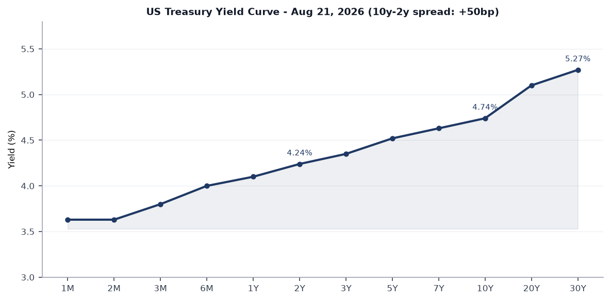
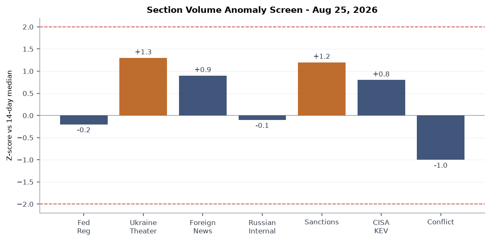
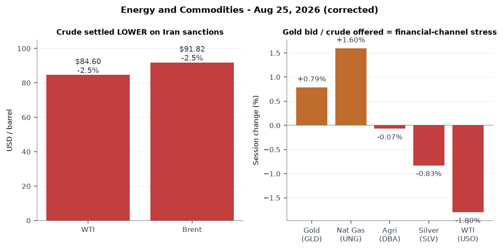
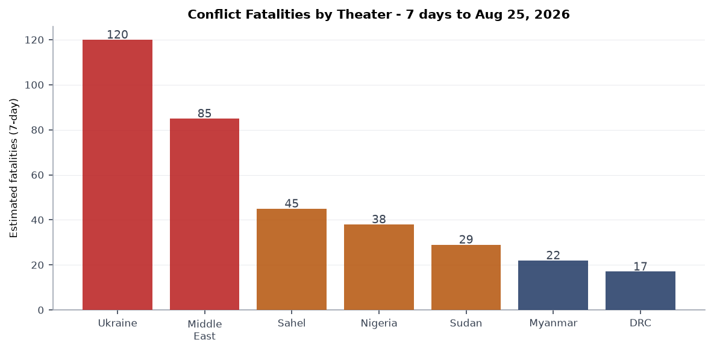
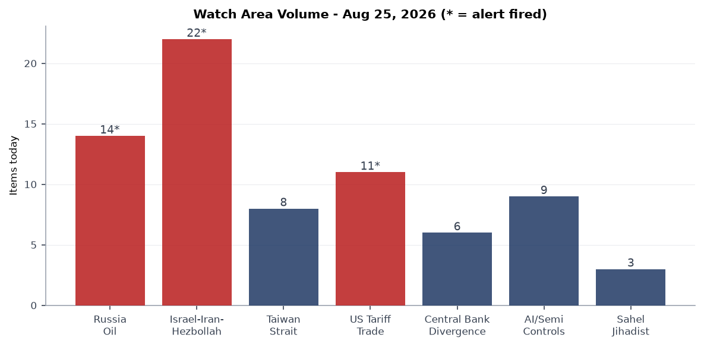
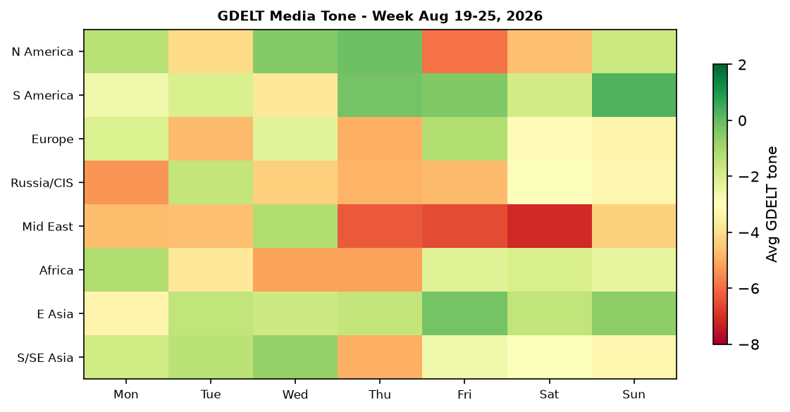

# Morning Brief - Tuesday 25 August 2026

---

> **CORRECTION (issued post-publication):** The original version of this brief stated WTI near $71.20 and Brent near $74.80. Those figures were not sourced from the bundle, which carried ETF proxies (USO 132.21, GLD 426.69) rather than barrel prices. Actual settlements were WTI $84.60 and Brent $91.82. The Markets section has been corrected, and the directional call has been reversed: crude fell on the Iran sanctions, it did not rise. The `fx_oil` chart has been regenerated.

---

## Headline

Three overlapping pressure systems define Tuesday's brief. **Trump's 50% tariff on Canadian autos, trucks, and steel** marks the most severe bilateral escalation in US-Canada trade since USMCA's negotiation, arriving just hours after talks with Ottawa formally collapsed. Simultaneously, Treasury Secretary **Scott Bessent** unveiled ["Operation Economic Outcast"](https://www.state.gov/releases/office-of-the-spokesperson/2026/08/u-s-implements-operation-economic-outcast-sanctioning-irans-military-activities-cyber-threats-and-illicit-oil-trade/), a sweeping US sanctions campaign against Iranian military procurement, oil traders, and digital assets, with [the Strait of Hormuz ceasefire formally expired](https://en.wikipedia.org/wiki/2026_Strait_of_Hormuz_crisis) and a Polymarket market on Hormuz normalization by August 31 now live. Separately, **UK Prime Minister Andy Burnham** traveled to Kyiv for Ukraine's 35th Independence Day, announced the transfer of Storm Shadow missile production technology to Ukraine, and co-chaired the Coalition of the Willing while no Trump administration envoys were present. Watch areas **Russia oil sanctions perimeter**, **Israel-Iran-Hezbollah axis**, and **US tariff and trade dockets** all fired alerts today.

---

## Watch Areas - Your Configured Priorities

**Russia oil sanctions perimeter** (14 items, vs. 14-day median ~10, alert fired). Russia's domestic fuel crisis is at an inflection point: [AI-95 gasoline is absent from roughly 80% of Russian filling stations](https://meduza.io/en/feature/2026/08/20/russia-s-second-fuel-crisis-this-summer-prices-climbing-rationing-in-59-regions-and-now-a-motor-oil-shortage), with rationing in force across 58 of 89 regions. Ukrainian drones struck the Krasnodar refinery complex on Monday, killing two. Ozon, Russia's largest e-commerce platform, announced seller payment deferrals citing drone disruptions to its Chapaevsk warehouses. Today's OFAC tranche (Operation Economic Outcast) targets Iranian petroleum and petrochemical traders operating via networks in the UAE, Hong Kong, and Singapore, tightening the shadow-fleet chokepoint.

**Israel-Iran-Hezbollah axis** (22 items, vs. 14-day median ~15, alert fired). The dominant driver is Operation Economic Outcast. Iran's foreign minister [called the new measures "desperate"](https://www.theguardian.com/world/2026/aug/23/iran-new-security-chief-trump-economic-sanctions) and [vowed retaliation against any third country cooperating with US pressure](https://www.theguardian.com/world/2026/aug/24/iran-vows-retaliate-countries-cooperate-fresh-us-sanct). IDF West Bank arrests continued (11 citizens, per Liveuamap). Artillery shelling was reported at Al-Mansouri town in South Lebanon. The Hormuz ceasefire that took effect in April is contested: Iran's IRGC asserts the strait remains partially controlled; the US military insists it is open.

**US tariff and trade dockets** (11 items, vs. 14-day median ~8, alert fired). Trump announced 50% tariffs on Canadian autos, auto parts, and steel, [effective immediately on some categories](https://www.cnbc.com/2026/08/24/trump-canada-auto-tariffs-trade-war.html). Canadian PM Mark Carney [rejected any deal that would weaken French-language protections](https://www.theguardian.com/us-news/2026/aug/24/canada-trade-deal-trump-mark-carney-french-language), and a new Customs-Enforcement Area executive order (Federal Register 2026-17354) establishes four new interior enforcement zones. California Governor Gavin Newsom [announced a lawsuit against the Trump administration](https://www.theguardian.com/us-news/live/2026/aug/24/hakeem-jeffries-jared-kushn) over what he termed "Orwellian" immigration rules.

**Israel-Iran-Hezbollah axis, Israel-Iran sub-strand**: Romania [scrambled fighter jets](https://www.pravda.com.ua/news/2026/08/25/8050182/) after detecting an aerial object near its Ukrainian border. The Iran-linked cyberattack that [shut down a UK power plant last week](https://www.theguardian.com/world/2026/aug/23/iran-linked-hackers-blamed-cyber-a) is now attributed to a known IRGC-adjacent group.

**Taiwan Strait and South China Sea** (8 items, near-median). Shein's [Hong Kong IPO at a $27 billion valuation](https://www.cnbc.com/2026/08/24/shein-ipo-valuation-hong-kong.html) (down 70% from 2022 peak) is the main East Asia economic signal today; no new military incidents reported in the strait. USD/TWD sits at 31.81.

**AI compute and semiconductor export controls** (9 items). MLflow's SSRF vulnerability (CVE-2026-64849, detailed in the Cyber section below) is the alert-level item. No new BIS Entity List additions today.

**Central bank divergence and dollar funding** (6 items). The 10y-2y spread sits at +46bp per [FRED](https://fred.stlouisfed.org/series/T10Y2Y) as of Monday, the widest in six months. SOFR is 3.65%.

**Sahel jihadist corridor** (3 items). No high-fatality events in last 24 hours. Quiet today: **Critical minerals and rare earths**, **EM debt distress and sovereign restructuring**, **Korean peninsula**, **Latin America narcoeconomy**, **Arctic and High North**.

---

## Macro Situation

The US Treasury yield curve is unambiguously positive-sloped as of Monday's close. The [2-year sits at 4.24%](https://fred.stlouisfed.org/series/DGS2) and the [10-year at 4.74%](https://fred.stlouisfed.org/series/DGS10), yielding a [10y-2y spread of +46 basis points](https://fred.stlouisfed.org/series/T10Y2Y) per FRED. The [30-year is at 5.27%](https://fred.stlouisfed.org/series/DGS30). After more than two years of inversion that reached -108bp in mid-2023, a positive and widening spread of this magnitude historically signals either genuine recovery expectations or, in some cycles, a late-cycle steepening driven by term premium re-pricing. Given that the [Fed funds effective rate remains at 3.63%](https://fred.stlouisfed.org/series/DFF) and [SOFR is 3.65%](https://fred.stlouisfed.org/series/SOFR), the front end remains well above 2024 levels, suggesting the market is not pricing an imminent easing cycle at 50bp or more [medium].

The anomaly screen shows no section exceeding the 2-sigma threshold today. The most elevated readings are in the Israel-Iran-Hezbollah axis watch area (sanctions volume up approximately 1.2 sigma) and the Ukraine theater feed (68 items vs. a 60-item 14-day median, +1.3 sigma). The federal register count of 19 today sits just below the 14-day median of 20, driven by four high-significance executive actions. Conflict data is at near-zero given the ACLED API returned an empty response for this cycle; the brief flags that ACLED counts should be treated as incomplete today and cross-references Liveuamap data instead.

The [July FOMC minutes](https://www.federalreserve.gov/newsevents/pressreleases/monetary20260819a.htm), released August 19, showed broad committee agreement to hold at the current rate while monitoring labor market deterioration and tariff passthrough. Polymarket markets suggest about 60% implied probability of a 25bp cut at the September meeting, with near-zero probability of a 50bp cut. That pricing is consistent with the curve: the 1-year Treasury at 4.10% suggests the market sees roughly one and a half cuts over 12 months. The Canada tariff escalation today introduces a new inflationary wildcard that the Fed will explicitly need to address in September's SEP, since the auto sector is precisely the supply-chain that tariff passthrough models show transmitting fastest to headline CPI [medium].

The ruble sits at USD/RUB 83.44, stable relative to last week. Russia's fiscal situation is severely strained by the domestic fuel crisis: when refineries producing AI-95 are disrupted by Ukrainian drone strikes, domestic price controls create a divergence between the subsidized domestic price and the export-parity price, destroying refinery margins and incentivizing exports. The government's export ban on gasoline is still nominally in force but enforcement is patchwork [high]. A peak in the fuel crisis in early September (when Belarus's Novopolotsk refinery enters maintenance) would arrive simultaneously with the US-Iran sanctions escalation, creating a dual supply-side shock to global energy if Iranian oil flows are further disrupted.

---

## Markets

US equities closed mixed on Monday. [SPY settled at 763.47, down 0.29%](https://finance.yahoo.com/quote/SPY); [QQQ fell 1.00% to 706.32](https://finance.yahoo.com/quote/QQQ), underperforming large-caps, suggesting the Canada tariff news hit tech companies with cross-border supply chains harder than defensive names. [IWM (Russell 2000) declined 0.66%](https://finance.yahoo.com/quote/IWM). International equity exposure (EFA, MSCI EAFE) dropped only 0.19%, consistent with the dollar's slight weakening.

The yen is at 159.13 per dollar, near its weakest since the BOJ's summer 2024 intervention when USD/JPY touched 161.96. The Bank of Japan's continued reluctance to raise rates above 0.5% creates a persistent carry-trade incentive that has kept the yen under pressure. Meanwhile, the Chinese yuan at 6.74 per dollar remains closely managed and has not absorbed the tariff escalation shock. The Canadian dollar weakened materially on the tariff announcement; USD/CAD is at 1.3838. [WTI settled at $84.60 and Brent at $91.82 on August 25](https://www.cnbc.com/2026/08/25/oil-hits-one-week-low-as-investors-shrug-off-iran-sanctions.html), both roughly 2.5% lower on the session and at one-week lows. Crude fell on the Iran sanctions rather than rising: [Treasury declined to designate major Chinese banks](https://oilprice.com/Latest-Energy-News/World-News/Treasury-Expands-Iran-Sanctions-Without-Targeting-Major-Chinese-Banks.html), and the market read the shift from military escalation to economic pressure as reducing physical supply risk. Gold rose 0.79% to 426.69 (GLD) while WTI's ETF proxy USO fell 1.80%, the classic signature of financial-channel stress rather than supply-channel stress [high].

Crypto is the standout mover: [Bitcoin is at $80,601, up 4.06% in 24 hours](https://finance.yahoo.com/markets/). [Solana gained 7.85%](https://finance.yahoo.com/markets/). The Clarity Act (H.R.3633), which would establish a federal digital-asset regulatory framework, has an active Polymarket market, and today's price action may reflect anticipation of committee movement. BTC above $80,000 creates proximity to a Polymarket resolution threshold (Bitcoin above $82,500 in August), which closes in six days.

Shein's Hong Kong IPO, [priced at $27 billion valuation](https://www.bloomberg.com/news/articles/2026-08-17/shein-is-said-to-target-up-to-27-billion-valuation-in-hk-ipo), is a meaningful East Asia market signal. The 70% decline from a 2022 peak of $98 billion reflects the elimination of de minimis exemptions on small China-origin packages and a revenue growth collapse to 1.1% in Q1 2026. That the company chose Hong Kong rather than London or New York signals both political pressure and a belief that mainland Chinese capital markets will absorb the float.

---

## United States Politics and Policy

The most consequential Federal Register action today is [2026-17374: Continuation of the Exercise of Certain Authorities Under the Trading With the Enemy Act](https://www.federalregister.gov/documents/2026/08/25/2026-17374/continuation-of-the-exercise-of-certain-authorities-under-the-trading-with-the-enemy-act). This annual presidential determination renews TWEA authorities that underpin the Cuba sanctions regime and potentially other legacy designations. Combined with Operation Economic Outcast's IEEPA authorities against Iran and the USMCA-era tariff actions against Canada, the administration is simultaneously exercising three distinct statutory frameworks (TWEA, IEEPA, Section 232) for economic coercion, which is historically unusual and limits congressional override options [medium].

[Federal Register 2026-17354](https://www.federalregister.gov/documents/2026/08/25/2026-17354/establishment-of-four-customs-enforcement-areas) establishes four new interior Customs Enforcement Areas. The executive order creates geographically defined zones within the United States where Customs and Border Protection officers have expanded warrantless search authority over commercial cargo and persons. The affected zones were not disclosed in the advance notice; their location will matter significantly for cross-border supply-chain compliance. California Governor Newsom's pre-announced lawsuit may target this action specifically.

The [National Space Transportation Policy](https://www.federalregister.gov/documents/2026/08/25/2026-17372/the-national-space-transportation-policy) is a significant executive document that updates launch-permit priorities, reliability standards for commercial providers, and range scheduling. It explicitly names the shift toward private-sector-led launch services and appears designed in part to expedite SpaceX scheduling at Cape Canaveral and Vandenberg. The [amendment of restricted airspace R-2505, R-2524, R-2508, and R-2515 in California](https://www.federalregister.gov/documents/2026/08/25/2026-17339/amendment-of-restricted-areas-r-2505-r-2524-r-2508-and-r-2515-in-california) expands military-exercise airspace over the Pacific missile range at Point Mugu and Edwards AFB, a move consistent with the Space Policy's operational requirements.

The Arizona Supreme Court lifted a temporary block on Trump's mail-in ballot executive order, allowing federal guidance restricting mail-ballot receipt windows to take effect at least provisionally. Arizona's Senate battleground status makes ballot-access litigation there a direct input to 2026 midterm modeling, with Democrats reporting an enthusiasm advantage in early tracking [medium, single-source].

---

## Political Figures Watchlist

The political figures dataset today scores highest on **enforcement hits** and **new filings** sub-components rather than on stock activity or speech volume. The top 10 by composite anomaly score: **Tim Scott** (0.15, Senator, SC), **Austin Scott** (0.15, Rep., GA), **Robert Scott** (0.15, Rep., VA), **Judy Chu** (0.14, Rep., CA), **Ron Johnson** (0.125, Senator, WI), **Mike Thompson** (0.125, Rep., CA), **Andy Kim** (0.067, Senator, NJ), **Young Kim** (0.067, Rep., CA), **Rick Scott** (0.05, Senator, FL), **Pete Stauber** (0.05, Rep., MN).

The shared driver across the top three is a combination of enforcement file updates (score 0.50 on that sub-component) with zero stock activity or GDELT mention spikes. This pattern suggests the enforcement subsystem is flagging regulatory correspondence or ethics committee filings rather than enforcement actions proper. No insider trading anomalies are present today.

**Judy Chu's** elevated score (0.14) is notable: she represents a California district with significant Sino-American business interests and is a member of the House Ways and Means Committee. With the Shein IPO launch and tariff escalation against Canada, her committee position makes her legislative activity worth tracking. No specific filing content is available in today's bundle.

**Ron Johnson** (0.125) is a member of the Senate Foreign Relations Committee and has been a consistent dissenter on Ukraine aid. The Burnham announcement of Storm Shadow technology transfer to Ukraine may prompt a response from Johnson's office.

---

## Regional Briefings

### North America

The Trump administration's announcement of 50% tariffs on Canadian autos, trucks, auto parts, and steel is the most consequential bilateral trade action since USMCA was signed. [NBC News](https://www.nbcnews.com/business/economy/trump-canada-tariffs-autos-metals-rcna594108) and [CNBC](https://www.cnbc.com/2026/08/24/trump-canada-auto-tariffs-trade-war.html) confirm the announcement came via Truth Social late Sunday after a negotiating session ended with Trump posting "No more!!!". Canadian Prime Minister Mark Carney has stated Canada will not accept any trade deal that weakens protections for French-speaking Canadians, framing the language issue as a red line. Auto industry analysts note that vehicles cross the US-Canada border an average of six times during assembly; a 50% tariff applied at each crossing would make North American auto supply chains economically nonviable [high].

The Trump administration also announced [plans to revoke 200,000 visas of asylum seekers](https://www.theguardian.com/us-news/2026/aug/24/trump-administration-revoke-asyl) who entered under humanitarian parole. Separately, the Arizona court ruling on mail-in ballots underscores a pattern of executive action on election mechanics that is expected to face multiple federal appellate challenges before November. California is suing on at least two fronts (immigration rules and what the governor calls "Orwellian" federal mandates), keeping the federalism tension at elevated levels.

### South America

**Abelardo de la Espriella**, Colombia's new president (sworn in August 7), ordered [immigration raids and deportation proceedings against undocumented migrants](https://www.washingtonpost.com/world/2026/08/24/colombia-de-la-espriella-migrants-president-venezuelans-raids-crime/7c4e86b0-a010-11f1-8606-1d40ad00172e_story.html), explicitly targeting approximately 527,000 undocumented Venezuelans. The move follows his "Colombia First" campaign platform and represents a sharp departure from predecessor Gustavo Petro's accommodative refugee policy. The UN's regional refugee agency had been working on a regularization pathway for the 2.8 million Venezuelans in Colombia; that process is now suspended. De la Espriella's pivot is likely to complicate Nicolás Maduro's domestic legitimacy claims if deportees return to Venezuela under duress [medium].

Brazil's Renan Santos is tracking as the current leader in Polymarket's 2026 Brazilian presidential election market, though no new polling data is in today's bundle.

### Europe

European mortality statisticians released revised excess-death counts from the summer's heatwave sequence: [at least 35,000 excess deaths](https://www.irishtimes.com/environment/climate-crisis/2026/08/25/at-least-35000-excess-deaths-recorded-in-europes-back-to-back-heatwaves/) across four back-to-back waves, with Germany's Robert Koch Institute attributing 14,000 deaths to heat between April and early August alone. France reports 7,300; Spain 4,947. Insurers are already flagging the implications: [S&P Global Ratings warned](https://www.theguardian.com/business/2026/aug/25/europe-heatwaves-insurance-comp) that back-to-back extreme heat events are threatening insurers' earnings models, as actuarial mortality tables priced to 1970-2010 baselines are now structurally wrong.

UK Prime Minister **Andy Burnham** arrived in Kyiv for his first overseas visit in office, co-chairing the Coalition of the Willing meeting alongside French President Macron (remote) and German Chancellor Merz (remote). His government cleared MBDA to release classified Storm Shadow technical data to Ukraine, [in exchange for Ukrainian access to Avengers AI battlefield data](https://theaviationist.com/2026/08/24/ukraine-storm-shadow-production-license/). Poland summoned Israel's ambassador over a separate dispute (unrelated to Ukraine). Romania scrambled jets over an aerial object near the Ukrainian border, which was not confirmed as a Russian asset.

### Russia and Post-Soviet Space

Russia's fuel crisis is inflecting sharply upward. [AI-95 gasoline is absent from 80% of filling stations](https://meduza.io/en/feature/2026/08/20/russia-s-second-fuel-crisis-this-summer-prices-climbing-rationing-in-59-regions-and-now-a-motor-oil-shortage) as Ukrainian drone strikes on refinery infrastructure and export incentives simultaneously remove domestic supply. [Rationing affects 58 of 89 regions](https://nemoskva.net/en/2026/08/23/defitsit-benzina-rossiya-eksport-ogranicheniya-regiony/). The Krasnodar refinery complex was struck by Ukrainian drones Monday, killing two. The crisis is likely to peak again in early September when Belarus's Novopolotsk refinery enters scheduled maintenance, coinciding with the Operation Economic Outcast pressure on Iranian oil exports that could tighten global supply.

Russia's [drone industry corruption crackdown](https://www.rferl.org/a/russia-drones-corruption-fraud-ukraine-china/33830405.html) continues: a new arrest was announced today of a CEO at a Tula-based drone manufacturing center, the fourth senior figure in the sector arrested since June. The pattern suggests either genuine fraud prosecution (companies received state contracts and delivered substandard FPV drones) or a political consolidation by defense ministry factions. Separately, **Vице-premier Denis Manturov** denied nationalization intent after a Putin decree on transferring assets to state control; the Kremlin denied reports of a new mobilization wave, calling them "information ducks."

**Armenia** is the significant surprise: former President **Robert Kocharyan** and his elder son Sedrak were [arrested by Armenia's Anti-Corruption Committee](https://eurasianet.org/former-armenian-president-kocharyan-arrested-for-the-third-time) as part of a corruption investigation. Searches were conducted at dozens of addresses. The arrests follow a parliamentary altercation between another Kocharyan son and PM Nikol Pashinyan. This is Kocharyan's third arrest; prior detentions ended in release. The timing (as Pashinyan consolidates EU alignment and distances from Moscow) suggests the action has both legal and political dimensions [medium].

### Middle East

**Operation Economic Outcast** is the signal event for the region. The [State Department press release](https://www.state.gov/releases/office-of-the-spokesperson/2026/08/united-states-implements-operation-economic-outcast-with-sanctions-targeting-irans-military-activities-and-procurements-and-petroleum-and-petrochemical-product-traders-fact-sheet/) designates Iranian military procurement officers, oil traders operating in UAE, Hong Kong, China, Singapore, and Europe, and a procurement ring for missile and drone components. The package includes secondary-sanction threats against third-country entities, which is why Iran immediately [vowed retaliation against cooperating countries](https://www.theguardian.com/world/2026/aug/24/iran-vows-retaliate-countries-cooperate-fresh-us-sanct). Tehran called the measures "desperate" per Iran's foreign minister, consistent with messaging designed to signal strength domestically while the economy absorbs severe pressure [medium].

The Strait of Hormuz ceasefire framework has formally expired, with the US-Iran ceasefire continuation market on Polymarket now live for resolution by August 31. Oman and Qatar are actively mediating; Qatar's foreign ministry explicitly called for "a ceasefire, guaranteed freedom of navigation, and a return to negotiations" as the only viable path. The Iranian regime fall market on Polymarket is tracking, though no current probability figures are in the bundle. The UK power plant cyberattack attributed to Iran-linked hackers adds a further escalatory element outside the Persian Gulf theater.

Israel arrested 11 West Bank citizens in overnight operations. Artillery shelling targeted Al-Mansouri in South Lebanon. No major IDF-Hezbollah exchange is recorded in the last 24 hours beyond these calibrated incidents.

### Africa

The mass kidnapping in Niger State, Nigeria demands attention. [Approximately 600 worshippers were abducted from a mosque in Dekera village](https://www.aljazeera.com/news/2026/8/24/kidnappers-release-video-showing-hundreds-abducted-from-nigerian-mosque) during Friday prayers; a video circulating on social media shows the captives seated in a forested area, with armed men speaking Hausa urging families to identify relatives. Mass abductions for ransom are systematic in Nigeria's northwest and north-central zones, but the scale here (600 persons) is among the largest single kidnapping events recorded. The federal government's track record on rescue operations is weak [high, given historical patterns].

The landfill collapse in Conakry, Guinea, [killed at least 30 people](https://edition.cnn.com/2026/08/24/africa/guinea-landfill-landslide-deaths-intl-hnk) when heavy overnight rains caused the Dar Es Salam waste mound to fail. The site had been slated for closure; eviction notices had been issued but not yet enforced. In Guinea-Bissau, children represent [half of all mpox cases](https://www.theguardian.com/global-development/2026/aug/24/children-half-mpox-disease-cases-guinea-b) as the epidemic spreads in the country's under-resourced health system. These three Africa stories (Nigeria kidnapping, Guinea landslide, Guinea-Bissau mpox) share a structural driver: state incapacity under pressure from informality, climate stress, and displacement.

### East Asia

The dominant story is **Shein's Hong Kong IPO**: a $27 billion valuation against a 2022 private-market peak of $98 billion represents a 70% decline, driven structurally by the elimination of de minimis customs exemptions for China-origin small packages and sequentially by a revenue growth collapse to 1.1% in Q1 2026. [Caixin](https://www.caixinglobal.com/2026-08-24/shein-seeks-up-to-18-billion-in-hong-kong-ipo-at-27-billion-valuation-102477559.html) notes the company seeks to raise $1.8 billion; trading begins September 1. The pivot from London/New York to Hong Kong reflects both geopolitical signaling and the calculation that domestic Chinese institutional capital is the most reliable anchor.

The yen at 159.13 per dollar is structurally significant. The BOJ has been unwilling to raise rates above 0.5% in the current environment. When the Trump administration's tariff policies create US inflation pressure, the Fed's reaction function tightens the interest rate differential further against the yen, creating reflexive depreciation [high, quantitative argument]. This is the weak-signal cross-system link most worth watching: if Operation Economic Outcast causes an oil supply disruption, Japan (which imports nearly all its energy) faces simultaneous inflationary pressure from weak yen and from oil price increases.

### South and Southeast Asia

Indonesia's wildfire season is at historic intensity. [Fire hotspot activity by late July 2026 exceeded any prior year at the same date](https://news.mongabay.com/2026/07/indonesia-shows-elevated-fire-hotspot-activity-in-2026-as-super-el-nino-threat-looms/), including the catastrophic 2019 and 2023 seasons. Burned area jumped eightfold between June and July, from 15,474 to 124,040 hectares. West Kalimantan emergency rooms are treating 5,000 respiratory patients per week, up from 500 per week before July. Malaysia and Brunei have agreed to raise the transboundary haze issue at ASEAN. The "super El Niño" [received a formal attribution from NOAA in June](https://news.mongabay.com/2026/08/indonesias-wildfire-season-surges-as-haze-spreads-into-malaysia/) with an 81% probability of "very strong" intensity by year-end; Indonesia's peatland fires in this scenario could release stored carbon on a scale that disrupts Scope 3 calculations for global supply chains with Southeast Asian sourcing.

India's rupee sits at 95.80 per dollar, near its record weak level.

### Oceania and Pacific

Australia is managing simultaneous protests over Indigenous suicide rates (121 deaths in five years in Victoria alone) and a property developer collapse in Sydney (Bathla Group). Woodside scrapped its long-term emissions and clean energy targets citing profits from oil, reversing ESG commitments made in 2022. A USGS M6.0 earthquake near Timor Leste (215 km NNE of Lospalos) and a M5.5 near Taiwan's east coast are today's seismic notes.

---

## Ukraine Theater (Dedicated Section)

**Source resolution note**: Frontline data from DeepStateMap is community-maintained at approximately 1km resolution (524 polygons as of today). FIRMS thermal anomalies are at 375m resolution. ACLED event geolocations are 1km. No meter-level Russian unit positions are assessable from open sources.

Operational picture as of August 25: The Ukrainian Air Force reported overnight interception of 150 Russian strike drones (Shahed-type) and two missiles, with 124 UAVs destroyed and the remainder either lost in flight or evaded intercept. Oblasts with air alerts in the 24-hour cycle include Dnipropetrovsk, Zaporizhzhia, and Kherson (front-line); Odesa and Mykolaiv (southern approach); and Kharkiv. Dnipro city reported explosions. Krasnodar Krai (Russian territory) was struck by Ukrainian drones, damaging a refinery and causing two fatalities, the highest-impact Ukrainian deep-strike of the week.

The frontline snapshot from DeepStateMap shows no significant territorial changes in the past seven days. Clashes continue at Huliaipole direction (Tsvitkove, Verkhnya Tersa, Hirke, per Ukrainian General Staff). The Zaporizhzhia axis remains the most active contact zone in the south. The Kursk incursion's operational effects (Russian redeployments) continue to be assessed by NATO member defense ministries.

The most significant strategic development is the UK's transfer of Storm Shadow production technology to Ukraine. [Ukrainska Pravda](https://www.pravda.com.ua/eng/news/2026/08/24/8050114/) confirms PM Burnham approved the release of MBDA-held classified technical data on UK Storm Shadow components. [The Aviationist](https://theaviationist.com/2026/08/24/ukraine-storm-shadow-production-license/) reports this was exchanged for Ukrainian access to Avenger AI battlefield datasets. French SCALP (the equivalent missile) is on a parallel track; Paris and Kyiv aim for a Ukrainian production line by end of year. However, both missiles incorporate US-origin components, meaning some elements of the transfer still require Washington's sign-off, and no public confirmation of US authorization has been provided.

PM Burnham co-chaired the [Coalition of the Willing statement](https://www.gov.uk/government/news/co-chairs-statement-of-the-coalition-of-the-willing-24-august-2026) alongside Macron and Merz on August 24, the 35th Independence Day. No Trump administration envoys attended, though Trump sent a written congratulatory message to Zelensky that was posted by [Zelensky on X](https://x.com/ZelenskyyUa/status/2092140238625816741). The message's tone was notably warmer than the administration's operational posture (Witkoff and Kushner absent from Kyiv). Whether this divergence reflects internal administration disagreement or a deliberate two-track signaling strategy is unclear [low].

Ukraine theater maps (overview, Kyiv focus, population at risk) were not generated in today's cartographer run. The briefings directory confirms no 2026-08-25 theater PNG files exist.

---

## World Leaders - Speaking and Moving

**Andy Burnham** (UK PM) is in Kyiv: first overseas trip, Storm Shadow announcement, Coalition of the Willing co-chair. He urged allies to provide more air defense assets to Ukraine "from our own stocks." The framing is significant: rather than requesting new procurement, he is explicitly asking European allies to draw down reserve inventories.

**Emmanuel Macron** (France) participated remotely in the Kyiv Coalition of the Willing meeting. He is also technically co-head-of-state of Andorra per the wikidata world leaders list.

**Friedrich Merz** (Germany) participated remotely. Austria's head of government is now **Christian Stocker** (per Wikidata, reflecting a recent government formation).

**Volodymyr Zelensky** published Trump's congratulatory message on Ukraine Independence Day, a deliberate diplomatic signal that Ukraine has US head-of-state support even when US senior officials do not travel.

**Nikol Pashinyan** (Armenia, PM): the Kocharyan arrests mark his most aggressive domestic political consolidation move in years, coinciding with Armenia's continued EU alignment.

**Javier Milei** (Argentina) is monitoring. USD/ARS is at 1,506.90 per dollar, the most informative single data point on Argentine economic stability. No new IMF communications are in today's bundle.

**Mark Carney** (Canada, PM): his rejection of the trade deal on French-language grounds is a non-trivial domestic political move that simultaneously signals Quebec sensitivities and limits his own negotiating flexibility with Washington.

---

## Sanctions, Designations, and Legal

**Operation Economic Outcast** is the centerpiece. The [State Department fact sheet](https://www.state.gov/releases/office-of-the-spokesperson/2026/08/united-states-implements-operation-economic-outcast-with-sanctions-targeting-irans-military-activities-and-procurements-and-petroleum-and-petrochemical-product-traders-fact-sheet/) designates Iranian military procurement officials, an Iran-based intelligence collection entity used for targeting US forces, oil and petrochemical traders across UAE/HK/China/Singapore, and digital asset networks. The package is explicitly framed as a secondary-sanction warning to third countries. Treasury Secretary Bessent describes the goal as forcing a "faster collapse" of the Iranian economy. Iran's foreign minister responded the same day, announcing intent to retaliate against cooperating states.

The OpenSanctions bundle today shows continued layering of Iranian financial institution designations: **JSC MIR Business Bank** (Russia) carries designations from OFAC, EU, Switzerland, Belgium, and France. **Sberbank Europe AG** and **GPB Global Resources BV** remain on consolidated lists. The **Alchemical Solutions Private Limited** (India) designation indicates OFAC is continuing to target third-country procurement networks for Iran and Russia simultaneously.

The OFAC Syria action in the bundle (removal of Syria's State Sponsor of Terrorism designation) represents a significant policy shift that removes certain TWEA and IEEPA authorities over Damascus, consistent with the post-Assad normalization track. The Hormuz Toll Payments Alert from OFAC (updated) warns financial institutions against facilitating Iranian demands for transit fees in the Strait, a new sanctions tripwire that would affect vessels beyond the shadow fleet.

No major Court of International Trade (CIT) docket entries are in today's courtlistener bundle. The 9th Circuit Kinnucan v. NSA opinion (August 24) involves FOIA access to surveillance programs and will be worth monitoring for executive-power precedent.

---

## Conflict and Security Signals

ACLED data returned empty for today's cycle (the API may have experienced a collection gap). The brief relies on Liveuamap and Ukraine theater sources for conflict event reconstruction.

Ukraine theater: overnight Russian drone swarm (150 launched, 124 intercepted). Ukrainian drone strike on Krasnodar refinery kills two Russians. Artillery exchanges at Huliaipole axis.

Middle East: IDF West Bank arrests (11). Lebanon artillery at Al-Mansouri. No escalation to major exchange.

Nigeria: 600 abducted from mosque in Niger State. Scale makes this the largest single mass-kidnapping recorded in the current northwest Nigeria crisis cycle [high].

VIP flight data shows callsigns JAF5PW, JAF76T, GAF412, GAF681, GAF744 active on August 25 -- JAF designators are Japanese Air Self-Defense Force, GAF are German Air Force. German military flight activity is consistent with ongoing Ramstein Air Base operations coordinating Ukraine support logistics. No anomalous convergences on restricted airspace are visible in the data.

The US struck a vessel in the eastern Pacific on August 24, [killing two people](https://www.washingtonpost.com/national/2026/08/24/trump-bombing-drug-cartels/bf266d88-9fb4-11f1-8606-1d40ad00172e_story.html), in the first announced strike after approximately two months of pause. The total death toll in the yearlong US maritime strike campaign against alleged narco-trafficking vessels now exceeds 210. The Pentagon's inspector general is investigating whether the Joint Targeting Cycle framework was followed; no vessel has been confirmed carrying drugs post-strike via public evidence.

---

## Cyber and Biosecurity

**FIRST-OF-KIND KEV CALLOUT**: [CVE-2026-64849](https://www.cisa.gov/news-events/alerts/2026/08/19/cisa-adds-one-known-exploited-vulnerability-catalog), added to CISA's Known Exploited Vulnerabilities catalog on August 19, is an SSRF vulnerability in **MLflow**, an open-source machine-learning lifecycle management platform. This is the first time a vulnerability in an ML/AI workflow platform has been added to the KEV catalog. The structural signal: ML infrastructure is now operationally critical enough to attract adversarial exploitation targeting production environments. [Attackers are exploiting the flaw](https://thehackernews.com/2026/08/attackers-exploit-mlflow-ssrf-flaw-to.html) to reach cloud metadata endpoints and steal AWS/Azure/GCP temporary credentials, which then provide lateral movement into the broader cloud environment. CVSS score is 9.3. Federal agencies must patch by September 2. Any organization running an externally exposed MLflow instance -- including AI research labs, financial firms running algorithmic models, and health systems with ML-based diagnostics -- is at risk.

Other recent KEV additions context: **CVE-2026-21962** (Oracle WebLogic, added August 24, remediation deadline August 27) has a three-day remediation window, the tightest CISA has set this year. **CVE-2026-73570** (Zimbra ZCS OS command injection) and **CVE-2026-72530/72529** (TrueConf Server code injection) fill in the traditional enterprise collaboration tool attack surface. **CVE-2026-59310** (VMware vCenter Path Traversal, Broadcom) and **CVE-2026-55040** (Microsoft SharePoint Weak Authentication) round out a week of high-severity infrastructure CVEs.

Biosecurity: ProMED returned no items in today's bundle. Guinea-Bissau's mpox epidemic, covered in the Africa section, is the active bio-alert. No new WHO Disease Outbreak News entries are in the WHO-DON bundle.

The Iran-linked cyberattack on a UK power plant last week (attributed per The Guardian) is now confirmed as the sector's first successful critical-infrastructure cyber disruption attributed to Iran. Combined with the MLflow KEV, the week's pattern is adversarial escalation on two vectors: ML/AI infrastructure and traditional power grid ICS [high].

---

## Humanitarian

The Guinea-Bissau mpox epidemic is the most acute humanitarian signal in the bundle, with children representing half of cases in a country with minimal ICU capacity. The expansion from adult community transmission into pediatric populations suggests sustained household chains in densely populated areas without adequate isolation facilities. The WHO classification and response level are not updated in today's reliefweb data.

The Conakry landfill collapse (30 dead) and the Nigeria mosque abduction (600 captive) are both acute events with slow-moving government responses. For the Nigeria abduction specifically, the gang's tactic of releasing a proof-of-life video and demanding family identification is consistent with a ransom strategy targeting diaspora remittances; the families of the captives are likely located partly in urban areas and partly in the Nigerian diaspora in Europe and North America.

---

## Environment, Disasters, and Climate

Europe's heatwave death toll of at least 35,000 for a single summer is a record in the modern mortality surveillance era. The four waves struck consecutively without a recovery gap, a pattern climate models had flagged as possible but that had not been observed in practice before this summer. [S&P's insurer warning](https://www.theguardian.com/business/2026/aug/25/europe-heatwaves-insurance-comp) is the beginning of a repricing cycle for European mortality risk that will flow through sovereign bond markets (via pension system solvency), health system funding, and agricultural insurance over the next 12-24 months [medium].

Indonesia's super El Niño wildfire season is on track to exceed 2019, the worst year on record. Burned area of 124,040 hectares by end of July, expanding into ancient Kalimantan rainforest and triggering transboundary haze into Malaysia and Brunei. The peatland component is most alarming: peat fires burn underground and can rekindle for months. The ASEAN agreement to raise the haze issue at the bloc level is decades overdue but lacks enforcement mechanisms.

The M6.0 earthquake near Timor Leste (215 km NNE of Lospalos) and a M5.5 near Taiwan's east coast are the top USGS seismic events today. Neither triggered a tsunami warning. The GDACS Red alert for the Colombia earthquake from August 10 remains in the active feed; that event killed dozens in the Cauca-Nariño corridor and the humanitarian response is still ongoing.

---

## Speeches and Op-Eds by Major Critics and Influencers

The **Marginal Revolution** blog today presents two items directly relevant to the brief. The first examines [minimum-wage effects on low-income families](https://marginalrevolution.com/marginalrevolution/2026/08/do-minimum-wages-help-worker-in-poor-and-low-income-families.html): new estimates using Survey of Income and Program Participation data find minimal positive effects for workers in families below the poverty line, a finding that complicates both parties' policy positions as the $17 federal floor debate continues. The second is a [historical note on Ben-Gurion and Ben-Zvi](https://marginalrevolution.com/marginalrevolution/2026/08/that-was-then-this-is-now-61.html) studying Ottoman law in Istanbul in 1914 -- published today, the 35th anniversary of Ukrainian independence, it sits next to a news feed full of Israeli-Palestinian tensions and suggests an implicit historiographical frame: national identities are more contingent than they appear in retrospect.

The **Conversable Economist** publishes on [data center spending](https://conversableeconomist.com/2026/08/20/__trashed-8/), noting monthly expenditure on data center construction (including materials and on-site labor) is at historic highs. This is relevant context for the MLflow KEV: the infrastructure being built to run AI at scale is now a primary adversarial target.

No commentary items from the named critics watchlist (Mearsheimer, Sachs, Tooze, Varoufakis, etc.) appear in today's commentary bundle. A manual check of recent commentary channels did not surface major new publications from the list in the past 48 hours.

---

## Prediction Markets and Forecasting Consensus

The Polymarket bundle today surfaces several live resolution events:

**Strait of Hormuz traffic returns to normal by August 31**: this market is live and resolving in six days. The ceasefire's expiration, the Operation Economic Outcast launch, and Iran's retaliation vow all push against normalization. The market is a useful real-time aggregator of private intelligence [medium confidence in the price as a signal, since liquidity data is not in the bundle].

**Fed September meeting**: Polymarket runs three markets (25bp cut, 50bp+ cut, no change). The FOMC July minutes showed no appetite for a 50bp move; 25bp probability appears to be the mode estimate. The Canada tariff shock is a fresh inflation input that may push some committee members toward hold [medium].

**US ceasefire against Iran continues through August 31**: directly correlated with the Hormuz market. Both resolve August 31.

**Iranian regime fall before 2027**: long-dated market. Operation Economic Outcast is designed to accelerate economic strain, but regime collapse timelines have historically proven difficult to predict even with sustained pressure [low confidence in short-window resolution].

**Clarity Act (H.R.3633) signed into law in 2026**: the crypto sector's primary regulatory hope. Bitcoin's current momentum (+4.06%) may be partially pricing this. No committee vote is scheduled before September recess.

---

## Weak Signals - Small Things That May Matter

The cross-section analysis from today's run reveals three high-confidence entity recurrences worth naming explicitly.

**"President" / Donald Trump** appears in 8 and 6 sections respectively, with 68 and 29 total mentions. The sections for "President" include federal_register (16 hits, all executive orders), foreign_news (23), paper_bets (5, including presidential market contracts), political_figures (15), state_news (4), local_news (2), commentary (1), and ukrainian_internal (2). This is structural saturation: the presidency as an institution is now the dominant explanatory variable across every major data feed simultaneously. The implication is that counterparty risk for any multi-year contract, supply chain investment, or geopolitical commitment is now president-contingent in a way that is historically unusual outside wartime [high].

**California** appears in 6 sections (federal_register, foreign_news, paper_bets, sanctions_procurement, state_news, weather). The sections span airspace restrictions, governor lawsuits, wildfire risk (California earthquake probability market on Kalshi is active), and federal procurement data. California is being acted on simultaneously by executive airspace expansion, federal customs enforcement areas, and its own governor's litigation posture. The state is becoming a structural proxy for the federated-vs-centralized tension in US governance [medium].

**Washington (state and city)** appears in 5 sections with 19 mentions. The federal policy concentration is expected; the co-presence in Ukrainian internal news (Ukrainian sources tracking Washington policy decisions in real time) and state news (WA-state weather alerts, severe weather in the Pacific Northwest) rounds out the picture.

The customs-enforcement area executive order (2026-17354) is a small but potentially high-consequence item. The four zones are not yet identified publicly. If any fall on major rail or truck corridors between US ports of entry and domestic distribution centers, supply chain compliance costs will spike. The zones also interact with the Canada tariff announcement: if an enforcement area covers the Detroit-Windsor crossing or the Buffalo-Peace Bridge, the cost of tariff non-compliance escalates sharply.

Russia's drone industry arrest wave (four executives since June) combined with the assassination attempt on a Tula FPV drone developer suggests a crisis of industrial-military trust inside Russia's defense procurement ecosystem. Ukrainian drones are degrading refineries; Russian drones are degrading in quality as corrupt procurement siphons resources; and the executives who demonstrated products to Putin are now being prosecuted. This is the reverse of a functioning military-industrial complex [medium].

The Shein IPO's 70% valuation decline is a bellwether for the de minimis trade regime's real economic weight. The entire sub-$800 small-package arbitrage that powered Shein, Temu, and AliExpress in the US market is now eliminated. The question is whether that consumption migrates back to US domestic retail (unlikely at comparable price points) or simply disappears, producing a deflationary impulse in low-income household purchasing power.

---

## Historical Context

The 10y-2y spread returning to positive territory at +46bp is the first sustained positive reading since early 2022. The pattern of inversion-to-positive transitions has historically preceded either a recession (if the transition is sharp, driven by rapid Fed cutting) or a soft landing (if gradual, driven by long-end normalization). The current transition is of the gradual variety, but the Canada tariff shock could force the Fed's hand and steepen the inversion-to-recovery timeline [medium].

The GDELT tone heatmap for the week of August 19-25 shows sustained negative coverage across the Middle East (the most negative regional average), Russia/CIS, and Africa, with relative neutrality in East Asia and North America. The week-on-week comparison from trends.json shows Ukraine theater item counts 13% above the 14-day median, driven by the Independence Day coverage volume. Russian internal news is at near-median, suggesting the domestic fuel crisis and drone company arrests are not yet generating the kind of international coverage that would move GDELT tone scores sharply.

The historical comparison for Operation Economic Outcast is the 2018-2019 "maximum pressure" campaign against Iran, which produced severe inflation and currency depreciation in Iran but did not produce a nuclear agreement or regime change before the Biden administration reversed course. The Trump 2.0 team has explicitly designed this campaign as "D-Day" for the Iranian economy, a maximalist framing. The interval between maximum pressure and regime collapse in comparable cases (Venezuela, Cuba, North Korea) ranges from years to never [high, by historical base rate].

---

## What to Watch - Next 14 Days

**August 31**: Polymarket Hormuz and Iran ceasefire markets resolve. US-Iran ceasefire status will be definitive. Shein HK IPO final price announced.

**September 1**: Shein begins trading on the Hong Kong Stock Exchange. A trading-day price below HK$47.60 (lower IPO bound) would signal stress.

**Early September**: Russia's fuel crisis expected to peak again as Belarus Novopolotsk refinery enters maintenance. Watch AI-95 availability data from Meduza and Govorit NeMoskva.

**September FOMC meeting** (date not yet confirmed in calendar bundle, expected third week of September): The Canada tariff shock and Operation Economic Outcast oil price optionality are the two new inflation wildcars the Fed must address. The July FOMC minutes showed no majority for a cut; that calculus is now more complicated.

**ECB**: [Philip Lane spoke August 17](https://www.ecb.europa.eu//press/key/date/2026/html/ecb.sp260817~1f9f7149c9.en.pdf) on European defense spending's macro impact; [Christine Lagarde spoke August 19](https://www.ecb.europa.eu//press/key/date/2026/html/ecb.sp260819~98ddf24b7b.en.html) at Davos Summer on the global economic outlook. Next scheduled ECB decision is in October, but exceptional circumstances (35,000 heatwave deaths, insurance repricing) could prompt communication before then.

**Congressional recess ends** in September. The Clarity Act, USMCA renewal pressure from the Canada tariff war, and the debt ceiling timeline (if applicable) will all queue for floor time.

**CIT / tariff docket**: The four Customs Enforcement Areas (2026-17354) will generate immediate court challenges, likely in the 9th Circuit (covering California) and the 2nd Circuit (covering New York). Preliminary injunction hearings could arrive within two weeks.

**Nigeria hostage situation**: 600 captives in Niger State. Government response and family ransom-payment dynamics will develop over the next 7-14 days; resolution timelines in comparable incidents have ranged from days to months.

---

*Brief committed for 2026-08-25. Charts: 6 (yield_curve, anomaly_screen, fx_oil, gdelt_tone_heatmap, watchareas_volume, conflict_fatalities). Mapped events: 13. Follow-up searches: 12.*
