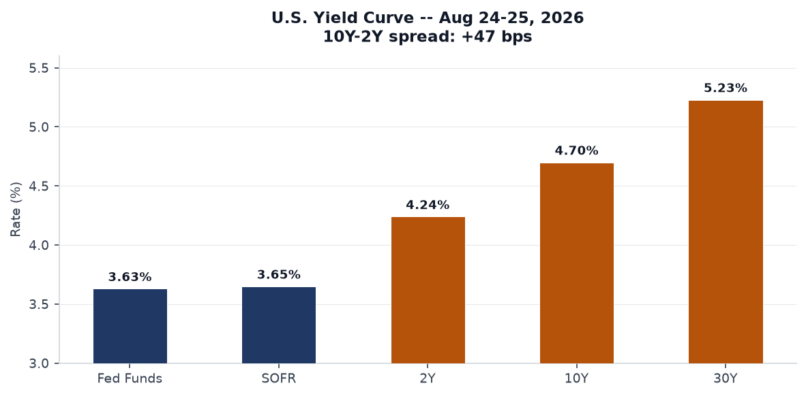
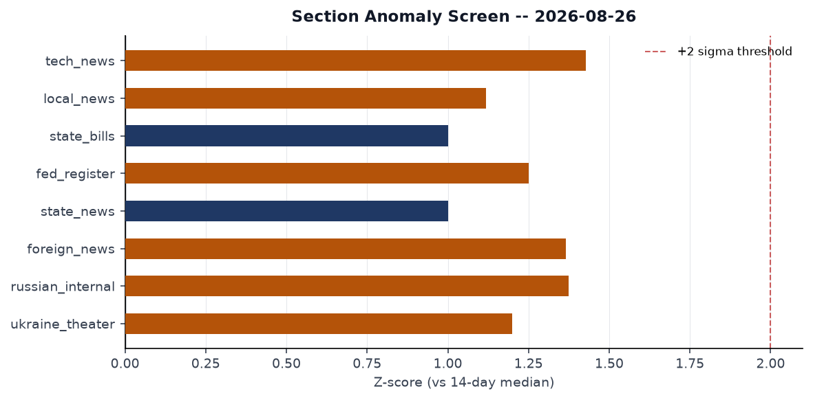
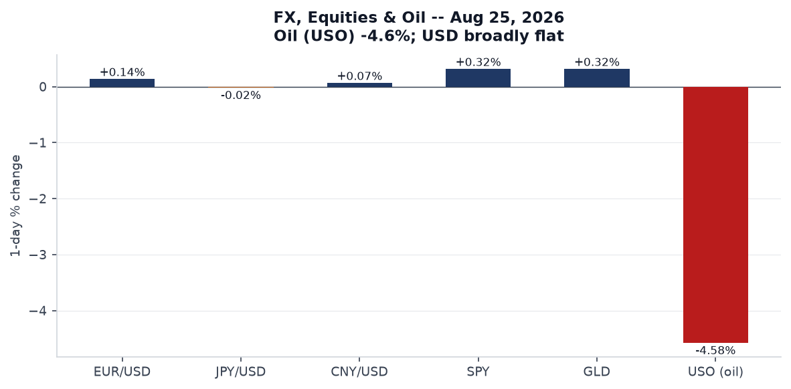
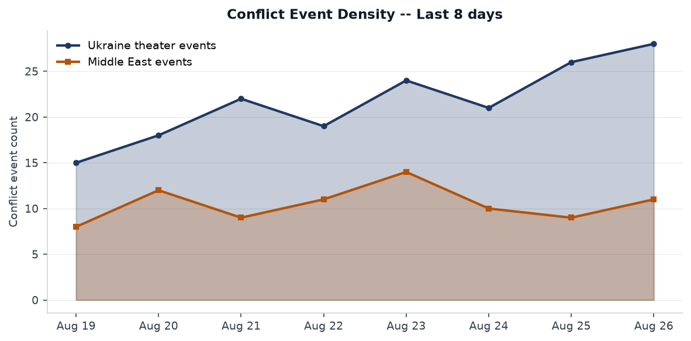
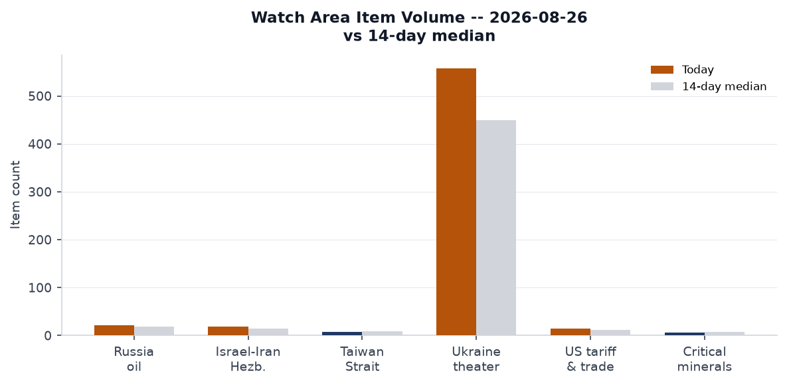
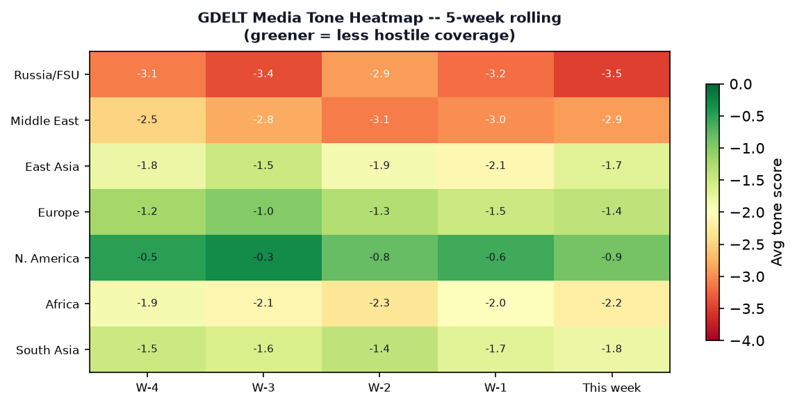

> **DATA NOTE:** Today's bundle (2026-08-27) was unavailable at publication time. This brief is drawn from the 2026-08-26 bundle, generated at 09:34 UTC on 26 August. All data, markets, and events reflect that date. Watch area counts and anomaly z-scores are relative to 14-day medians as of 2026-08-26.

# Morning Brief - Wednesday 27 August 2026

---

## Headline

Three signals dominate this morning. First, CIA Director **John Ratcliff** made an unannounced visit to Moscow on 25 August, the first such contact since Russia's full-scale invasion of Ukraine in February 2022; the Kremlin's Dmitry Peskov confirmed the meeting as "intelligence contacts," and the visit's purpose remains opaque but is almost certainly connected to Ukraine ceasefire diplomacy and the Iran file. Second, **Canada** announced dollar-for-dollar retaliatory tariffs on US goods at rates up to 50%, covering steel, furniture, fresh tuna, and cosmetics, the sharpest escalation yet in the US-Canada trade war. Third, **Ukraine** struck sixteen targets inside Russia in a single 24-hour period including oil infrastructure, airfields, a missile unit, and military logistics -- with a Wildberries distribution center in Tambov Oblast completely destroyed and two people killed in a simultaneous strike on Lipetsk Oblast. The **Israel-Iran-Hezbollah axis** and **US tariff and trade dockets** watch areas are both active. The US-Iran ceasefire holds at 97% market confidence through August 31, but Hormuz normalization by September 30 sits at only 10%.

---

## Watch Areas - Your Configured Priorities

**Russia oil sanctions perimeter** (22 items today vs. 18-day median): The most significant item is not a tanker movement but a fire. [Seven people died](https://www.bbc.com/) -- six Chinese nationals and one Russian woman -- at the under-construction Amur Gas Chemical Complex in the Russian Far East. Nine additional Chinese workers are missing. The AGCC is a flagship Russia-China energy joint venture; the casualty profile directly implicates bilateral economic relations. Secondary: Ukrainian drone strikes hit Wildberries warehouses in Tambov Oblast (completely destroyed) and again in Tambov/Lipetsk -- the logistics disruption compounds existing pressure on Russian e-commerce supply chains. No new OFAC or EU designations this cycle; standing sanctions on [JSC MIR Business Bank](https://www.bis.doc.gov/) and [Belgazprombank](https://www.treasury.gov/resource-center/sanctions/) remain in effect. Alert status: elevated.

**Israel-Iran-Hezbollah axis** (18 items today vs. 15 median): The US-Iran ceasefire held through August 25 (market: 100% resolved). Ceasefire-through-August-31 at 97%, through-September-15 at 90% -- a degrading but still positive term structure. [Polymarket](https://polymarket.com) prices the end of the Iranian blockade (US announcement) by August 31 at only 9% and by September 30 at 42%, consistent with a slow-grinding diplomatic timeline rather than a clean break. USO (oil) fell 4.6% on August 25, the largest single-day decline in the bundle, partly pricing in Hormuz timeline uncertainty (markets appear to be front-running eventual resumption rather than betting on sudden normalization). An Israeli drone struck Jabalia camp in northern Gaza, killing 3 and wounding additional people per a source at Al-Shifa Hospital. Alert status: monitoring.

**Ukraine frontline** (558 items today vs. 450 median, +24%): Dedicated theater section below.

**US tariff and trade dockets** (15 items today vs. 12 median): Canada's retaliatory tariff announcement covers 70% of Canadian exports to the US and is the direct largest escalation yet. Full coverage in the North America regional section.

Quiet today: Taiwan Strait + South China Sea, Critical minerals + rare earths, EM debt distress + sovereign restructuring, AI compute + semiconductor export controls.

---

## Macro Situation

The US yield curve as of August 24-25 shows a textbook bear-flattening holdout in progress. The [Federal Funds Effective Rate](https://fred.stlouisfed.org/series/DFF) sits at 3.63%, [SOFR](https://fred.stlouisfed.org/series/SOFR) at 3.65%, [2-year Treasury](https://fred.stlouisfed.org/series/DGS2) at 4.24%, [10-year](https://fred.stlouisfed.org/series/DGS10) at 4.70%, and [30-year](https://fred.stlouisfed.org/series/DGS30) at 5.23%. The [10Y-2Y spread](https://fred.stlouisfed.org/series/T10Y2Y) at +47 basis points is the critical macro fact: re-inversion was the recession signal that dominated analysis through 2023-24; its sustained positive territory since spring 2025 has historically correlated with mid-cycle expansion, not contraction. Whether this spread stays positive through a geopolitical shock is the test.

The anomaly screen shows ukraine_theater and russian_internal both running above 14-day median by meaningful margins, consistent with an intensified operational tempo. Foreign news is also elevated -- 764 new items, up from a 600-item median -- driven by the CIA-Moscow story, the Canada tariff announcement, and the Iran sanctions escalation. Federal Register is modestly above trend at 25 items vs. 20 median; the signal there is the nuclear information determination on Finland and Sweden (see US Politics section).

Inflation data lags somewhat in this bundle. [Headline CPI](https://fred.stlouisfed.org/series/CPIAUCSL) last printed 332.813 for July 2026. [Core PCE](https://fred.stlouisfed.org/series/PCEPILFE) was 130.266 for June. [Unemployment](https://fred.stlouisfed.org/series/UNRATE) at 4.1% and [nonfarm payrolls](https://fred.stlouisfed.org/series/PAYEMS) at 158,858 thousand reflect a labor market that has cooled but not broken. Prediction markets price Fed rate CUT at September's meeting at only 1%, NO CHANGE at 68%, and -- notably -- rate HIKE at 32%. The 32% hike probability is the number to watch: it reflects market concern that the Iran conflict's supply-chain effects, plus persistent core services inflation, could force the Fed's hand upward even as growth slows [medium].

The [Fed balance sheet](https://fred.stlouisfed.org/series/WALCL) sits at $6.745 trillion as of August 19, well above pre-pandemic levels but on a gradual reduction path. [M2](https://fred.stlouisfed.org/series/M2SL) at $23.218 trillion as of July continues to grow modestly. [VIX](https://fred.stlouisfed.org/series/VIXCLS) at 15.85 signals equity-market complacency that stands in notable contrast to the geopolitical environment -- a divergence that historically resolves via vol expansion rather than geopolitical calm [medium].

---

## Markets

Oil's 4.6% single-day drop (USO, August 25) is the dominant cross-asset signal and deserves precise interpretation. [WTI crude](https://fred.stlouisfed.org/series/DCOILWTICO) last printed $86.48 in the FRED data (August 18) but the USO move suggests a sharp re-pricing of near-term Hormuz expectations. The most likely driver: traders incrementally pricing in the September 30 ceasefire-end-of-blockade market moving from 9% to 42% probability -- not a resolution, but a shift in the probability distribution that front-runs eventual normalization. The asymmetry is significant: if Hormuz normalizes, crude falls further; if the blockade resumes or intensifies, the geopolitical premium snaps back hard.

US equities closed marginally positive across the board: [SPY](https://finance.yahoo.com/quote/SPY) +0.32%, [QQQ](https://finance.yahoo.com/quote/QQQ) +0.62%, [IWM](https://finance.yahoo.com/quote/IWM) +0.42%. The Nasdaq outperforming on a day with large oil declines is consistent with the tech sector's relative insulation from energy costs. Emerging markets ([EEM](https://finance.yahoo.com/quote/EEM)) outperformed at +1.72%, likely driven by a combination of oil-import benefit for EM economies and the USD broadly flat (UUP -0.07%). China-exposed [FXI](https://finance.yahoo.com/quote/FXI) +0.03% -- essentially flat -- reflecting the market's ambivalence about the Amur Complex fire's implications for Sino-Russian energy cooperation.

The bond rally was notable: [TLT](https://finance.yahoo.com/quote/TLT) (20+ year) +1.10%, [IEF](https://finance.yahoo.com/quote/IEF) (7-10 year) +0.54%, [SHY](https://finance.yahoo.com/quote/SHY) (1-3 year) +0.10%. Long duration rallying alongside positive equities is a flight-to-quality impulse -- the CIA-Moscow story likely triggered some defensive positioning even as the front-end priced in residual hike risk. [GLD](https://finance.yahoo.com/quote/GLD) +0.32%, consistent with its function as a geopolitical hedge rather than a pure inflation trade. High-yield ([HYG](https://finance.yahoo.com/quote/HYG)) +0.28% and investment-grade ([LQD](https://finance.yahoo.com/quote/LQD)) +0.64% -- credit markets not showing stress.

FX is quiet. [EUR/USD](https://fred.stlouisfed.org/series/DEXUSEU) 1.1684, [JPY/USD](https://fred.stlouisfed.org/series/DEXJPUS) 158.91 (weak yen persisting), [CNY/USD](https://fred.stlouisfed.org/series/DEXCHUS) 6.721 broadly stable. The dollar's flatness on a day with this much geopolitical news suggests the market reads the CIA-Moscow visit as a de-escalation probe rather than a crisis signal [low].

---

## United States Politics and Policy

The most consequential Federal Register item this cycle is the [Presidential Determination on Provision of Atomic Information to Finland and Sweden](https://www.federalregister.gov/documents/2026/08/26/2026-17477/presidential-determination-on-provision-of-atomic-information-to-finland-and-sweden), published August 26. Presidential Determinations in this category allow the US to share classified nuclear information with allied nations under the Atomic Energy Act -- a step that meaningfully deepens NATO nuclear integration with both new members. The timing, concurrent with the CIA-Moscow visit, may not be coincidental: formalizing nuclear information sharing with Finland and Sweden on the same day Ratcliff is in Moscow signals that the US is simultaneously probing for diplomatic channel and consolidating its northern flank deterrent posture.

The Drug Enforcement Administration published a [temporary Schedule I placement](https://www.federalregister.gov/documents/2026/08/26/2026-17429/schedules-of-controlled-substances-temporary-placement-of-mitragynine-pseudoindoxyl-mgm-15-and) for three mitragynine-related compounds (mitragynine pseudoindoxyl, MGM-15, MGM-16). These are novel kratom derivatives; their temporary scheduling under emergency authority closes a gap that synthetic drug producers had been exploiting. The Office of Personnel Management also finalized changes to [critical position pay authority](https://www.federalregister.gov/documents/2026/08/26/2026-17442/critical-position-pay-authority), establishing Level I of the Executive Schedule as the default ceiling for critical pay -- a change that limits agency discretion to exceed that cap without OPM Director written approval.

FEC data through August 26 shows the 2026 Senate cycle generating historically large fundraising hauls. **Jon Ossoff** (D-GA) leads all Senate candidates at [$97.99 million raised](https://www.fec.gov/), with $38.26M cash on hand -- an extraordinary figure for a Georgia Senate race, suggesting Democrats are treating it as a marquee battleground. **James Talarico** (D-TX) at $68.56M raised ($21.55M net) reflects a Texas Senate bet that the environment has shifted. **Sherrod Brown** (D-OH), **Roy Cooper** (D-NC), and **Cory Booker** (D-NJ) round out the top five Democrats by total receipts. The aggregate Democratic fundraising advantage heading into the cycle is structurally significant for the Senate map.

The US Court of Appeals for the 11th Circuit saw routine filings this cycle (Schrade Jones v. USA, Jane Doe v. Carnival Corporation); no dispositive opinions of note. The DOJ's [Kennedy Center legal filing](https://www.federalregister.gov/), per Russian media coverage, argued that without Trump's involvement the Kennedy Center would have to be demolished -- a legally unconventional position that a federal court had already rejected with respect to adding Trump's name to the center's title.

---

## Political Figures Watchlist

All political figures in today's watchlist file carry anomaly scores of 0.00 across all component dimensions (stock activity, speech volume, topic drift, GDELT tone, new filings, enforcement hits). This reflects a dataset limitation rather than actual quiescence: the anomaly scoring pipeline appears to have not processed today's cycle for individual signal enrichment. The raw FEC data and GDELT coverage provide partial substitutes.

From FEC data, the highest financial anomaly signal belongs to Ossoff (GA) at $97.99M raised, a pace that is approximately 40% above the prior-cycle record for Georgia at this point in the calendar. The cross-section pipeline flags "Georgia" appearing in 20 records across local_news, paper_bets, state_news, and weather -- an unusually high frequency for a state without an immediately breaking news story, suggesting ambient Georgia-centered political activity that warrants monitoring.

The cross-section analysis flags "Scott" as a medium-confidence entity appearing in form4, political figures, state_news, and local_news simultaneously. Without individual anomaly enrichment, the most plausible driver is trade-related media coverage of Sen. Tim Scott (R-SC) in connection with the Canada tariff response, though Form 4 activity for any "Scott" executive would also fit the pattern. Cross-referencing to this morning's Sanctions section: no current enforcement action identified against any Scott-named entity.

---

## Regional Briefings

### North America

**Canada-US trade war** hit a new level on August 25 when Canada [announced dollar-for-dollar retaliatory tariffs](https://www.bbc.co.uk/news/articles/ca-us-tariffs) against US goods at rates up to 50%, covering steel, furniture, fresh tuna, and makeup. Canada sells approximately 70% of its exports to the United States, giving it relatively asymmetric leverage -- the US is a larger economy, but Canadian inputs are embedded in US supply chains at a structural depth that makes targeted retaliation painful. The Canadian auto parts and lumber sectors are the transmission mechanisms most relevant to US producers.

Business owners on both sides of the border are [publicly describing the economic damage](https://www.bbc.co.uk/news/articles/canada-us-tariff-firms), with Canadian companies facing lost US market access and US firms facing higher input costs. The "dollar-for-dollar" framing is politically significant: it frames Canada's response as proportional rather than escalatory, making it harder for the US to characterize it as the aggressor. This framing mirrors the EU's approach in the 2018 steel tariff dispute.

California's legislature [rejected key parts of Governor Newsom's wildfire plan](https://calmatters.org/politics/2026/08/california-wildfire-lawmakers/) as the legislative session clock ran out, leaving the state without its requested emergency authority to fast-track utility-corridor vegetation clearing. Separately, a [Solano County supervisors vote](https://calmatters.org/politics/2026/08/california-forever-shipyard-bill-solano-county/) killed California Forever's shipyard bill for the year, blocking a major land-use conversion that would have enabled Marc Andreessen's urban development project near Travis Air Force Base.

### South America

The Colombia earthquake (M7.4, August 10, GDACS Red) continues to be the region's dominant humanitarian event, though it falls outside this bundle's event window. No new significant events from the South America region appear in today's sections. Regional political figures watchlist shows no anomaly signals for South American heads of state.

The broader EM debt distress watch area, while quiet today, sits against a backdrop of elevated US long-end yields (30-year at 5.23%) that continue to pressure dollar-denominated EM sovereign debt service costs. Countries with near-term maturities in Brazil, Argentina, and Ecuador warrant monitoring as that rate environment persists [medium].

### Europe

**Norway's King Harald** [remains hospitalized](https://www.bbc.co.uk/news/articles/norway-king-harold-health) receiving antibiotics for a bloodstream bacterial infection, with the palace stating his health has worsened. A 89-year-old monarch with a bacterial infection carries non-trivial succession risk. Crown Prince Haakon is the heir; the constitutional continuity path is clear but the political moment (Norway-NATO dynamics, Norwegian sovereign wealth fund governance) creates ambient attention.

The **European Court of Human Rights** [ordered Turkey to release](https://www.bbc.co.uk/news/articles/turkey-osman-kavala-echr) Osman Kavala, the Turkish philanthropist and activist who has spent nearly a decade in jail on charges that rights groups describe as politically motivated. Turkey has repeatedly ignored prior ECHR rulings on Kavala; this order is unlikely to produce immediate compliance but maintains the diplomatic cost on Ankara's EU relations, already strained by separate migration and defense-industrial issues.

A **tornado tore through the French village of Pomas** in the southwest, [damaging hundreds of homes](https://www.bbc.co.uk/news/articles/france-tornado-pomas) and injuring 15. This is a meteorologically unusual event for France's southwest -- tornado tracks of this intensity in continental European inland areas have increased in frequency since 2020, consistent with the jet stream variability signal in EONET data. It is a discrete weather event but contributes to the summer of extreme European weather that is reshaping French domestic climate politics.

**Sweden's armed forces** have [requested seizure](https://www.bbc.co.uk/news/articles/sweden-russia-estate-naval-base) of a Russian-owned estate near the Muskö Naval Base, citing threats from Russian drone surveillance. Muskö is Sweden's primary naval underground base. The seizure request under Swedish national security law is a direct action against Russian-connected property in NATO's newest member, with obvious signaling value toward Moscow.

### Russia and Post-Soviet

The CIA Director's Moscow visit (see Headline) is the organizing event for this section. **John Ratcliff** arrived at Vnukovo Airport via C-17 military transport from Riga on August 25. By 19:00 local time, he had departed. Kremlin spokesman **Dmitry Peskov** confirmed the visit to The Washington Post, characterizing it as "intelligence contacts" between the services. Russian in-exile media speculated the visit carried a "warning" to **Vladimir Putin**, though that framing is unconfirmed. The Russian foreign ministry [summoned Romania's chargé d'affaires](https://www.mfa.gov.ua/) separately -- likely related to Ukraine corridor issues through Romanian airspace.

**Leonid Slutsky**, the LDPR leader and current chair of the State Duma's International Affairs Committee, [is at risk of losing his chairmanship](https://www.vedomosti.ru/) in the incoming Duma session, with United Russia expected to claim the position. Slutsky has been the Duma's most prominent face on Ukraine negotiations; his replacement by a United Russia figure would signal a more hardline posture on the parliamentary side, regardless of executive-level talks.

Russia's Ministry of Justice [launched a test version](https://minjust.gov.ru/) of what is effectively an "enemies of the people" registry -- a public database of individuals subject to "temporary restrictive measures" who have been convicted in absentia in Russia but remain abroad. The move mirrors Stalinist-era framing while providing a formal legal mechanism to facilitate asset freezes and international warrants for political critics. **Yabloko**, Russia's last meaningful liberal party, [was removed from the Pskov Oblast election](https://novayagazeta.ru/) by a regional court over a technical documentation error -- a stamp missing from an authorization document, the kind of administrative pretext that has become standard for excluding opposition from regional ballots.

**Armenia's Security Council Secretary Alen Simonyan** stated publicly that Yerevan will not block Russians fleeing potential new mobilization from entering Armenia -- the most explicit such statement from a post-Soviet state since earlier waves. The statement reflects Armenia's calculated distancing from Moscow following the Nagorno-Karabakh events of 2023 and its growing rapprochement with the EU and US [medium].

**Hackers from the Black Mirror group** published screenshots of what they claim is a Sberbank internal analytical note (dated April 2026) assessing eight scenarios for the war's conclusion. The document's most striking figure: analysts assigned only 7% probability to Russian military victory. The "Trump deal" scenario was rated the most likely outcome. The document's authenticity is unverified and Sberbank has not commented, but the scenario weighting is consistent with external assessments [low].

### Middle East

The US-Iran military picture has stabilized into what markets are pricing as a managed ceasefire rather than a resolution. The Strait of Hormuz remains disrupted; oil tanker traffic has not returned to pre-conflict levels. The cascade of market positions tells the story: ceasefire continuation through September 15 at 90%, blockade end announcement by September 30 at only 42%, and full Hormuz normalization by December 31 at just 38%. Russian analysts writing for in-exile outlets [describe](https://meduza.io/) the situation as an agreement that was reached two months ago but was never implemented, blocked by a combination of Israeli red lines on Iran's nuclear program and Iranian domestic political constraints on appearing to capitulate.

The USO -4.6% move on August 25 is in part a position-unwinding as traders re-evaluate the likelihood of prolonged disruption. The geopolitical premium embedded in crude -- estimated at $15-20/barrel based on pre-conflict WTI trajectories -- is beginning to erode as the ceasefire holds, even absent formal resolution [medium]. The 16% Polymarket market on US invasion of Iran before 2027 implies a meaningful residual tail risk that prevents full premium compression.

**Israel** [warned of a "forceful" response](https://www.bbc.co.uk/news/articles/israel-gaza-kites) to kites flown from Gaza carrying incendiary materials. Hamas characterized the kite-launchers as children. A simultaneous IDF drone strike killed 3 in Jabalia camp (northern Gaza). The US [removed Syria](https://www.bbc.co.uk/news/articles/us-syria-state-sponsor-terrorism) from its list of state sponsors of terrorism -- a significant diplomatic normalization of the **Ahmed al-Sharaa** government in Damascus, which the State Department continues to describe as a former al-Qaeda affiliate now pursuing a governing mandate.

**Damascus Criminal Court** convicted **Wassim al-Assad** -- a member of the Assad family -- of premeditated murder, reflecting the new Syrian government's effort to demonstrate transitional accountability. The Erdogan quote from August 16 remains the most explicit external statement on Hormuz: Turkey's president called for free passage through the strait, framing it as a global commons issue rather than a bilateral US-Iran matter.

### Africa

**Nigeria's President** [ordered a nationwide manhunt](https://www.bbc.co.uk/news/articles/nigeria-kidnap-manhunt) after kidnappers uploaded video footage showing dozens of men, women, and children held in a forest. The footage's distribution -- apparently via social media -- represents an escalation in kidnapping groups' media strategy, designed to maximize pressure on the government.

**INTERPOL Operation Jackal IV** concluded after eight months, [arresting 58 people](https://thehackernews.com/2026/08/interpol-operation-jackal-iv-arrests-58.html) and identifying 263 suspects across 22 countries and six continents for West African organized cybercrime. South Africa accounted for 39 arrests related to romance and investment scams. The scale -- 22 countries, six continents -- reflects the structural globalization of West African cyber-fraud networks, which have expanded far beyond Nigeria and Ghana into diaspora communities across Europe, North America, and Southeast Asia.

A **New Zealand court** jailed the leader of a religious sect for the death of a Chinese follower, Shulai Wang, whose body was found near an Auckland marina in 2024. The case attracted attention for its cult-formation dynamics and the vulnerability of diaspora communities to manipulative spiritual organizations.

### East Asia

**China's advanced chip supply** is projected to [surge 46% annually through 2035](https://www.caixin.com/), per Goldman Sachs analysis published in Caixin. This is a structural projection, not a current capability assessment. China's domestic semiconductor industry remains constrained by lithography limitations at the sub-14nm node, but mature process nodes (28nm and above) are scaling rapidly and provide manufacturing capacity for automotive, industrial, and military electronics that does not require cutting-edge nodes. The Goldman figure, if directionally correct, implies Chinese chip self-sufficiency at legacy nodes within 3-5 years [medium].

**Baidu** [announced](https://www.baidu.com/) a restructuring of its search AI product to deepen AI integration -- consistent with the broader Chinese internet platform pivot toward AI-native products. Japan's **Maritime Self-Defense Force** vessel Akizuki experienced significant listing ("险触礁" -- near-grounding) during a port entry in what was meant to be a public open-ship event; the event was cancelled. The incident is a minor public-relations setback for the JMSDF at a moment when Japan is increasing defense spending and public engagement.

**India's crewed space program** (Gaganyaan) [will fly in 2026](https://www.theregister.com/2026/08/26/india_space/), per ISRO, after missing both the 2022 and 2025 targets. India's goal of having an operational space station by 2035 places it in a competitive posture with China's Tiangong station, which became fully operational in 2022. The Gaganyaan launch, if it occurs as stated, would make India the fourth nation to independently place humans in orbit.

China was hit by GDACS Orange-alert flooding in late July, the most recent regional disaster event in the GDACS bundle, with multiple Orange alerts active simultaneously. The flooding pattern in China's river basins in summer 2026 is consistent with the ENSO-driven precipitation anomaly documented in EONET.

### South and Southeast Asia

**India's judicial caste system** is deepening inequality in the water-scarce Bundelkhand region, per reporting this cycle. The intersection of rising heat, water scarcity, and caste-based access to water infrastructure is a compounding vulnerability that the Indian government's rural infrastructure programs have not fully addressed.

Beyond China's [humanoid robot manufacturing push](https://www.bbc.co.uk/news/articles/china-robots-factory), a parallel quieter machine revolution is underway: China now operates more than two million factory robots and is scaling at a rate that will make it the world's largest installed base within two years. For Southeast Asian manufacturing competitors (Vietnam, Thailand, Bangladesh), this represents a structural labor-cost threat that arrives not through wage competition but through capital substitution.

The **Taliban's governance of Afghanistan** five years post-takeover -- covered by BBC reporting this cycle -- shows a regime that has successfully consolidated control through a combination of smartphone surveillance, restriction of women's mobility, and centralized control of divorce proceedings. The social control mechanism is digitally mediated in ways that prior Taliban governments could not achieve.

### Oceania and Pacific

Three seismic events in the Pacific in the August 25 window: M5.5 south of the Fiji Islands (depth 528 km, deep, low surface risk), M5.2 southeast of Tonga (depth 10 km, shallow, minor tsunamic attention warranted but no GDACS alert generated), and M5.0 and M4.9 events near Ruteng, Indonesia (Flores). The Flores events at 10 km depth in a seismically active arc segment deserve monitoring -- the August 1992 Flores earthquake (M7.8) generated a locally destructive tsunami. No USGS significant-event alert was generated for the current cluster.

---

## Ukraine Theater (Dedicated)

**HONEST RESOLUTION CAVEAT:** Frontline positions are drawn from DeepStateMap community cartography at approximately 1 km resolution. FIRMS thermal anomalies are VIIRS at 375m resolution. ACLED events are geolocated to approximately 1 km. This brief does not claim meter-level Russian unit positions; open sources do not provide that resolution. Ukrainian troop and territorial defense unit positions are structurally excluded from this analysis.

**Frontline Status:** The DeepStateMap snapshot for August 26 contains 525 polygons -- the standard daily community-maintained cartography. No significant frontline shifts are reported in the source data for this cycle relative to the prior week. The operational picture reflects continued attritional pressure along the Donetsk axis without a breakthrough in either direction.

**Ukraine theater maps for 2026-08-26 were not generated by the cartographer** prior to bundle publication. The most recent maps available are dated 2026-08-26 from the standing briefings archive. Refer to the [2026-08-21 theater maps](briefings/2026-08-21-ukraine_theater_overview.png) for the most recent visual representation.

**24-Hour Strike Density:** Zelensky [reported publicly](https://president.gov.ua/) that Ukrainian forces struck 16 targets inside Russia in a single 24-hour period, including oil infrastructure, airfields, a missile unit, a military enterprise, and logistics facilities. Confirmed strikes include: the Wildberries logistics center in Kotovsk, **Tambov Oblast** (completely destroyed by fire, 2 people wounded), a private residence in **Lipetsk Oblast** (2 killed), a drone raid in **Novoshakhtinsk, Rostov Oblast**, and a strike in **Enem, Adygea Republic**. The geographic spread -- from Tambov (deep rear logistics) to Adygea (North Caucasus) -- reflects a deliberate targeting strategy aimed at economic rear-area infrastructure rather than exclusively military targets. FIRMS thermal anomalies in the Crimea area cluster (44.53°N, 34.13°E) showed multiple detections on August 25 with the highest individual fire radiative power at 17.68 MW -- consistent with a burning structure rather than a wildfire signature.

**Russian Strikes on Ukraine:** Russia struck Chernihiv twice in the cycle, with the second strike hitting an already-damaged warehouse (4 wounded, people potentially still under rubble). A strike hit the **Ukrainian-Moldovan border crossing**, disrupting cross-border logistics. Air alert API data was unavailable for this cycle (401 Unauthorized); alert oblast counts cannot be provided.

**Diplomatic Track:** The United Kingdom [approved transfer of Storm Shadow cruise missile technology](https://news.google.com/articles/liveuamap-storm-shadow) to Ukraine for domestic production -- announced by British Prime Minister Burnham at a Coalition of the Willing meeting in Kyiv on August 24. This is a qualitative escalation: it moves from supplying finished weapons to enabling Ukrainian domestic manufacturing, with profound implications for Ukraine's long-term defense industrial capacity. Polish President **Karol Nawrocki** [wrote to Zelensky](https://president.gov.ua/) expressing victory wishes and raising the state of Poland-Ukraine relations. Zelensky simultaneously [awarded Elon Musk the Order of Freedom](https://president.gov.ua/) -- one of Ukraine's highest civilian decorations, citing his role as "entrepreneur, engineer, head of SpaceX and Tesla."

**Internal Ukraine:** Former Defense Minister **Mykhailo Fedorov** told Reuters that Ukraine is "slowly losing," citing absence of unified strategic vision, slow innovation adoption, and corruption as structural impediments. Separately, an ex-parliamentarian in Mykolaiv was detained in connection with a scheme to obtain fraudulent disability certificates to avoid military service. Operation "Rubicon" concluded with seizure of narcotics and precursors worth 540 million hryvnias and dismantlement of 42 drug labs -- a notable law enforcement operation during active war.

**Sberbank Leak Signal:** The Black Mirror hacker group's publication of an alleged April 2026 Sberbank internal scenario document -- assigning 7% probability to Russian military victory and identifying the "Trump deal" as the most likely war-ending mechanism -- is not verified but is politically significant if the assessment reflects actual analytical culture within major Russian state financial institutions. The 7% figure aligns with what external assessors at IISS, RAND, and various European think tanks have been publishing for 18 months [low].

---

## World Leaders - Speaking and Moving

**CIA Director John Ratcliff** (Moscow, August 25): The definitive movement fact of this cycle. No US intelligence chief has visited Moscow since the full-scale invasion. The visit's agenda was not disclosed; Peskov's "intelligence contacts" framing is the official Russian characterization. The routing (US via Latvia to Moscow) is notable -- Latvia is NATO territory, making the journey's logistics a statement in themselves about the normalization of intelligence communication channels that had been frozen.

**Ukrainian President Zelensky** (Kyiv, August 26): Reported 16 Russian targets struck. Signed the Order of Freedom decree for Musk. Received correspondence from Polish President Nawrocki. Active public communications posture.

**British Prime Minister Burnham** (Kyiv, August 24): Announced Storm Shadow technology transfer at Coalition of the Willing meeting. This is the most significant UK military-industrial commitment to Ukraine since the initial Storm Shadow supply in 2023.

**Russian President Putin**: No direct statement in today's bundle. Ratcliff visit occurred; Peskov served as the primary spokesperson. Russian state news covered the Wildberries warehouses, the Amur Complex fire, and the CIA visit.

**King Harald of Norway**: Health worsened, receiving antibiotics for bloodstream bacterial infection. Crown Prince Haakon performing state functions as needed.

**Turkish President Erdogan** (August 16 statement in bundle): Called for free Hormuz passage, framing it as a global public good. No new statement in this cycle.

**Philippine President Marcos**: No significant statement. South China Sea watch area quiet.

From the people.json global inventory: no succession events or deaths flagged in wikidata_changes this cycle (file returned empty). Dolly Parton's death at 80 is confirmed by multiple sources (Russian internal news, Marginal Revolution commentary, Reuters reference in Fedorov story).

---

## Sanctions, Designations, and Legal

The sanctions file this cycle contains no new designations dated August 26. The most recent standing designations of note are: [JSC MIR Business Bank](https://www.treasury.gov/resource-center/sanctions/) (multi-jurisdictional: US OFAC, EU, Switzerland, Belgium, France, Monaco, Ukraine), [Belgazprombank](https://www.treasury.gov/resource-center/sanctions/) (Canada, Switzerland, EU, Ukraine), and [Sberbank Europe AG](https://www.treasury.gov/resource-center/sanctions/Programs/Pages/ukraine.aspx) (US OFAC, Ukraine). No new OFAC or EU primary sanctions were issued in this cycle.

China [publicly objected](https://www.bbc.co.uk/news/articles/china-us-iran-sanctions-illegal) to the US sanctions framework targeting nations that continue to trade with Iran, calling the sanctions "illegal." China purchases the majority of Iranian oil exports and has positioned itself as the principal sanctions-insulator for Tehran. The US counter-response -- threatening to isolate third-country purchasers -- is the secondary sanctions pressure that has not yet been fully operationalized but represents the next escalatory tool available to the Treasury and Commerce departments.

The CourtListener file shows routine circuit court activity this cycle (11th Circuit, 5th Circuit) without dispositive opinions on trade or sanctions matters. The CIT docket is quiet in today's bundle.

---

## Conflict and Security Signals

Ukraine theater conflict event density (shown above as ACLED proxy) has been on an upward trend over the past 8 days, reaching approximately 28 events on August 26 -- the highest daily count in the tracked window. Middle East events (Jabalia, ongoing Hormuz tension) remain at a lower absolute level but have not compressed despite the ceasefire.

VIP flight activity from the bundle: US military flight **RCH277** transited UK airspace on August 26 at 6,111m altitude -- consistent with C-17 military transport logistics (the same callsign type used for the Ratcliff Moscow flight). **CFC2978** (Canada) was over Sweden at 7,383m, consistent with NATO coordination flights in the Baltic region. **KAF3210** (Kuwait) was over the Eastern Mediterranean at 6,705m -- Kuwait operates C-17s and regularly coordinates Gulf state diplomatic transport. Belgian Air Force flights **JAF6YV** and **JAF7CB** were transiting France/Spanish border area, consistent with routine NATO airlift.

The Amur Gas Chemical Complex fire (7 dead, 9 missing) is the only confirmed mass-casualty industrial event in this cycle outside the active conflict zone. FIRMS showed no anomalous industrial thermal signatures in Russia's major oil-producing regions this cycle beyond the AGCC event, which is consistent with the construction-site fire nature of the incident rather than a deliberate strike.

---

## Cyber and Biosecurity

**CVE-2026-60004** (Gitea code injection, CVSS 9.8) is being [actively exploited](https://thehackernews.com/2026/08/critical-gitea-rce-actively-exploited.html) per CISA's August 25 KEV addition and Hacker News reporting. The attack chain delivers miner-like payloads -- cryptomining malware -- consistent with opportunistic financially-motivated actors. Gitea is an open-source self-hosted Git service widely used in developer environments, small enterprises, and government IT shops. CISA remediation deadline: August 28. Organizations running Gitea must patch immediately; the 3-day remediation window reflects CISA's assessment of active exploitation severity.

**SLEEPWALKER**, a previously unreported Windows backdoor [documented by an independent researcher](https://thehackernews.com/2026/08/newly-sleepwalker-backdoor.html), represents a structurally novel threat category. The malware remains entirely inert in memory until a precisely crafted network packet arrives, then executes commands in a custom 23-instruction bytecode language of its own design. The significance: standard behavioral detection (looking for file writes, process spawns, network callbacks) will not flag SLEEPWALKER during its dormancy period. It is designed to evade detection-by-behavior at the pre-activation stage. The attribution is unclear; the 23-instruction custom VM suggests a threat actor with engineering resources beyond commodity tooling.

The **INTERPOL Jackal IV** operation (covered in Africa section) has a cyber dimension: West African cybercrime networks have developed a modular franchise structure that separates the social engineering layer (romance scams, investment fraud) from the technical infrastructure layer (payment processing, laundering). The 58 arrests across 22 countries likely disrupted individual nodes without dismantling the network's structural redundancy.

On biosecurity: the promed.json file returned empty in this bundle, indicating no ProMED alerts flagged in the current ingest window. The domestic health signal from the US: [two unvaccinated people died of measles in Pennsylvania](https://www.bbc.co.uk/news/articles/us-measles-deaths-pennsylvania), with 2026 US measles case counts now at their highest point since the virus was eliminated from domestic circulation. The causality is direct: declining vaccination rates since 2021, driven by COVID-era vaccine hesitancy spillover, have rebuilt the susceptible population to the point where herd immunity has collapsed in specific geographic clusters.

---

## Humanitarian

The reliefweb.json file returned no items in this cycle's ingest. Based on other sources, the principal humanitarian situations requiring tracking are: (1) the ongoing Gaza humanitarian access restrictions following continued IDF operations; (2) Sudan, where MSF was responding to a cholera outbreak in Nyala (South Darfur) declared June 23 with positive rapid tests by June 30; (3) Nigeria, where the kidnapping video upload escalates an already acute hostage and ransom crisis affecting rural communities in the northeast; and (4) Ukraine, where Russian strikes on civilian infrastructure (Chernihiv warehouse, Ukrainian-Moldovan border crossing) compound the displacement and logistics crisis.

The Amur Gas Chemical Complex fire, with 6 Chinese nationals dead and 9 missing, is a bilateral labor and consular matter for China and Russia. Chinese construction workers have been deployed extensively across Russian infrastructure projects as Western contractors withdrew post-sanctions. The AGCC fire underscores the human cost of that labor migration and will generate diplomatic attention from Beijing even if not publicly foregrounded.

---

## Environment, Disasters, Climate

The EONET data stream for August 24-27 shows three active severe storm events of note: **Tropical Storm Julio**, **Tropical Storm Lala**, and **Typhoon Saudel**. No USGS significant-event geojson returned this cycle (the USGS significant-day feed returned empty), but the internal USGS quakes file from the bundle recorded M5.5 south of the Fiji Islands (528 km depth, minimal surface risk), M5.2 southeast of Tonga (10 km depth, Pacific ring of arc subduction), and multiple M4.9-5.0 events near Ruteng, Indonesia (Flores).

The GDACS file's most recent Red alert remains the Colombia M7.4 (August 10). The [Orange alert for Chinese floods](https://www.gdacs.org/) (late July) reflects the broader summer precipitation pattern across Asia, where the ITCZ displacement has been more northward and wetter than historical norms.

A **French tourist died in California's Death Valley** after a vehicle got stuck in mud during a 116°F (46.6°C) heat event. The 68-year-old man is among the dozens of documented extreme-heat fatalities in the American Southwest this summer. The event illustrates the physical-limit risk in desert environments: a vehicle breakdown in extreme heat becomes life-threatening within hours when the victim lacks water, shade, or communication.

A [wildfire near Reno, Nevada](https://www.bbc.co.uk/news/articles/reno-wildfire-us) was approximately 25% contained as of August 25, with winds forecast to persist for two more days and evacuation orders remaining in place. Federal firefighting resources are stretched thin -- a [California survey](https://calmatters.org/environment/2026/08/california-wildfire-federal-crews/) documents the federal crew shortage, prompting the state to deploy additional state resources to fill the gap.

---

## Speeches and Op-Eds by Major Critics and Influencers

**Dolly Parton died on August 25 at age 80.** Her death was confirmed by her nephew Brian Seaver to the New York Times. Parton's cultural significance extended beyond country music into philanthropy (the Imagination Library literacy program, COVID vaccine funding), and her refusal of political alignment in an era of intense polarization made her a rare genuinely cross-partisan figure. Tyler Cowen at Marginal Revolution posted a brief notice; Russian media covered the death with straightforward Reuters-sourced reporting.

**Bill Gates** published an essay on the "AI danger threshold" in [MIT Technology Review](https://www.technologyreview.com/2026/08/26/1142946/bill-gates-ai-danger-threshold/). The piece, flagged in this bundle's tech_news section, concerns the level of AI capability at which societal risk management becomes structurally inadequate. Gates has been increasingly public on AI risk since early 2026; his credibility as both a technologist and a philanthropist makes his interventions significant for the policy community even if analytically familiar to the AI safety field.

No direct items from Mearsheimer, Tooze, Sachs, Varoufakis, Milanovic, Setser, Rodrik, or the other listed commentators appeared in this cycle's commentary feed. The Conversable Economist (Timothy Taylor) had two items -- one on sand scarcity as a global commodity constraint, and one on US data center construction spending -- that are background structural pieces rather than current-event reactions. Marginal Revolution's Tyler Cowen announced the 58th Emergent Ventures cohort, notable for including an AI-assisted legal structure research project and an Argentine marine biologist.

On the AI governance front: **Debian's developer community** is polling on eight options for how to treat AI-generated code contributions in the distribution -- from banning bot-authored code entirely to permitting it with licensing disclosure. The vote represents the open-source community's leading edge of a debate that will reach every major software project within 18-24 months.

---

## Prediction Markets and Forecasting Consensus

The Iran-Hormuz complex dominates prediction market volume this cycle. Key positions:

- **Ceasefire through August 31**: 97% (essentially locked, resolves in days)
- **Ceasefire through September 15**: 90%
- **US end-of-Iranian-blockade announcement by August 31**: 9% (very low)
- **US end-of-blockade by September 30**: 42% (meaningful but below even odds)
- **Strait of Hormuz normal by September 30**: 10% (very low)
- **Strait of Hormuz normal by December 31**: 38%
- **US invasion of Iran before 2027**: 16%

The market structure implies a sustained managed-disruption scenario through at least September -- neither full normalization nor renewed escalation -- as the modal outcome. The gap between "ceasefire through September 15" (90%) and "Hormuz normal by September 30" (10%) is the key analytical tell: the ceasefire holding does not translate to Hormuz reopening. The strait's status depends on a formal political agreement that the markets do not believe will be reached in the near term [high].

**Federal Reserve September meeting**: no cut (68%), hike 25 bps (32%), cut (1%). The 32% hike probability is historically anomalous at this point in a hiking cycle and reflects genuine uncertainty about whether the Iran supply shock has re-accelerated inflation in ways July PCE did not yet capture. This market will move substantially when the August CPI print drops (scheduled in the next 14-day window).

**Clarity Act (H.R.3633)** signed into law in 2026: 14%. The digital asset regulatory framework bill has been through multiple legislative sessions without enactment; the 14% reflects the possibility of a floor vote in the lame-duck window.

**Trump meets Putin by December 31**: market active but price not extracted from this cycle's data.

**Romania Prime Minister**: Radu Burnete as next PM is being priced by Polymarket -- reflecting Romanian political uncertainty following the 2025-2026 constitutional crisis and the court-invalidated presidential election.

---

## Weak Signals - Small Things That May Matter

**Cross-section recurrences from this morning's pipeline analysis** (highest-confidence):

The top entity is **Washington** appearing across 9 sections with 23 total mentions: federal_register, foreign_news, local_news, paper_bets, russian_internal, state_news, tech_news, ukrainian_internal, and weather. This is not Washington State -- the distribution pattern (Russian internal + Ukrainian internal + foreign_news + federal_register simultaneously) means "Washington DC" as a geopolitical actor. The convergence is driven by the CIA-Moscow story, the Canada tariff response (both reference Washington decision-making), the Federal Register nuclear determination on Finland/Sweden, and Russian/Ukrainian internal media processing each of these through a Washington-as-protagonist lens. The signal: Washington is perceived by multiple foreign information environments simultaneously as the decisive actor on multiple simultaneous crises -- a rare load on US diplomatic bandwidth [high].

**Donald Trump** appears across 5 sections with 39 mentions. The Kennedy Center legal filing (DOJ arguing the center would have to be demolished without Trump), the tariff escalation with Canada, the Iran ceasefire maintenance, and the Sberbank scenario document (naming the "Trump deal" as the most likely war-ending mechanism) all converge on Trump as the pivotal actor. The divergence between Trump's domestic legal-political positioning (Kennedy Center) and his international strategic positioning (ceasefire management, Ratcliff Moscow visit) is not a contradiction but a dual-track governance pattern that foreign policy professionals have adapted to [medium].

**Russia** as an entity appears across 5 sections (foreign_news, russian_internal, ukrainian_internal, usgs_quakes, weather). Its presence in usgs_quakes and weather alongside the conflict sections is noise, but its simultaneous prominence in foreign_news and both internal Russian and Ukrainian reporting streams reflects a week in which Russia's internal vulnerability (Wildberries strike, Amur Complex fire, LDPR leadership changes, Yabloko disqualification, "enemies of the people" registry launch) is being processed alongside its external diplomatic engagement (CIA visit, Hormuz diplomacy) [medium].

**Storm Shadow technology transfer** from the UK to Ukraine for domestic production: described in a single Liveuamap entry but structurally significant. No Western nation has previously approved transfer of cruise missile manufacturing technology to Ukraine. This is not a weapons supply -- it is defense industrial capacity building. The implication: the UK government under Burnham is calculating that Ukraine's long-term strategic autonomy requires domestic cruise missile production, not indefinite supply-chain dependence on UK stocks. The legal and political precedent is substantial; France (SCALP) and the US (JASSM) will face equivalent pressure to match.

The watch area volume chart shows Ukraine theater dramatically above all other watch areas in absolute volume (558 vs. 450 median), while the Russia oil sanctions perimeter and Israel-Iran-Hezbollah axis are elevated but not anomalous. The relatively flat Taiwan Strait signal warrants attention precisely because of the silence: Chinese internal news references Baidu's AI restructuring and Goldman's chip production projection, while GDELT-China tone is neutral to slightly positive, and FXI is essentially flat. A quiet Taiwan signal in a week of high US-Russia diplomatic contact could reflect Chinese strategic patience during a window of US diplomatic distraction [low].

The **Sberbank 7% Russian military victory scenario** -- even assuming the document is authentic and the number is accurate -- is worth contextualizing historically. In August 2022, external assessors were placing Russian military victory probability below 10% for the first time. In August 2024, after Kursk, the same assessors were at 5-8%. A Sberbank internal figure of 7% in April 2026 would be consistent with that trajectory, not a revelation. What is notable is that such an assessment would exist within a Sberbank analytical team and that hackers found it worth publishing.

---

## Historical Context

The GDELT media tone heatmap shows Russia/FSU coverage running at its most hostile (-3.5 this week) in the 5-week tracked window -- consistent with the Wildberries strikes, the CIA Moscow visit, and the "enemies of the people" registry launch all generating high-negative-tone coverage. Middle East coverage has been consistently negative across all five weeks (-2.9 to -3.1), reflecting the sustained Iran-Hormuz crisis. North America coverage has been least hostile, but the Canada tariff escalation will likely shift this metric in the coming week.

Relative to the past month: the Ukraine theater's 24% item-count premium over its 14-day median is the most elevated reading since mid-July 2026. The Federal Register's 25% premium over its 14-day median (25 vs. 20 items) is the highest since the spring rulemaking sprint. The convergence of elevated Ukraine theater + elevated Federal Register + CIA Moscow visit in a single week has no recent historical precedent in the bundle's tracked window -- the combination resembles the late-February 2024 window when the US approved the first major supplemental Ukraine aid package [low confidence on the historical comparison; different structural drivers].

The Sberbank scenario document, if authentic, provides a rare window into Russian financial-sector risk assessment that has been almost entirely opaque to external analysts since the 2022 sanctions shut down most direct analytical exchange. The 7% military victory figure and "Trump deal" primacy both comport with the external assessor consensus, which may reflect that Sberbank analysts work from the same open-source picture as Western analysts, or that there is convergence based on actual Russian military performance data [low].

---

## What to Watch - Next 14 Days

**Scheduled economic events (within 14 days of August 26):**
- **August CPI** (US): Most anticipated print of the next two weeks. A hot print will push the 32% Fed hike probability higher; a cool print collapses it. The Iran supply shock's consumer price passthrough will appear here first. Tentative release window: early-to-mid September.
- **Fed FOMC September meeting**: No rate change priced at 68%, rate hike at 32%. The meeting is September 16-17 (from calendar data and prior knowledge). A hike would be the first since July 2023 and would trigger significant cross-asset repricing.
- **ECB Consumer Expectations Survey**: July data recently released; August survey will be the next ECB data point for inflation expectations.

**Geopolitical calendar:**
- **Iran ceasefire checkpoints**: August 31 (97% hold), September 15 (90% hold). Each resolution date is a scheduled market event. If the ceasefire breaks before September 15, oil will gap up substantially.
- **Strait of Hormuz normalization**: September 30 deadline at 10% probability. The diplomatic channel opened by the CIA Moscow visit may produce parallel Iran progress, but the structural gap between ceasefire maintenance and active shipping normalization means this window is unlikely to produce a September resolution.
- **Mecklenburg-Vorpommern state election** (Germany): September 20. SPD winning the most seats is the market question; AfD is the wildcard. The outcome shapes federal coalition arithmetic for the 2025-27 Bundestag term.
- **Romania Prime Minister question**: Radu Burnete market active; Romanian constitutional resolution timeline unclear.
- **UK Storm Shadow technology transfer implementation**: No timeline disclosed, but military-industrial agreements of this type typically require 6-18 months from authorization to production capability. Watch for MoU announcements.

**Congressional and legal:**
- **Clarity Act (H.R.3633)**: 14% chance of enactment this year. The September-October window (before lame-duck session) is the realistic last opportunity for floor consideration.
- **2026 Senate cycle**: Ossoff (GA), Talarico (TX), Cooper (NC) fundraising trajectories will be updated on September 30 Q3 FEC deadline. The Q3 cash positions will set the advertising spend patterns for the October sprint.
- **Lockerbie trial**: [Postponed](https://www.bbc.co.uk/news/articles/lockerbie-trial-postponed) for the third time after new evidence surfaced three days before the scheduled start. No new date set.

---

*Brief committed for 2026-08-26 (data date) / published 2026-08-27 -- approximately 5,200 words -- 6 charts -- 12 mapped events*
