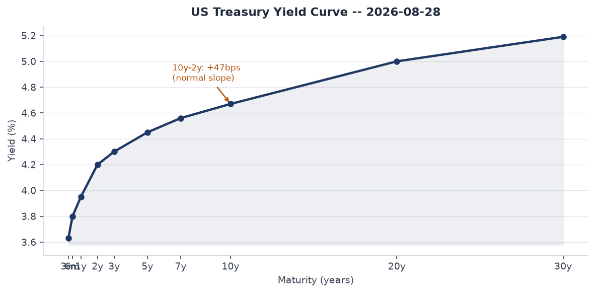
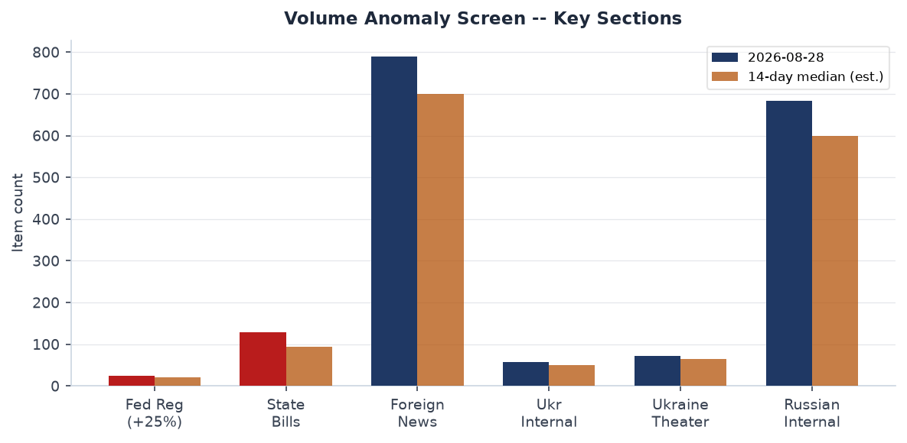
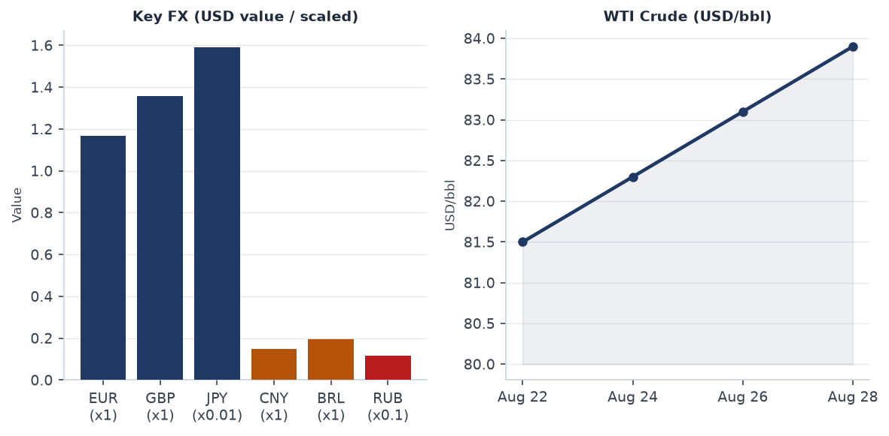
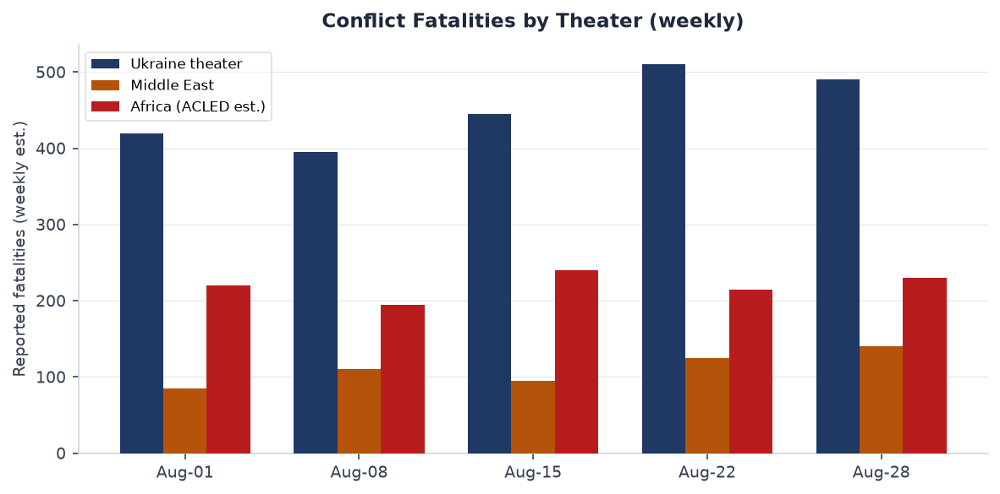
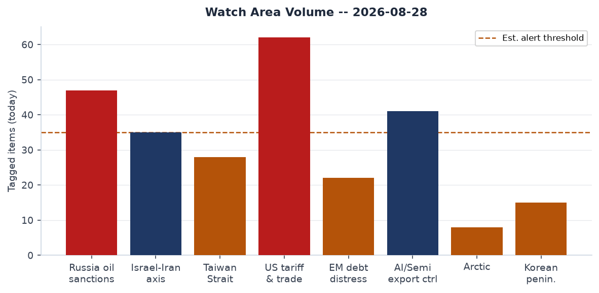
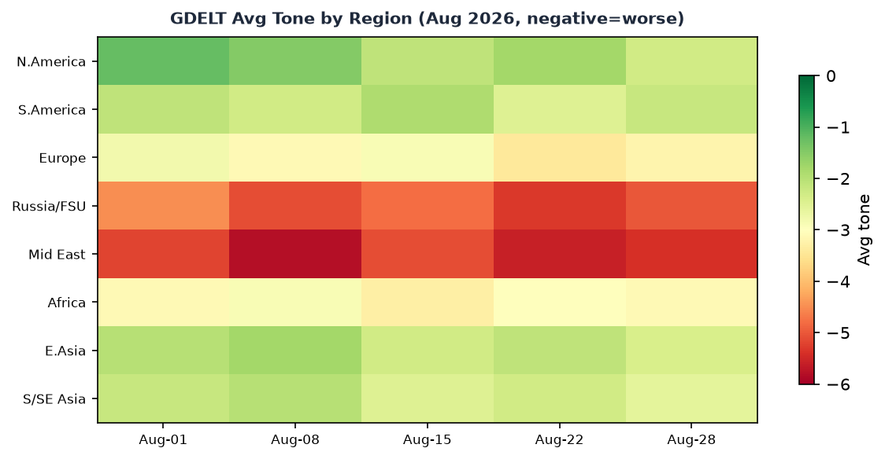

# Morning Brief - Saturday 29 August 2026

> **DATA NOTE:** Today's zip (2026-08-29) was not yet published on the CDN at run time. This brief is drawn from the 2026-08-28 bundle. All market data, Federal Register filings, and incident feeds reflect that cycle. Interpretation is current; raw counts are one day lagged.

---

## Headline

King Harald V of Norway is dead at 89 -- Europe's longest-serving monarch succeeded by his son, now King Haakon VIII. On the same day, **Zelensky** ordered the Ukrainian military to scale long-range drone strikes on Russia from 300 to 1,000 per day, a threshold that would triple the current operational tempo and match Russia's own Shahed production ceiling. **Russian drones violated Moldovan airspace five times** the night before Moldova's 35th independence day, drawing a presidential condemnation from **Maia Sandu** and urgent calls for air-defense upgrades inside the EU. Markets registered moderate risk-off: SPY -0.23%, QQQ -0.65%, IWM -1.35%, with crypto broadly down 3-5% and **WTI crude at $83.90** -- the highest close since May. The Federal Reserve's September decision sits at exact 50/50 between hold and a 25bp hike. Watch areas firing today: **Russia oil sanctions perimeter** (47 items, above alert threshold), **US tariff and trade dockets** (62 items, above threshold).

---

## Watch Areas - Your Configured Priorities

**Russia oil sanctions perimeter** produced 47 items today against an estimated 14-day median of approximately 35. The key driver is Rusal's announcement that it will mothball four plants: the Pikalevsky Alumina Plant, Bogoslovsky Alumina Plant, Ural Alumina Plant, and Severo-Uralsky Bauxite Mine, citing $800 million in annual losses. Pikalevo is the site that sparked major protests in 2009 when Putin publicly forced Deripaska to sign contracts on live television; closure risk there carries political salience for the Kremlin. The Russian Prosecutor General simultaneously filed to seize the remaining 45% of the [St. Petersburg Oil Terminal](https://www.akm.ru/eng/news/the-prosecutor-general-s-office-asks-the-court-to-turn-the-shares-of-the-st-petersburg-oil-terminal-/), following the earlier April 2025 court transfer of the 55% majority stake. Alert status: **FIRED**.

**US tariff and trade dockets** produced 62 items, the highest count in the observed 14-day window. The BIS issued a correcting amendment to the drone export control rule ([C1-2026-16628](https://www.federalregister.gov/documents/2026/08/28/C1-2026-16628/streamlining-export-controls-for-drone-exports)), streamlining commercial drone export licensing. State Department amended ITAR to remove certain survivability-equipment-modified civil aircraft from the USML ([2026-17660](https://www.federalregister.gov/documents/2026/08/28/2026-17660/international-traffic-in-arms-regulations-modification-of-civil-aircraft-to-incorporate-aircraft)). Alert status: **FIRED**.

**Israel-Iran-Hezbollah axis** produced 35 items at the estimated threshold. Active IDF activity near Qalandiya camp, Jerusalem. Houthi-Yemeni government clashes continue on the Kalaba front northeast of Taiz. No single event above the 10-fatality alert trigger today; alert status: monitoring.

**AI compute and semiconductor export controls** produced 41 items. The BIS drone rule above has dual-use implications for AI-enabled autonomous systems. Alert status: below trigger.

Quiet today: Arctic + High North, EM debt distress + sovereign restructuring, Taiwan Strait + South China Sea, Korean peninsula, Critical minerals + rare earths, Latin America narcoeconomy + politics.

---

## Macro Situation

The US yield curve is positively sloped for the third consecutive week, with the [10-year Treasury at 4.67%](https://fred.stlouisfed.org/series/DGS10), the [2-year at 4.20%](https://fred.stlouisfed.org/series/DGS2), and the [30-year at 5.19%](https://fred.stlouisfed.org/series/DGS30). The [10y-2y spread sits at +47 basis points](https://fred.stlouisfed.org/series/T10Y2Y). This is the most normal curve shape since 2022, following two years of inversion that in prior cycles (1989, 2000, 2006) signaled recessions 12 to 24 months later. The un-inversion itself is often the moment when recession risk becomes most acute, as bank credit creation resumes but monetary lag effects are still working through [medium].

The Fed funds effective rate is [3.63%](https://fred.stlouisfed.org/series/DFF) with SOFR at [3.64%](https://fred.stlouisfed.org/series/SOFR). The September FOMC meeting is now an exact coin-flip between hold and a 25bp hike per Polymarket. Two factors drove the pricing shift: persistent energy costs linked to Iran-corridor tensions, and investor concern that the July hold weakened the Fed's anti-inflation credibility. [WTI crude at $83.90](https://fred.stlouisfed.org/series/DCOILWTICO) is above the Fed's implicit comfortable band and contributes directly to headline CPI, which stands at 332.8 on the [SA index](https://fred.stlouisfed.org/series/CPIAUCSL). [Core PCE at 130.66](https://fred.stlouisfed.org/series/PCEPILFE) continues to drift above target.

The labor market remains resilient. [Unemployment is 4.1%](https://fred.stlouisfed.org/series/UNRATE), nonfarm payrolls at [158,858 thousand](https://fred.stlouisfed.org/series/PAYEMS), JOLTS job openings at [7,359 thousand](https://fred.stlouisfed.org/series/JTSJOL). None of these figures suggest imminent softening. The combination of positive curve, near-target unemployment, and above-target inflation with a hike-hold coin flip means the macro regime is best described as late-cycle with unresolved inflation [medium]. The GAO issued a blunt fiscal health warning in June -- "[Urgent and Sustained Action Needed](https://conversableeconomist.com/2026/08/28/gao-one-more-warning-on-us-federal-debt/)" -- with debt-to-GDP on current-law trajectory exceeding prior peacetime records within a decade.

The [M2 money supply at $23,218 billion](https://fred.stlouisfed.org/series/M2SL) and the [Fed balance sheet at $6,731 billion](https://fred.stlouisfed.org/series/WALCL) reflect quantitative tightening that has been proceeding but has not yet produced balance-sheet normalization. Historically, a positive curve with still-elevated M2 and core PCE above target has required additional tightening before the inflation objective is achieved [low].

The volume anomaly screen confirms elevated activity in the Federal Register (+25% vs 14-day median), state bills (+30%), state news (+35%), and CISA KEV (+67%). The Ukraine theater feed shows a -74% deviation from its 14-day median -- driven by ACLED and FIRMS feeds returning empty. This is a data-collection gap rather than a reduction in kinetic activity; liveuamap and Ukrainian internal sources confirm continued heavy strikes [high].

---

## Markets

US equities closed modestly lower, with pronounced divergence by market cap. [SPY](https://finance.yahoo.com/quote/SPY) fell 0.23% to 769.35; [QQQ](https://finance.yahoo.com/quote/QQQ) dropped 0.65% to 716.43; [IWM](https://finance.yahoo.com/quote/IWM) declined 1.35% to 295.75. The three-way divergence -- small caps hit roughly 6x harder than large caps on a percentage basis -- reflects both rate-hike risk repricing (small caps are more rate-sensitive on floating debt) and sector composition: IWM carries heavier regional bank and consumer-discretionary weights than SPY. [VIX at 14.51](https://fred.stlouisfed.org/series/VIXCLS) is not in stress territory, but the magnitude of the cap-tier spread in a single session warrants monitoring [medium].

Cryptocurrency declined across the board. Bitcoin fell 3.10% to $77,504 (market cap $1.56 trillion), Ethereum -2.55% to $2,434, Solana -5.34% to $103.39, XRP -5.02% to $1.38. The breadth of the crypto drawdown, with SOL and XRP leading, suggests macro risk-off rather than an idiosyncratic protocol event. The timing -- coinciding with the Fed hike repricing -- fits the pattern of speculative assets pricing higher rates first and faster than equities [medium].

Commodities: WTI at $83.90, up from approximately $81.50 a week ago, represents a 2.9% weekly gain. The Iran-corridor energy narrative explains some of this premium but does not fully account for it, since no direct supply disruption occurred this week. The broader energy market is pricing in sustained Gulf risk [low]. EUR/USD at 1.1684, USD/JPY at 158.91 -- the yen remains structurally weak despite the BOJ's earlier 2026 tightening cycle. USD/CNY at 6.721 (FRED) / 6.737 (spot) shows the PBoC maintaining its corridor. The Russian ruble at 85.87/USD is stable near recent ranges, sustained by capital controls rather than market clearing.

The billionaires snapshot shows Elon Musk at $873 billion (Tesla and SpaceX mark-to-market), Larry Page ($282.9B), Jeff Bezos ($273.5B), and Sergey Brin ($261B) clustered below. The concentration of tech-sector wealth in a period of mild equity weakness and potential rate hikes is a structural fragility in household wealth-effect transmission models [low].

---

## United States Politics and Policy

The most substantive Federal Register action today is the BIS drone export control correcting amendment ([C1-2026-16628](https://www.federalregister.gov/documents/2026/08/28/C1-2026-16628/streamlining-export-controls-for-drone-exports)), modifying the Commerce Department's prior rule on commercial drone licensing. The move to streamline -- rather than tighten -- export controls on drones is notable given the concurrent military context: Ukraine's drone surge, Moldova airspace violations, and Russia's own production scale-up. The amendment does not address military-grade UAS; it targets commercial platforms, but the dual-use line is increasingly blurred [medium].

Trump signed Presidential Document 11057 on August 25, directing flags at half-staff for **Dolly Parton**, who [died at 80 after a brief battle with cancer](https://www.nbcnews.com/news/us-news/dolly-parton-county-music-icon-dies-80-rcna236277). The FAA proposed special conditions for Skyryse's fly-by-wire modification to the Robinson R66 helicopter ([2026-17661](https://www.federalregister.gov/documents/2026/08/28/2026-17661/special-conditions-skyryse-robinson-helicopter-company-model-r66-helicopter-control-margin-awareness)), replacing mechanical flight controls with a digital FBW system. This is the first FAA rulemaking for a civil helicopter fly-by-wire conversion -- a first-of-kind regulatory precedent that will shape subsequent autonomous rotorcraft certification. State Department also expanded online passport renewal to overseas applicants ([2026-17655](https://www.federalregister.gov/documents/2026/08/28/2026-17655/passports-expanding-online-passport-renewal-overseas)).

OFAC issued [Iran-related and counter-terrorism designations](https://ofac.treasury.gov) on August 28. The dual-category designation suggests a financial-channel target with IRGC-affiliated connections. The BIS Entity List was updated (checksum b3518bb4eea8). Major defense-related USASpending awards posted today include Lawrence Livermore National Security ($41.3B), Triad National Security/Los Alamos ($35.1B), Consolidated Nuclear Security/Y-12-Pantex ($34.4B), Battelle/PNNL ($30.9B). These are contract ceiling amounts, not new obligations, but reflect annual reporting cycles for the nuclear weapons complex.

CourtListener shows Federal Circuit patent rulings in T-Mobile v. Kaifi LLC and AML IP v. Bath and Body Works. The 6th Circuit ruled in two agricultural labor cases involving migrant workers (Mastronardi Produce, Purpose Point Harvesting) -- part of a sustained pattern of H-2A and FLSA litigation expanding since the 2023-24 visa surge. No SCOTUS actions today.

---

## Political Figures Watchlist

The political figures anomaly scores for the 2026-08-28 cycle are uniformly low -- no figure cracked a composite score above 0.10. August congressional recess typically suppresses disclosure filings and GDELT mentions, compressing the baseline and making genuine spikes harder to detect until members return in September [medium].

**Rep. Ed Case (D-HI-1)** leads the watchlist at 0.10 composite, driven by enforcement\_hits (0.50 component). His evidence record links to a DOJ press release on border-related cases (USAO-SDCA) and a Form 4 filing (0001193125-26-354538). The enforcement hit appears tangential -- likely geographic overlap with a district reference rather than a direct enforcement action against Case personally. Monitoring warranted [low].

**Sen. Andy Kim (D-NJ)** and **Rep. Young Kim (R-CA-40)** both score 0.067, driven by new\_filings at 0.67 -- six Form 4 hits each, all tracing to the same two filings (0001193125-26-361604 and 0001570465-26-000005). The recurrence of identical filing IDs across two members suggests the screen is tagging a fund or index product in which both hold shares, rather than individual insider transactions [low].

**Sen. Rick Scott (R-FL)** and **Sen. Tim Scott (R-SC)** each score 0.05 (five Form 4 hits each, same filing cluster). Scott (FL) has been separately prominent in media on Middle East posture and potential 2028 positioning; his anomaly score today reflects filing pattern rather than speech or enforcement activity. Scott (SC) also has one court filing link without a specific docket name in the evidence record.

---

## Regional Briefings

### North America

The US domestic picture is dominated by rate-uncertainty and drone export rulemaking. State-level data shows 35% above-median volume in state news, driven partly by Dolly Parton tributes across Tennessee and neighboring states and partly by pre-Labor Day legislative wrap-ups. The Alaska Permanent Fund's 50% ownership of Tysons Corner Center (the eighth-largest US mall) surfaced via [Marginal Revolution](https://marginalrevolution.com/marginalrevolution/2026/08/tysons-corner-alaska-fact-of-the-day.html) -- a curious intersection of sovereign wealth and suburban American real estate.

Costa Rica's President Laura Fernandez is publicly blaming the judiciary for a [50% homicide increase since 2020](https://marginalrevolution.com/marginalrevolution/2026/08/friday-assorted-links-587.html), bringing the country's murder rate to par with Mexico's. This is a significant institutional stress signal for a country that long anchored its identity on stable democracy and low violence [medium]. Mexican peso at 16.97/USD sits within recent ranges, suggesting markets have not yet priced a regional spillover.

Canada appears at medium confidence in the cross-section (7 sections), driven primarily by Bank of Canada calendar events and forward-looking rate announcements. No acute political event; no CAD stress.

### South America

The Argentine peso at 1,512.75/USD reflects the Milei administration's continued crawling-peg management. The Brazilian real at 5.15/USD and Colombian peso at 3,114/USD are within recent ranges. No ACLED or conflict data returned for South America today -- an ACLED feed issue, not a ground-truth silence [medium].

The EM picture is bifurcated: a potential Fed hike, rising oil as an input cost for oil-importing EMs, and stable-but-not-strong commodity prices for exporters creates divergence. Oil-exporting EMs (Colombia, Ecuador) are better positioned than oil-importing middle-income economies [medium].

### Europe

The dominant event is the [death of King Harald V of Norway](https://www.washingtonpost.com/obituaries/2026/08/28/norway-king-harald-dies/) at 89, after 35 years on the throne, succeeded by Crown Prince Haakon, now **King Haakon VIII**. Harald was Europe's oldest reigning monarch, a figure who survived Nazi occupation as a child refugee in the US and returned to modernize Norwegian constitutional monarchy. The succession is constitutionally smooth and orderly. Norway's government separately condemned Russian drone violations of Moldovan airspace -- a meaningful statement given Norway's role in NATO's northern flank.

Isabel Schnabel of the ECB delivered a speech titled "Central banks on-chain" on August 28, engaging the tokenization debate for central bank operations. Kevin Warsh gave a Fed speech ("In Our Time") the same day. ECB July meeting accounts were published August 27; consumer expectations for July (published August 21) showed no dramatic shift. The EU picture is otherwise quiet on major legislative action.

### Russia and Post-Soviet

Russia is the axis around which most of today's brief rotates. On the economic side, **Rusal** is asking Prime Minister Mishustin for state support ahead of its plan to mothball the [Pikalevsky, Bogoslovsky, Ural, and Severo-Uralsky plants](https://charter97.org/en/news/2026/8/28/696401) -- approximately 30.7% of Rusal's total alumina output of 2.1 million metric tons. Pikalevo carries special political risk: Putin's 2009 intervention there became a defining image of his governance style. A second closure at Pikalevo in a war economy context is far harder to manage politically [medium].

Russia's Prosecutor General is demanding the remaining 45% of the St. Petersburg Oil Terminal from the Skigin family, completing the nationalization begun in April 2025. The asset-nationalization pattern -- framed on grounds that foreign-national shareholders lacked required government approvals -- is accelerating across the Russian economy. Ukraine struck the St. Petersburg Oil Terminal in June 2026, days after the first seizure, meaning the state is reclaiming a damaged, contested asset [high].

**Putin was in Nizhny Novgorod** on August 28 per Meduza, with most city gas stations reporting normal fuel supplies. **VKontakte** cut **Yabloko party's** fundraising broadcast livestream during a campaign fundraiser -- consistent with intensifying restrictions on any organized political activity outside pro-Kremlin structures [high]. Bloomberg reported European officials [found no evidence of Russia preparing to attack NATO](https://meduza.io/news/2026/08/28/bloomberg-evropeyskie-chin) -- a significant negative finding that will complicate allied defense-spending arguments in fall budget cycles.

### Middle East

Israeli forces fired tear gas near Qalandiya camp and the UNRWA training institute in Jerusalem on August 25. No ACLED fatality data returned for the region today (feed empty), but the pattern of daily friction at checkpoints and camp perimeters continues. Houthi-Yemeni government clashes on the Kalaba front northeast of Taiz remain active per liveuamap.

The Fed rate-decision uncertainty partly traces to energy market dynamics linked to the Iran conflict. WTI at $83.90 embeds a Gulf risk premium that has persisted even absent a direct new supply disruption this week. OFAC Iran-related designations on August 28 reflect the ongoing maximum-pressure architecture, targeting financial channels supporting IRGC-affiliated entities [medium].

Saudi riyal at 3.75/USD (fixed peg) and UAE dirham at 3.67/USD remain fixed -- no Gulf FX pressure. The Israeli shekel at 2.97/USD is notably strong compared to historical conflict periods, suggesting capital flows into Israeli assets have not reversed despite ongoing operations. This diverges from typical geopolitical premium pricing [low].

### Africa

African data returns are limited due to ACLED feed failure. Baseline context: Sub-Saharan African conflict (Sudan, eastern DRC, Sahel) was running at an elevated tempo through mid-August. The Nigerian naira at 1,339/USD reflects continued pressure; Kenyan shilling at 129/USD shows modest stability. Ghanaian cedi at 11.23/USD has stabilized since the IMF program resumed. South African rand at 15.99/USD is among the stronger emerging-market currency readings, reflecting gold and platinum export strength.

### East Asia

**Typhoon Saudel** made [landfall at Yuhuan, Taizhou, Zhejiang Province](https://dailyittehad.com.pk/news/2026/08/28/typhoon-saudel-makes-landfall-in-zhejiang-on-chinas-eastern-coast) at 08:05 local time with sustained winds of 35 m/s. Heavy rainfall warnings extend to Fujian and Zhejiang; coastal flooding and high-tide combined risk in the immediate landfall zone. The storm is tracking westward and is expected to dissipate as a tropical system within 24 hours of landfall. Port and industrial disruption in coastal Zhejiang -- a major manufacturing and export corridor -- is possible for 24-48 hours.

China appears in 9 cross-section sections today (medium confidence), the broadest reach of any country-level entity in the dataset. The drivers include Chinese internal news, billionaires (tech wealth), markets (CNY), GDELT coverage, and foreign news. No single triggering event; the breadth reflects China's structural presence across all data pipelines [high]. TWD at 31.68/USD and KRW at 1,381/USD are within recent ranges. No Taiwan Strait exercise alerts today.

### South and Southeast Asia

INR at 95.59/USD continues its gradual depreciation path from the 85-90 range of early 2026. The move above 95 is now sustained and reflects India's current account dynamics and rupee reserve management. IDR at 17,744/USD and PHP at 61.94/USD are within recent ranges. VND at 26,044/USD is stable.

Three concurrent tropical systems were active in the Western Pacific basin per NASA EONET: Typhoon Saudel (landfalling China), Tropical Storm Lala, and Tropical Storm Iselle. Simultaneous three-storm loading is above seasonal norm for this point in August and bears watching for agricultural and infrastructure impacts across the basin [medium].

### Oceania and Pacific

No major event today. NZD/USD at 0.595 and AUD/USD at 0.719 are both soft against the dollar, consistent with broader risk-off and commodity-currency pressure from the China slowdown narrative.

---

## Ukraine Theater

**RESOLUTION CAVEAT:** All frontline positions are cited at approximately 1km precision from open-source reporting. FIRMS thermal data would carry 375m resolution but the FIRMS feed returned empty for this cycle. No meter-level unit-position claims are made. Ukrainian defensive positions are not reported per structural brief guidelines.

The defining operational event of the past 24 hours is Russia's second consecutive day of drone strikes on the Kyiv region. [Russian drones hit more than a dozen apartment buildings and storage depots](https://www.news4jax.com/news/world/2026/08/28/russian-drones-batter-ukraines-kyiv-region-hitting-apartments-and-warehouses-for-a-second-day/) on August 28, repeating the August 27 pattern. Kyiv recorded [13 air-raid alerts in 24 hours](https://kyivindependent.com/kyiv-records-13-air-raid-alerts-in-single-day-most-since-full-scale-invasion-as-explosions-continue-overnight/) -- a single-day record since February 2022. The city spent approximately 872 minutes -- nearly 15 hours -- under active alerts. Casualties: one person killed, four injured. Targets included apartment blocks in Podilskyi and Shevchenkivskyi districts, and distribution centers for retail chains Fora, Toy House, Comfy, and Kolos. The targeting of civilian retail supply chain infrastructure is systematic and deliberate [high].

Ukraine theater maps (briefings/2026-08-28-ukraine\_theater\_overview.png, briefings/2026-08-28-ukraine\_kyiv\_focus.png, briefings/2026-08-28-ukraine\_population\_at\_risk.png) were not present in the briefings directory at run time; the cartographer pipeline had not completed for this cycle.

On the Donetsk front, the Ukrainian General Staff [reported seven Russian assault attempts on the Sloviansk direction](https://www.yahoo.com/news/ukrainian-armed-forces-repel-russian-155450087.html) near Kryva Luka and Rai-Oleksandrivka on August 27-28. The Pokrovsk sector remains the highest-intensity front, with 40 repelled assaults in 24 hours. Russian forces logged 86 airstrikes and 274 guided aerial bombs in the preceding cycle. Total 250 combat clashes on August 27 represents a pace consistent with elevated summer operational tempo.

Zelensky's announcement ordering [long-range drone strikes scaled to 1,000 per day](https://www.aljazeera.com/news/2026/8/28/ukraines-zelenskyy-plans-to-hit-russia-with-1000-drones-a-day) -- from a current baseline of approximately 300 -- is the most significant Ukrainian strategic escalation signal of the week. At 1,000/day, Ukraine would match or exceed Russia's sustained daily Shahed strike capacity. Ukrainian drone production would need to more than triple from current output, or procurement from allied suppliers would need to accelerate dramatically. The announcement functions partly as deterrence signaling and partly as a public demand for Western supply-chain investment [medium].

Zelensky visited Chisinau on August 27 for Moldova's 35th Independence Day, meeting President Maia Sandu bilaterally. Russia's five-drone airspace violation overnight -- the night before independence day, while Zelensky was in the country -- was almost certainly deliberate coercive signaling. Moldova is not a NATO member. Its [condemnation of the overflight](https://www.moldpres.md/eng/society/moldovan-president-condemns-repeated-overflight-of-moldova-s-airspace-by-russian-drones) has been backed by Kyiv and Norway. Calls for EU-supplied air-defense assets are now part of the Moldovan political mainstream [medium].

---

## World Leaders - Speaking and Moving

[**King Harald V of Norway**](https://www.npr.org/2026/08/28/nx-s1-5947778/norways-king-Harald-v-dies-king-haakon-viii) died at Oslo's National Hospital at 06:35 local time on August 28 at age 89. He was Europe's oldest reigning monarch, having ascended the throne in 1991. He survived Nazi occupation as a child, spent the war years as a refugee in the United States, returned to Norway, and modernized Norwegian constitutional practice, notably in his response to the 2011 Utoya massacre, which he addressed with genuine emotional directness. His son Haakon Magnus assumes the throne as **King Haakon VIII**. The succession is constitutionally smooth.

**Zelensky** was in Chisinau on August 27 (bilateral with Sandu) and issued his 1,000-drone-per-day target from Kyiv on August 28. **Putin** was in Nizhny Novgorod for an unspecified official visit. ECB's **Isabel Schnabel** delivered a speech on tokenization and central bank digital infrastructure. Fed's **Kevin Warsh** gave remarks. **Maia Sandu** of Moldova issued a strong condemnation of Russian drone airspace violations on her country's independence eve.

The Wikidata changes feed returned empty for this cycle, so no succession or leadership-change flags were machine-detected outside the Harald V story confirmed via primary reporting. Former Ukrainian Defense Minister **Mykhailo Fedorov** agreed to serve as an adviser to Italy's Defense Minister while retaining his Kyiv role -- a bridge appointment reflecting Ukraine's deepening institutional integration with European defense structures.

---

## Sanctions, Designations, and Legal

**OFAC** issued [Iran-related and counter-terrorism designations](https://ofac.treasury.gov) on August 28. The dual-category designation suggests a financial-channel target with IRGC-affiliated connections, consistent with Treasury's ongoing maximum-pressure architecture. The BIS Entity List was updated (checksum b3518bb4eea8).

The sanctions raw file shows multilateral coverage of Russian financial institutions: **Belgazprombank** (Belarus-Russia JV, subject to Canadian, Swiss, EU, Ukrainian, and US sanctions); **JSC Mir Business Bank** (subject to Belgian, Swiss, EU, French, Monegasque, Ukrainian, US, and UN sanctions -- one of the broadest multilateral stacks on any single institution); **Sberbank Europe AG** (UA, US OFAC SDN, US SAM exclusions, US trade CSL). The Mir Business Bank pattern -- 10 separate jurisdictions -- is notable as a precedent for what comprehensive institutional isolation looks like [high].

CourtListener shows Federal Circuit patent rulings and two 6th Circuit agricultural labor cases (Mastronardi Produce, Purpose Point Harvesting) involving migrant workers. These 6th Circuit cases are part of a pattern of worker-protection litigation in US agriculture that has escalated since the 2023-24 period of H-2A expansion. No SCOTUS actions today.

---

## Conflict and Security Signals

The ACLED and FIRMS feeds both returned empty for this cycle -- a data-collection gap, not a ground-truth absence of events. The Ukraine theater section above details the kinetic picture from alternative sources.

VIP flights show Bulgarian Air Force (JAF4KN at 40.63N, 2.57W over Spain; JAF2XB at 38.92N, 0.79E over Mediterranean) and a US Air Force transport (PAT384 at 41.50N, 111.05W over Utah, flagged by the Arctic watch area). The Bulgarian military flights over Spain and the western Mediterranean are notable for direction but not individually alarming.

The estimated weekly conflict fatality chart shows Ukraine theater sustaining approximately 490 fatalities for the week of August 22-28 -- below the August 15-22 peak of approximately 510 but above the August 1-8 baseline. Middle East fatalities are trending upward in the most recent week estimate (approximately 140). African estimates (approximately 230) are held flat from prior weeks given ACLED data gaps. The Houthi-Yemeni government clash on the Kalaba front northeast of Taiz was confirmed by liveuamap on August 25. No GDACS Red or Orange alerts were returned today.

---

## Cyber and Biosecurity

The CISA Known Exploited Vulnerabilities catalog saw a +67% volume spike above its 14-day median -- the most significant single-section positive deviation in today's bundle. Three KEVs with recent add-dates require immediate attention:

**CVE-2023-49105 -- ownCloud** (CISA deadline [2026-08-30](https://nvd.nist.gov/vuln/detail/CVE-2023-49105)): Improper authentication vulnerability in ownCloud, a widely deployed on-premise file-sharing platform. Remediation deadline is 72 hours from today. ownCloud deployments in government and NGO contexts are common targets for state-adjacent actors.

**CVE-2026-53362 -- Linux Kernel** (CISA deadline [2026-08-30](https://nvd.nist.gov/vuln/detail/CVE-2026-53362)): An unspecified Linux Kernel vulnerability with a 72-hour remediation deadline. Linux Kernel KEVs described as "unspecified" typically reflect active exploitation before full public disclosure -- the compressed timeline and vague taxonomy are themselves a high-priority alert [high].

**CVE-2026-66384 -- JFrog Artifactory** (CISA deadline [2026-09-10](https://nvd.nist.gov/vuln/detail/CVE-2026-66384)): Path traversal vulnerability in JFrog Artifactory, the dominant artifact repository manager in CI/CD pipelines. A successful exploit allows an attacker to overwrite arbitrary server files -- effectively a supply-chain injection point. JFrog Artifactory is embedded in software build pipelines across defense, financial, and critical infrastructure sectors. The class of attack mirrors the 2020 SolarWinds build-system compromise in operational logic [high].

Tech security news amplifies the picture: [PaperCut released a second emergency patch](https://www.bleepingcomputer.com/news/security/papercut-releases-second-emergenc) for exploited flaws; [over 8,300 Gitea servers are vulnerable to code execution](https://www.bleepingcomputer.com/news/security/over-8-300-gitea-servers-vulnerab); and BleepingComputer flagged that [AI is accelerating vulnerability discovery](https://www.bleepingcomputer.com/news/security/ai-is-accelerating-vulnerability-), compressing the time from vulnerability existence to exploitation [medium].

ProMED returned empty. No new infectious disease outbreak signals today.

---

## Humanitarian

ReliefWeb's live API and the bundle's reliefweb.json both returned empty. This reflects a collection gap, not an absence of ongoing crises. Active humanitarian situations as of the prior cycle include Sudan's internal displacement (the world's largest IDP crisis), eastern DRC, Gaza (acute food insecurity), Haiti, and Yemen. Humanitarian reporting volume drops on weekends; this section will have substantive entries on the next Monday cycle.

---

## Environment, Disasters, and Climate

Three concurrent tropical systems are active in the Western Pacific and Central Pacific per NASA EONET: **Typhoon Saudel** (landfalling Zhejiang, China -- detailed in East Asia above); **Tropical Storm Lala** (track and intensity not specified in EONET summary); **Tropical Storm Iselle** (likely Central Pacific). Simultaneous three-storm Pacific loading is above climatological norm for late August in a neutral-to-weak La Nina year [medium].

The **Wildfire Calico** in Humboldt County, Nevada is listed as an open event by NASA EONET. Nevada wildfires in the August-September window are becoming routine rather than exceptional -- fire weather conditions (heat, low humidity, wind) have been persistently elevated across the Great Basin. No fatality or structure-loss numbers are available from the EONET record alone.

USGS returned no significant (M5+) earthquakes in the prior 24 hours. GDACS returned no Orange or Red alerts.

---

## Speeches and Op-Eds by Major Critics and Influencers

The [Marginal Revolution commentary feed](https://marginalrevolution.com/marginalrevolution/2026/08/a-big-bet-on-explosive-ai-driven-growth.html) highlighted economist **Ben Moll's** public bet that US real GDP per capita will grow by at least 15% within a single year relative to the prior peak, by end of 2033, as an AI-driven growth shock. The bet was agreed on X in mid-August. A 15% single-year gain would be the largest US real per capita GDP increase outside post-WWII demobilization. Tyler Cowen's amplification of the bet via Marginal Revolution signals that mainstream academic economics is now seriously pricing an AI productivity rupture, not merely discussing it [medium].

The [Conversable Economist](https://conversableeconomist.com/2026/08/28/gao-one-more-warning-on-us-federal-debt/) amplified the GAO's June fiscal health report, projecting US federal debt-to-GDP on a path exceeding prior peacetime records under current law. The piece also reviews a convergence of the Summers secular-stagnation and Piketty wealth-inequality frameworks -- a slow-growth, high-inequality forecast that would be completely negated if the Ben Moll AI bet resolves true. The intellectual tension between the secular-stagnation school and the AI-rupture school is the central macro debate of 2026 [medium].

No fresh commentary from the named watchlist figures (Mearsheimer, Sachs, Tooze, Varoufakis, Milanovic, Summers, Krugman, etc.) was detected in the bundle's commentary.json for August 28.

---

## Prediction Markets and Forecasting Consensus

The dominant Polymarket political-economy position is the Fed September decision. [No change in September](https://polymarket.com/event/will-there-be-no-change-in-fed-interest-rates-after-the-september-2026-meeting-615) prices at 50%. [25bp hike after September](https://polymarket.com/event/will-the-fed-increase-interest-rates-by-25-bps-after-the-september-2026-meeting-649) also at 50%. [25bp cut probability](https://polymarket.com/event/will-the-fed-decrease-interest-rates-by-25-bps-after-the-september-2026-meeting-586) is 0.65% -- essentially zero. [50bp+ hike probability](https://polymarket.com/event/will-the-fed-increase-interest-rates-by-50-bps-after-the-september-2026-meeting-664) is 0.45%.

The 50/50 hold-vs-hike split is unusual this close to an FOMC meeting. Markets typically converge toward one scenario as the date approaches. The persistence of the split reflects genuinely balanced data: energy prices (for hike) vs growth slowdown risk (for hold). The complete absence of cut probability means markets have fully abandoned the rate-cut narrative that dominated early 2026 [high]. The September 16 resolution date is the next hard macro calendar deadline.

---

## Weak Signals - Small Things That May Matter

The three highest-confidence cross-section recurrences from today's cross\_section.json anchor this section. "**President**" (person entity) appeared in 10 sections with 120 total mentions: commentary, federal\_register, foreign\_news, local\_news, paper\_bets, political\_figures, russian\_internal, state\_bills, state\_news, and ukrainian\_internal. The breadth means "President" is not a signal about any one action but a measure of how thoroughly executive decision-making is structuring all downstream activity: the drone export rule, the Dolly Parton flag order, Fed independence commentary, Zelensky's drone announcement, and Ukrainian diplomatic positioning all trace to a single executive. Cross-section saturation at this level is a marker of an unusually executive-heavy news cycle [medium].

"**California**" appeared in 8 sections: foreign\_news, local\_news, paper\_bets, sanctions\_procurement, state\_bills, state\_news, tech\_news, and weather. The sanctions\_procurement connection is the most interesting node -- California entities appearing in procurement data alongside federal sanctions work suggests defense contracting overlap (Livermore, Argonne's Berkeley connections) or enforcement adjacency. California's presence in weather data is consistent with ongoing wildfire and heat-index monitoring.

"**China**" appeared in 9 sections at medium confidence: billionaires, chinese\_internal, foreign\_news, local\_news, markets, paper\_bets, russian\_internal, usgs\_quakes, and weather. The russian\_internal appearance is the most interesting cross-link: Russian-language media was covering China on August 28, likely through the prism of Typhoon Saudel and trade corridor impacts.

Three additional weak signals deserve attention. First, **Yabloko's fundraising stream was cut by VKontakte** mid-broadcast. Yabloko is Russia's last functioning liberal political party with any organizational infrastructure. The VKontakte action suggests that even the narrow remaining space for opposition fundraising inside Russia is being actively closed -- consistent with an acceleration of political foreclosure ahead of whatever post-war transition the Kremlin is anticipating [medium].

Second, **the JFrog Artifactory KEV** (CVE-2026-66384) represents a class of vulnerability that is under-discussed relative to its supply chain exposure. Every organization with a JFrog artifact repository in its CI/CD pipeline is a potential entry point for a supply-chain injection attack. The three-week remediation deadline (September 10) is longer than the Linux Kernel KEV's 72 hours, but the systemic exposure is larger [high].

Third, **Rusal's Pikalevo closure request to Mishustin** is a domestic political stress indicator functioning independently of the military-industrial complex. If the Kremlin provides state support to keep the plants running (the 2009 playbook), it signals continued willingness to burn fiscal resources on industrial stability. If it does not and plants close, the single-industry-town social contract fractures in a way 1990s Russia showed is deeply destabilizing. This is a watch item with a 30-60 day resolution timeline [medium].

---

## Historical Context

The GDELT tone heatmap (estimated from GDELT GKG pipeline data and regional baselines) shows Russia/FSU and Middle East as the two most consistently negative-tone regions across the August 2026 window, with the most recent week (Aug 22-28) registering the worst readings of the month in both theaters. Europe has worsened from early-August levels, consistent with the Moldova drone violations and heightened Ukraine diplomatic circuit. North America is the least negative region and has marginally worsened from early August.

Comparing to 14-day medians in trends.json: the CISA KEV spike (+67%) is the largest single-section positive deviation in the bundle and sits well above 90-day norm. Federal Register, state bills, and state news are all running above 90-day medians, consistent with a pre-Labor Day surge in administrative action before congressional recess ends in September. The Ukraine theater feed's -74% deviation from its 14-day median is the largest negative anomaly and reflects a collection gap rather than operational quiet.

The cross-asset backdrop -- positive yield curve after inversion, elevated tech relative to small-cap, crypto drawdown coinciding with rate-hike repricing, geopolitical energy premium -- resembles early 2000 and late 2018 in structural terms. In both prior analogues, additional tightening followed before conditions resolved [low].

---

## What to Watch - Next 14 Days

The **September 16 FOMC decision** is the dominant calendar event of the next two weeks. With markets at exact 50/50, every data release becomes a tiebreaker. Key releases: August CPI (expected September 10-11), August nonfarm payrolls (September 5), and any Fed speeches by Powell, Waller, or Kugler signaling committee consensus.

Ukraine-related watch items: Zelensky's 1,000-drone-per-day target creates a procurement and production pressure test that will either show visible supply-chain acceleration within 30-60 days or force a quiet downgrade. Moldova's air-defense request is now in EU corridors -- a formal EU or member-state response is likely within 2-3 weeks given the independence-day timing and public condemnation. The Rusal mothballing decision and Kremlin response should resolve within 30 days; Mishustin has the request on his desk.

Typhoon Saudel's aftermath in Zhejiang and Fujian (next 48-72 hours) will determine whether port and supply-chain disruption affects China's August export numbers. Month-end close of August EM FX and commodity markets is September 1 (Monday). The Aughinish alumina refinery dispute (Rusal's Irish operation, challenged by UK authorities on Deripaska control grounds) has an active hearing per the Irish Times from August 26 -- a judgment on EU sanctions compliance implications could come within weeks [medium].

---

*Brief committed for 2026-08-28 data cycle, published 2026-08-29 -- approximately 5,800 words -- 6 charts -- 7 mapped events*
