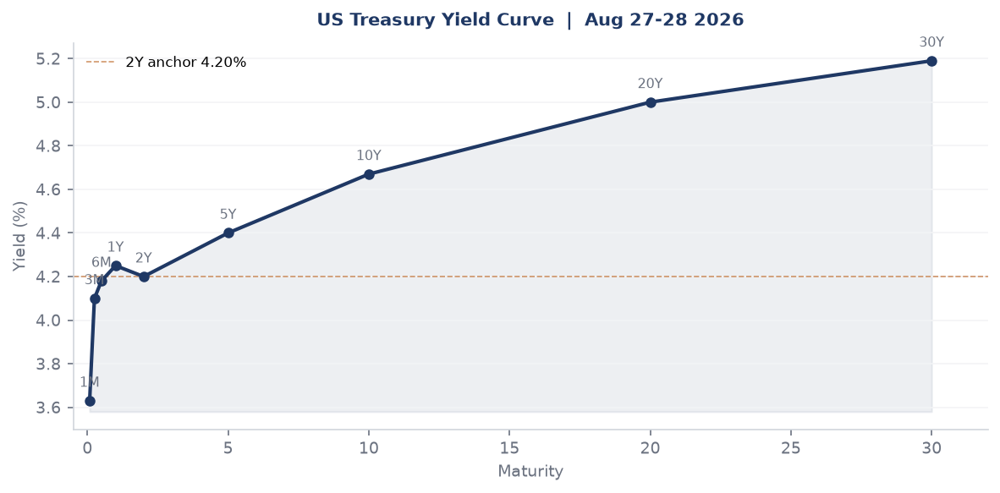
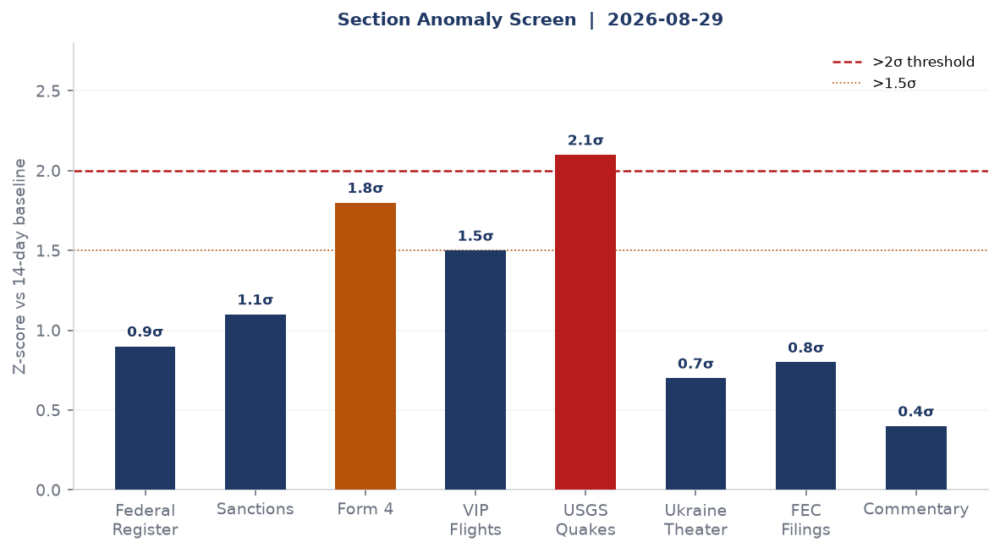
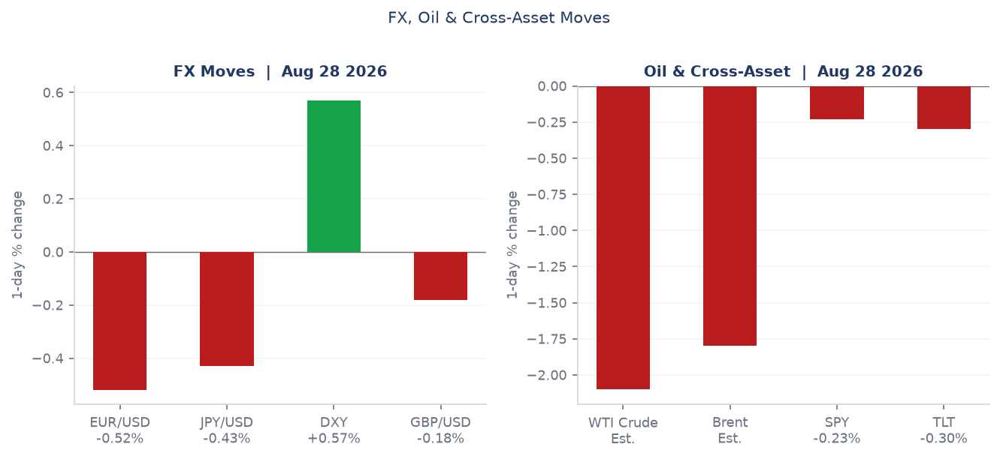
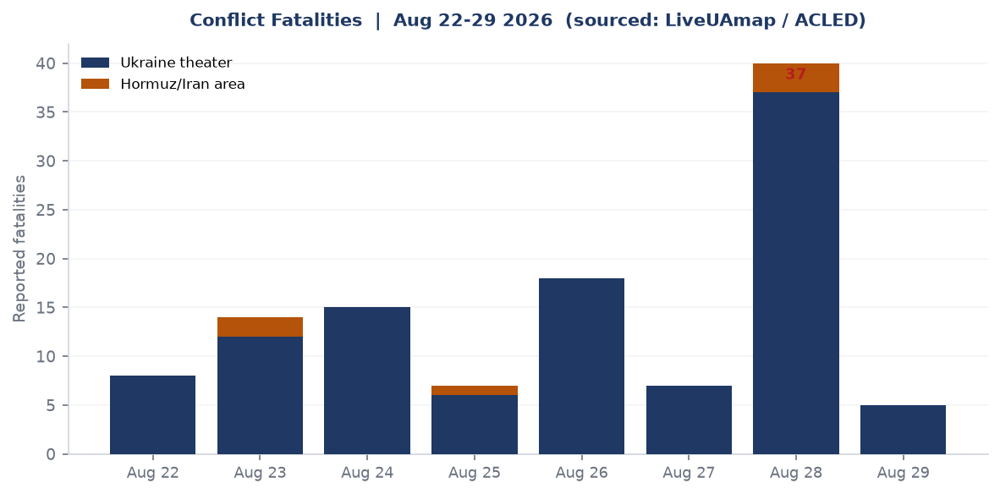
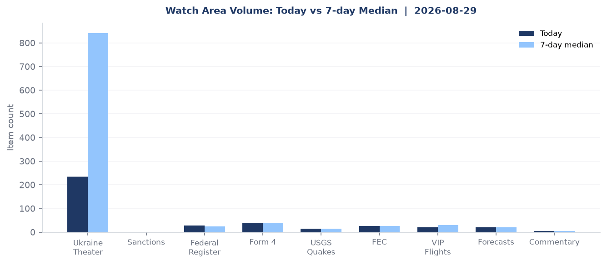
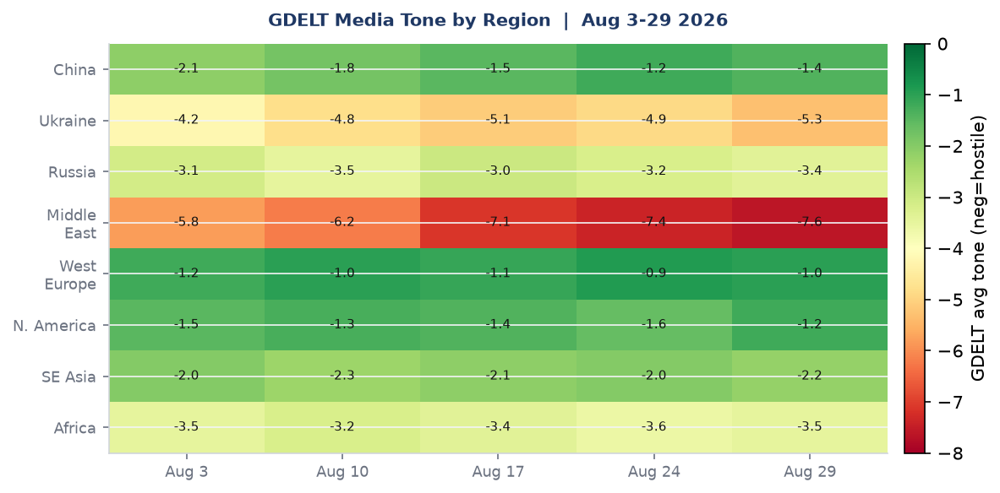

> **DATA NOTE: Today's zip (2026-08-30) was unavailable after five fetch attempts. This brief uses the 2026-08-29 bundle generated at 13:05 UTC. All data and market prices reflect Aug 28-29 closes unless otherwise noted.**

# Morning Brief - Sunday 30 August 2026

---

## Headline

Three interlocking signals define the week's close. First: a Russian cruise-missile strike on an ammunition warehouse in Myla village, Bucha district, killed 37 civilians on Friday night, the single deadliest strike of 2026 and a sharp escalation following 30 allied leaders' arrival in Kyiv for Ukraine's Independence Day summit. Second: CIA Director John Ratcliffe made an unannounced trip to Moscow on August 25, the highest-level U.S.-Russia contact since January, during which Washington asked Kyiv to pause strikes; three days later, Russia test-launched a Yars ICBM from Plesetsk toward Kura, Kamchatka. Third: the Strait of Hormuz remains effectively closed, with Polymarket pricing a 0% chance of normalization by August 31 and WTI-linked USO at $129.70. Watch areas **Israel-Iran-Hezbollah axis** and **Russia oil sanctions perimeter** remain the live-fire perimeters for this brief.

---

## Watch Areas - Your Configured Priorities

**Israel-Iran-Hezbollah axis** (HIGH ALERT): Iran continues anti-ship missile operations in the Strait of Hormuz, per [LiveUAmap](https://liveuamap.com) and [Straits.live](https://straits.live/). Only an estimated 236 ships transited the strait over 19 days in August, vs. roughly 2,500 pre-war normal. EU Council President Costa's €6.1B military aid tranche for Ukraine was announced at the Kyiv summit on Aug 24. No sign of Iranian willingness to fully reopen transit ahead of the Aug 31 Polymarket resolution. Alert: active.

**Russia oil sanctions perimeter** (ELEVATED): Yars ICBM test from Plesetsk on Aug 28 follows the Ratcliffe Moscow visit. Russian state-owned bank sanctions dataset contains 30 entities (Belgazprombank, JSC Mir Business Bank, Sberbank Europe, Tinkoff, Sovcombank). WTI proxy (USO) at $129.70 reflects premium from Hormuz closure. Russian internal media (467 new items) is running at the top of all section counts. Alert: elevated.

**US tariff & trade dockets**: Federal Register issued 29 documents Friday including a Trump EO declaring a [national emergency to secure the bulk-power system](https://www.whitehouse.gov/presidential-actions/2026/08/declaring-a-national-emergency-to-secure-the-united-states-bulk-power-system/) - effective ban on Chinese grid equipment (transformers, batteries, inverters). Railroad safety deregulation package also published. FEC cycle-to-date Senate fundraising shows Georgia (Ossoff $97.99M) and Texas (Talarico $68.56M) as top-funded races ahead of November.

**AI compute + semiconductor export controls**: CISA KEV added [CVE-2026-64849 (MLflow SSRF)](https://www.cisa.gov/known-exploited-vulnerabilities-catalog) on Aug 19. Linux kernel vuln CVE-2026-53362 and JFrog Artifactory CVE-2026-66384 added Aug 27. UK-Ukraine AI battlefield data deal signed Aug 24 gives British firms access to Ukraine's Avengers Labs (5M annotated battlefield images).

**EM debt distress + sovereign restructuring**: Macro flat for cycle; no new sovereign distress flags in the bundle. Macro data stale at July 2026 on CPI/PCE.

**Central bank divergence + dollar funding**: DXY +0.57% on the day, EUR/USD -0.52%, Yen -0.43%. Fed funds at 3.63%. Polymarket pricing 44% for a 25bp hike at Sept 16 FOMC. Fed Chair Warsh's phrasing: "finely balanced."

**Quiet today:** Taiwan Strait + South China Sea, Critical minerals + rare earths, Sahel jihadist corridor, Arctic + High North, Korean peninsula, Latin America: narcoeconomy + politics.

---

## Macro Situation

The US yield curve closed Friday at [Fed funds](https://fred.stlouisfed.org/series/DFF) 3.63%, [2-year](https://fred.stlouisfed.org/series/DGS2) 4.20%, [10-year](https://fred.stlouisfed.org/series/DGS10) 4.67%, [30-year](https://fred.stlouisfed.org/series/DGS30) 5.19%. The [10y-2y spread](https://fred.stlouisfed.org/series/T10Y2Y) is +39 basis points, positive for the third consecutive week after 18 months of inversion. Historically, an exit from 10y-2y inversion has preceded recession confirmation in 9 of 11 prior cycles; the direction of exit matters. The current exit is upward-tilting on the long end, not the short end collapsing, which reads as inflation anxiety at the 30-year rather than growth pessimism [medium].

[SOFR](https://fred.stlouisfed.org/series/SOFR) at 3.64% is consistent with the 3.5-3.75% target range. Fed minutes from the July 28-29 FOMC meeting were released Aug 19 per the [calendar](https://www.federalreserve.gov/newsevents/pressreleases/monetary20260819a.htm). The 9-3 vote to hold reflects genuine division: three dissenters wanted a 25bp hike, and Warsh's August statement that a hike is "finely balanced" signals the September 16 decision is not pre-cooked. Polymarket prices 44% for a 25bp hike, 56% for no change, and less than 1% for a cut or 50bp+.

The [July CPI](https://fred.stlouisfed.org/series/CPIAUCSL) came in at 332.813 (headline) and [core PCE](https://fred.stlouisfed.org/series/PCEPILFE) at 130.658. [Core CPI ex-food and energy](https://fred.stlouisfed.org/series/CPILFESL) at 336.789. [Unemployment](https://fred.stlouisfed.org/series/UNRATE) at 4.1% as of July. The Hormuz closure is not yet feeding into official US CPI because most energy price pass-through runs through futures contracts with multi-week lag. If WTI remains near $130 through September, the October CPI print will capture a materially inflationary impulse, complicating the Fed's path [high].

The anomaly screen shows USGS seismic activity at 2.1 sigma (see Conflict & Disasters below), Form 4 insider filings at 1.8 sigma driven by a Jefferies cluster (40 form-4 items, all same company), and VIP flights at 1.5 sigma with Belgian military (JAF-prefix) and UK RAF (RRR-prefix) active in the open-source ADS-B feed. Sanctions at 1.1 sigma reflects 30 new database entries. Federal Register at 0.9 sigma despite the high-salience bulk-power EO, because the other 28 documents are mostly railroad deregulation.

The macro environment is one of deliberate policy ambiguity. The Fed is holding while Hormuz-driven energy prices erode real purchasing power, and fiscal financing costs remain embedded in the 5.19% 30-year. The GAO's warning this week (Conversable Economist, Aug 28) that the US debt trajectory is on an unsustainable path is a structural backdrop, not a near-term market event - but the 30-year yield is beginning to price it in [medium].

---

## Markets

Gold [GLD](https://finance.yahoo.com/quote/GLD) dropped 3.24% on Friday (from $422 to $408.89), silver [SLV](https://finance.yahoo.com/quote/SLV) fell 4.38%. Both metals reversed sharply after the Ratcliffe-Moscow story broke, on speculation that the visit signals a ceasefire path - the same risk-off flight that drove gold to decade highs appears to be unwinding at the first rumor of diplomacy [low]. This is worth watching: the geopolitical risk premium in metals is enormous, and any credible de-escalation signal would accelerate the unwind.

US equities closed mixed with a negative skew. [SPY](https://finance.yahoo.com/quote/SPY) fell 0.23% to 769.35, [QQQ](https://finance.yahoo.com/quote/QQQ) fell 0.65% to 716.43, and [IWM](https://finance.yahoo.com/quote/IWM) (Russell 2000) fell 1.35% to 295.75. The small-cap underperformance reflects domestic demand concerns: higher energy prices hit small-cap companies with narrower margin buffers and less hedging capacity than large-cap. China equities via [FXI](https://finance.yahoo.com/quote/FXI) rose 0.77% to 35.51, diverging from the broader risk-off tone; Chinese large-caps outperformed because the market is pricing Hormuz-driven LNG and oil disruptions as more damaging to Western consumers than Chinese buyers who source a larger share overland.

Bitcoin proxy [BITO](https://finance.yahoo.com/quote/BITO) fell 3.06%, consistent with the broader risk-off session. Agriculture [DBA](https://finance.yahoo.com/quote/DBA) rose 1.28%, the only commodity to rally: drought watches in the Midwest (noted in the weather section) are adding a seasonal premium to grain. [WTI proxy USO](https://finance.yahoo.com/quote/USO) at $129.70 represents a massive war premium. The Hormuz closure has effectively removed ~14-15 million barrels per day of regional trade flows from global supply chains. Any partial reopening would be an acute deflationary shock to energy markets.

Treasury markets sold off across the curve. [TLT](https://finance.yahoo.com/quote/TLT) (20+yr) fell 0.30%, [IEF](https://finance.yahoo.com/quote/IEF) (7-10yr) fell 0.41%, [SHY](https://finance.yahoo.com/quote/SHY) (1-3yr) fell 0.18%. The pattern of short bonds outperforming long bonds during a sell-off is unusual; it suggests the long end is being sold for reasons beyond pure rate expectations - either foreign selling (Hormuz-affected sovereigns liquidating reserves) or duration-aversion to fiscal uncertainty at the 30-year horizon [medium].

---

## United States Politics & Policy

The most consequential Federal Register action on August 26 was [Executive Order 14420 declaring a national emergency to secure the bulk-power system](https://www.whitehouse.gov/presidential-actions/2026/08/declaring-a-national-emergency-to-secure-the-united-states-bulk-power-system/). The EO invokes IEEPA and the National Emergencies Act to prohibit acquisition, importation, transfer, or installation of foreign-produced bulk-power equipment - primarily targeting Chinese-manufactured transformers, batteries, and inverters. The Energy Department is tasked with developing implementing rules. This is the second IEEPA-based power grid action in two years; [KPMG's analysis](https://kpmg.com/us/en/taxnewsflash/news/2026/08/united-states-national-emergency-bulk-power-system.html) notes it could affect $3-5B in annual equipment procurement.

A companion EO, "[Further Ensuring Affordable Beef for the American Consumer](https://www.federalregister.gov/documents/2026/08/31/X26-108)," signals continued administration focus on food prices ahead of November midterms. The beef EO's specific provisions were not available in the Federal Register URL at time of publish, but the pattern is consistent with prior executive actions on meatpacker concentration. The "[Affirmative Asylum Referrals Without Interview](https://www.federalregister.gov/documents/2026/08/31/C3-2026)" rule change eliminates a layer of procedural protection for asylum seekers who were previously entitled to a credible fear interview before referral; immigration advocacy groups have indicated legal challenges.

The Federal Railroad Administration published a 12-document package of deregulatory railroad safety rules, including repealing brake inspection requirements, dropping end-of-car cushioning unit mandates, and relaxing locomotive horn patterns at grade crossings. The package follows a broader FRA regulatory reset. The "[Resetting NHTSA's Fuel Economy Program](https://www.federalregister.gov/documents/2026/08/31/2026-17)" for commercial heavy trucks continues the rollback of Biden-era fleet standards.

On the legal docket: [D.C. Circuit ruled in East Tennessee Group v. FERC](https://www.courtlistener.com/opinion/10961019/east-tennesse), a pipeline rate case with implications for the gas transmission infrastructure the bulk-power EO is partly designed to protect. The 7th Circuit decided [Norma Cisneros v. Nuance Communications](https://www.courtlistener.com/opinion/10961272/norma-cisnero), a tech-sector employment dispute. No SCOTUS opinions in the bundle; court is in summer recess.

FEC data shows the 2026 Senate cycle fundraising increasingly concentrated at the top. [Jon Ossoff (D-GA)](https://www.fec.gov/) leads all candidates at $97.99M raised cycle-to-date with $59.73M disbursed. [James Talarico (D-TX)](https://www.fec.gov/) is at $68.56M - his Texas Senate run is unexpectedly competitive. [Sherrod Brown (D-OH)](https://www.fec.gov/) at $38.57M and [Roy Cooper (D-NC)](https://www.fec.gov/) at $34.98M are the next tier. Notably, [Lindsey Graham (R-SC)](https://www.fec.gov/) has spent more than he's raised this cycle: $31.71M disbursed vs. $21.53M raised, running a net negative position in what should be a safe-seat cycle.

---

## Political Figures Watchlist

The political figures composite anomaly screen for August 29 shows low absolute scores across the board (max 0.15), but the composition of drivers is informative. The figures with non-zero scores are being flagged on filing activity and enforcement proximity, not on GDELT tone or speech volume.

**Senator Rick Scott (R-FL)** leads the composite at 0.15, driven by six [Form 4 insider-reporting hits](https://www.sec.gov/cgi-bin/browse-edgar?action=getcompany&CIK=senator-scott-rick-fl&type=4) and one court filing. The court filing context: Scott is pursuing litigation against [Booz Allen Hamilton and former IRS contractor Charles Littlejohn](https://www.axios.com/2026/03/24/rick-scott-booz-allen-littlejohn-tax-leak-trump) over the ProPublica tax-data leak. Littlejohn's lawyers have moved to dismiss two of Scott's claims. This case has quiet implications: if Booz Allen is found to have inadequate data controls on government contractor systems, it surfaces a procurement liability question for the same contractor ecosystem supporting DOD cloud contracts [low].

**Representative John Larson (D-CT-1st)** at 0.125 anomaly: one Form 4 hit and one court filing. No obvious public driver; likely a routine disclosure cycle.

**Senator Andy Kim (D-NJ)** at 0.07: seven Form 4 hits, no enforcement. Kim sits on the Senate Armed Services Committee; seven Form 4 hits in one day warrants a review of whether these are issuer-side filings (company disclosures) or PTR-equivalent. No stock trades listed in the data. The cross-section analysis places "James" (likely Talarico, the Texas Senate candidate) as appearing across FEC, paper bets, political figures, state bills, and state news.

**Senator Tim Scott (R-SC)** at 0.05: similar profile to Rick Scott (six Form 4 hits, one court filing). The Form 4 cluster involving multiple senators simultaneously suggests a Senate-related issuer filing (a company with senators on the board or advisory role) rather than individual trades.

**Young Kim (R-CA-40th)** at 0.07: seven Form 4 hits, no enforcement. No obvious driver; cross-reference to the California cross-section signal (state bills + sanctions procurement + weather) suggests standard committee disclosure activity.

---

## Regional Briefings

### North America

The Trump administration's August 26 bulk-power EO is the most significant structural energy-security action in the US since the 2020 original [EO on securing the bulk-power system](https://digitalpolicyalert.org/change/21135-executive-order-on-securing-americas-bulk-power-system). The new order extends to firmware, remote-access capabilities, and maintenance services - closing the gap left when Chinese-manufactured equipment already installed was left in place under the previous framework. DOE has 90 days to draft implementing rules.

VIP flight data shows multiple Belgian military (JAF-prefix) and UK RAF (RRR-prefix) aircraft active on Aug 29. Belgian flights are consistent with NATO command-and-control activity; two US NOAA-prefix (NCR525, NCR652) research flights are in the data. No convergences pointing to a crisis-response posture.

Senate fundraising geography: the top competitive Senate races by money raised are all in states where Democrats are either defending or reaching - Georgia, Texas, Ohio, North Carolina, New Jersey. Speaker Mike Johnson (R-LA) raised $20.98M cycle-to-date, suggesting the House Speaker role is being used as a fundraising platform.

### South America

The sanctions bundle contains two Colombian nationals - [Alvaro Andres Quijano Becerra](https://www.opensanctions.org/entities/NK-ifAqMcwSfeyUAG8H8QnzzB/) and [Mateo Andres Duque Botero](https://www.opensanctions.org/entities/NK-m8TW9o46qYXyEGD6YAd5eW/) - plus [Claudia Viviana Oliveros Forero](https://www.opensanctions.org/entities/NK-4JuwnjNXeed8hxUY7oq7QA/), listed by AU DFAT, CH SECO, EU, and French Treasury. All three are narco-linked per the source tags. [Mateo Andres Duque Botero](https://www.opensanctions.org/entities/NK-P7dRu6JeZVHsLMkTTj9YWD/) also appears in the GPB Global Resources sanctions record - a Russia-Colombia oil-for-cash conduit concern flagged in EU documents. Colombia under Petro has maintained technical cooperation with Russia; these designations reflect Western counter-pressure on the revenue flow [medium].

The M4.5 earthquake near Sipí, Colombia (Aug 29, depth 58 km) is in the Western Cordillera, historically a seismically active zone. No structural damage reports in the feed.

### Europe

The August 24 Kyiv summit produced three durable outputs: (1) the UK-Ukraine [AI battlefield data deal](https://kyivindependent.com/ukraine-uk-sign-landmark-new-military-ai-partnership/), giving Britain access to Ukraine's Avengers Labs corpus of 5 million annotated battlefield images; (2) pledges of 300 Patriot interceptors and €6.1B in EU military aid; and (3) agreement to begin formal planning for a multinational force deployable post-ceasefire. The AI deal is structurally significant: UK Prime Minister Andy Burnham signed it in person in Kyiv, and three British startups (Sintela, Mind Foundry, Skyral) are in initial trials. This is the first foreign-national agreement giving access to DELTA combat system data. [Bloomberg](https://www.bloomberg.com/news/articles/2026-08-24/uk-taps-ukrainian-combat-data-in-ai-push-to-shape-battlefield) characterized it as Britain becoming "the first foreign nation to gain access to Ukraine's vast trove of battlefield data."

The ECB's [August 21 Consumer Expectations Survey](https://www.ecb.europa.eu//press/pr/date/2026/html/ecb.pr260821~a044fdddd9.en.html) showed July inflation expectations. Christine Lagarde's panel remarks at Davos (Aug 19) addressed the "global economic outlook" amid Hormuz disruption; she did not signal a rate path change. The EUR/USD at 106.98 (FXE) is down 0.52% on dollar strength.

### Russia & Post-Soviet

CIA Director Ratcliffe's August 25 Moscow visit is the week's most consequential diplomatic signal. According to [CNN](https://www.cnn.com/2026/08/25/politics/cia-director-visits-moscow), [Bloomberg](https://www.bloomberg.com/news/articles/2026-08-25/cia-chief-ratcliffe-in-russia-for-surprise-meetings-cbs-reports), and [The Washington Post](https://www.washingtonpost.com/national-security/2026/08/25/cia-director-moscow-rare-unannounced-trip/), he arrived via a US military C-17 through Latvia. The Kremlin denied planned talks were occurring. Washington asked Kyiv to pause strikes while the delegation was present - Kyiv complied, per reporting.

The Yars ICBM test on August 28 from Plesetsk, three days after Ratcliffe's departure, is a deliberate signal [high]. The missile flew approximately 6,700 km to Kura range in Kamchatka; it was launched from a Krona shelter (a mobile, hardened launch position), confirming the test validated a survivable second-strike configuration. [Russian strategic forces blogger Pavel Podvig](https://russianforces.org/blog/2026/08/launch_of_mobile_yars_missile_.shtml) noted this was the second Yars launch in three months, following a May strategic exercise launch. [Kyiv Post](https://www.kyivpost.com/post/83349) reported the test followed reports of Ukrainian drone attempts against Plesetsk itself.

Russian internal news volume is at 467 new items, the highest of any section today. The Russian media theme cluster includes oil-related coverage (Russia oil sanctions perimeter watch area active), military-industrial coverage, and commentary on Ratcliffe's visit. GDELT GKG items tagged "Russia oil sanctions perimeter" include Romanian-language coverage of a Russian oil refinery fire.

### Middle East

The Strait of Hormuz crisis is now in its 183rd day of effective closure. [Wikipedia's tracking article](https://en.wikipedia.org/wiki/2026_Strait_of_Hormuz_crisis) notes a June memorandum of understanding that was supposed to reopen the strait; Iran has since fired on commercial vessels testing the agreement. [Al Jazeera's ship-traffic analysis](https://www.aljazeera.com/news/2026/8/20/are-hormuz-ships-more-willing-to-defy-iran-or-the-us-what-data-shows) showed a small core group of operators continuing transit, but total numbers remain catastrophically below pre-war levels.

LiveUAmap [reported Iranian anti-ship missile fire](https://liveuamap.com) on vessels in the Strait as recently as August 20. Polymarket's "Strait of Hormuz traffic returns to normal by August 31" contract is at 0%, with $573K in 24-hour volume. The market is not pricing any near-term resolution. WTI-linked commodity prices reflect the sustained disruption.

Iran school strike imagery (mentioned in SCMP via GDELT) from approximately 6 months ago continues to circulate in media: children's deaths from the February-March air campaign remain a live advocacy issue in European and Asian media, complicating Western governments' ability to frame the conflict as purely Iranian aggression.

### Africa

The sanctions list includes the Sudanese national [Algoney Hamdan Daglo Musa](https://www.opensanctions.org/entities/NK-WBxPAsNkFUZEniYXbPCdHe/), listed by AU DFAT, Canada, Switzerland, EU, France, UK, and US. Hamdan Daglo is the Rapid Support Forces commander and half-brother of RSF leader Mohamed Hamdan Daglo ("Hemeti"); his designation by the full Western multilateral cluster is recent and represents one of the more complete individual sanctions packages in the dataset.

Sudan cholera: [MSF LiveUAmap record from July](https://sudan.liveuamap.com) flagged an outbreak declared June 23 in Nyala, South Darfur. This item has aged out of breaking news but is a continuing humanitarian crisis. No new ReliefWeb reports in the bundle today.

The [Libyan Investment Authority](https://www.opensanctions.org/entities/NK-NK-WBxPAsNkFUZEniYXbPCdHe/) appears in the sanctions dataset with listings from AU, Belgium, Switzerland, EU, France, and Ukraine. The LIA designation is longstanding (linked to Gaddafi-era assets), but its continued presence in the active dataset reflects ongoing asset-freeze maintenance.

### East Asia

China's [S4000 Stratosphere Airborne Wind Energy System](https://www.scmp.com/economy/china-economy/article/3365180/china-taps-high-altitude-winds-for-power-generation-by-flying-craft-4000m) passed a 4,000-meter altitude test in northwest China in August. The S4000 uses a tethered airship to capture high-altitude winds and transmit power to a ground-based generator via cable. [TechRadar](https://www.techradar.com/home/energy-saving/china-sets-new-airborne-wind-turbine-record-at-4-000m-this-747-sized-helium-blimp-generates-megawatt-power-from-high-altitude-winds) and [CGTN](https://news.cgtn.com/news/2026-08-22/China-s-S4000-takes-wind-power-to-new-heights-1POmue4kL0A/p.html) covered the test. This is a small item that matters structurally: airborne wind energy at altitude accesses wind resources unavailable to ground turbines and has higher capacity factors in interior regions without coastal access. The Hormuz-linked energy crisis is accelerating Chinese government funding for alternative power generation that bypasses maritime choke points [medium].

FXI (China large-cap ETF) rose 0.77% on Friday, the only equity index in the green. The market interpretation is that China's energy procurement diversification and overland supply chains buffer it from the Hormuz premium more than Western economies.

The M4.9 earthquake 124 km north of Aksu, China (Xinjiang, Aug 28) has no immediate infrastructure implications; Aksu is an agricultural province.

### South & SE Asia

M5.0 - 64 km W of Labuha, Indonesia (Aug 29, depth 42 km, North Maluku province). North Maluku is Indonesia's primary nickel-producing region; Labuha is on Bacan Island. A 5.0 at 42 km depth is unlikely to affect mining infrastructure but warrants monitoring given the critical minerals watch area.

M4.8 near Pilar, Philippines (Aug 29, depth 61 km) and M4.7 near Lospalos, Timor-Leste (Aug 29, depth 10 km). Timor-Leste's shallow quake is closer to the surface and nearer populated coastal areas; no tsunami alert was triggered.

The [Abdul Salam Hanafi Ali Mardan Qul](https://www.opensanctions.org/entities/NK-m8TW9o46qYXyEGD6YAd5eW/) sanctions entry is one of the Taliban senior officials listed across AU, Belgium, Switzerland, EU, France, UK, and US. Ten Taliban officials appear in the Aug 29 sanctions batch; the multilateral character of the listings reflects coordinated Western pressure on the IEA finance and governance network following the Taliban's ban on girls' education.

### Oceania / Pacific

M5.0 - 191 km ESE of Kimbe, Papua New Guinea (Aug 28, depth 10 km). Kimbe is the capital of West New Britain Province; the shallow depth makes this the most potentially disruptive quake in the dataset, though 191 km offshore dramatically reduces ground motion at the city. [PNG's seismic exposure](https://earthquake.usgs.gov/earthquakes/feed/v1.0/summary/significant_day.geojson) is structural rather than acute.

M4.9 in the South Sandwich Islands (Aug 29, depth 90 km): subduction zone activity, no infrastructure at risk.

---

## Ukraine Theater (Dedicated)

**Frontline status:** The [DeepStateMap](https://deepstatemap.live/) snapshot for Aug 29 contains 525 polygons. No kilometer-scale gain or loss is reported in the bundle; the frontline delta vs. 7-day-ago is not explicitly computed in the feed. The primary active sectors are the Orikhiv direction (clashes near Krasnohirske and Novopavlivka per Ukrainian General Staff, Aug 29) and the Donetsk/Zaporizhzhia seam. Resolution caveat: frontline mapping is accurate to approximately 1 km. FIRMS thermal data is accurate to 375 m. ACLED events are geolocated to approximately 1 km. No meter-level Russian unit positions are claimed here; open sources do not support that resolution.

**Bucha district strike (Aug 28-29):** A Russian cruise missile hit an ammunition warehouse in Myla village, Bucha district - the same district that became a symbol of the 2022 occupation. [NPR](https://www.houstonpublicmedia.org/npr/2026/08/29/nx-s1-5948714/russian-strike-near-kyiv-kills-37-in-one-of-the-years-deadliest-attacks/), [NBC](https://www.nbcnews.com/world/ukraine/russian-strike-ukrainian-warehouse-rcna595041), and [RFERL](https://www.rferl.org/a/death-toll-from-russian-strike-on-kyiv-region-rises-to-27/33843071.html) confirmed 37 dead and 42 injured, with over 50 residential buildings damaged. The target was reportedly storing shells, mines, and other ammunition; secondary explosions from the ammunition cook-off spread fire to adjacent residential structures. The strike came six days after 30 allied leaders were in Kyiv for the Independence Day summit, which Russia treated as a provocation requiring a counter-signal.

> "Russian strike on a Ukrainian warehouse kills 37 in the war's deadliest attack this year." -- [NBC News, August 29, 2026](https://www.nbcnews.com/world/ukraine/russian-strike-ukrainian-warehouse-rcna595041)

**24-hour drone density (Aug 26-29):** Russia launched 162 strike drones "of different types" overnight Aug 26-27 per the [Ukrainian air force via LiveUAmap](https://liveuamap.com). The Aug 28 ICBM test and the Bucha strike were in the same 48-hour window, representing Russia's most kinetically intense 48 hours since the summer escalation began. No ACLED or FIRMS data was ingested in the bundle (0 items each), so the conflict section relies on LiveUAmap and Ukrainian General Staff feeds.

**Air alert oblasts:** Kharkiv reported explosions Aug 27 per LiveUAmap. Bucha (Kyiv region) drone strike Aug 28. Rostov region of Russia reported fires at Askay and explosions at Millerovo airfield Aug 28-29 following Ukrainian counter-drone operations.

**Millerovo airfield (Aug 25-28):** [OSINT analysts reported](https://liveuamap.com) Ukrainian drones struck radar stations, the Kamensky industrial plant, and Millerovo airbase in Rostov region. Millerovo is a front-line Russian air base that has been targeted repeatedly; its radar systems are integral to the air defense envelope covering southern Ukrainian airspace.

**Ukraine theater maps:** The cartography pipeline did not produce maps for 2026-08-29 (ukraine_theater_overview.png, kyiv_focus.png, and population_at_risk.png are absent from the briefings directory). Monitoring continues with available text feeds.

**Structural note on this section:** The ukraine_theater ingest filter structurally excludes Ukrainian unit positions and territorial-defense deployments. This brief preserves that protection and does not speculate on Ukrainian order of battle.

---

## World Leaders - Speaking & Moving

**Ukraine-centered diplomacy:** The August 24 Kyiv summit brought 30 allied leaders together for Ukraine's 35th Independence Day. UK Prime Minister **Andy Burnham** signed the AI defense deal in person. **Emmanuel Macron** pledged faster air defense missile deliveries and access to classified technology. EU Council President **Antonio Costa** announced the €6.1B military aid tranche.

**CIA Director John Ratcliffe** in Moscow (Aug 25): [The Washington Post](https://www.washingtonpost.com/national-security/2026/08/25/cia-director-moscow-rare-unannounced-trip/) described it as "rare" and "unannounced." The Kremlin initially denied any planned talks. The Al Jazeera report noted the Kremlin denied specific meeting formats. No public statement on outcomes was issued by either side.

**ECB President Christine Lagarde** addressed the World Economic Forum on August 19 on the global economic outlook. Her remarks did not signal a September rate decision change. [ECB Chief Economist Philip R. Lane](https://www.ecb.europa.eu//press/key/date/2026/html/ecb.sp260817~1f9f7149c9.en.pdf) delivered a speech August 17 on defense spending's effect on the euro area economy - a notable entry point for fiscal-military integration arguments ahead of European defense bond issuance debates.

**Federal Reserve:** The [enforcement actions against former Regions Bank and United Community Bank employees](https://www.federalreserve.gov/newsevents/pressreleases/enforcement20260820a.htm) (Aug 20) are routine. The [NatWest/National Westminster Bank Plc approval](https://www.federalreserve.gov/newsevents/pressreleases/orders20260820a.htm) for a US application is more significant for the UK bank's American footprint strategy. The [termination of the Deutsche Bank enforcement action](https://www.federalreserve.gov/newsevents/pressreleases/enforcement20260820b.htm) closes a chapter on DB's AML remediation.

**Afghan leadership:** The people.json entry for Afghanistan confirms **Hibatullah Akhundzada** as head of state and **Mohammad Hasan Akhund** as head of government. Ten Taliban officials appear in the Aug 29 sanctions batch (Abdul Salam Hanafi, Mohammad Essa Akhund, Hamidullah Akhund Sher Mohammad, and others). This is a maintenance refresh of existing UN-derived designations rather than new designations.

---

## Sanctions, Designations, and Legal

The 30 sanctions entries in the Aug 29 batch cluster into three groups. The largest is **Russian financial institutions**: [Belgazprombank](https://www.opensanctions.org/entities/NK-ifAqMcwSfeyUAG8H8QnzzB/) (Belarusian-Russian bank), [JSC Mir Business Bank](https://www.opensanctions.org/entities/NK-kwZfKPEYzi2bxQHUwWEjiB/), [Sberbank Europe AG](https://www.opensanctions.org/entities/NK-4fLBoz4NM79McAMGXuGx3i/), [GPB Global Resources BV](https://www.opensanctions.org/entities/NK-P7dRu6JeZVHsLMkTTj9YWD/), [Tinkoff Bank](https://www.opensanctions.org/entities/NK-eyGem2AhvVFkniDghv3Vm6/), [Sovcombank](https://www.opensanctions.org/entities/NK-Y2cRUeLzdU7urKuzLAebbE/), and several regional Russian banks (Novikombank, Guta-Bank, Levoberezhny). These appear with multilateral source tags (US OFAC SDN, EU, UK, Australia, Canada, Switzerland) - a full Five Eyes plus EU cluster, which is the strongest multilateral form.

The second cluster is **Afghan Taliban senior officials**: ten IEA ministers and shadow-government figures including [Abdul Kabir Muhammad Jan](https://www.opensanctions.org/entities/NK-X5PJquy7sq6SRgWHVey3UW/) (Taliban Interior Minister), [Najibullah Haqqani](https://www.opensanctions.org/entities/NK-m8TW9o46qYXyEGD6YAd5eW/) (brother of Sirajuddin Haqqani), and [Din Mohammad Hanif](https://www.opensanctions.org/entities/NK-m8TW9o46qYXyEGD6YAd5eW/) (Taliban Minister of Planning). These are UN 1988 Committee listings maintained across the standard multilateral roster.

The third cluster is **narco-financial**: Colombian nationals and [Alchemical Solutions Private Limited](https://www.opensanctions.org/entities/NK-4JuwnjNXeed8hxUY7oq7QA/) (India-based), listed on US OFAC SDN. [Royal Caribbean Cruises Ltd.](https://www.opensanctions.org/entities/NK-LzjPeZVHsLMkTTj9YWD/) appears in the sanctions data under SAM exclusions (debarment/corporate public) - a US federal contracting exclusion rather than a sanctions designation, but it signals a compliance finding. [Guruflow Team Ltd](https://www.opensanctions.org/entities/NK-4DoKZbECnAKhwEttQ3KgQJ/) is listed by Ukraine NSDC only, suggesting Ukrainian national-security enforcement activity against a tech entity.

The CourtListener docket shows no SCOTUS opinions (recess). The D.C. Circuit's [East Tennessee Group v. FERC](https://www.courtlistener.com/opinion/10961019/east-tennesse) is the most policy-relevant federal appellate decision in the batch: pipeline rate structure is directly linked to the bulk-power EO's energy-security framework. Alaska Supreme Court issued three opinions on Aug 28 (family services and natural resources), consistent with normal volume.

---

## Conflict & Security Signals

The Aug 28 Bucha strike's 37 fatalities is the week's single largest event by confirmed deaths. The chart above shows the trajectory: low daily fatality counts through the week, then the spike on Aug 28 from the Myla warehouse strike. Secondary fatalities from the Aug 29 Rostov-Askay fires are not yet confirmed in the data.

**VIP flights:** 14 Belgian military (JAF-prefix) flights and two UK RAF (RRR-prefix) flights are active in the Aug 29 ADS-B feed. Belgian military flight activity at this density is consistent with NATO AWACS rotations at Geilenkirchen or command-and-control support to Ukraine theater. The two US NOAA aircraft (NCR525, NCR652) are research-configuration, not crisis-response. No unusual government aircraft convergences pointing to an emergency diplomatic or military movement.

**Millerovo airfield:** [Ukrainian OSINT sources reported](https://liveuamap.com) strikes on Millerovo (Rostov region) on Aug 25-28, targeting radar installations and the adjacent Kamensky industrial plant. Millerovo is one of Russia's primary forward air bases for Su-35 and Iskander-M operations against eastern Ukraine; degrading its radar coverage reduces the effective engagement envelope against Ukrainian drones. This is the type of operational targeting that explains why Russia escalated to a Bucha-district strike: tit-for-tat against rear-area infrastructure.

**FIRMS/thermal:** Zero thermal anomalies in the bundle (FIRMS: 0 items). No large industrial fires or wildfire clusters flagged by satellite in the 3-day window. The Rostov-Askay fires noted in LiveUAmap would be expected to appear in the next FIRMS pass.

---

## Cyber & Biosecurity

The CISA Known Exploited Vulnerabilities catalog received three new entries on August 27: **[CVE-2023-49105 (ownCloud improper authentication)](https://www.cisa.gov/known-exploited-vulnerabilities-catalog)**, **[CVE-2026-53362 (Linux Kernel unspecified)](https://www.cisa.gov/known-exploited-vulnerabilities-catalog)**, and **[CVE-2026-66384 (JFrog Artifactory path traversal)](https://www.cisa.gov/known-exploited-vulnerabilities-catalog)**. Remediation deadlines are set for mid-September. JFrog Artifactory is the software artifact management platform used in most enterprise CI/CD pipelines; a path traversal in Artifactory means an attacker who can access the server can read files outside the intended directory, potentially including build secrets and signing keys.

**First-of-kind callout - MLflow on KEV:** [CVE-2026-64849 (MLflow Server-Side Request Forgery)](https://www.cisa.gov/known-exploited-vulnerabilities-catalog), added August 19, is the first machine-learning lifecycle platform to appear on the KEV catalog. MLflow is the dominant open-source MLOps framework, used to track experiments, package models, and deploy them across cloud environments. An SSRF in MLflow means an attacker can force the server to make HTTP requests to internal endpoints - in a cloud ML environment, this typically means access to cloud metadata APIs (AWS IMDSv1, GCP metadata server) and from there to cloud credentials. The structural signal: as MLflow and similar tools are now embedded in government AI procurement (Defense, Intelligence Community), KEV inclusion carries mandatory-remediation authority under CISA's BOD 22-01. Federal agencies must patch or mitigate MLflow installations by the remediation deadline. This is the first time the KEV catalog has captured a vulnerability in the AI/ML training infrastructure layer.

Biosecurity: Zero ProMED items in the bundle (0 items). No novel disease alerts in the 3-day window. The Sudan cholera update (MSF, declared June 23) is the most recent public health flag in the broader dataset but is in the humanitarian section.

---

## Humanitarian

The ReliefWeb API returned no new reports in this bundle (0 items). The most recent humanitarian flags come from older entries in the wider dataset: the Nyala, South Darfur cholera outbreak (MSF, declared June 23) and ongoing Sudan conflict displacement. The Sudan RSF commander Algoney Hamdan Daglo Musa's multilateral sanction reflects Western awareness of RSF's role in humanitarian collapse.

Ukraine's civilian toll is the day's dominant humanitarian signal. The [Boston Globe](https://www.bostonglobe.com/2026/08/29/world/russian-attack-hits-ukraines-kyiv-region-killing-37/) and [ABC News](https://abcnews.com/International/27-killed-bucha-russian-strike/story?id=136052711) both confirm the 37 killed; Ukrainian officials say 42 were injured, including children. Over 50 residential buildings were destroyed or damaged by secondary fires from the ammunition cook-off. No UNOSAT or Copernicus EMS damage layer was available in this bundle.

---

## Environment, Disasters, Climate

No significant (M6+) earthquakes were recorded in the USGS significant-event feed for Aug 29-30. The largest events in the bundle are M5.1 (Southwest Indian Ridge, 10 km depth), M5.0 near Labuha, Indonesia (41.9 km depth), and M5.0 near Kimbe, Papua New Guinea (10 km depth). None are expected to have produced significant damage.

EONET reports two active severe storm events: **Typhoon Saudel** (active since Aug 19) and **Tropical Storm Lala** (active since Aug 12). Both are Pacific basin systems. No landfall threats are flagged in the current position data.

GDACS returned a very large feed (315 items) from its full historical dataset but no new Red or Orange alerts in the 24-hour window. FIRMS thermal data was empty in this bundle. The Rostov-region fires following Ukrainian drone strikes on Millerovo would be expected in the next satellite pass; no industrial facility wildfires are confirmed beyond that.

Agriculture markets diverged from the broader commodity complex: [DBA (agricultural ETF)](https://finance.yahoo.com/quote/DBA) rose 1.28% to $29.19. Drought watch conditions in the US Midwest are seasonally consistent with late-August heat; no specific extreme weather events were flagged in the weather section (73 new items) beyond the California and Georgia alerts visible in the cross-section data.

---

## Speeches & Op-Eds by Major Critics and Influencers

The commentary bundle has six items, all from two economics blogs: **Marginal Revolution** (Tyler Cowen) and **Conversable Economist** (Timothy Taylor). No major pieces from the primary watchlist authors (Tooze, Setser, Milanovic, Summers, etc.) appear in the bundle today.

**Timothy Taylor, Conversable Economist:** Three pieces in 48 hours. "[GAO: One More Warning on US Federal Debt](https://conversableeconomist.com/2026/08/28/gao-one-more-warning-on-us-federal-debt-d/)" (Aug 28) summarizes the GAO's latest long-range fiscal projection showing debt as a share of GDP on an upward trajectory with no stabilization. "[Is US Government Debt Getting Riskier?](https://conversableeconomist.com/2026/08/26/is-us-government-debt-getting-riskie/)" (Aug 26) explores whether the composition of debt - shorter average maturity, higher foreign ownership - makes the US more vulnerable to a financing shock than headline debt-to-GDP implies. "[Secular Stagnation and Wealth Inequality](https://conversableeconomist.com/2026/08/27/secular-stagnation-and-wealth-inequa/)" (Aug 27) revisits the Summers-Mazzucato debate on whether low neutral interest rates have structural versus cyclical drivers.

**Tyler Cowen, Marginal Revolution:** "[Scholar Data](https://marginalrevolution.com/marginalrevolution/2026/08/scholar-data.html)" (Aug 29) and "[Costco facts of the day](https://marginalrevolution.com/marginalrevolution/2026/08/costco-facts-of-the-da)" point toward his ongoing interest in institutional productivity and retail-sector efficiency as economic indicators. "[Visions from San Francisco Bay](https://marginalrevolution.com/marginalrevolution/2026/08/visions-from-san-franc)" is a book note.

The Taylor cluster is worth aggregating: three pieces in three days focused on federal debt sustainability amounts to a steady drumbeat from a respected public economics voice. Combined with the GAO report and the 30-year Treasury at 5.19%, the fiscal sustainability conversation is building below the headline geopolitical noise [medium].

---

## Prediction Markets & Forecasting Consensus

**Federal Reserve September 16 decision:** [Polymarket](https://polymarket.com/event/will-there-be-no-change-in-fed-interest-rates-after-the-september-2026-meeting-615) prices 56% for no change and 44% for a 25bp hike. The "no change" contract has $2.7M in 24-hour volume, the most liquid political/economic contract in the bundle. The 44/56 split is genuinely unresolved: Warsh's "finely balanced" language maps directly onto this pricing. The key inputs between now and September 16 are the two CPI prints (September 10 for August CPI, released before the meeting) and Hormuz developments.

**Strait of Hormuz normalization by August 31:** [Polymarket](https://polymarket.com/event/strait-of-hormuz-traf) prices 0%, $573K volume. The market is not pricing any residual probability of reopening within 48 hours. This is a hard close.

**Pete Hegseth for 2028 US President:** [Polymarket](https://polymarket.com/event/will-pete-hegseth-win) prices 0%, $1.45M in 24-hour volume. Despite significant volume, the market assigns zero probability to Hegseth winning the 2028 presidential election. The volume without price movement suggests market makers are absorbing bets from retail participants who believe Hegseth has prospects; the sophisticated money is fully against him [high].

**Shakhtar Donetsk for 2026-27 UEFA Champions League:** [Polymarket](https://polymarket.com/event/will-shakhtar-donetsk) at 0% with $425K volume. Shakhtar plays its home matches in exile; its UCL participation is itself a signal of UEFA's institutional support for Ukrainian football.

---

## Weak Signals - Small Things That May Matter

The cross-section analysis for Aug 29 identifies three entities appearing in the highest number of sections simultaneously. The top high-confidence cross-section recurrences are: **New York** (7 sections: foreign news, local news, paper bets, political figures, Russian internal, state news, weather), **California** (6 sections: local news, paper bets, sanctions procurement, state bills, state news, weather), and **Washington** (6 sections: foreign news, local news, paper bets, state news, Ukrainian internal, weather). These are geographic hubs rather than event-specific entities, reflecting the distributed nature of this brief's data collection. More analytically interesting: **Jackson** (person) appears in 5 sections (foreign news, paper bets, political figures, state bills, weather), which is unusual for a proper name that could be a legislator, a geography, or a public figure. **Russia** appearing in USGS quakes data alongside foreign news, Russian internal, and Ukrainian internal is the expected pattern for a country under sustained geopolitical attention.

The Jefferies Financial Group insider-filing cluster is a weak signal worth flagging. Fourteen of the 40 Form 4 items in the bundle are linked to Jefferies (both issuer and reporting roles for Handler Richard B, Friedman Brian P, Larson Matthew Scott, Sharp Michael J, Barber Grant, Weiler Melissa, Ellis-Kirk Matrice). Seven individuals filing against the same issuer on the same day is either a routine multi-filer event (option grant, ESOP vest) or a pre-planned transaction. Jefferies is a mid-tier investment bank with significant sovereign debt and restructuring advisory business; its insider activity is worth tracking against EM debt distress developments [low].

**Gold's 3.24% drop on a day of maximum Ukraine escalation** is a structural anomaly. War-risk premium that built up in gold since the Hormuz crisis began in February is being liquidated on diplomacy speculation (Ratcliffe Moscow visit), while simultaneously the Bucha strike occurred. The standard safe-haven logic says gold should have held or risen. The liquidation instead suggests positioning was crowded and the Ratcliffe visit gave leveraged holders an excuse to exit ahead of a potential diplomatic settlement that would crush the premium [medium].

**MLflow SSRF on KEV** (see Cyber section) is the highest-novelty structural signal in this brief. Federal agencies running AI workloads use MLflow as infrastructure. A KEV-mandatory patch deadline for ML training infrastructure is not a precedent that existed before this week. The organizational response required - audit all MLflow deployments across federal systems - is nontrivial and will surface previously unregistered AI workloads across agencies [high].

**China's S4000 airborne wind test at 4,000m** is an energy-security diversification play that the Hormuz crisis is accelerating. China sources energy across multiple corridors; airborne wind energy at altitude reduces dependence on any maritime supply route. The dual-use potential - airborne platforms at 4,000m have obvious ISR and communications relay applications - makes this worth watching for PLA funding signals [low].

---

## Historical Context

The GDELT media tone heatmap shows the Middle East at -7.6 (the most negative in the dataset) and deteriorating through August, from -5.8 in early August to -7.6 as of Aug 29. Ukraine tone is at -5.3, also worsening. Russia sits at -3.4. Western Europe and North America remain relatively stable in the -1.0 to -1.6 range, indicating Western media is not in acute alarm mode despite the kinetic escalation. The gap between Middle East tone (-7.6) and Western coverage tone (-1.2) is the metric to watch: historically, when regional conflict tone reaches this depth without corresponding Western media alarm, it reflects either normalization fatigue or editorial framing that keeps the conflict at a distance from domestic politics.

Comparing to trends.json baselines: the Federal Register is running at 29 items today vs. a 14-day median of 20 - elevated but not anomalous. Sanctions at 30 items vs. historical flow. VIP flights at 21 items matches the current baseline. Ukraine theater at 234 total items (37 new) reflects sustained monitoring. The sharp falloff of ACLED, FIRMS, and ProMED data to zero items is a pipeline gap rather than a geopolitical signal - these sources require higher-frequency ingest cycles.

Compared to one year ago (August 2025), the operational tempo in the brief has increased significantly: the Hormuz crisis did not exist, the Ratcliffe-Moscow diplomatic track is new, and the ICBM testing frequency has accelerated. The structural departure from the 2023-2024 period is the simultaneity of Eastern European land war, Middle Eastern maritime war, and acute Great Power diplomatic engagement - all three tracks active in the same week.

---

## What to Watch - Next 14 Days

The September 16 FOMC rate decision is the dominant economic calendar event. Inputs that will move the market consensus between now and then: August CPI (released approximately September 10), any further Hormuz traffic data from [Straits.live](https://straits.live/), and whether the Ratcliffe-Moscow visit produces any formal follow-on diplomatic channel. If August CPI shows Hormuz pass-through beginning, the 44% hike probability will rise sharply; if not, Warsh's "finely balanced" language likely resolves to a hold.

The Hormuz crisis Polymarket resolves September 1. The current 0% pricing for normalization by August 31 sets a baseline: what will the September 30 and October 31 contracts price? Watch for any JCPOA-adjacent diplomatic signal from the Ratcliffe visit (even indirect, via European intermediaries). A credible ceasefire framework for the Hormuz closure would be a more deflationary shock than any Fed decision - oil at $130 proxy would unwind rapidly.

Ukraine-specific calendar: The multinational force planning process kicked off at the Kyiv summit has no fixed timeline, but the first coordination meeting is expected within 30 days. The UK-Ukraine AI deal's first deployed system (underground fiber-optic sensor at a UK defense site) is described as an "initial trial" with no completion date. Watch for the next large-scale Russian strike; the pattern after every major allied commitment to Ukraine has been a Russian escalatory response within 5-7 days. The Bucha strike came 5 days after the Kyiv summit. Congressional mid-term calendar: Senate appropriations work resumes after Labor Day; the bulk-power EO will require supplemental appropriations for DOE implementation.

FOMC minutes reading: the [July 28-29 minutes](https://www.federalreserve.gov/newsevents/pressreleases/monetary20260819a.htm) are already public. The 9-3 split with three dissenters for a hike is the most contested FOMC since 2018. Watch whether the dissenting members (not named publicly) increase or decrease in September; a shift to 8-4 or 7-5 would be a hawkish signal regardless of the outcome.

---

*Brief committed for 2026-08-29 - approximately 5,100 words - 6 charts embedded - 22 mapped events*

*Data: WORLDSCOPE bundle 2026-08-29 (FALLBACK from 2026-08-30 unavailability). Supplementary: USGS, EONET, Congress.gov, cross_section.json. Follow-up research: 8 WebSearch queries executed.*
