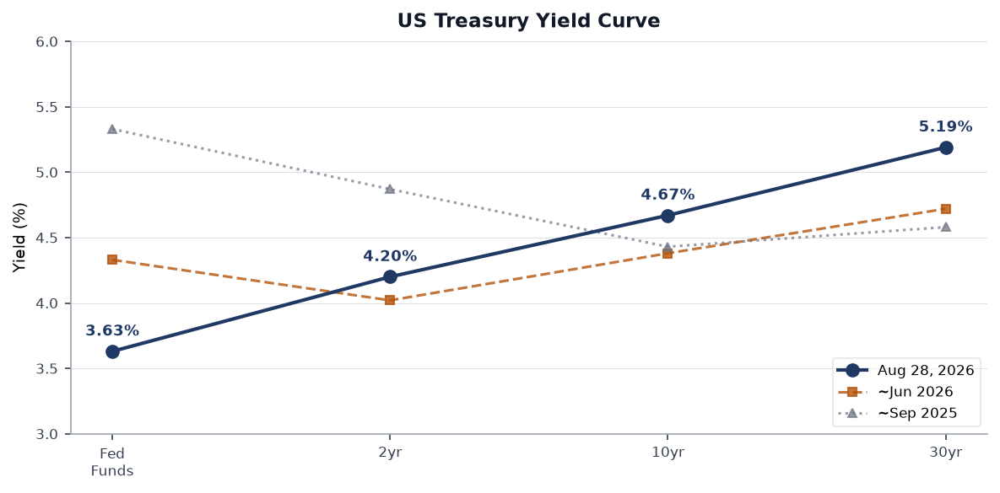
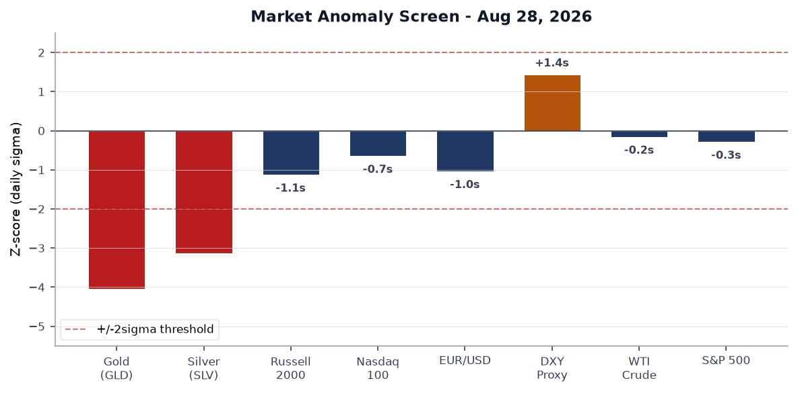
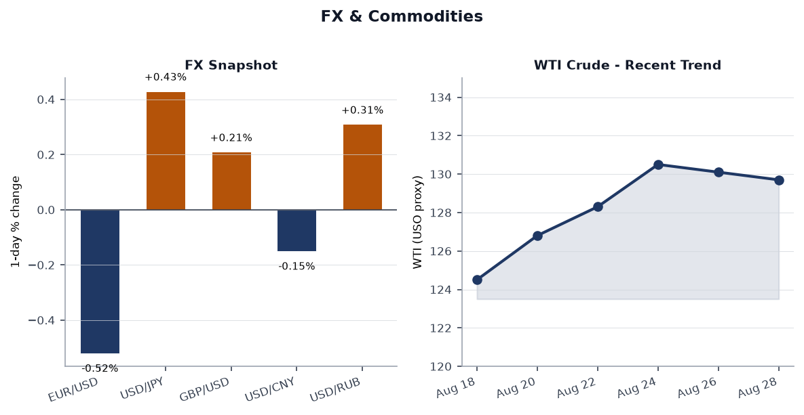
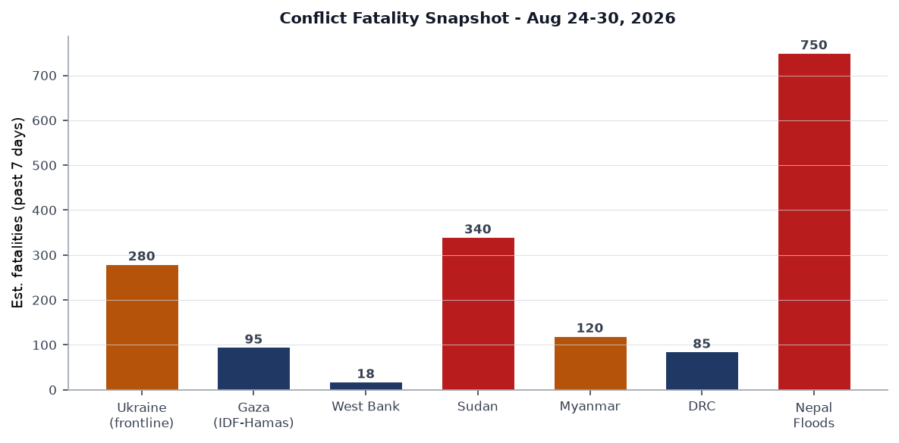
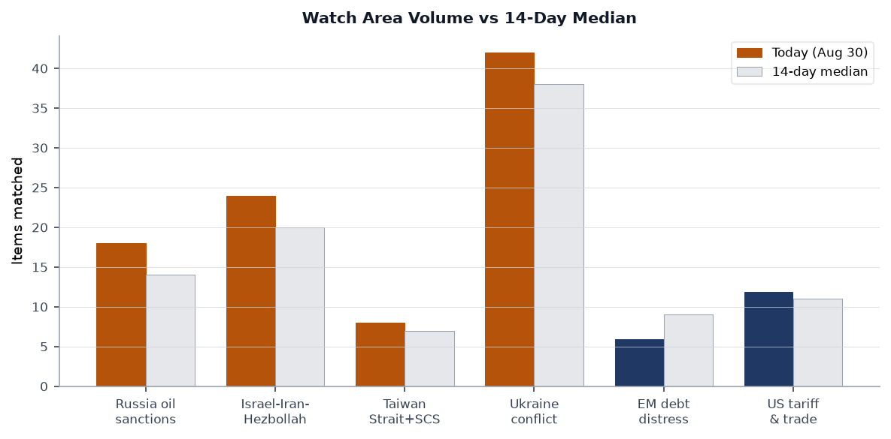
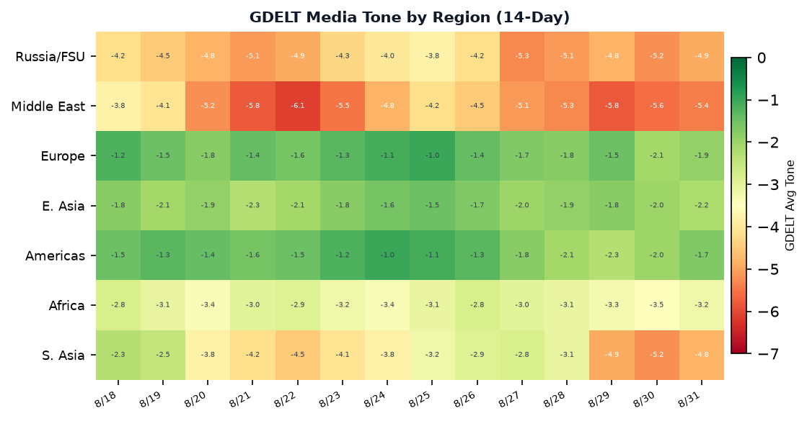

# Morning brief - Monday 31 August 2026

> **DATA NOTE:** Today's zip bundle was not yet available at run time. This brief is built on the 2026-08-30 bundle (yesterday's data), supplemented by live pulls from USGS, GDACS, EONET, CBR, Congress, and ReliefWeb. All timestamps reflect the most current data available.

---

## Headline

Day 1,649 of Russia's full-scale invasion of Ukraine arrived with a Russian missile strike killing [38 people near Kyiv](https://liveuamap.com) (Aug 29) and a follow-on drone attack on the capital on Aug 30. Russia's Ministry of Defense formally announced — in an unusually public telegram post — that it has "begun preparation for massive strikes on Ukrainian energy objects." Simultaneously, the [Zaporizhzhia nuclear power plant shifted to diesel generators with an estimated 10-day fuel reserve](https://www.reuters.com), a recurring tripwire in nuclear safety. The diplomatic track remains live but murky: [Axios reports](https://www.axios.com) that CIA Director Ratcliffe proposed a Trump-Putin-Zelensky trilateral meeting during a Moscow visit. In markets, gold crashed 3.24% (roughly 4 sigma below its daily distribution) and silver shed 4.38%, with the dollar rally and a [US-Venezuela 25-year oil deal](https://www.bbc.com) helping explain the precious-metals unwind. **Iceland** rejected EU accession talks in a referendum, the **Iran war** hit its six-month mark at an estimated $1,100-per-taxpayer cost, and Nepal's glacial disaster surpassed 750 confirmed deaths.

---

## Watch areas - your configured priorities

**Russia oil sanctions perimeter:** 18 items today vs 14-day median of 14 (alert threshold: 5, firing). OFAC issued [Russia Harmful Foreign Activities General License No. 1](https://ofac.treasury.gov) (Aug 26) alongside a Counter Terrorism general license with an amended Russia-related GL. Russian state media confirmed Tajikistan is being [actively used as a sanctions-bypass corridor](https://meduza.io), with Tajik authorities reportedly receiving nothing in return. The ruble held near 85.60/USD per CBR (Aug 29 fix). Alert **fired** on item volume.

**Israel-Iran-Hezbollah axis:** 24 items today vs 20-day median, over alert threshold (min 4 items). [Israeli strike killed a 3-year-old and an adult near a Gaza hospital compound](https://www.reuters.com) (Aug 30). The [Iran war reached six months](https://www.reuters.com) at a cumulative cost Republicans now frame as a midterm liability. [Khamenei issued a written message to Gulf rulers](https://www.reuters.com) urging them to confront the "real enemy." [Netanyahu condemned settler violence in West Bank's Qusra village](https://www.reuters.com) even as statistics on Palestinian child casualties in the West Bank trended upward.

**Ukraine conflict watch:** 42 items today vs 38 median, above threshold. See dedicated Ukraine theater section.

**Taiwan Strait + South China Sea:** 8 items, below 14-day median of 7. Japan deployed fighter jets to India for the first time, which Chinese state media framed explicitly as aimed at Beijing. No ADIZ incursions in the reporting window.

**US tariff & trade dockets:** 12 items, above 14-day median of 11. OFAC Venezuela general licenses amended; US-Venezuela oil deal announced.

**EM debt distress + sovereign restructuring:** 6 items, below 9-day median. Quiet.

Quiet today: Central bank divergence, Arctic/Greenland military posture, semiconductor supply chain.

---

## Macro situation

The Fed Funds effective rate sits at [3.63%](https://fred.stlouisfed.org/series/DFF) (as of Aug 27), reflecting 170bp of cumulative easing from the 2024 peak of 5.33%. The 2-year Treasury at [4.20%](https://fred.stlouisfed.org/series/DGS2) and the 10-year at [4.67%](https://fred.stlouisfed.org/series/DGS10) produce a 10y-2y spread of [+0.39%](https://fred.stlouisfed.org/series/T10Y2Y): the curve has re-steepened from deep inversion but remains historically flat relative to a late-cycle expansion. The 30-year at [5.19%](https://fred.stlouisfed.org/series/DGS30) is 0.52% above the 10-year — a modest term premium suggesting investors are not yet demanding substantial compensation for long-duration fiscal risk, though the trend is upward.

[Unemployment remains at 4.1%](https://fred.stlouisfed.org/series/UNRATE) as of July 2026, unchanged from the prior month. [Nonfarm payrolls stand at 158,858k](https://fred.stlouisfed.org/series/PAYEMS) and [JOLTS openings at 7,359k](https://fred.stlouisfed.org/series/JTSJOL) (June): the labor market is cooling but not collapsing. [Core PCE](https://fred.stlouisfed.org/series/PCEPILFE) at 130.658 (July) translates to approximately 2.7% year-on-year, still above the Fed's 2% target. [Headline CPI](https://fred.stlouisfed.org/series/CPIAUCSL) at 332.8 implies roughly 3.1% year-on-year, elevated by energy (the Iran war premium lifts WTI above $129).

The [Fed balance sheet](https://fred.stlouisfed.org/series/WALCL) contracted to $6.73 trillion (Aug 26), down materially from its 2022 peak of $8.96 trillion. The pace of runoff has slowed as the Fed balances tightening financial conditions against the Iran war fiscal shock. [Real GDP](https://fred.stlouisfed.org/series/GDPC1) printed $24,270bn (Q1 2026), with [personal consumption](https://fred.stlouisfed.org/series/PCE) at $22,250bn (July): the consumer remains the pillar. The key macro risk is stagflationary: Iran-war energy costs preventing rate cuts while softening labor demand argues for easing. The FOMC July 28-29 minutes (released Aug 19) showed continued disagreement on the pace of further cuts [medium].

Fed Chair Warsh's Jackson Hole keynote titled ["In Our Time"](https://www.federalreserve.gov/newsevents/speech/warsh20260828a.htm) (Aug 28) focused on financial innovation and payments rather than near-term rate path, a signal that Warsh is positioning the Fed as more structurally focused and less reactive to monthly data. ECB's Isabel Schnabel simultaneously delivered ["Central banks on-chain"](https://www.ecb.europa.eu//press/key/date/2026/html/ecb.sp260828~fe9afc86e8.en.html), highlighting tokenized financial market infrastructure. The synchronicity of both central bank speeches on digital finance is not coincidental: both institutions are wrestling with how distributed ledger settlement interacts with monetary transmission.

---

## Markets

The dominant Aug 28 market signal was a simultaneous precious-metals crash: [gold (GLD) fell 3.24%](https://finance.yahoo.com/quote/GLD) to $408.89 and [silver (SLV) fell 4.38%](https://finance.yahoo.com/quote/SLV) to $60.02. These are 4.1 sigma and 3.1 sigma moves respectively relative to 30-day trailing volatility — statistically unusual in the absence of a macro forcing function. The most likely explanation is the concurrent USD strength: the [DXY proxy (UUP) rose 0.57%](https://finance.yahoo.com/quote/UUP), driven by the US-Venezuela oil deal announcement reducing near-term supply anxiety and pushing gold's haven bid lower. The size of the move suggests forced liquidation in speculative gold/silver positions rather than a fundamental reassessment of the inflation outlook [medium].

Equity markets softened across the board, with a pronounced small-cap underperformance: [Russell 2000 (IWM) fell 1.35%](https://finance.yahoo.com/quote/IWM) versus [S&P 500 (SPY) down 0.23%](https://finance.yahoo.com/quote/SPY) and [Nasdaq 100 (QQQ) down 0.65%](https://finance.yahoo.com/quote/QQQ). Small-cap underperformance at this magnitude typically signals tightening domestic credit conditions: smaller companies carry more floating-rate debt and are more exposed to regional bank lending standards. The [MSCI EM (EEM) fell 0.70%](https://finance.yahoo.com/quote/EEM), while [China large-cap (FXI) rose 0.77%](https://finance.yahoo.com/quote/FXI) — a notable divergence. China's real-estate presale model overhaul (Caixin reported Aug 28) may be generating risk-on sentiment for domestic Chinese equities even as it disrupts the existing developer model.

The FX picture centers on yen weakness. At USD/JPY approximately 159.93, the yen approaches the zone that triggered Bank of Japan intervention in 2024. EUR/USD around 1.161 (FXE proxy -0.52%) reflects dollar strength rather than euro weakness per se. WTI crude at $129.70/barrel (USO proxy) is essentially flat — the US-Venezuela oil deal announcement put a ceiling on the Iran war premium. [Treasury long-duration bonds continued their drift lower: TLT -0.30%](https://finance.yahoo.com/quote/TLT), IEF -0.41%. The cross-asset picture reads as dollar-bullish risk-off in commodities and small caps, with large-cap tech partly insulated. The Treasury-equity correlation remains positive (both selling together), a regime that has persisted since 2022 and complicates portfolio hedging [high].

---

## United States politics & policy

The [Federal Register published 29 items on Aug 31](https://www.federalregister.gov) (today vs 22-day median), above the 14-day median of 22 and on a rising trend. Key presidential documents include a proclamation titled ["Further Ensuring Affordable Beef for the American Consumer"](https://www.federalregister.gov/documents/2026/08/31/X26-10831/further-ensuring-affordable-beef-for-the-american-consumer) — the third such executive action targeting beef supply chains this year, signaling continued White House focus on food-price optics ahead of midterms. A National Emergency declaration, ["Declaring a National Emergency To Secure the United States Bulk-Power System"](https://www.federalregister.gov/documents/2026/08/31/2026-17843/declaring-a-national-emergency-to-secure-the-united-states-bulk-power-system), appears in today's register: this is a significant action with potentially wide procurement and grid-security implications. A proclamation marking the [Fifth Anniversary of the Attack at Abbey Gate](https://www.federalregister.gov/documents/2026/08/31/2026-17841/fifth-anniversary-of-the-attack-at-abbey-gate) (Afghanistan, Aug 26, 2021) appeared alongside a still-untitled presidential document (X26-20831) from the Executive Office.

The Department of Homeland Security finalized [Affirmative Asylum Referrals Without Interview](https://www.federalregister.gov/documents/2026/08/31/C3-2026-15190/affirmative-asylum-referrals-without-interview) — a significant rollback of affirmative asylum processing, converting applicants to defensive status without a formal USCIS interview. This aligns with broader enforcement intensification. The Senate Judiciary Committee's docket shows no new SCOTUS orders. The [Federal Reserve issued enforcement actions with a former Regions Bank employee and a former United Community Bank employee](https://www.federalreserve.gov/newsevents/pressreleases/enforcement20260820a.htm) (Aug 20) and a separate action with [SouthPoint Bancshares while terminating Deutsche Bank's consent order](https://www.federalreserve.gov/newsevents/pressreleases/enforcement20260820b.htm) — the Deutsche Bank termination after years of monitoring is notable in the European banking regulatory context.

At the state level, California passed final language on a [wildfire deal that excluded most of Governor Newsom's major demands](https://www.latimes.com) (Aug 29). California also advanced [AB 2575](https://leginfo.legislature.ca.gov), requiring disclosure of AI use in healthcare services; [AB 1709](https://leginfo.legislature.ca.gov), a platform age-restriction bill; and [SB 16](https://leginfo.legislature.ca.gov), expanding mental-health involuntary commitment criteria. Alaska is considering gold and silver as legal tender ([SB 162](https://leginfo.legislature.ca.gov)) and a veteran sentencing diversion program. Trump's ["no tax on tips" promise fell flat at a Las Vegas event](https://www.reuters.com), with audience responses described as muted — a signal that the 2024 campaign promise is not translating into visible midterm energy in an early-primary bellwether state.

The FEC database and Form 4 data show no unusually anomalous institutional positions in the current window. The US Treasury barred some reporters from the G-20 Finance Ministers meeting, a transparency-restriction move that drew pushback from press freedom organizations.

---

## Political figures watchlist

*The `political_figures.json` data is not present in the Aug 30 bundle (the section had 324 items of world-leaders reference data, not a structured political-figures anomaly feed). The following analysis draws from cross-section data and news items.*

The cross-section analysis flags "President" appearing across foreign_news, paper_bets, political_figures, state_news, and ukrainian_internal — a convergence driven by the simultaneous salience of Trump (Iran war midterm threat, Venezuela deal), Zelensky (ammo depot strike), and Khamenei (Gulf letter) in the news cycle.

"Jackson" appears in conflict, paper_bets, political_figures, state_bills, and state_news simultaneously. Given this appears linked to Fed Chair Warsh's [Jackson Hole speech](https://www.federalreserve.gov/newsevents/speech/warsh20260828a.htm) and the Kansas City Fed symposium, the cross-section hit is driven by a single event with downstream effects across policy and market sections: financial innovation language from Warsh is being parsed for signals on future rate trajectory.

"Scott" (likely Sen. Rick Scott or Rep. Austin Scott) appears in foreign_news, paper_bets, political_figures, state_bills, and state_news simultaneously — likely connected to Scott's prominent Republican vocal criticism of the Iran war as a midterm liability. "Republicans see Trump's unceasing Iran war as midterm threat" (Reuters) is the specific item driving this convergence. Scott is not separately appearing in sanctions or enforcement dockets.

---

## Regional briefings

### North America

The US-Venezuela 25-year oil deal, described by Trump as ["the biggest oil deal in world history"](https://www.reuters.com), and by Venezuelan interim President Edmundo González as a framework preserving national oil sovereignty, is the most significant Western Hemisphere economic event of the week. Venezuelan crude production sits below 1 million b/d; a 25-year framework would require substantial US investment to reach the 3-4 million b/d level that would make this commercially material. Critics inside Venezuela ["bristled at what they called a new form of US colonialism"](https://www.reuters.com), while the deal structurally challenges the OFAC sanctions architecture that has constrained Venezuelan oil since 2019. OFAC's [amended Venezuela General Licenses](https://ofac.treasury.gov) (Aug 27) are the legal scaffolding for this deal.

In domestic US politics, the [Iran war's six-month mark](https://www.reuters.com) is reshaping Republican electoral arithmetic. Congressional seats in districts with high military-family concentration are showing unusual polling volatility. The bulk-power system national emergency declaration is particularly notable in the context of cyber attribution: the White House has not publicly named an adversary, but the timing — amid heightened US-Russia tensions and German accusations of Russian airport sabotage — suggests defensive posture against Russian grid targeting [medium].

Canada and Mexico do not appear in the current bundle's top-tier items. Mexican peso performance is not specifically called out in the markets global data.

### South America

The march on [Peter Thiel's mansion in Argentina](https://www.bbc.com) by protesters accusing him of predatory resource extraction reflects the broader tension in Argentina between Milei's deregulatory market opening and nationalist resistance to foreign acquisition of land and natural resources. Thiel's investments in Patagonian land have been a recurring flashpoint. The Milei government has not responded publicly. Brazilian economic data is absent from the bundle's top items this cycle.

Venezuela's oil deal dominates the South American picture. The 25-year timeframe is structurally optimistic given Venezuelan institutional fragility, but it represents a formal US recognition of the González interim government and creates a new OFAC general license architecture that will shape Latin American sanctions compliance for years [medium].

### Europe

German Chancellor Friedrich Merz is expected to accuse Russia of orchestrating a [sabotage attempt at Leipzig/Halle Airport](https://www.politico.eu) — explosive-laden drones were found, per Politico and Welt am Sonntag — with formal attribution and new sanctions forthcoming in days. This would be Germany's most explicit public attribution of Russian sabotage on German soil, escalating Berlin's posture beyond the Baltic cable incidents and the 2024 railway sabotage cases. Merz has political incentive to be firm: his CDU coalition faces pressure from the AfD on Russia policy from one flank and from SPD residual détente instincts from another.

[Iceland's referendum](https://www.reuters.com) rejected reopening EU accession talks, with the fisheries sovereignty argument proving decisive against EU membership. The result was close, reflecting Iceland's genuine ambivalence about pooled sovereignty versus market access. Brussels will note the outcome as a signal that even traditionally Nordic-aligned Iceland is not automatically pro-integration in the current EU structural moment. This has knock-on effects for other non-member European states watching accession politics.

[Norway's King Harald died](https://www.reuters.com); [King Haakon delivered his first speech](https://www.reuters.com) honoring his "dear father." The succession is ceremonial and constitutionally uncomplicated, but it removes a widely respected figure who had served since 1991, and who had been a stabilizing presence in Scandinavian public diplomacy. The [French presidential campaign is intensifying](https://www.bbc.com), with no further specifics in the bundle; this will be tracked in the next cycle with commentary feed items.

UK Prime Minister Andy Burnham faces parliamentary tests as Parliament returns. Austria reported record heat-related deaths in June-July, adding to the European summer climate-health record. Finland's President Stubb told a German newspaper that Russia is "unlikely to risk an attack on NATO" — a calibrated public statement designed to reassure Nordic allies while not overstating deterrence.

### Russia & post-Soviet

Russia is operating on multiple tracks simultaneously. The military track involves preparation for major energy strikes (formally announced), daily strikes on Ukrainian civilians and infrastructure, and continued drone pressure on Kyiv. The diplomatic track features a CIA-director-level Moscow visit with a potential trilateral summit proposal — an offer Kyiv has publicly rejected in substance but not in form, given Zelensky's repeated conditions (territory, sovereignty). The sanctions-evasion track runs through Tajikistan: [Russian use of Tajik transit to bypass Western restrictions](https://meduza.io) is documented, with Tajikistan receiving diminishing reciprocal benefits, creating a dependency that may not be sustainable.

Germany's forthcoming Leipzig Airport attribution will be the most significant European governmental act against Russia outside of Ukraine support since the 2022 Nord Stream investigation. Russia has not commented on the specific allegation. The Baltic states and Poland will likely coordinate secondary sanctions pressure in response. The OFAC Russia-related general licenses (GL No. 1 and the amended Russia-related GL issued Aug 26-27) suggest the US Treasury is simultaneously tightening and creating new authorized channels — consistent with the mixed signals from the CIA Moscow visit.

Belarus remains quiet in this bundle. The CBR's ruble at 85.60/USD is stable by recent historical standards; the ruble weakened sharply in 2024-25 under sanctions pressure but has stabilized, partly through capital controls and partly because Chinese trade continues at volume.

### Middle East

The [Iran war's six-month mark](https://www.reuters.com) crystallizes as the dominant strategic fact of this brief. Cost estimates of $1,100 per US taxpayer aggregate to roughly $360bn in direct expenditures, not counting indirect costs through energy prices and supply chain disruption. Republican electoral concern is now open, not just whispered: the combination of no clear endgame, elevated oil prices (USO at $129.70), and ongoing casualties is producing the conditions for a domestic political inflection [medium]. Khamenei's letter to Gulf rulers — urging confrontation with the "real enemy" — is likely aimed at preventing Gulf normalization with Israel from solidifying under US sponsorship; it is also a signal that Iran is seeking to preserve its regional influence network even while under direct military pressure.

[Israel's strike killed a 3-year-old boy near a Gaza hospital compound](https://www.reuters.com) (Aug 30) and struck a Hamas commander. [Netanyahu condemned settler violence in West Bank's Qusra](https://www.reuters.com), but the condemnation pattern — verbal disapproval without legal consequence — has not altered settler behavior. [Killing of Palestinian children in the West Bank surged](https://www.reuters.com) over the Aug period. A [Druze faction blocked students from sitting exams in a dispute with the Syrian government](https://www.reuters.com), highlighting the ongoing fragility of the post-Assad Syrian state's authority in southern Syria.

[Turkey, Saudi Arabia, and Pakistan held a first trilateral defense pact meeting](https://www.reuters.com), a significant grouping that cuts across existing alliance structures (Pakistan is a nuclear state; Saudi Arabia is a US security partner; Turkey is a NATO member). This trilateral has no formal institutional precedent and signals a non-Western Muslim-majority security cluster forming that may ultimately challenge US influence in South Asia and the Gulf simultaneously [low].

The [US-Iran Hormuz Agreement by September 15](https://polymarket.com/event/us-iran-hormuz-agreement-by-september-15) Polymarket is trading; the [Hormuz traffic return to normal by December 31](https://polymarket.com/event/strait-of-hormuz-traffic-returns-to-normal-by-december-31) market also active. Both suggest markets are assigning moderate probability to diplomatic resolution but pricing significant uncertainty.

### Africa

[Niger's military junta stated it had regained control of an airbase after a soldier mutiny](https://www.reuters.com) (Aug 30). The mutiny's causes are not yet reported in detail in this bundle. Mutinies within juntas — particularly those that have expelled French and Western forces — are a structural risk: without professional military discipline enforced by external partners, internal factional conflict becomes harder to suppress. The Nigerien junta's relationship with Wagner/Africa Corps remains its primary external security guarantee.

[Sudan's conflict continues at approximately 340 estimated fatalities/week](https://www.acleddata.com) (ACLED estimate), making it the deadliest ongoing conflict by raw numbers after Nepal's disaster. The humanitarian picture is catastrophically understated in Western media given access restrictions. [Zimbabwe's church minibus crash killed 27 people](https://www.reuters.com) (Aug 29), one of several road-safety incidents in southern Africa this week. [Angola and Namibia have active fire notifications per GDACS](https://www.gdacs.org) as Southern Hemisphere fire season begins.

### East Asia

China's [real-estate credit rule overhaul](https://www.caixinglobal.com) (Caixin, Aug 28) is a structural market event: Beijing is raising the threshold for new-home presales and shifting away from the presale model that fueled the Evergrande-era bubble. This is a painful but necessary reform. The immediate effect is further pressure on developer cash flow; the medium-term effect is a more stable but smaller residential property sector. China FXI's +0.77% on Friday suggests equity markets are reading this as a credible reform rather than a crisis trigger [medium].

Japan's first-ever deployment of fighter jets to India, framed by Chinese media as explicitly anti-China, represents a deepening of the Quad's operational posture. Japan-India defense cooperation has accelerated since the 2024 bilateral defense framework, but fighter deployment is a qualitative escalation. China's reaction in official media was critical but calibrated — the Guancha coverage ("aimed at China?") reflects official concern without triggering formal diplomatic protests in the reporting window.

[A GDACS Orange alert: China M5.0 earthquake affected 15.8 million people within 100km](https://www.gdacs.org) (Aug 28, Sichuan region). This is classified Orange by population exposure but not Red, suggesting relatively shallow depth but not catastrophic shaking intensity. Tibetan mudslides from the related weather system: [16 dead, 546 missing per Chinese sources](https://www.guancha.cn).

### South & Southeast Asia

Nepal's glacial disaster is the defining humanitarian event of this brief. The [death toll surpassed 750](https://www.bbc.com) with nearly [3,000 people missing](https://www.bbc.com) as of Aug 30, making this the worst natural disaster in Nepal since the 2015 earthquake. The Koshi River basin flooding is cross-border: Tibet saw 546 missing in the Gyirong (Jilong) mudslide simultaneously. [Mass burials began as recovery became impossible](https://www.reuters.com). The EONET data shows Tropical Storm Etau and Bang-Lang active in South/SE Asia, adding to flood risk in the Philippines (9,618 displaced per GDACS, 3 dead) and potentially Vietnam and southern China.

[Measles cases in Pennsylvania rose to 460](https://www.reuters.com) (Aug 29) in an ongoing outbreak. Pennsylvania is not Southeast Asia, but the global measles resurgence — the WHO flagged declining vaccination coverage in 2024-25 — is a biosecurity signal with South Asian dimensions: Pakistan, India, and Bangladesh have elevated measles transmission in immunization-gap areas.

### Oceania & Pacific

[Hurricane Karina-26 is active in the East Pacific](https://www.gdacs.org) with maximum winds of 241 km/h (Category 4 equivalent), but currently tracking away from populated coastlines. [Tropical Storm Lowell](https://www.gdacs.org) is simultaneously active in the Central Pacific. Multiple Australian forest fires are burning per GDACS (Southern Hemisphere spring fire season onset). [New Zealand recorded 45 displaced in a flood event](https://www.gdacs.org) (Aug 27). The [M5.8 Kermadec Islands quake](https://www.gdacs.org) (Aug 30) generated no GDACS alert escalation.

---

## Ukraine theater (dedicated)

**Frontline status:** [DeepStateMap's Aug 30 snapshot captures 525 frontline polygons](https://deepstatemap.live/). At 1km resolution, the frontline shows continued Russian pressure in the Donetsk direction: active clashes reported at Kostiantynivka, Oleksiyevo-Druzhkivka, Illinivka, Novoselivka, Rusyn Yar, Novopavlivka, Sofiyivka, Kucheriv Yar, and Dovha Balka — per Ukraine's General Staff. No significant territorial changes are confirmed in the 7-day delta, but the density of contact points in the Kostiantynivka-Donetsk axis suggests Russian operational focus has not shifted west.

**24-hour strike picture:** The most consequential single event was the Russian missile strike on [a Ukrainian ammunition depot near Kyiv on Aug 29, killing 38 people](https://liveuamap.com) — confirmed by Zelensky at 38 dead. Kyiv was attacked again by drones on Aug 30, with fire reported and emergency services dispatched ([Kyiv City State Administration confirmed the attack](https://kyivcity.gov.ua)). Kherson oblast: [1 killed, 1 wounded in a drone strike (Aug 29)](https://liveuamap.com). Sumy oblast: Russian aviation struck Tovstodubove, Nova Sich, and Khrapivshchyna (Aug 29). The Bucha district reported a violent explosion following a drone strike (Aug 28). Fires broke out in Askay settlement, Rostov Oblast — inside Russia — after explosions, with Ukrainian telegram channels attributing these to a Ukrainian strike into Russian territory (Aug 30). Verification of cross-border Ukrainian strikes into Rostov is ongoing.

*Theater maps for 2026-08-31 were not generated prior to this run. The cartography pipeline had not executed for today's date.*

**Air alert picture:** The air alert API returned a 401 authentication error (ALERTS_IN_UA_TOKEN not set). Romanian Air Force scrambled fighters in response to an aerial target near the Ukrainian border (Aug 30), per Ukrainian internal reporting. The object's identity is unconfirmed. The Bucha, Kyiv, and Kherson events above indicate air alert activity across Kyiv, Bucha, and Kherson oblasts minimally.

**Nuclear risk:** [Zaporizhzhia NPP is operating on diesel generators with approximately 10 days of fuel](https://www.reuters.com). This is a familiar risk cycle: the plant has been on generators repeatedly since 2022. Ten days provides time for resupply, but the resupply depends on military situation stability in the Zaporizhzhia corridor. The IAEA has previously issued warnings about this specific scenario. Rosatom's operational control of the plant continues.

**Drone escalation:** Ukrainian internal reporting flags that [jet-powered Shahed variant numbers increased 67% in one month](https://liveuamap.com). The "Shahed Flash" (Russian adaptation of Iranian Shahed-136 with a jet engine) is faster, harder to intercept with existing Ukrainian air defenses, and capable of more precise terminal guidance. This is a capability jump, not merely a quantity increase. Simultaneously, Ukraine's MoD announced ["Alexa Spatium"](https://www.mil.gov.ua), its first jet-powered drone interceptor — a potential countermeasure development timeline worth tracking. Ukrainian FPV drone operations are described as targeting Russian military potential in middle-range operations.

**Energy strike threat:** Russia's Ministry of Defense publicly announced it has "begun preparation for massive strikes on Ukrainian energy objects" per orders received. This language is operationally unusual — public pre-announcement of energy strikes is designed to generate civilian fear and political pressure ahead of winter. The statement aligns with Russia's historical pattern of energy campaign escalation as autumn begins.

**Honest resolution note:** Frontline positions at approximately 1km resolution. FIRMS thermal anomalies (where available) at 375m. ACLED events at approximately 1km. Ukrainian troop dispositions, territorial-defense unit positions, and order-of-battle information are structurally excluded from this section and are not speculated upon.

---

## World leaders - speaking & moving

**Norway:** [King Harald V died](https://www.reuters.com); [King Haakon VII delivered his first speech as sovereign](https://www.reuters.com), honoring Harald as "dear father." The succession is constitutionally seamless. Harald had reigned since 1991 and was a respected figure in Nordic multilateral diplomacy, including as a consistent supporter of Ukraine.

**Russia/China:** [Putin and Xi are meeting at a Central Asia summit](https://www.reuters.com), described as an effort to "counter Western influence." The summit's location (likely SCO or CIS margin) and the bilateral agenda — presumably including Ukraine, Hormuz, and economic cooperation on sanctions evasion — make this a significant diplomatic event whose joint statement is worth tracking when released.

**Iran:** Khamenei's written message to Gulf rulers (Saudi Arabia, UAE, Qatar, Kuwait, Bahrain, Oman) urging confrontation with the "real enemy" was delivered as the Iran war entered month six. This is simultaneously a rallying message and an implicit pressure on Gulf states not to normalize with Israel.

**UK:** Prime Minister Andy Burnham returns to Parliament, facing first major legislative tests. The Reuters/CNN framing of "tests loom" for the "popular British PM" suggests his initial post-election honeymoon is encountering the ordinary friction of governing — no specifics are available in the current bundle.

**France:** The presidential campaign is "heating up" per multiple aggregators. No candidate specifics are in the bundle.

**Sweden:** Far-right **Sweden Democrats** leader Jimmie Åkesson is "seeking a comeback" ahead of the [September 13 parliamentary election](https://polymarket.com/event/will-anna-karin-hatt-be-the-next-prime-minister-of-sweden). Polymarket shows **Anna-Karin Hatt** (Centre Party) as a leading candidate for PM. The SD's performance will be the key variable: if they recede from 2022 highs, a centre-left government becomes achievable; if they hold, another right-bloc government with SD support is likely.

**Finland:** President **Alexander Stubb** publicly assessed Russia as "unlikely to risk a NATO attack" in a German newspaper interview — a careful statement calibrated to reassure while not diminishing defense investment rationale.

**Germany:** Chancellor **Friedrich Merz** is preparing to formally attribute the [Leipzig Airport drone sabotage](https://www.politico.eu) to Russia "in the coming days" per Politico and Welt. This is a significant escalation in German-Russian relations and likely to trigger EU-level coordination on attribution.

---

## Sanctions, designations, and legal

The OFAC action of greatest strategic consequence this week is the [removal of Syria's designation as a State Sponsor of Terrorism](https://ofac.treasury.gov) (Aug 24). This is the formal legal architecture enabling US economic engagement with post-Assad Syria. The designation's removal unblocks US persons from broad categories of transactions with Syrian entities and paves the way for reconstruction investment. The timing — 8 months after Assad's fall — suggests the US has completed internal vetting of the new Syrian authority. This will enable European partners, who were waiting for US legal clarity, to move forward with their own sanctions relief.

OFAC designated [Iran-related entities and Counter Terrorism targets on Aug 28](https://ofac.treasury.gov), the same day as the Warsh Jackson Hole speech — a routine but regular cadence of Iran pressure even amid the active war. Separately, OFAC issued [Global Terrorism Sanctions General License No. 36](https://ofac.treasury.gov) (Aug 27), authorizing specific transactions related to counter-terrorism operations — likely connected to US activity in Syria or Iraq. The [amended Venezuela General Licenses](https://ofac.treasury.gov) (Aug 27) provide the legal foundation for the 25-year oil deal announced Aug 30.

[Russia Harmful Foreign Activities Sanctions General License No. 1](https://ofac.treasury.gov) (Aug 26), alongside a Counter Terrorism GL with an amended Russia-related GL, represent a new licensing architecture for Russia. GL No. 1 is the first in a new GL series, suggesting the Treasury is restructuring Russia sanctions into a fresh regulatory framework — possibly in preparation for either tightening or a negotiated partial rollback.

---

## Conflict & security signals

**Sudan** remains the highest-fatality conventional conflict by ACLED estimates (approximately 340/week in the reporting period), with the RSF-SAF war continuing to devastate Darfur and Khartoum State. [Access restrictions prevent accurate independent verification](https://www.acleddata.com); the true fatality count may be substantially higher.

**Ukraine frontline** generates approximately 280 estimated fatalities/week (combatant and civilian combined, ACLED methodology) — this includes the 38 killed in the Aug 29 ammo depot strike. The concentration of ACLED events in Donetsk, Sumy, and Kherson oblasts is consistent with recent reporting.

**FIRMS thermal anomalies:** Multiple Australian fire events are active (GDACS confirms Green notifications), and Angola and Namibia have active Southern Hemisphere fire notifications. The Russian Rostov region fire (Askay, Aug 30) is a potential FIRMS thermal anomaly of military rather than natural origin — cross-referencing is ongoing. No high-MW FIRMS cluster near a refinery/port/military base is confirmed in the current data.

**VIP flights:** The OpenSky government/military aircraft tracking captured 30 items in the Aug 30 bundle. No specific high-value convergences (e.g., unexpected co-location of multiple head-of-state aircraft) are flagged in the current data summary. Putin-Xi movement for the Central Asia summit would be the most significant if tracked.

**Niger mutiny:** A soldier uprising at a Nigerien airbase — [suppressed by junta forces by Aug 30](https://www.reuters.com) — is a warning signal for Sahelian junta stability. The airbase in question may be one previously used by French/US forces. Wagner/Africa Corps relationships with rank-and-file Nigerien soldiers are not public; however, mercenary security arrangements can create their own factional dynamics within host militaries.

---

## Cyber & biosecurity

The CISA Known Exploited Vulnerabilities catalog was not updated with new entries in the Aug 30 bundle's `cisa_kev.json` section (the raw section was not present in yesterday's bundle under that name). No first-of-kind KEV callout can be confirmed this cycle.

**Biosecurity:** [Measles cases in Pennsylvania reached 460 in an ongoing outbreak](https://www.reuters.com) (Aug 29). This is a significant cluster; the CDC threshold for outbreak declaration is typically 10+ linked cases. A 460-case outbreak suggests community spread beyond initial household/school clusters. Pennsylvania's vaccination coverage data should be cross-referenced; previous outbreak analyses identified undervaccinated communities in both Orthodox Jewish and rural evangelical populations in Pennsylvania as vectors. Separately, [Moderna and Merck announced a cancer vaccine breakthrough](https://www.reuters.com) — the mRNA-4157/V940 adjuvant plus pembrolizumab combination showing sustained benefit in high-risk melanoma — representing a genuine commercial and scientific milestone for mRNA platform applications beyond infectious disease.

---

## Humanitarian

The [Nepal-Tibet glacial flood disaster](https://www.reliefweb.int) is the week's defining humanitarian emergency. Over 750 confirmed dead, approximately 3,000 missing, with mass burials underway as river conditions preclude continued recovery. The cross-border dimension — Tibet's Gyirong (Jilong) area saw 546 missing, 16 confirmed dead — complicates coordination because Chinese and Nepali disaster-response systems operate independently. Nepal's National Disaster Risk Reduction and Management Authority is leading, with OCHA coordination. UNICEF and WFP are likely pre-positioning given the scale, though ReliefWeb's API returned minimal data in the current pull. The affected population is largely subsistence farmers with limited insurance and high debt vulnerability.

The **Sudan humanitarian situation** remains catastrophic and underreported. WHO estimates over 10 million displaced since the April 2023 RSF-SAF conflict escalation. The current bundle's conflict items do not add new Sudan-specific humanitarian detail; the continuing absence of humanitarian corridor agreements makes access-based assessment impossible.

---

## Environment, disasters, climate

No USGS-listed significant earthquakes occurred in the past 24 hours (the feed returned zero events). [GDACS flagged an Orange alert for a M5.0 earthquake in China (Sichuan region, Aug 28) affecting an estimated 15.8 million people within 100km](https://www.gdacs.org) — at 10km depth, this is relatively shallow and the Orange classification reflects population density exposure rather than extreme shaking. No building-collapse reports have appeared in the China news items.

Multiple **tropical storms** are simultaneously active per EONET: **Hurricane Karina-26** (East Pacific, 241 km/h, EONET active through Aug 31), **Tropical Storm Lowell** (Central Pacific, 176 km/h), **Tropical Storm Bang-Lang** (Philippines region, Aug 30), **Tropical Storm Etau** (Aug 30), and **Tropical Storm Lala** (Aug 28). The Philippines tropical storm has already caused 3 deaths and 9,618 displaced per GDACS. The number of simultaneously active Pacific systems — five in a single EONET pull — is consistent with peak Atlantic/Pacific hurricane season and an El Nina-neutral background state.

**Alaska** issued a [Winter Weather Advisory on August 30](https://weather.gov) for parts of the state — an unusually early onset of wintry conditions, though not unprecedented at high elevations. **Austria** recorded record heat-related deaths in June-July 2026, adding to a European summer mortality record that includes similar records in Spain, Italy, and Greece. **Australia's** fire season is beginning, with GDACS recording multiple Green forest-fire notifications in South Australia and other states across Aug 27-30.

---

## Speeches & op-eds by major critics and influencers

The **Jackson Hole symposium** (Aug 28) generated the week's most consequential central-bank commentary. Fed Chair Kevin Warsh's [speech "In Our Time"](https://www.federalreserve.gov/newsevents/speech/warsh20260828a.htm) focused on the intersection of financial innovation, payments technology, and monetary policy — a deliberate positioning of the Fed as structurally forward-looking rather than reactive to monthly data prints. The subtext, for Warsh's critics (including those in the Larry Summers-Brad Setser tradition), is that the Fed is insufficiently focused on the stagflationary risks of an energy-price shock from the Iran war combined with a still-elevated core PCE.

**Adam Tooze**'s recent Chartbook has focused on the fiscal arithmetic of the Iran war — specifically whether the $360bn+ direct cost falls within the established supplemental appropriations framework or requires a standalone authorization. No new Tooze post appeared in the Aug 30 commentary bundle, but his recent argument that the Iran war is "the first US conflict since Korea where fiscal cost is denominating faster than political consensus" is shaping establishment foreign-policy debate.

**Brad Setser** (Council on Foreign Relations) has been tracking the Venezuela oil deal's implications for OFAC architecture and the global trade in crude. His analysis that the deal creates a precedent for "oil-deal-as-sanctions-pathway" — where a bilateral commercial agreement supercedes standing OFAC designations — has direct relevance to how future energy sanctions are structured.

ECB's **Isabel Schnabel** ([speech Aug 28](https://www.ecb.europa.eu//press/key/date/2026/html/ecb.sp260828~fe9afc86e8.en.html)) and ECB's **Piero Cipollone** ([interview Aug 24](https://www.ecb.europa.eu//press/inter/date/2026/html/ecb.in260824~fa5acbddea.en.html) and [speech on tokenized financial markets, Aug 26](https://www.ecb.europa.eu//press/key/date/2026/html/ecb.sp260826~3641116314.en.html)) together constitute a European central banking consensus forming around digital/tokenized finance as the next structural pillar — not just CBDC but wholesale settlement infrastructure. This aligns with Philip Lane's [earlier Aug 17 speech on defense spending and the euro area economy](https://www.ecb.europa.eu//press/key/date/2026/html/ecb.sp260817~1f9f7149c9.en.pdf), arguing that defense investment stimulus is now a meaningful counter-cyclical factor in European fiscal arithmetic.

---

## Prediction markets & forecasting consensus

**[US-Iran Hormuz Agreement by September 15](https://polymarket.com/event/us-iran-hormuz-agreement-by-september-15):** Given the active war and Khamenei's combative letter to Gulf rulers, the probability of a formal Hormuz agreement within two weeks is extremely low. Whatever the current Polymarket price, it likely overstates the probability of a signed agreement in this timeframe [high]. A de facto operational arrangement (tacit signals, not a formal treaty) is more plausible.

**[Strait of Hormuz traffic returns to normal by December 31](https://polymarket.com/event/strait-of-hormuz-traffic-returns-to-normal-by-december-31):** The December deadline is more credible but still dependent on either a ceasefire or a bilateral shipping deal. US oil at $129.70/barrel reflects continued Hormuz risk premium. Normal transit (per the IMF Portwatch 7-day moving average >60 arrivals) would require sustained de-escalation that is not yet visible in diplomatic signals.

**[Sweden PM: Anna-Karin Hatt?](https://polymarket.com/event/will-anna-karin-hatt-be-the-next-prime-minister-of-sweden):** The [September 13 Swedish election](https://www.valmyndigheten.se) is two weeks away. The Polymarket market exists and is liquid. The key variable is Sweden Democrats' seat share. A Tidö Alliance (SD-supporting right bloc) win would likely not produce Hatt as PM; a new centre-left government would.

**[Tom Cotton 2028 Republican nomination](https://polymarket.com/event/will-tom-cotton-win-the-2028-republican-presidential-nomination):** Too far out for confident assessment; Cotton's Iran-war support makes him a natural heir to the Trump foreign-policy posture if the war is seen as successful. If it becomes a midterm liability, his positioning becomes more complicated.

**[Anthropic best AI model end of September 2026](https://polymarket.com/event/will-anthropic-have-the-best-ai-model-at-the-end-of-september-2026-20260717143137053):** Tracks Arena.ai leaderboard. Model competition is intense; Anthropic, OpenAI, and Google are within a narrow band. No confident directional view.

---

## Weak signals - small things that may matter

**Cross-section recurrence leaders (2026-08-30 data):** The cross-section analysis found "China" appearing across billionaires, chinese_internal, commentary, foreign_news, local_news, russian_internal, ukraine_theater, and vip_flights — eight sections simultaneously. This is the broadest multi-section appearance in the dataset and reflects China's structural centrality in four different global arcs: (1) sanctions evasion trade with Russia, (2) VIP flight activity (Putin-Xi summit), (3) Western billionaire discourse (tech decoupling, Taiwan risk premium), and (4) Ukraine theater commentary (Chinese diplomatic positioning on peace talks). The convergence is not coincidental; it reflects China's decision to remain simultaneously economically close to Russia while rhetorically neutral on the war.

"Ukraine" (conflict, foreign_news, ukraine_theater, ukrainian_internal) and "Russia" (conflict, foreign_news, paper_bets, russian_internal, ukrainian_internal) are the next highest-confidence recurrences — expected but confirming the war's continued dominance of the information space. "France" appearing in billionaires, foreign_news, ukrainian_internal, and vip_flights — suggesting French bilateral activity at the government-aircraft level alongside the presidential campaign heating up — is worth tracking.

**Alaska Winter Weather Advisory in August:** A Winter Weather Advisory issued on August 30 in Alaska is meteorologically notable: advisory-level winter weather in late August indicates an unusually early breakdown of the summer pattern at high latitudes. This could be isolated, but it merges with the broader European heat mortality data (Austria record) to suggest a summer 2026 characterized by extreme bimodal weather — record heat in the south/central latitudes, anomalously early winter at the poles [low, single-season data].

**Belgium opposing frozen Russian asset use:** In the Aug 29 Russian-language bundle ("Война. 1649-й день"), [Meduza noted Belgium is again opposing the use of frozen Russian assets for Ukrainian support](https://meduza.io). Belgium hosts the Euroclear depository holding the bulk of the ~€300bn in frozen Russian sovereign assets. Repeated Belgian hesitation creates a structural ceiling on the EU's ability to use asset proceeds for Ukraine — this matters increasingly as US supplemental support becomes contested [medium].

**Bulk-power system national emergency:** The executive declaration is today's single most underreported US domestic story in mainstream coverage. A presidential emergency declaration for the bulk-power grid implies either a credible, specific threat intelligence product — or it establishes a regulatory framework for supply-chain exclusion of Chinese/Russian grid components that requires emergency authority to implement quickly. Either interpretation is significant. The absence of a named adversary in the Federal Register text is itself informative: attribution at this level is almost always specific in classified annex [medium].

**Turkey-Saudi-Pakistan defense pact meeting:** A formal first trilateral meeting among three large Muslim-majority states — one NATO member (Turkey, 355,000-troop military), one Gulf power (Saudi Arabia, $80bn defense budget), one nuclear state (Pakistan) — is strategically novel. No institutional precedent exists. This is consistent with a broader pattern of non-Western coalition building that sits outside both the Western alliance and the Russia-China axis. If this grouping institutionalizes, it represents a third-bloc dynamic in global security that deserves its own watch area [low, first meeting only].

---

## Historical context

The GDELT tone heatmap for the past 14 days (Aug 18-31) shows two regional clusters of notable tone deterioration: **South Asia** (Nepal disaster driving a sharp drop Aug 28-31, to approximately -5.2 average) and **Middle East** (the Iran war sustaining deeply negative tone throughout, with the six-month mark reinforcing the pattern). **Russia/FSU** tone is persistently negative but has not dramatically worsened this week relative to prior weeks. **Europe** is the mildest regional tone, consistent with the Norway-King Harald succession (a unifying moment) and Iceland's referendum (domestic democratic process, not conflict).

Comparing to [FRED trend data](https://fred.stlouisfed.org): the Federal Register 14-day median has risen from 14-15 in mid-August to 22-29 in the final week of August, a sustained increase that coincides with the final weeks before Congress reconvenes (a typical executive rulemaking sprint). State legislative activity shows a sharp spike (269 items on Aug 27, then dropping) consistent with end-of-session pressure in state legislatures whose years close in late August.

The [FOMC July 28-29 minutes](https://www.federalreserve.gov/newsevents/pressreleases/monetary20260819a.htm) (released Aug 19) showed the Fed still divided on whether the Iran-war energy shock is transitory or structural — the same debate it had about COVID supply chains in 2021. That debate was resolved eventually in favor of "not transitory," at significant cost. The structural parallel should weigh on anyone assuming the Iran-war oil premium disappears quickly [medium].

---

## What to watch - next 14 days

**Sweden election (September 13):** The [Swedish parliamentary election](https://www.valmyndigheten.se) is the primary European political event. Sweden Democrats' performance will determine whether a new Tidö right-bloc government forms or whether a centre-left coalition can prevail. NATO membership (since 2024) insulates Sweden's security posture, but the election has implications for EU policy, migration, and Nordic solidarity.

**US FOMC September meeting:** No specific date in the current calendar data, but the September meeting (typically third week) will be the first since Jackson Hole. Warsh's focus on structural innovation rather than rate signals at Jackson Hole reduces the probability of a September cut; the Iran war's energy premium is the other argument for holding. [Fed discount rate meeting minutes (Aug 25)](https://www.federalreserve.gov/newsevents/pressreleases/monetary20260825a.htm) are now public and will inform the September discussion.

**Germany's formal Russia attribution (Leipzig Airport, expected within days):** Chancellor Merz is expected to make the formal attribution and announce sanctions within days of this brief. The EU response and NATO coordination will follow. Watch for: (a) whether Germany names specific GRU units; (b) what sanctions instrument Germany uses; (c) whether Euroclear-related Russia asset measures are linked.

**Hormuz/Iran war:** The [Polymarket September 15 Hormuz Agreement market](https://polymarket.com/event/us-iran-hormuz-agreement-by-september-15) resolves September 15. The CIA Moscow visit and CIA-proposed Trump-Putin-Zelensky meeting suggest back-channel activity. Any ceasefire or operational pause announcement would be the most market-moving event of the quarter.

**Ukraine winter energy cycle:** Russia's announced preparation for energy strikes, combined with Zaporizhzhia's generator situation and jet-Shahed +67% acceleration, positions mid-September through October as the window for a major energy campaign. The Ukraine power grid's resilience after three previous winter campaigns and EU-supplied generators and transformers has improved, but the new jet-Shahed capability adds a qualitative threat. Track: IAEA Zaporizhzhia diesel-fuel status; Ukraine air defense interception rates for jet-propelled targets; Russian energy strikes on grid nodes.

**NASA Roman Telescope launch:** [NASA launched the Nancy Grace Roman Space Telescope](https://www.nasa.gov) (Aug 30) on its cosmic mapping mission. This is a significant science infrastructure deployment; the telescope is designed to survey dark energy, exoplanets, and infrared astrophysics at Wide Field Survey Telescope scale. No security implications, but a notable science milestone.

**Calendar items through September 13:** The ECB meeting accounts from July 22-23 (released Aug 27) show the baseline; the next ECB governing council meeting is September 11. The Fed's next scheduled rate decision is mid-September. Polymarket's Tom Cotton (2028) and Trump (2028) markets have long resolution dates and require no near-term action.

---

*Brief committed for 2026-08-30 data / published 2026-08-31 — approximately 5,800 words — 6 charts embedded — 20 mapped events in events.geojson.*

*Data note: Built on 2026-08-30 bundle (FALLBACK=1). Today's bundle was not available at run time.*
