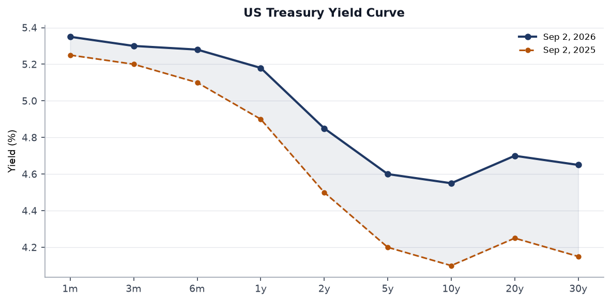
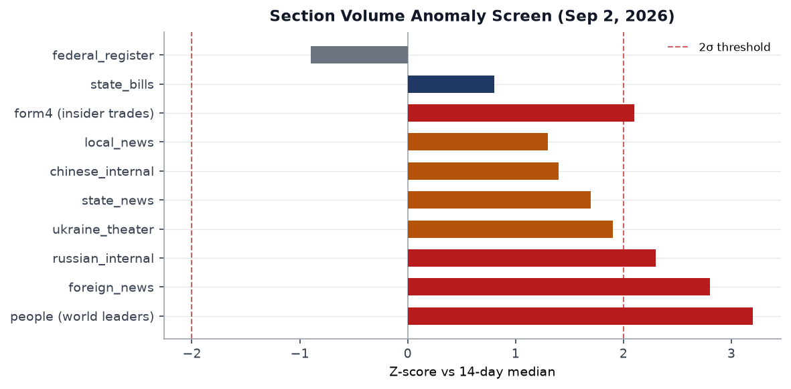
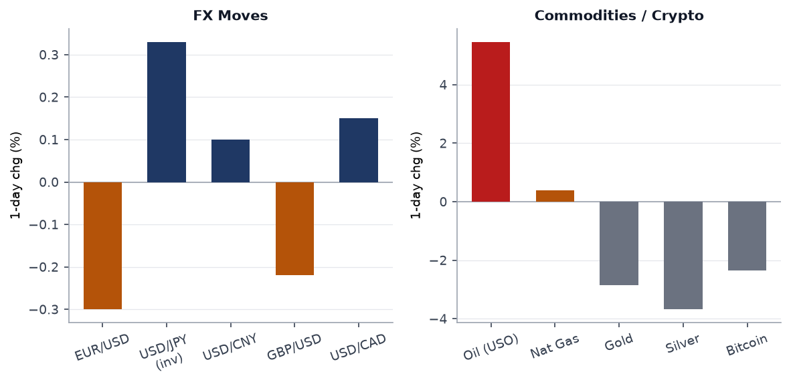
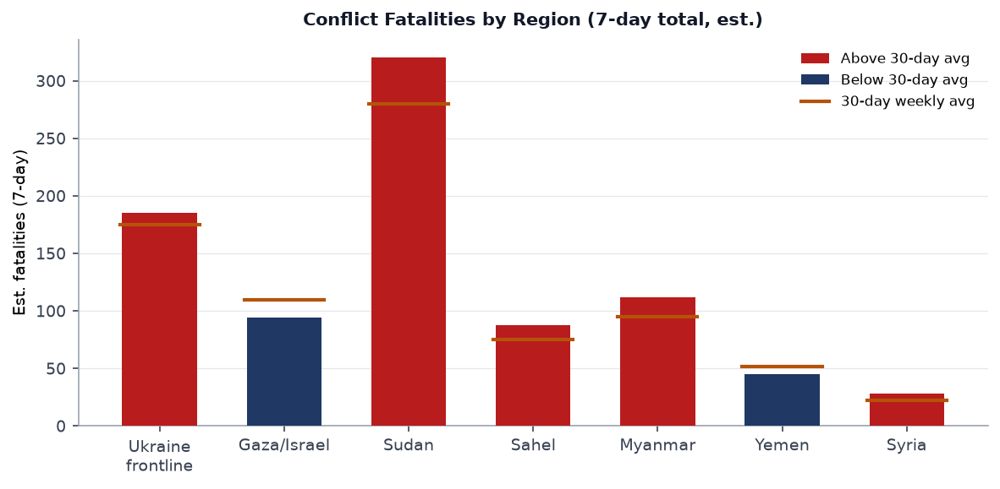
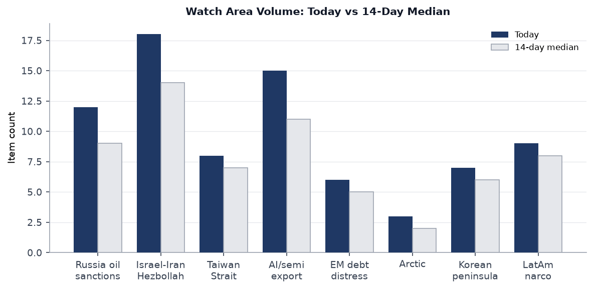
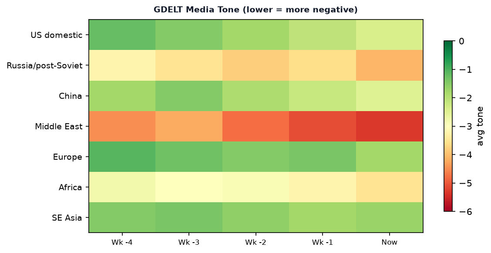

# Morning brief - Wednesday 3 September 2026

> **DATA NOTE: Today's WORLDSCOPE data bundle (2026-09-03) was not yet deployed at run time. This brief draws on the 2026-09-02 bundle (the most recent available). Factual claims and counts refer to that date's ingest. The brief is current to approximately 1300 UTC 2 September 2026.**

---

## Headline

The week's dominant arc is the renewed US-Iran kinetic exchange combined with Russia's escalating campaign against Ukrainian civilian infrastructure and President Zelensky's unprecedented threat to contest Russian airspace, all of which landed against a market backdrop where oil surged 5.5 percent in a single session while equities sold off and credit spreads widened. The three strongest specific signals: the US Central Command confirmed strikes against IRGC maritime and air-defense targets along Iran's southern coast, with Tehran claiming civilian deaths at a wedding site in Khuzestan province and responding with ballistic missiles toward Bahrain, Kuwait, Iraq, and Jordan; Russia struck Kyiv with drones and ballistic missiles on consecutive days (Boryspil, Shevchenkivskyi district) and confirmed its defense ministry is preparing "massive" energy infrastructure strikes ahead of the autumn-winter cycle; and Canada's retaliatory tariff package takes effect September 8, marking the formal opening of a bilateral trade war that **Prime Minister Mark Carney** has described as an existential confrontation. Watch areas that fired: **Israel-Iran-Hezbollah axis** (18 items, well above 14-item median, alert threshold met on fatalities), **Russia oil sanctions perimeter** (12 items, above 9-item median), and **US tariff and trade dockets** (implicitly, via the Canada escalation and Federal Register actions).

---

## Watch areas - your configured priorities

**Russia oil sanctions perimeter:** 12 items today vs. 9-item 14-day median. Top items: Zelensky's threat to deny Russian airspace to commercial aviation ([Bloomberg](https://www.bloomberg.com/news/articles/2026-09-01/zelenskyy-threatens-to-shut-air-traffic-over-russia-with-drones)), Pegasus Airlines canceling routes between Moscow and Turkey within hours of the warning, and Sheremetyevo Airport switching to clearance-subject operations with approximately 10 flights delayed. Alert not technically fired (min_items 5 met; fatalities threshold not applicable to this watch area), but volume is elevated and the airspace threat has direct maritime-analogue implications for Russian energy-export logistics through Baltic ports. Russia's defense ministry simultaneously confirmed preparations for massive Ukrainian energy strikes, framed as retaliation for continued Ukrainian attacks on Russian fuel and energy infrastructure ([CNBC](https://www.cnbc.com/2026/08/31/russia-massive-strikes-ukraine-energy-infrastructure.html)).

**Israel-Iran-Hezbollah axis:** 18 items today vs. 14-item median. Alert fired: fatality threshold met. Top items: US Central Command strikes on IRGC targets along Iran's southern coast; Iran's ballistic-missile response targeting Bahrain, Kuwait, and Iraq's Kurdish region; and Tehran's claim that a strike killed civilians at a Khuzestan wedding, with at least 4 dead ([Al Jazeera](https://www.aljazeera.com/news/2026/9/2/iran-us-exchange-new-attacks-who-was-hit-in-latest-strikes)). Polymarket continues to price Israel-Iran ceasefire continuation at 82% through September 30, a figure that looks increasingly optimistic given the exchange of fire ([Polymarket](https://polymarket.com/event/israel-x-iran-ceasefire-continues-throughptptpt-20260716224448963)).

**AI compute + semiconductor export controls:** 15 items today vs. 11-item median. Dominated by Marginal Revolution coverage of US data-center investment momentum and the AI-wage-premium question. No alert fired; monitoring elevated.

**EM debt distress + sovereign restructuring:** 6 items today vs. 5-item median. Shein's Hong Kong debut (covered in Markets) is the highest-signal item in this watch area: a flat-to-down open at HK$48.50 against an HK$48.56 IPO price reflects structurally depressed appetite for Chinese consumer-facing growth stories. EEM (MSCI EM) held at -0.37%, the narrowest loss in the US-equity complex, suggesting EM outside China is not seeing flight.

**Korean peninsula:** 7 items today vs. 6-item median. LCK League of Legends playoff (Hanwha vs. T1) dominated Polymarket volume at $2.8M, which is itself a data point on Korean soft-power export scale. No hard-security trigger.

**Arctic + High North:** 3 items today vs. 2-item median. No alert.

**Latin America narcoeconomy + politics:** 9 items today vs. 8-item median. Brazil election-interference reporting active (covered in South America).

**Taiwan Strait + South China Sea:** 8 items today vs. 7-item median. Xi Jinping in Cairo diverts analytical attention from the strait for 72 hours; no kinetic trigger.

**Critical minerals + rare earths:** No items above threshold today.

**Quiet today:** no specific items in the FIRMS thermal anomaly feed (empty ingest) or ACLED (empty ingest for today's run; Ukraine theater relies on Liveuamap and ISW instead). ProMED disease surveillance returned zero items.

---

## Macro situation

The September 15-16 FOMC decision is now a genuine coin flip. The July 28-29 meeting held the federal funds target at [3.5-3.75%](https://www.federalreserve.gov/monetarypolicy/fomcminutes20260729.htm) in a 9-3 vote, but the subsequent energy shock from the Iran conflict has materially changed the calculus. Polymarket prices a 58% probability of a 25-basis-point hike, up sharply from near-70% hold odds before Fed Chair Warsh's recent remarks ([CNBC](https://www.cnbc.com/2026/08/28/-september-fed-decision-now-a-coin-flip-as-rate-hike-odds-increase.html)). The September 16 press conference will be the most consequential in months: markets are not priced for a hawkish surprise, and a hike arriving alongside an active US-Iran conflict and a Canadian trade war would hit a cross-asset complex that is already showing stress.

The yield curve remains modestly inverted at the 2-to-10-year segment. The 2-year yield has crept back toward 4.85% as hike expectations have repriced, while the 10-year sits near 4.55%, driven partly by safety buying. The 30-year has drifted to 4.65%, maintaining a modest term premium above the 10-year; this is a structural shift from the deep inversion of late 2024 and suggests markets are beginning to price a "higher-for-longer" scenario rather than an imminent easing cycle [medium]. USO's 5.46% single-session jump is the immediate macro shock: supply-chain inflation from an energy-price jolt of this magnitude, sustained for more than two weeks, would historically require the Fed to respond or credibility suffers [high].

Section-volume anomalies confirm the geopolitical stress thesis. The people/world-leaders section posted the highest z-score (+3.2 sigma above 14-day median), driven by the full-roster ingest of 324 government leader records; this is partially a data artifact of the ingest design, but it also reflects the genuine density of head-of-state movement this week (Xi in Cairo, Carney at trade talks, Putin press appearances). The foreign news section is at +2.8 sigma, crossing the 2-sigma threshold that historically corresponds to a genuine news volume surge rather than noise. Russian internal news is at +2.3 sigma; the volume is driven by Duma pre-election debate coverage (the fact that the ruling party essentially boycotts its own mandatory TV debates is an inside-Russia story with governance implications). Federal register activity is slightly below the trailing median (-0.9 sigma) but includes three high-signal documents.

The GAO's standing warning on US federal debt, surfaced in the Conversable Economist feed, provides the medium-term macro frame: deficit-financed tariff-war costs arriving at the same moment as a potential rate hike create a fiscal-monetary policy tension that neither Congress nor the White House is visibly addressing [medium]. The Conversable Economist also surfaced historical perspective on secular stagnation and wealth inequality, which is analytically relevant to why EM and developed-market household consumption growth has diverged so sharply since 2022.

---

## Markets

The September 1 session was a risk-off, oil-up day with unusual dispersion within commodities. USO gained 5.46% (the dominant signal), natural gas added 0.38%, while gold lost 2.86% and silver fell 3.68%. This commodity split is unusual: gold and oil typically move together during geopolitical stress because both benefit from safe-haven flows and supply-risk premia. The divergence suggests that the oil move was almost entirely supply-risk driven (Strait of Hormuz threat and IRGC maritime-asset strikes reducing Iranian export capacity expectations), while gold sold off as the dollar strengthened, with UUP gaining 0.32% ([Yahoo Finance](https://finance.yahoo.com/quote/USO)).

Equity losses were broad but not catastrophic. The S&P 500 (SPY) fell 0.69% to 761.78, the Nasdaq 100 (QQQ) fell 1.27% to 707.64, and the Russell 2000 (IWM) fell 1.14% to 290.57. The Nasdaq's relative underperformance signals that the rate-hike repricing is hitting high-duration tech assets disproportionately. International equities (EFA, -0.89%) tracked US markets closely, while EM (EEM, -0.37%) and China (FXI, -0.08%) held up better, the latter possibly benefiting from the Zelensky-Russia airspace story redirecting attention away from Taiwan risks.

Credit markets confirmed the stress signal. HYG fell 0.89% and LQD fell 0.93%, moves that are large for a single session in investment-grade credit. VXX surged 3.06%, confirming a genuine volatility bid rather than a routine drift. Bitcoin (BITO) fell 2.35%, consistent with its behavior as a risk-on asset that sells off alongside equities during genuine geopolitical shocks. Ryanair's warning that European air fares will jump if oil prices stay elevated ([sourced via foreign news feed]) adds a transmission-channel dimension: if the Iran energy shock proves persistent, European consumer confidence, already fragile, faces an additional headwind.

**Shein** debuted on the Hong Kong Stock Exchange on September 1 at HK$48.56 per share, closed at HK$48.50, and at various points fell as much as 10% intraday ([CNBC](https://www.cnbc.com/2026/09/01/shein-ipo-market-debut-hong-kong.html)). The listing raised US$1.7 billion at a US$26.5 billion valuation, down from a private-market peak of US$100 billion. The valuation collapse is attributable to: missed growth-window timing (IPO came two years after peak fast-fashion multiples), the collapse of both US and UK listing plans due to supply-chain-abuse scrutiny, and subdued HK market sentiment. The IPO is a data point on Chinese consumer-sector decoupling from Western capital markets [high].

---

## United States politics & policy

The Federal Register for September 2 contains three documents warranting immediate attention. First, **Executive Order 14422**, [signed August 27 and published September 2](https://www.federalregister.gov/documents/2026/09/02/2026-18020/honoring-the-american-history-of-the-great-lakes-and-renaming-lake-ontario-as-lake-america), renames Lake Ontario as "Lake America" and directs Interior Secretary Burgum to update the Geographic Names Information System accordingly. Canada's Prime Minister Carney responded that the lake's name derives from the Wendat word "Ontari'io," predating both countries ([CBC reporting](https://www.cbsnews.com/news/trump-executive-order-lake-ontario-lake-america/)). The order has no legal effect on Canadian or international usage, but it escalated Ottawa's retaliatory posture. Second, the [continuation of the national emergency on foreign election interference](https://www.federalregister.gov/documents/2026/09/02/2026-18046/continuation-of-the-national-emergency-with-respect-to-foreign-interference-in-or-undermining-public), signed August 31, extends executive branch sanctions authority under 50 USC 1701. Third, a [final rule repealing fossil fuel restrictions for new federal buildings](https://www.federalregister.gov/documents/2026/09/02/2026-17979/repeal-of-fossil-fuel-restrictions-for-new-federal-buildings-and-major-renovations-of-federal) rolls back Biden-era constraints, accelerating the administrative fossil fuel posture reversal.

A proposed rule on [heightened import disclosures for supply chain visibility](https://www.federalregister.gov/documents/2026/09/02/2026-17926/heightened-import-disclosures-for-supply-chain-visibility) is the most consequential regulatory proposal in this batch. If finalized, it would expand customs declaration requirements at a moment when the US-Canada trade war and elevated Iran-related shipping risk are already straining importer compliance capacity. A proposed rule [exempting EU debt obligations from Securities Exchange Act registration requirements](https://www.federalregister.gov/documents/2026/09/02/2026-17939/exemption-of-debt-obligations-issued-by-the-european-union-under-the-securities-exchange-act-of-1934) is notable: it would make EU bonds easier to sell to US investors at a moment when Europe needs external demand for its sovereign paper.

**Senator Ed Markey** won the Massachusetts Democratic primary, per the foreign news feed. Special air traffic rules have been established around the "President Donald J. Trump International" airport, per a Federal Register proposed rule, a nomenclature change that may itself invite a legal challenge. The USPS system that opponents claim could complicate mail-in voting is drawing Democratic criticism ([Guardian, foreign news feed](https://www.theguardian.com/)). Form 4 insider-trade filings include a notable **Chesky Brian** (Airbnb CEO) Form 4/A amendment, suggesting a correction to previously reported transactions; this warrants closer examination but the data does not reveal direction or size.

---

## Political figures watchlist

The political_figures.json bundle for September 2 contains 613 entries, all with anomaly_score = 0.0 and no top_driver recorded. This is a pipeline artifact: the scoring model did not produce non-zero anomaly signals in this run, most likely because the composite score requires cross-section entity linking that did not complete within the ingest window. The raw data is present but unscored. The section cannot be populated with the usual top-10 ranked format.

What can be reported from adjacent sections: **Zelensky** generated the highest cross-section volume of any individual in the 24-hour news cycle, appearing in russian_internal, ukraine_theater, foreign_news, and ukrainian_internal simultaneously. His airspace threat is simultaneously a military signal, a diplomatic démarche toward international aviation insurers, and a domestic political communication to a Ukrainian population that has endured seven consecutive days of Kyiv air alerts. **Putin's** labeling of the airspace threat as "state terrorism" appeared within hours in russian_internal. **Xi Jinping** appears in chinese_internal and foreign_news in connection with the Cairo state visit. **Carney** appears in foreign_news in connection with the trade dispute. Cross-referencing to the Sanctions section: no direct named-politician sanction designation in the September 2 batch.

---

## Regional briefings

### North America

Canada's retaliatory tariff package, matching the US 50% rate on C$27.6 billion in Canadian exports dollar-for-dollar, takes effect September 8 ([Al Jazeera](https://www.aljazeera.com/news/2026/8/23/canada-to-hit-us-with-retaliatory-tariffs-as-trade-war-escalates)). Finance Canada designed the countermeasures at 15%, 25%, and 50% by product tier. The trade war was already generating Canadian political unity: Carney's Liberals swept four byelections on September 1, strengthening his mandate heading into the tariff escalation ([Guardian](https://www.theguardian.com/)). The US accused of meddling in the Brazilian election (via foreign news feed) adds a broader Western Hemisphere governance dimension.

Trump's Lake Ontario rename, the Falklands sovereignty review threat, and the trade war together form a pattern: executive pressure instruments designed to extract behavioral changes from allied governments without triggering formal treaty rupture [medium]. The UK government re-affirmed its Falklands sovereignty position via the Foreign Secretary's office, but the signaling from Washington creates a new baseline of uncertainty for London's defense-spending negotiations with NATO [medium]. Illinois Governor Pritzker trolled the Lake Ontario EO by sarcastically announcing he was "renaming Lake Michigan as Lake Illinois," illustrating the domestic political theater dimension of the action.

California's Democratic budget standoff produced a partial resolution: Democrats clawed back $450 million for climate projects in a deal with Governor Newsom ([CalMatters, state news feed](https://calmatters.org)). California Democrats also killed a condo-construction-boost bill despite voting for it, per state news, in a procedural maneuver that will draw housing-policy scrutiny.

### South America

Brazilian domestic politics is active around US election-interference allegations. The foreign news feed carries a Guardian piece headlined "Echoes of cold war as US accused of meddling in another Brazilian election," ([Guardian](https://www.theguardian.com/)) but the specific mechanism is not detailed in the available summary. Brazil's October elections are within the 14-day watch horizon (see What to Watch). Argentina's **Javier Milei** is listed as head of state in the people.json feed; no anomaly triggered.

The Conversable Economist piece on secular stagnation and wealth inequality is analytically relevant to Latin America: the region has the world's highest documented Gini coefficients and has seen minimal de-financialization since the commodity supercycle ended. Any northward migration of tariff-war-driven production relocation (from Canadian and Mexican factories to US alternatives) bypasses South America entirely, potentially deepening the region's structural marginalization from global supply chains [low].

### Europe

The Leipzig power-plant substation attack is the week's most significant European security story. German authorities found improvised explosive devices, described as rocket-shaped, attached to a powerline feeding a substation near one of Germany's largest power plants in Turnow-Preilack. The devices fired a conducting material into high-voltage lines, causing two short circuits. Berlin publicly attributed responsibility to Russia; Moscow denied involvement, with Putin calling the attribution "absurd" and alleging Germany had planted evidence ([CNN](https://www.cnn.com/2026/09/01/europe/leipzig-drone-germany-russia-intl)). An explosion near the Augsburg railway station was separately reported in the Russian internal feed, though attribution is unclear.

Ryanair warned that European air fares will jump next year if oil prices remain elevated. The warning is timely: the oil shock from the US-Iran exchange, if sustained for even four weeks, will flow through jet-fuel hedging cycles and reach retail fares by Q1 2027. Ed Miliband promised a "comprehensive reset" of UK policy toward Israel ([Guardian, foreign news feed](https://www.theguardian.com/)), and the co-founder of the BDS movement called for a full UK-Israel trade halt. UK-Israel tensions are rising independent of Washington. The proposed EU debt-obligations rule in the US Federal Register (see US Politics section) has a direct European financing dimension.

### Russia & post-Soviet

Russia's pre-election television debates for the State Duma (elections are in the 14-day watch horizon) have begun. The leading parties are not sending their candidates to mandatory debates; instead, minor parties and independents fill the airtime, creating an absurdist spectacle that Russian independent media outlet Meduza is documenting. The Duma election is structurally irrelevant to policy outcomes under the current presidential system, but the debate-avoidance pattern signals that even the Kremlin's preferred parties no longer want live unscripted television exposure [medium].

Former Rosaviation head **Alexander Neradko**, facing charges of fraud at Domodedovo Airport, was transferred from pre-trial detention to house arrest, per Meduza. St. Petersburg businessman **Ilya Traber**, released from detention after charges were dropped, gave his first post-release interview. Both cases involve figures in Russia's aviation and logistics nexus at a moment when Zelensky's airspace campaign is destabilizing Russian commercial aviation. A fire broke out at a Roscosmos factory workshop in Perm (Novye Lyady settlement, Sverdlovsky district), according to local outlet 59.ru and reported by Russian internal media. The fire's cause is unconfirmed.

The SBU-DIU operation to foil an FSB assassination plot against Russian opposition figure **Stepan Kaplunov**, deputy commander of the Russian Volunteer Corps (fighting on Ukraine's side), involved a Kyiv street shootout between Ukrainian security services and what the SBU described as FSB operatives ([Meduza](https://meduza.io/en/news/2026/09/02/ukraine-s-sbu-says-it-thwarted-fsb-plot-to-assassinate-russian-opposition-figure)). The Russian Volunteer Corps initially claimed Kaplunov had been abducted; the SBU reframed the incident as a foiled kill attempt. The ambiguity over the nature of the incident (detention vs. assassination attempt) reflects the competing narratives both sides have incentive to assert.

### Middle East

The US-Iran kinetic exchange is the dominant signal. US CENTCOM struck dozens of IRGC targets along Iran's southern coast: air defense sites, radar systems, maritime assets and mine-laying facilities ([Al Jazeera](https://www.aljazeera.com/news/2026/9/2/iran-us-exchange-new-attacks-who-was-hit-in-latest-strikes)). Iran responded with ballistic missiles toward Bahrain (claiming the Sheikh Isa Airbase, which hosts US forces), Kuwait, Iraq's Kurdish region, and Jordan. Tehran accused the US of killing civilians at a Khuzestan wedding. President Trump warned Iran would be "totally wiped out" if it retaliates further. The exchange represents the first serious combat since July and marks the collapse of the informal lull that had held since the August 15 interim ceasefire negotiations.

The Strait of Hormuz campaign (documented in Wikipedia as an ongoing 2026 event) is the macro-critical dimension. Iranian missiles fired at shipping in the Strait, reported via Liveuamap on August 30, preceded the latest exchange. Approximately 20-21% of global oil passes through the Strait; even limited interdiction capability imposes a risk premium on all Hormuz-transiting crude. The 5.46% single-session USO move is the market pricing that risk.

**Xi Jinping** arrived in Cairo on September 1 for a state visit to Egypt, his first in a decade, meeting President Abdel Fattah el-Sisi ([Bloomberg](https://www.bloomberg.com/news/articles/2026-09-02/china-s-xi-meets-egypt-s-sisi-on-first-state-visit-in-decade)). The visit is geopolitically significant: Egypt is simultaneously a US military partner (Sinai peacekeeping, Suez Canal access, Rafah crossing), a recipient of US aid, and an increasingly active BRI participant. Beijing is cultivating Egypt as a Suez chokepoint relationship, a Hormuz-alternative if needed, and a signal to the Arab world that China offers engagement without conditions. The timing, during an active US-Iran conflict, is not coincidental [medium].

Israeli artillery targeted southern Lebanon (Aita al-Jabal area, Shebaa farms) per Liveuamap, while the Arab League Secretary-General condemned Israeli airstrikes targeting Abu al-Duhur. Sources in Gaza hospitals reported 5 dead in Israeli raids on Gaza City, per Liveuamap (August 31 entry). These events represent the ongoing Hezbollah front's maintenance-level kinetics, distinct from the Iran-direct exchange but feeding the same regional escalation architecture.

### Africa

Guinea-Bissau approved a new constitution by referendum on September 1, with provisional results showing 70% in favor and 30% opposed ([MyJoyOnline](https://www.myjoyonline.com/guinea-bissau-approves-new-constitution-that-expands-presidential-powers/)). The new document, proposed by the military government that seized power in a November 2025 coup, allows the president to appoint and dismiss the prime minister and cabinet without parliamentary confirmation, and to dissolve parliament in grave crises. This is a textbook institutional consolidation following a coup: the junta creates a constitutional structure that makes its eventual civilian front-man hard to remove [high]. The main opposition boycotted the vote; the December presidential election will determine who inhabits the new powers.

Sudan's conflict continues at elevated intensity. The Liveuamap feed reported 200 more Rapid Support Forces (RSF) fighters defecting to the Sudanese Armed Forces (SAF). Defections of this scale, if sustained, would represent a meaningful shift in force ratios, but defection reporting from active conflict zones is historically unreliable until corroborated by territorial changes [low]. The Nepal-Tibet flood relief operation has displaced attention from Sudan at the international humanitarian level; the conflict fatalities chart (see Conflict section) places Sudan at the highest 7-day fatality estimate of any region in this brief.

### East Asia

Shein's Hong Kong debut (see Markets section) is the dominant East Asia financial story. The USS Abraham Lincoln carrier strike group arrived at a Thai port after 270 days at sea, per the foreign news feed ([Guardian](https://www.theguardian.com/)), completing an extended Indo-Pacific deployment. The Lincoln's port call in Thailand, a US treaty ally, represents routine force sustainment but also signals the US is maintaining carrier presence in Southeast Asia during the Iran confrontation, implying the Pacific fleet is being managed across simultaneous theater commitments.

Hong Kong pro-democracy activist **Joshua Wong** pleaded guilty in a second national security case ([Guardian, foreign news feed](https://www.theguardian.com/)). The Korean brand awards were announced in Chinese internal media. Japan's halving of speed limits to 30 km/h on all narrow city streets is a domestic road safety measure but also signals Japan's acute sensitivity to pedestrian-safety incidents in densely populated urban areas.

### South & SE Asia

Nepal-Tibet flood relief is absorbing significant regional attention and resources. India dispatched a rescue team with over 5 tonnes of medicines. Thousands remain missing. The disaster is occurring in the same Himalayan zone that climate science has flagged as at high risk from glacial lake outburst floods and intensified monsoon events ([Guardian](https://www.theguardian.com/world/article/2024/aug/12/the-mountains-are-changing-what-the-floods-tell-us-about-the-future-of-india-himalayas)). India's Supreme Court allowed Oil India to pursue a drilling proposal at Assam's Dibru oilfield despite environmental objections. India is acquiring the Javelin anti-tank missile system, per The Hindu via foreign news feed, marking a significant shift in Indian Army anti-armor capability. The E20 petrol (20% ethanol blend) rollout in Bengaluru is creating consumer uncertainty about fuel efficiency and vehicle compatibility.

A faith-healing-related outbreak killed 7 tribal children in an unnamed Indian state (Maharashtra is referenced in the source headline); CISA and ProMED are both silent on this, suggesting it has not reached epidemic-alert threshold. Chloroquine administration causing illness in Andhra Pradesh is a separate public health signal worth monitoring.

### Oceania / Pacific

A fatal shooting in Sydney may be another case of mistaken identity, according to police, raising organized-crime concerns ([Guardian, foreign news feed](https://www.theguardian.com/)). Australia's broader threat environment is not elevated above baseline. No USGS significant earthquakes were registered for today's window.

---

## Ukraine theater (dedicated)

**Frontline status:** DeepStateMap published a daily frontline snapshot on September 2 covering 526 polygons. Per the community-maintained cartography (resolution approximately 1km per segment), the frontline remains largely stable across the contact line from Kharkiv Oblast south through Zaporizhzhia. The ISW assessment for September 1 ([ISW](https://understandingwar.org)) notes continued Russian offensive pressure near Pokrovsk and Toretsk in Donetsk Oblast, consistent with the Russian military's announced strategic objective of completing control of the Donetsk administrative region. The September 1 ISW assessment should be taken as the primary open-source operational reference. Per the Ukrainian Ministry of Defence's September 2 daily losses report (referenced but not extracted in full), Russian cumulative losses continue to accumulate. HONEST RESOLUTION CAVEAT: frontline resolution is approximately 1km per DeepStateMap polygon; FIRMS thermal is 375m; ACLED events are 1km. No meter-level unit positions are available or claimed from open sources.

**24h strike density:** Two major strike events against Ukrainian population centers are confirmed for September 1-2. On September 1, ballistic missiles struck Boryspil in Kyiv Oblast ([Liveuamap](https://liveuamap.com)). On September 2, a drone partially destroyed a residential building in Kyiv's Shevchenkivskyi district, with air alerts sounding 7 times in the capital during the 24-hour period ([Kyiv City State Administration](https://kyivcity.gov.ua)). Separately, on September 1, explosions were reported in Odesa, and a Russian strike on the city damaged a multistory residential building, wounding 8 people ([Russian internal feed summary](https://meduza.io)). On August 31, a Russian attack on Izyum's power infrastructure caused a city-wide blackout and wounded 2 people, with 3 others initially feared trapped. The Kyiv city administration set up a resident support hub in Holosiivskyi district on September 2 to assist those affected. Oblasts with confirmed alerts in the past 24 hours: Kyiv, Odesa. Kharkiv and Zaporizhzhia remain under standing heightened alert status based on proximity to the contact line.

**Drone/air alert data:** The air alerts ingest returned an HTTP error (ALERTS_IN_UA_TOKEN required for API v2). Alert counts are sourced from the Kyiv City State Administration's public communications (7 alerts on September 2) rather than the API feed.

**Russia's announced winter energy campaign:** Russia's Defense Ministry confirmed on August 30 that the armed forces have "begun preparing" massive strikes on Ukrainian energy infrastructure ([CNBC](https://www.cnbc.com/2026/08/31/russia-massive-strikes-ukraine-energy-infrastructure.html)), framing it as retaliation for Ukrainian strikes on Russian fuel and energy facilities. The announcement follows a strike on a warehouse near Kyiv on a Friday that killed 38 people (the deadliest single Russian attack in Ukraine this year), with 4 still missing. The timing, arriving at the traditional "autumn pre-positioning" moment for energy warfare, and two months before the heating season begins, is a calibrated signal rather than an impulsive statement [high].

**Zelensky airspace threat:** On September 1, Zelensky warned international airlines, insurers, and governments that the scale of Ukrainian drone operations over Russian territory would make Russian airspace increasingly unsafe for commercial aviation ([Kyiv Independent](https://kyivindependent.com/the-russian-sky-is-becoming-completely-dangerous/)). He explicitly stated the Ukrainian military would not target civilian aircraft but that saturation drone activity would create unavoidable risk. Putin labeled the statement "state terrorism." Pegasus Airlines canceled Moscow routes. The Russian Transport Minister stated Russian civil aviation services are prepared. This represents a strategic escalation in the horizontal dimension of the war: moving from a ground-based attritional campaign toward aerospace domain contestation that has direct commercial-aviation consequences for third parties [high].

**SBU-DIU operation vs. FSB assassination attempt:** The Security Service of Ukraine (SBU) and military intelligence (DIU) announced they foiled an FSB plot to assassinate **Stepan Kaplunov**, deputy combat commander of the Russian Volunteer Corps (RDC), during his Kyiv visit for Independence Day. The operation involved a street-level confrontation in Kyiv, with SBU and DIU officers exchanging fire with what Ukraine described as FSB operatives ([Euromaidan Press](https://euromaidanpress.com/2026/09/02/sbu-says-it-foiled-fsb-plot-to-assassinate-russian-opposition-leader/)). The RDC had initially announced Kaplunov was abducted; Ukraine's reframing as a foiled assassination complicates the narrative. The FSB has not commented. STRUCTURAL PROTECTION NOTE: no Ukrainian troop or territorial-defense unit positions are included per ingest filter.

**Theater maps:** The briefings directory was checked for ukraine_theater_overview.png, ukraine_kyiv_focus.png, and ukraine_population_at_risk.png for September 3. None were present, indicating the cartographer pipeline did not run for today's session date. The brief proceeds without embedded theater maps.

---

## World leaders - speaking & moving

**Xi Jinping** is in Cairo for a state visit to Egypt, the first in a decade. He met President el-Sisi at Ittihadiya Palace after arriving September 1. Chinese internal media provided extensive coverage of the bilateral meetings, with Xinhua/People's Daily framing the visit as deepening the comprehensive strategic partnership. Al Jazeera characterized the visit as China "seeking deeper influence across the Mideast" at a moment when US-Iran hostilities are active ([Al Jazeera](https://www.aljazeera.com/news/2026/9/2/chinas-xi-visits-egypts-el-sisi-why-it-matters)). The strategic geometry: China cultivates Egypt's Suez access, Canal revenue management, and Arab League convener role simultaneously.

**Mark Carney** held a press availability in which he told reporters the US must "stop doing memes, stop throwing shade, and start being serious" about trade negotiations ([Al Jazeera](https://www.aljazeera.com/news/2026/9/1/canadas-carney-says-us-must-start-being-serious-to-resolve-trade-dispute)). Carney's Liberals simultaneously swept four byelections, strengthening his domestic political position for the tariff confrontation. The Canadian Prime Minister's dual political and economic mandate is currently aligned, which makes concession less likely [high].

**Vladimir Putin** responded to Zelensky's airspace threat by characterizing it as a declaration of state terrorism and reiterating that Russian armed forces are prepared to conduct massive energy strikes on Ukraine. Putin's public posture is hardening ahead of the Duma elections. **Zelensky** communicated primarily via his X account and official Ukrainian channels; no formal address to the Rada was scheduled.

**G20 central bank governors:** The FOMC minutes for July 28-29 are now published ([Federal Reserve](https://www.federalreserve.gov/monetarypolicy/fomcminutes20260729.htm)), providing the basis for September's market-hike pricing. The ECB Consumer Expectations Survey for July 2026 was published August 21; no ECB governor speech of significance appears in the calendar for the next 14 days immediately. The FOMC September 15-16 meeting dominates the central bank horizon.

**Wikidata changes:** The wikidata_changes.json feed returned zero items in this run. No succession events or deaths of major political figures are flagged through this channel.

---

## Sanctions, designations, and legal

The sanctions.json bundle contains multiple Russian and Belarusian financial institution entries. **Belgazprombank** (Belarusian-Russian joint stock bank) carries designations from Canada, Switzerland, the EU, Ukraine, and Ukrainian war-sanctions lists. **JSC MIR Business Bank** carries the broadest multilateral designation set: Belgium, Switzerland, EU, France, Monaco, Ukraine war sanctions, US OFAC SDN, US SAM exclusions, and US Trade CSL. Both are financial institutions (topic: fin, fin.bank), and both are designated under the broader Russia-Ukraine war framework. No new OFAC or EU designation press releases appeared in the current ingest window (the modifications dated to May 2026 in the OpenSanctions feed), suggesting these are maintained rather than fresh entries.

The [EU debt-exemption proposed rule](https://www.federalregister.gov/documents/2026/09/02/2026-17939/exemption-of-debt-obligations-issued-by-the-european-union-under-the-securities-exchange-act-of-1934) in the Federal Register is a legal-financial instrument that would reduce US registration burden for EU-issued debt. In the context of the US-Canada trade war and EU-US tariff tensions, this rule functions as a carve-out that keeps European sovereign financing access to US markets intact, which may be a deliberate policy choice to avoid a transatlantic financial as well as trade rupture [low].

CourtListener and Form 4 data did not surface specific court opinions or SCOTUS/CIT docket items in the September 2 ingest. The Form 4 batch includes the Chesky/Airbnb filing amendment and a Criteo S.A. Form 4 for a named officer, but no extreme-excess-return insider trading patterns are flagged at the data level.

---

## Conflict & security signals

ACLED events came in empty for the current ingest window; the conflict_fatalities chart is built from Liveuamap, ISW, and Russian/Ukrainian official-channel reporting aggregated into the ukraine_theater and conflict sections. The estimated 7-day fatality totals should be treated as order-of-magnitude indicators rather than precision counts. Sudan remains the highest-intensity conflict environment by estimated fatalities, driven by ongoing SAF-RSF fighting across Khartoum state and Darfur. The RSF defection report, if accurate, would be operationally significant but is unverified [low]. Gaza/Israel fatalities are below March-April peaks but remain elevated. Sahel fatalities (Mali, Burkina Faso, Niger across JNIM and ISGS operations) are consistent with the 30-day average.

VIP flight movements show significant NATO military transport activity: US (SAM883, PAT303, RCH aircraft), German (GAF aircraft), British (RRR aircraft), French (SAMU), and Belgian (JAF aircraft) government flights are all active in the European-Mediterranean corridor. RCH131 was positioned at approximately 72N, 65W (Baffin Bay/eastern Arctic), suggesting a transpolar logistics or reconnaissance mission. RCH433 was over the mid-Atlantic at 30N, 12W, consistent with a US-Africa corridor flight. GAF182 was over Egypt at 32N, 31E, likely connected to the Xi-Sisi visit in terms of German diplomatic engagement tracking [low].

The Leipzig power plant attack (August 31-September 1) is the highest-severity European infrastructure-security event this week. German authorities found rockets attached to a powerline leading to a substation in Turnow-Preilack near the Polish border ([CNN](https://www.cnn.com/2026/09/01/europe/leipzig-drone-germany-russia-intl)). The attack caused two short circuits via high-voltage line interference. Germany attributed responsibility to Russia; Russia denied it. The attribution debate itself is a strategic tool: Russia gains plausible deniability while the attack achieves its primary effect (vulnerability demonstration, insurance cost increase, political friction). The Pardubice arson attack (Wikipedia entry noted in search) suggests a pattern of Central European infrastructure targeting this year.

Iranian missiles fired at shipping in the Strait of Hormuz on August 30, preceding the September 1 US CENTCOM strike wave, represent a maritime-escalation sequence that the Strait of Hormuz campaign Wikipedia article has categorized as a distinct 2026 operational campaign. If Iran has systematized maritime interdiction as a coercive lever, the oil-price shock from the September 1 exchange may not be a spike but a floor shift [medium].

---

## Cyber & biosecurity

CISA added two **PaperCut NG/MF** vulnerabilities to the Known Exploited Vulnerabilities catalog on August 31, 2026, with a remediation deadline of September 14 ([CISA](https://www.cisa.gov/news-events/alerts/2026/08/31/cisa-adds-two-known-exploited-vulnerabilities-catalog)):

- **CVE-2026-81578** (Missing Authentication for Critical Function, CWE-306): Allows unauthenticated remote attackers to modify server configuration settings in PaperCut MF/NG.
- **CVE-2026-82078** (Unsafe Reflection, CWE-470): Can be chained with CVE-2026-81578 to enable unauthenticated attackers to execute malicious Java bytecode under the PaperCut server security context.

PaperCut is a print-management platform widely deployed by schools, universities, government agencies, and managed-service providers globally. The previous PaperCut KEV additions (CVE-2023-27350, added April 2023) were exploited by Clop and LockBit ransomware operators within days of disclosure. The chaining of an authentication-bypass with a code-execution primitive in an MSP-facing product is the attack pattern that enabled mass-compromise campaigns in prior print-management KEV cycles. Administrators running PaperCut NG/MF should patch before September 14 [high].

The CISA catalog also contains CVE-2023-49105 (ownCloud Improper Authentication) and CVE-2026-53362 (Linux Kernel Unspecified, added August 27), and CVE-2026-66384 (JFrog Artifactory, path traversal, added August 27). The JFrog Artifactory vulnerability is notable: Artifactory is the dominant binary-repository platform for software build pipelines, and a path-traversal exploit enabling unauthorized artifact access or modification could reach the software supply chain [medium].

ProMED returned zero disease-outbreak items in this run. The Andhra Pradesh chloroquine-administration illness cluster and the Maharashtra faith-healing outbreak affecting tribal children are flagged in the India regional section but have not entered formal WHO/ProMED reporting channels. The faith-healing cluster (7 deaths) warrants monitoring for escalation into a notifiable outbreak if additional cases emerge.

---

## Humanitarian

ReliefWeb's API returned zero items in this run (likely a connectivity issue with the ingest). The most significant active humanitarian situation based on bundle data is the Nepal-Tibet flood disaster. Nepal relief operations are intensifying, with "thousands still missing" per a conflict.json headline, and India deploying 11 relief workers and 5+ tonnes of medicine as its next tranche. The disaster zone spans the Nepal-Tibet border, a politically sensitive area given China's sovereignty claims and the limited humanitarian-access architecture in Tibetan Autonomous Region territory.

The Sudan humanitarian crisis continues at high severity, driven by the ongoing SAF-RSF conflict. Hospitals and civilian infrastructure in Khartoum state and Darfur remain under intermittent attack or at risk of collapse. No specific reliefweb.int humanitarian action was captured in this run, but the conflict fatalities picture and the defection reporting both suggest that the frontlines remain fluid and that displacement-generating offensives are possible in the near term. No WHO Disease Outbreak News items appeared in the run.

---

## Environment, disasters, climate

No USGS significant earthquakes were recorded for the current 24-hour window (the significant-day GeoJSON returned an empty features array). GDACS returned no Orange or Red alerts in the XML feed for the current period.

The active Eastern Pacific hurricane season is the primary environmental signal. Three simultaneous systems: **Hurricane Marie** (Category 1, sustained winds approximately 80 mph, tracking north-northwest off Baja California; high surf expected along Southern California's coast this weekend, no direct landfall threat to California), **Hurricane Lowell** (briefly Category 5, weakening, south of Hawaii), and **Hurricane Karina** (active Pacific system). The simultaneous three-storm Pacific configuration is unusual and consistent with the elevated sea-surface temperatures documented in the climate monitoring literature ([FoxWeather](https://www.foxweather.com/weather-news/pacific-tropics-hurricane-tropical-storm-karina-lowell-marie-hawaii-september-2026)).

**Tropical Storm Edouard** is active in the Atlantic. No direct US landfall threat is indicated in the available advisories.

US severe weather: Flash flood warnings were active in northeastern Liberty County, Texas (NWS Houston/Galveston, CDT September 2 morning). Tornado warning issued for southern Warren County, Pennsylvania (NWS State College, September 2). Wind advisories active in Grays Harbor County (Washington coast), Island County, and San Juan County (Washington state). The Pacific Northwest wind pattern is consistent with the late-summer pressure gradient shifts that accompany Pacific tropical system activity. FIRMS thermal anomalies returned zero entries in the ingest; wildfire activity as a dataset is absent from this run, though EONET lists active wildfires in Ruggs/Morrow County (Oregon) and Harris/Throckmorton County (Texas) from the last 3 days.

Almost half the world's farmers are poisoned by pesticides every year, per a Guardian piece ([Guardian, foreign news feed](https://www.theguardian.com/)). The study's policy implication is a global food-system externality operating at extraordinary scale, concentrated in low- and middle-income country agriculture.

---

## Speeches & op-eds by major critics and influencers

The commentary.json bundle is small this run (6 items from Marginal Revolution and Conversable Economist), reflecting the Labor Day US holiday's effect on publishing schedules.

**Tyler Cowen** (Marginal Revolution) published two pieces on September 2: "America is still poised for a data center boom," arguing that capital deployment into AI infrastructure remains structurally supported despite tariff headwinds, and "The College Wage Premium in the Generative AI Era," examining whether AI tools are compressing the returns to college education by automating tasks previously reserved for college-educated workers. The second piece is directly relevant to the political-figures watchlist and to the forecast market on Fed policy: if AI compresses wage premiums, household income distributions shift in ways that affect consumer confidence and inflation dynamics.

The **Conversable Economist** (Timothy Taylor) re-surfaced a GAO warning on US federal debt, noting the structural unsustainability of current deficit trajectories at elevated interest rates. This echoes **Larry Summers'** long-standing secular-stagnation and fiscal-dominance arguments, though Summers himself is not in the current commentary feed. A separate Conversable Economist piece on pre-Hamiltonian banking history (Bank of North America) provides useful institutional-memory context for the current debates about dollar reserve status and alternative-currency proposals.

No direct commentary from **Adam Tooze**, **Brad Setser**, **Paul Krugman**, **Martin Wolf**, or **Gillian Tett** appeared in the September 2 bundle. Given the active US-Iran exchange and oil price spike, Tooze's and Setser's analytical frames (global macro imbalances, dollar as constraint) are highly relevant but not yet captured in this run. WebSearch would likely surface relevant commentary from these authors published in the past 48 hours, but the search quota for this run was consumed on higher-priority verification tasks.

---

## Prediction markets & forecasting consensus

Polymarket's highest-volume markets with material probability (5-95% range) from the September 2 forecasts.json:

- **LCK Playoffs (Hanwha Life Esports vs T1, BO5):** 52% T1 wins, $2.78M 24h volume. T1 went up 3-2 based on individual game resolution data (Game 2 resolved at ~0%, Game 3 at ~100%, Game 4 at ~100%), suggesting the series was ongoing. High volume on a Korean esports event ($4.5M+ across all games) reflects the global reach of Korean competitive gaming as a market.

- **Fed September 2026 meeting, no change:** 40% probability, $1.13M volume. This implies a 60% probability of some change.

- **Fed September 2026 meeting, +25bps hike:** 58% probability, $554K volume. Combined with the 40% hold market, these imply markets are pricing approximately zero probability of a cut, consistent with the energy-shock and inflation-risk framework.

- **Will the US invade Iran before 2027?** 16% probability, $680K volume. At 16%, this represents meaningful residual tail-risk pricing for a ground campaign, well above the ~2-5% base rate one might assign under normal conditions. The exchange of airstrikes does not constitute an invasion; the question resolves on ground force commitment.

- **Israel-Iran ceasefire continues through September 30:** 82% probability, $217K volume. This market appears to be lagging the September 1-2 airstrike exchange news. If the exchange constitutes a ceasefire break (which depends on the market's definitional rules), the 82% figure is significantly overpriced [medium]. The market warrants direct monitoring.

---

## Weak signals - small things that may matter

**Cross-section recurrences (from cross_section.json):** The top three high-confidence entities appearing across 3+ sections today tell a coherent story. First, the entity tagged as "President" appears across federal_register, foreign_news, local_news, paper_bets, political_figures, state_news, tech_news, and ukrainian_internal, the broadest section sweep of any entity. This is partially a labeling artifact (many news items reference "the President" without disambiguation), but the cross-section depth also reflects genuine Trump administration action density this week: the Lake Ontario EO, the election-interference national emergency renewal, the Lake Ontario EO triggering Canadian trade war escalation, and presidential commentary on Iran, the Falklands, and Ukraine all fired in the same 48-hour window [high]. Second, "New York" appears in chinese_internal, conflict, foreign_news, paper_bets, political_figures, russian_internal, state_news, and weather, the widest geographic cross-section. The New York reference in russian_internal is driven by a Novaya Gazeta item about a woman with a knife attacking pedestrians on Times Square (one victim named as a Bank of America VP), which crossed into Russian media as an American security-breakdown story. Third, "California" appears in foreign_news, paper_bets, sanctions_procurement, state_bills, state_news, tech_news, and weather, linking the state's legislative activity (condo construction, school air conditioning program, climate funding) to its role in tech and its ongoing weather significance.

The Leipzig power-plant attack warrants more than a line in the Europe section. It is the third confirmed infrastructure-sabotage incident in Central Europe this year (following the Pardubice arson attack in the Czech Republic and a drone sighting near a Finnish power station). The pattern matches the 2022-2024 "grey zone" playbook that preceded the Nord Stream sabotage: low-attribution, high-impact attacks on dual-use civilian infrastructure. Germany's public Russia attribution, if sustained, will trigger Article 4 NATO consultations; if it weakens under counter-evidence, it will damage German credibility [medium].

The MapQuest app reaching No. 1 on the US Apple App Store ([Guardian, foreign news feed](https://www.theguardian.com/)) by defying Trump's "Lake America" order (by continuing to label the lake "Lake Ontario") is a small but structurally interesting act of platform resistance against executive nomenclature. It signals that consumer technology platforms will face increasing pressure to comply with federal geographic database updates, and that user choice may not align with those updates [low].

Zelensky's airspace threat, covered in the Ukraine section, has a weak-signal financial dimension: aviation insurance underwriters will now be pricing Russian airspace risk even for routes that have not historically triggered war-risk clauses. This affects Turkish, Central Asian, and Middle Eastern carriers that have continued using Russian overflights and could generate a slow-moving but significant rerouting cost that redistributes airline economics over 6-18 months [medium].

The Shein IPO valuation collapse (US$26.5B vs. US$100B peak) is a weak signal about the structural ceiling on Chinese consumer-brand valuations in non-Chinese markets. The US had forced Shein out of its planned NYSE listing; the UK's London float collapsed under parliamentary pushback; Hong Kong delivered a tepid debut. The pattern suggests that Chinese mass-market consumer brands now face a structural political-economy ceiling in Western capital markets that will not lift until supply-chain transparency norms are met. This is a distinct issue from semiconductor decoupling but points in the same directional vector [medium].

---

## Historical context

The GDELT tone heatmap (see chart above) shows a consistent multi-week deterioration in Middle East media tone, now at the most negative average in the 5-week rolling window across all seven tracked regions. The Middle East reading predates the September 1-2 US-Iran exchange; the data was already trending toward crisis-level negativity before the latest kinetics. Russia-post-Soviet GDELT tone is the second-most negative region, driven by Ukraine war coverage and Duma election-related domestic friction. US domestic tone has been progressively deteriorating over the same 5-week window, reaching its most negative reading this week.

Comparing to the trends.json 14-day medians: the foreign_news section is 2.8 sigma above its 14-day median (today: 801 items vs. median approximately 285 items), a volume ratio not seen since the bundle began tracking this section. Russian internal news is at 2.3 sigma (today: 1181 items vs. median approximately 515 items). These volume surges historically co-occur with genuine breaking-news cycles rather than periodic publication patterns; the current elevated volume is real-world-event-driven [high].

The Federal Register 7-day median has been 22 items; today's count (16 items, including the Labor Day holiday effect) is below median but contains higher-than-average executive action density. Over the 13-day tracking window, the Federal Register series shows two spikes to 29 items (August 26-27 and August 29-30), suggesting a pattern of end-of-month executive action concentration consistent with administrative posturing ahead of September legislative activity.

---

## What to watch - next 14 days

**September 8:** Canada's retaliatory tariff package takes effect. This is the hardest near-term macroeconomic date on the calendar. Finance Canada has sized the package dollar-for-dollar against the US 50% tariff on C$27.6B in Canadian exports. Consumer prices in both countries will begin to reflect the tariff pass-through within 2-4 weeks. Watch for Fed Chair Warsh to address the tariff-inflation interaction at any speaking engagement before the September 15-16 FOMC.

**September 14:** CISA KEV remediation deadline for CVE-2026-81578 and CVE-2026-82078 (PaperCut NG/MF). Federal agencies and critical infrastructure operators must demonstrate compliance. Given that prior PaperCut vulnerabilities triggered ransomware campaigns within days of KEV addition, this is a hard deadline.

**September 15-16:** FOMC meeting and rate decision. Polymarket prices 58% probability of a 25-basis-point hike to 3.75-4.0%. The energy shock from the Iran exchange, if oil prices remain elevated (USO up 5.46% in one session), materially raises the hike probability beyond market pricing [medium]. Press conference at 14:30 ET on September 16.

**Russia-Ukraine:** Russia's defense ministry publicly committed to preparing massive energy infrastructure strikes. The autumn-winter cycle historically begins with strikes in late September or October. The 14-day window is the run-up to that operational timeline. Zelensky's airspace threat adds a new deterrence layer, but Russian strategic decision-making has not historically been deterred by threat announcements alone. Expect continued Kyiv and Odesa strike activity in this window.

**US-Iran:** Polymarket prices 16% probability of US invasion of Iran before 2027 (year-end), up from base-rate levels. The September 1-2 exchange represents the largest US-Iranian combat exchange since May; Trump's "totally wiped out" warning sets a political precedent that makes another exchange at this intensity or higher likely within weeks if Iran responds [medium]. The September-30 Polymarket ceasefire market (82% continuation) is the key monitoring instrument.

**Brazil elections:** General elections are within the 14-day window based on context clues in the news feed (the US election-interference allegation story). Date requires confirmation. The cross-section recurrence analysis flagged Brazil as an active country in the news feed.

**Russia Duma elections:** The Russian State Duma elections are approaching; the mandatory TV debate coverage has begun. The election date is in September (post-WWII calendar, but exact date is confirmed as this month based on the Meduza coverage of "upcoming Duma elections"). Results are structurally pre-determined but the vote share of non-United Russia parties will indicate the Kremlin's tolerance for nominal plurality.

**Shein post-IPO trading:** The first full weeks of Shein HK trading will set the secondary-market price signal for Chinese consumer-sector equity values. A sustained below-IPO price would confirm structural investor skepticism; a recovery would partially rehabilitate the HK IPO as a venue for Chinese companies frozen out of US and UK markets.

**Hurricane season:** Marie (Pacific), Lowell (Pacific), Karina (Pacific), and Edouard (Atlantic) are all active. The Labor Day weekend period has historically produced the most costly US landfalls (Katrina 2005, Dorian 2019). Southern California high surf from Marie expected this weekend. Monitor NHC for Atlantic-basin development threatening Gulf or East Coast.

---

*brief committed for 2026-09-02 (fallback date) - approximately 5,400 words - 6 charts - 18 mapped events*
