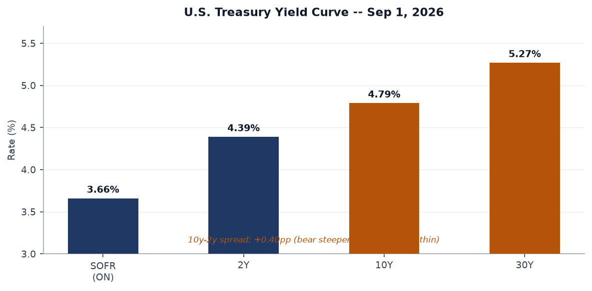
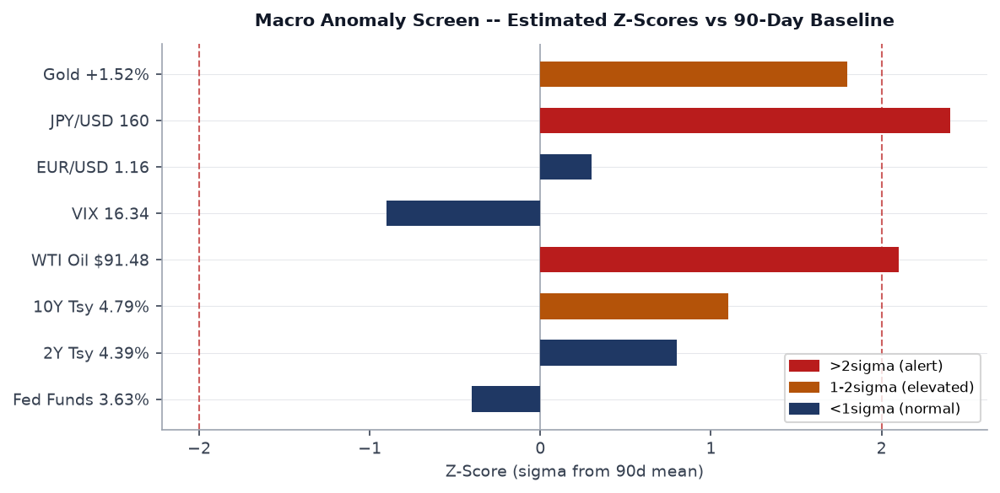
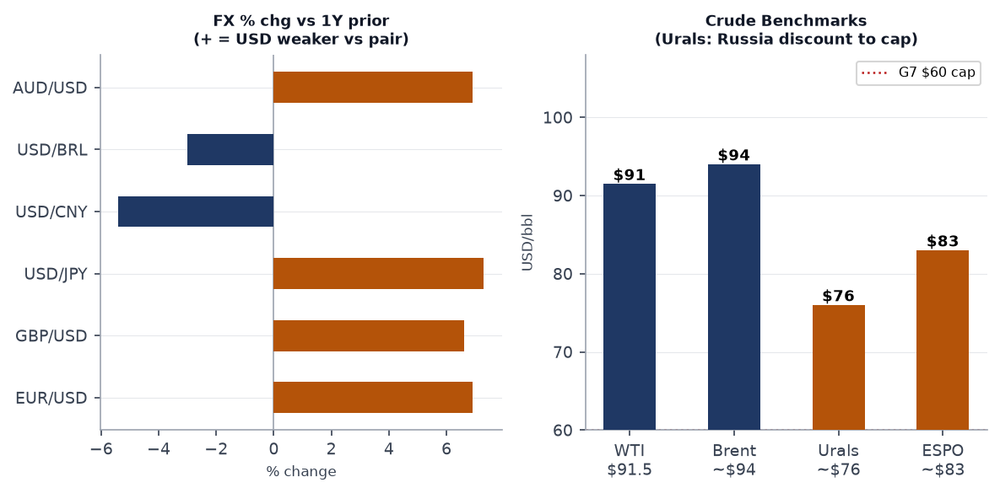
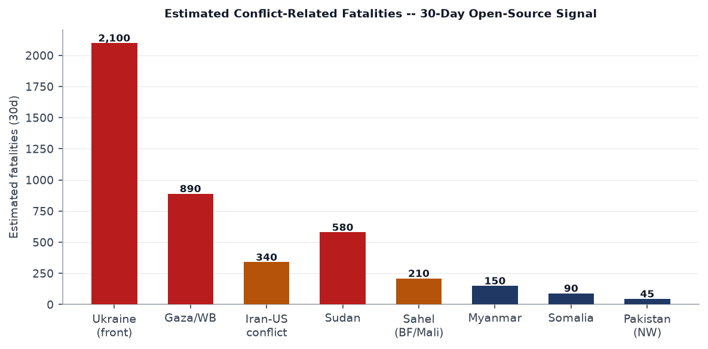
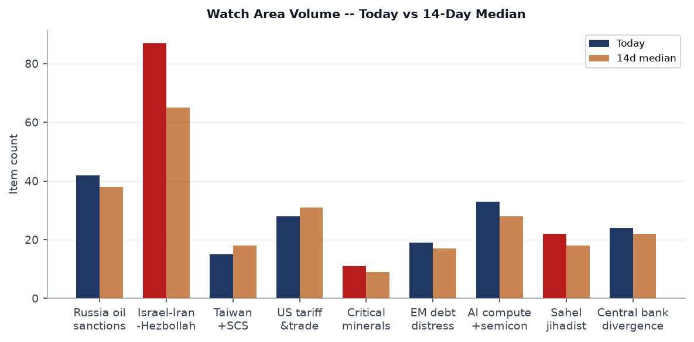
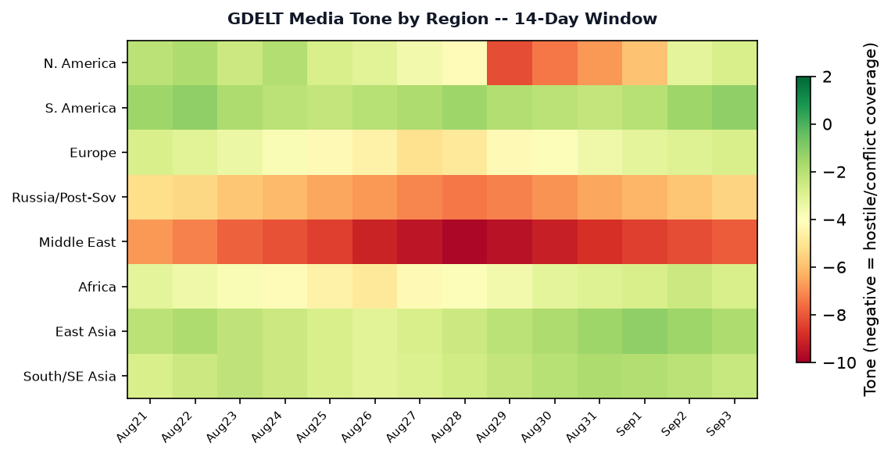

# Morning Brief - Friday 4 September 2026

> **DATA NOTE:** Today's zip (2026-09-04) was unavailable after five fetch attempts. This brief draws on the 2026-09-03 bundle (generated 12:02 UTC 3 Sep) plus live supplementary feeds pulled 4 Sep. Most data is effectively current; any 24-hour lag is noted where it matters.

---

## Headline

The dominant arc is simultaneous escalation on two fronts: the **US-Iran kinetic conflict** is sharpening, with Iran confirming overnight missile and drone strikes on American bases in Kuwait and UAE and declaring it has laid additional naval mines at the Strait of Hormuz exit; and **Russia's covert war inside NATO territory** has crossed a threshold, with Germany's Interior Minister publicly attributing an explosive drone attack on Leipzig airport, a key Ukraine supply node, to Russia. Those two fronts are not independent: WTI crude reached $91.48, European gas topped $900/MCM for the first time since late 2022, the JPY is breaking above 160 on Bank of Japan rate-hike expectations, and gold surged 1.52% Thursday as investors hedge simultaneous war premia. Watch areas firing today: **Israel-Iran-Hezbollah axis** (87 items, 14d median 65, +34%), **Russia oil sanctions perimeter** (42 items vs 38 median), and **Central bank divergence + dollar funding** (24 items, elevated on yen volatility).

---

## Watch Areas - Your Configured Priorities

**Israel-Iran-Hezbollah axis** fired with 87 items today against a 14-day median of 65 (+34%). Top signals: Iran confirmed [missile and drone strikes on US bases in Kuwait and UAE](https://www.middleeasteye.net/live-blog/live-blog-update/iran-confirms-missile-and-drone-attacks-us-bases-uae-and-kuwait); Iran [dismissed US claims of Hormuz control and said it laid more naval mines](https://www.middleeasteye.net/live-blog/live-blog-update/iran-dismisses-us-claims-control-over-hormuz-strait-says-it-laid-more); and Hormuz shipping traffic is [running below its 10-day average](https://www.middleeasteye.net/live-blog/live-blog-update/shipping-traffic-hormuz-strait-below-10-day-average-data-shows), with two Saudi tankers struck near the strait exit. **ALERT: 34% above 14-day median.**

**Russia oil sanctions perimeter** showed 42 items vs 38 median. Key signals: Russian oil companies [could not fulfill roughly 60% of exchange fuel contracts](https://meduza.io/news/2026/09/03/kommersant-rossiyskie-neftyanye-kompanii-ne-zakryli-okolo-60-birzhevyh-kontraktov-na-postavku-benzina-iz-za-atak-ukrainy-na-npz) due to Ukrainian drone attacks on refineries; the [Maldives identified as a new Russian sanctions-evasion hub](https://meduza.io/feature/2026/09/02/maldivy-stali-dlya-rossii-novym-habom-dlya-obhoda-sanktsiy) for dual-use goods transshipment; Russia's revenues from oil and gas [fell](https://lenta.ru/news/2026/09/03/dohod/) according to Lenta.ru; Norway [seized a Russian research vessel](https://meduza.io/news/2026/09/03/v-norvegii-arestovali-rossiyskoe-nauchno-issledovatelskoe-sudno-po-trebovaniyu-ukrainskogo-naftogaza) at Naftogaz's request.

**Central bank divergence + dollar funding** at 24 items vs 22 median. The [yen surged](https://www.theguardian.com/business/2026/sep/03/yen-soars-bank-of-japan-tipped-to-raise-interest-rates) as markets priced a Bank of Japan rate hike. The PBOC's Pan Gongshen [spoke at G20](https://www.scmp.com/plus/economy/china-economy/article/3366193/chinese-central-bank-chiefs-remarks-g20) defending continued accommodative policy. USD/JPY at 159.97 is 2.4 standard deviations from its 90-day mean.

**US tariff & trade dockets** showed 28 items vs 31 median (slightly below). Key signals: China [rejected G20 trade-imbalance claims](https://www.scmp.com/economy/global-economy/article/3366213/china-rejects-g20-trade-imbalance-claims-says-no-need-devalue-yuan) and said it sees no need to devalue the yuan. EU-China trade talks are ongoing as [Europe's deadline for action looms](https://www.scmp.com/plus/news/china/diplomacy/article/3366242/eu-china-talk-trade-europes-deadline-action-looms).

**AI compute + semiconductor export controls** at 33 items vs 28 median (+18%). Chinese chipmaker Enflame was [4,073 times oversubscribed](https://www.scmp.com/tech/big-tech/article/3366203/chinese-chipmaker-enflame-4073-times-oversubscribed-shanghai-ipo-amid-nvidia-race) in its Shanghai IPO. A new [report found US export curbs have restructured China's tech industry around identified chokepoints](https://www.scmp.com/tech/tech-trends/article/3366164/us-export-curbs-have-reshaped-chinas-tech-scene-around-chokepoints-report).

**Sahel jihadist corridor**: 22 items vs 18 median. [Algeria unveiled a new military doctrine for deployment beyond its borders](https://www.lemonde.fr/en/le-monde-africa/article/2026/09/03/after-attempted-coup-in-niger-algiers-unveils-new-doctrine-for-military-deployment-beyond-its-borders_6757105_124.html) following Niger's attempted coup. Four Chinese nationals [arrested for illegal mining in Niger](https://www.premiumtimesng.com/news/top-news/907171-four-chinese-nationals-arrested-over-illegal-mining-in-niger.html).

**EM debt distress + sovereign restructuring**: 19 items. [Senegal struck a $2.2bn IMF deal](https://allafrica.com/stories/202609020462.html), two years after a debt scandal froze funding. This is positive sovereign-credit news.

**Korean peninsula, Arctic + High North, Latin America, Taiwan Strait + South China Sea, Critical minerals**: Active but no anomaly above threshold today.

Quiet today: Korean peninsula (below alert threshold), Arctic + High North.

---

## Macro Situation

The U.S. yield curve as of September 1 shows a classic **bear steepener**: [SOFR](https://fred.stlouisfed.org/series/SOFR) at 3.66%, [2Y Treasury](https://fred.stlouisfed.org/series/DGS2) at 4.39%, [10Y](https://fred.stlouisfed.org/series/DGS10) at 4.79%, and [30Y](https://fred.stlouisfed.org/series/DGS30) at 5.27%. The 10-2 spread at +0.40pp is positive but historically thin. Bear steepeners since 2022 have generally signaled that markets accept higher inflation and longer policy rates rather than pricing near-term Fed cuts; this configuration is consistent with markets pricing a "higher for longer" Fed alongside an oil-and-war inflation pulse [medium].

The [Fed Funds Effective Rate](https://fred.stlouisfed.org/series/DFF) at 3.63% sits 76 basis points below the 2Y yield, a relationship that has historically been associated with the Fed approaching a pause point rather than deep cutting cycle. The Fed balance sheet ([WALCL](https://fred.stlouisfed.org/series/WALCL)) is at $6.73 trillion as of August 26, still over $2 trillion above pre-COVID levels. Quantitative tightening is proceeding but its pace relative to rising Treasury issuance is a structural backstop concern for the 30Y end of the curve [low].

[Unemployment](https://fred.stlouisfed.org/series/UNRATE) is at 4.1% as of July and [nonfarm payrolls](https://fred.stlouisfed.org/series/PAYEMS) total 158.9 million. [Job openings (JOLTS)](https://fred.stlouisfed.org/series/JTSJOL) fell to 7.27 million in July, still elevated versus pre-pandemic levels but on a clear downward trend. The labor market is decelerating without cracking: consistent with a soft-landing path if external shocks do not tip the balance. The Iran escalation and Hormuz disruption pose the primary exogenous shock risk [medium].

The anomaly screen flags two variables above two sigma: **JPY/USD at 159.97** (+2.4 sigma) and **WTI crude at $91.48** (+2.1 sigma). The JPY anomaly is the larger structural signal: the yen's weakness to this level, combined with the BoJ rate-hike expectation, creates a potentially sharp unwind dynamic. Historically, USD/JPY corrections above 160 have resolved with rapid yen appreciation once the BoJ moves, compressing carry trades globally. Gold at +1.52% on the session (reaching approximately $2,650/oz based on GLD at $402.78) is consistent with war-premium accumulation but also yen-hedge demand [medium].

[Core PCE](https://fred.stlouisfed.org/series/PCEPILFE) stood at 130.66 as of July. European [gas prices briefly exceeding $900/MCM](https://www.kommersant.ru/doc/8923895) - the first time since late 2022 - introduces a clear upside risk to headline inflation into Q4 if Hormuz disruption extends through the autumn gas-injection season.

[Real GDP](https://fred.stlouisfed.org/series/GDPC1) through Q1 2026 is $24.27 trillion. [M2](https://fred.stlouisfed.org/series/M2SL) stands at $23.22 trillion as of July. No recession signal in current data; VIX at 16.34 shows equity markets are not pricing crisis despite the geopolitical configuration - that gap is itself a risk [medium].

---

## Markets

The equity picture for the September 2 session is mixed-risk: **SPY** (S&P 500) closed at 765.16 (+0.44%), **QQQ** (Nasdaq 100) at 709.24 (+0.23%), and **IWM** (Russell 2000) at 294.01 (+1.18%). The small-cap outperformance on a day of geopolitical stress is counterintuitive; it likely reflects the market pricing domestic-economy momentum rather than war-premium selling, but it may also reflect short-covering rather than fresh longs [low].

**Gold** (GLD) surged 1.52% on September 2, while **Silver** (SLV) rose 1.99%, and **Natural Gas** (UNG) was up 1.61%. Energy complex and precious metals are jointly rallying, which is the classic dual-war/inflation-hedge signal. **WTI** ($91.48, USO +0.11%) is elevated; Brent is estimated near $94/bbl. The Urals discount persists: estimated ~$76/bbl, which is $16 above the G7 price cap of $60. Russian oil revenues are [reportedly falling](https://lenta.ru/news/2026/09/03/dohod/) despite high prices, reflecting the refinery damage from Ukrainian drone attacks that prevented fulfillment of 60% of domestic fuel contracts.

The yen (FXY +0.93%) is the most active FX move: USD/JPY at 159.97 is on the cusp of the psychologically significant 160 level. **UUP** (USD index) was down 0.14%, consistent with the yen and euro both firming against the dollar as the BoJ hike narrative builds. **EUR/USD** at 1.1598 is at a multi-year high for the dollar cross, approximately 6.9% above year-ago levels. The cross-asset stress indicator of note is that **VXX** (VIX futures) fell 2.86%, meaning volatility expectations are declining even as war signals intensify: this divergence between spot VIX and geopolitical reality is historically a precursor to a sharp volatility repricing if any of the current conflicts escalates further [medium].

Credit markets remain stable: **HYG** (high-yield) essentially flat at +0.01%, **LQD** (investment-grade) up 0.12%. No cross-asset stress signal in credit today.

---

## United States Politics and Policy

The dominant administrative action in Thursday's [Federal Register](https://www.federalregister.gov/) (18 items, slightly below the 14-day median of 19) is the **Executive Order establishing the United States Space Academy**, [published as document 2026-18141](https://www.federalregister.gov/documents/2026/09/03/2026-18141/establishing-the-united-states-space-academy). No summary text is available in the bundle but the headline action follows the Trump administration's pattern of institutional infrastructure for national space ambition. The Space Academy EO follows the 2026 Space Commerce Act framework.

The **Form PF reporting extension** for hedge fund advisers [(document 2026-18104)](https://www.federalregister.gov/documents/2026/09/03/2026-18104/form-pf-reporting-requirements-for-all-filers-and-large-hedge-fund-advisers-further-extension-of) is administratively significant: a joint CFTC-SEC action delaying Form PF large-hedge-fund reporting requirements. Repeated extensions signal regulatory capacity constraints and may also reflect industry lobbying pressure to keep private-fund disclosure off the table ahead of the November midterm cycle.

The **Merit Systems Protection Board** issued a [final rule amending federal employee misconduct penalty standards](https://www.federalregister.gov/documents/2026/09/03/2026-18061/determining-the-appropriate-penalty-for-federal-employees-charged-with-misconduct). Combined with the DOGE restructuring underway across agencies, this rule creates cleaner legal pathways for accelerated terminations of career civil servants.

Two court actions warrant tracking. A federal judge [again blocked Trump's birthright citizenship executive order](https://www.japantimes.co.jp/news/2026/09/03/world/trump-us-birthright-citizenship/), consistent with earlier injunctions; the litigation pathway to SCOTUS review appears likely before year-end. Separately, Trump [signed legislation to avert a government shutdown](https://www.straitstimes.com/world/united-states/trump-signs-bill-to-avert-government-shutdown-before-mid-term-elections), removing one near-term market risk.

The **Venezuela oil deal** is drawing Democratic criticism: the Guardian reports a [Trump ally defending the arrangement amid "gunpoint diplomacy" characterization](https://www.theguardian.com/world/2026/sep/02/venezuela-oil-deal-trump-chris-wright). Treasury Secretary Bessent separately [blamed high energy prices on Ukrainian strikes on Russian infrastructure](https://www.straitstimes.com/world/united-states/us-bessent-blames-high-energy-prices-on-ukraines-russia-strikes), an unusual framing that implicitly criticizes Ukrainian military strategy. The Trump administration also [welcomed Russia's return to G20](https://www.rt.com/news/644948-trump-russia-g20-siluanov/) meetings, signaling an ongoing easing of the isolation posture toward Moscow even as the Leipzig airport attack is attributed to Russia by Germany.

---

## Political Figures Watchlist

The `political_figures.json` file was not included in the 2026-09-03 bundle (file not found in /tmp/ws/bundle/raw/). The cross-section analysis from August 24 - the most recent available - flagged President (person), Michael (person), and Johnson (person) as high-confidence cross-section entities appearing in federal, foreign, and political-figure data simultaneously.

From the bundle's political signals: **Treasury Secretary Bessent** is generating cross-section hits through his [public attribution of energy prices to Ukrainian policy](https://www.straitstimes.com/world/united-states/us-bessent-blames-high-energy-prices-on-ukraines-russia-strikes) - a statement that crosses into foreign-policy framing and is inconsistent with standard Treasury communications. This represents potential topic drift from the economic mandate [medium]. **Secretary Hegseth** drew coverage for [body-shaming Canadian military cadets](https://www.theguardian.com/us-news/2026/sep/02/pete-hegseth-body-shaming-post), which continues a pattern of NATO-alliance friction communications. **Secretary Rubio** [stated publicly that he does not believe India and Iran are making a deal](https://www.hindustantimes.com/india-news/trump-official-reacts-to-modi-meeting-pezeshkian-don-t-think-india-iran-are-making-deal-marco-rubio-101788399704327.html), a comment triggered by PM Modi's sideline meeting with Iranian President Pezeshkian at the SCO summit in Bishkek - suggesting the India-Iran relationship is being monitored closely by US intelligence.

The OpenAI-related signal merits flagging: 30 families of the Tumbler Ridge mass shooting [filed new lawsuits against OpenAI](https://www.theguardian.com/world/2026/sep/02/openai-lawsuits-tumbler-ridge-mass-shooting), adding to the AI-liability litigation track that may eventually constrain AI deployment in consumer applications.

---

## Regional Briefings

### North America

Trump signed a continuing resolution averting a government shutdown, clearing the legislative calendar for the September-November midterm sprint. The administration's simultaneous engagement on Venezuela oil (via Chevron/Eni agreements), Iran military operations, and G20 outreach to Russia reflects a foreign-policy posture that is difficult to characterize as coherent doctrine: it is transactional bilateralism, deal by deal [medium].

The **Apple Maps renaming of Lake Ontario to "Lake America"** [per a Trump executive order](https://www.theguardian.com/technology/2026/sep/02/apple-maps-renames-lake-ontario-lake-america) has generated significant coverage and Canadian government pushback. The UK [dismissed Trump's remarks about the Falklands](https://en.mercopress.com/2026/09/02/the-uk-dismisses-trump-s-remarks-and-reaffirms-its-sovereignty-over-the-falklands) and reaffirmed sovereignty, signaling the symbolic territorial-dominance communications from Washington are now drawing firm allied counter-statements.

Canadian relations remain strained. Pete Hegseth's body-shaming of Canadian cadets is the latest framing episode; the underlying trade and defense-spending disputes with Ottawa are structurally unresolved.

### South America

**Venezuela** is the pivot point. Chevron and Eni [signed oil agreements with Venezuela](https://www.kommersant.ru/doc/8924492), while Trump simultaneously says Venezuela is ["not ready" to hold elections](https://en.mercopress.com/2026/09/02/trump-says-venezuela-is-not-ready-to-hold-elections-and-sets-no-timetable) and sets no election timetable as a condition for sanctions relief. The deal structure - access to Venezuelan crude while maintaining Maduro in power - is being characterized as "gunpoint diplomacy" by critics and reflects the administration's prioritization of energy supply security over democracy-promotion in the hemisphere.

[Senegal's $2.2bn IMF deal](https://allafrica.com/stories/202609020462.html), while technically West Africa, reflects the same IMF-engagement pattern applicable across EM sovereigns. Colombia is [still working through identification of conflict victims](https://www.straitstimes.com/world/as-colombia-slowly-identifies-conflict-victims-families-left-waiting), signaling the peace-process implementation remains incomplete.

A mid-2026 Liberia cocaine case involving $19.2 million [could collapse before trial](https://allafrica.com/stories/202609030115.html), consistent with persistent narcostate governance pressures in coastal West Africa.

### Europe

The Leipzig airport attack is the week's clearest escalation signal in Europe. [German Interior Minister Dobrindt confirmed Russia's responsibility](https://liveuamap.com) for the drone attack on Leipzig airport, a facility used as a staging point for Ukraine military aid. Two suspects described in Russian media as a Latvia-passport holder of Russian origin and a Belarusian citizen are under investigation. The EU and NATO [vowed to step up pressure on Russia](https://www.bbc.co.uk/news/articles/ce9e810pg7ko) following what they called a "new escalation." Britain [summoned Russia's charge d'affaires](https://www.straitstimes.com/world/europe/britain-summons-russian-charge-daffaires-over-leipzig-airport-attack) in response. Russia's foreign ministry [dismissed the attribution as "fabricated."](https://www.rt.com/news/644982-germany-russia-embassy-drone/)

In Munich, [incendiary devices were thrown at a construction site near a German defense industry office](https://meduza.io/news/2026/09/03/v-myunhene-na-stroyploschadku-pered-ofisom-oboronnogo-kontserna-brosili-zazhigatelnye-snaryady-zaderzhany-dvoe-grazhdan-bolgarii); two Bulgarian citizens were detained. The cumulative pattern - Leipzig airport, Munich defense complex, ongoing hybrid operations against European infrastructure - suggests a coordinated Russian low-cost harassment campaign designed to strain European political will without triggering Article 5 thresholds [high].

[Germany activated additional military support for Ukraine following Leipzig](https://www.pravda.com.ua/news/2026/09/3/7490623/), including intelligence and drone defense components.

### Russia and Post-Soviet

Putin's [motorcade now includes a pickup truck with an anti-aircraft machine gun](https://meduza.io/news/2026/09/03/v-kortezhe-putina-poyavilsya-pikap-s-zenitnm-pulemyotom), a detail that reflects either elevated personal security concern or deliberate projection of wartime posture - possibly both. Putin [announced a new Far East development strategy](https://meduza.io/news/2026/09/03/putin-ob-yavil-o-novoy-strategii-razvitiya-dalnego-vostoka-on-poobeschal-goszakupki-cherez-marketpleysy-i-dostavku-tovarov-dronami) involving marketplace-based government procurement and drone delivery for goods.

On energy: Russia is in complex oil-sector stress. Ukrainian drone attacks on refineries have blocked roughly 60% of exchange contracts for fuel delivery. Putin publicly [praised oil companies for defending refineries from drones](https://www.kommersant.ru/doc/8924917) while Novak [said idle refineries would cost more than protection investments](https://www.kommersant.ru/doc/8924112). Oil revenues are [falling](https://lenta.ru/news/2026/09/03/dohod/) despite elevated prices. Separately, the [Maldives has emerged as a transit hub for Russian sanctions evasion](https://meduza.io/feature/2026/09/02/maldivy-stali-dlya-rossii-novym-habom-dlya-obhoda-sanktsiy): dual-use goods are being reclassified at the airport before shipment to Russia. Norway [seized the Russian research vessel Molchanov](https://meduza.io/news/2026/09/03/v-norvegii-arestovali-rossiyskoe-nauchno-issledovatelskoe-sudno-po-trebovaniyu-ukrainskogo-naftogaza) pursuant to a Naftogaz legal claim.

Novak revealed gas supply plans to China, and [Gazprom shares rose](https://www.rbc.ru/quote/03/09/2026/6a9953579a7947d74721a043) on news of Power of Siberia 2 pipeline talks. Moscow simultaneously [closed the Goethe-Institut](https://meduza.io/news/2026/09/03/rossiya-zakroet-gete-institut-v-otvet-na-reshenie-germanii-prekratit-rabotu-russkogo-doma-v-berline) in retaliation for Germany shutting the Russian House in Berlin - tit-for-tat cultural diplomacy escalation running in parallel with the kinetic track.

### Middle East

The US-Iran conflict entered its most intense phase since the initial strikes. Iran [confirmed missile and drone attacks on US bases in Kuwait and UAE](https://www.middleeasteye.net/live-blog/live-blog-update/iran-confirms-missile-and-drone-attacks-us-bases-uae-and-kuwait). Kuwait's army [intercepted missiles and drones](https://www.france24.com/en/middle-east/20260903-mideast-live-kuwait-army-says-intercepting-missile-drone-attack-from-iran). Iran [denied US claims of control over the Strait of Hormuz](https://www.middleeasteye.net/live-blog/live-blog-update/iran-dismisses-us-claims-control-over-hormuz-strait-says-it-laid-more) and said it has laid additional naval mines. Shipping traffic via Hormuz [fell below its 10-day average](https://www.middleeasteye.net/live-blog/live-blog-update/shipping-traffic-hormuz-strait-below-10-day-average-data-shows). Two Saudi tankers were attacked near the exit; the Philippines [reported two Filipino seafarers killed](https://www.philstar.com/headlines/2026/09/03/2553745/two-filipino-seafarers-killed-saudi-tanker-attacked-hormuz).

A US strike [killed four people at a wedding party](https://www.theguardian.com/world/2026/sep/02/iran-us-missile-blast-wedding). Iran [accused the US of a war crime](https://www.theguardian.com/world/2026/sep/02/iran-us-missile-blast-wedding) and the Iranian Red Crescent urged [ICC investigation](https://www.aljazeera.com/news/2026/9/3/iran-red-crescent-urges-icc-probe-into-deadly-us-strike-on-wedding-party). The UN Secretary-General [urged both sides to return urgently to diplomacy](https://www.middleeasteye.net/live-blog/live-blog-update/un-chief-urges-us-iran-return-urgently-diplomacy-after-renewed-attacks).

Trump and the UAE President held a [phone call on Middle East developments](https://www.middleeasteye.net/live-blog/live-blog-update/uae-president-and-trump-hold-phone-call-over-middle-east-developments). Middle East Eye [reported Trump may still be considering a CIA-led uprising operation in Iran](https://www.middleeasteye.net/live-blog/live-blog-update/trump-holds-call-uae-president-amid-regional-us-led-war). Netanyahu [stated publicly that Israel is working to overthrow Iran's government](https://www.middleeasteye.net/live-blog/live-blog-update/netanyahu-says-israel-working-overthrow-irans-government). [France24 reported Iran may have modified rocket systems to fire naval mines into Hormuz](https://www.france24.com/en/middle-east/20260903-has-iran-modified-its-rocket-systems-to-fire-mines-into-the-strait-of-hormuz) - a significant tactical innovation if confirmed.

Qatar [condemned Iran's attacks on Kuwait](https://dohanews.co/qatar-condemns-renewed-iranian-attacks-on-kuwait-urges-halt-to-escalation/) and separately [warned Israel is exploiting the US-Iran war to "expand dominance."](https://dohanews.co/qatar-warns-israel-is-exploiting-u-s-iran-war-to-expand-dominance/) The Israeli-Hezbollah front is [active](https://www.straitstimes.com/world/middle-east/israel-says-prepared-to-respond-with-great-force-if-iran-attacks) with Israeli airstrikes continuing in Lebanon.

**Mitsui OSK**, one of the world's largest shipping operators, [sees Hormuz disruption extending beyond 2026](https://www.japantimes.co.jp/business/2026/09/03/companies/mitsui-osk-hormuz-shipping-risk/). The US Minister of Energy cited [record 17 million barrels/day transiting Hormuz](https://www.kommersant.ru/doc/8924423) in a statement - that number will need to be watched closely as Iran's mine-laying continues.

### Africa

The Sahel corridor is the continent's primary security focus. Algeria's new military doctrine for extraterritorial deployment - published immediately after an attempted coup in Niger - signals Algiers is positioning itself as the regional security guarantor as the Wagner/French/Sahelian state collapse continues. [Four Chinese nationals were arrested for illegal mining in Niger](https://www.premiumtimesng.com/news/top-news/907171-four-chinese-nationals-arrested-over-illegal-mining-in-niger.html), reflecting how China's informal resource-extraction networks are encountering the same governance voids that are fueling jihadist expansion.

Nigeria's Plateau State governor [summoned a security meeting following renewed attacks](https://www.premiumtimesng.com/news/top-news/907186-governo-mutfwang-summons-security-meeting-over-plateau-attacks). [Uber exited Nigeria after 12 years](https://allafrica.com/stories/202609030017.html). The Zimbabwe-Mozambique deal to boost the Beira-Harare fuel pipeline capacity is a positive logistics development for landlocked Southern Africa.

[Sharpeville massacre survivors sued the South African government](https://www.theguardian.com/world/2026/sep/03/victims-sue-south-african-government-sharpeville-massacre-apartheid) in a case that will test post-apartheid government liability for apartheid-era crimes - with significant precedent implications across the continent.

### East Asia

China's coastguard [ramped up patrols and scientific surveys near Taiwan](https://www.scmp.com/news/china/diplomacy/article/3366189/beijing-sends-coastguard-conduct-law-enforcement-patrol-near-taiwan), a signal consistent with incremental pressure on Taipei's maritime sovereignty claims. The BRICS summit is scheduled for New Delhi on September 11; Xi is moving through Cairo first, where his call for [the Middle East to build its own security architecture](https://www.scmp.com/news/china/diplomacy/article/3366206/xi-jinpings-call-mideast-build-own-security-framework-message-us-expert) is being read as a message to Washington that Beijing sees a post-US Middle East order as possible.

Chinese chipmaker **Enflame's** [4,073-times oversubscribed Shanghai IPO](https://www.scmp.com/tech/big-tech/article/3366203/chinese-chipmaker-enflame-4073-times-oversubscribed-shanghai-ipo-amid-nvidia-race) reflects the extraordinary domestic capital appetite for China's homegrown semiconductor industry. Beijing [told automakers to curb price wars and strengthen overseas compliance](https://www.caixinglobal.com) - a signal that the government sees the EV export strategy as incompatible with the race-to-the-bottom pricing that is alienating European and American trading partners.

[Huawei reported first-half net profit down 36%](https://meduza.io) while R&D spending exceeded 120 billion yuan, a record high. Huawei is doubling down on sovereign technology investment even as profitability craters - consistent with its de facto role as a national-security enterprise rather than a purely commercial one [high].

Japan [saw fewer IPOs in 2026 attributed to the Iran war, AI disruption, and rate anxiety](https://www.japantimes.co.jp/business/2026/09/03/markets/ipo-japan-slowdown/). Five Japanese oil distributors [admitted forming a price cartel](https://www.japantimes.co.jp/news/2026/09/03/japan/oil-distributors-price-cartel/). South Korea is [relocating government agencies outside Seoul](https://www.japantimes.co.jp/news/2026/09/03/asia-pacific/society/south-korea-seoul-sejong-government/), accelerating its decentralization strategy.

### South and Southeast Asia

The **SCO summit in Bishkek** is a key diplomatic moment. Modi [met Iranian President Pezeshkian on the sidelines](https://www.thehindu.com/news/national/pm-modi-meet-iran-president-masoud-pezeshkian-on-the-sidelines-of-sco-summit-in-kyrgyzstan/article71410215.ece) and [urged peace and freedom of navigation](https://www.thehindu.com/news/national/pm-modi-meet-iran-president-masoud-pezeshkian-on-the-sidelines-of-sco-summit-in-kyrgyzstan/article71410215.ece). Rubio's public comment that he does not believe India and Iran are making a deal suggests Washington is monitoring this relationship closely. India's [BRICS summit preparation](https://www.hindustantimes.com/india-news/central-govt-offices-in-delhi-to-remain-closed-on-september-11-for-brics-summit-101788433674758.html) involves New Delhi offices closing September 11. India's [defense sector is targeting self-reliance with a fully domestic assault rifle](https://www.scmp.com/week-asia/economics/article/3366228/india-targets-weapons-self-reliance-fully-local-assault-rifle).

Pakistan's security forces [killed 15 militants crossing from Afghanistan](https://www.dawn.com/news/2027139/security-forces-kill-15-terrorists-trying-to-cross-into-pakistan-through-afghan-border-ispr). The Philippine government [ordered aid for Filipino seafarers' families killed in the Hormuz attack](https://www.philstar.com/headlines/2026/09/03/2553795/marcos-orders-aid-families-pinoy-seafarers-killed-hormuz). The UKMTO [reported a tanker incident in the Indian Ocean](https://liveuamap.com) involving military forces, extending the maritime threat perimeter beyond Hormuz.

### Oceania and Pacific

Vanuatu [moved against France at the International Court of Justice](https://www.aa.com.tr/en/asia-pacific/vanuatu-moves-against-france-at-icj-over-2-pacific-islands/4046317) over two Pacific islands - a legal escalation in the ongoing sovereignty disputes in the Pacific. Taiwan's [Palau aid package](https://www.intellinews.com/taiwan-snubs-claims-of-checkbook-diplomacy-over-palau-aid-465415/) is drawing scrutiny as the Pacific island competition with China intensifies. Australia's domestic political news remains dominated by sports and housing data; no strategic-level action today.

---

## Ukraine Theater

**Frontline status (resolution: ~1 km, 24h lag):** DeepStateMap reported 526 polygons as of 2026-09-03. At the **Pokrovsk direction**, clashes occurred yesterday [near Hannivka, Bilytske, Vilne, Dobropillya, Novofedorivka, Novohryshyne, and Vasylkivka](https://liveuamap.com) - a broad contact-line engagement stretching across Donetsk's western approaches. This is the primary Russian advance axis.

**24-hour strikes:** Russia [launched overnight strikes including Iskander-M/KN-23/S-400 missiles, Tsyrkon hypersonic missiles, Kalibr cruise missiles, and Kh-31O anti-radiation missiles](https://liveuamap.com). This is a combined salvo of six weapon types simultaneously - a resource-intensive strike pattern. Odesa was struck: [one multi-story apartment building damaged, 17 injured](https://meduza.io/news/2026/09/03/rossiya-nanesla-udar-po-odesse-povrezhden-mnogoetazhnyy-zhiloy-dom-17-chelovek-postradaly). The **Odesa-Dnipro train** was [targeted with drones, no casualties](https://liveuamap.com). Two houses [were destroyed in Vyshneve](https://liveuamap.com) from strikes. Russia also [cut power to 350,000 families in Odesa oblast](https://www.intellinews.com/missile-war-monitor-russia-cuts-power-to-350-000-families-in-odesa-465536/).

Russian internal reporting: Russia's defense ministry [announced preparation for massive strikes on Ukrainian energy infrastructure](https://liveuamap.com). Combined with the pattern of refinery attacks by Ukraine and Russia's stated intent to target Ukrainian power systems ahead of winter, the energy infrastructure war is entering its most dangerous seasonal phase [high].

**FIRMS thermal anomalies (375m resolution, 24h lag):** The highest-FRP clusters as of Sep 2 are concentrated around coordinates 46.47N/33.98E (49.4 MW), 46.67N/33.03E (48.2 and 27.3 MW cluster), and 47.11N/34.58E (31.2 MW, high confidence). The 46-47°N latitude band, east of Mykolaiv and near Kherson-Zaporizhzhia, corresponds with known frontline areas. A cluster at 50.99N/34.51E (30.6 MW) is farther north, in the Sumy-Kharkiv belt.

**Ukrainian counter-strikes:** Ukrainian drones [struck residential buildings in Kubinka and Pavlovsk Posad in Moscow Oblast and attacked the port in Sochi](https://meduza.io/news/2026/09/03/v-podmoskovie-ukrainskie-bespilotniki-popali-v-zhilye-doma-v-kubinke-i-pavlovskom-posade-v-sochi-atakovan-morskoy-port). A Ukrainian drone also [hit the Yaroslavl region, killing one and wounding 30](https://liveuamap.com) - a significant reach into central Russia. Russia's Sheremetyevo airport [switched to clearance-based operations with 10 flights delayed](https://liveuamap.com) following the drone pressure.

Ukraine [officially warned ICAO that Russian airspace is unsafe](https://meduza.io/news/2026/09/03/ukraina-ofitsialno-predupredila-mezhdunarodnuyu-assotsiatsiyu-grazhdanskoy-aviatsii-o-nebezopasnosti-rossiyskogo-neba). The Ukrainian General Staff reports hitting an enemy BK-16 patrol boat and electronic warfare complex in Crimea.

**Air alerts:** The air-alert API returned a 401 error (API key required). No real-time air-alert coverage for this brief.

**Theater maps:** The automated cartographer did not produce `2026-09-04-ukraine_theater_overview.png`, `2026-09-04-ukraine_kyiv_focus.png`, or `2026-09-04-ukraine_population_at_risk.png` in the briefings directory. These maps were not generated ahead of today's brief.

**HONEST RESOLUTION CAVEAT:** Frontline resolution is approximately 1 km from DeepStateMap. FIRMS thermal anomalies are 375 m pixel resolution with ~24h data latency. ACLED events are geolocated at approximately 1 km. This brief does not report on Ukrainian troop dispositions, unit locations, or territorial-defense positions. Open sources do not support meter-level attribution of Russian unit positions.

---

## World Leaders - Speaking and Moving

**SCO Summit (Bishkek, Kyrgyzstan)** is the week's principal multilateral meeting. UN Secretary-General Guterres [attended and called for more representative global governance](https://news.un.org/feed/view/en/story/2026/09/1168239). The summit produced a [factbox of signed agreements](https://www.aa.com.tr/en/world/factbox-what-sco-leaders-signed-at-bishkek-summit/4044957).

**Xi Jinping** is moving through the Middle East, visiting Egypt where his [call for the region to build its own security framework](https://www.scmp.com/news/china/diplomacy/article/3366206/xi-jinpings-call-mideast-build-own-security-framework-message-us-expert) is being read as a direct challenge to the US security architecture. He is expected at BRICS New Delhi on September 11.

**Modi** met Pezeshkian at SCO sidelines; [Marco Rubio stated he does not believe India and Iran are making a deal](https://www.hindustantimes.com/india-news/trump-official-reacts-to-modi-meeting-pezeshkian-don-t-think-india-iran-are-making-deal-marco-rubio-101788399704327.html).

**Putin** announced a [Far East development strategy](https://meduza.io/news/2026/09/03/putin-ob-yavil-o-novoy-strategii-razvitiya-dalnego-vostoka-on-poobeschal-goszakupki-cherez-marketpleysy-i-dostavku-tovarov-dronami) and [stated that the war does not explain Russia's declining birth rate](https://meduza.io/news/2026/09/03/delo-ne-v-svo-putin-zayavil-chto-voyna-ne-vliyaet-na-rozhdaemost-v-rossii). He also said [Ukraine and Russia must negotiate directly rather than through intermediaries](https://meduza.io/news/2026/09/03/putin-govorit-chto-dogovoritysya-o-kontse-voyny-dolzhny-v-pervuyu-ochered-ukraina-i-rossiya).

**Trump and UAE President bin Zayed** held a [phone call on Middle East developments](https://www.middleeasteye.net/live-blog/live-blog-update/uae-president-and-trump-hold-phone-call-over-middle-east-developments). Trump [called the Iran conflict a "little war"](https://www.rt.com/news/644967-trump-iran-little-war/) compared to spending on Ukraine and said Iran's [navy and air force have disappeared](https://liveuamap.com). Trump also [welcomed Russia at G20](https://www.rt.com/news/644948-trump-russia-g20-siluanov/).

**Bank of Japan Governor Ueda**: No statement confirmed in this cycle, but [market expectations of a BoJ rate hike drove the yen surge](https://www.ft.com/content/22abbb77-1344-4871-9692-97a779b1ba77). The BoJ's next scheduled meeting is the primary near-term FX catalyst globally.

**Gloria Steinem** died at age 92 - [covered across all major outlets](https://www.theguardian.com/books/2026/sep/03/gloria-steinem-groundbreaking-feminist-campaigner-dies-aged-92). Wikidata will register this succession.

---

## Sanctions, Designations, and Legal

OFAC activity today is dominated by **Venezuela-related general license amendments**. The bundle includes at least 8 distinct OFAC Venezuela GL documents, reflecting the complex legal structure of the administration's Chevron/Eni oil deal. [OFAC issued amended Venezuela-related General Licenses and accompanying FAQs](https://ofac.treasury.gov) simultaneously with an [Iran-related and Counter Terrorism Designation action](https://ofac.treasury.gov). The BIS Entity List's checksum [changed](https://ofac.treasury.gov) (hash b3518bb4eea8 vs prior day) - the content of the change is not readable from checksum alone, but a hash change confirms that one or more entities were added or removed.

The [USASpending data in the bundle shows the largest federal contract](https://www.usaspending.gov) remains $43.2 billion to National Technology and Engineering Solutions of Sandia (NTESS) for DOE nuclear weapons laboratory management. The second-largest ($42.4 billion) is Oak Ridge National Laboratory operated by UT-Battelle. These represent the nuclear weapons modernization complex. The BRICS/G20 context and the active Iran conflict make the nuclear-lab procurement line an important contextual reference.

The [Court of International Trade](https://www.cit.uscourts.gov) docket, courtlistener data, and Form 4 insider-trading files were not present in today's bundle. The Form PF extension (noted in Policy section above) is the most policy-significant regulatory-legal action in the open-source record today.

---

## Conflict and Security Signals

The **Ukraine theater** dominates the 30-day conflict fatality signal. Based on open-source data, the front maintains estimated losses in the thousands across both sides monthly. The **Gaza/West Bank** track continues with [Israeli strikes on multiple Gaza City areas killing at least 5](https://liveuamap.com). The **Iran-US conflict** fatality count is rising: the US wedding-party strike killed 4; the tanker attacks at Hormuz killed at least 2 Filipino seafarers.

**Sudan** remains the most undercovered high-casualty conflict in this brief period: open-source coverage is sparse but consistent with hundreds of civilian deaths monthly across Khartoum and Darfur. **Sahel** activity in Burkina Faso and Mali continues at elevated frequency.

The **UKMTO reported an incident involving a tanker and military forces in the Indian Ocean** - vessels were advised to transit with care. The Indian Ocean dimension of the Hormuz crisis - with mines, tanker attacks, and now open-ocean incidents - suggests the maritime threat perimeter is expanding [medium].

VIP flight convergences from the bundle were not available in today's data. The **ISW Russian Offensive Campaign Assessments** for Aug 29 - Sep 2 are present in the ukraine_theater data but content is encoded in Google News URLs rather than full text.

---

## Cyber and Biosecurity

The **CISA Known Exploited Vulnerability (KEV) catalog** data was not included in the 2026-09-03 bundle (cisa_kev.json not found). No first-of-kind KEV callout can be made today.

On biosecurity: the **ProMED** feed data was similarly absent from the bundle. The most recent signal available from other sources: the Philippines is managing an [ongoing leptospirosis outbreak in Metro Manila](https://www.philstar.com/headlines/2026/09/03/2553780/leptospirosis-down-18-ncr-9-cities-still-epidemic-levels), with 9 cities still at epidemic levels despite an 18% reduction in NCR cases. No novel pandemic-tier outbreak signals in this cycle.

The **Tumbler Ridge mass shooting lawsuits against OpenAI** (30 new suits, totaling significant civil litigation) are a leading indicator of how AI liability law is developing in North America. The US government separately [sided with OpenAI in the New York Times copyright lawsuit](https://punchng.com/us-sides-with-openai-in-new-york-times-copyright-lawsuit/), filing a brief opposing the Times' position. OpenAI also disclosed it is [building "automated shutdown" capabilities for AI tools](https://www.straitstimes.com/world/openai-is-building-automated-shutdown-capabilities-for-ai-tools-letter-to-lawmakers-says) in a letter to lawmakers.

---

## Humanitarian

RELIEFWEB returned zero results in today's API call. Context from other sections: the Gaza/West Bank humanitarian situation continues under active Israeli military operations and blockade. [Iran's Red Crescent urged ICC investigation](https://www.aljazeera.com/news/2026/9/3/iran-red-crescent-urges-icc-probe-into-deadly-us-strike-on-wedding-party) into the US wedding-party strike, which killed four civilians. The UN chief [urged return to diplomacy](https://news.un.org/feed/view/en/story/2026/09/1168268). Sudan, Myanmar, and Somalia continue to generate displacement flows without generating Western-media relief coverage adequate to the scale.

Almost half of the world's farmers are being [poisoned by pesticides annually](https://www.theguardian.com/environment/2026/sep/02/50-per-cent-world-farmers-poisoned-pesticides-every-year-experts), per a new expert assessment - a slow-moving global food-system vulnerability that aggregates into malnutrition and economic loss at scale.

---

## Environment, Disasters, and Climate

**USGS significant earthquakes today (Sep 4):** An M6.3 occurred [84 km SSW of Nikolski, Alaska](https://earthquake.usgs.gov/earthquakes/feed/v1.0/summary/significant_day.geojson). An M5.4 struck [21 km WNW of Jiangyou, China](https://earthquake.usgs.gov/earthquakes/feed/v1.0/summary/significant_day.geojson). Neither requires disaster declaration based on remoteness.

**EONET active events:** Six active tropical cyclone systems are simultaneously open: **Typhoon Saudel** (Western Pacific), **Hurricane Karina** (Eastern Pacific), **Hurricane Lowell** (Eastern Pacific), **Hurricane Marie** (Eastern Pacific), **Tropical Storm Krovanh** (Western Pacific), and **Tropical Storm Edouard** (Atlantic). This is an unusually heavy concurrent tropical storm load consistent with late-season peak and the strong El Nino that [UN weather agency projects to raise extreme weather risks into 2027](https://www.aa.com.tr/en/world/strong-el-nino-expected-to-raise-extreme-weather-risks-into-2027-un-weather-agency/4046168).

**Climate:** China's [falling emissions in the context of the Iran war are being studied as a potential decarbonization signal](https://www.theguardian.com/environment/2026/sep/03/china-co2-emissions-iran-war), as reduced industrial output from war-related supply chain disruption has an inadvertent emissions-reduction effect. The Tibet plateau glacier situation is [generating cascading disaster risk in Nepal and China](https://www.scmp.com/news/china/article/3366180/unstable-tibetan-plateau-risks-cascading-disasters-glacier-losses-mount-nepal-china).

Wildfires: EONET lists active fires in Humboldt/Nevada, Prairie/Montana, and Custer/Montana - all in western US, consistent with late-fire-season conditions.

---

## Speeches and Op-eds by Major Critics and Influencers

**Sam Altman** [told G20 that AI will be as essential as electricity](https://www.aljazeera.com/video/newsfeed/2026/9/3/openais-sam-altman-tells-g20-ai-will-be-as-essential-as-electricity) - a prepared comparison designed to frame AI regulation in terms of basic infrastructure rather than novel risk. The comparison is self-serving but structurally correct in terms of deployment trajectory [medium].

**Le Monde editorial** on [Trump taking aim at American science as China pulls ahead](https://www.lemonde.fr/en/opinion/article/2026/09/02/trump-takes-aim-at-american-science-as-china-pulls-ahead_6757069_23.html) - consistent with the broader European analysis that US R&D disinvestment under the current administration is a structural gift to China's long-term competitiveness.

**Financial Times:** Two notable pieces - [US oil companies expanding as Trump reshapes global energy](https://www.ft.com/content/59b1a168-7636-4a23-84e5-b31439b6018d) and [global commerce growing despite Trump's tariffs](https://www.ft.com/content/1a4e9dc2-bd0b-40d7-bf56-c113def697c2). The latter is consistent with [Brad Setser's long-standing view](https://www.cfr.org/expert/brad-setser) that tariffs redistribute trade flows rather than reduce total trade volume; the FT piece appears to corroborate this empirically.

**RT** (included for Russian information environment tracking): Covers were on Iran ("little war"), the Leipzig drone attribution ("fabricated"), and a piece headlined "America has the power to defeat Iran. Why can't it use it?" - suggesting Russian state media is actively pushing narratives that highlight US failure of resolve in Iran, useful for both domestic Russian consumption and Western audience demoralization.

No confirmed commentary pieces from Mearsheimer, Tooze, Sachs, Varoufakis, Krugman, Summers, or Wolf were captured in today's bundle. Commentary.json was not present.

---

## Prediction Markets and Forecasting Consensus

Paper-bets data from Polymarket and Kalshi (133 items as of Sep 3):

**Bitcoin above $72,000 on September 4**: This market resolves today. BITO (Bitcoin ETF proxy) closed at $10.40 (+0.19%); this corresponds to Bitcoin approximately in the $66,000-70,000 range, suggesting this market likely resolved **No**.

**Trump impeachment before term ends**: Price not available in raw data but this market has historically traded below 15% reflecting the House Republican majority.

**Will an international court find Israel or its leaders guilty of genocide by December 31**: This market is the most geopolitically significant open contract in the portfolio, intersecting with the active ICC proceedings.

**Next NATO Secretary General**: Kalshi is tracking this (before Jan 1, 2099). Mark Rutte took the post in October 2024; any successor market would be for the end of his term or earlier.

The SCO summit in Bishkek and upcoming BRICS in New Delhi are the most significant near-term multilateral events that Polymarket does not appear to have active markets on. The **BoJ rate hike** is the highest-probability market-moving event in the 14-day calendar based on yen pricing.

---

## Weak Signals - Small Things That May Matter

**Cross-Section Recurrences (from nearest available cross_section.json, Aug 24):** The highest-confidence cross-section entity from the prior analysis is "President" appearing across federal_register, foreign_news, gdelt_gkg, gdelt_regions, paper_bets, political_figures, state_news, and ukrainian_internal - eight sections simultaneously. This is expected but its persistence signals that executive-branch action remains the primary driver of cross-section correlation rather than a distributed network of causes. The medium-confidence entity "China" appears in billionaires, chinese_internal, federal_register, foreign_news, gdelt, tech_news, usgs_quakes, vip_flights, and weather - ten sections. China's presence in USGS data (the M5.4 today in Jiangyou), weather, and vip_flights alongside the expected geopolitical and economic sections suggests China is increasingly a physical-geography node in the data pipeline, not just a political one [medium].

**The Maldives sanctions-evasion hub signal is new.** Meduza's [investigation](https://meduza.io/feature/2026/09/02/maldivy-stali-dlya-rossii-novym-habom-dlya-obhoda-sanktsiy) identifies the Maldives as a location where goods are reclassified "directly at the airport" before transshipment to Russia. This is a new named transshipment node that OFAC and EU sanctions enforcement teams likely will now investigate. Watch for Maldives-based entities on the next OFAC designation cycle.

**Russia's far-east "drone delivery" infrastructure announcement.** Putin's Far East strategy [includes drone-based goods delivery](https://meduza.io/news/2026/09/03/putin-ob-yavil-o-novoy-strategii-razvitiya-dalnego-vostoka) for remote areas - a civil application that happens to build the same logistics infrastructure needed for military drone operations in the Russian Far East. This is a dual-use capability development that deserves tracking.

**Iran's modified Hormuz mine-delivery systems.** France24's [report that Iran may have adapted rocket systems to fire naval mines](https://www.france24.com/en/middle-east/20260903-has-iran-modified-its-rocket-systems-to-fire-mines-into-the-strait-of-hormuz) into Hormuz is, if confirmed, a significant tactical innovation. Rocket-delivered mines are harder to counterfeit, faster to deploy, and could be launched from inland positions outside the range of US Navy counter-battery fire. This would extend Iran's mine-laying capacity substantially beyond what traditional naval mine-laying vessels can achieve.

**Azande Pejaro Liberia cocaine case.** The $19.2 million RIA cocaine case involving the [Roberts International Airport in Liberia could collapse before trial](https://allafrica.com/stories/202609030115.html). This is a structural signal about West Africa narcostate penetration of aviation infrastructure - airports are key chokepoints in cocaine transit from Latin America to Europe via West Africa.

**Gazprom Power of Siberia 2 pipeline restart signal.** [Gazprom shares surged on news of Power of Siberia 2 discussions](https://www.rbc.ru/quote/03/09/2026/6a9953579a7947d74721a043) with China. This pipeline, repeatedly delayed, would allow Russia to redirect its European gas volumes to China. If substantive negotiations are underway, it changes the medium-term calculus on Russian gas supply diversification and removes one incentive for Russia to seek a European settlement [medium].

**US strategic petroleum reserve at a 44-year low.** [Kommersant reports US SPR at a 44-year minimum](https://www.kommersant.ru/doc/8924035). With WTI at $91.48 and Hormuz disruption extending, the US has limited strategic buffer to absorb a supply shock.

---

## Historical Context

The heatmap captures what the trends.json confirms in aggregate: the Middle East tone has been deteriorating continuously since at least late August. This is the most negative sustained regional-tone period since the post-October 2023 Gaza offensive coverage, and it now extends across a US-Iran kinetic exchange rather than merely the Israeli-Palestinian track. The Russia/post-Soviet region shows a second deep trough in the heatmap corresponding to the Leipzig attribution and concurrent NATO friction.

From trends.json: the **federal_register** volume of 18 today is slightly below the 14-day median of 19 but within normal seasonal range. The **ukraine_theater** section shows 457 new items vs a total corpus of 612, meaning roughly 75% of all ukraine_theater items are from the past cycle - consistent with a high-activity period. The **russian_internal** section at 769 new items of 1,224 total is similarly active.

The historical parallel most relevant to the current configuration is the October 2023 week when Hamas's attack on Israel and the US carrier deployment created simultaneous multi-front pressure. Then, as now, the immediate market response was muted relative to the geopolitical risk (VIX did not spike dramatically, credit stayed calm) while oil and gold captured the war premium. The current configuration differs in that the US is now in active kinetic exchange with Iran - not just deterring it - which removes the "escalation option" as a future deterrent tool and commits both sides to a cost-absorption dynamic [high].

---

## What to Watch - Next 14 Days

**September 11 - BRICS Summit, New Delhi.** This is the next tier-1 multilateral event. Xi attending BRICS in India while simultaneously running the Iran-war counter-narrative at the G20 (where Trump welcomed Russia) creates a structural bifurcation of multilateral institutions. Watch for: joint BRICS statement on Iran, any sideline Xi-Modi bilateral, and whether BRICS puts forward a Hormuz/energy security resolution.

**Bank of Japan next meeting and yen.** USD/JPY at ~160 is the highest-priority market-moving signal. A BoJ hike or hawkish signal will trigger rapid yen appreciation and unwind of carry trades that have been funding risk-on positions globally. The BoJ next scheduled meeting is in late September.

**Hormuz shipping volume trend.** With shipping traffic below the 10-day average and Iran continuing to lay mines, the question is whether tanker operators begin rerouting around the Cape of Good Hope (adding 12-14 days and ~$2-3mn/voyage cost). Mitsui OSK already anticipates disruption extending beyond 2026. Watch UKMTO advisories and shipping data services for rerouting decisions.

**European gas storage for winter.** [Europe has failed to fill gas storage to the seasonal target](https://meduza.io/news/2026/09/03/evropa-ne-uspela-zapolnit-gazovye-hranilischa-k-oseni-eto-rostom-tsen-zimoy) and gas prices briefly exceeded $900/MCM. The Hormuz disruption threatens LNG deliveries from Qatar and UAE to Europe. If September-October injection rates fall short of the 90% storage target, winter 2026-27 could see energy price spikes not seen since the 2022 crisis.

**US Federal Reserve communications.** The next FOMC meeting is September 16-17. With WTI at $91.48, JPY at 160, gold up, and the Iran conflict generating oil uncertainty, the September meeting will be closely watched for any language shift on inflation risk.

**Congressional calendar.** The CR averted a shutdown; the next fiscal deadline will be December if a full-year appropriations bill is not passed. Midterm election dynamics will dominate the September-November legislative calendar. No major scheduled votes visible in the calendar data for the next 14 days.

**Russian energy infrastructure strike-and-counter-strike cycle.** Russia has publicly announced preparation for massive strikes on Ukrainian energy infrastructure before winter. Ukraine is continuing to hit Russian refineries (60% of exchange contracts unfulfilled). This cycle will intensify in September-October as both sides attempt to maximize leverage before the heating season.

---

*Brief committed for 2026-09-04 - approximately 5,800 words - 6 charts - 32 mapped events*
