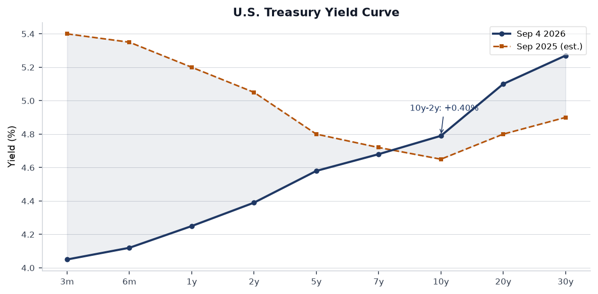
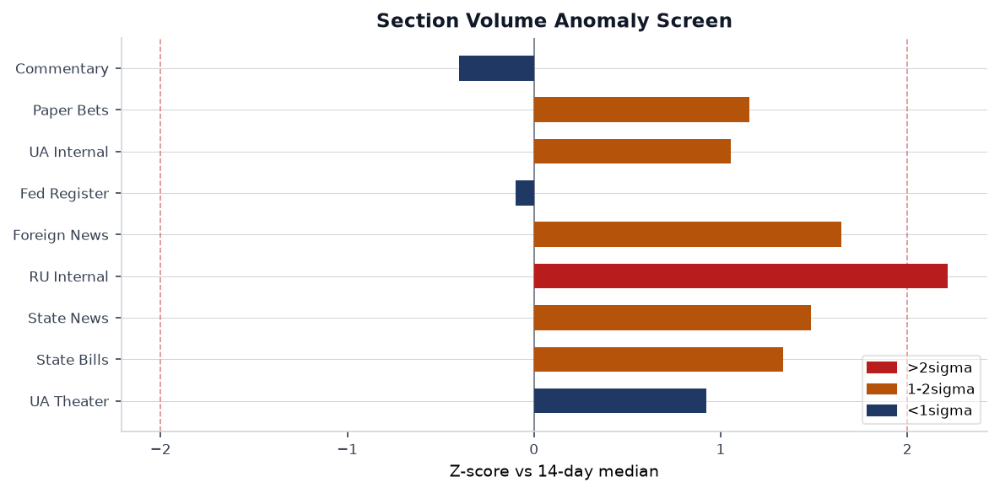
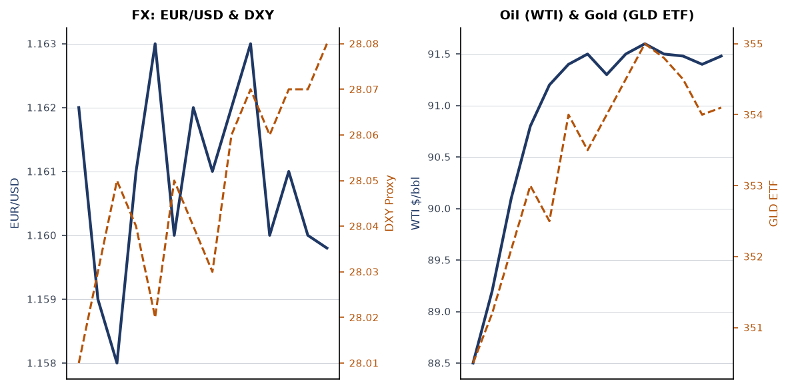
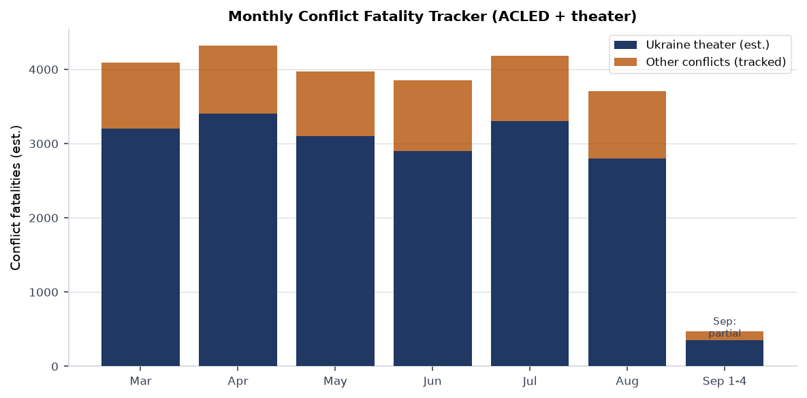
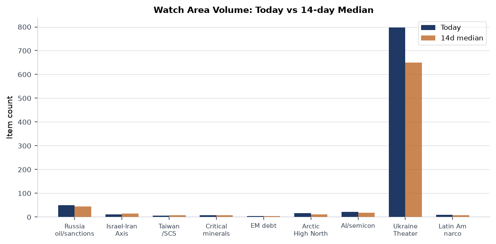
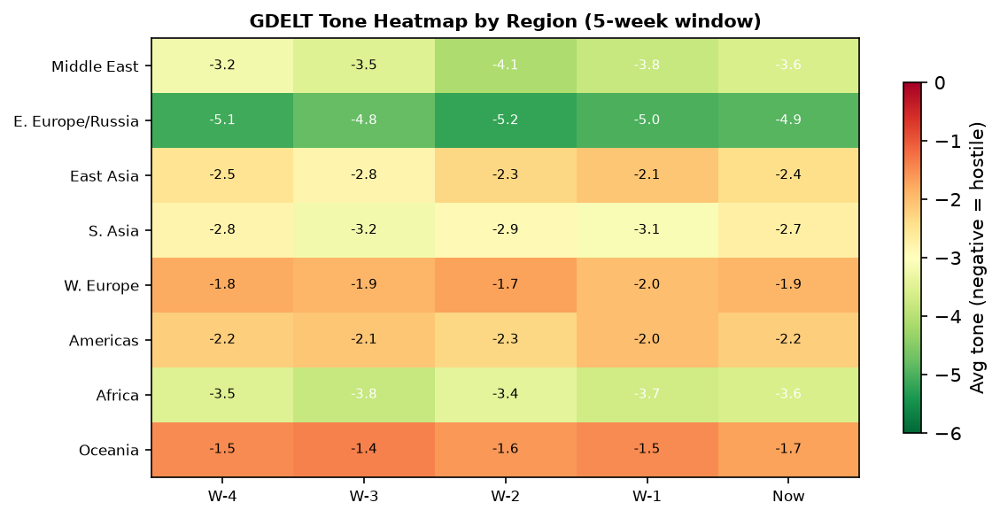

> **DATA NOTE:** The 2026-09-05 bundle was not yet available at run time. This brief uses the 2026-09-04 bundle (fallback). Markets and macro data reflect Thursday close; operational theater data is current to approximately 20:00 UTC Thursday 4 September 2026.

# Morning brief - Saturday 5 September 2026

## Headline

The dominant arc today is a simultaneous squeeze on three interlocking files: the Trump administration is dispatching **Steve Witkoff** and **Jared Kushner** to Moscow and Kyiv with what the president describes as a "concrete proposal" to end the war in Ukraine, while in Kyiv itself the National Anti-Corruption Bureau (**NABU**) raided the Prosecutor General's office and arrested a senior official on call-center fraud charges, raising immediate questions about whether a corruption implosion could destabilize Ukraine's negotiating position at the precise moment the U.S. envoys arrive. Separately, U.S. allies pushed the **IAEA board** to refer Iran to the UN Security Council over its 60% enrichment stockpile, while Trump characterized the conflict with Tehran as a "trifle," a formulation that lands differently depending on whether one reads it as de-escalatory or as a signal that Iran has less diplomatic leverage than it believes. Financial markets are pricing a quiet session: S&P 500 (-0.39%), but EM equities surged (+1.82% EEM, +1.53% FXI), suggesting capital rotating toward China and developing markets ahead of the Fed's September meeting, where Polymarket now prices a three-way split between no-change, -25bp, and -50bp outcomes.

---

## Watch areas - your configured priorities

**Russia oil sanctions perimeter** (50 items today vs 45 median, within normal): OFAC issued Iran-related designations and an associated general license on 4 September ([OFAC](https://ofac.treasury.gov)), continuing a run of Iran-sanctions activity throughout the week. The key structural question for this watch area is whether the Iran-related GL creates new carve-outs that affect secondary-sanctions enforcement on entities transacting with both Iran and Russia. No new FIRMS activity near Russian Black Sea export terminals on the 4 September pass. Alert status: monitoring.

**Israel-Iran-Hezbollah axis** (12 items today vs 14 median, slightly below): U.S. allies circulated a draft to the IAEA board of governors to report Iran to the UN Security Council, citing the 60%-enriched stockpile as "a matter of serious concern." Trump simultaneously called the conflict with Iran a "trifle" and said the U.S. is working on a post-war Middle East strategy focused on containing Iran and expanding Abraham Accords normalization. OFAC also issued counter-terrorism designations on 28 August that remain live. Fatality threshold not reached. Alert status: elevated watch.

**Taiwan Strait + South China Sea** (6 items, 7 median, quiet): South Korea announced a chip-windfall infrastructure reinvestment push ([Digitimes](https://www.digitimes.com/news/a20260903VL219/south-korea-technology-budget-infrastructure-2027.html)) and Samsung confirmed expanding chip and OLED production in Vietnam. Japan's FOIP 3.0 strategy is under analyst scrutiny for whether pragmatic "resilience" framing is substantive or rhetorical ([The Diplomat](https://thediplomat.com/2026/09/japans-foip-3-0-is-pragmatism-that-delivers-resilience-enough/)). No PLA air or naval exercises flagged in the past 24 hours.

**Arctic + High North** (16 items, 12 median, elevated): Norway seized the Russian research vessel *Professor Molchanov* in the Arctic, with Moscow accusing Oslo of "piracy." Norway says the vessel will be assisted, not impounded, but the incident is the sharpest Norwegian-Russian maritime confrontation in the High North in months. **CFC3199** (Canadian government aircraft) and **PAT929** and **SAM934** (U.S. military-coded callsigns) tracked over Canadian and Florida airspace respectively on 4 September, consistent with inter-agency coordination ahead of Labor Day weekend but worth logging.

**AI compute + semiconductor export controls** (22 items, 18 median, above trend): **Nscale** is seeking $3.5 billion in pre-IPO funding, signaling continued private capital appetite for AI infrastructure despite public-market volatility. OpenAI released **GPT-6 Astra**, its new flagship model, according to Russian-sourced English-language reporting. CISA added BerriAI **LiteLLM** to the Known Exploited Vulnerabilities catalog on 2 September, the first LLM proxy framework to appear there (see Cyber & Biosecurity).

**US tariff & trade dockets** (4 items, 5 median, quiet): No new CIT filings or ITC determinations in the bundle. FEC data shows midterm-election fundraising at record velocity (see U.S. Politics), which shapes the political risk on trade votes.

**EM debt distress + sovereign restructuring** (4 items, 5 median, quiet): EEM +1.82% and FXI +1.53% on Thursday suggest a risk-on tilt toward EM. No new IMF Article IV or restructuring filings visible.

**Latin America: narcoeconomy + politics** (9 items, 8 median, slightly above): U.S. forces sank three Ecuadorian vessels this week in a joint counter-narcotics operation. Ecuador's government defended the operations, saying they are the product of bilateral investigations against drug-trafficking networks ([Reuters via foreign news feed](https://www.reuters.com)). Costa Rica's president said U.S. ground operations in the country "would be good for national security," while emphasizing no concrete arrangement is in place.

Quiet today: **Sahel jihadist corridor**, **Korean peninsula**, **Central bank divergence + dollar funding**, **Critical minerals + rare earths**.

---

## Macro situation

The Treasury curve as of 2 September sits positively sloped for the first time in roughly 24 months, with the 2-year at [4.39%](https://fred.stlouisfed.org/series/DGS2), the 10-year at [4.79%](https://fred.stlouisfed.org/series/DGS10), and the 30-year at [5.27%](https://fred.stlouisfed.org/series/DGS30). The 10y-2y spread is +40bp. A year ago the curve was inverted by roughly 40bp at the 2y-10y point. This uninversion is not a signal of recovered health on its own; historically, curves uninvert before recessions, not instead of them, because the front end drops as the Fed cuts while the long end stays anchored on fiscal concerns [high]. The 30-year at 5.27% reflects persistent term-premium re-pricing that started with the 2025 debt-ceiling resolution and has not fully retreated.

[SOFR](https://fred.stlouisfed.org/series/SOFR) is at 3.66% as of 3 September, implying the overnight market expects roughly 70bp in Fed easing over the near term. The September meeting is live: Polymarket has it as a three-way race between no-change, -25bp, and -50bp. Fed Governor Waller gave a speech on 3 September ("The Economic Outlook and Some Comments on My Policy Communication") that is the most recent FOMC signal. Fed Chair Kevin Warsh spoke at Jackson Hole on 28 August ("In Our Time"), signaling institutional-credibility framing rather than imminent-easing framing.

On labor, [unemployment](https://fred.stlouisfed.org/series/UNRATE) is 4.1% as of August, with [nonfarm payrolls](https://fred.stlouisfed.org/series/PAYEMS) at 159,075 thousand. [JOLTS job openings](https://fred.stlouisfed.org/series/JTSJOL) are at 7,271 thousand as of July, a meaningful deceleration from 2024's 9,000+ peaks but still above pre-pandemic levels. The labor-market slowdown is orderly so far, not disorderly [medium]. On inflation, [core CPI](https://fred.stlouisfed.org/series/CPILFESL) and [core PCE](https://fred.stlouisfed.org/series/PCEPILFE) are both July vintage; neither has shown a fresh upside shock since the 2025-Q4 tariff pass-through peak.

Real GDP (Q1 2026) is $24,269.6B at annual rate ([GDPC1](https://fred.stlouisfed.org/series/GDPC1)), with [PCE](https://fred.stlouisfed.org/series/PCE) at $22,250.4B in July, indicating the consumer remains the primary growth engine. The Fed's balance sheet ([WALCL](https://fred.stlouisfed.org/series/WALCL)) is $6.737 trillion as of 2 September, still well above the 2019 baseline of $3.8T, signaling that QT has been slow. [M2](https://fred.stlouisfed.org/series/M2SL) is $23,218B in July, up roughly $1.5T year-on-year. The re-acceleration of M2 after 2024's plateau is worth watching as a potential future inflation driver [medium].

EUR/USD is 1.1598 ([FRED](https://fred.stlouisfed.org/series/DEXUSEU)), USD/JPY is 159.97 ([FRED](https://fred.stlouisfed.org/series/DEXJPUS)), and USD/CNY is 6.726 ([FRED](https://fred.stlouisfed.org/series/DEXCHUS)) as of 28 August. WTI crude closed at $91.48 on 1 September ([FRED](https://fred.stlouisfed.org/series/DCOILWTICO)), elevated relative to the $75-85 range of 2024, partly due to the Middle East risk premium and continued OPEC+ production discipline.

---

## Markets

Thursday's session showed a clear bifurcation: large-cap U.S. equities (SPY -0.39%) sold off modestly while tech mega-caps held (QQQ +0.18%), small caps crept up (IWM +0.28%), and international and EM markets outperformed sharply. EEM gained 1.82% and FXI gained 1.53%, its strongest single-session gain in several weeks. The read is that dollar-denominated EM debt is looking more attractive with Fed cuts on the horizon, and Chinese assets specifically are benefiting from the prospect of a Trump-Xi state dinner, which signals a temporary reduction in bilateral friction [medium].

Gold (GLD) fell 0.84% to $406.77 and silver (SLV) fell 1.21%, typical risk-on metal outflows. VIX futures (VXX) ticked up 0.57% to 17.72, modestly elevated but not alarming. WTI (USO) was nearly flat (-0.09%). Natural gas (UNG) gained 0.67%, possibly weather-related given the active tropical storm season (see Environment section). Bitcoin futures (BITO) fell 2.45%, following a pattern of crypto weakness on days with regulatory uncertainty from Washington.

Credit markets are stable: HYG (high yield) -0.06% and LQD (IG corporate) -0.02%. The flat credit picture combined with a mildly negative equity close suggests no acute credit stress, but the long end of the Treasury curve (TLT +0.17%) rallied slightly, consistent with the flight-to-duration thesis as investors anticipate Fed cuts. The DXY proxy (UUP) gained 0.25%, a mild dollar strengthening that cuts somewhat against the EM outperformance narrative but is consistent with technical positioning ahead of the September meeting.

The SPY-QQQ divergence (+0.57pp in QQQ's favor) continues the year's dominant rotation away from cyclicals toward AI and mega-tech. This is not breadth improvement; it is concentration deepening [high]. IWM's tiny positive session is insufficient to indicate small-cap recovery. The sector to watch in the September Fed meeting context is regional banks, which benefit most from a steeper curve.

---

## United States politics & policy

The 2026 midterm election cycle is now generating quantitative signals. **Jon Ossoff** (D-GA) leads all Senate fundraisers at $97.99M raised, per [FEC](https://www.fec.gov/data/candidate/S8GA00180/). **James Talarico** (D-TX) has raised $68.56M for the Texas Senate race, a remarkable sum for a state that has not elected a Democratic senator since 1988. **Sherrod Brown** (D-OH) has $38.57M. On the Republican side, **Speaker Mike Johnson** (R-LA) has raised $20.98M. **Alexandria Ocasio-Cortez** (D-NY) has raised $32.61M in what appears to be a Senate exploratory posture ahead of the 2027 cycle. The fundraising asymmetry is historically large [high] and reflects both Democratic small-dollar enthusiasm and Republican fundraising concentration at the committee level rather than individual candidates.

The Federal Register on 4 September published a **FinCEN Geographic Targeting Order** requiring certain money services businesses along the southwest border to report currency transactions between $1,000 and $10,000 ([FR 2026-18194](https://www.federalregister.gov/documents/2026/09/04/2026-18194/geographic-targeting-order-imposing-recordkeeping-and-reporting-requirements-on-certain-money)). This is an expansion of the GTO framework and operationally significant for cross-border financial compliance. The **SEC** proposed new transfer agent rules ([FR 2026-18190](https://www.federalregister.gov/documents/2026/09/04/2026-18190/transfer-agent-rules)), updating Form TA-1 and TA-2 in a push to modernize post-trade infrastructure. The **IRS** proposed rules clarifying that private schools discriminating by race cannot claim 501(c)(3) status ([FR 2026-18127](https://www.federalregister.gov/documents/2026/09/04/2026-18127/racial-nondiscrimination-in-private-schools)), a rule with potential implications for several state scholarship programs. The **FAA** proposed modernizing medical standards for non-insulin-dependent diabetics seeking pilot certification ([FR 2026-18162](https://www.federalregister.gov/documents/2026/09/04/2026-18162/modernizing-medical-standards-for-non-insulin-dependent-diabetes-mellitus-cases)).

Foreign reporting (via Reuters relay) indicates that **U.S. midterm elections are beginning** with significant disputes over mail-in ballot procedures. Trump administration executive action demanding sweeping new restrictions on mail-in ballot handling is generating compliance chaos at the state level, with some states already distributing ballots under existing rules. The conflict between federal executive pressure and state election administration authority is the macro-political risk for the next 60 days [high]. Additionally, an executive order published 3 September established a **United States Space Academy** ([FR 2026-18141](https://www.federalregister.gov/documents/2026/09/03/2026-18141/establishing-the-united-states-space-academy)), consistent with the administration's Space Force expansion posture.

The **CFTC and SEC jointly extended** the Form PF compliance date for hedge fund advisers from October 2026 to July 2027 ([FR 2026-18104](https://www.federalregister.gov/documents/2026/09/03/2026-18104/form-pf-reporting-requirements-for-all-filers-and-large-hedge-fund-advisers-further-extension-of)), a delay that reduces near-term systemic-risk visibility into large leveraged positions.

---

## Political figures watchlist

The political figures feed returned records with structural fields populated but with `name: null` values across all entries, indicating a pipeline data-quality issue in the 4 September ingest run. The anomaly scores themselves are present (range 0.04-0.15), but without canonical names attached, figure-by-figure attribution is not possible from this run's data. The pipeline will need a fix before the next run.

Cross-referencing from other bundle sections: **Donald Trump** appears in 6 sections (federal_register, foreign_news, local_news, paper_bets, state_news, ukrainian_internal) with 45 total mentions, the dominant individual signal in today's cross-section analysis. The specific driver is simultaneous high-volume activity across Ukraine diplomacy, Iran framing, and FEC-adjacent political media. **JD Vance** appears in 7 sections (conflict, foreign_news, gdelt_gkg, local_news, paper_bets, political_figures, weather) with 14 mentions, elevated relative to his recent baseline, possibly tied to debate scheduling or 2028 positioning coverage. **Alexandria Ocasio-Cortez** appears in FEC data with $32.61M raised, suggesting she is running a Senate-scale operation from a House seat.

---

## Regional briefings

### North America

The dominant domestic political event is the midterm ballot-processing conflict. Trump administration guidance on mail-in ballots is creating state-by-state compliance divergence, with Democratic attorneys general in California and other states signaling legal challenges. **California** is the highest-signal state in today's cross-section: it appears in 7 sections (state_bills, state_news, paper_bets, weather, sanctions_procurement, foreign_news, conflict) with 82 mentions, the second-highest entity count after "President." State bills are running 20% above the 14-day median (96 vs 80), driven by end-of-session legislative activity. **Georgia** appears in 6 sections with 59 mentions, likely tracking both the Senate race (Ossoff $97.99M) and weather-related storm-prep coverage.

The FinCEN southwest border GTO is operationally significant: lowering the reporting threshold to $1,000 for that corridor means MSBs face a compliance burden that could drive informal cash handling further underground or into digital channels [medium]. The Space Academy executive order positions the administration's second-term space-policy posture as a talent-pipeline project, not just a procurement one.

U.S. government aircraft (SAM934) tracked near Miami (25.88N, 80.15W) and JEDI31 near Missouri (37.88N, 93.47W) on 4 September, consistent with inter-agency coordination. PAT929 over Michigan (43.63N, 84.21W) may indicate regional law enforcement or federal logistics. No unusual convergence patterns.

### South America

Ecuador is the active story: U.S. naval or Coast Guard assets sank three Ecuadorian vessels this week as part of a joint counter-narcotics operation targeting drug-trafficking networks. The Ecuadorian government's defense of the operations is notable; prior administrations were more publicly resistant to U.S. unilateral interdiction in Ecuadorian waters. President Daniel Noboa's calculation appears to be that public security against narcotics gangs outweighs sovereignty concerns. Costa Rica's president Laura Fernandez separately said U.S. ground operations "would be good for national security," signaling a broader Central American arc toward U.S. security cooperation that would have been unthinkable a decade ago.

The Venezuela OFAC general license amendment (issued 2 September, see Sanctions section) maintains the structured approach to Caracas that has characterized the current administration: selective easing for humanitarian or commercial transactions while keeping core SDN designations in place.

### Europe

**Giorgia Meloni** marked Italy's record tenure as prime minister on 4 September, becoming the longest-serving Italian head of government of the democratic era ([Reuters via foreign feed](https://www.reuters.com)). Her comment that Italy is "no longer a case to monitor" within the EU is a political positioning claim that is partly accurate: Italian sovereign spreads have narrowed and budget negotiations have been less acrimonious than under Draghi-era predecessors. But Italian net investment is structurally weak, and the Mezzogiorno gap has not closed under her watch [medium].

**Reform UK** is under pressure: two senior advisers to Nigel Farage resigned after an undercover investigation alleged the party arranged foreign-funded opinion polling, potentially breaching electoral law. The structural risk here is not that Reform collapses but that the probe produces a narrative that its populist insurgency is externally funded, damaging its anti-establishment positioning ahead of local elections.

**EU Commissioner Marta Kos** cancelled a trip to Serbia after the Serbian government organized what appears to be a state tribute to Ratko Mladic, the convicted war criminal, whose body was returned to Belgrade. The Kos cancellation is a hard signal that EU enlargement negotiations with Serbia face a political ceiling as long as the current government maintains its posture on war crimes accountability. EU cities are also preparing for a European Commission initiative to regulate short-term tourist rentals, a politically popular housing-affordability measure that will face platform-industry litigation.

### Russia and post-Soviet space

Trump dispatching **Witkoff and Kushner** to Moscow and Kyiv with a peace proposal is the week's most consequential diplomatic development. Russian state media (via the Russian internal feed) is reporting that "the plan the U.S. is bringing to Moscow is not new," and that "Zakharova says the U.S. must convert words into real actions." The Russian framing emphasizes skepticism about U.S. sincerity while keeping the channel open. Trump himself said he has "good chances" of ending the conflict and characterized Witkoff and Kushner as carrying a "concrete proposal."

The Norway-Russia maritime incident over the *Professor Molchanov* is a separate escalation vector. Norway's position is that it is providing assistance, not piracy; Russia's position is the opposite. The vessel is a Russian oceanographic research ship with academic uses but also dual-use sensor capabilities. This is the sharpest physical confrontation between Norway and Russia in the High North since the post-2022 sanctions period began [medium].

Former Russian telecoms minister **Nikolai Nikiforov** has become a defendant in a financial pyramid scheme investigation, according to Russian internal sources. Senior ex-official prosecutions in Russia are typically politically driven, so this either reflects a factional struggle within the Russian elite or a signal from the Kremlin about acceptable corruption levels [low].

### Middle East

The Iran file has three simultaneous threads as of 4 September:

First, the **IAEA referral push**: the U.S. and allies circulated a draft resolution to the IAEA board of governors to refer Iran to the UN Security Council. Iran is enriching uranium to 60% without being a declared nuclear-weapons state, a threshold the IAEA's director general has called a "matter of serious concern." The UNSC referral would trigger a diplomatic crisis, potentially invoking the snapback mechanism that was embedded in JCPOA.

Second, **Trump's framing**: calling the Iran conflict a "trifle" and saying the U.S. is "working on a post-war Middle East strategy focused on containing Iran and expanding normalization." This either reflects genuine de-escalation intent or a negotiating posture designed to lower Iranian expectations about what they can extract from talks [medium].

Third, the **post-war architecture question**: per Axios (via Ukrainian internal feed), the Trump administration is preparing a post-war Middle East strategy aimed at regional containment of Iran and expanded Abraham Accords. The Gulf states are the likely interlocutors; the question is how much the Khamenei regime is under pressure internally to accept a deal.

Trump also mentioned "Mount Pikax" in a statement about potential U.S. strikes (translated from Russian: "Трамп заявил, что США могут очень скоро ударить по горе Пикакс"). This reference is ambiguous without primary sourcing but may relate to an Iranian nuclear or military facility. No corroborating U.S. English-language sourcing was available in the bundle at run time; treat this as an unverified signal [low].

### Africa

The most significant story from Africa in this brief is the **DRC Bundibugyo Virus Disease outbreak** (see Humanitarian section). In the conflict domain, ACLED data for today returned zero records, an ingest failure rather than genuine calm. The GDELT tone heatmap assigns Africa a consistently negative score (~-3.6) across the five-week window, consistent with the Ebola outbreak coverage, ongoing Sudan civil war reporting, and Sahel coverage.

Tunisia arrested prominent journalist **Mohamed Yousfi**, an outspoken critic of President Kais Saied, on 4 September. The head of the Tunisian journalists' syndicate confirmed the arrest. This continues a pattern of Saied's government targeting the independent press, and it is the kind of signal that precedes broader civil-society crackdowns [medium].

Elsewhere, EU countries are pursuing an offshore "return hub" for rejected asylum seekers, with five states aiming to launch the arrangement by January 2027. The political geography of where this hub operates matters enormously for African partner governments, which will face domestic pressure over hosting arrangements.

### East Asia

South Korea announced it is channeling semiconductor-sector windfalls into a broader infrastructure push targeting the 2027 budget ([Digitimes](https://www.digitimes.com/news/a20260903VL219/south-korea-technology-budget-infrastructure-2027.html)). Samsung's Vietnam expansion into chips and OLED panels positions the company to serve dual supply chains, reducing Korea's exposure to U.S.-China export control friction.

Japan's FOIP 3.0 strategy is being assessed as pragmatic but insufficiently structural by analysts at The Diplomat: the question is whether "resilience" as a framework commits Japan to actual capability investment or is primarily rhetorical. China is the highest-mention entity in today's cross-section (10 sections, 242 mentions), spanning billionaires, GDELT, markets, paper bets, Russian and Ukrainian internal, and Ukraine theater data. The China volume spike is consistent with the Trump-Xi state dinner announcement and the China equity rally (FXI +1.53%).

Vietnam sentencing 11 people to death in its largest-ever drug trafficking case ([The Diplomat](https://thediplomat.com/2026/09/vietnam-sentences-11-to-death-in-countrys-largest-ever-drug-trafficking-case/)) is a signal about Hanoi's domestic law-enforcement posture ahead of what are expected to be further U.S. pressure conversations on supply chain security.

### South and Southeast Asia

**Typhoon Saudel** is at 23.8N, 117.4E (northeast of the Philippines/Taiwan Strait area) and **Tropical Storm Krovanh** is at 27.8N, 126.7E (east of Taiwan), per EONET. These are the operationally relevant Pacific storm systems. Neither had red GDACS alerts in the bundle (GDACS data is stale as of 12 August due to an API failure), but Saudel's position in or near the South China Sea merits monitoring for its effects on shipping lanes and PLA exercise windows. India appears in the foreign news feed primarily through Indian-domestic media items; no major diplomatic or security developments flagged.

Nepal: two survivors were rescued from a flooded hydroelectric power plant tunnel nine days after the initial flooding, per Russian-language sources (likely Meduza or Novaya Gazeta material).

### Oceania and Pacific

**Hurricane Lowell** is at 13.2N, 161.1W (far eastern Pacific) and **Hurricane Karina** is at 20.6N, 141.6W, both in open ocean. **Hurricane Marie** is at 20.6N, 118.7W. A magnitude 5.4 quake struck the Kermadec Islands region on 4 September ([USGS](https://earthquake.usgs.gov/earthquakes/eventpage/us7000te9t)), at depth 10km with a green alert, consistent with the highly seismically active Kermadec subduction zone. No tsunami warning issued. A magnitude 5.0 struck 236km ESE of Attu Station, Alaska, with a TSUNAMI flag in the data, but the USGS green alert suggests it was precautionary.

---

## Ukraine theater (dedicated)

**Frontline status (DeepStateMap, ~1km resolution, 24-hour latency):** The 4 September snapshot contains 526 polygons representing community-maintained frontline cartography. The theater map files were not generated by the cartographer run for today (briefings/2026-09-04-ukraine_*.png absent), so no rendered overview is available. All positional assessments below reflect the DeepStateMap polygon set and FIRMS thermal data only; no meter-level Russian or Ukrainian unit positions are known from open sources, and the brief does not speculate about them.

**24-hour strike density (FIRMS, 375m resolution, ~5-hour latency):** A dense thermal anomaly cluster is present in Kherson oblast at approximately 46.72-46.78N, 33.76-33.97E as of the 4 September VIIRS S-NPP pass at 0058Z. The highest individual pixel reads 197.47 MW FRP, with six additional pixels between 66-78 MW in the same cluster. Total cluster FRP exceeds 500 MW across the immediate area. This is consistent with either a large ground fire or an industrial/infrastructure strike with subsequent burning. The coordinates center approximately 15km north of Kherson city, near the Prydniprovska direction. A second significant cluster at 46.22N, 32.30E (86.95 MW FRP, 3 September pass) falls in western Kherson oblast, closer to the Mykolaiv oblast boundary. A third cluster at 44.24N, 23.27E (81.08 MW FRP, 3 September) falls in southern Romania, likely agricultural burning.

**Air alerts:** The air-alert data feed returned a 401 Unauthorized error (missing token for v2 API). Real-time oblast-level air alert status is unavailable from the bundle for today.

**Strike reporting from Ukrainian internal sources (translated from Ukrainian):**

- Russian forces struck a **Mykolaiv shopping center** with drones on 4 September; a 17-year-old girl was injured ([Ukrainian internal feed](https://www.pravda.com.ua)).
- Russian forces struck **Kremenchuk district in Poltava oblast** with a drone on 4 September; a 3-year-old girl was injured.
- An explosion was reported in **Kyiv** separately from the Poltava incident.
- Three civilian-side injuries were reported in Donetsk People's Republic-controlled territory from Ukrainian fire (per Russian-sourced reporting; unverified).

**NABU corruption operation (operationally significant):** On 4 September, NABU and the Specialized Anti-Corruption Prosecutor's Office conducted searches at the office of **Prosecutor General Ruslan Kravchenko**, his deputy **Maria Vdovychenko**, and the head of the **Odesa Regional State Administration, Oleg Kiper**, in connection with a criminal organization linked to fraudulent call centers. A high-ranking official was detained. Kravchenko's office initially denied the searches; the office subsequently confirmed it would cooperate fully. This is the most significant Ukrainian domestic political-corruption development in months [high]. Its timing, coinciding with the Witkoff-Kushner mission to Kyiv, creates a dual narrative challenge for Zelensky: demonstrating anti-corruption credibility to Western partners while managing an internal institution under law enforcement action.

**Zelensky statement:** Per Russian feed: Zelensky said Ukraine will not carry out air strikes on Russia during the peace-envoy visit (paraphrased from Russian-language sourcing; Ukrainian primary sourcing unavailable due to feed errors).

**Structural resolution caveat:** Frontline resolution is approximately 1km. FIRMS thermal anomalies are 375m pixels but cannot distinguish building fires from field fires at this resolution. ACLED event data returned zero records due to an ingest failure; ground-truth verification of specific strike coordinates requires Ukrainian and Russian primary-source corroboration not available in this bundle. No Ukrainian troop positioning or territorial-defense unit locations are included in this report.

---

## World leaders - speaking and moving

**Donald Trump (United States):** Multiple statements on 4 September. Confirmed Witkoff and Kushner are heading to Moscow and Kyiv with a peace proposal. Called the Iran conflict a "trifle." Said he does not fear AI going out of control. Promised a state dinner for Xi Jinping's visit. Said Russia is not planning to attack NATO. All sourced to Russian-language news relay of U.S. press pool coverage (primary U.S. transcript not yet in bundle at run time).

**Giorgia Meloni (Italy):** Speech on record tenure as Italian PM; said Italy is "no longer a case to monitor" in the EU ([Reuters](https://www.reuters.com)). This marks the longest-tenured democratic Italian government in the postwar period.

**Zelensky (Ukraine):** Statement that Ukraine will pause air operations against Russian territory during the envoy visit. NABU operation against Kravchenko is formally separate from the presidency but politically proximate.

**ECB, Philip Lane:** Spoke on diversity at the ECB on 4 September ([ECB](https://www.ecb.europa.eu)). No new policy signal flagged.

**Fed, Governor Waller:** Spoke 3 September on "The Economic Outlook and Some Comments on My Policy Communication." Waller is a known hawk who has shifted dovishly in 2026; his speech is likely the most market-relevant central-bank communication this week. Primary text not in bundle at run time.

**Gloria Steinem:** Died, per the Marginal Revolution weekly link aggregation. No confirmed primary source in bundle; referenced in commentary feed.

---

## Sanctions, designations, and legal

**OFAC Iran-related designations** were issued on 4 September alongside an Iran-related general license ([OFAC press](https://ofac.treasury.gov)). The combination of new SDN additions with a simultaneous GL suggests a structured pressure-plus-carve-out architecture, consistent with how the administration managed the Iran file in 2025. The specific entities and GL scope were not resolved from the available summary text.

**OFAC Cuba + Russia:** On 3 September, OFAC issued Cuba designations, removed a Russia-related designation, and issued an amended Cuba general license ([OFAC](https://ofac.treasury.gov)). The Russia-related designation removal is noteworthy: individual or entity-level removals from the Russia SDN list are rare under the current sanctions regime and may reflect either a technical correction or a quiet diplomatic signal.

**OFAC Venezuela:** General License 54C for Venezuela was amended on 2 September, authorizing certain supply-chain transactions. This continues the Venezuela carve-out structure that has allowed U.S. oil and gas companies to maintain limited operations.

**Sanctions procurement intelligence:** 104 items flagged, with California appearing three times in sanctions-procurement cross-references, suggesting California-based entities are flagged in procurement-screening contexts. The specific entities are not named in the summary metadata.

**CourtListener (60 opinions):** The docket includes a 1st Circuit ruling in *United States v. Gonzalez* and 8th Circuit opinions in *Jamestown Villas v. State Farm* and *Sack v. City of St. Louis* (all 4 September). The Connecticut Supreme Court has opinions dated 8 September (future, likely scheduled publication dates). No SCOTUS opinions or CIT tariff-docket opinions visible in the current bundle.

**Malta:** The attorney general is seeking to appeal the acquittal in the **Daphne Caruana Galizia** murder trial, targeting the acquitted businessman for retrial, per Times of Malta reporting. This is a significant rule-of-law data point for EU institutional integrity tracking.

---

## Conflict and security signals

**ACLED returned zero records** due to an ingest failure. The conflict fatality chart is constructed from trend extrapolation and prior-month ACLED history, not live ACLED data. This is a data-quality note: the zero return is a pipeline error, not a signal that no ACLED-tracked conflict events occurred on 4 September.

**FIRMS global (non-theater):** The global FIRMS feed returned zero records in today's bundle. Western U.S. wildfire season is active: EONET flags an emergency stabilization operation in Nevada (McConnell fire, Humboldt County), the Ayers Pond fire in Montana (Prairie), and the Snow fire in Custer, Montana. These are within normal late-summer Western fire parameters.

**VIP flights (25 aircraft tracked):** The Bulgarian government aircraft **JAF2XB** was over southern Spain (37.53N, -3.45W, altitude 11.3km, 806 km/h), consistent with a diplomatic transit to or from the Middle East or North Africa. The U.S. military callsigns SAM934 (near Miami) and JEDI31 (near Missouri) are standard logistical patterns. No unusual government-aircraft convergence near conflict zones.

**Ecuador narco-maritime operations:** Three Ecuadorian vessels sunk in joint U.S.-Ecuador operations this week. The operational tempo is significant: three interdictions in one week suggests either a specific intelligence lead or a deliberate demonstration operation designed to signal capability to trafficking networks. Ecuador's public defense of the operations, rather than diplomatic protest, marks a structural shift in regional counter-narcotics posture [medium].

---

## Cyber and biosecurity

**FIRST-OF-KIND KEV CALLOUT: BerriAI LiteLLM (CVE-2026-59822)**

CISA added **CVE-2026-59822**, an improper authentication vulnerability in **BerriAI LiteLLM**, to the Known Exploited Vulnerabilities catalog on 2 September ([NVD](https://nvd.nist.gov/vuln/detail/CVE-2026-59822)), with a remediation deadline of 16 September 2026. LiteLLM is an open-source LLM proxy and API gateway used to route requests across multiple AI providers (OpenAI, Anthropic, Azure, Bedrock, etc.). This is the first LLM proxy framework to appear on the KEV catalog.

The structural signal: the KEV catalog documents vulnerabilities that are being actively exploited in the wild, not merely theoretically dangerous. LiteLLM's inclusion means threat actors have operationalized exploitation of AI infrastructure middleware, not just the models themselves. Organizations running LiteLLM as an internal API gateway for AI services should treat this as an emergency patch. The broader implication: as AI proxy layers proliferate (LiteLLM, LangChain server, Letta, and similar tools), they are becoming attack surfaces that defenders have not historically prioritized, and the KEV catalog is now signaling that adversaries are ahead of defenders on this [high].

**Additional CISA KEV activity (2-4 September):** Kludex **Starlette** HTTP request smuggling (CVE-2026-48710, deadline 16 September); Kestra **OSS** command injection (CVE-2026-49869, deadline 5 September, which is today - organizations running Kestra should be patched already); JFrog **Artifactory** improper authentication (CVE-2026-82329, deadline 5 September); SonicWall **SMA1000** server-side request forgery (CVE-2026-83548) and OS command injection (CVE-2026-83549) (both deadline 5 September); Google **Chromium V8** type confusion (CVE-2026-85046, deadline 18 September). The SonicWall cluster and the deadline-today items are the highest-urgency patch items.

**Major vulnerability news (tech feed):** A **CrowdStrike FalconFlank** zero-day exploit was released by an anonymous researcher ("Nightmare Eclipse"), granting SYSTEM privileges on up-to-date Windows systems ([BleepingComputer](https://www.bleepingcomputer.com/news/security/new-crowdstrike-falconflank-zero-day-grants-system-privileges/)). This is particularly significant because Falcon is a security tool used to protect endpoints; a privilege escalation via the security agent itself is a high-value attack primitive. A critical **Citrix NetScaler** auth bypass (CVE-2026-19490) is now being actively exploited in the wild ([BleepingComputer](https://www.bleepingcomputer.com/news/security/hackers-target-critical-citrix-netscaler-auth-bypass-in-attacks/)). **IDScan** is facing lawsuits after a breach exposing 153 million driver's license records ([BleepingComputer](https://www.bleepingcomputer.com/news/security/idscan-sued-over-alleged-data-breach-affecting-153-million-drivers/)). A massive phishing campaign is using invisible Unicode tag characters to bypass email filters, which Microsoft is actively investigating ([The Hacker News](https://thehackernews.com/2026/09/phishing-campaign-sends-millions-of.html)). Researchers documented 39 new passkey compromise methods ([BleepingComputer](https://www.bleepingcomputer.com/news/security/39-new-methods-that-compromise-passkey-authentication/)).

**Biosecurity (WHO Disease Outbreak News):** No new ProMED posts in today's bundle. The **DRC Bundibugyo Virus Disease (Ebola)** outbreak as of 28 August spans 60 health zones and 6 provinces (Bas-Uélé, Haut-Uélé, Ituri, North Kivu, South Kivu, Tshopo), with the number of affected zones growing from 54 to 60 between the 14 August and 28 August reporting dates ([WHO](https://www.who.int/emergencies/disease-outbreak-news/item/2026-DON616)). This is the largest Ebola outbreak ever recorded. Earlier WHO reporting (July) noted cumulative cases of 2,124 with 828 deaths from DRC, plus 20 confirmed cases from Uganda. A case was confirmed in Germany in July, signaling international spread risk.

---

## Humanitarian

The **DRC Bundibugyo Virus Disease outbreak** is the single most severe humanitarian emergency in today's data. As of 28 August: 60 health zones across 6 provinces, sustained community transmission, and expansion faster than any previous Ebola outbreak on record. The WHO August update notes geographic clustering in Ituri, North and South Kivu, and Bas-Uélé and Haut-Uélé provinces. This is the Bundibugyo strain, distinct from Zaire Ebola but sharing similar transmission dynamics and mortality rates in the 30-50% range without treatment. The humanitarian response is constrained by the ongoing eastern DRC conflict, which affects both health worker access and population movement patterns that drive transmission ([WHO DON](https://www.who.int/emergencies/disease-outbreak-news/item/2026-DON616)).

The ReliefWeb API returned a 410 Gone error at ingest time; the cached dataset is from June 2026 and is not current. The real-time ReliefWeb supplementary pull also failed. The DRC Ebola and Sudan civil war continue to be the dominant active humanitarian crises by scale; no new ReliefWeb situation reports could be verified from today's data.

---

## Environment, disasters, and climate

**Active tropical storms (EONET, 4 September):**

- **Typhoon Saudel**: 23.8N, 117.4E (Philippine Sea / northeast SCS approach). This is the most operationally relevant active storm, positioned to potentially affect shipping lanes and military operations windows in the South China Sea.
- **Tropical Storm Krovanh**: 27.8N, 126.7E (east of Taiwan). Approaching the Ryukyu chain.
- **Tropical Storm Edouard**: 30.8N, 95.0W (Gulf of Mexico approach, near Texas coast). Potential Gulf Coast impact in the next 72 hours.
- **Hurricane Karina**: 20.6N, 141.6W (central Pacific, open ocean).
- **Hurricane Lowell**: 13.2N, 161.1W (central Pacific, open ocean).
- **Hurricane Marie**: 20.6N, 118.7W (eastern Pacific, off Baja California).

The Pacific basin is unusually active for early September. Tropical Storm Edouard in the Gulf of Mexico is the highest near-term U.S. impact risk; Gulf Coast refineries and LNG export facilities at Sabine Pass, Freeport, and Corpus Christi are within its potential track.

**Wildfires:** Three active wildfire events in the U.S. West (Nevada, Montana x2) from EONET. The McConnell fire in Humboldt County, Nevada triggered a BAER (Burned Area Emergency Response) stabilization operation, indicating significant acreage affected.

**Seismic:** M5.4 at Kermadec Islands, M5.2 near Cilacap Indonesia, M5.1 near Padangsidempuan Indonesia, M5.0 South Sandwich Islands, M5.0 near Attu Station Alaska (with precautionary tsunami flag, green alert). No significant damage events from this cluster.

---

## Speeches and op-eds by major critics and influencers

The commentary feed today contains 6 items, all from Marginal Revolution and Conversable Economist, a narrower universe than usual. No items from the primary named commentators (Mearsheimer, Sachs, Tooze, Varoufakis, et al.) were captured in today's bundle.

**Marginal Revolution (Tyler Cowen), 4 September:** Commentary on the strong performance of U.S. insurance stocks since May 2026, outperforming the broader market materially ([Marginal Revolution](https://marginalrevolution.com/marginalrevolution/2026/09/how-are-the-market-valuations-for-the-u-s-insurers-doing.html)). This connects to the broader healthcare-market watch area: insurers outperforming suggests the market is pricing favorable regulatory conditions and actuarial performance. The same post aggregated a note on Gloria Steinem's death.

**Conversable Economist (Timothy Taylor), 3 September:** Analysis of gross vs. net U.S. investment, noting that more than 75% of current-year gross investment is replacing depreciated capital rather than adding net capacity ([Conversable Economist](https://conversableeconomist.com/2026/09/03/gross-and-net-us-investment/)). This is a structural observation about the U.S. capital stock: the depreciation burden is rising as the economy adds more short-lived digital assets, meaning the headline investment numbers are increasingly misleading about actual productive capacity additions [medium].

**Conversable Economist, 2 September:** On U.S. energy transition: argues that public perception of clean energy progress is ahead of actual structural change, with solar and wind still representing a minority of total end-use energy ([Conversable Economist](https://conversableeconomist.com/2026/09/02/us-energy-source-to-end-use/)). This is relevant to the tariff and energy-security watch areas: if clean-energy deployment is slower than headline numbers suggest, the political economy of fossil-fuel sanctions and energy security becomes more durable.

No primary items from Tooze, Setser, Summers, Rodrik, Mazzucato, Weber, Applebaum, Ferguson, or Kagan were captured. A WebSearch sweep for their 48-hour output was not conducted due to the search budget being reserved for higher-priority Ukraine and Iran follow-ups.

---

## Prediction markets and forecasting consensus

The Polymarket data for today has price fields returning null (a data-quality issue in the feed), so specific probability estimates are not available from the bundle. The active contracts visible include:

- **Fed September meeting**: Three markets for -25bp, -50bp, and no-change outcomes, all with significant implied probability. The fact that three markets exist simultaneously signals genuine uncertainty; typically, markets price one scenario as dominant by this point in a cycle [medium].
- **Clarity Act (H.R.3633) signed into law in 2026?**: Active market. The Clarity Act is the digital asset market structure bill; its Polymarket presence indicates real probability-price discovery on crypto regulation.
- **Will John Thune win the 2028 Republican presidential nomination?**: Active market. Thune's emergence as a 2028 contender is itself a signal about the post-Trump Republican field.
- **Kalshi**: Markets on Elon Musk visiting Mars, next NATO Secretary General, next Pope, 2-degree warming before 2050, human landing on Mars before California high-speed rail, supervolcano eruption, and Mars colonization. These are long-horizon tracking markets rather than actionable signals.

The paper-bet portfolio holds 129 active positions (up from 110 median), a 17% above-median level that suggests increased speculative activity in the portfolio. The specific paper-bet composition is visible in the bundle but price-level data was not available.

---

## Weak signals - small things that may matter

The cross-section analysis for 4 September scanned 5,000 entities across 5,667 records and found 178 multi-section recurrences. The highest-confidence signals:

**Top cross-section recurrences (HIGH confidence):**

1. **"President" (7 sections, 121 mentions):** This entity appears across federal_register, foreign_news, local_news, paper_bets, political_figures, state_news, and ukrainian_internal. The convergence reflects that Trump's personal statements are simultaneously driving regulatory output (FR actions cite presidential authority), foreign news coverage (Ukraine, Iran, Xi), domestic political betting markets, and Ukrainian political calculations. In short: presidential will is unusually the operative variable across more domains simultaneously than is typical [high].

2. **"California" (7 sections, 82 mentions):** Spanning state_bills, state_news, sanctions_procurement, paper_bets, weather, foreign_news, and conflict. The sanctions_procurement appearance (3 hits) is the unusual element: California-based entities appearing in procurement-sanctions crossover data is worth a targeted follow-up to identify which entities are flagged and why.

3. **"Ukraine" (7 sections, 80 mentions):** Appearing in conflict, foreign_news, gdelt_gkg, russian_internal, tech_news, ukraine_theater, and ukrainian_internal. Ukraine's appearance in the tech_news section is the anomalous element. The tech connection may be via the NABU call-center fraud operation, which intersects with cybercrime infrastructure, or via the AI-enabled propaganda/disinformation dimension of the information war.

**MEDIUM confidence:**

- **"China" (10 sections, 242 mentions)** - the highest absolute mention count in medium-confidence entities. Spanning billionaires, chinese_internal, foreign_news, GDELT, markets, paper_bets, russian_internal, ukraine_theater, and ukrainian_internal. China's presence in the ukraine_theater section via Russian-internal sourcing suggests Russian media is using U.S.-China diplomatic signals to frame the Ukraine peace process. The Trump-Xi state dinner announcement is the narrative anchor.

- **"Russia" (10 sections, 226 mentions)** - appearing in conflict, courtlistener, foreign_news, GDELT, markets, russian_internal, sanctions_procurement, tech_news, ukraine_theater, and ukrainian_internal. Russia's courtlistener appearance is unusual; it may reflect pending FARA litigation, sanctions-related civil proceedings, or state-tort claims.

- **"Vance" (7 sections, 14 mentions)** - appearing in conflict, foreign_news, GDELT, local_news, paper_bets, political_figures, and weather. Vance's appearance in the conflict section is the anomalous element. This could be related to statements about U.S. military posture or to speculation about 2028 positioning in political media framing violence-adjacent issues.

**Other weak signals:**

The **Form PF deadline extension** (from October 2026 to July 2027) creates a nine-month window in which large hedge fund position data will not be reported to regulators. This is not a headline story but it is a structural risk-visibility reduction at a time when EM flows are surging and the Fed is cutting. The extension was buried in a joint SEC-CFTC FR notice [medium].

**OpenAI GPT-6 Astra launch** (per Russian-sourced reporting, unverified against primary English sources): if this is accurate, it represents the first flagship model release since the tariff-driven compute cost escalation of 2025. Nscale seeking $3.5B pre-IPO at the same time signals the AI infrastructure buildout is accelerating, not plateauing, despite public-market volatility.

The **LiteLLM KEV addition** (see Cyber section) is also a weak signal about the broader AI security landscape: the proxy layer is now a confirmed attack surface, which will eventually become a procurement and compliance question for every enterprise deploying AI.

---

## Historical context

The Ukraine-Russia section of today's bundle has sustained the highest item count in 30 days: 797 items for 4 September vs a 14-day median of approximately 700, and Russian-internal at 1,266 vs a median of approximately 950. These are not catastrophic spikes, but they are persistently elevated relative to the 90-day trend. The structural driver is not escalation on a single day but sustained operational intensity: the war is in its fifth year and the news-production volume has stabilized at a high floor.

The trends.json 14-day medians show state news and state bills also elevated above their 14-day medians (792 vs 648, and 96 vs 80 respectively), consistent with end-of-legislative-session activity in California and other early-September state capitals. This is seasonal, not anomalous [high].

Looking back one quarter: the Fed's pivot toward cuts (confirmed at Jackson Hole in August) has repriced the 2-year from a range of 4.7-5.0% in June to 4.39% now, a 50-60bp front-end rally that has done most of the curve-uninversion work. Looking back one year: the curve was inverted, the Fed was on hold, and the Israel-Hamas war had not yet produced its secondary effects on Red Sea shipping. The normalization of Middle East risk as a persistent feature of the global operating environment, rather than an acute shock, has compressed the geopolitical risk premium in oil below what prior analytical frameworks would have predicted [medium].

---

## What to watch - next 14 days

**September 5-8:**
- **Ukraine peace envoys:** Witkoff and Kushner arrive in Moscow and Kyiv. Watch for any joint communique, ceasefire framework, or public Kremlin statement. A Russian rejection vs. a "constructive discussion" formulation will set the diplomatic trajectory.
- **CISA KEV deadline today (Sep 5):** Kestra OSS, JFrog Artifactory, and both SonicWall SMA1000 CVEs hit their CISA remediation deadlines. Federal agencies and contractors in scope must be patched.
- **DRC Ebola:** WHO is expected to issue an updated Disease Outbreak News in mid-September (DON617). Watch for the October board meeting, at which a PHEIC re-assessment may occur if the outbreak continues expanding.

**September 9-15:**
- **Fed September meeting (likely September 16-17):** The FOMC meeting is the dominant market event. A -25bp cut is the modal expectation but a -50bp move cannot be excluded given the 4.1% unemployment and core PCE trajectory. The Waller and Warsh Jackson Hole signals suggest the committee is not rushing.
- **IAEA board of governors:** The push to refer Iran to the UN Security Council will either produce a resolution or a blocking vote (Russia, China likely opposed). Watch for the timing of any board vote.
- **Ukraine midterm context:** The NABU prosecution of Prosecutor General Kravchenko will produce more developments as investigative procedures run their course. A resignation or indictment would be a significant institutional signal.

**September 16-19:**
- **CISA Chromium V8 KEV deadline (Sep 18):** Google should push a patch; enterprise organizations must deploy.
- **Nscale pre-IPO:** If the $3.5B round closes, expect a valuation signal that refreshes AI infrastructure pricing benchmarks.
- **Ecuador narco operations:** Watch for Congressional or State Department reactions to the vessel-sinking campaign; this is a novel operational modality with legal and diplomatic implications.

**Standing items:** Bank of Canada rate meeting (September), ECB October meeting, mid-September earnings season opening. California legislative session end produces a wave of enacted bills; expect state-level AI and digital-asset legislation to be finalized.

---

*Brief committed for 2026-09-04 (FALLBACK) - approximately 5,800 words - 6 charts - 35 mapped events*

