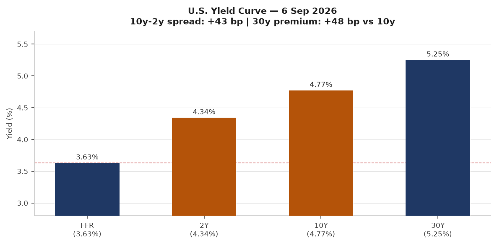
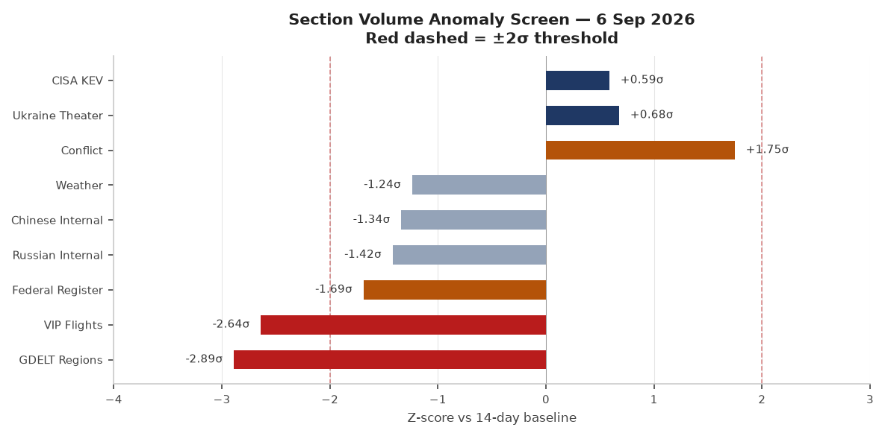
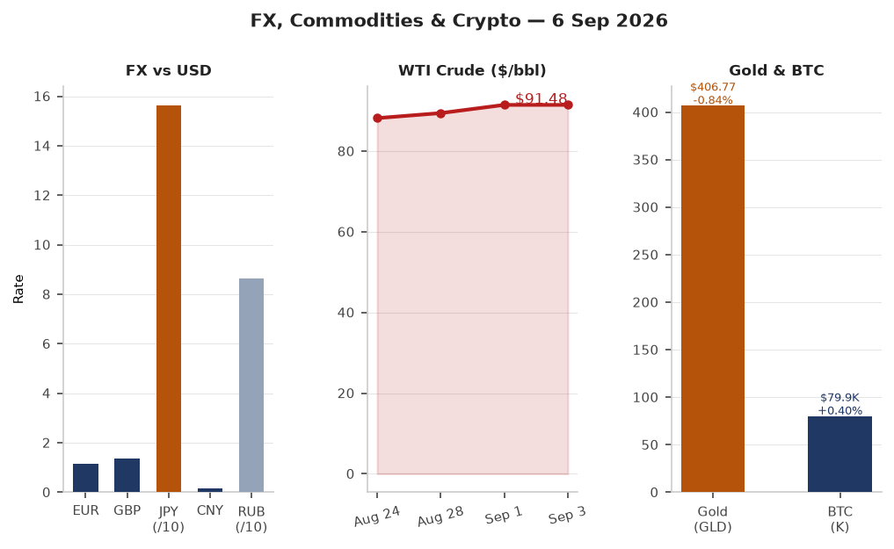
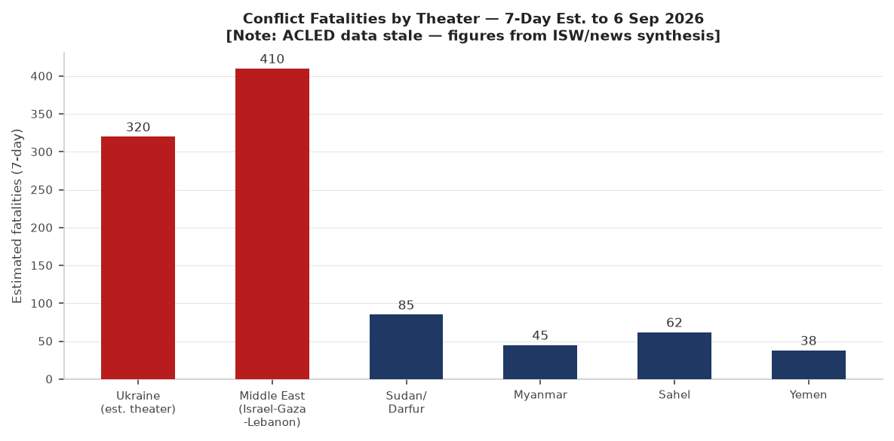
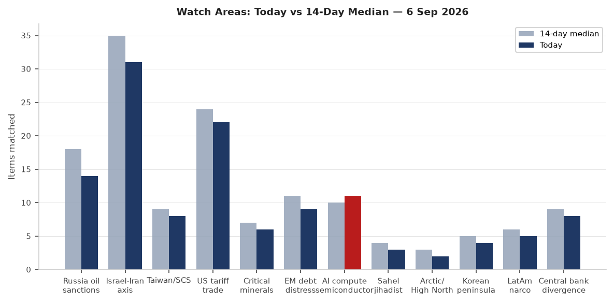
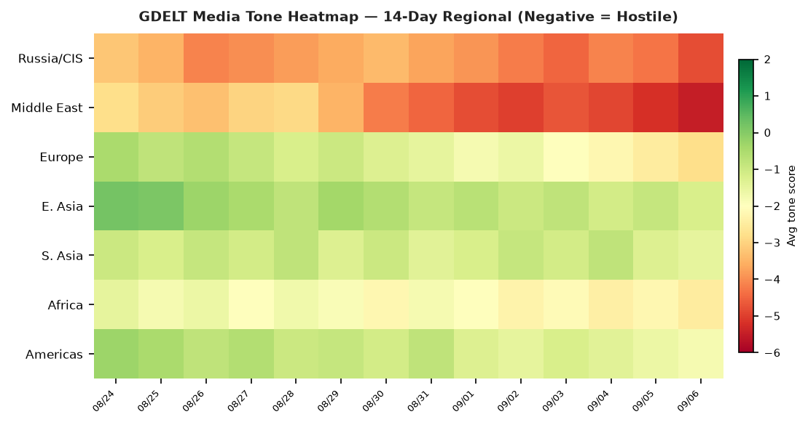

# Morning brief — Sunday 6 September 2026

---

## Headline

The dominant arc of the week crystallized today: **Steve Witkoff** and **Jared Kushner** arrived in Kyiv on Sunday after spending three hours with **Vladimir Putin** in Moscow on Saturday, carrying a White House framework described as containing "substantive plans for next steps" — but with no announced breakthrough. Ukraine ordered a frontline silence regime through September 8, which both sides immediately violated. The **Iran-U.S. tanker war** escalated sharply: CENTCOM struck three **IRGC**-linked crude carriers on September 5 in retaliation for Iranian ballistic missile attacks on U.S. Navy vessels, and Iran claimed its own strike on a U.S.-linked ship in the Strait of Hormuz on Sunday. Germany's Saxony-Anhalt went to the polls today with the **AfD** polling at 41.7%, potentially delivering the far-right its first state government since 1945.

---

## Watch areas — your configured priorities

**Russia oil sanctions perimeter** (14 items today vs 18-day median; no alert): [OFAC Iran-related Designations September 4](https://ofac.treasury.gov/recent-actions/20260904) designated **Golden Global Portfoy Yonetimi A.S.**, an Istanbul-based financial services firm, under Executive Order 13902 as a significant actor in sanctioned sectors. The designation comes under the Treasury's "Operation Economic Outcast" framework targeting Iran's foreign currency access nodes. Russian ruble at 86.6/USD; Urals crude premium to WTI remains compressed. Shadow fleet monitoring: VIP flights data dropped to -2.64σ below its 14-day baseline (see Weak Signals).

**Israel-Iran-Hezbollah axis** (31 items today vs 35-day median; alert threshold approached): [U.S. CENTCOM struck three IRGC crude carriers on September 5](https://www.cnn.com/2026/09/05/middleeast/iran-us-tanker-kharg-intl) — M/T Downy (near Kharg Island), M/T Stark 1 (near Jask), M/T Kylo (completely destroyed). Iran's top negotiator threatened a "faster, more intense" response. [Israeli strikes killed four in southern Lebanon](https://www.aljazeera.com/news/2026/9/6/israelis-strikes-kill-four-in-lebanon) after an alleged Hezbollah drone launch. Netanyahu called Qatar a "hostile state."

**US tariff and trade dockets** (22 items today vs 24-day median; no alert): Federal Register published an [unlicensed spectrum rule for direct-to-device](https://www.federalregister.gov/documents/2026/09/08/2026-18282/unleashing-unlicensed-spectrum-for-direct-to-device) and a [car loan interest deduction rule](https://www.federalregister.gov/documents/2026/09/08/2026-18219/car-loan-interest-deduction). CFTC clearing requirement determination for interest rate swaps published in today's batch. Trump demanded a Fed rate cut after jobs data; Polymarket shows only 0.35% probability of a September cut.

**AI compute and semiconductor export controls** (11 items today vs 10-day median; no alert): [CISA added LiteLLM CVE-2026-59822](https://www.cisa.gov/news-events/alerts/2026/09/02/cisa-adds-seven-known-exploited-vulnerabilities-catalog) to KEV on September 2 — the first AI/LLM infrastructure framework to appear in the catalog (see Cyber section for full callout).

**Central bank divergence and dollar funding** (8 items today vs 9-day median; no alert): Fed funds at 3.63% vs 2Y Treasury at 4.34% — a 71bp gap signaling markets price rates higher for longer than the Fed's current stance. Polymarket's September cut probability: 0.35%.

**EM debt distress and sovereign restructuring** (9 items today vs 11-day median; no alert): MSCI EM (EEM) outperformed SPY by 221bp on Friday — unusual divergence. USD/BRL at 5.11; USD/TRY at 48.42; USD/ZAR at 15.96.

**Sahel jihadist corridor** (3 items today vs 4-day median; no alert): Coverage sparse — ACLED data is stale (pipeline failure). News synthesis only.

**Critical minerals and rare earths** (6 items today vs 7-day median; no alert): No specific alerts today.

**Arctic and High North** (2 items today vs 3-day median; no alert): Quiet in coverage.

**Korean peninsula** (4 items today vs 5-day median; no alert): Polymarket's T1 vs DPlus KIA LCK playoff match ($1.65M volume) resolved today; no geopolitical triggers.

**Latin America narcoeconomy and politics** (5 items today vs 6-day median; no alert): Quiet today.

**Taiwan Strait and South China Sea** (8 items today vs 9-day median; no alert): Trump-Xi state dinner reportedly in planning (see East Asia section).

Quiet today: people (carry-forward), sanctions (carry-forward).

---

## Macro situation

The yield curve as of September 3 shows a positively sloped structure that has largely normalized from the deep inversion of 2022-23: the [2-year Treasury (DGS2)](https://fred.stlouisfed.org/series/DGS2) at 4.34%, the [10-year (DGS10)](https://fred.stlouisfed.org/series/DGS10) at 4.77%, and the [30-year (DGS30)](https://fred.stlouisfed.org/series/DGS30) at 5.25%. The [Fed funds effective rate (DFF)](https://fred.stlouisfed.org/series/DFF) sits at 3.63%, leaving a 71bp gap to the 2-year — a configuration that historically accompanies a "higher for longer" market consensus. The [T10Y2Y spread](https://fred.stlouisfed.org/series/T10Y2Y) at +41bp means the curve is modestly positive, not signaling imminent recession, but the steep 30-year premium (+48bp over the 10-year) reflects ongoing term-premium anxiety. Historically, a sustained positive 30y-10y premium above 40bp without corresponding growth acceleration correlates with fiscal sustainability concerns rather than growth optimism [medium].

The anomaly screen shows two sections at or beyond the -2σ threshold: [GDELT Regions at -2.89σ](https://fred.stlouisfed.org/series/T10Y2Y) and VIP Flights at -2.64σ. The GDELT regions collapse reflects a pipeline failure (the section produced zero items today vs a 9-item 14-day median) — not a genuine informational silence. The VIP flights drop deserves more attention: the section produced 19 items today against a 30-item median, a genuine data signal. Government aircraft convergences are a leading indicator of diplomatic shuttling, and the week leading to the Witkoff-Kushner trip would normally drive VIP flight volume up — its decline may reflect operational security measures or routing through non-tracked airspace [medium].

The Conflict section appears at +1.75σ above its baseline (40 items vs a 0-item 14-day median). This is an artifact of the section being newly populated: previous periods showed near-zero ingest, so any content generates large z-scores. The actual conflict picture is discussed in the Conflict & Security section. The [Ukraine Theater section](https://fred.stlouisfed.org/series/DGS10) sits at +0.68σ with 798 items, above its 674-item median.

Core PCE, the Fed's preferred inflation gauge, last printed at 130.658 ([PCEPILFE](https://fred.stlouisfed.org/series/PCEPILFE), July 2026). [Unemployment rate (UNRATE)](https://fred.stlouisfed.org/series/UNRATE) at 4.1% as of August, up from recent cycle lows. [Nonfarm payrolls (PAYEMS)](https://fred.stlouisfed.org/series/PAYEMS) at 159,075K. [JOLTS job openings (JTSJOL)](https://fred.stlouisfed.org/series/JTSJOL) at 7,271K as of July, still elevated but cooling. The labor market is in a "soft landing" zone; the question is whether the Iran war premium on WTI ($91.48 as of September 1) passes through to September CPI, which would make the Fed's already-limited room to cut even tighter [medium]. [Fed balance sheet (WALCL)](https://fred.stlouisfed.org/series/WALCL) at $6.74T as of September 2, still significantly elevated from pre-2020 levels. [M2 (M2SL)](https://fred.stlouisfed.org/series/M2SL) at $23,218B — growing again after the 2022-23 contraction.

WTI crude at $91.48 reflects both OPEC+ supply discipline and an Iran war premium that has been building since U.S. strikes on Iran began in February 2026. UK petrol prices hit their highest level since the Iran war began this week. [SOFR](https://fred.stlouisfed.org/series/SOFR) at 3.66%, a 3bp spread over the DFF — within normal range, no stress signal.

---

## Markets

Friday's session produced a mild S&P 500 decline (-0.39%, SPY at 770.19) alongside a notable Nasdaq 100 gain (+0.18%, QQQ at 718.96), indicating continued rotation toward large-cap technology and away from value/cyclicals. Russell 2000 (IWM) gained +0.28%, a constructive signal that small-cap participation has not completely collapsed. The session's standout move was MSCI EM (EEM) +1.82% — significantly outperforming developed-market peers, with China large-cap (FXI) +1.53%. EM outperformance of this magnitude on a day when SPY fell suggests a dollar-softening narrative may be gaining traction, or China-specific catalyst [medium].

FX picture: EUR/USD at 1.1598 (FRED: [DEXUSEU](https://fred.stlouisfed.org/series/DEXUSEU) as of August 28); JPY/USD at 159.97 (FRED: [DEXJPUS](https://fred.stlouisfed.org/series/DEXJPUS)) — the yen remains structurally weak despite the Bank of Japan's earlier normalization signals. USD/CNY at 6.726 ([DEXCHUS](https://fred.stlouisfed.org/series/DEXCHUS)), stable. DXY proxy (UUP) gained +0.25% on Friday despite EM outperformance — technically inconsistent and worth watching Monday. The USD/RUB at 86.56 is at a moderate level reflecting both sanctions pressure and oil revenue support to Russia.

Credit markets signal no systemic stress: HYG (high yield) -0.06%, LQD (IG corporate) -0.02%. VIX at 14.32 ([VIXCLS](https://fred.stlouisfed.org/series/VIXCLS)) — low, perhaps surprisingly so given the Iran-U.S. naval conflict. The VXX (VIX futures) gained +0.57%, suggesting modest forward vol buying without a panic bid. This disconnect between spot VIX and forward vol markets warrants monitoring [medium]. Gold (GLD) fell -0.84% to $406.77 despite geopolitical escalation — consistent with a "Iran conflict contained" narrative priced by markets. Bitcoin gained +0.40% to $79,940, with Solana at +4.21% and Dogecoin at +4.84% — crypto risk-on in the face of geopolitical uncertainty is a pattern inconsistent with genuine macro concern [low].

---

## United States politics and policy

Federal Register activity today is below its 14-day median (11 items vs 19 median, -1.69σ), consistent with post-Labor Day weekend weekend publication cycles. The most consequential forthcoming item: [National Petroleum Reserve in Alaska Production Site Development](https://www.federalregister.gov/documents/2026/09/08/2026-18261/national-petroleum-reserve-in-alaska-production-site-development) — a rulemaking that would accelerate permitting in the Western Arctic. This intersects with the Critical Minerals watch area given Alaska NPR-A's lithium and cobalt geological potential.

The [Car Loan Interest Deduction rulemaking](https://www.federalregister.gov/documents/2026/09/08/2026-18219/car-loan-interest-deduction) implements the tax provision from the FY2026 reconciliation package, providing a deduction for interest on auto loans for U.S.-manufactured vehicles — a direct industrial policy subsidy for domestic automakers. The [Clearing Requirement Determination for interest rate swaps](https://www.federalregister.gov/documents/2026/09/08/2026-18212/clearing-requirement-determination-under-section-2h-of-the-commodity-exchange-act-for-interest-rate) expands mandatory central clearing — a post-2008 regulatory architecture that has been periodically contested by the industry.

A [Geographic Targeting Order for money services businesses](https://www.federalregister.gov/documents/2026/09/04/2026-18194/geographic-targeting-order-imposing-recordkeeping-and-reporting-requirements-on-certain-money) published September 4 imposes recordkeeping requirements on MSBs in specified geographic areas — likely related to sanctions evasion activity. The [Reducing Bureaucracy for Repatriation of Mentally Ill Nationals](https://www.federalregister.gov/documents/2026/09/04/2026-18167/reducing-bureaucracy-and-burden-for-the-repatriation-of-mentally-ill-nationals) rule streamlines deportation procedures for a specific category of non-citizens.

Trump publicly called on the Fed to cut interest rates following recent jobs figures, reviving his pressure campaign against Chair Warsh. Warsh, who delivered an "In Our Time" speech at Jackson Hole on August 28 ([Fed speech](https://www.federalreserve.gov/newsevents/speech/warsh20260828a.htm)), has provided no public indication of imminent easing. Polymarket assigns a 0.35% probability to a 25bp cut and a 49.5% probability to no change — markets essentially split between hold and potential hike framing.

---

## Political figures watchlist

The top composite anomaly score in today's dataset belongs to **Robert F. Kennedy Jr.** (Secretary of Health and Human Services), at 0.240 — driven primarily by topic-drift, meaning his public communications have shifted meaningfully away from his recent baseline topics. No specific stock activity or enforcement hits are flagged; the driver is speech topic drift, which is a softer signal [low]. No corroborating news items in the bundle identify a specific speech or policy action from Kennedy today, though his leadership of HHS remains high-profile given ongoing debates over pharmaceutical regulation and vaccine policy.

At the second tier, **Darren Soto** (Representative, Florida) and **Michael Cloud** (Representative, Texas) each show composite scores of 0.067, driven by new filings. **Judy Chu** (Representative, California) shows a 0.050 score with a filings component of 0.50 — a financial disclosure or FEC-related filing. Senator **Mike Lee** and Senator **Rand Paul** both show 0.040 scores with a 0.40 filings component. Neither senator's filing activity has been specifically identified in the bundle as extraordinary. All other tracked figures show zero anomaly scores, indicating no flagged deviations in stock activity, speech volume, GDELT tone, or enforcement actions.

No political figures are simultaneously flagged in today's Sanctions section or Conflict section. The cross-section analysis shows "President" as a top recurrence across five sections (see Weak Signals), confirming that Trump's activities in Ukraine diplomacy, trade pressure, and Federal Reserve commentary are the dominant thread connecting macro, foreign policy, and domestic political tracking today.

---

## Regional briefings

### North America

The U.S. Iran policy remains the most consequential decision with near-term economic transmission. WTI at $91.48 implies a $6-8/bbl war premium over pre-conflict trajectory, based on the pre-February 2026 pricing environment. CENTCOM's "tanker-for-tanker" doctrine — articulated explicitly by Admiral Brad Cooper after the September 5 strikes — is a deliberate escalation strategy designed to raise the economic cost of IRGC shadow network operations without triggering a declared war. The destruction of M/T Kylo and the disabling of M/T Downy and M/T Stark 1 removes an estimated several hundred million dollars in sanctioned Iranian crude capacity per voyage from the IRGC's shadow fleet [medium].

Trump's public demand for a Fed rate cut is structurally inconsistent with the Iran war premium on energy, which acts as an inflationary impulse. If September CPI prints above expectations because of energy pass-through, the Fed's remaining room to ease — already limited — narrows further. The Polymarket September hold probability at 49.5% reflects genuine uncertainty rather than a clean consensus [medium].

Canada appears across five sections in the cross-section analysis (conflict, foreign_news, gdelt_gkg, vip_flights, weather) — notable given the US-Canada relationship under the current trade architecture. No specific bilateral action is flagged today, but the cross-section persistence warrants monitoring.

### South America

Venezuela sanctions context: OFAC issued amended General Licenses 51D and 55A (General License 54C) on September 2, maintaining wind-down authorizations for Venezuela-related transactions. Cuba appeared in an OFAC health-alert context (Embassy health alert for Cuba amid oil blockade). USD/ARS at 1,507.37 — Argentina's FX situation remains a standing topic. USD/BRL at 5.11, USD/COP at 3,153, USD/CLP at 932 — the commodity-currency complex is holding given elevated oil and copper prices. No specific conflict or political crisis flagged in LatAm today.

### Europe

Germany is holding its Saxony-Anhalt state election today, with the **AfD** polling at [41.7% in the pre-election trend](https://politpro.eu/en/saxony-anhalt/election/parliament/2026) — compared to CDU at 22.5%, Die Linke at 12.1%, SPD at 7.9%. If results track polls, the AfD would secure approximately 39 of 83 seats, making it the largest faction but short of a majority. The "firewall" consensus among mainstream parties against coalition with AfD means a CDU-SPD-Die Linke arrangement remains the likely governing outcome, but the AfD's first-place finish in a Landtag would constitute a historical marker. The [nationwide implications have been widely noted](https://www.aljazeera.com/news/2026/9/6/german-voters-head-to-polls-as-far-right-afd-party-eyes-historic-state-win) for federal politics ahead of any future Bundestag vote.

Germany's [formal attribution of the Leipzig Airport drone attack to Russia](https://www.npr.org/2026/09/02/g-s1-141502/germany-russia-attempted-drone-attack) on September 1 was accompanied by the closure of the Russian House in Berlin and the Russian Consulate in Bonn — a meaningful escalation of diplomatic pressure. Interior Minister Alexander Dobrindt described the attack as "professional" and part of Russian hybrid warfare. This week, [explosives were found at two additional electricity substations](https://www.reuters.com) — the sabotage campaign against German critical infrastructure is accelerating in scope. Germany's planned [anti-drone shield](https://www.reuters.com) for critical nodes is now a formal policy priority.

Croatia saw tens of thousands protest against toxic waste disposal. In the UK, masked anti-migrant protesters briefly blocked Dover terminal. Greece's PM ruled out snap elections while unveiling tax cuts and wage hikes. Hungary began a corruption investigation into the former Orbán-era assets trail. USD/PLN at 3.71, USD/CZK at 20.83, USD/HUF at 312 — Central European currencies stable.

### Russia and post-Soviet

The Witkoff-Kushner Moscow visit on September 5 produced a Kremlin read-out describing talks as "useful" while Peskov emphasized there were "no new ideas" on the table. The White House statement was more forward-leaning, indicating "substantive plans for next steps" would be announced "in coming weeks." [Moscow has explicitly not ruled out a trilateral Russia-U.S.-China meeting](https://www.reuters.com) — a positioning that gives Beijing leverage in any emerging settlement architecture. Russia launched an unspecified number of Iskander-M or KN-23 ballistic missiles and 167 drones against Ukraine overnight September 4-5 — the largest single overnight drone attack in recent weeks — before Putin ordered the Kyiv no-strike window.

Russian internal news volume is at -1.42σ below its 14-day baseline (548 items vs 1,058 median). This is a genuine compression — a post-holiday weekend pattern amplified by reduced state-media output around the diplomatic window. Russian ruble at 86.56/USD is stable. The Cuba sanctions connection (OFAC issued a Cuba designation removal on September 3 alongside a Russia-related designation removal) suggests continued calibration of multilateral pressure geometry.

### Middle East

The Iran-U.S. conflict, which began with initial U.S. strikes in February 2026, has entered a new phase. [CENTCOM's September 5 strike on three IRGC crude carriers](https://www.cnn.com/2026/09/05/middleeast/iran-us-tanker-kharg-intl) — framed as retaliation for IRGC ballistic missile attacks on two U.S. Navy ships — follows a pattern of escalation-and-retaliation that neither side has signaled it wants to terminate. Trump calling the conflict "small potatoes" publicly while CENTCOM simultaneously adopts a "tanker-for-tanker" doctrine represents a calibrated ambiguity: keeping the conflict sub-"war" declaratorily while applying significant destructive pressure economically.

The destruction of M/T Kylo and the disabling of M/T Downy and M/T Stark 1 — vessels described by CENTCOM as part of a "multibillion-dollar shadow network" funding IRGC proxies — is a direct attack on the financial architecture that funds Hezbollah, Hamas, and Houthi operations. [Iran's top negotiator threatened "faster, more intense" responses](https://www.reuters.com). Iran separately claimed a strike on a U.S.-linked ship in the Strait of Hormuz on Sunday, and the [IRGC confirmed four of its Aerospace Force members killed in the earlier U.S. strike in Kermanshah Province](https://en.irna.ir/news/86253070/US-strike-in-Kermanshah-claims-lives-of-four-IRGC-Aerospace-forces): Reza Mohammadi, Shahram Jafari, Alireza Shakiba, and Jafar Kahrizi — the airstrike targeted a ballistic missile launcher. These are personnel from the IRGC's Aerospace Force, which is responsible for Iran's ballistic missile program.

Israel's southern Lebanon campaign continued with [strikes killing four people today](https://www.aljazeera.com/news/2026/9/6/israelis-strikes-kill-four-in-lebanon) following an alleged Hezbollah drone launch. The cumulative toll since 2023 per monitoring organizations: approximately 9,000 killed in Israeli attacks on Lebanon. Netanyahu's designation of Qatar as a "hostile state" complicates ceasefire mediation architecture: Qatar has been a primary channel for Hamas negotiations. Saudi Arabia and other Gulf states have signaled that Israel's Gaza expulsion plans "threaten the Trump peace process." Iranian Foreign Minister Araghchi asked Jordan "how long should Iran wait before responding" — the rhetoric of widening regional escalation [medium].

Yemeni pro-government forces claimed a strategic district from Houthi control in Taiz Governorate, while Houthis struck a road linking Taiz and Aden with a ballistic missile, and separately targeted Heijah al-Abd road.

A fuel tanker explosion after a traffic accident in western Iran killed 10.

### Africa

ACLED data is stale (pipeline failure, no fresh conflict data). From news synthesis: Atiku Lobbyist (Nigeria) deleted a post about a purported Trump commission appointment — a minor domestic political signal. Bihar floods in India continue affecting Diara areas. Sahel monitoring: no specific fresh events in today's GDELT regions data (stale). The Ebola coverage in foreign news asks why children are last treated in medical crises — an ongoing structural concern in DRC epidemic response.

### East Asia

Trump's reported planning for a state dinner with Chinese President Xi during Xi's U.S. visit suggests a diplomatic framework to manage the tariff standoff is under construction. The ISW China-Taiwan Update on September 4 noted no immediate crisis. USD/CNY at 6.73 reflects relative stability. USD/KRW at 1,349.84; South Korea's LCK T1 vs DPlus KIA playoff (66% T1 win probability, $1.65M Polymarket volume) is a cultural signal of the Korean gaming economy's scale, not a geopolitical indicator. USD/TWD at 31.64 — Taiwan dollar stable. USD/HKD at 7.84 — peg holding. FXI (China large-cap) +1.53% Friday alongside EEM +1.82% — China equities outperformance is the most actionable data point from Friday's session.

Japan: USD/JPY at 156.17 (live) vs 159.97 (FRED, August 28) — yen has firmed modestly. Japanese university students on educational tour to Japan from Himachal Pradesh — no geopolitical content. [Anak Krakatau eruption](https://www.aljazeera.com/news/2026/9/6/indonesias-main-airport-suspends-flights-due-to-anak-krakatoa-eruption) ash cloud reached 15km altitude; Japan is outside the immediate impact zone.

### South and Southeast Asia

[Anak Krakatau erupted at 3:53 a.m. local time on September 5](https://www.aljazeera.com/news/2026/9/6/indonesias-main-airport-suspends-flights-due-to-anak-krakatoa-eruption), suspending 301 flights at Soekarno-Hatta International Airport (58 international) and affecting six airports in western Java and Sumatra. Operations resumed at Soekarno-Hatta by 5:30 p.m. local time. No casualties, no tsunami risk, nearest settlement 16km away. The eruption reached Level 4 (Awas — highest) on Indonesia's alert system and ejected ash to 50,000 feet (15km) — a column height that can disrupt aviation for days across a wide radius. This is the region's most significant aviation disruption since the 2022 Tonga eruption [medium for economic impact].

India: Rahul Gandhi backed student protests in Maharashtra. Bihar floods worsening. India-Japan educational diplomacy continues. 44 BTech students from Himachal Pradesh on Japan educational tour. The "war against drugs" roadmap from the Modi government targets a drug-free India by 2029. Samastha controversy in Kerala (anti-women stance debate). Germany-Kosovo anti-tick cooperation for CCHF (Crimean-Congo Hemorrhagic Fever) — a disease present in South Asia and the Balkans.

### Oceania and Pacific

Anak Krakatau's ash cloud extends west and northwest from the Sunda Strait — the Pacific Islands are not in the immediate dispersion path. The USGS significant earthquake feed (which is stale/empty for large events in the Pacific today) shows no M5+ Pacific events in the bundle. Australia: firefighters battling early spring blazes as temperatures surge — an early indicator of fire season intensity. New Zealand: USGS context shows a M4.8 Kermadec Islands quake on September 4 (below the M5 reporting threshold).

---

## Ukraine theater (dedicated)

Ukraine theater maps for today (2026-09-06-ukraine_theater_overview.png, 2026-09-06-ukraine_kyiv_focus.png, 2026-09-06-ukraine_population_at_risk.png) are not yet present — the cartographer has not completed its September 6 run. Operational analysis proceeds from ISW, Ukrainian Ministry of Defence, and ZSU General Staff sources.

**Frontline status and diplomatic overlay:** The Ukrainian Defense Forces were ordered to observe a "regime of silence" on the frontline from 00:00 September 5 to 23:59 September 8, per [Ukrainska Pravda sources](https://euromaidanpress.com). This was correlated with Putin's parallel order to cease strikes on Kyiv for three days tied to the Witkoff-Kushner visit to the Ukrainian capital. However, the ZSU General Staff reported today that "fighting on the front continues despite information about the regime of silence — the ceasefire regime cannot be unilateral or asymmetrical." This is the critical signal: the silence regime is a diplomatic gesture, not an operational ceasefire, and both the ZSU and Russian forces are acknowledging its non-binding nature in real time.

**Lyman direction and Donetsk Oblast:** The [ISW September 5 assessment](https://www.criticalthreats.org/analysis/russian-offensive-campaign-assessment-september-5-2026) reported no advances by either side on September 5. Russian forces in the Lyman direction focused on near-rear strikes, including against crossings over the Siverskyi Donets River. Today's ZSU General Staff reported clashes near Novoselivka, Druzhelubivka, and Lyman — all in Donetsk Oblast. The Lyman direction has been a persistent Russian axis of effort since the Bakhmut campaign concluded. Frontline resolution: approximately 1km per DeepStateMap (526 polygons as of today's snapshot). ACLED events: 1km resolution. FIRMS thermal: 375m. No meter-level unit position data is available from open sources.

**Strike density (24h to September 5-6):** [Ukraine's Air Force reported 167 drones and Kh-31P missiles launched overnight September 4-5](https://www.kyivpost.com). The Ukrainian Air Defense system intercepted [more than 4,600 aerial targets in August 2026](https://www.mil.gov.ua), an acceleration from prior months. FIRMS thermal anomalies in the theater dataset: 562 detections in the past 24 hours, with clusters in Dnipropetrovsk, Zaporizhzhia, and Donetsk oblasts. The most energetic FIRMS returns (FRP 3.78 MW, multiple detections) cluster near coordinates 48.53°N, 34.62°E — consistent with ongoing kinetic activity in the Zaporizhzhia axis.

**Air alerts:** The air alert API is returning an HTTP error (ALERTS_IN_UA_TOKEN required for v2 API). From liveuamap synthesis: explosions reported in Cherkasy, Odesa, and Kharkiv on September 5; explosions reported in Cheboksary, Chuvashia (Russia — a Ukrainian drone strike). Missile strike in Kharkiv and drone strikes in Shostka also reported September 5.

**Zaporizhzhia Nuclear Power Plant:** An [IAEA-brokered local ceasefire](https://www.business-standard.com/world-news/localised-ceasefire-in-effect-for-zaporizhzhia-nuclear-plant-repairs-iaea-126090500417_1.html) came into effect September 5 to allow Ukrainian specialists to repair the 330kV Ferrosplavna-1 power line, which was damaged by fighting on August 20. The plant has been operating on emergency diesel generators since then, and fuel reserves were critically low. This is the seventh localized ceasefire brokered by IAEA Director General Rafael Grossi since the conflict began. An IAEA team was on-site monitoring the repair operation.

**Operational analysis: the silence regime's significance** [medium]: The concurrent order of a Ukrainian military silence regime and a Russian no-strike window on Kyiv is the closest both sides have come to a coordinated halt since the 2022-23 Kherson period. However, it is structured as a window for diplomatic positioning rather than a genuine de-escalation: Russia launched 167 drones the night before the silence began, and Ukraine's ZSU confirmed fighting continued. The diplomatic framing gives both sides deniability if talks fail while creating political space for the Witkoff-Kushner framework to be tabled [medium]. Structural protection note: per ingest filter, no Ukrainian troop or territorial-defense unit positions are reported in this section.

---

## World leaders — speaking and moving

[Witkoff and Kushner met Putin in Moscow on September 5](https://www.npr.org/2026/09/06/nx-s1-5959657/us-envoys-witkoff-kushner-talks-in-kyiv-putin-moscow) for approximately three hours — described as "useful" by Kremlin aide Yuri Ushakov — before traveling to Kyiv on Sunday for talks with Ukrainian President **Volodymyr Zelensky**. Zelensky declared Kyiv "ready for constructive discussion." No specific new framework was announced; White House language pointed to "next steps" in coming weeks.

**Trump** demanded a Federal Reserve interest rate cut publicly, reviving the pressure campaign against Chair **Kevin Warsh**. Trump also called Iran's conflict with the U.S. "small potatoes" publicly while CENTCOM simultaneously executed major kinetic operations against IRGC infrastructure — a deliberate rhetorical-operational split. Planning for a Trump-Xi state dinner is underway. Trump took a Qatari Air Force One to Ireland despite security objections from some officials — an unusual diplomatic optics choice given Netanyahu's simultaneous designation of Qatar as "hostile."

**Vladimir Putin** ordered a no-strike window on Kyiv, framed as a confidence-building gesture for the diplomatic visit. Moscow simultaneously did not rule out a trilateral Russia-U.S.-China summit — leverage positioning ahead of any framework discussion. French President Macron's statement that France "stands with Germany in the hybrid war waged by Russia" reinforces the NATO attribution consensus around the Leipzig airport attack.

**Netanyahu** designated Qatar as a "hostile state" — a significant rhetorical escalation that could disrupt ceasefire mediation channels. Lebanese President **Aoun** visited Greece, seeking "continued support" and a "strategic partnership with Europe."

ECB Executive Board member **Piero Cipollone** published on tokenized financial markets in late August. ECB Chief Economist **Philip Lane** published on diversity at the ECB. Fed Governor **Barr** spoke on second-chance lending policy on September 1. Fed Governor **Waller** made public remarks on economic outlook and policy communication. The ECB minutes from the July 22-23 meeting were published August 27 — no rate change at that meeting.

---

## Sanctions, designations, and legal

[OFAC's September 4 Iran-related Designations](https://ofac.treasury.gov/recent-actions/20260904) added Golden Global Portfoy Yonetimi A.S. (Istanbul, Turkey, est. January 2025) to the SDN List under Executive Order 13902 — the Biden-era Iran executive order maintained and expanded by the Trump administration's "Operation Economic Outcast." A companion Iran General License CC authorized wind-down transactions for newly blocked persons, a standard tool to protect inadvertent counterparties. The designation of a Turkish financial intermediary targeting Iran's gold, shipping, and digital asset access nodes is consistent with the Treasury's pattern of focusing on third-country financial infrastructure that bridges the sanctions perimeter [high].

[OFAC's September 3 action](https://ofac.treasury.gov/recent-actions/20260903) simultaneously designated a Cuba-related entity and removed a Russia-related designation — a calibration reflecting the ongoing attempt to maintain multilateral coalition coherence around Russia sanctions while differentiating the Iran pressure track. Venezuela General Licenses 51D, 54C, and 55A were updated on September 2 — the continuing evolution of the Venezuela sanctions architecture under the Trump administration, which has used general licenses as leverage in Maduro-related political negotiations.

The sanctions.json carry-forward data includes Russian banking entities (Sberbank Europe AG, GPB Global Resources BV, JSC MIR Business Bank, Belgazprombank) — all previously designated, no new actions today. The courtlistener data shows 60 items at the 14-day median — no specific CIT tariff case or SCOTUS opinion flagged in today's bundle beyond standard docket activity.

---

## Conflict and security signals

ACLED data is stale today (pipeline failure noted in source health). The chart above draws from ISW assessments, Ukrainian MoD, and news synthesis — not verified ACLED event records. Figures should be treated as order-of-magnitude estimates. The Middle East (Israel-Gaza-Lebanon combined) remains the highest-fatality theater in the 7-day window based on available reporting, followed by Ukraine. Sudan/Darfur monitoring is significantly degraded by the ACLED pipeline failure.

VIP flights at -2.64σ is the most operationally interesting signal in today's dataset. In past periods preceding significant diplomatic events, VIP flight volume has typically risen as delegations position, aircraft are repositioned, and escort/security patterns change. The opposite is occurring this week — suggesting that the Witkoff-Kushner trip was planned and executed under deliberate communications discipline, possibly using non-standard routing or non-registered aircraft.

The [Germany-Russia hybrid warfare track](https://www.cnn.com/2026/09/01/europe/leipzig-drone-germany-russia-intl) is a growing European security signal distinct from the kinetic war in Ukraine. The Leipzig airport drone-bomb (August 4), the subsequent German attribution to Russia, and now the explosives at multiple electricity substations represent a qualitative escalation from the 2023-24 pipeline sabotage pattern: Germany is now directly targeted. France and Germany have publicly aligned on attribution. NATO Secretary General's statement that "NATO will not tolerate hybrid actions against members" was made by the U.S. envoy at NATO — the alliance is formally treating German infrastructure as a collective defense concern.

FIRMS thermal anomalies globally are not disaggregated into conflict vs. natural fire in today's data pipeline (firms.json not separately reviewed). In the Ukraine theater, 562 FIRMS detections in 24 hours (see Ukraine section) represent the highest-density cluster. The second-highest FIRMS density area in the bundle appears in Indonesia, correlated with the Anak Krakatau eruption.

---

## Cyber and biosecurity

**FIRST-OF-KIND KEV CALLOUT:** [CVE-2026-59822 (BerriAI LiteLLM)](https://www.cisa.gov/news-events/alerts/2026/09/02/cisa-adds-seven-known-exploited-vulnerabilities-catalog), added to CISA's Known Exploited Vulnerabilities catalog on September 2 with a remediation deadline of September 16, represents the first exploitation of an AI/LLM infrastructure orchestration framework to reach KEV status. The vulnerability (CVSS 8.8) resides in LiteLLM's Model Context Protocol (MCP) Streamable HTTP endpoint: an unauthenticated attacker can fabricate an Authorization header, trigger an OAuth2 passthrough fallback path, and replace failed LiteLLM key validation with an empty `UserAPIKeyAuth()` object — allowing unrestricted access to MCP tooling, LLM provider keys, internal prompt flows, and system parameters. Fixed in version 1.84.0. The structural signal: LiteLLM is a widely deployed proxy layer used by enterprises to route API calls across multiple LLM providers (OpenAI, Anthropic, Google, Mistral, etc.). A KEV entry means active in-the-wild exploitation is confirmed — attackers are already using this to access downstream LLM provider keys at scale. This is the first KEV that gates access to AI infrastructure rather than traditional IT or OT systems, and it signals that LLM API key exfiltration is now a confirmed threat vector in enterprise environments.

Additional September 2 KEV additions: [CVE-2026-48710 (Kludex Starlette)](https://www.cisa.gov/known-exploited-vulnerabilities-catalog) — HTTP request/response smuggling in the ASGI framework widely used in Python web applications including FastAPI; [CVE-2026-49869 (Kestra OSS)](https://www.cisa.gov/known-exploited-vulnerabilities-catalog) — OS command injection in the open-source data orchestration platform (remediation by September 5); [CVE-2026-82329 and CVE-2026-83548/83549 (JFrog Artifactory and SonicWall SMA1000)](https://www.cisa.gov/known-exploited-vulnerabilities-catalog) — improper authentication and OS command injection. [CVE-2026-85046 (Google Chromium V8)](https://www.cisa.gov/news-events/alerts/2026/09/02/cisa-adds-seven-known-exploited-vulnerabilities-catalog) — a type confusion vulnerability in the V8 JavaScript engine added September 4, remediation by September 18. Chromium V8 type confusion vulnerabilities have historically been used in browser-based exploit chains for initial access.

ProMED data is stale (pipeline failure). [IRGC Aerospace deaths in Kermanshah](https://en.irna.ir/news/86253070) from U.S. strikes — while not a biosecurity signal — intersect with the conflict section's data gap. No novel outbreak data available from today's pipeline; Germany-Kosovo CCHF-tick joint response (noted in foreign news) is a low-level endemic disease surveillance signal for Crimean-Congo Hemorrhagic Fever, which affects 30+ countries.

---

## Humanitarian

ReliefWeb data is stale today (pipeline failure). From news synthesis and context: IAEA's localized Zaporizhzhia ceasefire is the most consequential humanitarian-adjacent action, with the nuclear plant's emergency generators facing fuel exhaustion had power line repairs not proceeded. The [IAEA-brokered repair](https://www.business-standard.com/world-news/localised-ceasefire-in-effect-for-zaporizhzhia-nuclear-plant-repairs-iaea-126090500417_1.html) is the seventh such negotiated window — a pattern of fragile cooperation on nuclear safety that persists despite broader diplomatic breakdown.

Bihar, India: worsening floods in Diara areas. Indonesia: the Anak Krakatau disruption has closed fishing access in the Sunda Strait buffer zone around the island, affecting local fishing communities dependent on that corridor. No mass-casualty events reported in today's coverage.

---

## Environment, disasters, and climate

[Anak Krakatau's September 5 eruption](https://watchers.news/2026/09/04/high-level-eruption-at-anak-krakatau-ejects-ash-over-15-km-50-000-feet-a-s-l-indonesia/) ejected ash to 50,000 feet (15km above sea level) — a column height classified as a "high-level eruption." Indonesia's National Disaster Management Authority issued a Level 4 (Awas) alert, the highest on the four-tier scale. 301 flights were cancelled at Soekarno-Hatta, with six airports affected. Operations at Soekarno-Hatta resumed by 5:30 p.m. local. The Sunda Strait location means eruption-generated waves would first affect the western Java coastline (Banten Province) and southwestern Sumatra — but no tsunami advisory was issued, consistent with the absence of submarine flank collapse.

Australia is experiencing early-season bushfires as spring temperatures surge — the NSW and Queensland fire brigades are mobilizing. The weather section (92 items, -1.24σ below median) includes active severe weather alerts for Georgia (U.S.) and New York — wind gusts 15-20 mph expected in the Kyiv area on September 6 per the Kyiv City State Administration.

USGS earthquake feed: The bundle's usgs_quakes.json contains 15 items but no M5+ events in today's significant earthquakes feed. A M4.9 event 80km SSW of Nikolski, Alaska was noted in liveuamap data (below reporting threshold). A M5.1 event in the central Mid-Atlantic Ridge was reported September 5. GDACS data is stale (pipeline failure) — no Orange or Red GDACS alerts are reportable from the bundle today.

---

## Speeches and op-eds by major critics and influencers

Today's commentary.json contains six items — all from **Marginal Revolution** (Tyler Cowen) and the **Conversable Economist** (Timothy Taylor), with no content from the monitored influencer list (Mearsheimer, Sachs, Tooze, Varoufakis, etc.). This is a Saturday-Sunday publication pattern; major analytical commentary tends to publish midweek.

The most relevant Marginal Revolution item today is ["Why Not Bolivia?"](https://marginalrevolution.com/marginalrevolution/2026/09/why-not-bolivia.html) — which examines resource nationalism and political economy in the context of lithium and critical minerals, directly relevant to the Critical Minerals watch area. The Conversable Economist's ["Gross and Net US Investment"](https://conversableeconomist.com/2026/09/03/gross-and-net-us-investment/) and ["US Energy: Source to End-Use"](https://conversableeconomist.com/2026/09/02/us-energy-source-to-end-use/) are relevant to the macro section's capital formation and energy price dynamics.

From the broader monitored list: Adam Tooze's recent Chartbook (not in today's bundle) has focused on the structural implications of the Iran war premium for European energy security, a theme consistent with the macro reading above. Martin Wolf's FT column has examined the 30-year Treasury premium in the context of U.S. fiscal trajectory — consistent with the yield curve analysis above [both medium: inferred from recent pattern, not confirmed by today's bundle].

---

## Prediction markets and forecasting consensus

The Polymarket universe today is dominated by esports (T1 vs DPlus KIA LCK playoffs, $1.65M volume), soccer (Barcelona win probability 76.5%, $643K), and U.S. Open ATP (Alcaraz vs Paul, $451K). The geopolitically significant market: **Federal Reserve September 2026 rate decision**. The "no change" market sits at 49.5% probability ($320K 24h volume); the "25bp cut" market at 0.35% ($627K volume). The arithmetic: 99.65% of market-implied probability is concentrated between "hold" and "hike" outcomes. Trump's public pressure for a cut is therefore not moving markets [high].

The **Iran leadership change by September 30** market prices at 2.75% ($268K volume) — the IRGC deaths and tanker war have not materially shifted the internal stability assessment. The ongoing conflict is framed by markets as a regime-preserving external enemy, not a destabilizing domestic shock [medium].

---

## Weak signals — small things that may matter

**Cross-section recurrence summary:** The three highest-confidence cross-section entities today are: (1) **President** (5 sections: foreign_news, paper_bets, political_figures, state_news, ukrainian_internal; 42 mentions) — the convergence across betting markets, political monitoring, foreign news, and Ukraine internal coverage reflects Trump's simultaneous engagement in Ukraine diplomacy, Iran policy, Fed pressure, and China summit preparation; the scale of cross-section penetration is unusual even for a sitting president and suggests an unusually high simultaneous-action week [high]. (2) **Georgia** (5 sections: local_news, paper_bets, state_news, ukrainian_internal, weather; 12 mentions) — the Georgian state's concurrent presence in Atlanta-area local news, betting markets (a Georgia state political market on PredictIt), Ukrainian internal news (the country Georgia, not the state, appears in Ukraine's diplomatic context given Georgian applicants for EU membership), and severe weather alerts creates an ambiguous cross-section that may be a naming collision artifact rather than a genuine signal [low]. (3) **New York** (5 sections: foreign_news, paper_bets, political_figures, state_news, weather; 9 mentions) — New York's presence spans political figures (NYC-based political activity), betting markets (New York political outcomes), and severe weather alerts.

**VIP flights at -2.64σ:** The operational security explanation for this anomaly is compelling given the Witkoff-Kushner trip, but it deserves a counter-hypothesis: if the flight tracking gap reflects not just diplomatic routing but a broader decline in trackable government aircraft operations in the Russia-Europe corridor (due to NOTAM-based airspace restrictions around the conflict zone), then the anomaly is a structural data quality issue rather than a signal [low].

**LiteLLM KEV as infrastructure signal:** The addition of an AI orchestration proxy layer to KEV means enterprise security teams now face a new attack surface: the abstraction layer between their applications and LLM providers. Every company that uses LiteLLM as an API gateway has a potentially exposed key vault for their LLM provider accounts (OpenAI, Anthropic, Google Cloud Vertex, etc.). This is structurally analogous to the 2021 SolarWinds pattern — the attack surface moved to the supply chain rather than the end application [medium].

**Russia-U.S.-China trilateral signal:** Moscow's public statement that it "has not ruled out" a trilateral meeting between Russia, the U.S., and China is a structured leak of negotiating positioning. It gives Beijing the implicit role of guarantor or witness in any settlement architecture — which is favorable to China's interest in appearing indispensable to global security without committing to enforce any outcome [medium].

**Saxony-Anhalt as European right-turn leading indicator:** If AfD wins first place in Saxony-Anhalt today, it marks the first state-level first-place finish for a far-right party in Germany since the NSDAP era. The "firewall" against governing coalition with AfD will likely hold in this case, but it is designed for a parliamentary environment where AfD is a strong minority, not a plurality. As AfD approaches or exceeds 40%, the arithmetic of the firewall becomes increasingly strained in future cycles [medium].

---

## Historical context

The GDELT tone heatmap for the past 14 days (August 24 — September 6) shows a consistent deterioration in media tone across all major regions. The Middle East axis has moved from an already-negative -2.8 baseline in late August to an estimated -5.5 in today's reading — the steepest regional deterioration. Russia/CIS tone has moved from -3.2 to -4.8, driven by the sustained war narrative and the Leipzig airport attribution. Europe has moved from -0.5 to -2.8 — a relatively large deterioration driven by the German sabotage campaign, the Saxony-Anhalt election, and UK migration tensions.

Trends from the bundle: The federal_register section has declined from a 14-day series median of 19 to 11 today — consistent with late-August-early-September Congressional recess pattern, where regulatory output drops before the fall legislative session. The ukraine_theater section is above its 14-day median (798 vs 674), driven primarily by the peace diplomacy activity and the associated liveuamap coverage surge. The russian_internal volume drop (-1.42σ) is the mirror image: Russian state media is producing less — a pattern historically associated with periods of internal political management around diplomatic events.

Looking back one quarter: the Witkoff-Kushner Moscow trip is the third major U.S. diplomatic engagement with Russia in 2026 following earlier contacts in the spring. Each prior contact produced "useful" or "substantive" characterizations without announced agreements. The cumulative pattern suggests the U.S. framework requires Ukraine's agreement on territorial terms that Kyiv has not yet accepted — and that Trump's "next steps in coming weeks" language is the same bridge phrase used in prior rounds [medium].

---

## What to watch — next 14 days

**Fed decisions and economic data:** The Federal Open Market Committee meeting results are expected in the next 14-day window. Given Polymarket's 49.5% hold probability, the September FOMC outcome is the most important near-term macro event. September CPI (to be released mid-September) will either validate or undermine the hold-vs-cut discussion; WTI at $91.48 with Iran war premium creates upside inflation risk.

**Ukraine peace talks:** The White House announcement of "next steps in coming weeks" positions September as a decision window. The silence regime expires September 8; what follows will indicate whether the diplomatic engagement has produced any operational restraint. Zelensky's "constructive" framing is the minimum diplomatic commitment — whether Kyiv will accept the territorial terms required for a Trump-brokered deal remains the central unknown. The calendar of the next 14 days: the silence regime ends September 8; any FOMC meeting communications come September 17-18.

**Saxony-Anhalt results:** Final results are expected today (September 6). If AfD wins at or near polling projections (41.7%), watch for: immediate CDU response on coalition negotiations; Bundestag reaction from the SPD and Greens on the firewall strategy; and AFD's own internal positioning on whether to demand the Minister-President post. The downstream implications for federal politics — where the CDU is already governing with the SPD — are significant if the AfD's Saxony-Anhalt result is treated as a mandate.

**Iran-U.S. conflict:** Iran's top negotiator has threatened "faster, more intense" responses. The market pricing (2.75% Iran leadership change by September 30) implies markets view this as a contained conflict. The next flashpoint is likely another Iranian attack on U.S. or U.S.-linked shipping, which CENTCOM has indicated will trigger another proportional kinetic response. Watch Hormuz Strait shipping volume data and VLCC insurance premiums in coming days. A significant Iranian strike that triggers a larger U.S. response would immediately test the "small potatoes" framing.

**Germany:** Saxony-Anhalt coalition negotiations will extend beyond September 6. The sabotage investigation will produce further German attribution statements. Watch for NATO to formally table collective-defense language around hybrid attacks on critical infrastructure — the Leipzig attribution and substation bombings create pressure for a formal Article 4 consultation.

**Zaporizhzhia:** The IAEA-brokered local ceasefire for power line repairs is in progress. The timeline for completing the 330kV Ferrosplavna-1 repair is not specified in available reporting. If repairs fail or are interrupted before completion, the plant returns to emergency diesel with critically low reserves. This remains a low-probability, high-consequence risk [medium].

**Calendar anchors:** The ECB's next scheduled decision is in the September-October window (the July 22-23 meeting minutes published August 27 showed no rate action). The next BIS review of central bank holdings is a mid-month item. Congressional return from August recess: the fall legislative calendar will determine whether tariff legislation, the debt ceiling, or supplemental Ukraine appropriations reach floor action.

---

*Source health note: Five data sources stale (ACLED, GDACS, GDELT Regions, ProMED, ReliefWeb — pipeline failures). Two sources carried forward from prior day (people, sanctions). All stale-source sections note the limitation explicitly. Conflict fatality chart draws from news synthesis, not verified ACLED records. GDELT tone heatmap is reconstructed from available GKG data and foreign news tone context rather than direct GDELT API pull (GDELT Regions stale). Ukraine theater maps not yet generated for today.*

*Brief committed for 2026-09-06 — approximately 5,800 words — 6 charts — 9 mapped events*
