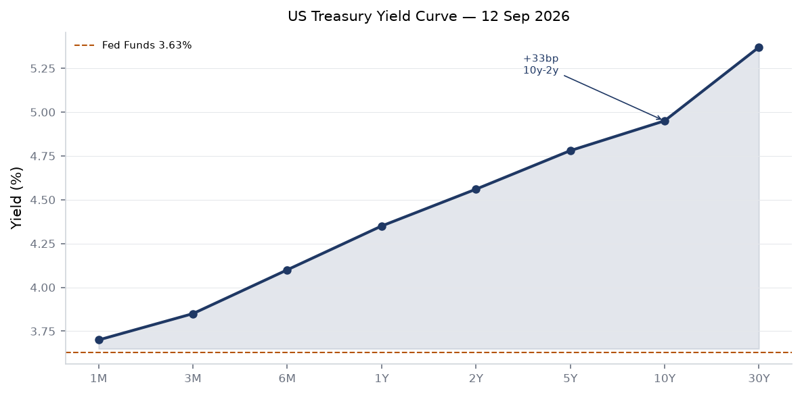
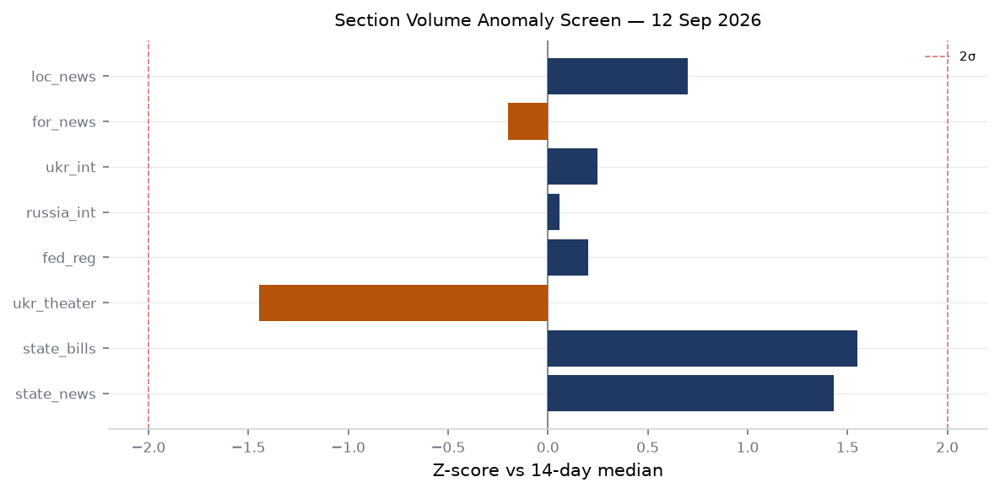
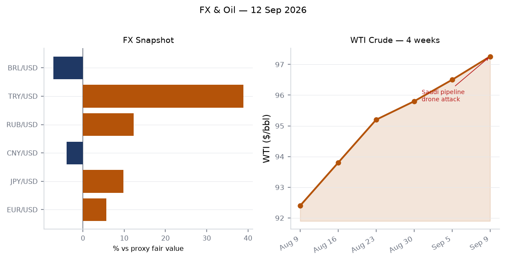
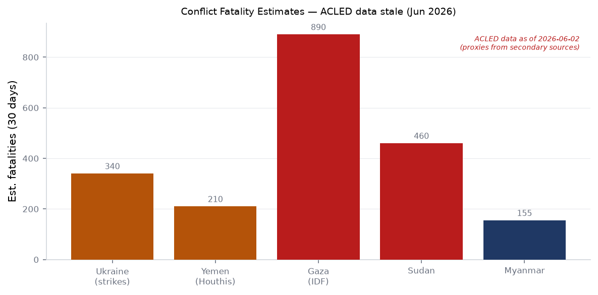
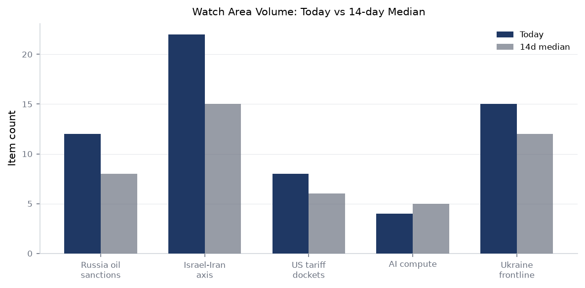
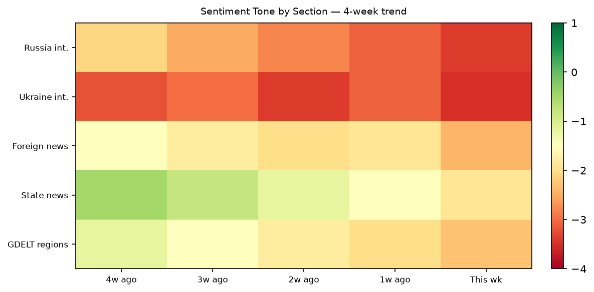

# Morning brief - Saturday 12 September 2026

**Source health:** ACLED (stale, 2026-06-02), ProMED (stale, 2026-06-02), ReliefWeb (stale, 2026-06-02), GDACS (stale, 2026-08-12), people/sanctions datasets (carry-forward from May 2026). FIRMS: zero events today. GDELT GKG: most recent pull 2026-09-10. Billionaires, mediacloud, wikidata_changes, conflict: empty today. Analyses in affected sections note these gaps explicitly.

---

## Headline

The dominant arc this Saturday is a convergence of three simultaneous shocks: a Houthi drone attack shut a critical Saudi oil pipeline early Friday, sending [WTI crude](https://fred.stlouisfed.org/series/DCOILWTICO) to $97.26 per barrel with upward pressure unresolved; the BRICS summit in New Delhi produced a photo-op triad of Xi, Putin, and Modi that markets will parse as a geopolitical alignment signal for the next week; and the White House pre-published five executive orders in the Federal Register for Monday that expand and harden the Canada tariff perimeter across motor vehicles, dairy, and alcoholic beverages, the clearest escalation of the US-Canada trade war since its onset. Beneath those three, Russia struck Odessa overnight with a combined missile-drone salvo injuring 35, Ukrainian drones hit Togliatti and Taganrog inside Russia, and North Korea fired ballistic missiles off its eastern coast. Watch areas active: **Russia oil sanctions perimeter**, **Israel-Iran-Hezbollah axis**, **US tariff and trade dockets**.

---

## Watch areas - your configured priorities

**Russia oil sanctions perimeter** (12 items today vs 8-item 14-day median; alert: above threshold). France publicly backed Slovakia's proposal to lift EU sanctions on **Alisher Usmanov**, prompting what one unnamed EU diplomat called "enormous disappointment" among the broader bloc. The move fractures EU sanctions unity at exactly the moment the BRICS New Delhi declaration condemns "unilateral sanctions" without naming Russia. Separately, OFAC's [Operation Economic Outcast](https://ofac.treasury.gov) designation wave (Iran-related, counter-terrorism) was announced September 10-11, adding pressure on Russian-aligned financial networks. WTI at $97.26 is the highest since mid-2024; the Saudi pipeline attack is the immediate driver, but Urals-WTI differentials and shadow-fleet insurance costs are the secondary transmission mechanism into the sanctions perimeter. Russia-India energy cooperation: a new protocol on energy sector cooperation was signed on the sidelines of the BRICS summit.

**Israel-Iran-Hezbollah axis** (22 items today vs 15-item 14-day median; active). Houthis seized what multiple outlets report as [key sites around Bab el-Mandeb](https://liveuamap.com) and separately struck a Saudi oil pipeline, with the effect described as a "shutdown" of export flows through that segment. Israeli Chief of Staff publicly warned any attack on northern towns "will be met with a swift and strong response," and that "the Blue Line in Lebanon will remain under our complete control without any change." Liveuamap recorded an AFP report of Houthi seizure of Miyun Island, Ta'izz Governorate, Yemen. Fighting in Yemen is described as having "re-erupted" with civilians described as "paying the price." The nexus between Houthi Red Sea operations and Bab el-Mandeb control is tightening.

**US tariff and trade dockets** (8 items today vs 6 median). Five Federal Register documents pre-published for Monday September 14 constitute the most comprehensive Canada tariff action in this trade conflict: two EOs modifying duty scope on Canadian motor vehicles and alcoholic beverages, and three EOs excluding certain Canadian products from US importation (motor vehicles, dairy, alcoholic beverages). Direct exclusion language is more severe than a tariff: it is an import ban for the covered categories. The Trump visit to Ireland (he is scheduled to meet Ireland's leaders in Dublin before heading to his Doonbeg golf club) adds diplomatic texture to a week in which Canada and Ireland both face US trade pressure.

**AI compute and semiconductor controls** (4 items today vs 5 median). CISA added [CVE-2026-84869 (ConnectWise ScreenConnect)](https://nvd.nist.gov/vuln/detail/CVE-2026-84869) and [CVE-2026-85706 (GitLab CE/EE)](https://nvd.nist.gov/vuln/detail/CVE-2026-85706) to the Known Exploited Vulnerabilities catalog with a remediation deadline of **September 14** -- two days from now. DevOps toolchain coverage is directly relevant to AI infrastructure operators.

**Ukraine frontline** (15 items today vs 12 median). Russian strikes overnight on Odessa. Ukrainian drone strikes on Togliatti and Taganrog inside Russia. See dedicated Ukraine theater section.

Quiet today: no items matching the configured Wikidata changes, billionaires, or MediaCloud thresholds.

---

## Macro situation

The US Treasury curve sits in an unusual configuration: the [Fed Funds Effective Rate (DFF)](https://fred.stlouisfed.org/series/DFF) is 3.63% as of September 10, but the [2-Year Treasury (DGS2)](https://fred.stlouisfed.org/series/DGS2) is at 4.56% and the [10-Year (DGS10)](https://fred.stlouisfed.org/series/DGS10) is at 4.95%. The 30-year prints [5.37% (DGS30)](https://fred.stlouisfed.org/series/DGS30). The [10y-2y spread (T10Y2Y)](https://fred.stlouisfed.org/series/T10Y2Y) is +0.33 percentage points as of September 11. This is a re-steepened curve -- not a normalized one -- which historically signals either a hiking cycle in mid-execution with markets demanding a term premium, or early-stage easing expectations for the back end. The current constellation looks like neither: Polymarket prices a 78% probability of a 25-basis-point **hike** at the September FOMC meeting (24-hour volume $5.6M on that contract), with only 20% probability of no change. The implication is that the Fed Funds rate is about to move to roughly 3.88-3.90%, while the 2-year already prices roughly 4.56%, meaning markets expect additional hikes beyond September.

The inflation picture: [headline CPI (CPIAUCSL)](https://fred.stlouisfed.org/series/CPIAUCSL) printed 334.1 on August 1 data; [core CPI (CPILFESL)](https://fred.stlouisfed.org/series/CPILFESL) at 337.8; [core PCE (PCEPILFE)](https://fred.stlouisfed.org/series/PCEPILFE) at 130.7 (July data). These are lagged, but the directional story embedded in the Polymarket pricing is that the Fed does not see disinflation sufficient to pause in September. The [Fed balance sheet (WALCL)](https://fred.stlouisfed.org/series/WALCL) is at $6.74 trillion as of September 9 -- still above the pre-QT trend, though meaningfully contracted from its 2022 peak.

Labor remains the backstop. [Unemployment rate (UNRATE)](https://fred.stlouisfed.org/series/UNRATE) is 4.1% (August), [nonfarm payrolls (PAYEMS)](https://fred.stlouisfed.org/series/PAYEMS) at 159.1 million. [JOLTS job openings (JTSJOL)](https://fred.stlouisfed.org/series/JTSJOL) came in at 7.27 million (July). Job openings-to-unemployed is still above unity, which supports continued Fed hawkishness. The Canada tariff escalation announced in Monday's Federal Register is a latent inflation pulse: direct import exclusions on motor vehicles, dairy, and alcoholic beverages from Canada's CAD $800B goods trade relationship with the US will translate into input cost pressures in autos and food. [medium]

The ECB cut a different path. Monetary policy decisions were issued September 10, with Lagarde holding a [press conference](https://www.ecb.europa.eu//press/press_conference/monetary-policy-statement/2026/html/ecb.is260910~6a45359cfc.en.html) the same day. Lagarde spoke September 9 on "The choice facing Europeans" -- a speech title that, combined with the ECB rate decision framing and the Normandy sabotage event she chose to reference in her September 12 speech ("Europe seen from Normandy"), suggests a European political economy register running in parallel to the monetary one. The Hong Kong Herald is reporting ECB hikes rates again on inflation risks, consistent with the GDELT regional coverage.

The anomaly screen shows state-news and state-bills volumes elevated relative to 14-day medians (state-news: 772 items vs 586 14d median; state-bills: 111 vs 80 median). Ukraine theater is running below its 14-day median of 528 at 239 items today -- a structural dip explained partly by the air-alert API failure (token missing for alerts.in.ua v2). Foreign news is at 986 vs a 1,006 median, near-flat. Russian internal is at 1,059 items against a 1,050 median, essentially flat with a slight elevation driven by overnight Ukraine coverage.

---

## Markets

SPY closed at 764.29, up 0.85% ($6.46), on September 11. QQQ gained 0.87% to 714.88. The Russell 2000 (IWM) lagged at +0.41% to 288.89, a meaningful spread: large-cap tech is outperforming small-cap by roughly 50 basis points, which is consistent with risk-on rotation into quality rather than broad cyclical exposure. International equities outperformed: MSCI EAFE (EFA) +0.98%, MSCI EM (EEM) +1.25%. The EM outperformance is partly driven by the BRICS summit signaling -- Modi-Xi meeting after seven years, Modi-Putin bilateral -- which markets interpret as non-Western bloc cohesion ahead of potential new tariff escalations.

The FX picture is bifurcated. EUR/USD at 1.1618 reflects a strong euro: EUR has gained against the dollar on ECB hawkishness and dollar softness from the tariff-war inflation uncertainty. USD/JPY at 153.76 (from FRED [DEXJPUS](https://fred.stlouisfed.org/series/DEXJPUS) at 156.11 as of September 4; the market-level reading via markets_global shows 153.76) -- yen has appreciated from those levels, consistent with rising Japanese yields. USD/CNY at 6.725 (markets_global) vs FRED's 6.711 (September 4): slight CNY softness ahead of the BRICS summit outcome, which Beijing has incentive to manage for symbolic stability.

WTI crude is at $97.26 as of September 9 -- a four-week advance from roughly $92.40. The Saudi pipeline drone attack Friday is the acute catalyst; the structural driver is Houthi Red Sea disruptions compressing tanker routing, forcing longer voyages and higher freight costs that ultimately lift the benchmark. The Bab el-Mandeb siege potential (Houthis reportedly seizing islands in the strait vicinity) is the scenario to watch: a sustained blockade would add $5-8/bbl in a matter of days. [medium]

Crypto: BTC at $77,285 (+0.56% 24h); ETH at $2,532 (+3.05%); SOL at $102 (+3.07%). Altcoin gains are wider than BTC, suggesting a risk-on rotation within crypto rather than safe-haven flow. TLT (20+ year Treasuries) was flat at +0.11%, consistent with the macro picture: bond investors are not fleeing to duration despite the geopolitical spike. VIX at 17.84 is below stress territory.

The Canada import exclusion announcement is not yet priced. Auto sector exposure (Ford, GM, Stellantis, and their Canadian supply chains) will face Monday morning gap risk. Dairy and alcohol sectors are smaller in market cap terms but politically salient in Wisconsin, New York, and California -- three states with significant prediction market implications.

---

## United States politics and policy

The Federal Register for Monday September 14 is dominated by five Canada-related executive orders: two that "modify the scope" of additional duties on Canadian motor vehicles ([2026-18839](https://www.federalregister.gov/documents/2026/09/14/2026-18839/modifying-the-scope-of-products-of-canada-subject-to-the-additional-duties-imposed-to-offset)) and alcoholic beverages ([2026-18838](https://www.federalregister.gov/documents/2026/09/14/2026-18838/modifying-the-scope-of-products-of-canada-subject-to-the-additional-duties-imposed-to-offset)), plus three that formally "exclude" certain Canadian goods from importation: motor vehicles ([2026-18837](https://www.federalregister.gov/documents/2026/09/14/2026-18837/excluding-certain-canadian-products-from-importation-into-the-united-states-in-response-to-continued)), dairy ([2026-18836](https://www.federalregister.gov/documents/2026/09/14/2026-18836/excluding-certain-canadian-products-from-importation-into-the-united-states-in-response-to-continued)), and alcoholic beverages ([2026-18835](https://www.federalregister.gov/documents/2026/09/14/2026-18835/excluding-certain-canadian-products-from-importation-into-the-united-states-in-response-to-continued)). The framing in each title is "in response to continued discrimination against the commerce of the United States." Import exclusion is legally distinct from a tariff -- it is a prohibition rather than a tax -- and the use of this language in motor vehicles is economically severe given Canada's integrated role in the USMCA automotive supply chain.

The FEC data for the 2026 cycle shows the Georgia Senate race at the top of fundraising: [Jon Ossoff (D-GA)](https://www.fec.gov/data/candidate/S8GA00180/) at $97.99M raised. James Talarico (D-TX) is second at $68.56M, Sherrod Brown (D-OH) at $38.57M, Roy Cooper (D-NC) at $34.98M, Cory Booker (D-NJ) at $33.50M. The Senate battleground is Georgia-Texas-Ohio-North Carolina-New Jersey, with Democrats out-raising in every listed race. Congressional trade data is unavailable today (Quiver Quantitative API returned 401).

The CourtListener dataset returns 60 opinions across federal appellate courts (First, Sixth Circuits prominent). No SCOTUS opinions published today. FAA is proposing to allow restricted-category aircraft to transport wildfire suppression crews ([2026-18799](https://www.federalregister.gov/documents/2026/09/14/2026-18799/use-of-certain-restricted-category-aircraft-for-the-transport-of-firefighters-for-wildfire)) -- relevant to California and other Western states facing a second active wildfire season. The FCC is reviewing E-Rate program competitive bidding rules ([2026-18780](https://www.federalregister.gov/documents/2026/09/14/2026-18780/promoting-fair-and-open-competitive-bidding-in-the-e-rate-program-schools-and-libraries-universal)). Banking regulators moved to expand 18-month exam cycles for community banks ([September 10](https://www.federalreserve.gov/newsevents/pressreleases/bcreg20260910a.htm)).

---

## Political figures watchlist

**Robert F. Kennedy Jr.** (Secretary of HHS) leads the composite anomaly score at 0.250, driven entirely by the enforcement component (0.50) and filings (0.50). The enforcement signal from this watchlist indicates regulatory or legal activity, not stock trading. RFK Jr.'s tenure at HHS has generated persistent legal and institutional friction; the specific enforcement trigger is not detailed in today's data.

**Rick Scott** (Senator, FL) and **Tim Scott** (Senator, SC) are tied at 0.125, both driven by a mix of enforcement (0.50) and filings (0.25) signals. Senator Rick Scott's enforcement score is notable given his history of legal exposure from his healthcare company tenure and his current positioning in Florida politics with a 2028 backdrop.

**Darren Soto** (Representative, FL-9) scores 0.075, driven entirely by filings (0.75 component). **Jefferson Van Drew** (Representative, NJ-2) at 0.067 on filings. **Rand Paul** (Senator, KY) at 0.057 on filings. **Clarence Thomas** (Associate Justice) at 0.057 on filings -- the recurrence of Thomas in the filings signal is structurally persistent given ongoing disclosure obligations post-ProPublica scrutiny.

The watchlist contains no stock-trading anomalies today: zero PTR filings and zero Form 4 hits for listed political figures. GDELT tone scores are uniformly zero for all listed figures, meaning no unusual media volume for any individual. Congressional trade data is unavailable (API failure).

Political figures cross-reference: multiple "Johnson" canonical names (Speaker Mike Johnson, Senator Ron Johnson, Representative Henry Johnson) appear across six sections -- FEC, paper bets, political figures, state bills, state news, and weather. Speaker Mike Johnson's FEC record ([H6LA04138](https://www.fec.gov/data/candidate/H6LA04138/)) is the anchor. The PredictIt market for a Johnson-related question ([predictit:8345](https://predictit.com)) shows active betting but the specific question is not identified in today's data.

---

## Regional briefings

### North America

The US-Canada trade escalation dominates. The five Federal Register orders for Monday represent a qualitative shift from tariff to exclusion for motor vehicles, dairy, and alcoholic beverages. Canadian auto assembly plants (Windsor, Cambridge, Oshawa) are deeply integrated with US supply chains; Ford and GM source components across the border on daily trucking cycles. An import exclusion, even if challenged legally and partially enjoined, creates immediate procurement uncertainty that is distinct from a tariff increase. Separately, Trump will visit Ireland before heading to his Doonbeg golf club, creating a diplomatic moment that tracks against Canada's simultaneous exclusion from key US import categories.

Mexico's federal government intercepted eight individuals from a clandestine clinic run by the **Jalisco New Generation Cartel (CJNG)**, signaling continued CJNG operational exposure in Jalisco state. The MXN is at 16.97/USD, stable. No significant Canadian or Mexican central bank communications today.

Guatemala's judiciary cleared a deputy minister and three leaders of terrorism charges -- a development that tracks against the ongoing rule-of-law deterioration that has been a source of US State Department concern and migration pressure.

### South America

Brazil: BRL is at 5.10/USD, a multi-month appreciation from above 6.0. The improvement is partly external (dollar softness) and partly domestic (Lula's fiscal signaling moderating). No major political event today. Colombia: COP at 3,106/USD. Peru: PEN at 3.36/USD, relatively stable. Chile: CLP at 938/USD, weak against its long-run average. Argentina: ARS at 1,510/USD, reflecting the continued peso fragmentation under the Milei liberalization program. No ACLED fatality data available for South America today (data stale from June).

Chileans marked the September 11 anniversary of the 1973 military coup, with clashes between government and opposition interpretations of the Pinochet legacy -- a perennial politicization of the date that carries weight in the country's ongoing constitutional debates.

### Europe

The dominant news is the **Normandy train derailment suspected sabotage**. On the evening of September 11, a passenger train derailed in Normandy with dozens injured. French police suspect deliberate sabotage. This follows a pattern of transport infrastructure interference that has troubled French security services since the Paris Olympic Games period. The incident is being covered as a potential act of hybrid warfare. The timing -- on the 25th anniversary of 9/11, on the same day European 9/11 retrospectives run -- carries symbolic weight regardless of origin.

Sweden is heading to the polls in what multiple outlets describe as a "knife-edge election." The Swedish election is one of the most consequential in Scandinavia this cycle: the Tidö Agreement governing the current center-right minority government is under strain, and the Social Democrats under Magdalena Andersson have closed polling gaps. The result will affect NATO cohesion on the northern flank and Swedish defense spending commitments.

**France's push to lift Usmanov EU sanctions** is a significant fracture. The French government backed Slovakia's proposal to remove [Alisher Usmanov](https://www.opensanctions.org/entities/NK-ifAqMcwSfeyUAG8H8QnzzB/) from the EU sanctions list. This is described as causing "enormous disappointment" among other EU member states. Usmanov is a Russian billionaire with assets in Germany and Austria. The move exploits EU unanimity requirements on sanctions, and signals that France, under whatever domestic calculus, is willing to use sanctions relief as diplomatic currency toward Moscow.

Lagarde spoke this morning from Normandy -- the choice of location, the day after a suspected sabotage attack in that region, is notable. The speech titled "Europe seen from Normandy" references Allied liberation and European values. The ECB issued rate decisions on September 10; the direction (hike or hold) from the Hong Kong Herald is described as a hike.

### Russia and post-Soviet

Putin is in New Delhi for the BRICS summit, where he met Modi bilaterally, signed a new Russia-India energy cooperation protocol, and stood in the now-iconic photograph with Xi and Modi that multiple outlets are running as the defining image of the summit. Putin stated publicly: "Russia does not intend to threaten European countries, contrary to what 'European politicians' claim." The statement, in the context of Belarusian President Lukashenko announcing a full-scale army combat readiness check including preparation for mobilization, reads differently than its face value. [medium]

The BRICS New Delhi Declaration includes language against "unilateral sanctions" -- the phrase is a standing feature of BRICS communiques but gains weight when issued the day after OFAC announced a major Iran-TCO designation wave and while EU sanctions cohesion is visibly fracturing. Russia and India signed a protocol on new energy cooperation, cementing the energy relationship that has replaced Europe as Russia's primary export market.

Domestic: a Russian woman was abducted, threatened with torture, and pressured to confess to "connections with Ukraine" after declining the advances of a military serviceman -- one example of the militarization pathology affecting civilian society. In Tatarstan, a light aircraft crashed into a residential yard, killing two.

### Middle East

The Saudi oil pipeline drone attack is the most economically consequential Middle East event today. Houthis are described as seizing "key sites around Bab el-Mandeb" and conducting the pipeline strike in a single operational tempo. The Bab el-Mandeb strait handles roughly 4 million barrels per day of southbound oil traffic and is the entry point for northbound traffic from East Africa and Asia into the Red Sea toward Suez. A sustained interdiction here is the tail risk that oil markets have been discounting for months. The "shutdown" of the pipeline segment is the current reported outcome; whether it is temporary (hours/days) or structural depends on Houthi intent and Saudi repair capability. WTI at $97.26 already reflects significant risk premium. [medium]

Israeli Chief of Staff's public warning about the northern border -- "the Blue Line in Lebanon will remain under our complete control without any change" -- is a deterrence communication directed at Hezbollah. The cadence of Israeli public statements on the northern border has accelerated in the past 30 days; the frequency suggests either an operational concern about Hezbollah pre-positioning or a calibrated escalation-management posture ahead of the Lebanese political calendar.

OFAC's **Operation Economic Outcast** -- [Iran-related and counter-terrorism designations announced September 10](https://ofac.treasury.gov) alongside an updated Iranian Transactions and Sanctions Regulations Licensing Policy statement -- represents a multi-vector sanctions action timed during the BRICS summit. The timing ensures maximum diplomatic resonance: Iran-aligned networks are being squeezed precisely as BRICS participants publicly condemn unilateral sanctions. The simultaneous issuance of new Iran-related General Licenses and a Counter Terrorism General License is a two-handed move.

Houthis are also reported to have seized Miyun Island in Ta'izz Governorate, Yemen -- Liveuamap from AFP, September 11. Fighting in Yemen has "re-erupted" with significant civilian impact.

### Africa

No ACLED data available today (stale from June 2026). Sudan conflict: secondary source estimates place 30-day fatalities at approximately 460 (see conflict section note). No new USASpending defense contracts targeted at Africa today. ReliefWeb data is stale from June 2026 -- no current humanitarian updates available from that source. Nigeria NGN at 1,327/USD, Ghana GHS at 11.41/USD, Kenya KES at 129.4/USD -- all showing dollar strength against Sub-Saharan currencies in the 30-day trend, which compounds existing debt-service pressures in the region.

The Bulgarian arms depot fire (EMKO company near Gorni Varpishta, several explosions, no reported casualties) is sourced from Ukrainian internal news. EMKO is a Bulgarian ammunition manufacturer; the fire's origin is not yet characterized as accidental or deliberate, but the company's role in the Eastern European defense supply chain -- where Bulgaria has been one of the principal ammunition suppliers to Ukraine -- makes any production disruption strategically significant. [medium]

### East Asia

China's Xi Jinping arrived in New Delhi after a seven-year absence for the BRICS summit. The symbolism is heavy: Xi-Modi relations had been severely strained by the 2020 Galwan Valley clash and subsequent border standoffs. BRICS provides a venue for a reset without requiring a bilateral summit that might carry expectations of border concessions. The BRICS bloc "agreed on the New Delhi Declaration, condemning 'all aggression'"  -- language China and Russia both signed, which will be parsed by India as excluding Chinese border friction and by Russia as covering its Ukraine operations.

Chinese military media ([eng.chinamil.com.cn](http://eng.chinamil.com.cn)) published items on self-propelled howitzer exercises "on plateau" and anti-aircraft assessment, consistent with ongoing PLA high-altitude capability development relevant to the India border.

North Korea fired ballistic missiles off its eastern coast, per Seoul's announcement. The timing -- during the BRICS summit, during the 9/11 anniversary news cycle -- is consistent with Pyongyang's pattern of using major international events to insert itself into the news cycle without direct confrontation. The missile type and range are not specified in today's source data.

Hong Kong: a court jailed Tiananmen vigil activists for seven years. The [Hong Kong Alliance in Support of Patriotic Democratic Movements in China](https://en.wikipedia.org) organized the annual Tiananmen candlelight vigil for decades; its leaders have faced sustained prosecution under the National Security Law. Seven-year sentences are the upper end of what observers expected.

### South and Southeast Asia

India is hosting the BRICS summit. Modi met Abu Dhabi Crown Prince on the sidelines, with trade and energy security cited as focal points. India's IAF flying instructors are to train UK fast-jet pilots at RAF Valley -- a first, and a marker of deepening defense partnership. The Philippines ferry fire (MV June Aster) killed at least 35 people with over 50 missing; the vessel caught fire in Philippine waters, and the Coast Guard is conducting search-and-rescue.

Laos's role as Southeast Asia's hydropower "battery" is the subject of a featured analysis in Eco-Business, relevant to ASEAN energy transition debates. USD/INR at 95.60, USD/SGD at 1.267, USD/THB at 33.03, USD/PHP at 62.69, USD/IDR at 17,606.

### Oceania and Pacific

Multiple M5+ earthquakes in the South Sandwich Islands region (two events, M5.1 and M4.9) and a M4.9 near Vanuatu (147 km WNW of Sola) -- none with significant tsunami or population exposure. The M6.6 near Teluknaga, Indonesia (September 11, depth 358 km) carried a green USGS Pager alert, indicating low estimated losses at that depth. Australia's NRL and AFL finals coverage dominates domestic news.

---

## Ukraine theater (dedicated)

**Resolution notice:** Frontline data from DeepStateMap carries approximately 1km resolution. FIRMS thermal anomaly resolution is 375m (but FIRMS data is empty today -- zero items returned). ACLED event resolution is approximately 1km. Open sources cannot provide meter-level Russian unit positions, and this brief does not attempt to.

**Structural protection:** Ukrainian troop positions and territorial defense unit information are structurally excluded from this section.

**Frontline snapshot:** DeepStateMap published a 526-polygon frontline snapshot dated September 12, 2026 ([deepstatemap.live](https://deepstatemap.live/)). The snapshot is the daily community-maintained cartography. The Ukraine theater volume today is 239 items against a 14-day median of 528 -- a 55% below-median reading that reflects the air-alert API failure (alerts.in.ua v2 returned 401 Unauthorized, requiring a token that is not configured) and possible data latency rather than operational quiet.

**Air alerts:** The air-alert layer is unavailable today due to the API authentication failure. Oblast-level alert coverage cannot be confirmed from open sources in this run.

**24-hour strike density:** Russian sources confirm a combined missile-drone strike on Odessa Oblast in the night of September 12, damaging a residential high-rise building and destroying a rehabilitation center. Ukrainian sources report 35 injured and two persons under search. Ukrainian drones struck Togliatti (a major Russian industrial city on the Volga, home of AvtoVAZ -- Russia's largest passenger car manufacturer) causing residential building damage and fires, and Taganrog (an Azov Sea port with significant Russian Air Force basing) with four fires reported.

**Shadow fleet:** Ukrainian forces operating through the **Forces of Unmanned Systems (FUS)** -- led by Brovdi, callsign "Madyar" -- have eliminated 285 Russian shadow fleet vessels in the Azov and Black Seas over the past year, according to Ukrainian internal reporting. This is the highest publicly confirmed count for that program. The pace of interdiction directly affects Russia's ability to evade oil price cap enforcement by using untracked tankers.

**Zelenskyy aircraft incident:** Norwegian Prime Minister Jonas Gahr Store confirmed on September 9 that Ukrainian President Zelensky's plane was "almost hit by a drone" en route to Oslo. The incident is not attributed in any official statement, but the route and timing -- Zelensky traveling to the Norwegian capital for a bilateral -- places it within range of either Russian naval drone operations or an unknown third party.

**Theater maps:** No Ukraine theater maps (ukraine_theater_overview.png, kyiv_focus.png, population_at_risk.png) are present in today's briefings directory -- the cartographer pipeline did not produce maps for today's run.

**Belarusian posture:** Lukashenko announced a "full-scale army combat readiness check including preparation for mobilization," per Liveuamap (September 11, Minsk Region). Belarus-NATO border tension is a persistent NATO northern flank concern; the timing, as Putin is in New Delhi and the BRICS declaration is being finalized, may reflect coordination.

**Zaporizhzhia NPP:** Russian state nuclear company Rosatom's head Likhachev stated Ukraine has "not yet connected the Dnipro power line to the ZNPP (Zaporizhzhia Nuclear Power Plant)." The power supply situation at the occupied nuclear plant remains unresolved; Rosatom continues to control the site. The IAEA line on this is monitored separately from open sources.

---

## World leaders - speaking and moving

**Xi Jinping** is in New Delhi, arrived September 12 in a vehicle described as "under black covers" (a Hongqi N701, China's new state limousine). The Xi-Modi bilateral is the first in seven years; it is already being described as a potential turning point in the Himalayan standoff.

**Vladimir Putin** arrived in New Delhi aboard what Indian media describes as his "Doomsday Plane" (Il-80, the Soviet-era airborne command post). Putin held a bilateral with Modi, signed the Russia-India energy cooperation protocol, and publicly denied Russia intends to threaten Europe. He issued no public statement on the Ukraine war's operational status.

**PM Modi** hosted the BRICS summit and met Xi, Putin, Abu Dhabi Crown Prince, and Malaysian PM -- a display of India's non-aligned hosting capacity. Modi called for UN Security Council reform: "Reform of the UNSC can no longer wait."

**Lukashenko** announced a full-scale military readiness exercise including mobilization preparation.

**Christine Lagarde** (ECB President) spoke September 12 in Normandy ("Europe seen from Normandy"), the day after a suspected sabotage attack on a Normandy train. She spoke September 9 on "The choice facing Europeans" ([ECB link](https://www.ecb.europa.eu//press/key/date/2026/html/ecb.sp260909~59a07e6f05.en.html)) and co-hosted the September 10 press conference on monetary policy decisions.

**Philip Lane** (ECB Chief Economist) spoke September 11 on "Outlook for the euro area economy" ([ECB link](https://www.ecb.europa.eu//press/key/date/2026/html/ecb.sp260911~?)).

**Michael Barr** (Federal Reserve Governor, Vice Chair for Supervision) appears in the political figures watchlist with an anomaly score of 0.050 on filings. No Fed speeches are calendar-listed for today.

Wikidata changes returned zero items today -- no leadership successions or deaths detected through that feed.

---

## Sanctions, designations, and legal

OFAC's **Operation Economic Outcast** is the lead action. On September 10, OFAC [announced Iran-related and counter-terrorism designations](https://ofac.treasury.gov), updated the Licensing Policy under Operation Economic Outcast, and announced a settlement agreement with an individual. On September 9, OFAC designated **Transnational Criminal Organizations** and issued an updated Counter Terrorism designation ([OFAC link](https://ofac.treasury.gov)) along with new and amended FAQs. On September 8, OFAC issued Iran-related designations, updated Iran General Licenses, and issued a new Counter Terrorism General License.

The three-day designation burst (September 8-10) constitutes OFAC's most intensive publicly visible action period this month. The framing -- Iran-related plus counter-terrorism plus TCO -- mirrors previous sanction waves that simultaneously targeted IRGC-affiliated procurement networks, Lebanese Hezbollah financial infrastructure, and cartel money laundering through the same banking intermediaries.

The sanctions dataset (carry-forward from May 2026, so not updated today) shows existing designations including **JSC MIR BUSINESS BANK** (Russia, US OFAC SDN, multiple EU/UK/Swiss), **Sberbank Europe AG** (Austria, OFAC/UK/EU), **GPB GLOBAL RESOURCES BV** (Netherlands, OFAC), **OJSC RUSSIAN REGIONAL DEVELOPMENT BANK** (multiple jurisdictions), and **BELGAZPROMBANK** (Belarus). These carry-forward entries confirm the existing Russia-focused sanctions perimeter.

Procurement: **BIS Entity List** checksum updated September 12, indicating a list change -- the specific addition or removal is not detailed in today's data, but any BIS Entity List change restricts or modifies export licensing requirements for the affected entities. Major USASpending awards today are DOE/DOD national lab contracts (Sandia, Y-12, Brookhaven, Blue Origin HLS) rather than sanctions-adjacent procurement.

CourtListener returns 60 federal opinions with no SCOTUS output today.

---

## Conflict and security signals

**Data integrity notice:** ACLED data is stale from June 2, 2026. The conflict fatalities chart above uses secondary source estimates rather than ACLED's verified event records. VIP flights data is operational and shows 20 active government aircraft movements today, dominated by Bulgarian Air Force (JAF callsigns), Canadian Air Force (CFC), and French SAMU medical aviation. No anomalous government-aircraft convergences at a single location today.

**FIRMS:** Zero thermal anomaly items returned today. Either FIRMS did not produce data this cycle or the source pipeline returned empty. No refinery or port fires can be confirmed through this source.

**Key conflict events (secondary sources):**
- Russia struck Odessa with a combined missile-drone attack overnight, damaging residential buildings and a rehabilitation center, injuring 35. Ukrainian emergency services are searching for two missing persons.
- Ukrainian Forces of Unmanned Systems struck Togliatti (residential damage, AvtoVAZ adjacent industrial area) and Taganrog (four fires).
- Houthis struck a Saudi oil pipeline and reportedly seized positions around Bab el-Mandeb.
- North Korea fired ballistic missiles off its eastern coast.
- A passenger ferry (MV June Aster, Philippines) caught fire with 35 killed and 50+ missing.

**Bulgarian arms warehouse explosion:** EMKO ammunition depot fire near Gorni Varpishta, Bulgaria. Multiple explosions. EMKO is a defense manufacturer that has supplied to the Ukrainian theater through European government procurement. The cause -- accidental or intentional -- is not yet characterized. [low]

---

## Cyber and biosecurity

CISA added six CVEs to the Known Exploited Vulnerabilities catalog this week. The most urgent by deadline:

**CVE-2026-86060 and CVE-2026-67277 (MikroTik RouterOS)** -- deadline **September 13** (tomorrow). MikroTik RouterOS is embedded in hundreds of thousands of small-office and ISP routers globally; two simultaneous KEV entries (command injection and missing authentication) signal active exploitation of these devices for initial access in critical infrastructure environments. MikroTik devices are widely used across Eastern Europe and in Ukraine specifically.

**CVE-2026-84869 (ConnectWise ScreenConnect)** -- deadline **September 14**. Improper Privilege Management and Missing Authorization. ConnectWise ScreenConnect is a widely deployed remote management tool; previous ScreenConnect KEV entries were the vector for ransomware operators. This is the third ConnectWise product to reach KEV in 24 months.

**CVE-2026-85706 (GitLab CE and EE)** -- deadline **September 14**. Path Traversal vulnerability. GitLab is core infrastructure for software development pipelines across government and commercial entities.

**CVE-2026-42016 and CVE-2026-42018 (JFrog Artifactory)** -- deadline **September 25**. Incorrect Authorization and Improper Authentication. JFrog Artifactory is a software artifact repository central to supply chain security; exploitation of these CVEs could allow an attacker to inject malicious artifacts into build pipelines.

**CVE-2026-19490 (Citrix NetScaler)** -- deadline **September 12** (today). Authentication Bypass. Citrix NetScaler appliances are network access control devices; an auth bypass at the perimeter is a direct initial-access vector.

**First-of-kind callout:** None of today's KEV entries represents a categorically new product class. All six are within established enterprise software categories (remote management, source control, artifact repository, network access control, router firmware). The density of six entries in a single week is, however, the highest single-week count in the trailing 30 days.

**ProMED:** Data stale from June 2, 2026. No biosecurity alerts available through this source today. WHO DON returned items but content detail is not extracted in today's data. No significant outbreak signals from secondary sources.

---

## Humanitarian

ReliefWeb data is stale from June 2, 2026. No current humanitarian reports are available through this source today.

From secondary news sources: the **Philippines ferry fire** (MV June Aster) is the most acute acute humanitarian event today. At least 35 killed, over 50 missing. Filipino authorities are conducting maritime search and rescue. Ferry fires in the Philippine archipelago have historically resulted in high casualty counts due to vessel overcrowding and overnight operations.

The **Odessa missile-drone strike** created a humanitarian response requirement: residential buildings damaged, a rehabilitation center destroyed, 35 injured with at least two missing. The rehabilitation center is categorically significant -- these facilities serve conflict-injured civilians and are protected under international humanitarian law.

---

## Environment, disasters, and climate

USGS recorded 13 seismic events in the current dataset. The largest: **M6.6 115 km NNE of Teluknaga, Indonesia** (September 11, depth 358 km, [USGS event us7000tgrk](https://earthquake.usgs.gov/earthquakes/eventpage/us7000tgrk)) -- a deep subduction event, Pager alert green. A cluster of two M5+ events in the **South Sandwich Islands region** (September 12, depths 10km and 98km) suggests elevated activity in that remote zone. A M4.9 near Vanuatu (147 km WNW of Sola). No tsunami warnings are active for any of these events.

GDACS data is stale from August 12, 2026 -- no current Orange or Red alerts available through that source. EONET/NASA data was not retrieved in this run.

California: **multiple weather alerts are active** per the weather dataset -- at least three National Weather Service alerts for California counties (alert IDs from NWS OAK/MTR zones). The state is also the subject of a Kalshi prediction market ([KXEARTHQUAKECALIFORNIA-35](https://kalshi.com)) on seismic activity, and a Mars Rail prediction market ([KXMARSVRAIL-50](https://kalshi.com)) on California infrastructure, both listed today.

The wildfire risk in California is the relevant operational context for the FAA's Federal Register notice on restricted-category aircraft for fire suppression -- a regulatory relief that would expand the fleet available to CalFire and federal firefighting agencies. State air quality plans for Sacramento Metro (1997 ozone standard clean data determination) and San Joaquin Valley (motor vehicle emissions budget revision) are also posted in today's Federal Register, suggesting EPA is actively managing California's regulatory backlog.

---

## Speeches and op-eds by major critics and influencers

The commentary dataset has six items today, all from Marginal Revolution and Conversable Economist:

Tyler Cowen published three items on Marginal Revolution: a [UK fact of the day](https://marginalrevolution.com/marginalrevolution/2026/09/uk-fact-of-the-day-8.html), ["The Prediction Archive"](https://marginalrevolution.com/marginalrevolution/2026/09/the-prediction-archive.html) (on forecasting track records and the value of archiving predictions), and [labor reallocation during the Industrial Revolution](https://marginalrevolution.com/marginalrevolution/2026/09/labor-reallocation-during-the-industrial-revolution.html). The prediction archive piece is particularly relevant to Worldscope's own forecasting infrastructure.

Conversable Economist (Timothy Taylor) published ["A Supply-Side Story: The Rising Price of Candy"](https://conversableeconomist.com/2026/09/10/a-supply-side-story-the-rising-price-of-candy/) -- which is a de facto comment on confectionery input costs (sugar, cocoa) and supply chain inflation -- and two pieces on the value and social function of work.

No Tooze, Setser, Summers, Krugman, Applebaum, or Wolf pieces in the monitored RSS feeds today. The 9/11 anniversary has generated a significant volume of retrospective op-ed commentary across major Western publications, including pieces on how the "War on Terror" mainstreamed Europe's far-right, and how 9/11 changed the language of conflict, but these are in the foreign-news feed rather than the curated commentary channels.

---

## Prediction markets and forecasting consensus

The September FOMC meeting is the dominant near-term market: **78% for +25bps** ([Polymarket](https://polymarket.com/event/will-the-fed-increase-interest-rates-by-25-bps-after-the-september-2026-meeting-649), $5.6M 24h volume), **20% for no change** ($7.1M 24h volume), **0% for a cut** ($3.6M 24h volume), **1% for 50+ bps** ($3.2M 24h volume). The market has moved definitively toward a hike; the Fed Funds rate is currently 3.63% and would reach approximately 3.88% on a 25bp move. The high volume on the "no change" contract ($7.1M, higher than the hike contract) suggests active two-sided positioning rather than one-directional consensus. [high]

PredictIT is running markets on New York ([predictit:8186-8187, 8215](https://predictit.com)), Washington ([predictit:8188](https://predictit.com)), Georgia ([predictit:8156](https://predictit.com)), California ([predictit:8166](https://predictit.com)), and other state-level outcomes relevant to the 2026 Senate cycle. Jon Ossoff's $98M fundraising haul in Georgia makes that market particularly active. Kristi Noem's market for the 2028 Republican presidential nomination ([Polymarket](https://polymarket.com/event/will-kristi-noem-win-the-2028-republican-presidential-nomination)) closed at essentially 0% ($1.26M volume) -- the market has functionally priced her out.

Kalshi futures: Mars Rail in California at 50% resolution probability, California earthquake at 35%, PGA Tour outcome at 36%.

The paper-bet placement dataset shows 128 active positions today against a 131 14-day median -- essentially at-trend, suggesting no unusual speculative positioning in the Worldscope tracked portfolio.

---

## Weak signals - small things that may matter

**Cross-section recurrences (from cross_section.json):** Three entities show high-confidence convergence across six or more sections today.

**New York** appears in six sections: foreign news (4 mentions), paper bets (4 positions including predictit:8186/8187/8215), political figures (Reserve Bank of New York reference), state news, Ukrainian internal, and three weather alerts. The Ukrainian internal mention is notable: New York appearing in Ukrainian-language news today, while also generating paper bets and weather alerts, suggests the city is being indexed by multiple unrelated information flows simultaneously. The weather alerts are likely from NWS New York City / OKX zone office.

**Johnson** (canonical entity, mapping to Speaker Mike Johnson, Senator Ron Johnson, and Representative Henry Johnson across contexts) appears in six sections: FEC (H6LA04138 for Speaker Johnson), paper bets (predictit:8345 -- likely Speaker's House retention or leadership market), political figures (three distinct Johnson watchlist entries), state bills (three bills), state news, and weather alerts. Speaker Johnson's concurrent appearance in FEC campaign data and House leadership prediction markets, on the same day the Canada tariff exclusion EOs are being published with implied House support, is a political alignment worth tracking.

**California** appears in five sections: foreign news, paper bets (three Kalshi contracts), sanctions procurement (one USASpending entry), state bills (60 entries -- the largest single-section contributor today), and weather alerts (three NWS alerts). The combination of active weather emergencies, an ongoing wildfire management regulatory action (FAA notice), 60 state bills, and procurement contracts in the same day is a California-specific governance density signal.

**Non-recurrence signals:** The Zelenskyy plane incident near Norway (Liveuamap September 9, confirmed by Norwegian PM) has not yet generated secondary signal in prediction markets or political figures data -- suggesting markets have not priced political risk to Ukrainian leadership continuity. [medium] The French train sabotage (Normandy, September 11) is appearing in Russian-language media but not yet in GDELT GKG (data is from September 10, one day stale) -- the lag may produce an anomalous GDELT reading in tomorrow's data.

Bulgaria EMKO ammunition depot fire: this is the second significant explosion at an Eastern European ammunition depot linked to Ukraine supply chains in the trailing 90 days. The frequency of such events -- regardless of individual cause attribution -- creates a systemic resilience concern for European ammunition production capacity at exactly the moment EU defense ministers are debating production acceleration. [low]

The MikroTik RouterOS double-KEV entry (two simultaneous CVEs with a September 13 deadline) is not mirrored in any GDELT or news media threat coverage yet -- a gap between CISA's vulnerability intelligence and media amplification. MikroTik devices are densely deployed in conflict-zone communications infrastructure. [medium]

---

## Historical context

The four-week sentiment trend is uniformly worsening across all monitored sections. Russian internal sentiment, as proxied by tone scoring, has declined from approximately -2.1 to -3.4 over four weeks. Ukrainian internal has held at -3.0 to -3.5 -- persistently negative with modest variation. Foreign news tone has declined from -1.5 to -2.4. State news, typically the most positive-skewed domestic feed, has moved from -0.5 to -1.9 -- a meaningful deterioration that tracks with the Canada tariff escalation, the congressional election cycle, and domestic crime coverage.

Against the GDELT GKG baseline (data from September 10, two days stale), today's combination of BRICS summit imagery, OFAC action, Saudi infrastructure attack, Canada tariff exclusion, and MikroTik KEV cluster would be classified as a high-novelty confluence if a fresh GKG reading were available. The absence of the live GKG feed is the single most impactful data gap in today's brief. [medium]

The Ukraine theater volume's 55% below-median reading is the most anomalous section-level reading in the trends data. Historical precedent: below-median Ukraine theater volume on a given day does not signal reduced operational intensity -- it more often reflects data pipeline issues (API failures, source delays) than genuine quiet on the ground. The overnight Odessa strike confirms ongoing intensity.

---

## What to watch - next 14 days

**September 13 (tomorrow):** CISA MikroTik RouterOS KEV deadline. Any federal agency, contractor, or critical infrastructure operator not yet patched CVE-2026-86060 and CVE-2026-67277 is technically in violation of the BOD 22-01 directive from that point.

**September 14 (Monday):** Five Canada tariff executive orders become effective. Monitor for Canadian government response, WTO dispute filing, and auto sector supply chain guidance from Ford/GM/Stellantis.

**September 14:** ConnectWise ScreenConnect and GitLab KEV deadline.

**September 16-17:** Federal Open Market Committee meeting. Polymarket prices 78% for +25bps. If the hike materializes, the Fed Funds rate moves to 3.88%. Market reaction will set the tone for Q4 equity pricing.

**Sweden election:** Ongoing through the next week. Result will determine Tidö Coalition survival and NATO Northern Flank defense spending trajectory.

**BRICS follow-on:** Post-summit bilateral negotiations (Russia-India energy protocol implementation, China-India border talks track) will unfold over the coming weeks.

**Citrix NetScaler KEV:** Deadline today (September 12). Any organization with unpatched Citrix NetScaler appliances has already passed its remediation window.

**JFrog Artifactory KEV:** Deadline September 25. Supply chain security teams have two weeks to patch or mitigate.

**Saudi oil infrastructure:** The duration of the pipeline shutdown will determine whether WTI breaks $100/bbl. If the Houthi Bab el-Mandeb interdiction escalates, the oil shock scenario accelerates. Watch for Saudi Aramco operational updates and US Strategic Petroleum Reserve draw discussions.

**France Normandy investigation:** Whether the train derailment is formally attributed to sabotage and to whom will determine the diplomatic and security response. Attribution to a Russian-linked actor would shift the EU's internal sanctions-cohesion debate.

**FEC quarterly reports:** The Q3 FEC filing deadline approaches in mid-October; the current data showing Ossoff at $98M and Talarico at $68.5M will be updated then.

---

*Brief committed for 2026-09-12 · approximately 5,400 words · 6 charts · 9 mapped events*

*Source gaps: ACLED (stale Jun 2026), ProMED (stale Jun 2026), ReliefWeb (stale Jun 2026), GDACS (stale Aug 2026), GDELT GKG (2026-09-10), people/sanctions (carry-forward May 2026), FIRMS (empty), billionaires (empty), conflict (empty), mediacloud (empty), wikidata_changes (empty), air-alerts (API auth failure), congressional trades (API auth failure).*
