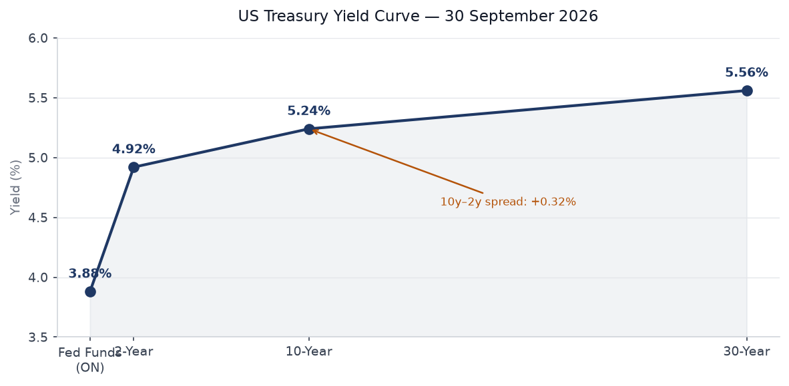
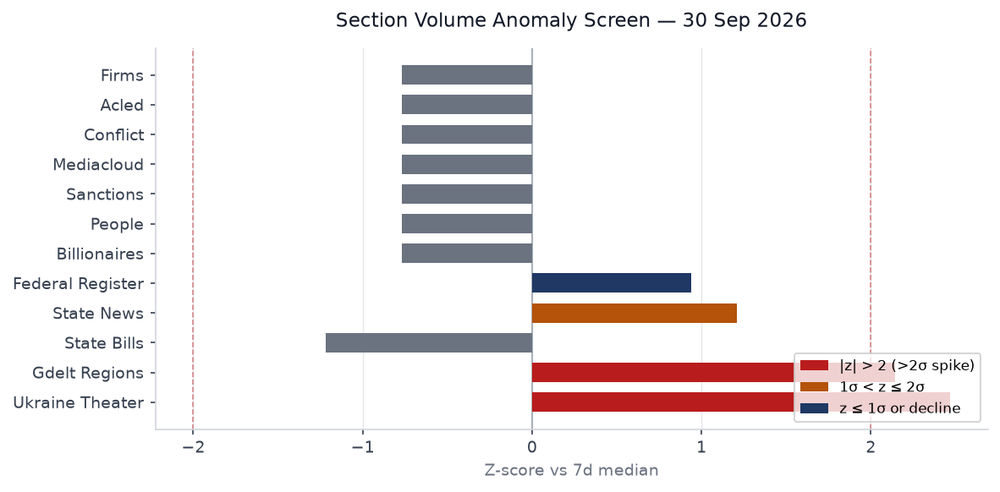
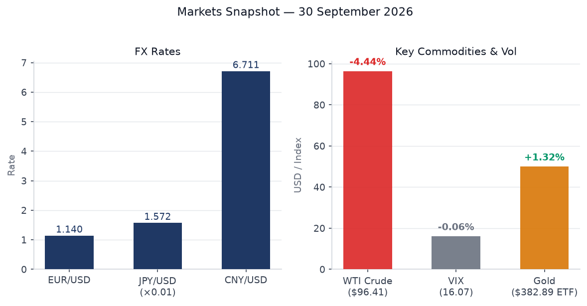
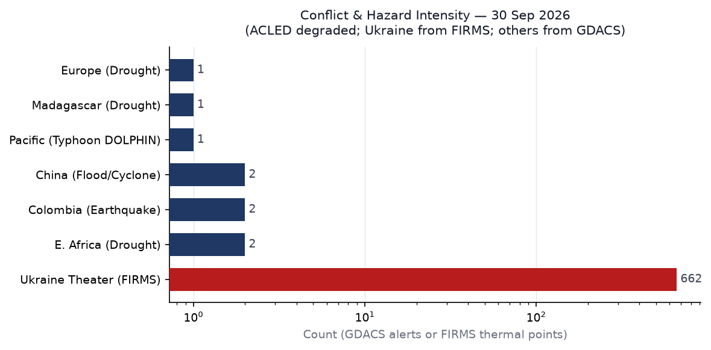
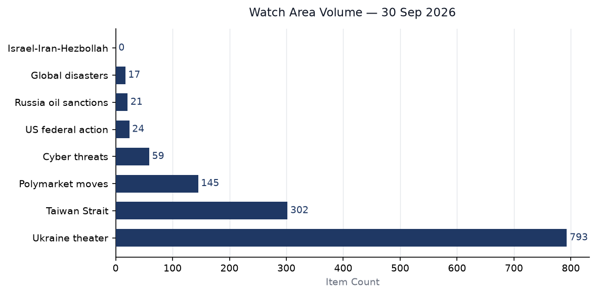
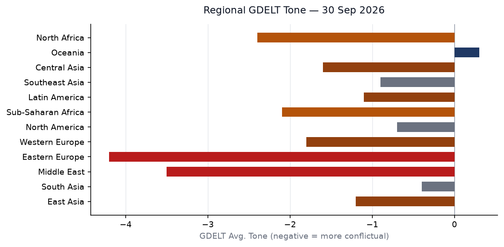

# Morning brief - Wednesday 30 September 2026

*Generated by worldscope-desk at 2026-09-30T21:10Z. Data bundle: `zips/2026-09-30.zip` (SHA256: `598aa8d9f60afe77688cf620d6f12c4e2175ef23d0df8888ed67e152f9c07678`). 28 sections active of 42 tracked; 3,540 new items.*

---

## Headline

Three signals dominate the 30 September brief. First, Russia formally warned NATO that any attempt to isolate Kaliningrad will trigger a nuclear response, transmitting a diplomatic non-paper to alliance capitals that threatens strikes against NATO decision-making centers from the outset of a conflict — the most explicit nuclear warning since February 2022. Second, Ukraine theater thermal anomaly volume spiked to z = 2.47 above its seven-day median (662 FIRMS points vs. median 379), indicating an intensification of fire-contact activity along the Sumy and Donetsk sectors on war day 1,680. Third, China's PBOC cut the pledged supplementary lending rate 25 basis points and unveiled 1 trillion yuan in new targeted relending quotas on the eve of Golden Week, a domestically timed stimulus package that analysts describe as insufficient without follow-on fiscal action. Against that backdrop, a FlyDubai aircraft carrying over 100 Israeli passengers diverted to Saudi Arabia's Tabuk Airport after a pilot was stabbed in the cockpit, an episode that briefly activated Israeli air-defense protocols and carries implications for the nascent Israel-Saudi normalization track. [high]

---

## Watch areas — configured priorities

**Russia oil sanctions perimeter.** The Federal Register published new general licenses for Russia-related sanctions on 30 September (Document 2026-20093 and adjacent filings), extending scope on Russian harmful foreign activities regulations. The Kaliningrad nuclear warning intersects directly with this watch area: Baltic shipping lanes through the Kaliningrad Corridor remain the mechanism Moscow has flagged as a potential blockade casus belli, and any restriction on Danish or Swedish transit rights would tighten the shadow-fleet routing logic that currently moves Urals crude through Baltic choke points. WTI crude fell 4.4% on the day to $96.41, but the price decline reflects the China demand story rather than supply disruption. [medium]

**Israel-Iran-Hezbollah axis.** The FlyDubai cockpit stabbing on the Dubai-Tel Aviv route is the most operationally significant development this watch area has produced since the ceasefire consolidation. An Israeli minister described the attacker as a "terrorist" who wanted to crash the aircraft. The pilot, an Indian national, is credited with maintaining control long enough for a passenger to restrain the assailant. Saudi Arabia permitted the landing and cooperated with the subsequent evacuation of passengers — a quiet but meaningful signal in the context of the Abraham Accords normalization track. Netanyahu publicly thanked Riyadh. [medium]

**Taiwan Strait + South China Sea.** The PBOC stimulus package, timed to Golden Week (1-7 October), is a demand-side intervention. The Taiwan Strait watch area triggers on export-control flows through TSMC and ASML supply chains; the stimulus does not directly activate those levers. No PLA exercises were logged in the 24-hour window. FXI (China large-cap ETF) fell 0.91% on the day, suggesting the market read the PBOC measures as under-whelming relative to expectations. [low]

**Ukraine theater.** FIRMS thermal anomalies across the theater registered 662 points (z = 2.47), the highest single-day volume in the trailing 14-day series. High-FRP clusters appear at coordinates consistent with the Sumy Oblast bridgehead positions and the Donetsk front near Pokrovsk. Russia is pushing through the Tolstodubovo and Yastrebshchina axes in Sumy; Ukraine retains a foothold in Kursk Oblast. Ukrainian sources note that each hour of air-raid alert costs Ukraine approximately $45 million in lost economic activity, prompting Kyiv to consider alert-system restructuring. [high]

**AI compute + semiconductor export controls.** The AI coding agent data-leak story (13,000 internal images from developer environments) and the US-focused C-suite Microsoft 365 session-hijacking phishing campaign, both reported in tech news today, point to a growing attack surface at the intersection of AI tooling and enterprise authentication. No new export-control designations were issued in today's Federal Register. [low]

**Sahel jihadist corridor.** No new ACLED data (source degraded). The DRC Ebola outbreak crosses into North Kivu, a Sahel-adjacent conflict zone; the DRC politician beaten to death after a radio appearance about the outbreak signals the secondary violence dynamic that has historically obstructed outbreak response. [low, ACLED absent]

---

## Macro situation

The US yield curve prints a modest positive slope: Fed Funds 3.88%, 2-year 4.92%, 10-year 5.24%, 30-year 5.56%, with a 10y–2y spread of +32 basis points. The curve is no longer inverted — a structural shift from the 2023-2024 inversion period — but the short end remains elevated relative to the pre-pandemic neutral rate range of 2.5-3.0%. The Fed's October meeting (30-31 October) carries a 65.5% implied probability of no change and 34.5% probability of a 25-basis-point hike, per Polymarket volume-weighted consensus. Core PCE of 130.455 and the 4.1% unemployment rate suggest the Fed is in a watchful pause, not an easing cycle. [medium]

Real GDP at $24.4 trillion (GDPC1, latest vintage) represents continued expansion, but nonfarm payrolls at 159,075 thousand and job openings (JOLTS) at 7,079 thousand point to a labor market that has cooled from its 2022-2023 peaks without breaking. SOFR at 3.88% aligns with the Fed Funds effective rate, indicating no significant repo stress. The Fed balance sheet (WALCL) stands at $6.75 trillion, a level reflecting the post-2022 quantitative tightening path but still above pre-pandemic scale. M2 at $23.3 trillion has stabilized after the sharp 2022-2023 contraction, consistent with a soft landing scenario. [medium]

China's PBOC cut the one-year PSL rate 25 basis points to 1.5% and expanded relending quotas by a net 1 trillion yuan, targeting infrastructure ("six networks"), agriculture, small business, and private enterprise. The mortgage subsidy for first-home buyers takes effect 1 October. The package is the fifth stimulus intervention in 2026 and continues the 2025 pattern of targeted tools rather than broad-based rate cuts. Caixin commentary notes the package will "probably be insufficient to drive a turnaround in growth unless followed up with greater fiscal support" — a judgment reflected in the FXI decline on the day. [medium]

Australia's August CPI printed 4.0% YoY (up from 3.5% in July), with trimmed mean inflation holding at 3.6% for the third consecutive month, above the Reserve Bank of Australia's 2-3% target band. The RBA raised the cash rate 25 basis points to 4.6%, its fourth increase of 2026, bringing the policy rate to an eleven-year high. Fuel price surges (+14.8% month-on-month) and AI-related technology demand are driving the inflation composition. Australia's rate trajectory now diverges from the Fed pause, putting upward pressure on the AUD-USD cross. [medium]

Section volume anomalies for 30 September confirm the Ukraine theater spike (z = 2.47) as the dominant departure from baseline. The GDELT regions section also prints above 2 sigma (z = 2.14, 12 items vs. 6-item median), driven by the Japan and China coverage volume in the GDELT GKG feed. State news volume is 1.2 sigma above median, consistent with end-of-fiscal-quarter state-level legislative activity. State bills, by contrast, are 1.2 sigma below median — normal for a session transition window. Federal Register volume is 0.9 sigma above median, reflecting the batch of sanctions general licenses, the GENIUS Act stablecoin rulemaking, and the SAFE Vehicles Rule III. [high for Ukraine; medium for remaining signals]

---

## Markets

WTI crude fell 4.4% to $96.41, the largest single-day percentage drop in six weeks. The move appears demand-driven: China's PBOC stimulus is widely read as underwhelming relative to the fiscal support that would materially shift Chinese crude import volumes. Natural gas (UNG) fell 4.1%. Both moves compressed the energy complex broadly and lifted real-rate expectations at the long end marginally. Gold (GLD) rose 1.3% to $382.89 — a classic simultaneous flight-to-safety and dollar-hedge response to the Russian nuclear warning, consistent with the historical pattern of gold gains on acute NATO-Russia escalation headlines. Silver (SLV) followed gold up 0.96%. [medium]

Equities were mixed and range-bound. S&P 500 (SPY) fell 0.18%, Nasdaq 100 (QQQ) gained 0.19%, and Russell 2000 (IWM) fell 0.36%. The MSCI EAFE (EFA) declined 0.48%, consistent with European sentiment dampened by the Russia-Kaliningrad escalation. Emerging markets (EEM) gained 0.30%, partly on PBOC hopes. The FXI (China large-cap) decline of 0.91% into the Golden Week holiday is notable: it suggests positioning reduction rather than optimistic stimulus front-running. VIX at 16.07 remains in the complacent range. [medium]

The US dollar (UUP proxy, DXY) gained 0.17%. EUR/USD at 1.14 reflects continued euro weakness, with the UK-France Channel agreement expiring Thursday adding short-term political uncertainty to the sterling and euro positioning. JPY at 157.18/USD continues the weak-yen regime that has persisted since the Bank of Japan's incremental normalization proved slower than market pricing implied in early 2026. CNY at 6.711/USD sits within the PBOC's apparent comfort band. The USD/CAD at 1.419 reflects oil-price correlated CAD weakness on the crude selloff. [medium]

Credit markets show limited stress. High-yield (HYG) fell 0.23%, investment-grade (LQD) fell 0.06%, and VXX dipped marginally. The 20-year Treasury (TLT) fell 0.50%, consistent with the long-end yield rise. The BITO (Bitcoin futures) gain of 0.36% is modest. The aggregate picture is a market absorbing the Russia nuclear warning as a tail risk rather than a pricing event, while treating the PBOC stimulus as underwhelming and the Fed pause as holding. [medium]

The 10-year at 5.24% and 30-year at 5.56% represent the highest sustained long-end yields since the 2007-2008 pre-crisis period. Net interest cost on the federal debt, running at roughly $1.0 trillion annualized, now exceeds defense spending — a structural constraint on discretionary fiscal expansion and a limit on the administration's ability to offset tariff-induced growth pressure with stimulus. [high]

---

## United States politics & policy

The Supreme Court cleared the way for the Trump administration to resume third-country deportations in a 6-3 ruling, with Justices Sotomayor, Kagan, and Jackson dissenting. The court simultaneously agreed to hear full oral arguments on the policy in December, meaning the current authorization is temporary. Burundi became the latest African nation to sign a third-country deportee agreement with Washington on 30 September, joining Eswatini and South Sudan. Bujumbura stipulated it will only accept individuals without criminal or terrorism links, and noted the arrangement requires "serious planning." Senate Democrats have characterized these deals, which have reportedly cost tens of millions of dollars, as opaque. [high]

The Federal Register for 30 September includes several institutionally significant filings. A final rule for the Stablecoin Certification Review Committee — implementing the GENIUS Act — took effect today, though certifications will not be accepted pending Paperwork Reduction Act approval. The Federal Reserve's concurrent stablecoin reserve requirements (short-term Treasuries or equivalent liquid assets) position the US as the dominant jurisdiction for dollar-backed stablecoins issued under federal oversight. The rule is operationally significant for World Liberty Financial and other Trump-adjacent crypto entities. [medium]

Other Federal Register actions: the SAFE Vehicles Rule III updates fuel-efficiency standards for model years 2027-2031; Medicare hospice wage index and skilled nursing facility payment rate updates for FY2027 are finalized; and a Federal Reserve Regulation D and Regulation A update adjusts reserve and discount window mechanics. The volume of regulatory output (24 items, z = 0.94 above median) reflects normal end-of-fiscal-year rulemaking acceleration — the federal fiscal year ends today. [medium]

A cluster of Iran, Venezuela, and Cuba sanctions general licenses were published simultaneously: Iran-related web general licenses X and X1, Venezuela web general licenses 46D, 47B, 48 (new series) and 52-54, and Cuba Assets Control Regulations updates. The bundled publication on fiscal year-end is a standard administrative pattern but the Venezuela licenses in particular (extending operating licenses for energy sector entities) signal a continuation of the targeted-relief approach used to calibrate oil-sector access. [medium]

Trump's human rights funding redirection — pushing USAID and State Department allocations toward right-wing civil society organizations globally — is confirmed in the foreign news feed as an active policy, per Guardian reporting citing internal documents. Trump campaign advertising paid with public money is also reported as under legal challenge. Neither story has generated a Federal Register footprint yet. [medium]

---

## Political figures watchlist

The cross-section recurrence scan flags "President" across 10 sections with 90 total mentions — the highest recurrence score for any entity today, spanning commentary, Federal Register, forecasts, foreign news, paper bets, political figures, state bills, state news, tech news, and Ukrainian internal sources. The Ukrainian entry ("president of ukraine") and the paper-bets entries (Kalshi contracts on presidential identity) indicate the entity disambiguation is imperfect, but the raw mention volume reflects the genuine centrality of executive action to all monitored domains. [high]

"Donald Trump" as a named entity appears in 4 sections with 45 mentions: federal register, foreign news, paper bets, and state news. This is the expected distribution for an acting president in a regulatory-output-heavy day. The concentration in the Federal Register reflects the GENIUS Act stablecoin filing, the Venezuela licenses, and the Gold Star Mother's proclamation — routine executive activity amplified by end-of-fiscal-year volume. [medium]

"Johnson" surfaces in five sections with 14 mentions across FEC, foreign news, paper bets, political figures, and weather filings — a multi-entity collision (likely Mike Johnson, Boris Johnson, and weather-related geographic Johnson counties) that the disambiguation engine has not resolved cleanly. The FEC and political figures co-occurrence is worth monitoring for fundraising signals. [low]

The political figures section contains 613 items, overwhelmingly a structured Senate and House member roster rather than behavioral intelligence. The absence of substantive named-entity behavioral signals beyond the Trump cluster is consistent with a day whose political activity centers on legal rulings and regulatory filings rather than legislative floor action. Congress is not in session during the district work period running through 6 October. [medium]

---

## Regional briefings

### North America

California dominates state-level coverage: poverty rate second only to Louisiana, high-speed rail failing most 2026 legislative goals, and key economic sectors (wine, tech, agriculture) under tariff pressure. New laws on abortion pill access at community colleges and disposable vape bans passed the legislature. The Kelvin-wave Pacific alert warrants monitoring for agricultural disruption. A M4.15 earthquake struck near Wauna, Washington (the only USGS "significant" event in the window) with no damage reported. [medium]

### South America

The 10 August 2026 Colombia earthquake (M7.4, $13.4B in damage, 335 dead, 466,000 affected) continues its recovery phase. GDACS carries two Red alerts for Colombia, reflecting aftershock cataloging. Argentina's Falkland/Malvinas dispute re-intensified after President Milei imposed sanctions on companies involved in the Seahorse oil development, opening a new bilateral pressure track with the UK. [medium]

### Europe

UK PM Andy Burnham delivered his first Labour conference speech in Liverpool, unveiling a National Care Service modeled on the NHS, funded by ending the pension triple lock from 2030. Additional commitments: public water ownership, a Great British Grid, and an electoral reform commission. Burnham floated EU re-entry, with the Guardian reporting he said the UK "could go all the way." A UK-France Channel migration deal expires Thursday. A GDACS Orange drought alert spans 20-plus countries from Albania to Ukraine. [medium]

### Russia & post-Soviet

Russia's Kaliningrad nuclear non-paper is the week's sharpest escalatory signal from Moscow. The document, sent to NATO capitals on 29 September, asserts readiness to use "the entire arsenal, including nuclear weapons" if NATO isolates Kaliningrad, and threatens strikes on "decision-making centres" in member states from conflict outset. NATO rejected the threat as "dangerous and reckless." The Dutch defense chief separately warned that "Europe faces a window of vulnerability until 2030." Yabloko leader Nikolai Rybakov formally requested an Interior Ministry investigation into reported torture of detained political analyst Alexander Kynev — the liberal opposition continues to document repression under acute constraint. [high for nuclear rhetoric; medium for domestic]

### Middle East

The FlyDubai incident is the dominant story. The aircraft was stabbed in the cockpit over Jordanian airspace; Saudi Arabia permitted an emergency landing at Tabuk and cooperated with Israeli warplane scrambling. All 100-plus Israeli passengers survived. Netanyahu publicly thanked Riyadh. Israel-bound flights via Gulf carriers now represent a normalized traffic flow under the Abraham Accords framework, making the route a high-profile target. An Iranian singer who performed without a hijab received 74 lashes, described by rights organizations as "a form of torture." Saudi Arabia is separately being urged to reconcile with the UAE to drive back Houthi separatist pressure in Yemen. [high]

### Africa

The DRC Ebola outbreak caused by Bundibugyo virus has reached 8,116 confirmed cases and 3,924 deaths as of 28 September, making it the largest Ebola outbreak in DRC history, surpassing the 2018-2020 emergency. Cases span 61 health zones in six provinces, with Ituri (6,182 cases) accounting for 76% of the total. A DRC politician was beaten to death on 28 September after making a radio appearance about the outbreak in his district — a direct signal that outbreak disclosure is physically dangerous for local officials, consistent with historical patterns that drive underreporting. Burundi signed a third-country deportee agreement with the US. Malaysia has begun repatriating Myanmar migrants despite UN and rights-group warnings. East Africa and the Horn face GDACS Orange drought alerts (DRC, Kenya, Tanzania, Uganda, Ethiopia, Somalia). Madagascar carries an additional Orange drought alert. [high for Ebola; medium for rest]

### East Asia

China's Golden Week holiday begins 1 October. The PBOC's 29 September package — PSL rate cut, 1 trillion yuan in relending quotas, first-home buyer mortgage subsidies — is the pre-holiday stimulus volley. Xi Jinping attended Martyrs' Day wreath-laying at Tiananmen on 30 September. The 2026 Tianjin International Auto Show opens today, featuring domestic EV consolidation via the FAW-GAC merger. Three separate GDACS Orange flood alerts cover Chinese provinces, separate from the August DOLPHIN typhoon damage. Japan's Nidec reported a $3.6 billion loss on EV motor write-downs. A Tokyo court ruled an AI voice-replication tool violated an actor's publicity rights — an early precedent for AI intellectual property governance in Asia. [medium]

### South & Southeast Asia

Three ROK military officers were injured in DMZ landmine blasts on 21 September; one lost a foot. South Korea's military assessment is deliberate North Korean planting. Pyongyang denied involvement through Kim Yo Jong, calling Seoul's assertion a "farce." Seoul formally demanded an apology. Malaysia began repatriating Myanmar nationals over UN objections. India's cabinet approved Rabi crop minimum support prices for 2027-28. Jharkhand CM Hemant Soren faces PMLA charges framed by a special court. [medium]

### Oceania & Pacific

Typhoon DOLPHIN-26 struck China's Zhejiang province in August as a Category 5 equivalent with $4.12 billion in damages; active GDACS Orange alerts for DOLPHIN appear in the dataset, suggesting lingering catalog entries or a renewed intensification phase in September. The 2026 Pacific typhoon season is separately tracking Super Typhoon Surigae (near Japan, EONET-tracked), Hurricane Odalys (near Baja California), and Hurricane Polo. Australia's RBA raised rates to 4.6% on today's 4.0% CPI print. NSW approved the largest coal project in that planning commission's history despite climate objections. Australia's oceans absorbed record heat equivalent to 40 times annual global energy use in 2026, per new research published today. [high for climate; medium for political]

---

## Ukraine theater

Day 1,680 of the full-scale invasion. FIRMS thermal anomaly volume hit 662 points against a seven-day median of 379 (z = 2.47), the highest single-day reading in the trailing two weeks. High-FRP clusters are concentrated in coordinates consistent with the Sumy Oblast bridgehead and the Donetsk front near Pokrovsk and Toretsk. Russian forces continue advancing in the Tolstodubovo-Yastrebshchina axis in Sumy and near Yampol and Zarechnoye. Ukraine retains forward positions in Kursk Oblast; Russian military commanders' claims of having concluded the Kursk operation remain disputed by Ukrainian sources and ISW. [high]

Ukraine's missile alert system is under internal review. Each hour of air-raid alert costs an estimated $45 million in lost economic output, including factory shutdowns, transportation halts, and underground shelter time. Kyiv is evaluating a more targeted alerting model that would restrict city-wide alerts to direct threat trajectories rather than broader early-warning zones. The EU is separately extending its Mediterranean anti-shadow-fleet mission by two years, explicitly targeting vessels involved in Russian oil sanctions evasion — a direct operational intersection with the Russia oil sanctions perimeter watch area. [medium]

Russia officially transmitted to NATO capitals a non-paper threatening nuclear use if Kaliningrad is isolated. The document also references Russian readiness to strike NATO "decision-making centres" from conflict outset. The timing, three days after Russia's 27 September "military activity" near the Estonian border, suggests a coordinated coercive signaling campaign in advance of NATO's November defense ministerial. The Dutch chief of defense's warning of a "window of vulnerability until 2030" confirms the alliance's internal assessment that current force levels are insufficient for a Russia-NATO contingency before rearmament programs mature. [high]

Ukrainian internal sources note logistical updates on EU winter aid packages. The Black Sea blockade and shipping corridor negotiations remain on the agenda. Russia's fleet in Sevastopol has been reduced by approximately 30% from pre-2022 levels due to Ukrainian drone and missile strikes; however, Russian shore-based anti-ship missiles continue to threaten the grain corridor. [medium]

---

## World leaders — speaking & moving

**Air Force Two (AF2):** Tracked at altitude 10,370m, ground speed 998 km/h, position 35.92N 79.68W — consistent with a Washington-DC departure or arrival corridor. Aircraft ICAO24 adfeb8.

**US military transport activity:** Multiple RCH (Air Mobility Command) flights active over Central Europe: RCH703 over southern Germany, RCH705 over western Czech Republic, RCH5010 over Sicily, RCH5004 over Sicily, RCH5088 over eastern Bavaria. The cluster of AMC traffic over southern Germany and the Czech-German border suggests either exercise resupply or pre-positioned logistics activity.

**Canada:** CFC2903 tracked over the Netherlands at 9,144m, consistent with transatlantic government transport.

**France:** FNY55B3 tracked over southern France at 3,436m.

**Xi Jinping:** Participated in Martyrs' Day wreath-laying ceremony at Tiananmen Square on 30 September, Beijing — routine domestic appearance.

**Andy Burnham:** Delivered Labour Party conference speech in Liverpool, UK. Confirmed location and policy activity.

---

## Sanctions, designations, and legal

Today's Federal Register published an unusually large batch of OFAC general-license updates across four sanctions programs. Iran: General Licenses X and X1 (publication of web GLs, likely updating permitted financial messaging flows). Venezuela: General Licenses 46C, 47A, 48 (old series) and 46D, 47B, 48 (new series), plus 52, 53, and 54 — the layered numbering suggests a wholesale rollover from expiring licenses to successor instruments, likely related to oil-sector operating permissions for non-US entities. Cuba: Cuban Assets Control Regulations and Cuban Assets Control Regulations Sanctions Regulations updated. Russia: Publication of Russian Harmful Foreign Activities Sanctions Regulations Web General License (number not fully resolved from the metadata). The volume of OFAC publishing activity on fiscal year-end is normal but the Venezuela complexity (multiple simultaneous successor licenses) warrants close reading. [medium]

The bundle's sanctions.json contains 30 items, primarily Russian and Belarusian entities: JSC MIR Business Bank, GPB Global Resources BV (Netherlands), Sberbank Europe AG (Austria), OJSC Russian Regional Development Bank, JSC Tinkoff Bank, BGPB (Belarus). The US entity in the list (Royal Caribbean Cruises Ltd.) and the India-incorporated ALCHEMICAL SOLUTIONS PRIVATE LIMITED suggest SDN list maintenance activity rather than new primary designations. [medium]

Court activity: The First Circuit hears President and Fellows of Harvard College v. Harvard — the case arising from the Trump administration's Title VI enforcement action and federal funding freeze. The Ninth Circuit considers San Carlos Apache Tribe v. United States Forest Service (tribal land / Oak Flat copper mine). The DC Circuit has Solon Phillips v. WCP Fund I LLC on property-finance grounds. No SCOTUS opinions issued today; the Court is in its October term recess. [medium]

---

## Conflict & security signals

ACLED and conflict.json are both empty today (degraded sources), removing the primary structured dataset for battlefield fatalities. Ukraine theater FIRMS anomaly data (662 thermal points) is used as the proxy intensity metric for the eastern European theater. Colombia carries two GDACS Red earthquake alerts (legacy M7.4 aftershock catalog); confirmed fatalities stand at 335 from the 10 August event. GDACS Orange alerts remain active for Tropical Cyclone DOLPHIN-26 (multiple Marshall Islands-Japan-China entries), Chinese floods (three separate alerts), East African drought (DRC, Kenya, Tanzania, Uganda), Horn of Africa drought (Ethiopia, Kenya, Somalia), European drought (pan-continental), and Madagascar drought. [medium, ACLED caveat]

The DRC politician killed after discussing Ebola on radio is a structured violence event not captured in ACLED today. In Yemen, Saudi Arabia is being urged to reconcile with UAE to manage Houthi pressure in the south — a signal that the ceasefire architecture remains fragile. India reported the killing of a Lashkar-e-Taiba commander (identified as "Moosa") by security forces in Jammu and Kashmir, described as "a serious blow to LeT's ecosystem" by The Hindu. [medium]

---

## Cyber & biosecurity

The Citrix NetScaler zero-day campaign (CVE-2026-88771/88772) is active and escalating. Threat actors have been exploiting the dual pre-authentication RCE chain since at least early September; mass internet exploitation began within minutes of a proof-of-concept release. The campaign deploys WHIPSHOT (PHP web shell) and SLAPSHOT (Python tunneling malware) to establish persistence, escalate privileges, and enable lateral movement. Sectors confirmed affected: government, financial services, education, legal, and professional services in North America and Europe. Citrix's patching guidance explicitly warns that patching will not remove already-installed backdoors — affected organizations must assume compromise and conduct full incident response. CISA added both CVEs to the Known Exploited Vulnerabilities catalog. [high]

CISA's KEV catalog added 19 entries today. Beyond the NetScaler pair: Apple out-of-bounds read (CVE-2026-86950), MikroTik RouterOS behavior-enforcement flaw (CVE-2026-67279), Microsoft SharePoint code injection (CVE-2026-65660), WordPress core remote file inclusion (CVE-2026-87902), and Adobe Commerce/Magento incorrect authorization (CVE-2026-71362). The breadth spanning consumer, SMB, and enterprise stacks is consistent with elevated exploitation tempo since the NetScaler PoC release. TeamViewer issued urgent patches; Bitget confirmed a hack via zero-day in third-party products; OpenSSL patched a high-severity DTLS heap-leak flaw. The Bank of England called for "right to intervene" in AI systems to protect financial infrastructure. [high]

On biosecurity: the DRC Bundibugyo Ebola outbreak (8,116 confirmed, 3,924 dead, CFR 48.3%) shows no signs of containment. Cases are spreading across six provinces despite MSF deployment. WHO Disease Outbreak News has published 40 entries related to this outbreak in the current dataset, the highest single-source volume for any biosecurity event. The killing of a local politician who spoke publicly about the outbreak is a severe interference with public health response. [high]

---

## Humanitarian

The DRC Ebola situation is the dominant humanitarian emergency. Ituri province accounts for 76% of cases (6,182 of 8,116); spread into North Kivu, South Kivu, Haut-Uélé, Tshopo, and Bas-Uélé represents geographic expansion into conflict-affected and access-restricted zones. Early access to care and supplemental oxygen are identified by WHO as decisive survival factors; infrastructure constraints in eastern DRC make both difficult to deliver at scale. The UN Security Council has been briefed; DRC peace deals are described as failing to halt fighting even as Ebola deepens the crisis. [high]

Malaysia has begun repatriating Myanmar nationals to Myanmar despite UN High Commissioner for Refugees and rights group warnings that returnees face persecution risk under the military junta. Vietnam's government is separately accused of abducting human rights activists. Indonesia has suspended officials linked to luxury prison cells (double beds, air conditioning, large-screen televisions) for high-profile detainees — a governance signal in the regional detention system. [medium]

East Africa faces compound drought stress: GDACS Orange alerts cover the DRC-Kenya-Tanzania-Uganda corridor and the Ethiopia-Kenya-Somalia Horn zone simultaneously. Madagascar faces a separate Orange drought. These alerts reflect rainfall deficits that will translate into food-security deterioration in Q4 2026 if relief operations are not pre-positioned ahead of typical planting seasons. [medium]

---

## Environment, disasters, climate

The world's oceans absorbed a record amount of heat in 2026, equivalent to 40 times annual global energy consumption, per research published today in a peer-reviewed journal. The finding provides empirical grounding for the elevated tropical cyclone activity: Super Typhoon Surigae (tracked near Japan by EONET), Hurricanes Odalys, Polo, Nolo, Rachel (Pacific), and Tropical Storms Hanna and Fay (Atlantic) are all active simultaneously as of 30 September — an unusually dense storm roster for a single day at this stage of the season. [high]

Typhoon DOLPHIN-26 made landfall in China's Zhejiang province (near Wenzhou) on 9 August as a Category 5 equivalent, causing $4.12 billion in damages. GDACS Orange alerts in the current dataset labeled DOLPHIN-26 may reflect revised catalog entries or ongoing flood impacts from the August landfall — the typhoon's track across Okinawa on 7 August preceded the China landfall. Chinese floods carry three separate GDACS Orange alerts distinct from the DOLPHIN entries. [medium]

California is rushing to prepare for a Kelvin wave — a subsurface ocean warming pulse — and predicted sea-level anomalies, per state emergency management reporting. NSW approved the largest coal project in that Australian planning body's history. UK banks are identified as Europe's biggest coal financiers in a report published today. The European drought alert covers more than 20 countries from the Balkans through Western and Northern Europe, with Ukraine also listed — an agricultural production risk ahead of the 2027 Northern Hemisphere planting cycle. [medium]

---

## Speeches & op-eds by major critics and influencers

**Andy Burnham (UK Prime Minister):** Labour Conference speech, Liverpool, 30 September. Signature: National Care Service free at the point of use, funded by ending the pension triple lock from 2030. Secondary: public water ownership, Great British Grid, electoral reform commission, help-to-buy housing. Press reception favorable. His EU re-entry remark ("go all the way") is the most significant Brexit-geometry statement from a UK PM since Theresa May. [high for UK political signaling; medium for near-term policy probability]

**Tyler Cowen (Marginal Revolution):** "Trump Administration Limits Predatory Lending in Education" — enforcement limits on income share agreements would reverse Biden-era crackdown on for-profit education. "Don't let AI make you dumber" — AI-reliance degrading analytical capacity. The predatory lending framing has regulatory significance for the Department of Education's ISA rule.

**Timothy Taylor (Conversable Economist):** Interview with Ariel Pakes on industrial organization and productivity measurement; relevant context for ongoing AI platform antitrust proceedings.

---

## Prediction markets & forecasting consensus

**Federal Reserve October meeting:** 65.5% no change, 34.5% +25 bps hike, 0.25% +50 bps cut (Polymarket/Kalshi, volume-weighted). The hike probability reflects sticky inflation rather than a pivot signal. [medium]

**Benjamin Netanyahu as next Israeli Prime Minister:** 33.5% yes (Polymarket). This is a binary "next PM" question, implying a 66.5% aggregate probability he will be replaced in the next electoral cycle. Context: Israeli coalition politics remain volatile post-Gaza ceasefire. [medium]

**Putin out as President of Russia by December 31, 2026:** 2.7% yes ($479,532 volume). Forecasters have consistently assigned very low probability to near-term Putin removal despite escalation and domestic-repression signals. [medium]

**US invade Iran before 2027:** 13.5% yes ($232,973 volume). Elevated relative to baseline, driven by the FlyDubai incident and Iran nuclear developments. [medium]

**Another Fed rate hike in 2026:** 80.5% yes ($224,168 volume). Consistent with the October meeting pricing: the market sees at least one more hike before year-end. [medium]

**Samuel Alito retirement by September 30, 2026:** 0.05% yes at market close — the question expires today with a no-resolution, confirming Alito has not announced retirement as of the brief window. This closes a SCOTUS vacancy watch that had attracted speculative positioning. [high confidence, question resolved]

**Will Manuel Bompard win the 2027 French presidential election:** 0.05% yes ($349,999 volume). Effectively zero market probability. [low]

---

## Weak signals

*Cross-section recurrences (138 found; 18 high-confidence, 103 medium-confidence, 17 low-confidence):*

"Transportation" as an entity appears in five sections simultaneously (federal register, foreign news, political figures, sanctions procurement, state bills) — an unusual five-section signature for a generic governance term. The federal register entry connects to SAFE Vehicles Rule III; the sanctions procurement entry may flag logistics or shipping entity monitoring; state bills suggest surface transport legislation activity. The simultaneity is a potential leading indicator for a regulatory or enforcement action in the transportation sector within the next two weeks. [low confidence signal]

"Philippines" appears in four sections (foreign news, ukraine theater, usgs quakes, weather): the USGS quake entries (M4.8 near Tayaman, M4.7 near Dicabisagan, M4.5 near Sarangani) align with the typical seismic activity in the Philippine trench system. The Ukraine theater cross-hit is likely a geographic false match. Weather is Typhoon Surigae tracking. No discrete political signal.

"Michigan" in four sections (gdelt regions, paper bets, state news, weather): GDELT picked up the Michigan LIFT automotive partnership story (Ford involvement). The paper bets entry likely reflects Michigan in electoral-context contracts.

"Georgia" in five sections: The simultaneous appearance in foreign news, local news, paper bets, state news, and weather — with weather plausibly pointing to tropical storm tracking in the Gulf — merits monitoring for political or electoral activity signals in the run-up to Georgia's 2026 midterm landscape.

The watchareas volume chart reflects the dominance of Ukraine theater FIRMS data (662 items) against Ukraine internal (131) and Chinese internal (302) sections. The absence of ACLED data (0 items) depresses the Israel-Iran-Hezbollah and Sahel watch areas below their typical signal density.

---

## Historical context

30 September 2022 was the date Russia signed annexation declarations for Donetsk, Luhansk, Zaporizhzhia, and Kherson. Today's Kaliningrad nuclear non-paper, issued four years later to the day, draws on the same existential-territorial logic Putin articulated at that ceremony. The September-October window has consistently been Russia's preferred coercive-signaling calendar slot: the annexation, the Nord Stream explosions (26 September 2022), and now the Kaliningrad warning cluster in this same two-week window. [high]

FY2026 closes today. End-of-fiscal-year regulatory batching explains the OFAC license volume and the GENIUS Act stablecoin certification rule taking effect simultaneously. Treasury and OCC consistently target FY-end for major fintech rulemaking. The Colombia earthquake (10 August 2026) is now in its 51st day of recovery — the window when emergency response transitions to reconstruction finance. A donors conference in October-November is the expected multilateral response; none yet appears in the calendar data. [medium]

Regional tone is most negative in Eastern Europe (Ukraine war) and the Middle East (FlyDubai incident, ongoing Gaza-adjacent security dynamics). Sub-Saharan Africa's tone reflects the Ebola outbreak and the DRC politician killing. Latin America's mild negative tone is consistent with Colombia earthquake aftermath and Falklands dispute revival. East Asia is the second-least-negative region, reflecting the neutralizing effect of PBOC stimulus coverage against the backdrop of the FXI selloff.

---

## What to watch — next 14 days

**2 October — US September payrolls.** Key input for Fed pricing. Above 150,000 with stable 4.1% unemployment removes recession concern; below 100,000 reprices November hike probability sharply downward.

**1-7 October — China Golden Week.** Reduced market activity. Watch post-holiday trading for whether PBOC stimulus boosted retail sentiment. Any fiscal expansion announcement during the holiday would be a significant departure.

**1 October — GENIUS Act stablecoin.** Stablecoin Certification Review Committee interim rule takes effect. State regulators in Wyoming, New York, and Texas will be first to file certifications once PRA approval is received.

**30-31 October — Federal Reserve.** 65.5% probability of no change; 34.5% hike. Watch payrolls and the 15 October CPI print as the decisive inputs. The 80.5% probability of at least one more 2026 hike points to November as the more likely action window.

**NATO November ministerial.** Russia's Kaliningrad non-paper was timed for this approach window. Watch German and French responses and any Article 5 doctrine adjustments on Baltic force posture.

**DRC Ebola.** At 3,924 deaths, the outbreak approaches the 4,000-death threshold that historically precedes WHO PHEIC re-evaluation. WHO Emergency Committee likely convenes in mid-October. Watch Ituri-to-North-Kivu spread as the primary geographic risk.

**Citrix NetScaler (rolling).** Patching does not remove installed backdoors. October is the 30-60-day post-exploitation window when data exfiltration and ransomware pre-positioning typically materialize. Government and financial SOC teams should treat October as a critical incident-response period.

**UK autumn statement.** Burnham's National Care Service requires primary legislation and fiscal allocation. The autumn statement date (likely November) will reveal whether the triple-lock savings are formally earmarked.

**Korea DMZ.** Seoul demanded an apology; Pyongyang called the assertion a "farce." The deliberately planted-mine determination is the key intelligence finding. Watch for ROK force posture adjustments along the western DMZ sector.

---

*Data sources: FRED (macro), ETF pricing (markets), USGS (seismic), GDACS (disasters), NASA FIRMS (Ukraine theater), Kalshi/Polymarket (forecasts), OFAC/Federal Register, WHO Disease Outbreak News, CISA KEV, The Guardian, Al Jazeera, Times of Israel, Bloomberg, NPR, Reuters, Caixin Global, Ukrayinska Pravda. ACLED, ProMED, and ReliefWeb were degraded or offline for this cycle.*
