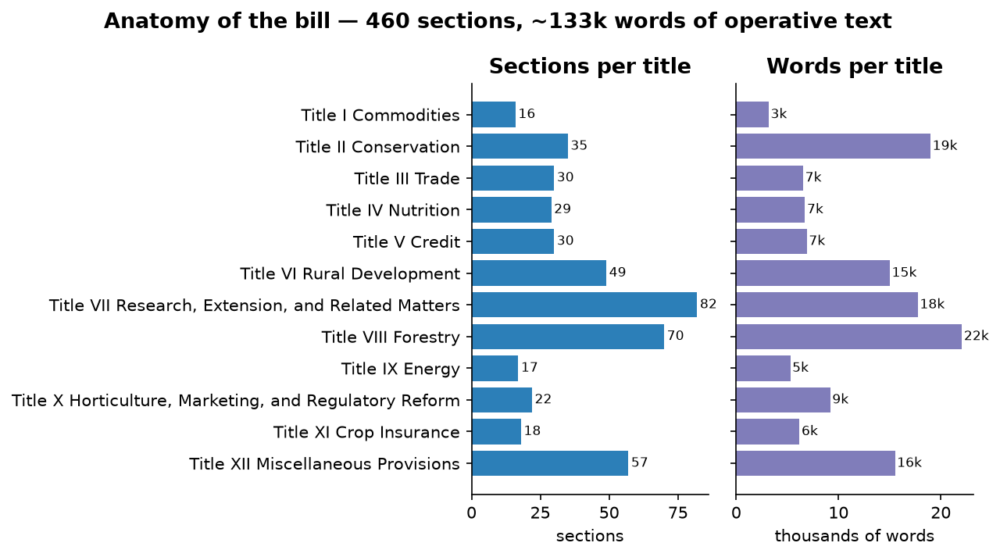
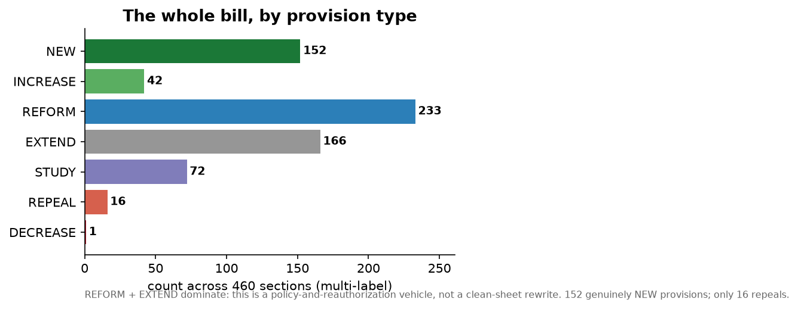
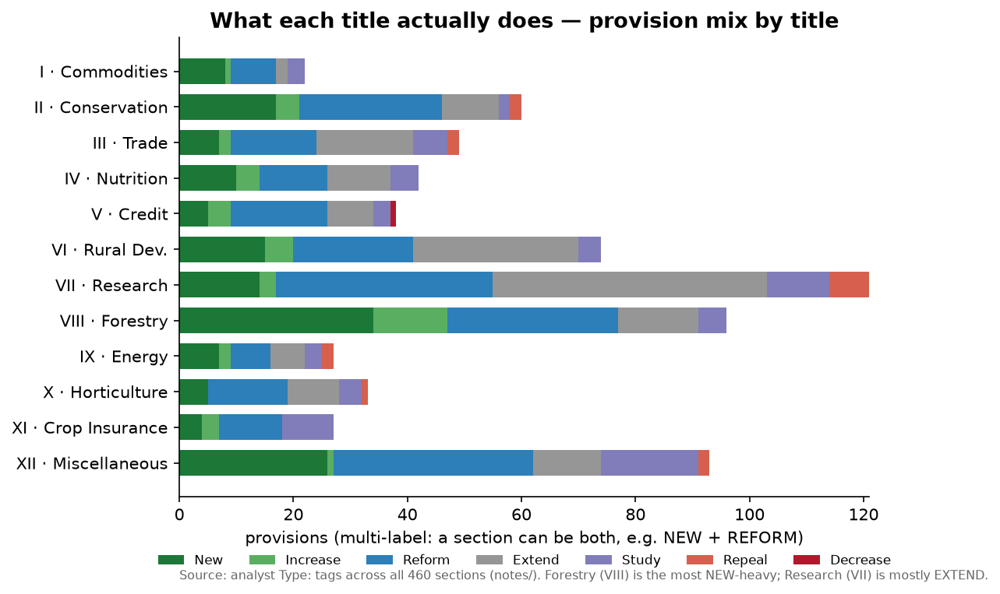
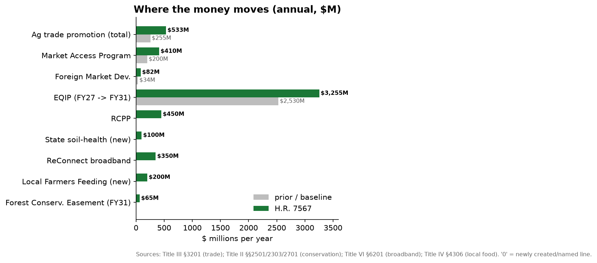
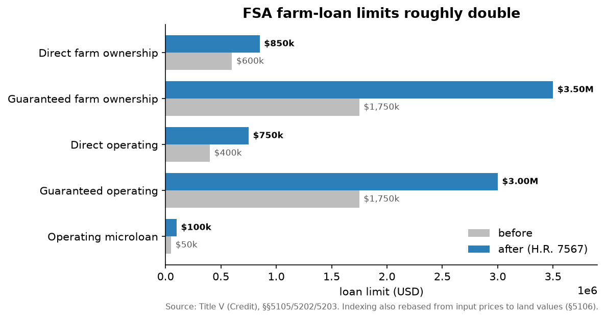
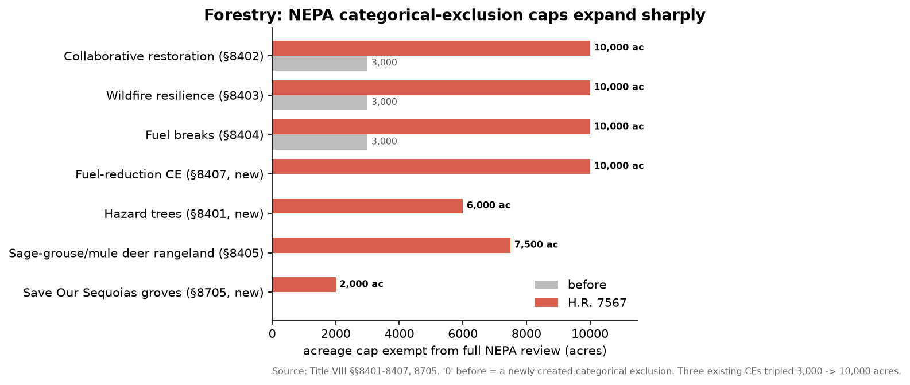

# The 2026 Farm Bill, read in full: a cross-cutting analysis

**Document analyzed:** *Farm, Food, and National Security Act of 2026* — **H.R. 7567**, **Engrossed-in-House (as passed) text**, dated **April 30, 2026** (GovInfo package `BILLS-119hr7567eh`). Passed the House **224–200**. CBO scored the underlying bill at roughly **$390 billion** over the budget window. Reauthorizes USDA programs through **FY2031**.

**Method.** The full engrossed text (~141,000 words) was split into its 12 statutory titles (460 sections) and each title was read in full, section by section, by a dedicated analyst that produced verbatim structured notes (see `notes/`). This document synthesizes those 12 note-sets. Every dollar figure, acreage cap, and date below traces to a specific section captured in the notes; section citations are given inline.

---

## At a glance — the bill in six charts

*(Figures are regenerated from the notes by `tools/build_farmbill_figures.py`. The first two are tallied directly from the analysts' `Type:` tags across all 460 sections; the rest are transcribed from the cited sections.)*

**Anatomy.** Twelve titles, 460 sections, ~133k words of operative text. Research (VII), Conservation (II), Rural Development (VI), Forestry (VIII), and Miscellaneous (XII) carry the bulk of the sections.

**What the bill does.** Across all 460 sections, **REFORM (233)** and **EXTEND (166)** dominate, with **152 genuinely NEW** provisions and only **16 repeals** — this is a policy-and-reauthorization vehicle, not a clean-sheet rewrite. But the *mix varies sharply by title*: Forestry (VIII) is the most NEW-heavy (new authorities and categorical exclusions), Research (VII) is overwhelmingly EXTEND (reauthorize-and-move-on), and Crop Insurance (XI) leans on STUDY mandates.

**Where the money moves.** The biggest affirmative dollar moves are trade promotion (MAP/FMD, near-doubled), the EQIP ramp to $3.255B by FY31, and a set of newly-funded conservation, broadband, and local-food lines.

**Farm credit.** FSA loan limits roughly double across the board, with indexing rebased from input prices to land values.

**Forestry.** The bill's most environmentally consequential numbers: three existing NEPA categorical exclusions tripled from 3,000 to 10,000 acres, plus new CEs.

### Two things the charts can't show

**The reconciliation split** — why the "farm bill" looks thin where you'd expect it to be thick:

| Farm-bill function | Where it was actually decided | In H.R. 7567? |
|---|---|---|
| SNAP benefit levels, work requirements, Thrifty Food Plan | 2025 reconciliation (P.L. 119-21) | **No** — only administrative/integrity tweaks |
| Commodity reference prices, PLC/ARC, base acres | 2025 reconciliation (P.L. 119-21) | **No** — absent from Title I |
| Conservation, credit, trade, forestry, rural dev, research, energy, horticulture, crop insurance, misc. | This bill | **Yes** — the policy reauthorization |

**The national-security throughline** — the same handful of statutory hooks recur across nine titles:

| Mechanism | Where | Target |
|---|---|---|
| Foreign-adversary farmland ban + AFIDA overhaul + USDA on CFIUS | XII §§12301–12306 | PRC/Russia/DPRK/Iran land buyers |
| "Foreign entity of concern" component/supplier screen (CHIPS Act defn.) | IX §9012 (solar), VI §6302 (precision-ag), X §10006 (GE microbes) | China-linked supply chains |
| Research-collaboration ban with countries of concern | VII §§7608, 7614 | China/Russia ag research |
| Trade enforcement (WTO vs. India; EU "common names"; Argentine beef) | III §§3202, 3311, 3402 | EU GIs, India, Argentina |
| Buy-American 95% + China/Russia poultry & seafood ban | IV §4302 | imported school-meal inputs |
| Food/ag critical-infrastructure risk assessments + IC detailees | XII §12201 | domestic resilience |

---

## 1. The single most important framing fact: this is the *second half* of a two-part farm bill

The biggest analytical key to this document is what is **missing** from it.

A normal farm bill's center of gravity is **Title I (Commodities)** — reference prices, Price Loss Coverage / Agricultural Risk Coverage, base acres, marketing loan rates — and **Title IV (Nutrition/SNAP)**. In this bill, **both of those titles are unusually hollow on exactly those marquee items**:

- **Title I contains no reference prices and no PLC/ARC/base-acre/marketing-loan changes at all** (notes/00). It is instead a disaster-and-dairy title.
- **Title IV contains none of the SNAP changes that dominated the political debate** — no Thrifty Food Plan cost-neutrality cap, no ABAWD/work-requirement expansion, no broad-based-categorical-eligibility or immigrant-eligibility restriction, no state cost-share of benefits, no SNAP-Ed cut (notes/03). Its substance is administrative integrity plus several *expansions*.

That is not an accident or an omission in the text. The commodity reference-price increases and the SNAP cuts were **already enacted separately in the 2025 budget-reconciliation law (P.L. 119-21)**, whose agriculture title made the changes to nutrition assistance and farm income support that are normally the heart of a farm bill. H.R. 7567 is therefore best understood as the **"skinny" reauthorization of everything reconciliation could not or did not carry** — the policy (non-mandatory-money) provisions and the titles outside reconciliation's reach.

**Why this matters for reading the bill:** the politically explosive money fights (SNAP, commodity supports) are *done elsewhere*. What remains in H.R. 7567 is where this Congress put its **discretionary policy priorities** — and those priorities cluster, overwhelmingly, around three themes: **national security, trade expansion, and deregulation of land/resource management.** The name of the Act is the tell.

---

## 2. "National Security" is a literal, pervasive organizing principle — not branding

Prior farm bills are not titled "…and National Security." This one is, and the phrase pays off in concrete provisions threaded through **nine of the twelve titles**. This is the most genuinely novel feature of the 2026 bill relative to its predecessors.

**Foreign ownership of U.S. farmland (Title XII, Subtitle C — the densest cluster):**
- AFIDA overhaul: new civil-penalty tiers for false filings (≥5%–≤25% of value), **public naming of penalized filers**, and AFIDA↔CFIUS information-sharing (§12301).
- A new SES **"Chief of Operations of Investigative Actions"** — effectively a counterintelligence office for agricultural land — coordinating with DOJ/FBI/DHS/Treasury/NSC (§12303).
- A consolidated **foreign-land-ownership database** (§12304), repealing the 2023 appropriations-rider version.
- **USDA seated on CFIUS** for ag-land/ag-biotech/ag-industry transactions, with mandatory referral of PRC/DPRK/Russia/Iran deals (§12305).
- An outright **presidential-directed ban on purchases of ag land by foreign adversaries and state sponsors of terrorism** and anyone "affiliated with" them (§12306).

**"Foreign adversary / foreign entity of concern / trusted supplier" screens** (all keyed to the CHIPS Act of 2022 definitions, 42 U.S.C. 19237) appear on:
- precision-agriculture interconnectivity standards (Title VI §6302),
- USDA funding for **solar components** — no funding if the panel components are made by a foreign entity of concern (Title IX §9012(e)),
- the **GE-microorganism interstate-movement pilot** — applicants tied to a "country of concern" are barred (Title X §10006),
- USDA research collaboration — a flat prohibition on **vertebrate-animal research conducted in or with China, Russia, or other countries of concern** (Title VII §7614), plus CHIPS-Act research-security compliance on all new interagency R&D MOUs (§7608).

**Trade as economic statecraft (Title III):**
- A statutorily-directed **WTO dispute against India's minimum price supports** (§3311),
- the **"common names" fight against EU geographical indications** — Congress enumerates the generic terms (parmesan, feta, prosciutto, chablis, IPA…) U.S. exporters may use and orders USTR/USDA to defend them (§3202),
- defensive postures on **seasonal produce imports** (§3203), **USMCA modification impacts** (§3401), and **expanded Argentine beef imports** (§3402).

**Supply-chain / homeland-security hardening:**
- USDA Office of Homeland Security gets **biennial food-and-agriculture critical-infrastructure risk assessments** and authority to detail intelligence-community personnel (Title XII §12201).
- School meals must be **≥95% domestic**, with a hard **ban on poultry and seafood from China or Russia** (Title IV §4302).
- A presidential **"priority objective"** to strengthen domestic production of food-ingredient commodities (read as sugar-industry protective; Title I §1010).

The throughline: agriculture is reframed as critical infrastructure and a vector of great-power competition (chiefly with China). This is the bill's distinctive ideological signature.

---

## 3. Where the money actually moves

Because the big mandatory commodity/SNAP money was set in reconciliation, the affirmative spending *in this bill* is concentrated in a handful of places. The clearest increases:

| Area | Move | Section |
|---|---|---|
| **Ag trade promotion** | Total Ag Trade Act funding **$255M → $533M/yr** (FY28+); **MAP floor ~$200M → ~$410M**, **FMD ~$34.5M → ~$82M** — the largest sustained MAP/FMD increase in decades | III §3201 |
| **Conservation (EQIP)** | EQIP ramps **$2.53B (FY27) → $3.255B (FY31)**; **RCPP fixed $450M/yr**; **new $100M/yr** State/Tribal soil-health grants; new Forest Conservation Easement Program $25M→$65M/yr; feral-swine control permanent at **$150M** | II §2501, §2303, §2701, §2402 |
| **Farm credit (FSA loan limits)** | Direct farm-ownership **$600k→$850k**; guaranteed FO **$1.75M→$3.5M**; direct operating **$400k→$750k**; guaranteed OL **$1.75M→$3M**; microloans **$50k→$100k**; indexing rebased to land values | V §5105, §5202, §5203, §5106 |
| **Rural broadband** | ReConnect made **permanent at $350M/yr**, speed floor raised 25/3 → **50/25 Mbps** | VI §6201 |
| **Specialty-crop disaster** | New **permanent** Specialty Crop Emergency Assistance Framework, payment floor **"not less than $900,000"** for farming-dominant entities | I §1003 |
| **Local food purchasing** | New **Local Farmers Feeding Our Communities** program, **$200M/yr** FY27–31 (~$1B), LFPA-style | IV §4306 |
| **Crop insurance** | Major **expansion of subsidized products** (oilseeds/pulses/sugar/blueberries revenue, wine-grape smoke, mushrooms…), and beginning-farmer premium assistance extended to **veterans** (eligibility 5→10 yrs) | XI §11014, §11007 |

Smaller but notable new authorizations: heirs'-property legal services **$60M/yr** (V §5109), dairy nutrition incentives **$20M→$50M** and HFFI **$125M→$135M** (IV §4305, §4307), $50M/yr tree-planting (IX §9017), $30M/yr specialty-crop mechanization within SCRI (VII §7305), $7.5M/yr organic-transition research (VII §7213).

**The few hard cuts/repeals are small and surgical:** an $18M rescission of unobligated biorefinery balances (IX §9003); repeal of three small energy/education programs (Biodiesel Fuel Education, Carbon Utilization & Biogas Education — IX §9006/§9010); a freeze of crop-insurance A&O reimbursement at 2026 levels, a real-terms decline for insurers over time (XI §11009). There is **no broad austerity** in this text — the austerity, to the extent it exists in the 2025–26 farm-policy package, lives in the reconciliation law.

---

## 4. Deregulation of land, forests, and chemicals is the second-strongest theme — and it lives *outside* the conservation title

Title II (Conservation) is, somewhat surprisingly, **not** where the environmental fights are. It is a fairly conventional 5-year reauthorization that even *adds* programs (soil health, forest easements, wildlife-corridor cost-share) and, notably, **contains no rescission or rollback of Inflation Reduction Act conservation money** anywhere in its text (notes/01). The deregulatory energy is instead concentrated in **Forestry (VIII)**, **Horticulture/Regulatory Reform (X)**, and **Miscellaneous (XII)**:

**Forestry (Title VIII) — the most environmentally consequential title:**
- **NEPA categorical exclusions tripled** from 3,000 to **10,000 acres** for collaborative restoration (§8402), wildfire resilience (§8403), and fuel breaks (§8404); a new fuel-reduction CE up to **10,000 acres** (§8407); a new hazard-tree CE at 6,000 acres (§8401).
- **ESA Section 7 carve-outs:** no required reconsultation on Forest Service/BLM land-use plans when new species are listed or new information emerges, "notwithstanding any other provision of law" (§8411); a new electric-utility ROW CE that is **exempt from ESA §7 and the National Historic Preservation Act entirely** (§8406); communications-use facilities fully exempt from NEPA/NHPA (§8509).
- A **statutory congressional "emergency"** declared for 7 years across named Sierra Nevada forests and **three national parks** (Save Our Sequoias Act, §8705), with its own NEPA CE and stewardship-contracting pushed into the parks (§8710).
- **$220M in mill loan guarantees** explicitly tied to expanding timber/vegetation removal near federal land (§8421); no-appraisal timber disposal in "extreme risk" events (§8416).

**Pesticides / biotech (Title X, Regulatory Reform):**
- Plant **biostimulants, nutritional chemicals, and gene-pool-derived plant-incorporated protectants exempted from FIFRA** (§10201);
- USDA and a mandatory **economic-cost analysis** inserted into EPA's pesticide risk-mitigation and **ESA** decisions (§10202–§10204);
- a **Paperwork Reduction Act waiver** for the pesticide-use survey (§10211);
- a **5-year safe harbor stripping courts of authority to enjoin** aerial wildfire-retardant discharges under the Clean Water Act (§10212).

**Miscellaneous (Title XII):**
- **Farm equipment exempted from Clean Air Act** nonroad-engine standards (§12422);
- **Forest biomass legislatively declared carbon-neutral** (GHG/carbon intensity "not greater than zero") for USDA purposes (§12409).

**One striking counter-current:** Title IX (Energy) **restricts** USDA funding for **ground-mounted solar that converts farmland** (§9012), with acreage thresholds, conservation-plan and full-repayment requirements, and the foreign-component ban. This is deregulation's mirror image — a *new* federal restriction — but it fits the bill's logic perfectly: it protects farmland *and* targets Chinese solar supply chains, pushing toward agrivoltaic co-location over conversion. Renewable energy is welcomed only when it neither displaces production nor depends on adversary supply chains.

---

## 5. Modernization signature: "precision agriculture" everywhere

If national security is the bill's geopolitics, **precision agriculture is its industrial policy.** The term is freshly defined and then deliberately embedded across titles:
- **Conservation:** defined in statute, made a state-determined high-priority practice, with EQIP/CSP cost-share **up to 90%** (II §2001, §2202, §2302).
- **Research:** built into AGARDA (lifespan extended 5→13 yrs), the rebuilt Centers of Excellence (min. centers 3→8), AFRI, a $30M/yr SCRI mechanization-and-automation carve-out, and the DOD research MOU (VII §7125, §7208, §7305, §7503, §7608).
- **Credit:** new beneficiary category for conservation loans to adopt precision-ag tech (V §5104).
- **Rural development:** USDA-NIST-FCC interconnectivity standards with the foreign-adversary screen (VI §6302).

Pair this with the new **USDA Office of Biotechnology Policy** (X §10213), the GE-microorganism pilot (X §10006), the **Agricultural Innovation Corps** (VII §7609), and SAF mainstreaming (IX §9001/§9013), and the bill's modernization posture is coherent: subsidize automation and ag-tech, build the standards and offices to govern it, and wall it off from China.

---

## 6. Constituency map: who wins, who loses

**Clear winners**
- **Specialty-crop / fruit-and-vegetable growers** — the bill's most-favored constituency: new permanent disaster framework with $900k+ floors (I), crop-insurance product expansion + advisory committee (XI), specialty-crop mechanization research (VII), block-grant no-match rule (X), import-defense working group (III).
- **Agricultural exporters** — MAP/FMD roughly doubled; aggressive trade enforcement (III).
- **Larger and land-buying farm operations** — FSA loan limits roughly doubled; land-value indexing (V).
- **Timber industry / Forest Service operations / electric utilities** — NEPA/ESA/NHPA relief, mill loan guarantees (VIII).
- **Dairy** — permanent-law suspension, indemnity/promotion extensions, processing-cost data, whole milk in schools, $50M dairy incentives (I, IV, XII).
- **1890 land-grant (HBCU) and 1994 Tribal institutions** — funding floors raised 20%→40% / 30%→40% with match enforcement (VII §7110/§7114/§7508) — a notable bipartisan-equity win embedded in a Republican-led bill.
- **Veterans entering agriculture** — crop-insurance assistance (XI), "Armed to Farm" (VI), education grants (VII).
- **Domestic solar-component makers, biotech firms with multiple sites, SAF feedstock growers, animal-welfare advocates** (greyhound-racing ban, research-animal adoption — XII).
- **Tobacco** — restored to CCC eligibility (I §1012), a symbolic reversal.

**Clear losers / disfavored**
- **ESA-listed species and the NEPA/judicial-review process** (VIII, X).
- **China and Russia** — barred across farmland, research, solar supply chains, and school-meal sourcing.
- **States with animal-welfare production mandates** — Prop 12 / Question 3 style laws preempted for slaughter livestock and dairy (XII §12006) — though **eggs are pointedly excluded**, narrowing the preemption.
- **USAID** — loses Food for Peace administration wholesale to USDA (III §3101).
- **Crop-insurance companies (AIPs)** on the A&O freeze (XI §11009); **EU geographical-indication holders** (III §3202); **Argentine beef and Indian price-support regimes** (III).
- **Community-based / school-based beginning-farmer training orgs** — FOTO priorities reoriented toward farm-business-management (VII §7210).

**Notable equity threads that survive** despite the bill's politics: heirs'-property legal services and relending (V §5109, VII §7610, XII §12404), socially-disadvantaged/underserved targeting across conservation and rural-development priority language, the revived Commission on Farm Transitions explicitly studying barriers for **women and historically underserved farmers** (XII §12401), and a National Appeals Division **burden-of-proof shift onto the agency** that helps all producer-appellants (XII §12203).

---

## 7. Culture-and-process markers worth flagging

- **Dietary Guidelines overhaul (IV §4308):** moves to a 10-year cycle, adds APA rulemaking and an Independent Advisory Board, and — most pointedly — an **"exclusion list"** barring the guidelines from considering socioeconomic status, race, religion, ethnicity, culture, taxation, food labeling, or agricultural production practices. This is a quietly significant, ideologically-loaded process reform with downstream effect on every federal feeding program keyed to the DGA.
- **Administrative centralization in USDA:** Food for Peace pulled from USAID (III); FCA declared the **"sole and independent regulator"** of the Farm Credit System with an express-override clause (V §5504); new Offices of **Seafood** (XII §12419, extending FSA "farmer" loans to commercial fishing — §12420) and **Biotechnology Policy** (X §10213).
- **Government-shutdown continuity:** commodity and sugar loan servicing deemed Antideficiency-Act "safety of life/property" functions (I §1008); circuit-rider and other programs given lapse-in-appropriations continuity (VI §6402).
- **A flood of new reports/studies/working groups** — dozens, on everything from shrimp trade to NASS modernization to 1944-Water-Treaty losses in Texas and Arizona. Many are placeholders for future legislating; a few (e.g., the organic risk-based-oversight study, X §10109) come with **delegated rulemaking authority** to act on the findings.
- **Drafting quality:** the engrossed text carries several visible errors the analysts flagged — a "9081"/"9801" U.S.C. miscite (I §1002), a greyhound-penalty cross-reference to "paragraphs (1) through (5)" where only (1)–(4) exist (XII §12008), and header typos ("United Sates," VII §7611). Minor, but real, and worth noting in any authoritative read.

---

## 8. Bottom line

H.R. 7567 as passed is **not** the sweeping safety-net rewrite the "farm bill" label implies — that work was largely done in 2025 reconciliation. What the House actually passed on April 30, 2026 is a **policy-and-modernization vehicle organized around national-security competition with China, a major expansion of agricultural trade promotion, deregulation of forest and chemical management, and a tech-forward "precision agriculture" industrial policy** — with the traditional commodity and nutrition machinery merely extended through FY2031 rather than reopened.

Read in context, the document's center of gravity has **shifted from the historic farm-bill axis (commodity supports ↔ SNAP) toward a new axis (food-system security ↔ export expansion ↔ resource-management deregulation).** Whether that shift survives the Senate — which had not acted as of this writing (mid-June 2026) and where the Food-for-Peace transfer, the Prop-12 preemption, the forestry ESA/NEPA waivers, and the Dietary Guidelines exclusion list are all plausible flashpoints — is the open question. But as a statement of the House majority's agricultural priorities, the title says it plainly: **farm, food, and national security**, in that increasingly inseparable order.

---

*Per-title verbatim notes supporting every claim above are in [`notes/`](notes/). Source text and the title-by-title split are in [`source/`](source/). Generated from the engrossed text `BILLS-119hr7567eh` (GovInfo).*
